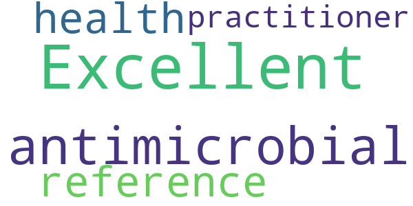
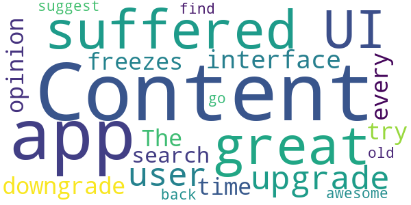

# Bugs & Drugs 2.0
App version ``2.5.104``

Analyzed with [covid-apps-observer](http://github.com/covid-apps-observer) project, version ``0.1``

## App overview
| | |
|-------------------------|-------------------------| 
| **Name**&nbsp;&nbsp;&nbsp;&nbsp;&nbsp;&nbsp;&nbsp;&nbsp;&nbsp;&nbsp;&nbsp;&nbsp;&nbsp;&nbsp;&nbsp;&nbsp;&nbsp;&nbsp;&nbsp;&nbsp;&nbsp;&nbsp;&nbsp;&nbsp;&nbsp;&nbsp;&nbsp;&nbsp;&nbsp;&nbsp;&nbsp;&nbsp;&nbsp;&nbsp;&nbsp;&nbsp;&nbsp;&nbsp;&nbsp;&nbsp;  | Bugs & Drugs 2.0 |
| **Unique identifier** | ca.albertahealthservices.bugsanddrugs2 |
| **Link to Google Play** | [https://play.google.com/store/apps/details?id=ca.albertahealthservices.bugsanddrugs2](https://play.google.com/store/apps/details?id=ca.albertahealthservices.bugsanddrugs2) |
| **Summary**  | Bugs &amp; Drugs is an antimicrobial reference for health care practitioners. |
| **Privacy policy** | [http://bugsanddrugs.ca](http://bugsanddrugs.ca) |
| **Latest version** | 2.5.104 |
| **Last update** | 2020-12-04 18:46:13 |
| **Recent changes** | Updated and repaired search handling on Android |
| **Installs**  | 1,000+ |
| **Category** | Medical |
| **First release** | Mar 27, 2020 |
| **Size**  | 9.4M |
| **Supported Android version**  | 4.4 and up |

### Description
> We are very pleased to release this new version of Bugs & Drugs.  The content and delivery method have been updated. We provide you the latest content which will be dynamically updated for you in this new app. 
 Our intention had been to follow industry standards and move to a yearly subscription model for this new release, but we have decided to delay that change and instead make this app free to everyone for the next 3 months. We hope this will be of some small help during these difficult and unprecedented times.
 Bugs & Drugs is a comprehensive, evidence-based reference for physicians, dentists, pharmacists, nurse practitioners and other health care practitioners.
 Bugs & Drugs provides clinicians with the latest recommendations for the appropriate use of antimicrobials and the optimal treatment and prevention of infectious diseases. It is also a key component of antimicrobial stewardship efforts. This reference can optimize patient outcomes and minimize the unintended consequences of antimicrobial use, including toxicity, superinfections, resistance, and unnecessary treatment costs.
  
 Bugs & Drugs is divided into six sections:
  
 1. Antibiotics
 2. Treatment recommendations for infections in children and adults (including selected ophthalmic, fungal, and parasitic infections), 
 3. Recommendations for the prevention of infections,
 4. Treatment and prophylaxis of dental infections, 
 5. Infections in Pregnancy and 
 6. Microbiology
  
 The Bugs & Drugs app is well suited for healthcare practitioners looking for an evidence-based mobile reference and provides therapeutic options in a clear, concise manner.
  
 Once installed, you do not need internet access to use the content. Internet access is only required for initial installation of the app and to receive updates.
  
 The content is prepared by Dr. Edith Blondel-Hill (Medical Microbiologist/Infectious Diseases Specialist, Kelowna General Hospital) and Ms. Susan Fryters (Antimicrobial Stewardship/Infectious Diseases Pharmacist, Alberta Health Services) with the help of over 40 reviewers with expertise in infectious diseases, infection prevention & control, microbiology, pharmacy, and Public Health.

### User interface
The developers of the app provide the following screenshots in the Google play store.
| | | |
|:-------------------------:|:-------------------------:|:-------------------------:|
 |   |   |   | 
 |  

## Development team
In the following we report the main information provided by the development team in the Google play store.

| | |
|-------------------------|-------------------------|
| **Developer**  | Alberta Health Services |
| **Website**  | [http://bugsanddrugs.ca](http://bugsanddrugs.ca) |
| **Email** | bugsanddrugs@albertahealthservices.ca |
| **Physical address**  | [10101 Southport Rd SW Calgary Alberta T3A 5H4](https://www.google.com/maps/search/10101%20Southport%20Rd%20SW%20Calgary%20Alberta%20T3A%205H4) (Google Maps) |
| **Other developed apps**  | [https://play.google.com/store/apps/developer?id=Alberta+Health+Services](https://play.google.com/store/apps/developer?id=Alberta+Health+Services) |

## Android support

| | |
|-------------------------|-------------------------|
| **Declared target Android version**  | Pie, version 9 (API level 28) |
| **Effective target Android version**  | Pie, version 9 (API level 28) |
| **Minimum supported Android version**  | KitKat, version 4.4 - 4.4.4 (API level 19) |
| **Maximum target Android version**  | - |

The larger the difference between the minimum and maximum supported Android versions, the better. A larger difference means a wider audience. For example, old phones have a very low Android version, so a high minimum supported Android version means that the app cannot be used by users with old phones, thus leading to accessibility problems. 

## Requested permissions

In the following we report the complete list of the permissions requested by the app. 

| **Permission** | **Protection level** | **Description** | 
|-------------------------|-------------------------|-------------------------|
 **android.permission ACCESS_NETWORK_STATE** | Normal | Allows applications to access information about networks. 
 **android.permission INTERNET** | Normal | Allows applications to open network sockets. 
 **android.permission WRITE_EXTERNAL_STORAGE** | :warning:**Dangerous** | Allows an application to write to external storage. 
 **com.android.vending BILLING** | - | - 

## Mentioned servers

| **Server** | **Registrant** | **Registrant country** | **Creation date** | 
|-------------------------|-------------------------|-------------------------|-------------------------|
 | gstatic.com | Google LLC | :us: US | 2008-02-11 15:31:25 |

## Security analysis 

Below we report the main security warnings raised by our execution of the [Androwarn](https://github.com/maaaaz/androwarn) security analysis tool.

**Connection interfaces exfiltration**
> - This application reads details about the currently active data network 

**Code execution**
> - This application loads a native library: 'sqlc-native-driver' 

## User ratings and reviews

Below we provide information about how end users are reacting to the app in terms of ratings and reviews in the Google Play store.

### Ratings

The Bugs & Drugs 2.0 app has been installed by more than **1000** times. At this time, **-** rated the app and its average score is **0.0**. Below we show the distribution of the ratings across the usual star-based rating of Google Play

:star::star::star::star::star:: 0

:star::star::star::star:: 0

:star::star::star:: 0

:star::star:: 0

:star:: 0

### Reviews 

#### 5-star reviews

> Excellent antimicrobial reference for health practitioner.  :date: __2021-06-03 20:45:10__

#### 4-star reviews

No recent reviews available with 4 stars.

#### 3-star reviews

No recent reviews available with 3 stars.

#### 2-star reviews

No recent reviews available with 2 stars.

#### 1-star reviews

> Content is great but the UI had suffered since 2.0 upgrade (user interface downgrade in my opinion). The app freezes every time I try to search content. I suggest find go back to the old app which was awesome!  :date: __2021-03-16 21:48:04__

