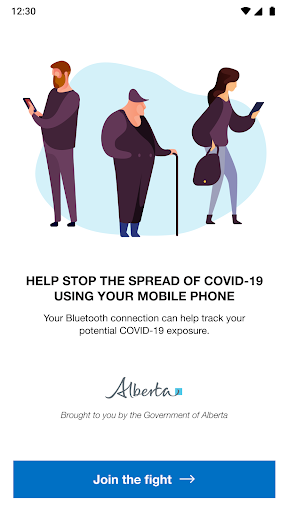
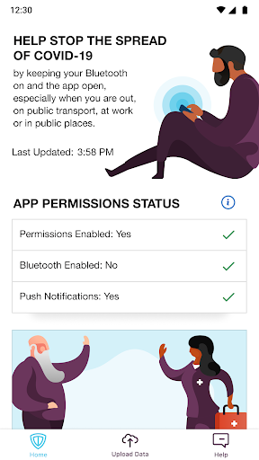
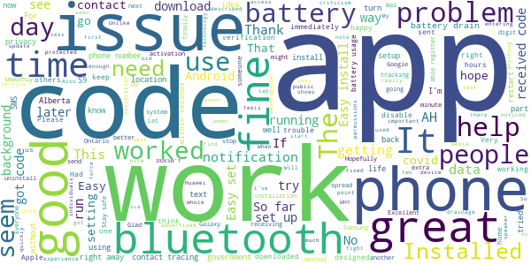
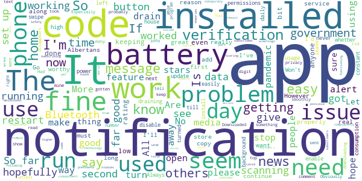
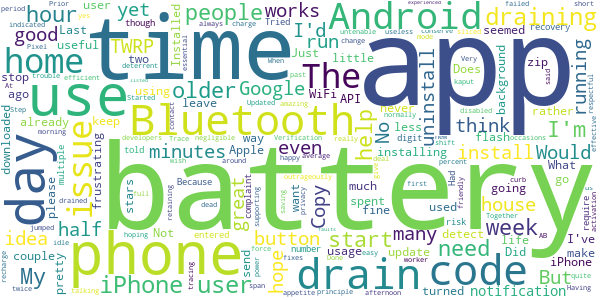
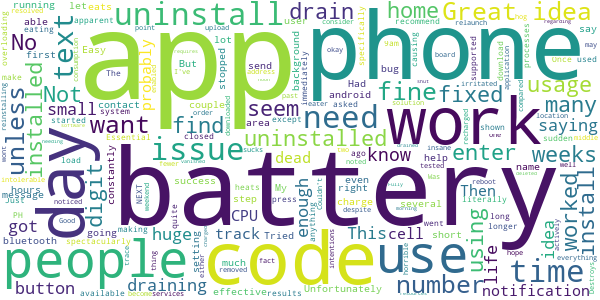
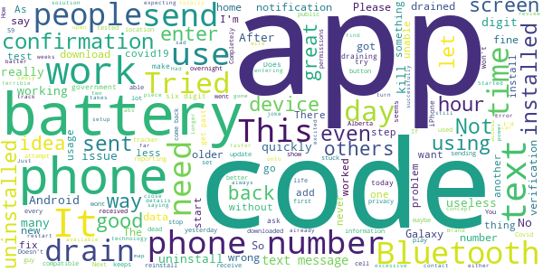

# ABTraceTogether
App version ``1.1.0``

Analyzed with [covid-apps-observer](http://github.com/covid-apps-observer) project, version ``0.1``

## App overview
| | |
|-------------------------|-------------------------| 
| **Name**&nbsp;&nbsp;&nbsp;&nbsp;&nbsp;&nbsp;&nbsp;&nbsp;&nbsp;&nbsp;&nbsp;&nbsp;&nbsp;&nbsp;&nbsp;&nbsp;&nbsp;&nbsp;&nbsp;&nbsp;&nbsp;&nbsp;&nbsp;&nbsp;&nbsp;&nbsp;&nbsp;&nbsp;&nbsp;&nbsp;&nbsp;&nbsp;&nbsp;&nbsp;&nbsp;&nbsp;&nbsp;&nbsp;&nbsp;&nbsp;  | ABTraceTogether |
| **Unique identifier** | ca.albertahealthservices.contacttracing |
| **Link to Google Play** | [https://play.google.com/store/apps/details?id=ca.albertahealthservices.contacttracing](https://play.google.com/store/apps/details?id=ca.albertahealthservices.contacttracing) |
| **Summary**  | This app is from the Government of Alberta to augment manual contact tracing. |
| **Privacy policy** | [https://alberta.ca/ABTraceTogetherPrivacy](https://alberta.ca/ABTraceTogetherPrivacy) |
| **Latest version** | 1.1.0 |
| **Last update** | 2020-06-01 21:45:25 |
| **Recent changes** | Minor Bug Fixes |
| **Installs**  | 50,000+ |
| **Category** | Health & Fitness |
| **First release** | Apr 30, 2020 |
| **Size**  | 9.5M |
| **Supported Android version**  | 8.0 and up |

### Description
> This app is being brought to you by the Government of Alberta.
 This app is intended for ages 14+.
 Some of the key benefits of this app are to:
 • Augment our current contact tracing efforts to provide guidance and care to those who are or may be infected
 • Help keep Albertans safe by limiting the spread of COVID-19 through more individuals self-isolating earlier
 The app is most effective if it reaches a strong penetration of usage among Albertans, which means the more people that use the app, the better the app works.
 Once a user registers their phone number with the app, the app uses bluetooth to log contact with other individuals who have the app when that contact is within approximately 2 meters. If a user tests positive for COVID-19, they will be contacted by an Alberta Health Service Contact Tracer, and asked to voluntarily upload their data to Alberta Health Services so that anyone the user came into close contact with over the previous 14 days can be notified.
 Geolocation data is not collected by the app or by Alberta Health Services. The Bluetooth exchange ID log data collected is stored locally in your phone in an encrypted form. This data will not be accessed by Alberta Health Services unless and until you choose to upload it as a result of being diagnosed with COVID-19. Mobile numbers or any other personal information are not revealed to other app users.
 Personal Information collected:
 - Phone number
 Permissions required:
 - Bluetooth enabled
 - Location 
 - Push notifications
 Copyright 2020 Government of Alberta

### User interface
The developers of the app provide the following screenshots in the Google play store.
| | | |
|:-------------------------:|:-------------------------:|:-------------------------:|
 |   |   |   | 

## Development team
In the following we report the main information provided by the development team in the Google play store.

| | |
|-------------------------|-------------------------|
| **Developer**  | Government of the Province of Alberta |
| **Website**  | [http://alberta.ca/ABTraceTogether](http://alberta.ca/ABTraceTogether) |
| **Email** | ABTraceTogetherSupport@gov.ab.ca |
| **Physical address**  | [3720 - 76 Avenue Edmonton, AB T6B 2N9](https://www.google.com/maps/search/3720%20-%2076%20Avenue%20Edmonton,%20AB%20T6B%202N9) (Google Maps) |
| **Other developed apps**  | [https://play.google.com/store/apps/developer?id=Government+of+the+Province+of+Alberta](https://play.google.com/store/apps/developer?id=Government+of+the+Province+of+Alberta) |

## Android support

| | |
|-------------------------|-------------------------|
| **Declared target Android version**  | Android10, version 10 (API level 29) |
| **Effective target Android version**  | Android10, version 10 (API level 29) |
| **Minimum supported Android version**  | Oreo, version 8.0.0 (API level 26) |
| **Maximum target Android version**  | - |

The larger the difference between the minimum and maximum supported Android versions, the better. A larger difference means a wider audience. For example, old phones have a very low Android version, so a high minimum supported Android version means that the app cannot be used by users with old phones, thus leading to accessibility problems. 

## Requested permissions

In the following we report the complete list of the permissions requested by the app. 

| **Permission** | **Protection level** | **Description** | 
|-------------------------|-------------------------|-------------------------|
 **android.permission ACCESS_BACKGROUND_LOCATION** | :warning:**Dangerous** | Allows an app to access location in the background. 
 **android.permission ACCESS_FINE_LOCATION** | :warning:**Dangerous** | Allows an app to access precise location. 
 **android.permission ACCESS_WIFI_STATE** | Normal | Allows applications to access information about Wi-Fi networks. 
 **android.permission BLUETOOTH** | Normal | Allows applications to connect to paired bluetooth devices. 
 **android.permission BLUETOOTH_ADMIN** | Normal | Allows applications to discover and pair bluetooth devices. 
 **android.permission FOREGROUND_SERVICE** | Normal | Allows a regular application to use Service.startForeground. 
 **android.permission INTERNET** | Normal | Allows applications to open network sockets. 
 **android.permission RECEIVE_BOOT_COMPLETED** | Normal | Allows an application to receive the Intent.ACTION_BOOT_COMPLETED that is broadcast after the system finishes booting. 
 **android.permission REQUEST_IGNORE_BATTERY_OPTIMIZATIONS** | Normal | Permission an application must hold in order to use Settings.ACTION_REQUEST_IGNORE_BATTERY_OPTIMIZATIONS. 

## Mentioned servers

| **Server** | **Registrant** | **Registrant country** | **Creation date** | 
|-------------------------|-------------------------|-------------------------|-------------------------|
 | stackoverflow.com | Stack Exchange, Inc. | :us: US | 2003-12-26 19:18:07 |
 | google.com | Google LLC | :us: US | 1997-09-15 04:00:00 |

## Security analysis 

Below we report the main security warnings raised by our execution of the [Androwarn](https://github.com/maaaaz/androwarn) security analysis tool.

**Telephony identifiers leakage**
> - This application reads the unique device ID, i.e the IMEI for GSM and the MEID or ESN for CDMA phones 

**Connection interfaces exfiltration**
> - This application reads details about the currently active data network 
> - This application tries to find out if the currently active data network is metered 

**Suspicious connection establishment**
> - This application opens a Socket and connects it to the remote address '' on the 'N/A' port  
> - This application opens a Socket and connects it to the remote address 'Ljava/lang/StringBuilder;->toString()Ljava/lang/String;' on the ': connect, resolve' port  
> - This application opens a Socket and connects it to the remote address 'Ljava/lang/StringBuilder;->toString()Ljava/lang/String;' on the 'N/A' port  
> - This application opens a Socket and connects it to the remote address 'Ljava/net/Proxy;->type()Ljava/net/Proxy$Type;' on the 'N/A' port  
> - This application opens a Socket and connects it to the remote address 'timeout' on the 'N/A' port  

**Code execution**
> - This application loads a native library: 'authjni' 
> - This application loads a native library: 'crypto' 
> - This application loads a native library: 'uvpn' 

## User ratings and reviews

Below we provide information about how end users are reacting to the app in terms of ratings and reviews in the Google Play store.

### Ratings

The ABTraceTogether app has been installed by more than **50000** times. At this time, **427** rated the app and its average score is **3.04**. Below we show the distribution of the ratings across the usual star-based rating of Google Play

:star::star::star::star::star:: 145

:star::star::star::star:: 51

:star::star::star:: 51

:star::star:: 34

:star:: 145

### Reviews 

#### 5-star reviews

> Well designed app that has had no adverse effect on battery life! When I first got it I was force closing it when not out to conserve battery. I decided to test leaving it on 24/7 and over two days I couldn't see any extra battery consumption. I was honestly shocked and have left it on since. Also really like that this app DOESN'T use GPS only my Bluetooth to see who I've been in contact with instead of tracking my every movement.  :date: __2020-06-08 00:40:09__

> Very important and we'll designed application, privacy is protected and will help keep spread under control  :date: __2020-06-02 04:31:45__

> Very " nice " Thanks !!  :date: __2020-05-26 04:25:34__

> Installed & activated on Samsung S9 without any issues. Runs fine. There is extra battery usage, but it's tolerable for me.  :date: __2020-05-25 03:53:49__

> Amazing app, feels so good to know the government knows all. I cannot wait for the vaccine. Please increase my taxes and fund more the media.  :date: __2020-05-25 03:45:04__

> Easy to install. Not noticing any power drain and analysis agrees. Bluetooth speaker works fine at same time. Reminds me to turn bluetooth back on when I shut off for a phone call not to be via my bluetooth speaker.  :date: __2020-05-24 18:39:00__

> Great idea except for the power usage. The only way to stop is is to go into the app's app setting and "force stop" it to turn it off when I'm at home. It's easy enough to turn it back on again by tapping the app icon. But this is a hassle.You should be able to just pin it and minimize it when you need it to run in the background, and close it when your at home.  :date: __2020-05-24 10:44:48__

> Does it work in Ontario too??  :date: __2020-05-23 14:18:59__

> Seems to be working. If you don't drink the kool-aid, and stay away from Apple this works just fine. I have not even noticed any battery drain on my Android phone.  :date: __2020-05-23 02:12:06__

> Have downloaded this on both my mom's and my phone (Samsungs), and haven't had any problems. It only asks for bluetooth to be turned on and for you to enter a phone number to contact you should you encounter someone who later tests positive.  :date: __2020-05-23 02:11:24__

#### 4-star reviews

> Greetings to anyone who reads this, If the app is only getting a 3.0 (3 Stars), is there a problem with it? Please consider the following, none of which is/are (a) conspiracy theory/theories. I can say this because countless independent studies done across the world have all found these phenomena to be true. 1. Are delusional naysayers about the Covid-19 pandemic keeping the app from scoring higher by not subscribing to it? ; or 2. Is the low rating the possible result of most of the current subscribers not getting alerts, and that others - who haven't (yet) subscribed to the app - are being lulled into a false sense of safety, even complacency? ; or, 3. Is the app a bit of a lame-duck technology - on the part of the government - and the app is not functioning properly or at all? ; or, 4. Are Albertans simply complacent about the pandemic? Go into any store which has clearly defined and labelled "shopping lanes" and other forms of signage, along with PA and public service announcements exhorting shoppers to abide by the store's rules and Alberta Health's guidelines, and you'll experience first-hand what I'm talking about. Indifference, obtuse behaviour, willful or blind ignorance, etc. ; or, finally (at least for now) 5. Is the media, which continues to feed us only what is "news worthy" to it (as it has done for nearly 3 generations), the real problem? If the app is not being kept in front of viewers or in the ears of listeners, is that the reason for the low rating? The media, along with government, controls the access to news. More often than not, it's the media doing this because "news worthy" really means that which attracts and is supported by the most lucrative advertising revenue streams. As CFCN says "All the news you need to know", which translates, "All the news we want you to hear". CBC, CTV, and the American networks on cable and satellite TV are all complicit in this. I'll stop now, since I've run out of time to continue. However, I must add that if the government is truly engaged in leading Albertans out of this tragedy, it will not alter, delete, expunge, rephrase, or in any other way, edit my comments because some of them have suggested government shortcomings. I'm keeping a copy of this for my own files and for posterity. Clayton Walls, Calgary June 11, 2020 @ 1300 h MDT  :date: __2020-06-11 21:00:38__

> I think the idea is great as long as it's executed properly however there seems to be a glitch with the app as it's used 33% of my battery so far today.  :date: __2020-06-04 03:45:04__

> I noticed the last 2 days this app has been draining my battery. Use to have 45% left at bedtime, now only 10% at 1 pm. Just did the update, which I didn't know about. So hopefully it fixes this battery issue.  :date: __2020-06-03 21:54:26__

> I don't need data on to run it. And it doesn't drain my battery despite having Bluetooth on . So far so good  :date: __2020-05-23 03:41:32__

> Same as others have said, works fine, installed fine, just wish there was an on /off button for scanning. I can't turn my Bluetooth off because I wear a smartwatch, and I don't need the app when I'm not leaving my house or going anywhere that I will not be in contact with other people. It is a bit of a hindrance having to go in and out of settings all of the time to enable the app permissions, please just add a button to this app.  :date: __2020-05-23 00:18:05__

> Won't know if it works till it's needed. Hopefully never. Always has a 1 superimposed on the icon, but nothing apparent when I open the app.  :date: __2020-05-15 20:40:40__

> I was totally surprised on how much this app draws dowm my battery , worse than f-cebook app, will be definitely removed once things cool down ...  :date: __2020-05-15 00:48:59__

> Good app and hopefully it gets installed and used more. Like others are saying, it needs and off button because of the battery drain when using it at home. Most people are at home now so this should be a feature available....  :date: __2020-05-12 17:49:39__

> Installed easily and seems to work fine.  :date: __2020-05-12 00:44:52__

> No problems, but also I don't get any feedback about whether I'm near another person with the app, so I can't verify whether it's actually doing anything.  :date: __2020-05-11 18:46:13__

#### 3-star reviews

> Install was very easy. Done in under 2 minutes. App is a great idea for the times. Having said that, yes the battery drain is amazing. Started as a 5 but now a 3. I wish it was more.  :date: __2020-06-13 01:17:26__

> The principle is good and I'd really like to help by using this app but a week after installing it, my battery is drained before the afternoon is over. I have to uninstall. When the developers can make it more efficient in power usage I'd be happy to install it again  :date: __2020-06-09 23:39:11__

> I've had no complaints up until a couple of days ago when my phone indicated that AB Trace Together has been using 35.6% of my battery, while at home. I disabled Bluetooth and it didn't change or conserve the battery. My phone has been on for 20 minutes this morning and its already used 6.1% of my battery. Prior to this, battery usage was negligible. Updated it and hoping that helps.  :date: __2020-06-08 16:52:26__

> I so want to help by having the app but the battery drain is frustrating to deal with. At the start a few weeks ago it seemed like there was no issue but over the past two days, after going out twice, my battery is just kaput in an outrageously short period of time. I'm talking from full charge down to 10 percent in a span of 7 hours, of which 5 of those hours was spent being in battery saving mode and idle. I hope the update fixes this or retaining this app will be untenable.  :date: __2020-06-08 06:21:14__

> Drains battery life.  :date: __2020-06-07 11:01:03__

> Uses so much battery. I normally go through 75% battery on an average day and with this app I have to recharge half way through the day. 10 days running  :date: __2020-06-05 06:36:35__

> A little trouble with the 2 Step Verification Code.  :date: __2020-06-04 22:27:35__

> It's quite respectful of privacy, and uses very little of the battery on my Pixel 3. But please start supporting the new Google and Apple contact tracing API! Since it isn't user friendly on iPhones, less iPhone users will use it, and then it's less effective for us Android users too. What essential worker with an iPhone would leave their phone on for an 8-hour shift? I'd give it 5 stars if it wasn't such a deterrent to iPhone users.  :date: __2020-06-04 15:18:24__

> Does not send activation code.  :date: __2020-06-02 14:59:12__

> Great idea but this draining if my battery!! Very frustrating 😡  :date: __2020-05-31 22:18:36__

#### 2-star reviews

> Phone - Essential PH-1 I don't know if it's just me, but my phone heats up quite spectacularly, draining the battery. The app also has huge buttons and small text, and literally has a huge button saying NEXT----> with small text above it saying don't press unless asked to. I haven't used it long enough to get any results, but with the issues immediately apparent, I don't recommend it.  :date: __2020-06-14 06:37:14__

> This app was fine for a few weeks then all of the sudden started eating the battery life. No idea why. I had to uninstall because I was no longer making it through the work day with enough battery.  :date: __2020-06-11 11:48:28__

> Just got a notification from my cell "some apps or processes are overloading the system (CPU) and need to be closed." Then this app was specifically shown with CPU usage at 20.66%. I had to uninstalled the app.  :date: __2020-06-03 04:20:54__

> Great idea except you should probably make it available to all phones. I know a number of people who want to download the app but can't because it's not supported on their phone  :date: __2020-06-02 03:32:37__

> It was fine until 3 days ago when it went from draining 1% of my battery to >80%. Can't track anything if my phone is dead by 9am. I had to uninstall until this is fixed.  :date: __2020-05-31 02:36:09__

> I installed this app, however it was causing issues with some of my other apps and they would not load so I had to uninstall. Once I uninstalled everything else worked fine. Unfortunately the app is not going to be very effective unless more people use it and with all the issues people are having with it fewer people will be using it. I hope you are able to find a solution to those issues and relaunch an app that will be effective. I may consider reinstalling after it is fixed.  :date: __2020-05-29 22:39:00__

> Had to uninstall, this app is a battery eater.  :date: __2020-05-25 01:17:19__

> Was running fine for the first couple of weeks but in the past 2-3 days battery consumption has become intolerable.  :date: __2020-05-21 03:37:20__

> I downloaded it on my android phone and it worked okay, but the battery drain is horrible as noted by lots of other users. I was also irritated that despite the fact that they say it only uses bluetooth, location services had to be enabled as well or it wont work. Uninstalled it.  :date: __2020-05-20 13:44:22__

> Destroys your battery. I now have to charge my battery 3 times a day because of this app. It's insane how much battery it uses.  :date: __2020-05-19 07:57:16__

#### 1-star reviews

> You may want to look at power usage. Depending on how close I am to another phone? my phone chews through its battery. Sitting with my wife at home and in less than 5 hours, it ate through 45% of my battery. Prior to the installation of ABTraceTogether, I never used my battery up in a day; sometimes would get two days. It is also heating my phone up due to excessive battery usage. Please resolve this issue so I do not need to uninstall the app.  :date: __2020-06-13 22:03:04__

> Brand new phone and totally drains my battery. Had to uninstall, sadly 😞  :date: __2020-06-09 20:04:20__

> Just an overhyped app. Bluetooth always need to on. Drain battery faster  :date: __2020-06-08 00:03:11__

> I'd like to support this app but recently it's been killing my phone's battery. Looking at the details it's 94% of my battery life.  :date: __2020-06-07 06:02:28__

> Need a start stop button to turn off when home with out having to go to settings. , burns battery and data.  :date: __2020-06-06 00:35:52__

> Kills your battery way to quickly. Not what i was expecting at all either was hoping for more information maybe even to show where the hot spots were for infected people. Fells more like a way to track where you are and what your doing.  :date: __2020-06-04 19:17:53__

> Error when entering phone number can't use  :date: __2020-06-03 19:09:39__

> Installed a couple weeks ago. Started off Fine. But has now gone to using 24.7% of battery. So I have uninstalled it.  :date: __2020-06-02 01:56:21__

> This app drains your battery like mad. Even with notifications off, it used 11% of my fully charged battery in less than an hour without ever opening the app. I wondered why my phone had been dying so quick lately and ran a diagnostic test.  :date: __2020-06-02 00:33:15__

> ABtrace app no good at all this technology can go this far, what a shame!? Terrible dev app!! I signup successfully. Next step is provide abs covid19 information I don't have that. There is no map pop-up say covid19 nearby same like how urber car has like graphic cars moving around without asking abs covid19. And why we need to use bluetoorh it will drainage all the battery. This app should work on wifi or data only if open app. I uninstalled already. I wait for better covid19 trace app.  :date: __2020-06-01 21:49:11__

