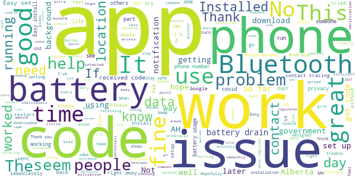
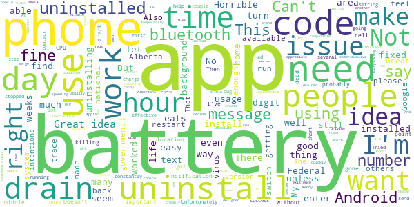

# ABTraceTogether
App version ``1.4.0``

Analyzed with [covid-apps-observer](http://github.com/covid-apps-observer) project, version ``0.1``

## App overview
| | |
|-------------------------|-------------------------| 
| **Name**&nbsp;&nbsp;&nbsp;&nbsp;&nbsp;&nbsp;&nbsp;&nbsp;&nbsp;&nbsp;&nbsp;&nbsp;&nbsp;&nbsp;&nbsp;&nbsp;&nbsp;&nbsp;&nbsp;&nbsp;&nbsp;&nbsp;&nbsp;&nbsp;&nbsp;&nbsp;&nbsp;&nbsp;&nbsp;&nbsp;&nbsp;&nbsp;&nbsp;&nbsp;&nbsp;&nbsp;&nbsp;&nbsp;&nbsp;&nbsp;  | ABTraceTogether |
| **Unique identifier** | ca.albertahealthservices.contacttracing |
| **Link to Google Play** | [https://play.google.com/store/apps/details?id=ca.albertahealthservices.contacttracing](https://play.google.com/store/apps/details?id=ca.albertahealthservices.contacttracing) |
| **Summary**  | This app is from the Government of Alberta to augment manual contact tracing. |
| **Privacy policy** | [https://alberta.ca/ABTraceTogetherPrivacy](https://alberta.ca/ABTraceTogetherPrivacy) |
| **Latest version** | 1.4.0 |
| **Last update** | 2020-09-28 23:34:37 |
| **Recent changes** | - added capability to do contact tracing with Apple applications that are running in the background - updated privacy policy - minor bug fixes |
| **Installs**  | 50,000+ |
| **Category** | Health & Fitness |
| **First release** | Apr 30, 2020 |
| **Size**  | 9.6M |
| **Supported Android version**  | 8.0 and up |

### Description
> This app is being brought to you by the Government of Alberta.
 This app is intended for ages 14+.
 Some of the key benefits of this app are to:
 • Augment our current contact tracing efforts to provide guidance and care to those who are or may be infected
 • Help keep Albertans safe by limiting the spread of COVID-19 through more individuals self-isolating earlier
 The app is most effective if it reaches a strong penetration of usage among Albertans, which means the more people that use the app, the better the app works.
 Once a user registers their phone number with the app, the app uses bluetooth to log contact with other individuals who have the app when that contact is within approximately 2 meters. If a user tests positive for COVID-19, they will be contacted by an Alberta Health Service Contact Tracer, and asked to voluntarily upload their data to Alberta Health Services so that anyone the user came into close contact with over the previous 14 days can be notified.
 Geolocation data is not collected by the app or by Alberta Health Services. The Bluetooth exchange ID log data collected is stored locally in your phone in an encrypted form. This data will not be accessed by Alberta Health Services unless and until you choose to upload it as a result of being diagnosed with COVID-19. Mobile numbers or any other personal information are not revealed to other app users.
 Personal Information collected:
 - Phone number
 Permissions required:
 - Bluetooth enabled
 - Location 
 - Push notifications
 Copyright 2020 Government of Alberta

### User interface
The developers of the app provide the following screenshots in the Google play store.
| | | |
|:-------------------------:|:-------------------------:|:-------------------------:|
 |   |   |   | 

## Development team
In the following we report the main information provided by the development team in the Google play store.

| | |
|-------------------------|-------------------------|
| **Developer**  | Government of the Province of Alberta |
| **Website**  | [http://alberta.ca/ABTraceTogether](http://alberta.ca/ABTraceTogether) |
| **Email** | ABTraceTogetherSupport@gov.ab.ca |
| **Physical address**  | [3720 - 76 Avenue Edmonton, AB T6B 2N9](https://www.google.com/maps/search/3720%20-%2076%20Avenue%20Edmonton,%20AB%20T6B%202N9) (Google Maps) |
| **Other developed apps**  | [https://play.google.com/store/apps/developer?id=Government+of+the+Province+of+Alberta](https://play.google.com/store/apps/developer?id=Government+of+the+Province+of+Alberta) |

## Android support

| | |
|-------------------------|-------------------------|
| **Declared target Android version**  | Android10, version 10 (API level 29) |
| **Effective target Android version**  | Android10, version 10 (API level 29) |
| **Minimum supported Android version**  | Oreo, version 8.0.0 (API level 26) |
| **Maximum target Android version**  | - |

The larger the difference between the minimum and maximum supported Android versions, the better. A larger difference means a wider audience. For example, old phones have a very low Android version, so a high minimum supported Android version means that the app cannot be used by users with old phones, thus leading to accessibility problems. 

## Requested permissions

In the following we report the complete list of the permissions requested by the app. 

| **Permission** | **Protection level** | **Description** | 
|-------------------------|-------------------------|-------------------------|
 **android.permission ACCESS_BACKGROUND_LOCATION** | :warning:**Dangerous** | Allows an app to access location in the background. 
 **android.permission ACCESS_FINE_LOCATION** | :warning:**Dangerous** | Allows an app to access precise location. 
 **android.permission ACCESS_WIFI_STATE** | Normal | Allows applications to access information about Wi-Fi networks. 
 **android.permission BLUETOOTH** | Normal | Allows applications to connect to paired bluetooth devices. 
 **android.permission BLUETOOTH_ADMIN** | Normal | Allows applications to discover and pair bluetooth devices. 
 **android.permission FOREGROUND_SERVICE** | Normal | Allows a regular application to use Service.startForeground. 
 **android.permission INTERNET** | Normal | Allows applications to open network sockets. 
 **android.permission RECEIVE_BOOT_COMPLETED** | Normal | Allows an application to receive the Intent.ACTION_BOOT_COMPLETED that is broadcast after the system finishes booting. 
 **android.permission REQUEST_IGNORE_BATTERY_OPTIMIZATIONS** | Normal | Permission an application must hold in order to use Settings.ACTION_REQUEST_IGNORE_BATTERY_OPTIMIZATIONS. 

## Mentioned servers

| **Server** | **Registrant** | **Registrant country** | **Creation date** | 
|-------------------------|-------------------------|-------------------------|-------------------------|
 | stackoverflow.com | Stack Exchange, Inc. | :us: US | 2003-12-26 19:18:07 |
 | google.com | Google LLC | :us: US | 1997-09-15 04:00:00 |

## Security analysis 

Below we report the main security warnings raised by our execution of the [Androwarn](https://github.com/maaaaz/androwarn) security analysis tool.

**Telephony identifiers leakage**
> - This application reads the unique device ID, i.e the IMEI for GSM and the MEID or ESN for CDMA phones 

**Connection interfaces exfiltration**
> - This application reads details about the currently active data network 
> - This application tries to find out if the currently active data network is metered 

**Suspicious connection establishment**
> - This application opens a Socket and connects it to the remote address '' on the 'N/A' port  
> - This application opens a Socket and connects it to the remote address 'Ljava/lang/StringBuilder;->toString()Ljava/lang/String;' on the ': connect, resolve' port  
> - This application opens a Socket and connects it to the remote address 'Ljava/lang/StringBuilder;->toString()Ljava/lang/String;' on the 'N/A' port  
> - This application opens a Socket and connects it to the remote address 'Ljava/net/Proxy;->type()Ljava/net/Proxy$Type;' on the 'N/A' port  
> - This application opens a Socket and connects it to the remote address 'timeout' on the 'N/A' port  

**Code execution**
> - This application loads a native library: 'authjni' 
> - This application loads a native library: 'crypto' 
> - This application loads a native library: 'uvpn' 

## User ratings and reviews

Below we provide information about how end users are reacting to the app in terms of ratings and reviews in the Google Play store.

### Ratings

The ABTraceTogether app has been installed by more than **50000** times. At this time, **556** rated the app and its average score is **2.54**. Below we show the distribution of the ratings across the usual star-based rating of Google Play

:star::star::star::star::star:: 139

:star::star::star::star:: 50

:star::star::star:: 50

:star::star:: 50

:star:: 267

### Reviews 

#### 5-star reviews

> Stay safe and stay home Wear mask  :date: __2020-11-16 04:15:40__

> EDIT: *NO LONGER A BATTERY DRAINER* It seems something was updated. Version 1.4 Get back to work, 'Berta. (Previous Review: Battery drainer. The only way to reasonably use the app is to turn it on around others. Otherwise, not a "set it, forget it" solution. The overall function of the app is clearly explained, and is fine to use when needed. No crashes, flawless app persistence.)  :date: __2020-11-13 00:17:06__

> Sometimes it eats battery. Not sure why. Otherwise just sits there  :date: __2020-11-12 08:20:45__

> Flawless installation and just works away in the background consuming very little battery. Every Albertan should be installing this app.  :date: __2020-11-09 01:25:41__

> It works. This app works and does not crash. If you're worried about battery life, you can do more by turning down your screen brightness than by not using this app.  :date: __2020-11-07 05:36:10__

> Good app, does not drain my battery and provide me with some sort of security that If I am close to someone infected i will know. We all that live in Alberta should use it thanks  :date: __2020-10-16 06:19:47__

> Best  :date: __2020-10-16 03:49:40__

> I just feel safer in having this app. Thank you...  :date: __2020-10-08 05:34:20__

> Track if you come into contact with individuals that have COVID19. This app will notify you if youve been exposed or near someone that has registered that location and time with the government of alberta  :date: __2020-10-07 18:48:59__

> great  :date: __2020-10-07 08:48:06__

#### 4-star reviews

> So far so good  :date: __2020-10-08 14:48:14__

> Helps me as I don't have short term memory.  :date: __2020-10-07 17:08:45__

> None yet. Better to have it and not need it than need it and not have it.  :date: __2020-10-07 04:22:25__

> Good  :date: __2020-10-07 04:06:08__

> Seems to work fine. Unfortunately it is set to "Canada only" so my sister cant install it on her US phone despite living here.  :date: __2020-09-25 03:29:29__

> It doesn't drain my battery like others say. Not sure why others are having issues...?  :date: __2020-08-17 21:50:04__

> No issues with the app (Samsung Note 9).  :date: __2020-08-10 04:24:28__

> I noticed the last 2 days this app has been draining my battery. Use to have 45% left at bedtime, now only 10% at 1 pm. Just did the update, which I didn't know about. So hopefully it fixes this battery issue. (03-Jun-20). UPDATE: After the update the app no longer drained my battery. I noticed a drain on my battery again today (06-Jul-20) and checked for an update, which there was. If you notice your battery being drained, just update the app.  :date: __2020-07-06 16:07:00__

> I originally thought the app was draining my battery but it turned out to be something else. It seems to work fine and is unobtrusive except for the always on tray notification.  :date: __2020-07-05 16:46:23__

> I don't huv any pinyon  :date: __2020-06-30 07:19:48__

#### 3-star reviews

> I have uninstalled this app. I was the early adopter of this app but now that the national app is available, I want to switch over to that one. I have uninstalled it to voice my option and hopefully my Alberta government will see the drop-off installment of this app to take appropriate action.  :date: __2020-11-02 16:52:14__

> Huge drain on battery esp after first installing and after installing a recent update update. After first install it sorted itself out after about a week. Hope it does the same after this update (it is draining my battery completely after a few hours and normally I can go all day without dropping below 40 per cent). Great idea just needs to be optimized a bit more.  :date: __2020-10-08 06:33:13__

> Huuuge battery drainer.  :date: __2020-10-07 15:41:00__

> I'm tired of being asked if I'm ok. Why am I asked multiple times a day? Is it because I'm around or could have contact exposure? Asking me multiple times a day is causing me anxiety.  :date: __2020-10-07 15:17:15__

> App is useless when I am travelling outside of province. Alberta, SWITCH TO THE FEDERAL COVID APP!!!  :date: __2020-10-07 13:28:19__

> It is probably not the apps fault but I live in b.x. now and could never understand it .. stay safe  :date: __2020-10-07 13:11:04__

> It has been a good app for now.  :date: __2020-10-07 05:20:33__

> It's irritating that it has a large notification on my screen all the time to note that it's running, rather than an icon, or the option to just run in the background without that. Worse, it drains my battery, using as much power as almost everything else I run combined. I'd like to use it, but this isn't feasible.  :date: __2020-08-27 01:11:47__

> Extreme battery usage on a Pixel 2. Want to keep it don't know what to do  :date: __2020-08-20 06:30:42__

> Please listen to everyone and make an on/off option. This only needs to be on when we go out in public and will just be an added step such as bringing a mask.  :date: __2020-08-11 05:33:38__

#### 2-star reviews

> As others have said, it's like the federal government app but worse. They should just make both available to Albertans and let us decide. My choice would be easy.  :date: __2020-11-11 23:44:19__

> I feel it's a good idea, implemented poorly. Within an hour of 100% battery I am down to 85%. Not well designed. It's not right for me... I have uninstalled it.  :date: __2020-11-11 04:00:11__

> Horrible battery drain. UCP should smarten up and do things well instead of cheaply.  :date: __2020-11-09 23:44:44__

> I am still getting a notice that says "if you are getting this message please restart your phone" I did and the message came right back. Glad we are spending thousands on this app Kenny.  :date: __2020-11-09 06:15:49__

> Alberta needs to stop fighting with the Federal Government and merge this app with the national app. Which is why this won't run in the background...feds are blocking the ability with Google.  :date: __2020-11-07 04:24:05__

> I appreciate the effort Alberta made to get this out so quickly, but it's time to switch the Federal system which is more reliable, comprehensive, and easier on my battery. Uninstalling as there not enough people using this anyway.  :date: __2020-10-08 04:03:34__

> There hasnt been any action on here  :date: __2020-10-07 17:02:38__

> Horrible app drains battery. Also ineffective. Please create a National app uses Google / Apple API  :date: __2020-10-05 23:15:57__

> How are supposed to trace the virus if the app is not compatible with older Android version .you need to have at least Android version 8 . That's very not smart.  :date: __2020-09-22 20:00:04__

> It's an absolute battery drainer! The intentions are good and the existence of it is important but it's just killing my battery and my phone is brand new.  :date: __2020-08-25 04:21:04__

#### 1-star reviews

> WHY CAN'T I GET THE NATIONAL APP THIS IS TRASH VOTE NDP  :date: __2020-11-15 21:03:05__

> This is garbage, Albertans shouldn't suffer because our premier is an idiot. Allow us to use the federal app or merge them, Canada should stick together and help eachother not draw lines in the sand over an app. I don't care about the reasoning, just make it so we all use the same damned app.  :date: __2020-11-13 23:20:23__

> Absolute waste, Federal app is better but Kenny would never allow that. Removed after a few hours of pure battery drain.  :date: __2020-11-13 05:58:12__

> I wish I could give it zero. Doesn't work, as stated months ago  :date: __2020-11-13 01:18:47__

> Drain on battery, not as useful as the federal app. Wish Alberta would stop pushing this on us.  :date: __2020-11-12 09:03:27__

> This is such a joke, we have a federal system available that works better, why force us to use a worse alternative? This isn't about politics, it's about people's lives.  :date: __2020-11-12 08:16:55__

> Proven to not work in background on iPhone and works inconsistently on Android. Gov appears to be misleading about functionality.  :date: __2020-11-12 01:03:43__

> Charger cannot full charge battery due to app consuming power.  :date: __2020-11-11 14:43:05__

> All, Kenny doesn't know how apps work. The federal apps work based on a collaboration between Google and Apple to anonymously trace infections. This app doesn't. Switch now.  :date: __2020-11-10 06:24:53__

> Drains the battery, and requires more info than the federal app. Should just use that one, if not for the government blocking it.  :date: __2020-11-10 01:59:35__

