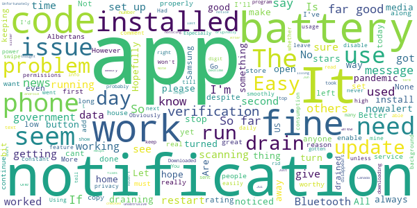
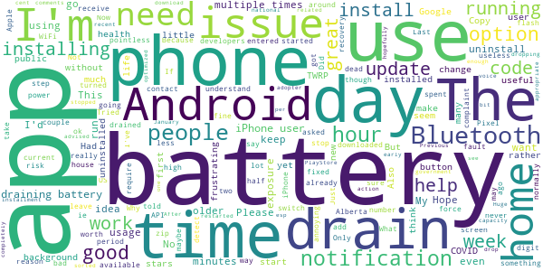

# ABTraceTogether
App version ``1.5.0``

Analyzed with [covid-apps-observer](http://github.com/covid-apps-observer) project, version ``0.1``

## App overview
| | |
|-------------------------|-------------------------| 
| **Name**&nbsp;&nbsp;&nbsp;&nbsp;&nbsp;&nbsp;&nbsp;&nbsp;&nbsp;&nbsp;&nbsp;&nbsp;&nbsp;&nbsp;&nbsp;&nbsp;&nbsp;&nbsp;&nbsp;&nbsp;&nbsp;&nbsp;&nbsp;&nbsp;&nbsp;&nbsp;&nbsp;&nbsp;&nbsp;&nbsp;&nbsp;&nbsp;&nbsp;&nbsp;&nbsp;&nbsp;&nbsp;&nbsp;&nbsp;&nbsp;  | ABTraceTogether |
| **Unique identifier** | ca.albertahealthservices.contacttracing |
| **Link to Google Play** | [https://play.google.com/store/apps/details?id=ca.albertahealthservices.contacttracing](https://play.google.com/store/apps/details?id=ca.albertahealthservices.contacttracing) |
| **Summary**  | This app is from the Government of Alberta to augment manual contact tracing. |
| **Privacy policy** | [https://alberta.ca/ABTraceTogetherPrivacy](https://alberta.ca/ABTraceTogetherPrivacy) |
| **Latest version** | 1.5.0 |
| **Last update** | 2020-12-18 22:39:46 |
| **Recent changes** | Bug fixes |
| **Installs**  | 100,000+ |
| **Category** | Health & Fitness |
| **First release** | Apr 30, 2020 |
| **Size**  | 9.6M |
| **Supported Android version**  | 8.0 and up |

### Description
> This app is being brought to you by the Government of Alberta.
 This app is intended for ages 14+.
 Some of the key benefits of this app are to:
 • Augment our current contact tracing efforts to provide guidance and care to those who are or may be infected
 • Help keep Albertans safe by limiting the spread of COVID-19 through more individuals self-isolating earlier
 The app is most effective if it reaches a strong penetration of usage among Albertans, which means the more people that use the app, the better the app works.
 Once a user registers their phone number with the app, the app uses bluetooth to log contact with other individuals who have the app when that contact is within approximately 2 meters. If a user tests positive for COVID-19, they will be contacted by an Alberta Health Service Contact Tracer, and asked to voluntarily upload their data to Alberta Health Services so that anyone the user came into close contact with over the previous 14 days can be notified.
 Location permissions are required by the application because Android/Google requires apps requesting access to Bluetooth to also obtain location permission. The app does not capture or use information about your location. In addition, location data is not collected by Alberta Health or Alberta Health Services and is never sent from your phone to another organization for any purpose. The Bluetooth exchange ID log data collected is stored locally in your phone in an encrypted form. This data will not be accessed by Alberta Health Services unless and until you choose to upload it as a result of being diagnosed with COVID-19. Mobile numbers or any other personal information are not revealed to other app users.
 Personal Information collected:
 - Phone number
 Permissions required:
 - Bluetooth enabled
 - Location 
 - Push notifications
 Copyright 2020 Government of Alberta

### User interface
The developers of the app provide the following screenshots in the Google play store.
| | | |
|:-------------------------:|:-------------------------:|:-------------------------:|
 |   |   |   | 

## Development team
In the following we report the main information provided by the development team in the Google play store.

| | |
|-------------------------|-------------------------|
| **Developer**  | Government of the Province of Alberta |
| **Website**  | [http://alberta.ca/ABTraceTogether](http://alberta.ca/ABTraceTogether) |
| **Email** | ABTraceTogetherSupport@gov.ab.ca |
| **Physical address**  | [3720 - 76 Avenue Edmonton, AB T6B 2N9](https://www.google.com/maps/search/3720%20-%2076%20Avenue%20Edmonton,%20AB%20T6B%202N9) (Google Maps) |
| **Other developed apps**  | [https://play.google.com/store/apps/developer?id=Government+of+the+Province+of+Alberta](https://play.google.com/store/apps/developer?id=Government+of+the+Province+of+Alberta) |

## Android support

| | |
|-------------------------|-------------------------|
| **Declared target Android version**  | Android10, version 10 (API level 29) |
| **Effective target Android version**  | Android10, version 10 (API level 29) |
| **Minimum supported Android version**  | Oreo, version 8.0.0 (API level 26) |
| **Maximum target Android version**  | - |

The larger the difference between the minimum and maximum supported Android versions, the better. A larger difference means a wider audience. For example, old phones have a very low Android version, so a high minimum supported Android version means that the app cannot be used by users with old phones, thus leading to accessibility problems. 

## Requested permissions

In the following we report the complete list of the permissions requested by the app. 

| **Permission** | **Protection level** | **Description** | 
|-------------------------|-------------------------|-------------------------|
 **android.permission ACCESS_BACKGROUND_LOCATION** | :warning:**Dangerous** | Allows an app to access location in the background. 
 **android.permission ACCESS_FINE_LOCATION** | :warning:**Dangerous** | Allows an app to access precise location. 
 **android.permission ACCESS_WIFI_STATE** | Normal | Allows applications to access information about Wi-Fi networks. 
 **android.permission BLUETOOTH** | Normal | Allows applications to connect to paired bluetooth devices. 
 **android.permission BLUETOOTH_ADMIN** | Normal | Allows applications to discover and pair bluetooth devices. 
 **android.permission FOREGROUND_SERVICE** | Normal | Allows a regular application to use Service.startForeground. 
 **android.permission INTERNET** | Normal | Allows applications to open network sockets. 
 **android.permission RECEIVE_BOOT_COMPLETED** | Normal | Allows an application to receive the Intent.ACTION_BOOT_COMPLETED that is broadcast after the system finishes booting. 
 **android.permission REQUEST_IGNORE_BATTERY_OPTIMIZATIONS** | Normal | Permission an application must hold in order to use Settings.ACTION_REQUEST_IGNORE_BATTERY_OPTIMIZATIONS. 

## Mentioned servers

| **Server** | **Registrant** | **Registrant country** | **Creation date** | 
|-------------------------|-------------------------|-------------------------|-------------------------|
 | stackoverflow.com | Stack Exchange, Inc. | :us: US | 2003-12-26 19:18:07 |
 | google.com | Google LLC | :us: US | 1997-09-15 04:00:00 |

## Security analysis 

Below we report the main security warnings raised by our execution of the [Androwarn](https://github.com/maaaaz/androwarn) security analysis tool.

**Telephony identifiers leakage**
> - This application reads the unique device ID, i.e the IMEI for GSM and the MEID or ESN for CDMA phones 

**Connection interfaces exfiltration**
> - This application reads details about the currently active data network 
> - This application tries to find out if the currently active data network is metered 

**Suspicious connection establishment**
> - This application opens a Socket and connects it to the remote address '' on the 'N/A' port  
> - This application opens a Socket and connects it to the remote address 'Ljava/lang/StringBuilder;->toString()Ljava/lang/String;' on the ': connect, resolve' port  
> - This application opens a Socket and connects it to the remote address 'Ljava/lang/StringBuilder;->toString()Ljava/lang/String;' on the 'N/A' port  
> - This application opens a Socket and connects it to the remote address 'Ljava/net/Proxy;->type()Ljava/net/Proxy$Type;' on the 'N/A' port  
> - This application opens a Socket and connects it to the remote address 'timeout' on the 'N/A' port  

**Code execution**
> - This application loads a native library: 'authjni' 
> - This application loads a native library: 'crypto' 
> - This application loads a native library: 'uvpn' 

## User ratings and reviews

Below we provide information about how end users are reacting to the app in terms of ratings and reviews in the Google Play store.

### Ratings

The ABTraceTogether app has been installed by more than **100000** times. At this time, **946** rated the app and its average score is **1.4260869**. Below we show the distribution of the ratings across the usual star-based rating of Google Play

:star::star::star::star::star:: 82

:star::star::star::star:: 16

:star::star::star:: 8

:star::star:: 8

:star:: 832

### Reviews 

#### 5-star reviews

> I believe in anything created by our saviour Jason "the king" Kenny. May this app save Alberta from economic ruin.  :date: __2021-01-01 07:29:58__

> 2nd Review: No problem with battery, 5 days 19 hrs used 9.2%. Minimal to assist Contact Tracing! Sept 4/20: My phone is 3 1/2, in a 12 hr period the battery usage was only 0.7%. My only complaint is that it shows an icon in my status bar regardless if Bluetooth is on or off. I would prefer that the icon only shows when Bluetooth is off. Until we get the National app here at least it's one thing I can do. Who knows when we'll get the National one!?! Hopefully sooner than later!  :date: __2020-12-29 22:50:28__

> It tells you where the cases are  :date: __2020-12-22 18:04:21__

> Best  :date: __2020-12-16 01:39:39__

> Works well my old pixel 2 xl and my current pixel 5. No noticeable battery issues or crashing. Had it up an running in less then 3min.  :date: __2020-12-05 00:13:36__

> Seems good so far. I have been running the App for 12 Hrs, and the phone claims it's consuming 1.1% of all battery usage. I would hope most of negative reviews arn't a partisan attack, because it will deter more people from using the app, which will render it useless. Do your part folks!  :date: __2020-12-03 18:53:38__

> This app has been developed in Mumbai 👍🏻  :date: __2020-11-26 06:41:20__

> Our Governments are failing us.  :date: __2020-11-17 15:25:10__

> Stay safe and stay home Wear mask  :date: __2020-11-16 04:15:40__

> EDIT: *NO LONGER A BATTERY DRAINER* It seems something was updated. Version 1.4 Get back to work, 'Berta. (Previous Review: Battery drainer. The only way to reasonably use the app is to turn it on around others. Otherwise, not a "set it, forget it" solution. The overall function of the app is clearly explained, and is fine to use when needed. No crashes, flawless app persistence.)  :date: __2020-11-13 00:17:06__

#### 4-star reviews

> Works fine, not noticing battery drain.  :date: __2021-01-29 04:53:57__

> Easy to use. Haven't noticed any battery drain on my android phone.  :date: __2020-11-28 18:04:19__

> So far so good  :date: __2020-10-08 14:48:14__

> Helps me as I don't have short term memory.  :date: __2020-10-07 17:08:45__

> None yet. Better to have it and not need it than need it and not have it.  :date: __2020-10-07 04:22:25__

> Good  :date: __2020-10-07 04:06:08__

> Seems to work fine. Unfortunately it is set to "Canada only" so my sister cant install it on her US phone despite living here.  :date: __2020-09-25 03:29:29__

> It doesn't drain my battery like others say. Not sure why others are having issues...?  :date: __2020-08-17 21:50:04__

> No issues with the app (Samsung Note 9).  :date: __2020-08-10 04:24:28__

> I noticed the last 2 days this app has been draining my battery. Use to have 45% left at bedtime, now only 10% at 1 pm. Just did the update, which I didn't know about. So hopefully it fixes this battery issue. (03-Jun-20). UPDATE: After the update the app no longer drained my battery. I noticed a drain on my battery again today (06-Jul-20) and checked for an update, which there was. If you notice your battery being drained, just update the app.  :date: __2020-07-06 16:07:00__

#### 3-star reviews

> On January 29, 2021, developers advised that app can now download from US PlayStore. Previous comments related to now fixed issue.  :date: __2021-01-29 23:05:02__

> The app (on android) started using a lot of battery capacity, so I force-stopped it and restarted my phone. Now it is fine. The only reason the app does not receive more stars is that it is not in use by enough people.  :date: __2021-01-15 21:51:13__

> Good  :date: __2020-12-03 11:14:09__

> I have uninstalled this app. I was the early adopter of this app but now that the national app is available, I want to switch over to that one. I have uninstalled it to voice my option and hopefully my Alberta government will see the drop-off installment of this app to take appropriate action.  :date: __2020-11-02 16:52:14__

> Huge drain on battery esp after first installing and after installing a recent update update. After first install it sorted itself out after about a week. Hope it does the same after this update (it is draining my battery completely after a few hours and normally I can go all day without dropping below 40 per cent). Great idea just needs to be optimized a bit more.  :date: __2020-10-08 06:33:13__

> Huuuge battery drainer.  :date: __2020-10-07 15:41:00__

> I'm tired of being asked if I'm ok. Why am I asked multiple times a day? Is it because I'm around or could have contact exposure? Asking me multiple times a day is causing me anxiety.  :date: __2020-10-07 15:17:15__

> App is useless when I am travelling outside of province. Alberta, SWITCH TO THE FEDERAL COVID APP!!!  :date: __2020-10-07 13:28:19__

> It is probably not the apps fault but I live in b.x. now and could never understand it .. stay safe  :date: __2020-10-07 13:11:04__

> It has been a good app for now.  :date: __2020-10-07 05:20:33__

#### 2-star reviews

> The AB Government should have been in with the federal Covid App  :date: __2021-01-21 22:49:14__

> Idea is great, but for many weeks I used this app whenever I went out, and nothing was happening. Wasn't sure what was going on, maybe I was just safe. Then I found out, that in fact, there was actually nothing going on, this app wasn't working, and did nothing for a long time after its release. For an app that some people trust with their lives, literally, it sure sucks.  :date: __2021-01-03 15:22:50__

> The app keeps asking me to restart my phone. I have done so at least five times now. That notification is very annoying.  :date: __2020-12-28 21:48:46__

> Ok not great  :date: __2020-11-19 22:23:04__

> As others have said, it's like the federal government app but worse. They should just make both available to Albertans and let us decide. My choice would be easy.  :date: __2020-11-11 23:44:19__

> I feel it's a good idea, implemented poorly. Within an hour of 100% battery I am down to 85%. Not well designed. It's not right for me... I have uninstalled it.  :date: __2020-11-11 04:00:11__

> Horrible battery drain. UCP should smarten up and do things well instead of cheaply.  :date: __2020-11-09 23:44:44__

> I am still getting a notice that says "if you are getting this message please restart your phone" I did and the message came right back. Glad we are spending thousands on this app Kenny.  :date: __2020-11-09 06:15:49__

> Alberta needs to stop fighting with the Federal Government and merge this app with the national app. Which is why this won't run in the background...feds are blocking the ability with Google.  :date: __2020-11-07 04:24:05__

> I appreciate the effort Alberta made to get this out so quickly, but it's time to switch the Federal system which is more reliable, comprehensive, and easier on my battery. Uninstalling as there not enough people using this anyway.  :date: __2020-10-08 04:03:34__

#### 1-star reviews

> Its draining my phoes battery.  :date: __2021-02-03 10:04:53__

> Wasted time monitoring  :date: __2021-02-02 02:10:31__

> I was being told my information will be kept in private. Why do they need to ask my phone numbers? The 1st version never my phone number but this one need it. The App kept eating up phone battery. My phone has a 5000mA battery. It should last 3 days if I put it on standby mode. Now, it can only last 1 day long. It toke away so much government money to design this App. Why not update this App to make it save more cell phone battery?  :date: __2021-02-02 02:07:04__

> Same complaints as everyone else  :date: __2021-01-29 16:42:42__

> Like others are saying, it needs an off button because of the battery drain when using it at home. Also, we need to use the federal app asap this one just doesn't have a audience anymore.  :date: __2021-01-26 03:30:38__

> Just use the fed app already!! The petty squabbling of the prov govt is tiresome!! And ridiculous when people's health is involved. Grow up!  :date: __2021-01-21 23:04:39__

> It always has a notification that it is either running or not running and I can't remove the notification. I don't need it running while I am at home the majority of the time so I don't want the notification telling me it's not running. I deleted the app because the notification message is unable to be removed.  :date: __2021-01-19 12:34:23__

> I'm at home all the time, yet there's no way to turn on and off the contact tracing on the app. Change this setting please. It should only function when we turn it on because we're leaving home. There's no point in tracing when you're home!!! Let us have an option to activate it and deactivate it.  :date: __2021-01-18 12:17:44__

> Complete battery suck. A few hours of phone use, and battery is done. I can use my phone all day on conference calls with a Bluetooth headset, take emails, texts, a quick surf on social between meetings and still have battery left at the end of the day. ABTrace you'll need to keep your phone plugged in constantly. Uninstalling... also most of my co-workers are non Alberta based so totally useless as not cross country.  :date: __2021-01-17 18:12:40__

> This app is garbage. It doesn't work properly, and as a result noone uses it. It would be nice if the Government of Alberta could swallow their pride and let us use the app from the Government of Canada, which DOES work - just not in Alberta. Thanks for nothing!  :date: __2021-01-17 07:24:51__

