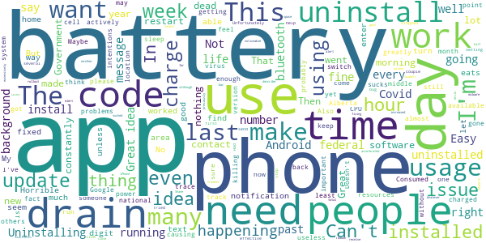

# ABTraceTogether
App version ``2.2.0``

Analyzed with [covid-apps-observer](http://github.com/covid-apps-observer) project, version ``0.1``

## App overview
| | |
|-------------------------|-------------------------| 
| **Name**&nbsp;&nbsp;&nbsp;&nbsp;&nbsp;&nbsp;&nbsp;&nbsp;&nbsp;&nbsp;&nbsp;&nbsp;&nbsp;&nbsp;&nbsp;&nbsp;&nbsp;&nbsp;&nbsp;&nbsp;&nbsp;&nbsp;&nbsp;&nbsp;&nbsp;&nbsp;&nbsp;&nbsp;&nbsp;&nbsp;&nbsp;&nbsp;&nbsp;&nbsp;&nbsp;&nbsp;&nbsp;&nbsp;&nbsp;&nbsp;  | ABTraceTogether |
| **Unique identifier** | ca.albertahealthservices.contacttracing |
| **Link to Google Play** | [https://play.google.com/store/apps/details?id=ca.albertahealthservices.contacttracing](https://play.google.com/store/apps/details?id=ca.albertahealthservices.contacttracing) |
| **Summary**  | This app is from the Government of Alberta to augment manual contact tracing. |
| **Privacy policy** | [https://alberta.ca/ABTraceTogetherPrivacy](https://alberta.ca/ABTraceTogetherPrivacy) |
| **Latest version** | 2.2.0 |
| **Last update** | 2021-04-21 17:41:32 |
| **Recent changes** | - New home screen look and feel - Permissions prompts in Home screen - Added Learn More section - Streamlined Stats section - Contact tracing data can include Covid test date and symptomatic date, if applicable - Automated SMS from Alberta Health services to contacts potentially exposed to Covid - New prominent disclosure screens during initial setup for user app data usage to meet Google requirements - Support for Android 6 &amp; 7 devices - User experience enhancements - Bug fixes |
| **Installs**  | 100,000+ |
| **Category** | Health & Fitness |
| **First release** | Apr 30, 2020 |
| **Size**  | 14M |
| **Supported Android version**  | 6.0 and up |

### Description
> This app is being brought to you by the Government of Alberta.
 This app is intended for ages 14+.
 Some of the key benefits of this app are to:
 • Augment our current contact tracing efforts to provide guidance and care to those who are or may be infected
 • Help keep Albertans safe by limiting the spread of COVID-19 through more individuals self-isolating earlier
 The app is most effective if it reaches a strong penetration of usage among Albertans, which means the more people that use the app, the better the app works.
 Once a user registers their phone number with the app, the app uses bluetooth to log contact with other individuals who have the app when that contact is within approximately 2 meters. If a user tests positive for COVID-19, they will be contacted by an Alberta Health Service Contact Tracer, and asked to voluntarily upload their data to Alberta Health Services so that anyone the user came into close contact with over the previous 14 days can be notified.
 Location permissions are required by the application because Android/Google requires apps requesting access to Bluetooth to also obtain location permission. The app does not capture or use information about your location. In addition, location data is not collected by Alberta Health or Alberta Health Services and is never sent from your phone to another organization for any purpose. The Bluetooth exchange ID log data collected is stored locally in your phone in an encrypted form. This data will not be accessed by Alberta Health Services unless and until you choose to upload it as a result of being diagnosed with COVID-19. Mobile numbers or any other personal information are not revealed to other app users.
 Personal Information collected:
 - Phone number
 Permissions required:
 - Bluetooth enabled
 - Location 
 - Push notifications
 Additionally, ABTraceTogether uses the smartphone MAC address solely for the one-time generation of a device ID to allow required communication between ABTraceTogether and the server. The MAC address is not transmitted, shared, stored, or used for any kind of personal data or user tracking.
 Copyright 2021 Government of Alberta

### User interface
The developers of the app provide the following screenshots in the Google play store.
| | | |
|:-------------------------:|:-------------------------:|:-------------------------:|
 |   |   |   | 
 |  

## Development team
In the following we report the main information provided by the development team in the Google play store.

| | |
|-------------------------|-------------------------|
| **Developer**  | Government of the Province of Alberta |
| **Website**  | [http://alberta.ca/ABTraceTogether](http://alberta.ca/ABTraceTogether) |
| **Email** | ABTraceTogetherSupport@gov.ab.ca |
| **Physical address**  | [3720 - 76 Avenue Edmonton, AB T6B 2N9](https://www.google.com/maps/search/3720%20-%2076%20Avenue%20Edmonton,%20AB%20T6B%202N9) (Google Maps) |
| **Other developed apps**  | [https://play.google.com/store/apps/developer?id=Government+of+the+Province+of+Alberta](https://play.google.com/store/apps/developer?id=Government+of+the+Province+of+Alberta) |

## Android support

| | |
|-------------------------|-------------------------|
| **Declared target Android version**  | Android10, version 10 (API level 29) |
| **Effective target Android version**  | Android10, version 10 (API level 29) |
| **Minimum supported Android version**  | Oreo, version 8.0.0 (API level 26) |
| **Maximum target Android version**  | - |

The larger the difference between the minimum and maximum supported Android versions, the better. A larger difference means a wider audience. For example, old phones have a very low Android version, so a high minimum supported Android version means that the app cannot be used by users with old phones, thus leading to accessibility problems. 

## Requested permissions

In the following we report the complete list of the permissions requested by the app. 

| **Permission** | **Protection level** | **Description** | 
|-------------------------|-------------------------|-------------------------|
 **android.permission ACCESS_BACKGROUND_LOCATION** | :warning:**Dangerous** | Allows an app to access location in the background. 
 **android.permission ACCESS_FINE_LOCATION** | :warning:**Dangerous** | Allows an app to access precise location. 
 **android.permission ACCESS_WIFI_STATE** | Normal | Allows applications to access information about Wi-Fi networks. 
 **android.permission BLUETOOTH** | Normal | Allows applications to connect to paired bluetooth devices. 
 **android.permission BLUETOOTH_ADMIN** | Normal | Allows applications to discover and pair bluetooth devices. 
 **android.permission FOREGROUND_SERVICE** | Normal | Allows a regular application to use Service.startForeground. 
 **android.permission INTERNET** | Normal | Allows applications to open network sockets. 
 **android.permission RECEIVE_BOOT_COMPLETED** | Normal | Allows an application to receive the Intent.ACTION_BOOT_COMPLETED that is broadcast after the system finishes booting. 
 **android.permission REQUEST_IGNORE_BATTERY_OPTIMIZATIONS** | Normal | Permission an application must hold in order to use Settings.ACTION_REQUEST_IGNORE_BATTERY_OPTIMIZATIONS. 

## Mentioned servers

| **Server** | **Registrant** | **Registrant country** | **Creation date** | 
|-------------------------|-------------------------|-------------------------|-------------------------|
 | stackoverflow.com | Stack Exchange, Inc. | :us: US | 2003-12-26 19:18:07 |
 | google.com | Google LLC | :us: US | 1997-09-15 04:00:00 |

## Security analysis 

Below we report the main security warnings raised by our execution of the [Androwarn](https://github.com/maaaaz/androwarn) security analysis tool.

**Telephony identifiers leakage**
> - This application reads the unique device ID, i.e the IMEI for GSM and the MEID or ESN for CDMA phones 

**Connection interfaces exfiltration**
> - This application reads details about the currently active data network 
> - This application tries to find out if the currently active data network is metered 

**Suspicious connection establishment**
> - This application opens a Socket and connects it to the remote address '' on the 'N/A' port  
> - This application opens a Socket and connects it to the remote address 'Ljava/lang/StringBuilder;->toString()Ljava/lang/String;' on the ': connect, resolve' port  
> - This application opens a Socket and connects it to the remote address 'Ljava/lang/StringBuilder;->toString()Ljava/lang/String;' on the 'N/A' port  
> - This application opens a Socket and connects it to the remote address 'Ljava/net/Proxy;->type()Ljava/net/Proxy$Type;' on the 'N/A' port  
> - This application opens a Socket and connects it to the remote address 'timeout' on the 'N/A' port  

**Code execution**
> - This application loads a native library: 'authjni' 
> - This application loads a native library: 'crypto' 
> - This application loads a native library: 'uvpn' 

## User ratings and reviews

Below we provide information about how end users are reacting to the app in terms of ratings and reviews in the Google Play store.

### Ratings

The ABTraceTogether app has been installed by more than **100000** times. At this time, **1101** rated the app and its average score is **2.5363636**. Below we show the distribution of the ratings across the usual star-based rating of Google Play

:star::star::star::star::star:: 290

:star::star::star::star:: 110

:star::star::star:: 60

:star::star:: 80

:star:: 561

### Reviews 

#### 5-star reviews

> Love the stats you can view as they r updated daily.  :date: __2021-05-14 17:47:55__

> Very good app.  :date: __2021-05-13 21:18:22__

> I feel safer knowing I have this app.  :date: __2021-05-13 07:50:59__

> Will only work if everybody installs the app.  :date: __2021-05-11 20:12:30__

> Exellent how great I was treated  :date: __2021-05-05 12:46:13__

> Saved my life.  :date: __2021-04-18 19:11:05__

> No issues with app  :date: __2021-04-17 04:08:16__

> Great reduced rates  :date: __2021-04-16 23:16:33__

> Fantastic improvements on the battery life. Great application to track everything and one source for updates. Thank You Government of Alberta.  :date: __2021-04-16 15:46:13__

> I didn't catch covid.  :date: __2021-03-25 06:41:38__

#### 4-star reviews

> I don't have any problems with the app, I've had it since it became available and it works fine and I don't have the battery issues that others are experiencing.  :date: __2021-05-08 04:40:00__

> Works fine, not noticing battery drain.  :date: __2021-01-29 04:53:57__

> Easy to use. Haven't noticed any battery drain on my android phone.  :date: __2020-11-28 18:04:19__

> So far so good  :date: __2020-10-08 14:48:14__

> Helps me as I don't have short term memory.  :date: __2020-10-07 17:08:45__

> None yet. Better to have it and not need it than need it and not have it.  :date: __2020-10-07 04:22:25__

> Good  :date: __2020-10-07 04:06:08__

> Seems to work fine. Unfortunately it is set to "Canada only" so my sister cant install it on her US phone despite living here.  :date: __2020-09-25 03:29:29__

> It doesn't drain my battery like others say. Not sure why others are having issues...?  :date: __2020-08-17 21:50:04__

> No issues with the app (Samsung Note 9).  :date: __2020-08-10 04:24:28__

#### 3-star reviews

> N/A  :date: __2021-05-15 22:19:33__

> No concerns seems to work  :date: __2021-05-11 17:05:27__

> Cannot tell if it is working or not. There are updates but very passive notifications.  :date: __2021-05-11 01:40:57__

> Not now  :date: __2021-04-17 05:07:29__

> A good safeguard. But too bad underutilized  :date: __2021-04-16 21:38:23__

> On January 29, 2021, developers advised that app can now download from US PlayStore. Previous comments related to now fixed issue.  :date: __2021-01-29 23:05:02__

> The app (on android) started using a lot of battery capacity, so I force-stopped it and restarted my phone. Now it is fine. The only reason the app does not receive more stars is that it is not in use by enough people.  :date: __2021-01-15 21:51:13__

> Good  :date: __2020-12-03 11:14:09__

> I have uninstalled this app. I was the early adopter of this app but now that the national app is available, I want to switch over to that one. I have uninstalled it to voice my option and hopefully my Alberta government will see the drop-off installment of this app to take appropriate action.  :date: __2020-11-02 16:52:14__

> Huge drain on battery esp after first installing and after installing a recent update update. After first install it sorted itself out after about a week. Hope it does the same after this update (it is draining my battery completely after a few hours and normally I can go all day without dropping below 40 per cent). Great idea just needs to be optimized a bit more.  :date: __2020-10-08 06:33:13__

#### 2-star reviews

> While it is Easy to install and no noticeable battery drain ... The low uptake makes it useless. The govt sucked at the rollout. Shame on you  :date: __2021-05-20 01:33:18__

> I have yet to receive an alert, although I have had the app up and running for over a year.  :date: __2021-05-18 20:32:03__

> 2.1 update (late April) used about 48% of my battery, prompting a premature battery drain warning. I wish AB and BC would set asside the NIH syndrome, and just enable the federal contact tracing app (which I have installed, but is usless to me unless I encounter somebody from outside AB and BC). Update: 2.2 update (May 15) seems to use 1/8th the power. Hard to tell because previous release destroyed my battery from deep discharge cyles (swelling syptoms; new battery installed day after update).  :date: __2021-05-18 08:45:16__

> This app should be linked with the Canada wide Covid app.  :date: __2021-05-13 16:29:03__

> Battery usage went from less than 5% to 35% with the new update. Unacceptable, had to delete app.  :date: __2021-05-01 05:11:38__

> With this software installed, my phone will be dead by morning, every night. This has been my experience- nearly every morning this past month I have missed my alarms from my phone because even on a full charge at the time i go to sleep, it will have expired by the time i want to get up. I never was exposed to covid in the duration that I had this software installed, so i can't attest to its functionality, other than that it consumed a lot of resources on my phone such that i had to remove it.  :date: __2021-04-27 18:20:46__

> Recent changes made my battery life worst. Background battery usage jumped dramatically where it would drain battery overnight while I sleep. This was not happening in past. In my opinion I think the new additions from last update are causing drain. Maybe it is constantly hitting servers to grab statistics.  :date: __2021-04-18 18:34:09__

> The AB Government should have been in with the federal Covid App  :date: __2021-01-21 22:49:14__

> Idea is great, but for many weeks I used this app whenever I went out, and nothing was happening. Wasn't sure what was going on, maybe I was just safe. Then I found out, that in fact, there was actually nothing going on, this app wasn't working, and did nothing for a long time after its release. For an app that some people trust with their lives, literally, it sure sucks.  :date: __2021-01-03 15:22:50__

> The app keeps asking me to restart my phone. I have done so at least five times now. That notification is very annoying.  :date: __2020-12-28 21:48:46__

#### 1-star reviews

> The app is the shats. Get people who know how to do it right.  :date: __2021-05-20 21:37:30__

> Drained battery, when I uploadedy data after catching Covid no one got an alert. Does not work.  :date: __2021-05-20 21:18:06__

> Um, this thing has never notified me and I've been in contact with several Covid cases. 4 tests and lucky so far, but not because of this app.  :date: __2021-05-18 02:22:59__

> It has never even been used for information. Totally useless. I didnt intend to give it a star I just can't remove it from when I finger brushed against it.  :date: __2021-05-14 19:35:56__

> I will not leave my location on due to battery usage. I was an advocate of this app until this last update.  :date: __2021-05-14 07:32:27__

> Doesn't work.  :date: __2021-05-14 06:57:32__

> Haven't been able to get the app to do anything. If it is operating correctly it hasn't told me I have been in contact with a Covid positive person, even though I know that I have. Waste of phone memory. The email address you have given for support also doesn't work.  :date: __2021-05-14 03:15:10__

> Can't upgrade  :date: __2021-05-13 22:56:51__

> This app requires more updating than any other app I've ever downloaded, and when it requires an update it stops everything on my phone. Not worth it. Figure out what your doing with the app.  :date: __2021-05-13 12:16:35__

> Kept it on only because it was self sufficient. It's a useless piece of garbage. Given that the Alberta government was never really interested in actually tracing, I'm not surprised. Garbage app from a garbage government.  :date: __2021-05-13 06:34:02__

