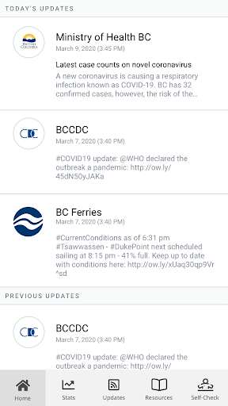
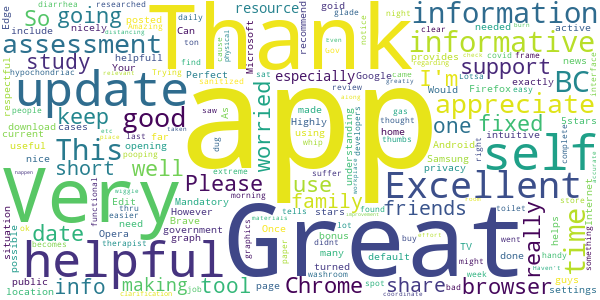
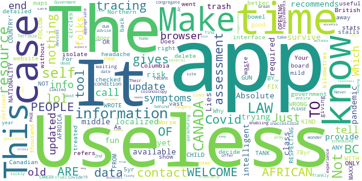

# BC COVID-19 Support
App version ``1.32.0``

Analyzed with [covid-apps-observer](http://github.com/covid-apps-observer) project, version ``0.1``

## App overview
| | |
|-------------------------|-------------------------| 
| **Name**                                          | BC COVID-19 Support |
| **Unique identifier** | ca.bc.gov.health.hlbc.COVID19 |
| **Link to Google Play** | [https://play.google.com/store/apps/details?id=ca.bc.gov.health.hlbc.COVID19](https://play.google.com/store/apps/details?id=ca.bc.gov.health.hlbc.COVID19) |
| **Summary**  | Stay informed about COVID-19 in BC and determine what actions you should take. |
| **Privacy policy** | [https://www.thrive.health/foippa](https://www.thrive.health/foippa) |
| **Latest version** | 1.32.0 |
| **Last update** | 2021-02-20 00:10:36 |
| **Recent changes** | We are constantly optimizing our app and adding new features to help support you through COVID-19.  This version includes a number of UI/UX improvements as well as stability enhancements. |
| **Installs**  | 50,000+ |
| **Category** | Medical |
| **First release** | Mar 21, 2020 |
| **Size**  | 11M |
| **Supported Android version**  | 5.0 and up |

### Description
> If you are a resident of British Columbia, Canada, BC COVID-19 Support is designed for you to stay informed about COVID-19 in BC and determine what actions and next steps you should take.  Recommendations are personalized and based on your personal risk factors.  You will receive timely updates with important news and alerts from BC’s Ministry of Health.  Recommendations and content are automatically updated based on the latest BC guidelines related to COVID-19.
 This application has been developed in collaboration with Thrive Health, a Vancouver-based healthcare technology company.  
 SAFETY & SECURITY:
 You will only be asked to provide your age, postal code, and device location.  The data you provide will be combined with all user data and used to inform the provincial COVID-19 response, and to allow you to receive location-based alerts.
 Your data will not be sold. Your data will not be used for any purpose other than health care.
 We follow industry best practices for data security and privacy.  The data you provide is always encrypted and is stored in Canada.

### User interface
The developers of the app provide the following screenshots in the Google play store.
| | | |
|:-------------------------:|:-------------------------:|:-------------------------:|
 |   |  

## Development team
In the following we report the main information provided by the development team in the Google play store.

| | |
|-------------------------|-------------------------|
| **Developer**  | Province of British Columbia, Canada |
| **Website**  | - |
| **Email** | support@thrive.health |
| **Physical address**  | - |
| **Other developed apps**  | [https://play.google.com/store/apps/developer?id=Province+of+British+Columbia,+Canada](https://play.google.com/store/apps/developer?id=Province+of+British+Columbia,+Canada) |

## Android support

| | |
|-------------------------|-------------------------|
| **Declared target Android version**  | Android10, version 10 (API level 29) |
| **Effective target Android version**  | Android10, version 10 (API level 29) |
| **Minimum supported Android version**  | Lollipop, version 5.0 (API level 21) |
| **Maximum target Android version**  | - |

The larger the difference between the minimum and maximum supported Android versions, the better. A larger difference means a wider audience. For example, old phones have a very low Android version, so a high minimum supported Android version means that the app cannot be used by users with old phones, thus leading to accessibility problems. 

## Requested permissions

In the following we report the complete list of the permissions requested by the app. 

| **Permission** | **Protection level** | **Description** | 
|-------------------------|-------------------------|-------------------------|
 **android.permission ACCESS_COARSE_LOCATION** | :warning:**Dangerous** | Allows an app to access approximate location. 
 **android.permission ACCESS_FINE_LOCATION** | :warning:**Dangerous** | Allows an app to access precise location. 
 **android.permission ACCESS_NETWORK_STATE** | Normal | Allows applications to access information about networks. 
 **android.permission CAMERA** | :warning:**Dangerous** | Required to be able to access the camera device. 
 **android.permission INTERNET** | Normal | Allows applications to open network sockets. 
 **android.permission READ_EXTERNAL_STORAGE** | :warning:**Dangerous** | Allows an application to read from external storage. 
 **android.permission REQUEST_INSTALL_PACKAGES** | Signature | Allows an application to request installing packages. 
 **com.google.android.c2dm.permission RECEIVE** | - | - 
 **com.google.android.finsky.permission BIND_GET_INSTALL_REFERRER_SERVICE** | - | - 

## Mentioned servers

| **Server** | **Registrant** | **Registrant country** | **Creation date** | 
|-------------------------|-------------------------|-------------------------|-------------------------|
 | googlesyndication.com | Google LLC | :us: US | 2003-01-21 06:17:24 |
 | google.com | Google LLC | :us: US | 1997-09-15 04:00:00 |
 | app-measurement.com | Google LLC | :us: US | 2015-06-19 20:13:31 |
 | branch.io | Branch | :us: US | 2011-11-10 13:52:13 |
 | crashlytics.com | Google LLC | :us: US | 2011-01-21 15:30:40 |
 | gstatic.com | Google LLC | :us: US | 2008-02-11 15:31:25 |
 | bnc.lt | - | - | 2016-11-14 00:00:00 |
 | googleapis.com | Google LLC | :us: US | 2005-01-25 17:52:26 |
 | googleadservices.com | Google LLC | :us: US | 2003-06-19 16:34:53 |

## Security analysis 

Below we report the main security warnings raised by our execution of the [Androwarn](https://github.com/maaaaz/androwarn) security analysis tool.

**Location lookup**
> - This application reads location information from all available providers (WiFi, GPS etc.) 

**Connection interfaces exfiltration**
> - This application reads details about the currently active data network 
> - This application tries to find out if the currently active data network is metered 

**Pim data leakage**
> - This application accesses the downloads folder 
> - This application accesses data stored in the clipboard 

## User ratings and reviews

Below we provide information about how end users are reacting to the app in terms of ratings and reviews in the Google Play store.

### Ratings

The BC COVID-19 Support app has been installed by more than **50000** times. At this time, **195** rated the app and its average score is **4.056604**. Below we show the distribution of the ratings across the usual star-based rating of Google Play

:star::star::star::star::star:: 115

:star::star::star::star:: 33

:star::star::star:: 16

:star::star:: 7

:star:: 24

### Reviews 

#### 5-star reviews

> Mandatory download  :date: __2021-01-20 08:04:33__

> So far this app is goid.  :date: __2021-01-18 22:59:54__

> Great!  :date: __2020-11-30 17:23:32__

> Excellent useful informative thank you  :date: __2020-06-07 16:54:54__

> Very helpfull  :date: __2020-05-25 02:52:46__

> Very helpful and informative!  :date: __2020-05-20 15:13:25__

> Your app keeps opening Google Chrome for news updates. However, I don't use this browser. Can you update the app to support any browser? Android has Firefox, Samsung Internet, Microsoft Edge, Opera, Brave, and many more - you need to support more than just Chrome. Once this is fixed, the app will get 5 stars! Edit: you guys fixed it!! Thank you! 5stars to you!  :date: __2020-05-16 08:10:54__

> Perfect  :date: __2020-04-28 11:09:46__

> Informative!  :date: __2020-04-25 04:26:38__

> This app helps with understanding what to do, what is going on, and what the government is doing.  :date: __2020-04-25 02:28:31__

#### 4-star reviews

> Scary to see results each day  :date: __2021-01-07 15:03:36__

> It may not be a perfect app, but it is a good start. At least now we have a means to stay up to date with current recommendations and restrictions. There are improvements to be made, and I am sure they will be made as we continue to support it.  :date: __2020-11-14 03:19:33__

> I note that no mention is made as to where and how to obtain masks. Pharmacies are out of stock. Where can masks be obtained?  :date: __2020-04-27 00:16:56__

> Very helpful and informative.  :date: __2020-04-25 00:50:33__

> The updates are now fixed and the app works well, thank you for updating, this helps track a lot of issues in the Hospice home I would also like to see a better breakdown of the daily check up a quick check up and a thorough check up option would be very sufficient but very well done app specially for proper information  :date: __2020-04-13 20:17:45__

> This important part of life right now, I like to hear of many changes that I come in to hearing for better or worse Thanks sandy davies  :date: __2020-04-08 23:01:32__

> It's pretty easy and basic didn't keep it for long I just keep the news on tv  :date: __2020-04-07 02:48:49__

> Very helpful and informative particularly for British Columbians. Presented in a way that is clear and easy to digest. A "survival guide" that doesn't come across as all doom and gloom. Daily stats could be updated more frequently but overall very helpful.  :date: __2020-04-07 00:36:59__

> Clear and easy to use  :date: __2020-03-24 05:10:56__

#### 3-star reviews

> Too bad the data is wrong. The app shows 407 new cases today but if you add up the cases in each region, they total to 507 new cases. You'd think that number would be double-checked before publication.  :date: __2021-01-27 01:23:12__

> Like it but the stats page with modeling and projections has not updated since dec 23. Everything else does in the app when you scroll around.  :date: __2021-01-18 00:53:34__

> I love the app and the up to date info it would be nice though if we could see not just how many cases there are in each Health Authority but instead the number of active cases per health authority  :date: __2020-10-30 05:35:56__

> The app recommended I get tested. I already know where the nearest testing centre is so I thought that was it, just show up. Nothing in the testing instructions was said about making an appointment until I drilled down to search the location for hours of operation. There in tiny tiny letters it says 'Appointment Required'. The finder app uses Chrome. Clicking on the text field pops up the keyboard and then closes it. So you can't type in your location to search. Pixel 3XL, Android 10  :date: __2020-06-14 02:55:44__

> I think you need to add a prompt to set up the location. I'm happy to have this app. Tx  :date: __2020-05-13 09:24:24__

> Stats are nice but the self assessment tells me to call 911 if I'm feeling confused.  :date: __2020-05-05 06:05:32__

> Nothing really new or informative that is not available elsewhere.  :date: __2020-04-24 18:19:05__

> Doesnt provide the best charts to track trend/progress....new cases and deaths daily  :date: __2020-04-10 07:06:36__

> Good info so far, but the app is not updated daily with current stats. Typical gov't I guess.  :date: __2020-04-04 17:07:08__

> I like it so far. I think we should see a provincial breakdown map by region. Use the self-check and government data to populate the map.  :date: __2020-03-27 06:58:15__

#### 2-star reviews

> The stats page is not updating. It's still show stats from September 30.  :date: __2020-10-04 16:38:05__

> When I first installed it it worked fine. Now it has terrible glitches and freezes at the end of the self-assessment section. I've uninstalled and reinstalled it and it still dosn't work. I uninstalled it again.  :date: __2020-09-09 23:17:44__

> Never any updates, no clarification of who should stay off work, and an online test that only says stay at home for 10 days if you're sick. As useless as the BC government's reaction to the whole mess. People should be fired.  :date: __2020-03-24 20:35:26__

#### 1-star reviews

> Lies  :date: __2021-03-03 21:49:21__

> Useless. Absolute trash. The app recommends contact tracing, yet doesn't provide it lol 😆. The app gives no localized case data, you know, the data required to make intelligent risk assessments, lol 😆. This app does nothing, and is the only tool available to the middle and under class. It's fun trying to survive a pandemic with no tools and no information from our government. Just delete this useless waste of time.  :date: __2020-12-12 20:34:44__

> Not good. Tells you to get checked and self isolate if you have a mild headache. For useful stats it just refers you to the website.  :date: __2020-11-21 03:52:14__

> Why? This is nothing more than an interface to information. It's time for BC to get on board with the Canadian Covid-19 contact tracing app  :date: __2020-09-24 07:26:37__

> Does not show the right detailed information. Northern British Columbia is vast and a new case a thousand kilometres away is treated like it is on my back door. The maps could be better defined.  :date: __2020-08-28 06:11:40__

> Your app stalls at "what did you decide to do". FIX IT!  :date: __2020-08-13 17:43:30__

> WRONG NATIONALITY TO FOLLOW WITH RESPECTING THE LAW OF CANADA. OPENING A RESOURCE FROM CANADA: AFRICAN PEOPLE OR KIND ARE N0T WELCOME TO LAW OF CANADA . AFRICAN WELCOME TO AFROICA ONLY. TANK CHILD LAW COUNTRY'. WROTE BY: MAXX GUN  :date: __2020-06-01 06:54:22__

> Worse than useless. This self-assessment app went in circles without giving me ANY symptoms info. As 78yr old with a 5yr bowel condition waiting now for over a year in a congregate care home for a scheduled post-surgery 2nd colonoscopy behind a parachuting army of folks with possible CANCER and now Covide19, I find the several dead-end links you offer to old or sickly folks to self-assess, frankly, cruel. Their end sums up my entire site experience: "PAGE NOT FOUND. PLEASE take it down.  :date: __2020-04-25 14:04:20__

> Great resource until recent update...now inaccessible on our devices. At a time when you we should be enabling access to appropriate info the app is now limited to due to browser requirements.  :date: __2020-04-07 21:44:05__

> Terrible app. Never gets updated and gives out of date advise. Makes you wonder what else the BC Goverment is mismanaging during the COVID crisis.  :date: __2020-04-03 04:30:17__

