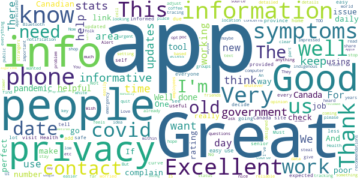
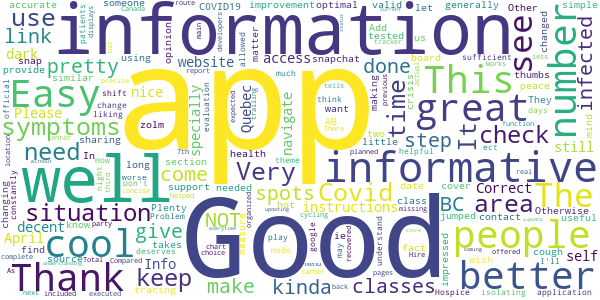
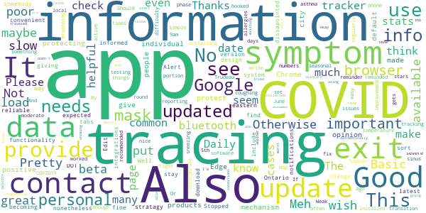
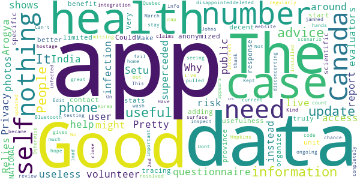
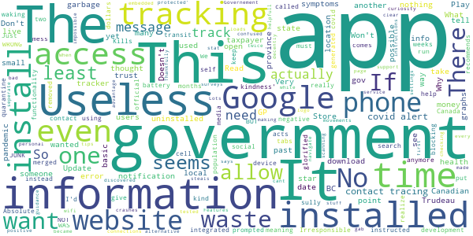

# Canada COVID-19
App version ``4.0.0``

Analyzed with [covid-apps-observer](http://github.com/covid-apps-observer) project, version ``0.1``

## App overview
| | |
|-------------------------|-------------------------| 
| **Name**&nbsp;&nbsp;&nbsp;&nbsp;&nbsp;&nbsp;&nbsp;&nbsp;&nbsp;&nbsp;&nbsp;&nbsp;&nbsp;&nbsp;&nbsp;&nbsp;&nbsp;&nbsp;&nbsp;&nbsp;&nbsp;&nbsp;&nbsp;&nbsp;&nbsp;&nbsp;&nbsp;&nbsp;&nbsp;&nbsp;&nbsp;&nbsp;&nbsp;&nbsp;&nbsp;&nbsp;&nbsp;&nbsp;&nbsp;&nbsp;  | Canada COVID-19 |
| **Unique identifier** | ca.gc.hcsc.canada.covid19 |
| **Link to Google Play** | [https://play.google.com/store/apps/details?id=ca.gc.hcsc.canada.covid19](https://play.google.com/store/apps/details?id=ca.gc.hcsc.canada.covid19) |
| **Summary**  | Stay informed about COVID-19. Developed in collaboration with Thrive Health. |
| **Privacy policy** | [https://www.thrive.health/covid19-collection-notice](https://www.thrive.health/covid19-collection-notice) |
| **Latest version** | 4.0.0 |
| **Last update** | 2020-07-10 02:09:48 |
| **Recent changes** | We are constantly optimizing our app and adding new features to help support you through COVID-19.  This version includes a number of UI/UX improvements, new content, as well as stability enhancements. |
| **Installs**  | 100,000+ |
| **Category** | Medical |
| **First release** | Mar 30, 2020 |
| **Size**  | 8.3M |
| **Supported Android version**  | 5.0 and up |

### Description
> Canada COVID-19 is designed for you to stay informed about COVID-19 in Canada and determine what actions and next steps you should take.  Recommendations are personalized and based on your personal risk factors.  You will receive timely updates with important news and alerts from Canada’s Ministry of Health.  Recommendations and content are automatically updated based on the latest guidelines related to COVID-19.
 This application has been developed in collaboration with Thrive Health, a Vancouver-based healthcare technology company.  
 SAFETY & SECURITY:
 You will only be asked to provide your age, postal code, and device location.  The data you provide will be combined with all user data and used to inform the provincial COVID-19 response, and to allow you to receive location-based alerts.
 Your data will not be sold. Your data will not be used for any purpose other than health care.
 We follow industry best practices for data security and privacy.  The data you provide is always encrypted and is stored in Canada.

### User interface
The developers of the app provide the following screenshots in the Google play store.
| | | |
|:-------------------------:|:-------------------------:|:-------------------------:|
 |   |  

## Development team
In the following we report the main information provided by the development team in the Google play store.

| | |
|-------------------------|-------------------------|
| **Developer**  | Health Canada | Santé Canada |
| **Website**  | - |
| **Email** | support@thrive.health |
| **Physical address**  | - |
| **Other developed apps**  | [https://play.google.com/store/apps/developer?id=Health+Canada+%7C+Sant%C3%A9+Canada](https://play.google.com/store/apps/developer?id=Health+Canada+%7C+Sant%C3%A9+Canada) |

## Android support

| | |
|-------------------------|-------------------------|
| **Declared target Android version**  | Pie, version 9 (API level 28) |
| **Effective target Android version**  | Pie, version 9 (API level 28) |
| **Minimum supported Android version**  | Lollipop, version 5.0 (API level 21) |
| **Maximum target Android version**  | - |

The larger the difference between the minimum and maximum supported Android versions, the better. A larger difference means a wider audience. For example, old phones have a very low Android version, so a high minimum supported Android version means that the app cannot be used by users with old phones, thus leading to accessibility problems. 

## Requested permissions

In the following we report the complete list of the permissions requested by the app. 

| **Permission** | **Protection level** | **Description** | 
|-------------------------|-------------------------|-------------------------|
 **android.permission ACCESS_COARSE_LOCATION** | :warning:**Dangerous** | Allows an app to access approximate location. 
 **android.permission ACCESS_FINE_LOCATION** | :warning:**Dangerous** | Allows an app to access precise location. 
 **android.permission ACCESS_NETWORK_STATE** | Normal | Allows applications to access information about networks. 
 **android.permission INTERNET** | Normal | Allows applications to open network sockets. 
 **android.permission READ_EXTERNAL_STORAGE** | :warning:**Dangerous** | Allows an application to read from external storage. 
 **android.permission REQUEST_INSTALL_PACKAGES** | Signature | Allows an application to request installing packages. 
 **com.google.android.c2dm.permission RECEIVE** | - | - 
 **com.google.android.finsky.permission BIND_GET_INSTALL_REFERRER_SERVICE** | - | - 

## Mentioned servers

| **Server** | **Registrant** | **Registrant country** | **Creation date** | 
|-------------------------|-------------------------|-------------------------|-------------------------|
 | googlesyndication.com | Google LLC | :us: US | 2003-01-21 06:17:24 |
 | google.com | Google LLC | :us: US | 1997-09-15 04:00:00 |
 | app-measurement.com | Google LLC | :us: US | 2015-06-19 20:13:31 |
 | branch.io | Branch | :us: US | 2011-11-10 13:52:13 |
 | crashlytics.com | Google LLC | :us: US | 2011-01-21 15:30:40 |
 | gstatic.com | Google LLC | :us: US | 2008-02-11 15:31:25 |
 | bnc.lt | - | - | 2016-11-14 00:00:00 |
 | googleapis.com | Google LLC | :us: US | 2005-01-25 17:52:26 |
 | googleadservices.com | Google LLC | :us: US | 2003-06-19 16:34:53 |

## Security analysis 

Below we report the main security warnings raised by our execution of the [Androwarn](https://github.com/maaaaz/androwarn) security analysis tool.

**Location lookup**
> - This application reads location information from all available providers (WiFi, GPS etc.) 

**Connection interfaces exfiltration**
> - This application reads details about the currently active data network 
> - This application tries to find out if the currently active data network is metered 

**Pim data leakage**
> - This application accesses the downloads folder 
> - This application accesses data stored in the clipboard 

## User ratings and reviews

Below we provide information about how end users are reacting to the app in terms of ratings and reviews in the Google Play store.

### Ratings

The Canada COVID-19 app has been installed by more than **100000** times. At this time, **570** rated the app and its average score is **3.78**. Below we show the distribution of the ratings across the usual star-based rating of Google Play

:star::star::star::star::star:: 290

:star::star::star::star:: 74

:star::star::star:: 79

:star::star:: 39

:star:: 85

### Reviews 

#### 5-star reviews

> Retired computer programmer here. I've reviewed the Apple-Google algorithm this app is based on and this app has excellent privacy. For those asking excellent questions about why it does not give more information about what is going on in your area, or why it does not link to your Contacts, the answer is privacy. This only know your province if you decide to manually tell it that info. Beyond that it has no idea where you've been or when you've been. Girl friends, boy friends, bars, clubs, moonlighting jobs, strange churches, political groups -- whatever -- this app does not know and cannot tell. People wanted privacy, that is privacy! Similarly with contacts. All the app knows are the random numbers of different phones it has been within 2 meters of for 15 minutes or more (I think they can adjust that). No names, no telephone numbers, no nothing that can identify people. Again, people wanted privacy and that is what we have here, privacy! Symptoms other people have in the area? Two parts to that: 1. One is that the symptoms of other people in your area might not be the symptoms you'll have. If it told you what symptoms other people in your area had this week -- the mismatch between them and you could cause you to ignore you infection until it is too late. Better that you simply be notified to call your provincial medical help number, and they can discuss with you any symptoms you have already and what to do next. 2. Privacy. The more questions the app asks, the more privacy-oriented people will complain. And you think they won't complain? People will complain about anything. If not something that concerns them, then they'll steal the 'agency' of someone else, steal their voice, and complain on their behalf. For example: a. People are complaining it won't work on phones more than 5 years old that do not have Bluetooth. It is not their phones they're worried about, it is "other people's phones, old folks, indigenous people, poc, etc." b. I'm an "old folk". Most of my fellow oldies have new phones, purchased 1 or 2 years ago when CDMA and GSM networks stopped working. I've heard of one senior whose phone is too old. And her phone is so old she can't get a signal sitting in a coffee shop 1/8 of a mile from a cell tower. Half the towers or more just do not carry the frequency for her old G3 phone. We seniors are able to stay home much more easily. We have our CPP (and hopefully a second pension). We don't have to go out to work. A lot of us are in nursing homes. We have less need for this app than people who are out and about working with the public and socializing with strangers. Covid contact is less a problem for us than the endless loneliness. c. Indigenous people, poc, disabled -- I fit in here and again I'm unhappy about others stealing our agency and speaking for us. There complaint is based on the old dangerous stereotype of white people saying non-white people are all poor. They are not all poor. And those that cannot work due to disability or do not work due to children, are generally like us seniors, they have an easier time of sheltering at home. d. I would be more worried about the working poor who deal with the general public. Race, sex, gender, and whatever does not come into it. +++ Those who are working poor and doing jobs like sale clerk or ticket taker -- coming in contact with dozens of strangers every day -- maybe those people should be given phones by the government. But that is not an issue with this app; that is something separate for the government to do. +++ e. THIS IS THE MAIN THING: An app that would provide notifications without using Bluetooth would have to trace our movements to work. There would be no other way. It would have to invade everyone's privacy. +++ This app is not perfect in everyone's opinion. No app will ever be perfect in everyone's opinion. BUT this app delivers maximum privacy while still doing the job of notifying us of covid contacts with minimum overhead load on our computers. +++  :date: __2020-08-04 08:56:31__

> Easy to use and to input daily symptoms. The purpose for the lack on contact tracing is to ensure privacy concerns on personal data.  :date: __2020-08-02 18:57:46__

> I heard its Excellent I'm on it Now Amen  :date: __2020-08-01 23:27:25__

> Installed easily with no issues.. Dont see why others have issues. Canadian stats was nice to see...  :date: __2020-08-01 08:20:46__

> Okay  :date: __2020-08-01 05:32:36__

> Easy peasy. No issues, hope I never have it contact me but if at risk would rather know.  :date: __2020-08-01 01:17:40__

> The app does its job. THIS IS NOT A CONTACT-TRACING APP. You're looking for COVID-Alert, which is in beta phase. I am using it right now. Do not give a low rating because you don't know how to read.  :date: __2020-07-29 07:23:52__

> Great experience, I like to know everything that happened in the world and good news and the bad  :date: __2020-07-26 01:27:31__

> Impressed 🖖  :date: __2020-07-25 03:50:03__

> great info soutce  :date: __2020-07-14 15:20:29__

#### 4-star reviews

> Its pretty cool but i kinda wish it had it so you can see what are other peoples symptoms are in your area for people using the app.. kinda how snapchat has snap spots in your area. Other then that pretty cool.  :date: __2020-08-02 18:40:50__

> It takes a long time to find link I want but generally a great source.  :date: __2020-07-31 18:10:34__

> This great for your peace of mind  :date: __2020-07-29 21:26:39__

> Very good support and optimal information-sharing through this crisis.  :date: __2020-07-28 22:22:10__

> Good but tracing would make it better  :date: __2020-07-25 19:27:34__

> Add "have you been tested for Covid-19" & "what date" in the section for symptoms (ie a cough)  :date: __2020-06-16 03:44:25__

> Well done. Informative and accurate. Plenty simple valid information 👍  :date: __2020-05-27 00:44:51__

> Easy to use and provide a useful health information.  :date: __2020-05-17 04:25:48__

> I like the fact that you've jumped on board with making an app for this situation I give you two thumbs up it is informative but needs to have a little more  :date: __2020-05-05 03:39:19__

> Good app! I am NOT impressed with how the classes keep changing to keep BC and AB in the same class! They are NOT having similar numbers, no matter how the classes are changed!  :date: __2020-05-04 21:13:09__

#### 3-star reviews

> Meh. Not great, maybe of some use to somebody. I had expected more functionality with integrations.  :date: __2020-08-01 04:55:14__

> Pretty dissapointed to find out it didn't include any sort of contact tracing information system, but it's a convenient way to stay informed of COVID-19 nonetheless.  :date: __2020-07-31 18:11:40__

> Stopped giving reliable notifications with latest version. No app exit stratagy, that's very poor design. Otherwise fine app but becoming very slow to load or change tabs. Edit: 2020-07-29 COVID-Alert beta not available for download in eastern Ontario?!?  :date: __2020-07-29 21:53:24__

> Well there is no DOT. to put in your temperature. Like 96.9 F do we write 97 F? Or 97.4 F we round it off to 97. This has to be fix. Something as simple as this should not be in the Beta testing phase.  :date: __2020-07-24 20:42:30__

> Basic app. I wish they hooked it to googles contact tracing by bluetooth, that would make it 5 stars for me. And i would be much happier. Its nice to have the numbers that easy to see but i don't think it gets updated often enough  :date: __2020-07-21 05:16:26__

> Daily reporting even if you don't have symptoms is good data.  :date: __2020-07-04 17:22:16__

> Pretty basic, wish this worked with the COVID tracking that was installed on my phone by Google. Also, I set the reminder for daily at 9am and it has only reminded me maybe 2-3 times since installing, which was 10-14 days ago.  :date: __2020-07-04 16:45:19__

> No local info. Weak app.  :date: __2020-06-19 14:47:23__

> slow to load and transition from page to page.  :date: __2020-06-16 02:26:59__

> Good app for COVID19 Info but no tracing portion  :date: __2020-06-09 22:22:43__

#### 2-star reviews

> Why does it need access to photos?  :date: __2020-08-01 11:55:35__

> Relies on self report instead of anonymized health unit data - very limited usefulness.  :date: __2020-07-31 20:33:48__

> A good start, decent app. Could benefit from adding contact tracing, scientific information, better stats and province-specific information... Make it truly a NATIONAL app to organize the response!  :date: __2020-07-30 02:06:55__

> Very disappointed. No Bluetooth integration. Kind of a fail, not completely but close.  :date: __2020-07-24 18:07:44__

> On the surface the app appears to do what it claims. I will update my review once I've had a chance to inspect the code for myself and do some testing of my own.  :date: __2020-07-05 23:34:48__

> Dont like it  :date: __2020-07-04 07:09:53__

> Can't get it to load update ? But phone gets jammed regularly in this ongoing hostage scenario.  :date: __2020-06-04 01:51:24__

> The Johns Hopkins website has much more current data about Canada, which is disconcerting. Otherwise it's nothing but advice to stay home and wash your hands. Good advice, but no data = not useful. Edit: Kept it on my phone in case it became more useful. It didn't. Have now deleted it.  :date: __2020-05-15 16:44:33__

> Good Not great but thank you!  :date: __2020-04-18 01:02:10__

> You are missing the most important number The number of resolved cases People seeing the number of cases where people have pulled through gives us hope  :date: __2020-04-14 12:41:43__

#### 1-star reviews

> What a mess! Just put this on a website. This is app is a waste of time and taxpayer dollars.  :date: __2020-08-03 20:33:31__

> This app should be removed from the play store. It is what comes up when I search for Covid Alert, the official Canadian Covid alert app. I installed this, and didn't realize I was not 'protected' and wouldn't get notifications if I became a contact of someone who has tested positive. Thankfully, out of curiosity, I was checking out how many connections my phone had made with other phones and discovered I didn't have the app I thought I had.  :date: __2020-08-03 19:21:33__

> Governement gab Lots of stuff, but impossible to navigate decently. No clear instructions or helpfull tips/guidance  :date: __2020-08-01 05:59:04__

> It seems like this app tracks your movements and steals personal your information you cant trust the Trudeau government.  :date: __2020-07-31 17:44:37__

> Don't like  :date: __2020-07-29 22:44:09__

> No tracking  :date: __2020-07-29 05:27:17__

> Installed app twice, loads first time and then crashes every time after that.  :date: __2020-07-24 22:46:07__

> Useless. The app doesn't take advantage of contact tracing making this just an alternative for information and basic surveys which the government could have had on a website.  :date: __2020-07-24 21:35:15__

> Very bad app. Features an embedded website for stat tracking.........  :date: __2020-07-24 03:45:34__

> Doesn't support contact tracing, at least Google says so in the settings.  :date: __2020-07-08 14:48:53__

