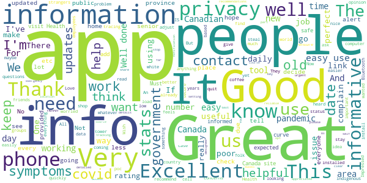
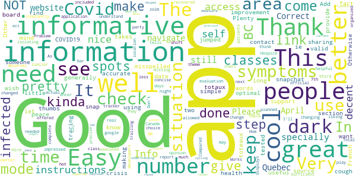
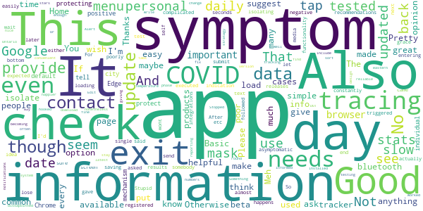
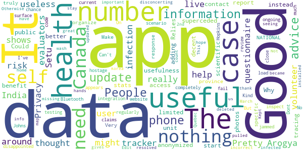
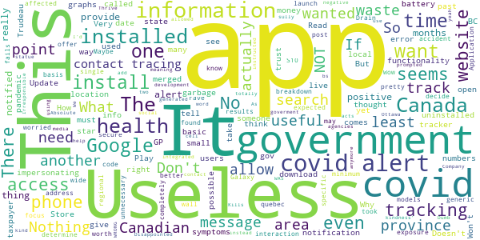

# Canada COVID-19
App version ``4.7.0``

Analyzed with [covid-apps-observer](http://github.com/covid-apps-observer) project, version ``0.1``

## App overview
| | |
|-------------------------|-------------------------| 
| **Name**&nbsp;&nbsp;&nbsp;&nbsp;&nbsp;&nbsp;&nbsp;&nbsp;&nbsp;&nbsp;&nbsp;&nbsp;&nbsp;&nbsp;&nbsp;&nbsp;&nbsp;&nbsp;&nbsp;&nbsp;&nbsp;&nbsp;&nbsp;&nbsp;&nbsp;&nbsp;&nbsp;&nbsp;&nbsp;&nbsp;&nbsp;&nbsp;&nbsp;&nbsp;&nbsp;&nbsp;&nbsp;&nbsp;&nbsp;&nbsp;  | Canada COVID-19 |
| **Unique identifier** | ca.gc.hcsc.canada.covid19 |
| **Link to Google Play** | [https://play.google.com/store/apps/details?id=ca.gc.hcsc.canada.covid19](https://play.google.com/store/apps/details?id=ca.gc.hcsc.canada.covid19) |
| **Summary**  | Stay informed about COVID-19. Developed in collaboration with Thrive Health. |
| **Privacy policy** | [https://www.thrive.health/covid19-collection-notice](https://www.thrive.health/covid19-collection-notice) |
| **Latest version** | 4.7.0 |
| **Last update** | 2020-10-10 01:27:26 |
| **Recent changes** | We are constantly optimizing our app and adding new features to help support you through COVID-19.  This version includes a number of UI/UX improvements, new content, as well as stability enhancements. |
| **Installs**  | 100,000+ |
| **Category** | Medical |
| **First release** | Mar 30, 2020 |
| **Size**  | 9.1M |
| **Supported Android version**  | 5.0 and up |

### Description
> Canada COVID-19 is designed for you to stay informed about COVID-19 in Canada and determine what actions and next steps you should take.  Recommendations are personalized and based on your personal risk factors.  You will receive timely updates with important news and alerts from Canada’s Ministry of Health.  Recommendations and content are automatically updated based on the latest guidelines related to COVID-19.
 This application has been developed in collaboration with Thrive Health, a Vancouver-based healthcare technology company.  
 SAFETY & SECURITY:
 You will only be asked to provide your age, postal code, and device location.  The data you provide will be combined with all user data and used to inform the provincial COVID-19 response, and to allow you to receive location-based alerts.
 Your data will not be sold. Your data will not be used for any purpose other than health care.
 We follow industry best practices for data security and privacy.  The data you provide is always encrypted and is stored in Canada.

### User interface
The developers of the app provide the following screenshots in the Google play store.
| | | |
|:-------------------------:|:-------------------------:|:-------------------------:|
 |   |  

## Development team
In the following we report the main information provided by the development team in the Google play store.

| | |
|-------------------------|-------------------------|
| **Developer**  | Health Canada | Santé Canada |
| **Website**  | - |
| **Email** | support@thrive.health |
| **Physical address**  | - |
| **Other developed apps**  | [https://play.google.com/store/apps/developer?id=Health+Canada+%7C+Sant%C3%A9+Canada](https://play.google.com/store/apps/developer?id=Health+Canada+%7C+Sant%C3%A9+Canada) |

## Android support

| | |
|-------------------------|-------------------------|
| **Declared target Android version**  | Pie, version 9 (API level 28) |
| **Effective target Android version**  | Pie, version 9 (API level 28) |
| **Minimum supported Android version**  | Lollipop, version 5.0 (API level 21) |
| **Maximum target Android version**  | - |

The larger the difference between the minimum and maximum supported Android versions, the better. A larger difference means a wider audience. For example, old phones have a very low Android version, so a high minimum supported Android version means that the app cannot be used by users with old phones, thus leading to accessibility problems. 

## Requested permissions

In the following we report the complete list of the permissions requested by the app. 

| **Permission** | **Protection level** | **Description** | 
|-------------------------|-------------------------|-------------------------|
 **android.permission ACCESS_COARSE_LOCATION** | :warning:**Dangerous** | Allows an app to access approximate location. 
 **android.permission ACCESS_FINE_LOCATION** | :warning:**Dangerous** | Allows an app to access precise location. 
 **android.permission ACCESS_NETWORK_STATE** | Normal | Allows applications to access information about networks. 
 **android.permission CAMERA** | :warning:**Dangerous** | Required to be able to access the camera device. 
 **android.permission INTERNET** | Normal | Allows applications to open network sockets. 
 **android.permission READ_EXTERNAL_STORAGE** | :warning:**Dangerous** | Allows an application to read from external storage. 
 **android.permission REQUEST_INSTALL_PACKAGES** | Signature | Allows an application to request installing packages. 
 **com.google.android.c2dm.permission RECEIVE** | - | - 
 **com.google.android.finsky.permission BIND_GET_INSTALL_REFERRER_SERVICE** | - | - 

## Mentioned servers

| **Server** | **Registrant** | **Registrant country** | **Creation date** | 
|-------------------------|-------------------------|-------------------------|-------------------------|
 | googlesyndication.com | Google LLC | :us: US | 2003-01-21 06:17:24 |
 | google.com | Google LLC | :us: US | 1997-09-15 04:00:00 |
 | app-measurement.com | Google LLC | :us: US | 2015-06-19 20:13:31 |
 | branch.io | Branch | :us: US | 2011-11-10 13:52:13 |
 | crashlytics.com | Google LLC | :us: US | 2011-01-21 15:30:40 |
 | gstatic.com | Google LLC | :us: US | 2008-02-11 15:31:25 |
 | bnc.lt | - | - | 2016-11-14 00:00:00 |
 | googleapis.com | Google LLC | :us: US | 2005-01-25 17:52:26 |
 | googleadservices.com | Google LLC | :us: US | 2003-06-19 16:34:53 |

## Security analysis 

Below we report the main security warnings raised by our execution of the [Androwarn](https://github.com/maaaaz/androwarn) security analysis tool.

**Location lookup**
> - This application reads location information from all available providers (WiFi, GPS etc.) 

**Connection interfaces exfiltration**
> - This application reads details about the currently active data network 
> - This application tries to find out if the currently active data network is metered 

**Pim data leakage**
> - This application accesses the downloads folder 
> - This application accesses data stored in the clipboard 

## User ratings and reviews

Below we provide information about how end users are reacting to the app in terms of ratings and reviews in the Google Play store.

### Ratings

The Canada COVID-19 app has been installed by more than **100000** times. At this time, **736** rated the app and its average score is **3.7326732**. Below we show the distribution of the ratings across the usual star-based rating of Google Play

:star::star::star::star::star:: 387

:star::star::star::star:: 94

:star::star::star:: 73

:star::star:: 36

:star:: 146

### Reviews 

#### 5-star reviews

> Seamless  :date: __2020-10-16 02:54:07__

> Good  :date: __2020-10-13 14:58:43__

> Easy to use and so easy to contribute to public safety. Super!  :date: __2020-10-12 14:09:30__

> It's easy to use .  :date: __2020-10-09 15:43:20__

> I recommend and encourage all Canadians to install this.  :date: __2020-10-02 19:26:48__

> Simple and contributing to success  :date: __2020-09-25 17:09:02__

> The more people who use this the better it gets. I like the app.  :date: __2020-09-24 20:41:02__

> Great app lots of useful information.  :date: __2020-09-19 21:33:55__

> Informative app  :date: __2020-09-11 16:35:21__

> All the info I need  :date: __2020-08-28 02:47:18__

#### 4-star reviews

> Needs a dark mode.  :date: __2020-09-25 07:43:49__

> In French there are some words misspelled toteaux should be totaux  :date: __2020-09-04 05:41:23__

> Good  :date: __2020-08-30 14:21:55__

> The app doesn't let you know if you come in contact with someone who has C0VID19. This needs improvement. Otherwise it's a good app.  :date: __2020-08-16 08:19:12__

> Its pretty cool but i kinda wish it had it so you can see what are other peoples symptoms are in your area for people using the app.. kinda how snapchat has snap spots in your area. Other then that pretty cool.  :date: __2020-08-02 18:40:50__

> It takes a long time to find link I want but generally a great source.  :date: __2020-07-31 18:10:34__

> This great for your peace of mind  :date: __2020-07-29 21:26:39__

> Very good support and optimal information-sharing through this crisis.  :date: __2020-07-28 22:22:10__

> Good but tracing would make it better  :date: __2020-07-25 19:27:34__

> Add "have you been tested for Covid-19" & "what date" in the section for symptoms (ie a cough)  :date: __2020-06-16 03:44:25__

#### 3-star reviews

> Stupid app wont let me send the daily check in results  :date: __2020-10-08 08:32:50__

> This is not a be all end all app. It has good information. After you submit your symptoms, you lose the bottom menu (Home, Stats, etc). You have to back out to get to this menu. Not easy to exit the app.  :date: __2020-10-05 21:44:01__

> For such a simple app, it sure is slow. You tap an option (such as the check-in option) and you wait 5 seconds before anything happens with no indication that your tap actually registered. And it's not like the next screen has anything complicated that it needs to be "loading" either. It's just text. So what's up?  :date: __2020-10-05 20:06:20__

> It doesn't ask every day to check in like it used to. And it seems to be easily triggered to suggest isolating at almost any symptom. Also, when it asked if I had been tested, or said to isolate even though I was asymptomatic. A few days later the test came back negative. If I had followed the recommendations it gave I'd be home most of the time and constantly being tested. Good idea, poorly executed. I like the media releases though. That's it's saving grace.  :date: __2020-09-29 14:38:34__

> This app tells me every single day with that day's date to self-isolate for 14 days, even though I'm entering NO SYMPTOMS.  :date: __2020-09-26 21:18:16__

> Meh. Not great, maybe of some use to somebody. I had expected more functionality with integrations.  :date: __2020-08-01 04:55:14__

> Pretty dissapointed to find out it didn't include any sort of contact tracing information system, but it's a convenient way to stay informed of COVID-19 nonetheless.  :date: __2020-07-31 18:11:40__

> Stopped giving reliable notifications with latest version. No app exit stratagy, that's very poor design. Otherwise fine app but becoming very slow to load or change tabs. Edit: 2020-07-29 COVID-Alert beta not available for download in eastern Ontario?!?  :date: __2020-07-29 21:53:24__

> Well there is no DOT. to put in your temperature. Like 96.9 F do we write 97 F? Or 97.4 F we round it off to 97. This has to be fix. Something as simple as this should not be in the Beta testing phase.  :date: __2020-07-24 20:42:30__

> Basic app. I wish they hooked it to googles contact tracing by bluetooth, that would make it 5 stars for me. And i would be much happier. Its nice to have the numbers that easy to see but i don't think it gets updated often enough  :date: __2020-07-21 05:16:26__

#### 2-star reviews

> I thought this was the tracker app. It isn't and it really isn't useful  :date: __2020-10-07 04:46:06__

> Good  :date: __2020-08-11 04:03:41__

> Pretty useless for the user The app is nothing but a questionnaire that might help Health Canada from volunteer self evaluators, but shows no live data of infection risk around me like the Arogya Setu App from India. Privacy superceded public health.  :date: __2020-08-06 05:42:16__

> Why does it need access to photos?  :date: __2020-08-01 11:55:35__

> Relies on self report instead of anonymized health unit data - very limited usefulness.  :date: __2020-07-31 20:33:48__

> A good start, decent app. Could benefit from adding contact tracing, scientific information, better stats and province-specific information... Make it truly a NATIONAL app to organize the response!  :date: __2020-07-30 02:06:55__

> Very disappointed. No Bluetooth integration. Kind of a fail, not completely but close.  :date: __2020-07-24 18:07:44__

> On the surface the app appears to do what it claims. I will update my review once I've had a chance to inspect the code for myself and do some testing of my own.  :date: __2020-07-05 23:34:48__

> Dont like it  :date: __2020-07-04 07:09:53__

> Can't get it to load update ? But phone gets jammed regularly in this ongoing hostage scenario.  :date: __2020-06-04 01:51:24__

#### 1-star reviews

> This is not the app you want. It notified me to post a positive interaction on a wall. I don't want to be notified of any thing that is not a covid exposure by a covid app  :date: __2020-10-10 18:21:58__

> Nothing to rave about I expected at the minimum covid results in my area code is this the app that quebec took months to decide if they would offer it ! Wow if so I am really worried now !!!!!  :date: __2020-10-07 02:03:05__

> There should only be one Health Canada covid app: covid alert I wanted to install the Canadian covid alert app, but installed this one by accident. Covid alert is a useful secure app, this thing seems pretty useless. Maybe health canada should focus on a single covid app, or better: provide covid alert functionality through the covid 19 app.  :date: __2020-10-06 13:05:03__

> Application fails to launch on Galaxy S10 models.  :date: __2020-09-30 20:31:40__

> Drain battery - not worth having  :date: __2020-09-27 02:49:46__

> What if the point of this app? It gives generic information on a wide basis. How can I determine if my specific area is affected. I know the province numbers may be up but that does not address our regional breakdown. I found this app to be completely useless and unnecessary. It would be more useful had it been merged with the covid alert app. Disappointed. As useless as another statue in Ottawa.  :date: __2020-09-23 15:05:58__

> This comes up if you search for Canada Covid app. But it is NOT the alert app - you must add the word Alert to your search. Dumb!!  :date: __2020-09-10 18:26:00__

> A Company called Thrive health is impersonating Health Canada and Google thinks: "yeah, apps impersonating goverment agencies should be totally allowed."  :date: __2020-09-03 17:10:22__

> Not the right app. Don't use  :date: __2020-08-26 13:37:39__

> This app is bs. "F" off government of Canada  :date: __2020-08-25 13:05:19__

