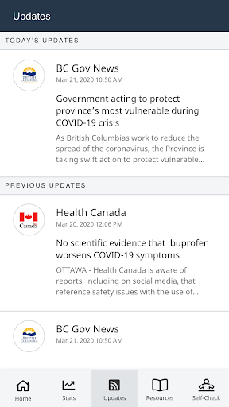
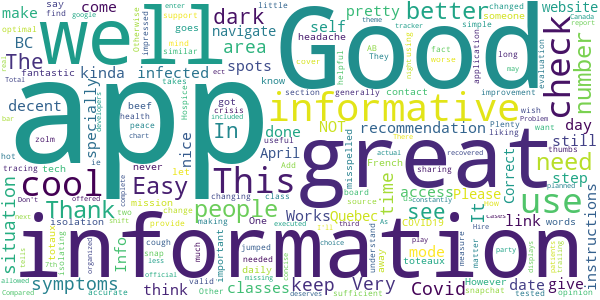
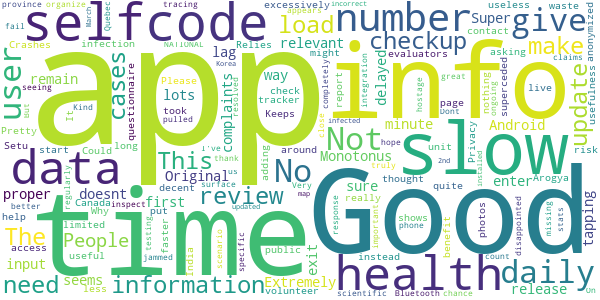
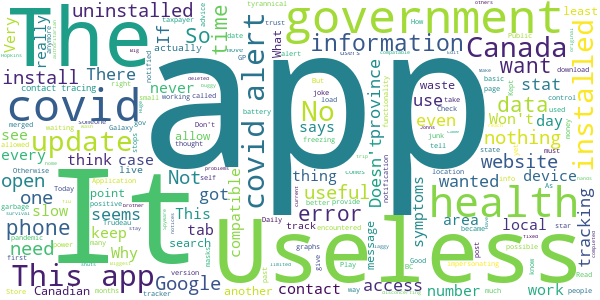

# Canada COVID-19
App version ``5.4.0``

Analyzed with [covid-apps-observer](http://github.com/covid-apps-observer) project, version ``0.1``

## App overview
| | |
|-------------------------|-------------------------| 
| **Name**                                          | Canada COVID-19 |
| **Unique identifier** | ca.gc.hcsc.canada.covid19 |
| **Link to Google Play** | [https://play.google.com/store/apps/details?id=ca.gc.hcsc.canada.covid19](https://play.google.com/store/apps/details?id=ca.gc.hcsc.canada.covid19) |
| **Summary**  | Stay informed about COVID-19. Developed in collaboration with Thrive Health. |
| **Privacy policy** | [https://www.thrive.health/covid19-collection-notice](https://www.thrive.health/covid19-collection-notice) |
| **Latest version** | 5.4.0 |
| **Last update** | 2021-01-11 17:55:19 |
| **Recent changes** | We are constantly optimizing our app and adding new features to help support you through COVID-19.  This version includes a number of UI/UX improvements, new content, as well as stability enhancements. |
| **Installs**  | 100,000+ |
| **Category** | Medical |
| **First release** | Mar 30, 2020 |
| **Size**  | 9.3M |
| **Supported Android version**  | 5.0 and up |

### Description
> Canada COVID-19 is designed for you to stay informed about COVID-19 in Canada and determine what actions and next steps you should take.  Recommendations are personalized and based on your personal risk factors.  You will receive timely updates with important news and alerts from Canada’s Ministry of Health.  Recommendations and content are automatically updated based on the latest guidelines related to COVID-19.
 This application has been developed in collaboration with Thrive Health, a Vancouver-based healthcare technology company.  
 SAFETY & SECURITY:
 You will only be asked to provide your age, postal code, and device location.  The data you provide will be combined with all user data and used to inform the provincial COVID-19 response, and to allow you to receive location-based alerts.
 Your data will not be sold. Your data will not be used for any purpose other than health care.
 We follow industry best practices for data security and privacy.  The data you provide is always encrypted and is stored in Canada.

### User interface
The developers of the app provide the following screenshots in the Google play store.
| | | |
|:-------------------------:|:-------------------------:|:-------------------------:|
 |   |  

## Development team
In the following we report the main information provided by the development team in the Google play store.

| | |
|-------------------------|-------------------------|
| **Developer**  | Health Canada | Santé Canada |
| **Website**  | - |
| **Email** | support@thrive.health |
| **Physical address**  | - |
| **Other developed apps**  | [https://play.google.com/store/apps/developer?id=Health+Canada+%7C+Sant%C3%A9+Canada](https://play.google.com/store/apps/developer?id=Health+Canada+%7C+Sant%C3%A9+Canada) |

## Android support

| | |
|-------------------------|-------------------------|
| **Declared target Android version**  | Android10, version 10 (API level 29) |
| **Effective target Android version**  | Android10, version 10 (API level 29) |
| **Minimum supported Android version**  | Lollipop, version 5.0 (API level 21) |
| **Maximum target Android version**  | - |

The larger the difference between the minimum and maximum supported Android versions, the better. A larger difference means a wider audience. For example, old phones have a very low Android version, so a high minimum supported Android version means that the app cannot be used by users with old phones, thus leading to accessibility problems. 

## Requested permissions

In the following we report the complete list of the permissions requested by the app. 

| **Permission** | **Protection level** | **Description** | 
|-------------------------|-------------------------|-------------------------|
 **android.permission ACCESS_COARSE_LOCATION** | :warning:**Dangerous** | Allows an app to access approximate location. 
 **android.permission ACCESS_FINE_LOCATION** | :warning:**Dangerous** | Allows an app to access precise location. 
 **android.permission ACCESS_NETWORK_STATE** | Normal | Allows applications to access information about networks. 
 **android.permission CAMERA** | :warning:**Dangerous** | Required to be able to access the camera device. 
 **android.permission INTERNET** | Normal | Allows applications to open network sockets. 
 **android.permission READ_EXTERNAL_STORAGE** | :warning:**Dangerous** | Allows an application to read from external storage. 
 **android.permission REQUEST_INSTALL_PACKAGES** | Signature | Allows an application to request installing packages. 
 **com.google.android.c2dm.permission RECEIVE** | - | - 
 **com.google.android.finsky.permission BIND_GET_INSTALL_REFERRER_SERVICE** | - | - 

## Mentioned servers

| **Server** | **Registrant** | **Registrant country** | **Creation date** | 
|-------------------------|-------------------------|-------------------------|-------------------------|
 | googlesyndication.com | Google LLC | :us: US | 2003-01-21 06:17:24 |
 | google.com | Google LLC | :us: US | 1997-09-15 04:00:00 |
 | app-measurement.com | Google LLC | :us: US | 2015-06-19 20:13:31 |
 | branch.io | Branch | :us: US | 2011-11-10 13:52:13 |
 | crashlytics.com | Google LLC | :us: US | 2011-01-21 15:30:40 |
 | gstatic.com | Google LLC | :us: US | 2008-02-11 15:31:25 |
 | bnc.lt | - | - | 2016-11-14 00:00:00 |
 | googleapis.com | Google LLC | :us: US | 2005-01-25 17:52:26 |
 | googleadservices.com | Google LLC | :us: US | 2003-06-19 16:34:53 |

## Security analysis 

Below we report the main security warnings raised by our execution of the [Androwarn](https://github.com/maaaaz/androwarn) security analysis tool.

**Location lookup**
> - This application reads location information from all available providers (WiFi, GPS etc.) 

**Connection interfaces exfiltration**
> - This application reads details about the currently active data network 
> - This application tries to find out if the currently active data network is metered 

**Pim data leakage**
> - This application accesses the downloads folder 
> - This application accesses data stored in the clipboard 

## User ratings and reviews

Below we provide information about how end users are reacting to the app in terms of ratings and reviews in the Google Play store.

### Ratings

The Canada COVID-19 app has been installed by more than **100000** times. At this time, **837** rated the app and its average score is **3.63**. Below we show the distribution of the ratings across the usual star-based rating of Google Play

:star::star::star::star::star:: 419

:star::star::star::star:: 109

:star::star::star:: 75

:star::star:: 50

:star:: 184

### Reviews 

#### 5-star reviews

> Thank you, Canada 🇨🇦! شكراً كندا..  :date: __2021-01-16 15:53:54__

> I use it some times it's okay  :date: __2020-12-20 20:47:51__

> Great to be monitored.  :date: __2020-12-08 09:26:26__

> Easy to use... The more people that use it, the more useful it becomes as a tracking tool!!!  :date: __2020-11-27 22:41:53__

> It's amazing  :date: __2020-11-23 07:53:48__

> Good way to get information on the viruses  :date: __2020-11-15 13:01:53__

> Very useful and helpful, thanks for introducing this app through out the pandemic  :date: __2020-11-07 00:02:13__

> Get the app. Stay safe.  :date: __2020-10-29 03:27:31__

> Seamless  :date: __2020-10-16 02:54:07__

> Good  :date: __2020-10-13 14:58:43__

#### 4-star reviews

> Great tech on a fantastic mission.  :date: __2021-01-05 02:10:47__

> I think the app is very important and I use it daily to check in. However 14 day isolation for a headache?  :date: __2020-10-30 00:26:24__

> Needs a dark mode.  :date: __2020-09-25 07:43:49__

> In French there are some words misspelled toteaux should be totaux  :date: __2020-09-04 05:41:23__

> Good  :date: __2020-08-30 14:21:55__

> The app doesn't let you know if you come in contact with someone who has C0VID19. This needs improvement. Otherwise it's a good app.  :date: __2020-08-16 08:19:12__

> Its pretty cool but i kinda wish it had it so you can see what are other peoples symptoms are in your area for people using the app.. kinda how snapchat has snap spots in your area. Other then that pretty cool.  :date: __2020-08-02 18:40:50__

> It takes a long time to find link I want but generally a great source.  :date: __2020-07-31 18:10:34__

> This great for your peace of mind  :date: __2020-07-29 21:26:39__

> Very good support and optimal information-sharing through this crisis.  :date: __2020-07-28 22:22:10__

#### 3-star reviews

> More localized COVID-19 info would be useful. Perhaps user should configure first 3 digits of postal code and informed accordingly. In addition, could this app inform us when new releases of the #CovidAlert app are issued (since the notif app does not currently push that kind of useful info)?  :date: __2021-01-11 16:42:18__

> I think the app is important, however, everyday it's telling me I have to self isolate every. I haven't reported or have any symptoms, why does it tell me to self isolate?  :date: __2021-01-10 19:54:18__

> Good concept, terrible execution: huge layout shifts and slow responses with no visual feedback on tap events make for a horrible user experience. It's hard to mess up buttons and forms this badly without some concentrated effort.  :date: __2020-11-21 15:10:55__

> Mine won't work away from computer  :date: __2020-11-10 17:19:45__

> Good idea. I've been using it for a while now. On the other hand it tells me I should self-isolate for fourteen days LITERALLY EVERY TIME I self-report - even after a month of "no symptoms". The worst I've ever reported is a mild headache. I don't get it.  :date: __2020-11-05 17:55:23__

> Stupid app wont let me send the daily check in results  :date: __2020-10-08 08:32:50__

> This is not a be all end all app. It has good information. After you submit your symptoms, you lose the bottom menu (Home, Stats, etc). You have to back out to get to this menu. Not easy to exit the app.  :date: __2020-10-05 21:44:01__

> For such a simple app, it sure is slow. You tap an option (such as the check-in option) and you wait 5 seconds before anything happens with no indication that your tap actually registered. And it's not like the next screen has anything complicated that it needs to be "loading" either. It's just text. So what's up?  :date: __2020-10-05 20:06:20__

> It doesn't ask every day to check in like it used to. And it seems to be easily triggered to suggest isolating at almost any symptom. Also, when it asked if I had been tested, or said to isolate even though I was asymptomatic. A few days later the test came back negative. If I had followed the recommendations it gave I'd be home most of the time and constantly being tested. Good idea, poorly executed. I like the media releases though. That's it's saving grace.  :date: __2020-09-29 14:38:34__

> This app tells me every single day with that day's date to self-isolate for 14 days, even though I'm entering NO SYMPTOMS.  :date: __2020-09-26 21:18:16__

#### 2-star reviews

> Monotonus doesnt give any relevant info.  :date: __2021-01-16 05:40:33__

> Original complaints I have remain since first release: 1) Extremely slow. 2) No proper way to exit app Android 6.0.1.  :date: __2021-01-12 23:17:02__

> Super slow, lots of lag and very delayed user input! Not sure what all this app does and is doing, but it seems that 1 minute for tapping 6 times to enter daily checkup info is excessively long and a waste of time. This review took less time than 1 daily checkup.  :date: __2021-01-12 17:24:08__

> Crashes  :date: __2021-01-11 12:15:36__

> Keeps asking for codes that I don't have, or can't put in as it's a 1 time code.  :date: __2020-12-19 18:53:15__

> Good to have app but it is quite slow to load the self check page. Please make it faster  :date: __2020-12-02 14:31:08__

> I thought this was the tracker app. It isn't and it really isn't useful  :date: __2020-10-07 04:46:06__

> Good  :date: __2020-08-11 04:03:41__

> Pretty useless for the user The app is nothing but a questionnaire that might help Health Canada from volunteer self evaluators, but shows no live data of infection risk around me like the Arogya Setu App from India. Privacy superceded public health.  :date: __2020-08-06 05:42:16__

> Why does it need access to photos?  :date: __2020-08-01 11:55:35__

#### 1-star reviews

> 0 The app shuts down before being completed.  :date: __2021-01-14 21:24:38__

> Error problems  :date: __2021-01-14 18:40:00__

> Big brother Spyware. Biggest joke over a 99.99% survival flu. Huge power trip and over reach by authoritarian government allowed by weak people who do not value freedoms and have never experienced hardship in their lives. Creeping normality of tyrannical control. End the lockdown. No more masks. No more tyrannical control.  :date: __2021-01-10 08:39:13__

> App does not work!  :date: __2021-01-08 17:25:00__

> Tests my patience! If I didn't think it was important to report COVID-19 symptoms, I would never use this app! It is so slow, and I mean slow that you don't know if it has sensed my touch selection or not so you tap again and again! Keeps showing that the app encountered an error when I load this app. Why did you move the Daily Check-In from being the first item on the page when it starts?!  :date: __2021-01-01 16:44:30__

> Since last update Stats don't update at all like is use to do for every day the stats for the day don't display  :date: __2020-12-28 01:23:01__

> "Application error" ...not working  :date: __2020-12-27 02:00:19__

> Update to previous post: I uninstalled after clearing data, rebooted phone and reinstalled. As soon as I selected my province I got the "app encountered a error" again. So I got rid of it.  :date: __2020-12-26 17:18:38__

> All of a, sudden its crashing every time I open it. It was fine yesterday. I don't suppose an upgrade kludged it?  :date: __2020-12-26 03:49:28__

> Doesn't update anymore. Cleared cache and data  :date: __2020-12-06 16:54:10__

