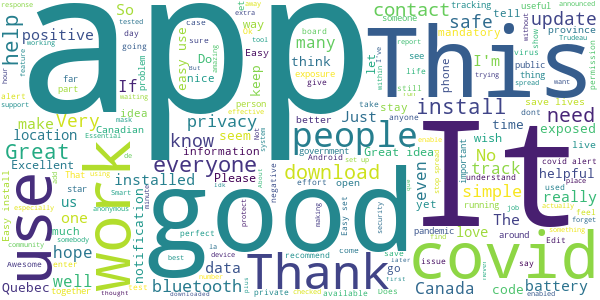
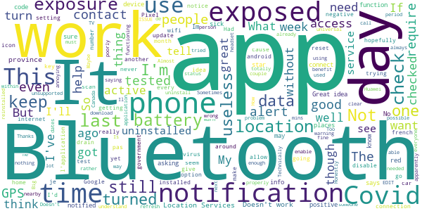

# COVID Alert
App version ``1.1.1``

Analyzed with [covid-apps-observer](http://github.com/covid-apps-observer) project, version ``0.1``

## App overview
| | |
|-------------------------|-------------------------| 
| **Name**&nbsp;&nbsp;&nbsp;&nbsp;&nbsp;&nbsp;&nbsp;&nbsp;&nbsp;&nbsp;&nbsp;&nbsp;&nbsp;&nbsp;&nbsp;&nbsp;&nbsp;&nbsp;&nbsp;&nbsp;&nbsp;&nbsp;&nbsp;&nbsp;&nbsp;&nbsp;&nbsp;&nbsp;&nbsp;&nbsp;&nbsp;&nbsp;&nbsp;&nbsp;&nbsp;&nbsp;&nbsp;&nbsp;&nbsp;&nbsp;  | COVID Alert |
| **Unique identifier** | ca.gc.hcsc.canada.stopcovid |
| **Link to Google Play** | [https://play.google.com/store/apps/details?id=ca.gc.hcsc.canada.stopcovid](https://play.google.com/store/apps/details?id=ca.gc.hcsc.canada.stopcovid) |
| **Summary**  | Health Canada Exposure Notification |
| **Privacy policy** | [https://www.canada.ca/en/public-health/services/diseases/coronavirus-disease-covid-19/covid-alert/privacy-policy.html](https://www.canada.ca/en/public-health/services/diseases/coronavirus-disease-covid-19/covid-alert/privacy-policy.html) |
| **Latest version** | 1.1.1 |
| **Last update** | 2020-11-06 21:56:34 |
| **Recent changes** | - Updated exposed screen for people who have not chosen a province or territory or who have chosen one that is not yet supporting the app. - Standardized the number of exposure checks when the app is being used. |
| **Installs**  | 1,000,000+ |
| **Category** | Health & Fitness |
| **First release** | Jul 29, 2020 |
| **Size**  | 43M |
| **Supported Android version**  | 6.0 and up |

### Description
> Together, let’s slow the spread of COVID-19. Canada's COVID Alert app notifies you if someone you were near in the past 14 days tells the app they tested positive.
 COVID Alert uses Bluetooth to exchange random codes with nearby phones. It does not use or access any location data. COVID Alert works by determining how far away other phones are by the strength of their Bluetooth signal. 
 Several times a day, COVID Alert checks a list of codes from people who tell the app they tested positive. You’ll get a notification if a code you received matches one of the positive codes.
 If you test positive for COVID-19 you’ll receive a one-time key with your diagnosis to enter into COVID Alert. The app asks permission to share your random codes from the last 14 days with a central server.
 Other phones using COVID Alert check the central server periodically throughout the day. If they recorded any codes that match the codes in the central server, their user will be notified that they were exposed.
 COVID Alert has no way of knowing:
 -your location - COVID Alert does not use GPS or location services
 -your name or address
 -the place or time you were near someone
 -if you're currently near someone who was previously diagnosed
 Provincial and territorial governments are working to support COVID Alert across Canada. In some places, people cannot yet report a COVID-19 diagnosis through this app.
 It’s still helpful to keep COVID Alert on, no matter where you are.  That way, when people are able to report a diagnosis, you’ll find out if you were near them.
 COVID Alert was built by Health Canada with the Canadian Digital Service on the private exposure notification framework by Apple and Google.

### User interface
The developers of the app provide the following screenshots in the Google play store.
| | | |
|:-------------------------:|:-------------------------:|:-------------------------:|
 |   |   |   | 
 |  

## Development team
In the following we report the main information provided by the development team in the Google play store.

| | |
|-------------------------|-------------------------|
| **Developer**  | Health Canada | Santé Canada |
| **Website**  | [https://www.canada.ca/en/public-health/services/diseases/coronavirus-disease-covid-19/covid-alert/help.html](https://www.canada.ca/en/public-health/services/diseases/coronavirus-disease-covid-19/covid-alert/help.html) |
| **Email** | hc.AlerteCOVIDAlert.sc@canada.ca |
| **Physical address**  | - |
| **Other developed apps**  | [https://play.google.com/store/apps/developer?id=Health+Canada+%7C+Sant%C3%A9+Canada](https://play.google.com/store/apps/developer?id=Health+Canada+%7C+Sant%C3%A9+Canada) |

## Android support

| | |
|-------------------------|-------------------------|
| **Declared target Android version**  | Android10, version 10 (API level 29) |
| **Effective target Android version**  | Android10, version 10 (API level 29) |
| **Minimum supported Android version**  | Marshmallow, version 6.0 (API level 23) |
| **Maximum target Android version**  | - |

The larger the difference between the minimum and maximum supported Android versions, the better. A larger difference means a wider audience. For example, old phones have a very low Android version, so a high minimum supported Android version means that the app cannot be used by users with old phones, thus leading to accessibility problems. 

## Requested permissions

In the following we report the complete list of the permissions requested by the app. 

| **Permission** | **Protection level** | **Description** | 
|-------------------------|-------------------------|-------------------------|
 **android.permission ACCESS_NETWORK_STATE** | Normal | Allows applications to access information about networks. 
 **android.permission ACCESS_WIFI_STATE** | Normal | Allows applications to access information about Wi-Fi networks. 
 **android.permission BLUETOOTH** | Normal | Allows applications to connect to paired bluetooth devices. 
 **android.permission FOREGROUND_SERVICE** | Normal | Allows a regular application to use Service.startForeground. 
 **android.permission GET_TASKS** | Deprecated | This constant was deprecated in API level 21. No longer enforced. 
 **android.permission INTERNET** | Normal | Allows applications to open network sockets. 
 **android.permission RECEIVE_BOOT_COMPLETED** | Normal | Allows an application to receive the Intent.ACTION_BOOT_COMPLETED that is broadcast after the system finishes booting. 
 **android.permission WAKE_LOCK** | Normal | Allows using PowerManager WakeLocks to keep processor from sleeping or screen from dimming. 

## Mentioned servers

| **Server** | **Registrant** | **Registrant country** | **Creation date** | 
|-------------------------|-------------------------|-------------------------|-------------------------|
 | android.com | Google LLC | :us: US | 1997-06-23 04:00:00 |
 | google.com | Google LLC | :us: US | 1997-09-15 04:00:00 |
 | googleapis.com | Google LLC | :us: US | 2005-01-25 17:52:26 |

## Security analysis 

Below we report the main security warnings raised by our execution of the [Androwarn](https://github.com/maaaaz/androwarn) security analysis tool.

**Telephony identifiers leakage**
> - This application reads the numeric name (MCC+MNC) of current registered operator 
> - This application reads the operator name 

**Connection interfaces exfiltration**
> - This application reads details about the currently active data network 
> - This application tries to find out if the currently active data network is metered 

**Suspicious connection establishment**
> - This application opens a Socket and connects it to the remote address '' on the 'N/A' port  
> - This application opens a Socket and connects it to the remote address 'Ljava/lang/StringBuilder;->toString()Ljava/lang/String;' on the ': connect, resolve' port  
> - This application opens a Socket and connects it to the remote address 'Ljava/lang/StringBuilder;->toString()Ljava/lang/String;' on the 'N/A' port  
> - This application opens a Socket and connects it to the remote address 'Ljava/net/Proxy;->type()Ljava/net/Proxy$Type;' on the 'N/A' port  
> - This application opens a Socket and connects it to the remote address 'timeout' on the 'N/A' port  

**Pim data leakage**
> - This application accesses data stored in the clipboard 

**Code execution**
> - This application loads a native library 
> - This application executes a UNIX command 

## User ratings and reviews

Below we provide information about how end users are reacting to the app in terms of ratings and reviews in the Google Play store.

### Ratings

The COVID Alert app has been installed by more than **1000000** times. At this time, **6268** rated the app and its average score is **3.6957188**. Below we show the distribution of the ratings across the usual star-based rating of Google Play

:star::star::star::star::star:: 3403

:star::star::star::star:: 690

:star::star::star:: 431

:star::star:: 354

:star:: 1390

### Reviews 

#### 5-star reviews

> Not make ?  :date: __2020-11-16 08:41:40__

> Useful for anonymous warnings for those who happen to "catch" covid unfortunately not every Canadian have the app  :date: __2020-11-15 18:43:47__

> Looking for provincial understand ratingson covids ( provincial updates  :date: __2020-11-15 18:34:46__

> Wished more people used it  :date: __2020-11-15 15:49:19__

> Good  :date: __2020-11-15 11:18:13__

> Good to have. Just in case  :date: __2020-11-15 06:07:34__

> The app is being put to sleep by Android operating system. The app should install itself with permission to remain awake.  :date: __2020-11-14 19:58:34__

> I've had this app loaded on my phone since it was introduced this summer. The province of Alberta announced in August that they would implement this app. So now it's November and our idiot Premier has announced that we won't be using what his party is now calling "The "Trudeau App." So now many Albertans will have to suffer needlessly simply because this little twerp wants to make a political statement. Disgusting.  :date: __2020-11-14 02:16:52__

> It runs quietly in the back ground. Gives me a bit of security when our in public.  :date: __2020-11-13 19:59:03__

> the app it good to have because you will know if you were in contact with any affected person when you travled  :date: __2020-11-13 05:38:47__

#### 4-star reviews

> Ok for what it is. Just not ideal to have Bluetooth always on and would be nice to have more details regarding infection time and place. But because of privacy issues, I doubt that's possible.  :date: __2020-11-15 09:24:49__

> Entering the code should be encouraged and made easier. Maybe allow scanning code through the app. Why aren't more people using this app? What's being done to promote downloads? At there any stats to justify its use?  :date: __2020-11-15 01:54:03__

> Super  :date: __2020-11-14 04:00:24__

> I figured out to say when the app does number trades, and mine hasn't done any since Oct 31 (today is Nov 11). I can tell from the time of scan where I was. New scans should also be recieved in those same areas and aren't (work, gym, apartment residence, etc)  :date: __2020-11-12 04:05:58__

> My province is refusing to support it. 4 stars for effort i suppose.  :date: __2020-11-10 17:38:07__

> I am concerned that the app is not actually running in the background on my phone (a number of apps that should run in the background disappear .. I can confirm they stop functioning). Is there any external way to confirm functioning?  :date: __2020-11-09 18:12:55__

> I like that this app doesn't collect any personal information and can run easily in the background of your phone. Unfortunately, it is still not able to report here in Alberta or in neighbouring BC and it's starting to sound like it never will...  :date: __2020-11-08 18:53:50__

> Anyone else in AB making the switch to this because the AB one is trash? Me! 🙋  :date: __2020-11-07 08:22:34__

> I like the idea however... Had to uninstall then I reinstalled it again because for some reason it said it did not cover my area. I live near US boarder so possibly it switched towers. Fingers crossed it helps if even a little bit to keep us safe, wish more would get the app.  :date: __2020-11-04 18:31:24__

> It would be a 5 but How do you reset the app if you were notified of an exposure but tested negative?  :date: __2020-11-04 06:57:07__

#### 3-star reviews

> Great idea. Could be better. They need everyone to use it. Advertise on CP24.  :date: __2020-11-15 10:54:06__

> I really Really REALLY hate that the "you've been exposed" alert stays up, with no way to resort a negative test result. It's been over a week since I got a negative test result, and now can't tell if I've had a second exposure or if the app just isn't smart enough. Irritating.  :date: __2020-11-15 04:24:18__

> When will there be Alberta support? Why are some provinces left out?  :date: __2020-11-13 01:40:27__

> User privacy vs public health. I would not mind letting people know where I have been at what time and date if that info can protect my neighbors and help prevent this virus from spreading. You do not have to show the person's name, but definitely time and location are important! Also, why we living in Langley cannot get and enter the key when we are exposed?  :date: __2020-11-12 20:30:37__

> Since the last update, my app on android is no longer doing exposure checks.states last check was on Nov 9 and todayis Nov11  :date: __2020-11-12 01:30:26__

> it's about time, but doesn't work atm n British Columbia??  :date: __2020-11-11 22:29:18__

> Trying to get this app having difficulty  :date: __2020-11-10 20:35:30__

> I'm just not convinced of the efficacy of this app. Pen, paper and database, ie the old fashioned way seems better. But more concretely, for personal reasons I am uncomfortable with keeping Bluetooth and location always on. Many people have legitimate concerns about this. Edit: Health Canada's reply missed my point. I'm not complaining about the app itself, but have concerns about having to keep BT/location on at all times -- regardless of this app or any other.  :date: __2020-11-09 22:48:50__

> It only works if you've been exposed for fifteen minutes. Oh well  :date: __2020-11-09 15:24:19__

> The app seems well made, but in BC right now it won't inform you about positive results from other BC residents due to reporting not being set up by the BC health authorities. It is still useful to have the app downloaded with Bluetooth on in case you interact with someone from another province who reports a positive test.  :date: __2020-11-06 08:29:42__

#### 2-star reviews

> Cant disable notifications for bluetooth/location setting warnings, even in the phone's settings. Every time you enable of disable bluetooth or location on your device you'll get a bright red icon in your notification bar. Too annoying to use.  :date: __2020-11-15 03:36:19__

> This is totally crazy, trying to dow load your app has been on verifying for 15 mins 🤦‍♀️  :date: __2020-11-15 02:43:40__

> Doesn't check for exposures that often. It only seems to check once a day. I have internet access all day and wifi at home.  :date: __2020-11-14 23:39:26__

> This app is very disappointing as it only works when GPS is active. This should not be necessary since app apparently uses bluetooth to interact with nearby phones  :date: __2020-11-14 05:57:50__

> Not a good design. It just notifies you that you have a close contact with someone sick rather that giving you a warning before it happens. Technically, it's useless untill you got the virus as it protects others rather than yourself.  :date: __2020-11-13 22:25:00__

> Last covid check my phone did was a week ago? What about this past week? I've been at work I've been places, it should have at least checked. I think some things wrong with the app. My Bluetooth and locations are on I checked. It has potential, but only if it works.  :date: __2020-11-13 05:32:23__

> I though this only needed Bluetooth to work. But it seem to need Internet connection also. It does not work if my data is off. So I uninstall it cause I don't have a lot of data.  :date: __2020-11-12 14:45:54__

> Make it compatible with older devices  :date: __2020-11-12 02:14:40__

> I would like to have this site in french,if possible. I would understand better.  :date: __2020-11-11 11:32:10__

> I don't understand why it has uninstalled itself... twice, but I want the notification so I will download it again hopefully the third time it will work properly for more than a couple of days.  :date: __2020-11-11 00:30:45__

#### 1-star reviews

> More than one person says didn't work for them  :date: __2020-11-15 02:36:48__

> Not available in my area? Calgary's not a part of your area  :date: __2020-11-15 01:30:36__

> Sucks  :date: __2020-11-14 22:52:39__

> NOT AVAILABLE IN MY AREA! kinda defets the purpose if you live in a Canadian city and its tells the service is unavailable in my area. TRASH.  :date: __2020-11-14 21:09:06__

> Breaks bluetooth. Phone won't pair to either car once this app is installed so what are the odds the key exchange with other covid app devices works correctly?  :date: __2020-11-14 18:24:59__

> This app doesn't work. There are 2 people in this house that have covid 19 and my app tells me I have not been in contact. So please Do Not Trust This App.  :date: __2020-11-14 13:45:43__

> It doesn't work. Friends got the vid and absolutely nothing happened. Top 10 economies in the world but testing and technology is not at the forefront.  :date: __2020-11-14 06:10:57__

> I live in BC and haven't recieved a single notification since I downloaded it. I'd only recommend it to people living in eastern Canada. Otherwise, don't waste your time.  :date: __2020-11-14 03:16:41__

> The government has no right knowing anyone contacts.  :date: __2020-11-14 02:29:57__

> Useless. Still says that there's no reporting in British Columbia.  :date: __2020-11-13 23:49:40__

