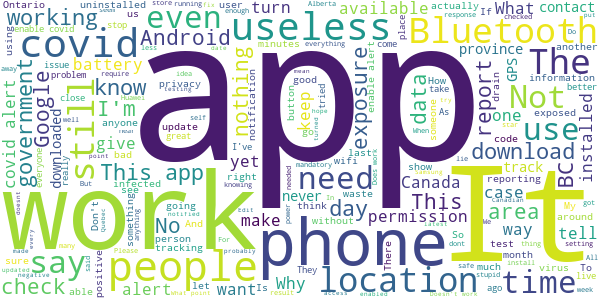

# COVID Alert
App version ``1.1.1``

Analyzed with [covid-apps-observer](http://github.com/covid-apps-observer) project, version ``0.1``

## App overview
| | |
|-------------------------|-------------------------| 
| **Name**&nbsp;&nbsp;&nbsp;&nbsp;&nbsp;&nbsp;&nbsp;&nbsp;&nbsp;&nbsp;&nbsp;&nbsp;&nbsp;&nbsp;&nbsp;&nbsp;&nbsp;&nbsp;&nbsp;&nbsp;&nbsp;&nbsp;&nbsp;&nbsp;&nbsp;&nbsp;&nbsp;&nbsp;&nbsp;&nbsp;&nbsp;&nbsp;&nbsp;&nbsp;&nbsp;&nbsp;&nbsp;&nbsp;&nbsp;&nbsp;  | COVID Alert |
| **Unique identifier** | ca.gc.hcsc.canada.stopcovid |
| **Link to Google Play** | [https://play.google.com/store/apps/details?id=ca.gc.hcsc.canada.stopcovid](https://play.google.com/store/apps/details?id=ca.gc.hcsc.canada.stopcovid) |
| **Summary**  | Health Canada Exposure Notification |
| **Privacy policy** | [https://www.canada.ca/en/public-health/services/diseases/coronavirus-disease-covid-19/covid-alert/privacy-policy.html](https://www.canada.ca/en/public-health/services/diseases/coronavirus-disease-covid-19/covid-alert/privacy-policy.html) |
| **Latest version** | 1.1.1 |
| **Last update** | 2020-11-06 21:56:34 |
| **Recent changes** | - Updated exposed screen for people who have not chosen a province or territory or who have chosen one that is not yet supporting the app. - Standardized the number of exposure checks when the app is being used. |
| **Installs**  | 1,000,000+ |
| **Category** | Health & Fitness |
| **First release** | Jul 29, 2020 |
| **Size**  | 43M |
| **Supported Android version**  | 6.0 and up |

### Description
> Together, let’s slow the spread of COVID-19. Canada's COVID Alert app notifies you if someone you were near in the past 14 days tells the app they tested positive.
 COVID Alert uses Bluetooth to exchange random codes with nearby phones. It does not use or access any location data. COVID Alert works by determining how far away other phones are by the strength of their Bluetooth signal. 
 Several times a day, COVID Alert checks a list of codes from people who tell the app they tested positive. You’ll get a notification if a code you received matches one of the positive codes.
 If you test positive for COVID-19 you’ll receive a one-time key with your diagnosis to enter into COVID Alert. The app asks permission to share your random codes from the last 14 days with a central server.
 Other phones using COVID Alert check the central server periodically throughout the day. If they recorded any codes that match the codes in the central server, their user will be notified that they were exposed.
 COVID Alert has no way of knowing:
 -your location - COVID Alert does not use GPS or location services
 -your name or address
 -the place or time you were near someone
 -if you're currently near someone who was previously diagnosed
 Provincial and territorial governments are working to support COVID Alert across Canada. In some places, people cannot yet report a COVID-19 diagnosis through this app.
 It’s still helpful to keep COVID Alert on, no matter where you are.  That way, when people are able to report a diagnosis, you’ll find out if you were near them.
 COVID Alert was built by Health Canada with the Canadian Digital Service on the private exposure notification framework by Apple and Google.

### User interface
The developers of the app provide the following screenshots in the Google play store.
| | | |
|:-------------------------:|:-------------------------:|:-------------------------:|
 |   |   |   | 
 |  

## Development team
In the following we report the main information provided by the development team in the Google play store.

| | |
|-------------------------|-------------------------|
| **Developer**  | Health Canada | Santé Canada |
| **Website**  | [https://www.canada.ca/en/public-health/services/diseases/coronavirus-disease-covid-19/covid-alert/help.html](https://www.canada.ca/en/public-health/services/diseases/coronavirus-disease-covid-19/covid-alert/help.html) |
| **Email** | hc.AlerteCOVIDAlert.sc@canada.ca |
| **Physical address**  | - |
| **Other developed apps**  | [https://play.google.com/store/apps/developer?id=Health+Canada+%7C+Sant%C3%A9+Canada](https://play.google.com/store/apps/developer?id=Health+Canada+%7C+Sant%C3%A9+Canada) |

## Android support

| | |
|-------------------------|-------------------------|
| **Declared target Android version**  | Android10, version 10 (API level 29) |
| **Effective target Android version**  | Android10, version 10 (API level 29) |
| **Minimum supported Android version**  | Marshmallow, version 6.0 (API level 23) |
| **Maximum target Android version**  | - |

The larger the difference between the minimum and maximum supported Android versions, the better. A larger difference means a wider audience. For example, old phones have a very low Android version, so a high minimum supported Android version means that the app cannot be used by users with old phones, thus leading to accessibility problems. 

## Requested permissions

In the following we report the complete list of the permissions requested by the app. 

| **Permission** | **Protection level** | **Description** | 
|-------------------------|-------------------------|-------------------------|
 **android.permission ACCESS_NETWORK_STATE** | Normal | Allows applications to access information about networks. 
 **android.permission ACCESS_WIFI_STATE** | Normal | Allows applications to access information about Wi-Fi networks. 
 **android.permission BLUETOOTH** | Normal | Allows applications to connect to paired bluetooth devices. 
 **android.permission FOREGROUND_SERVICE** | Normal | Allows a regular application to use Service.startForeground. 
 **android.permission GET_TASKS** | Deprecated | This constant was deprecated in API level 21. No longer enforced. 
 **android.permission INTERNET** | Normal | Allows applications to open network sockets. 
 **android.permission RECEIVE_BOOT_COMPLETED** | Normal | Allows an application to receive the Intent.ACTION_BOOT_COMPLETED that is broadcast after the system finishes booting. 
 **android.permission WAKE_LOCK** | Normal | Allows using PowerManager WakeLocks to keep processor from sleeping or screen from dimming. 

## Mentioned servers

| **Server** | **Registrant** | **Registrant country** | **Creation date** | 
|-------------------------|-------------------------|-------------------------|-------------------------|
 | android.com | Google LLC | :us: US | 1997-06-23 04:00:00 |
 | google.com | Google LLC | :us: US | 1997-09-15 04:00:00 |
 | googleapis.com | Google LLC | :us: US | 2005-01-25 17:52:26 |

## Security analysis 

Below we report the main security warnings raised by our execution of the [Androwarn](https://github.com/maaaaz/androwarn) security analysis tool.

**Telephony identifiers leakage**
> - This application reads the numeric name (MCC+MNC) of current registered operator 
> - This application reads the operator name 

**Connection interfaces exfiltration**
> - This application reads details about the currently active data network 
> - This application tries to find out if the currently active data network is metered 

**Suspicious connection establishment**
> - This application opens a Socket and connects it to the remote address '' on the 'N/A' port  
> - This application opens a Socket and connects it to the remote address 'Ljava/lang/StringBuilder;->toString()Ljava/lang/String;' on the ': connect, resolve' port  
> - This application opens a Socket and connects it to the remote address 'Ljava/lang/StringBuilder;->toString()Ljava/lang/String;' on the 'N/A' port  
> - This application opens a Socket and connects it to the remote address 'Ljava/net/Proxy;->type()Ljava/net/Proxy$Type;' on the 'N/A' port  
> - This application opens a Socket and connects it to the remote address 'timeout' on the 'N/A' port  

**Pim data leakage**
> - This application accesses data stored in the clipboard 

**Code execution**
> - This application loads a native library 
> - This application executes a UNIX command 

## User ratings and reviews

Below we provide information about how end users are reacting to the app in terms of ratings and reviews in the Google Play store.

### Ratings

The COVID Alert app has been installed by more than **1000000** times. At this time, **6268** rated the app and its average score is **3.6957188**. Below we show the distribution of the ratings across the usual star-based rating of Google Play

:star::star::star::star::star:: 3403

:star::star::star::star:: 690

:star::star::star:: 431

:star::star:: 354

:star:: 1390

### Reviews 

#### 5-star reviews

> It has worked once for me. About a woman that had covid working at McDonalds. App didnt tell me where or when .. 3 star  :date: __2020-11-23 05:18:18__

> Display of this app should be your pass to enter any and all facilitis and not limited to hospitals, doctors offices, stores, theaters etc. No more need for lock downs.😁  :date: __2020-11-23 03:58:52__

> Does the job. Great community based app.  :date: __2020-11-22 20:13:13__

> You need this app  :date: __2020-11-22 15:41:47__

> It is very helpful and I feel safe.  :date: __2020-11-22 07:26:38__

> Smart, simple response. Privacy respected. Perfect.  :date: __2020-11-21 14:43:13__

> Jason Kenney can burn in hell  :date: __2020-11-21 03:23:01__

> This will save many lives  :date: __2020-11-21 01:42:26__

> Good app  :date: __2020-11-21 00:30:18__

> Hello , exellent app, idk how good it is tbh cuz i dont even go out much if at all, i still downloaded it tho lol, i am compremised becuase I'm asthmatic. Anyways...but i sent an email to say i cant get this to show up at all in the google play store for my mom. She has a samsung galaxy 3, Android 4.4.2. 😐 I thought this was supposed to work for all smartphones (even older models)  :date: __2020-11-20 18:35:24__

#### 4-star reviews

> About time. Why doesn't the app communicate the restrictions and fines currently in my region? I would like a notification and a summary of what has changed  :date: __2020-11-21 18:41:30__

> Not sure right now  :date: __2020-11-19 22:40:57__

> Look at times.  :date: __2020-11-19 14:53:03__

> I love the idea that you can be alerted but I think it needs some tweaking. When I open it it's red for 3 to 5 seconds then goes green  :date: __2020-11-18 16:18:14__

> What happens if you got a notification. How do you reset the app for future notifications  :date: __2020-11-18 11:42:47__

> I'm in Alberta which does not support this app. However, what prevents me from saying my province is one of those that do support the app?  :date: __2020-11-18 01:41:53__

> I'd like to see more detailed logs of the exchanges that take place. Also, if I disable location the app stops working. I thought this only used Bluetooth. Please explain this discrepancy. Edit: app was up to date and I'm running latest Android version. Your reply does not apply. The permissions on this application are extremely suspicious.  :date: __2020-11-17 21:17:49__

> Ok for what it is. Just not ideal to have Bluetooth always on and would be nice to have more details regarding infection time and place. But because of privacy issues, I doubt that's possible.  :date: __2020-11-15 09:24:49__

> Entering the code should be encouraged and made easier. Maybe allow scanning code through the app. Why aren't more people using this app? What's being done to promote downloads? At there any stats to justify its use?  :date: __2020-11-15 01:54:03__

> Super  :date: __2020-11-14 04:00:24__

#### 3-star reviews

> Great concept! Still too new to work out the bugs so far. Suggestion: Google does timelines of everywhere you go already, so just have it communicate with that, and that should solve 80% of the glitches, if not more. Looking forward to the upgrade!  :date: __2020-11-22 09:22:03__

> Had to Uninstaller and reinstall. Hadn't performed any checks since Sept.  :date: __2020-11-22 07:18:21__

> I bet most people who have tested positive do not get the one time key and enter it...so you really have to follow health providers on staying safe....  :date: __2020-11-21 02:21:44__

> What's the deal with this not working in Alberta?  :date: __2020-11-21 02:10:49__

> I appreciate the goal of the app and I was really happy to hear it just used Bluetooth and I didn't need to keep me location services on. However the app says my alerts are off because my Bluetooth is "off" even though it is on. But when I turn my location tracking on it works... I was told no tracking location?  :date: __2020-11-20 04:14:15__

> Like the idea, but mine hadn't logged any exposure checks since install and last exposure check was almost 3 weeks ago (20 days). Bluetooth is on, and everything says it's active and good to go. Edit: sent screenshot and info as directed by developers. Uninstall and reinstall seemed to bring it to life and start functioning properly.  :date: __2020-11-19 23:52:30__

> It would be interesting to get a summary report (daily). - Alert Community Score. Number of phones you came into contact with that had the alert app. - Isolation score. A number that identifies how many Bluetooth proximity contacts (with or without alert app) you had in a day. Thanks for you response. Please give me a clue how to find the log on an android phone settings?  :date: __2020-11-19 22:38:27__

> It is isles of no one has the app  :date: __2020-11-19 03:34:39__

> Does what it says on the tin! However now it has stated last checked for exposure Oct 25! I've been near devices that also have the app since then. Does this mean that the app is now broken?  :date: __2020-11-18 15:01:31__

> At first it asked for my location on but says it uses bluetooth. Can i turn off location?  :date: __2020-11-17 18:40:08__

#### 2-star reviews

> Works great on my Pixel 3 XL, however it doesn't work on my Pixel 1. It says unsupported. Is there a list of supported/unsupported phones?  :date: __2020-11-22 23:31:39__

> Im having problem with going In the app. it keeps saying Error and logs out. can i get some help. Thanks Bye  :date: __2020-11-21 20:40:46__

> Been using this since day one. Finally frustrated enough to write my review. Really upsetting that this causes interference with other bluetooth uses of my phone, specifically my headset for hands-free calling. Sometimes im the middle of a call, or while getting navigation instructions while driving. I'm continuously having to reset my bluetooth in order to work around this poorly programmed monstrosity. If I had any alternative, I'd be using that instead.  :date: __2020-11-21 02:02:40__

> Blue Tooth keeps getting turned off. I have to turn back on  :date: __2020-11-20 18:17:40__

> "COVID Alert does not use GPS or location services" Except is does require location to be turned on. Maybe not talking but certainly will drain a battery quicker.  :date: __2020-11-19 19:28:20__

> It only works if you've been exposed for fifteen minutes while within six feet of someone. But it only takes a few seconds for exposure so what good is that. Oh well  :date: __2020-11-19 00:28:08__

> Cant disable notifications for bluetooth/location setting warnings, even in the phone's settings. Every time you enable of disable bluetooth or location on your device you'll get a bright red icon in your notification bar. Too annoying to use.  :date: __2020-11-15 03:36:19__

> This is totally crazy, trying to dow load your app has been on verifying for 15 mins 🤦‍♀️  :date: __2020-11-15 02:43:40__

> Doesn't check for exposures that often. It only seems to check once a day. I have internet access all day and wifi at home.  :date: __2020-11-14 23:39:26__

> This app is very disappointing as it only works when GPS is active. This should not be necessary since app apparently uses bluetooth to interact with nearby phones  :date: __2020-11-14 05:57:50__

#### 1-star reviews

> Husband tested positive, we're both quarantining in the same household. It's been over 24 hours since he entered his code into the app. I still haven't been notified of exposure and we're living in the same household. My Bluetooth is on and everything is working. Seems like something is broken. 48 hrs later, I'm tried entering my key and I got an error code and couldn't continue.  :date: __2020-11-23 02:16:06__

> Well will not install advises me to disable messenger not tech savvy Makes it frustrating  :date: __2020-11-22 21:46:11__

> Tried to download. Its been spinning for 24hrs. No success.  :date: __2020-11-21 18:08:38__

> Does not talk about restrictions in my area  :date: __2020-11-21 14:36:12__

> Why are we not allowed to do reporting in my area? It has been quite some time since this app came out and I uninstalled it because of this last time.  :date: __2020-11-21 12:37:55__

> Find it hard to give this app more than one star, as it hasn't made a single exposure check in 10 days (since last update). Prior to this, the app was sporadically missing 1 or 2 days. I had reported this issue to the HC CovidAlert team, along with my logs, several weeks ago. They suggested that it might be a connectivity issue - but my phone is not having any connectivity problems whatsoever. Obvioulsly, the most recent update has made things much worse, with 0 checks in 10 days.The idea behind this is great and I totally support it; but the implementation leaves much to be desired. What is the point of this app, if it doesn't work?  :date: __2020-11-21 03:23:47__

> I'm sure the reason this app is so bad is due to the government balancing between our privacy laws and what information they can actually obtain/allowed to distribute. I'd prefer a dysfunctional app than to sacrifice the privacy laws we have in place. "Google steals data though!" Right, and they're a problem too, as well as all the other companies stealing/selling our data.  :date: __2020-11-21 01:27:42__

> I installed on day one after it came out. Went out with wife to local government agency and someone was escorted out by security guards for having virus and app warned us about nothing. Uninstalled the app from both cells. Useless app.  :date: __2020-11-21 00:58:22__

> This doesn't work, it doesn't tell you anything. I've had it for two months and it's never notified me once that I was near any possible covid infected people. And I live in an area that has had an increase in covid outbreaks.  :date: __2020-11-20 22:28:01__

> As with other users, this has stopped doing exposure checks since early November. I'm in touch with support but not getting anywhere quickly. Also just checked with other members of my household and all have stopped working, all on Android.  :date: __2020-11-20 21:48:28__

