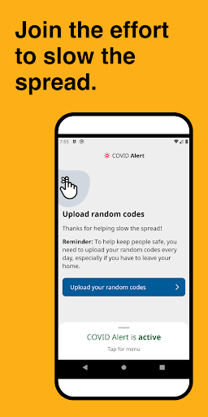
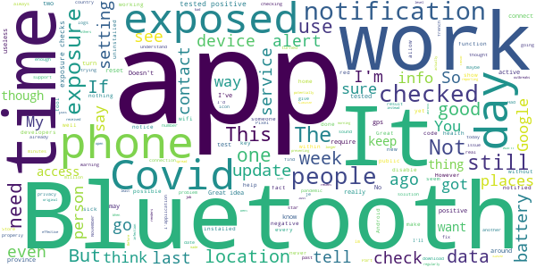
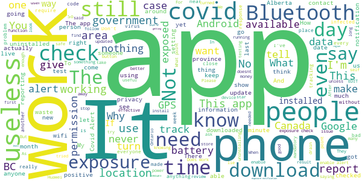

# COVID Alert
App version ``1.1.2``

Analyzed with [covid-apps-observer](http://github.com/covid-apps-observer) project, version ``0.1``

## App overview
| | |
|-------------------------|-------------------------| 
| **Name**&nbsp;&nbsp;&nbsp;&nbsp;&nbsp;&nbsp;&nbsp;&nbsp;&nbsp;&nbsp;&nbsp;&nbsp;&nbsp;&nbsp;&nbsp;&nbsp;&nbsp;&nbsp;&nbsp;&nbsp;&nbsp;&nbsp;&nbsp;&nbsp;&nbsp;&nbsp;&nbsp;&nbsp;&nbsp;&nbsp;&nbsp;&nbsp;&nbsp;&nbsp;&nbsp;&nbsp;&nbsp;&nbsp;&nbsp;&nbsp;  | COVID Alert |
| **Unique identifier** | ca.gc.hcsc.canada.stopcovid |
| **Link to Google Play** | [https://play.google.com/store/apps/details?id=ca.gc.hcsc.canada.stopcovid](https://play.google.com/store/apps/details?id=ca.gc.hcsc.canada.stopcovid) |
| **Summary**  | Health Canada Exposure Notification |
| **Privacy policy** | [https://www.canada.ca/en/public-health/services/diseases/coronavirus-disease-covid-19/covid-alert/privacy-policy.html](https://www.canada.ca/en/public-health/services/diseases/coronavirus-disease-covid-19/covid-alert/privacy-policy.html) |
| **Latest version** | 1.1.2 |
| **Last update** | 2020-11-23 15:17:49 |
| **Recent changes** | - Fixed bug causing gaps in exposure checks for some users. - Added error message for people trying to install the app on a secondary profile. |
| **Installs**  | 1,000,000+ |
| **Category** | Health & Fitness |
| **First release** | Jul 29, 2020 |
| **Size**  | 43M |
| **Supported Android version**  | 6.0 and up |

### Description
> Together, let’s slow the spread of COVID-19. Canada's COVID Alert app notifies you if someone you were near in the past 14 days tells the app they tested positive.
 COVID Alert uses Bluetooth to exchange random codes with nearby phones. It does not use or access any location data. COVID Alert works by determining how far away other phones are by the strength of their Bluetooth signal. 
 Several times a day, COVID Alert checks a list of codes from people who tell the app they tested positive. You’ll get a notification if a code you received matches one of the positive codes.
 If you test positive for COVID-19 you’ll receive a one-time key with your diagnosis to enter into COVID Alert. The app asks permission to share your random codes from the last 14 days with a central server.
 Other phones using COVID Alert check the central server periodically throughout the day. If they recorded any codes that match the codes in the central server, their user will be notified that they were exposed.
 COVID Alert has no way of knowing:
 -your location - COVID Alert does not use GPS or location services
 -your name or address
 -the place or time you were near someone
 -if you're currently near someone who was previously diagnosed
 Provincial and territorial governments are working to support COVID Alert across Canada. In some places, people cannot yet report a COVID-19 diagnosis through this app.
 It’s still helpful to keep COVID Alert on, no matter where you are.  That way, when people are able to report a diagnosis, you’ll find out if you were near them.
 COVID Alert was built by Health Canada with the Canadian Digital Service on the private exposure notification framework by Apple and Google.

### User interface
The developers of the app provide the following screenshots in the Google play store.
| | | |
|:-------------------------:|:-------------------------:|:-------------------------:|
 |   |   |   | 
 |  

## Development team
In the following we report the main information provided by the development team in the Google play store.

| | |
|-------------------------|-------------------------|
| **Developer**  | Health Canada | Santé Canada |
| **Website**  | [https://www.canada.ca/en/public-health/services/diseases/coronavirus-disease-covid-19/covid-alert/help.html](https://www.canada.ca/en/public-health/services/diseases/coronavirus-disease-covid-19/covid-alert/help.html) |
| **Email** | hc.AlerteCOVIDAlert.sc@canada.ca |
| **Physical address**  | - |
| **Other developed apps**  | [https://play.google.com/store/apps/developer?id=Health+Canada+%7C+Sant%C3%A9+Canada](https://play.google.com/store/apps/developer?id=Health+Canada+%7C+Sant%C3%A9+Canada) |

## Android support

| | |
|-------------------------|-------------------------|
| **Declared target Android version**  | Android10, version 10 (API level 29) |
| **Effective target Android version**  | Android10, version 10 (API level 29) |
| **Minimum supported Android version**  | Marshmallow, version 6.0 (API level 23) |
| **Maximum target Android version**  | - |

The larger the difference between the minimum and maximum supported Android versions, the better. A larger difference means a wider audience. For example, old phones have a very low Android version, so a high minimum supported Android version means that the app cannot be used by users with old phones, thus leading to accessibility problems. 

## Requested permissions

In the following we report the complete list of the permissions requested by the app. 

| **Permission** | **Protection level** | **Description** | 
|-------------------------|-------------------------|-------------------------|
 **android.permission ACCESS_NETWORK_STATE** | Normal | Allows applications to access information about networks. 
 **android.permission ACCESS_WIFI_STATE** | Normal | Allows applications to access information about Wi-Fi networks. 
 **android.permission BLUETOOTH** | Normal | Allows applications to connect to paired bluetooth devices. 
 **android.permission FOREGROUND_SERVICE** | Normal | Allows a regular application to use Service.startForeground. 
 **android.permission GET_TASKS** | Deprecated | This constant was deprecated in API level 21. No longer enforced. 
 **android.permission INTERNET** | Normal | Allows applications to open network sockets. 
 **android.permission RECEIVE_BOOT_COMPLETED** | Normal | Allows an application to receive the Intent.ACTION_BOOT_COMPLETED that is broadcast after the system finishes booting. 
 **android.permission WAKE_LOCK** | Normal | Allows using PowerManager WakeLocks to keep processor from sleeping or screen from dimming. 

## Mentioned servers

| **Server** | **Registrant** | **Registrant country** | **Creation date** | 
|-------------------------|-------------------------|-------------------------|-------------------------|
 | android.com | Google LLC | :us: US | 1997-06-23 04:00:00 |
 | google.com | Google LLC | :us: US | 1997-09-15 04:00:00 |
 | googleapis.com | Google LLC | :us: US | 2005-01-25 17:52:26 |

## Security analysis 

Below we report the main security warnings raised by our execution of the [Androwarn](https://github.com/maaaaz/androwarn) security analysis tool.

**Telephony identifiers leakage**
> - This application reads the numeric name (MCC+MNC) of current registered operator 
> - This application reads the operator name 

**Connection interfaces exfiltration**
> - This application reads details about the currently active data network 
> - This application tries to find out if the currently active data network is metered 

**Suspicious connection establishment**
> - This application opens a Socket and connects it to the remote address '' on the 'N/A' port  
> - This application opens a Socket and connects it to the remote address 'Ljava/lang/StringBuilder;->toString()Ljava/lang/String;' on the ': connect, resolve' port  
> - This application opens a Socket and connects it to the remote address 'Ljava/lang/StringBuilder;->toString()Ljava/lang/String;' on the 'N/A' port  
> - This application opens a Socket and connects it to the remote address 'Ljava/net/Proxy;->type()Ljava/net/Proxy$Type;' on the 'N/A' port  
> - This application opens a Socket and connects it to the remote address 'timeout' on the 'N/A' port  

**Pim data leakage**
> - This application accesses data stored in the clipboard 

**Code execution**
> - This application loads a native library 
> - This application executes a UNIX command 

## User ratings and reviews

Below we provide information about how end users are reacting to the app in terms of ratings and reviews in the Google Play store.

### Ratings

The COVID Alert app has been installed by more than **1000000** times. At this time, **6611** rated the app and its average score is **3.5813253**. Below we show the distribution of the ratings across the usual star-based rating of Google Play

:star::star::star::star::star:: 3366

:star::star::star::star:: 707

:star::star::star:: 537

:star::star:: 408

:star:: 1593

### Reviews 

#### 5-star reviews

> It's a damn good app. Very reliable to boot!  :date: __2020-11-29 21:46:17__

> I feel alot safer having it when returning from the grocery store I check it all the time  :date: __2020-11-29 18:28:48__

> Have not used it yet.  :date: __2020-11-29 02:08:50__

> Alright app I noticed Bluetooth required to be turned on  :date: __2020-11-29 00:31:22__

> Do your part, install the app. You don't even know it's there.  :date: __2020-11-28 22:19:05__

> Does what it says on the tin! Devs listened and fixed the problem thank you!  :date: __2020-11-28 20:12:50__

> Nice to have this kind of protective measure in hand to prevent ourselves from COVID 19 and similar cases. Thanks!  :date: __2020-11-28 15:08:49__

> Covid 19 is respiratory disease like seasonal flu. This is not an STD or piles. What is the matter of these much privacy. I got alert today. It says I got exposed to 15 minutes..I can't believe that I got an exposure. I went only to gas station once, grocery once, doctor once and everyday to work in last 14 days. Why can't this app send the postal code where I got exposed. What privacy is getting violated by giving the location of exposure for clarification.  :date: __2020-11-28 02:11:36__

> Excellent... The more people that use it, the more accurate it becomes as a Covid-19 tracking tool!!!  :date: __2020-11-27 22:44:30__

> We need to immediately make the COVID-19 national contact tracing app operational in Alberta. Why is the Alberta Government keeping this app from us while forcing us to use an app that they created and doesn't work? Maybe it is because they are just data mining...  :date: __2020-11-26 21:01:16__

#### 4-star reviews

> This makes us feel more secure, we realize that we still gave to wear a mask when out and do all precautions. We will miss our family on Christmas day.  :date: __2020-11-30 13:50:18__

> Awesome  :date: __2020-11-29 17:52:04__

> As with other users, this has stopped doing exposure checks since early November. I'm in touch with support but not getting anywhere quickly. Also just checked with other members of my household and all have stopped working, all on Android. Looks to be working after Nov 20 update.  :date: __2020-11-27 17:28:17__

> It would be great for giving me peace of mind but it's not active in Alberta.  :date: __2020-11-24 22:27:40__

> About time. Why doesn't the app communicate the restrictions and fines currently in my region? I would like a notification and a summary of what has changed  :date: __2020-11-21 18:41:30__

> Not sure right now  :date: __2020-11-19 22:40:57__

> Look at times.  :date: __2020-11-19 14:53:03__

> I love the idea that you can be alerted but I think it needs some tweaking. When I open it it's red for 3 to 5 seconds then goes green  :date: __2020-11-18 16:18:14__

> What happens if you got a notification. How do you reset the app for future notifications  :date: __2020-11-18 11:42:47__

> I'm in Alberta which does not support this app. However, what prevents me from saying my province is one of those that do support the app?  :date: __2020-11-18 01:41:53__

#### 3-star reviews

> Not make ? Fruck you covid 19  :date: __2020-11-29 20:41:17__

> (Edit: just downloaded the new version and exposure checks are occuring again but only when forced by opening the covid alert app... better than nothing I guess.) Since the most recent update, the app hasn't performed a single exposure check. I have bluetooth and location on. Previously, the app would only do an exposure check when I opened it (according to the log under google settings).  :date: __2020-11-29 20:31:54__

> I live in a area where no one has vivid so I can't tell if this app works.  :date: __2020-11-28 12:34:31__

> Cant clear exposure notafacation  :date: __2020-11-27 16:03:22__

> The application works but for Androids it stop checking for exposure since October 26th. So what I have to do is to reinstall the application for it to work again. Hope this may help other's if you have the same issue as me. /////// L'application fonctionne mais pour les téléphones intelligent Android cela à cessé de fonctionner le 26 Octobre alors la solution est de réinstaller l'application pour que cela fonctionne à nouveau. J'espère que ceci peux aider ceux qui ont le même trouble que moi.  :date: __2020-11-27 14:36:25__

> Very basic and slow to start-up or respond to key strokes! It tracks all the times I have reported but have never been told of anyone infected near-by. I guess that's a good thing. Trying to be responsible!  :date: __2020-11-25 16:57:49__

> I just read that the Australian spy agency was logging the data from their covid tracing app. I don't want that happening to me so I will uninstall it.  :date: __2020-11-24 21:12:33__

> Great concept! Still too new to work out the bugs so far. Suggestion: Google does timelines of everywhere you go already, so just have it communicate with that, and that should solve 80% of the glitches, if not more. Looking forward to the upgrade!  :date: __2020-11-22 09:22:03__

> Had to Uninstaller and reinstall. Hadn't performed any checks since Sept.  :date: __2020-11-22 07:18:21__

> I bet most people who have tested positive do not get the one time key and enter it...so you really have to follow health providers on staying safe....  :date: __2020-11-21 02:21:44__

#### 2-star reviews

> Doesn't sound reliable. But Idk. So...  :date: __2020-11-30 01:56:06__

> Uninstalling. Have had it for a few months but it's pointless since not reporting in BC :/  :date: __2020-11-29 23:46:25__

> I had to fight to connect with real developers. No real tech support at that time. They seem to have broadened the phones it works on. But the underlying concept of privacy during a pandemic is completely misguided. Also - sick or worried people should NOT be expected to report positive results; only 5% remember to so. App also assumes that we all have data plans and Bluetooth always on. Almost a total failure especially with so many flouting rules.  :date: __2020-11-28 22:26:59__

> Didn't tell me about a possible exposure to covid-19  :date: __2020-11-27 10:05:17__

> The way it works to allow full anonimity is quite interesting. However it burns through the battery way too fast. I uninstalled it. I would be more than happy to use it again if they get a better way to save battery.  :date: __2020-11-24 16:15:08__

> I understand that no news is good news...but as with ANY relationship.....communication is key....food for thought...  :date: __2020-11-24 04:07:53__

> The app is NOT automatically checking for exposure on some Android devices and as such it may not warn you. You should still install it, but the developers need to fix this issue...  :date: __2020-11-23 22:43:51__

> Works great on my Pixel 3 XL, however it doesn't work on my Pixel 1. It says unsupported. Is there a list of supported/unsupported phones?  :date: __2020-11-22 23:31:39__

> Im having problem with going In the app. it keeps saying Error and logs out. can i get some help. Thanks Bye  :date: __2020-11-21 20:40:46__

> Been using this since day one. Finally frustrated enough to write my review. Really upsetting that this causes interference with other bluetooth uses of my phone, specifically my headset for hands-free calling. Sometimes im the middle of a call, or while getting navigation instructions while driving. I'm continuously having to reset my bluetooth in order to work around this poorly programmed monstrosity. If I had any alternative, I'd be using that instead.  :date: __2020-11-21 02:02:40__

#### 1-star reviews

> What's the point if it doesn't follow me where I travel? I'm a cross border truck driver. I was diagnosed with covid in north Dakota. But could have contracted it anywhere. And it doesn't let me enter my positive diagnosis.  :date: __2020-11-30 13:24:27__

> It is not a legal app  :date: __2020-11-30 04:11:40__

> Not trying it out it's already bad enough the phone listens to us and tracks us that's all this app wants to do no thank you  :date: __2020-11-29 12:47:00__

> Not enough people registering.  :date: __2020-11-29 12:09:34__

> Really wish the Canadian government would provide solid information on the mistakes made and how we can come to a decent outcome but instead they focused efforts on this garbage which just informs you that they failed you as a citizen.  :date: __2020-11-29 10:22:46__

> App requires bluetooth and drains your battery fast  :date: __2020-11-29 07:51:19__

> "No reporting yet in your area" (vancouver) Deleting, 9 months into the pandemic and still useless for people in my area? How much taxpayer money was wasted on this?  :date: __2020-11-29 02:56:36__

> Edit: Yes, this is still a troublesome app. After updating, it performed 14 checks in the span of 1 minute. Nearly a week later, no additional checks have been performed. In my bubble, the app works fine on Apple phones, but useless for many of the Android users. Original review: Despite Bluetooth being on 24/7, the app can go more than a week between performed exposure checks. Worked very well before the last update, but hasn't done anything for me for almost 2 weeks now.  :date: __2020-11-28 19:04:08__

> After many months of covid alert being greyed out I finally figured it out. I had several google accounts on my phone for gaming apps. I had to remove all of the other gmail accounts in settings/accounts and backup/accounts then restart my phone, reinstall the app, and it finally prompted me to enable covid alert. Hopefully you can spread the word so others experiencing this problem can get the app to work. I will leave my review at 1 star for a little so maybe people having trouble might see it  :date: __2020-11-27 18:32:52__

> Can't download  :date: __2020-11-27 16:45:24__

