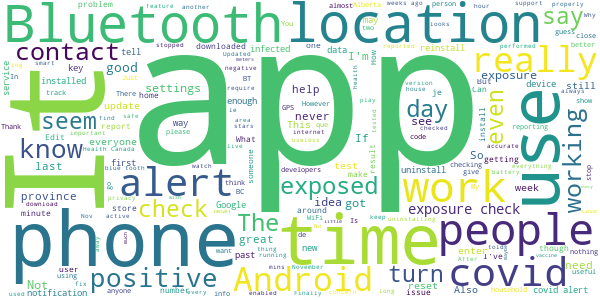

# COVID Alert
App version ``1.1.2``

Analyzed with [covid-apps-observer](http://github.com/covid-apps-observer) project, version ``0.1``

## App overview
| | |
|-------------------------|-------------------------| 
| **Name**&nbsp;&nbsp;&nbsp;&nbsp;&nbsp;&nbsp;&nbsp;&nbsp;&nbsp;&nbsp;&nbsp;&nbsp;&nbsp;&nbsp;&nbsp;&nbsp;&nbsp;&nbsp;&nbsp;&nbsp;&nbsp;&nbsp;&nbsp;&nbsp;&nbsp;&nbsp;&nbsp;&nbsp;&nbsp;&nbsp;&nbsp;&nbsp;&nbsp;&nbsp;&nbsp;&nbsp;&nbsp;&nbsp;&nbsp;&nbsp;  | COVID Alert |
| **Unique identifier** | ca.gc.hcsc.canada.stopcovid |
| **Link to Google Play** | [https://play.google.com/store/apps/details?id=ca.gc.hcsc.canada.stopcovid](https://play.google.com/store/apps/details?id=ca.gc.hcsc.canada.stopcovid) |
| **Summary**  | Health Canada Exposure Notification |
| **Privacy policy** | [https://www.canada.ca/en/public-health/services/diseases/coronavirus-disease-covid-19/covid-alert/privacy-policy.html](https://www.canada.ca/en/public-health/services/diseases/coronavirus-disease-covid-19/covid-alert/privacy-policy.html) |
| **Latest version** | 1.1.2 |
| **Last update** | 2020-11-23 15:17:49 |
| **Recent changes** | - Fixed bug causing gaps in exposure checks for some users. - Added error message for people trying to install the app on a secondary profile. |
| **Installs**  | 1,000,000+ |
| **Category** | Health & Fitness |
| **First release** | Jul 29, 2020 |
| **Size**  | 43M |
| **Supported Android version**  | 6.0 and up |

### Description
> Together, let’s slow the spread of COVID-19. Canada's COVID Alert app notifies you if someone you were near in the past 14 days tells the app they tested positive.
 COVID Alert uses Bluetooth to exchange random codes with nearby phones. It does not use or access any location data. COVID Alert works by determining how far away other phones are by the strength of their Bluetooth signal. 
 Several times a day, COVID Alert checks a list of codes from people who tell the app they tested positive. You’ll get a notification if a code you received matches one of the positive codes.
 If you test positive for COVID-19 you’ll receive a one-time key with your diagnosis to enter into COVID Alert. The app asks permission to share your random codes from the last 14 days with a central server.
 Other phones using COVID Alert check the central server periodically throughout the day. If they recorded any codes that match the codes in the central server, their user will be notified that they were exposed.
 COVID Alert has no way of knowing:
 -your location - COVID Alert does not use GPS or location services
 -your name or address
 -the place or time you were near someone
 -if you're currently near someone who was previously diagnosed
 Provincial and territorial governments are working to support COVID Alert across Canada. In some places, people cannot yet report a COVID-19 diagnosis through this app.
 It’s still helpful to keep COVID Alert on, no matter where you are.  That way, when people are able to report a diagnosis, you’ll find out if you were near them.
 COVID Alert was built by Health Canada with the Canadian Digital Service on the private exposure notification framework by Apple and Google.

### User interface
The developers of the app provide the following screenshots in the Google play store.
| | | |
|:-------------------------:|:-------------------------:|:-------------------------:|
 |   |   |   | 
 |  

## Development team
In the following we report the main information provided by the development team in the Google play store.

| | |
|-------------------------|-------------------------|
| **Developer**  | Health Canada | Santé Canada |
| **Website**  | [https://www.canada.ca/en/public-health/services/diseases/coronavirus-disease-covid-19/covid-alert/help.html](https://www.canada.ca/en/public-health/services/diseases/coronavirus-disease-covid-19/covid-alert/help.html) |
| **Email** | hc.AlerteCOVIDAlert.sc@canada.ca |
| **Physical address**  | - |
| **Other developed apps**  | [https://play.google.com/store/apps/developer?id=Health+Canada+%7C+Sant%C3%A9+Canada](https://play.google.com/store/apps/developer?id=Health+Canada+%7C+Sant%C3%A9+Canada) |

## Android support

| | |
|-------------------------|-------------------------|
| **Declared target Android version**  | Android10, version 10 (API level 29) |
| **Effective target Android version**  | Android10, version 10 (API level 29) |
| **Minimum supported Android version**  | Marshmallow, version 6.0 (API level 23) |
| **Maximum target Android version**  | - |

The larger the difference between the minimum and maximum supported Android versions, the better. A larger difference means a wider audience. For example, old phones have a very low Android version, so a high minimum supported Android version means that the app cannot be used by users with old phones, thus leading to accessibility problems. 

## Requested permissions

In the following we report the complete list of the permissions requested by the app. 

| **Permission** | **Protection level** | **Description** | 
|-------------------------|-------------------------|-------------------------|
 **android.permission ACCESS_NETWORK_STATE** | Normal | Allows applications to access information about networks. 
 **android.permission ACCESS_WIFI_STATE** | Normal | Allows applications to access information about Wi-Fi networks. 
 **android.permission BLUETOOTH** | Normal | Allows applications to connect to paired bluetooth devices. 
 **android.permission FOREGROUND_SERVICE** | Normal | Allows a regular application to use Service.startForeground. 
 **android.permission GET_TASKS** | Deprecated | This constant was deprecated in API level 21. No longer enforced. 
 **android.permission INTERNET** | Normal | Allows applications to open network sockets. 
 **android.permission RECEIVE_BOOT_COMPLETED** | Normal | Allows an application to receive the Intent.ACTION_BOOT_COMPLETED that is broadcast after the system finishes booting. 
 **android.permission WAKE_LOCK** | Normal | Allows using PowerManager WakeLocks to keep processor from sleeping or screen from dimming. 

## Mentioned servers

| **Server** | **Registrant** | **Registrant country** | **Creation date** | 
|-------------------------|-------------------------|-------------------------|-------------------------|
 | android.com | Google LLC | :us: US | 1997-06-23 04:00:00 |
 | google.com | Google LLC | :us: US | 1997-09-15 04:00:00 |
 | googleapis.com | Google LLC | :us: US | 2005-01-25 17:52:26 |

## Security analysis 

Below we report the main security warnings raised by our execution of the [Androwarn](https://github.com/maaaaz/androwarn) security analysis tool.

**Telephony identifiers leakage**
> - This application reads the numeric name (MCC+MNC) of current registered operator 
> - This application reads the operator name 

**Connection interfaces exfiltration**
> - This application reads details about the currently active data network 
> - This application tries to find out if the currently active data network is metered 

**Suspicious connection establishment**
> - This application opens a Socket and connects it to the remote address '' on the 'N/A' port  
> - This application opens a Socket and connects it to the remote address 'Ljava/lang/StringBuilder;->toString()Ljava/lang/String;' on the ': connect, resolve' port  
> - This application opens a Socket and connects it to the remote address 'Ljava/lang/StringBuilder;->toString()Ljava/lang/String;' on the 'N/A' port  
> - This application opens a Socket and connects it to the remote address 'Ljava/net/Proxy;->type()Ljava/net/Proxy$Type;' on the 'N/A' port  
> - This application opens a Socket and connects it to the remote address 'timeout' on the 'N/A' port  

**Pim data leakage**
> - This application accesses data stored in the clipboard 

**Code execution**
> - This application loads a native library 
> - This application executes a UNIX command 

## User ratings and reviews

Below we provide information about how end users are reacting to the app in terms of ratings and reviews in the Google Play store.

### Ratings

The COVID Alert app has been installed by more than **1000000** times. At this time, **6611** rated the app and its average score is **3.5813253**. Below we show the distribution of the ratings across the usual star-based rating of Google Play

:star::star::star::star::star:: 3366

:star::star::star::star:: 707

:star::star::star:: 537

:star::star:: 408

:star:: 1593

### Reviews 

#### 5-star reviews

> I AM NEGATIVE AND I'M NOT GOING TO BE POSITIVE BECAUSE I'M REALLY ISOLATED FROM EVERYONE ELSE IN MY ROOM BECAUSE I'M NOT GOING TO CATCH THIS STUPID VIRUS BECAUSE OF SOMEONE ELSE BIG MISTAKE AND I'M TOTALLY CONFINED FROM EVERYONE SO PLEASE HELP GETTING INTO THE STUPID VIRUS TO PLEASE STAY SAFE AND PLEASE STAY AWAY FROM ANYONE ELSE WHO IS POSITIVE BECAUSE I REALLY DON'T WANT TO GET THE STUPID VIRUS THAT IS real SO PLEASE STAY SAFE  :date: __2020-12-05 10:16:42__

> Just do it! Download for the safety and health of us all. Even if you aren't bothered by the whole pandemic thing, download it anyways, it could very well save the life of a loved one. Cheers folks! Hang in there! We got this!  :date: __2020-12-04 16:45:02__

> Great initiative  :date: __2020-12-04 16:15:46__

> One of many tools to keep us safe.  :date: __2020-12-04 12:39:54__

> Perfect  :date: __2020-12-02 15:04:31__

> App has been updated and exposure checks are now being conducted regularly. Gives me some peace of mind.  :date: __2020-11-30 22:49:17__

> The app is now correctly automatically checking the IDs against the servers here in Nova Scotia! Thanks for the fix covid alert team!  :date: __2020-11-30 22:35:14__

> It's a damn good app. Very reliable to boot!  :date: __2020-11-29 21:46:17__

> I feel alot safer having it when returning from the grocery store I check it all the time  :date: __2020-11-29 18:28:48__

> Have not used it yet.  :date: __2020-11-29 02:08:50__

#### 4-star reviews

> I loaded this app as soon as it was available. I recently learned that there was an issue with some users not getting alert info regularly n times per day. The app does not have a way of showing you this activity. Now I have found if you go to your phone Settings and search "Covid", two items will appear. If you tap on Covid-19 Exposure Notification, a list of the recent activity is displayed. The Covid Alert app MUST have a menu option to display this directly. Knowledge is power.  :date: __2020-12-04 16:43:36__

> Good  :date: __2020-12-03 11:14:27__

> After many months of covid alert being greyed out I finally figured it out. I had several google accounts on my phone for gaming apps. I had to remove all of the other gmail accounts in settings/accounts and backup/accounts then restart my phone, reinstall the app, and it finally prompted me to enable covid alert. Hopefully you can spread the word so others experiencing this problem can get the app to work. I will leave my review at 1 star for a little so maybe people having trouble might see it  :date: __2020-12-02 22:42:05__

> Awesome  :date: __2020-11-29 17:52:04__

> As with other users, this has stopped doing exposure checks since early November. I'm in touch with support but not getting anywhere quickly. Also just checked with other members of my household and all have stopped working, all on Android. Looks to be working after Nov 20 update.  :date: __2020-11-27 17:28:17__

> It would be great for giving me peace of mind but it's not active in Alberta.  :date: __2020-11-24 22:27:40__

> About time. Why doesn't the app communicate the restrictions and fines currently in my region? I would like a notification and a summary of what has changed  :date: __2020-11-21 18:41:30__

> Not sure right now  :date: __2020-11-19 22:40:57__

> Look at times.  :date: __2020-11-19 14:53:03__

> I love the idea that you can be alerted but I think it needs some tweaking. When I open it it's red for 3 to 5 seconds then goes green  :date: __2020-11-18 16:18:14__

#### 3-star reviews

> No share but I paid for the platform ? I never left Canada. If waiting for a return of an Ontario man paying Québec taxes. Still here, but ready to leave. And make serious decisions about how I have been treated  :date: __2020-12-05 07:08:49__

> I was told this app could help direct us if we get a red alert weres safe would be helpfull.  :date: __2020-12-04 20:45:21__

> After instalation it seems to "take over" my bluetooth and my Fitbit app sometimes doesnt sync for a number of days until i force sync a couple times.  :date: __2020-12-04 20:05:02__

> My app wasn't working for a period of time in November, specifically on the 17th when I had a medical apt in Halifax (I live 3hrs away) the app did zero exposure checks. I found out 12 days later from an article on the CBC News app that there was a positive COVID case at the same hospital I was at and that I should have been isolating. However my app updated and is now working again and I don't seem to have developed COVID so it worked out for me.  :date: __2020-12-04 14:13:34__

> Just not very accurate ud mmmm mmmmmm  :date: __2020-12-03 01:14:16__

> Really good app! I would just love to see if I was around anyone at all for any amount of time who reports a covid diagnosis. I work in a grocery store and am not usualy around people for more than like 5 mins so its almost ineffective for me to use to know if I've been exposed to it. I feel like 15 mins is too long to have to be around someone for this to work.  :date: __2020-12-01 20:10:33__

> There's still gsps in checks. The last check my phone did was on Nov. 25th. I'm in NS, & did install the latest version of the app, where this was supposedly fixed.  :date: __2020-12-01 08:26:31__

> Not make ? Fruck you covid 19  :date: __2020-11-29 20:41:17__

> (Edit: just downloaded the new version and exposure checks are occuring again but only when forced by opening the covid alert app... better than nothing I guess.) Since the most recent update, the app hasn't performed a single exposure check. I have bluetooth and location on. Previously, the app would only do an exposure check when I opened it (according to the log under google settings).  :date: __2020-11-29 20:31:54__

> Cant clear exposure notafacation  :date: __2020-11-27 16:03:22__

#### 2-star reviews

> My daughter has had four notifications. She works from home, has groceries delivered and only goes out to walk her dog. No one she knows of has had a positive test. After two tests of herself and her family she no longer reacts to notifications. This sounds like another problem with th app.  :date: __2020-12-05 02:24:00__

> Turning bluetooth off and back on disables the app, at least on my device. I need to open the app and reactivate it manually everytime bluetooth has been disabled momentarily.  :date: __2020-12-04 19:24:33__

> I checked my logs today and they only show as having checked at the precise time of opening the app, no other times in the past 2 weeks. Before I checked the logs I made sure that the app is up to date, that was done a bit over a week ago. The phone has been rebooted since the update yet nothing shows in the logs until I opened the app. Over the last two weeks I know for certain that I have been around other people who have the app installed. How often should I see it checking?  :date: __2020-12-04 16:30:34__

> I never received alert via this app that there was an update. I read CBC news story that alerted me to check Google Play Store for update!!! NOT GOOD ENOUGH!!!  :date: __2020-12-04 15:06:54__

> When I open it, it says last checked 125 hours ago. If I go into google settings it says it checked this morning. Not sure which info to believe (I checked the App store and it appears i already have the update).  :date: __2020-12-04 14:30:19__

> It is an okay app, but needs improvement. You shouldn't have to be around someone with Covid for 15 minutes or longer before the app detects a Covid positive person. The app should detect a Covid positive person close to you within 1 or 2 minutes, reducing your exposure time to the infected person.  :date: __2020-12-04 12:58:59__

> The most recent (Nov 20) fix to address the complete lack of exposure checks has again stopped working. It checked for a day or two and now hasn't checked since November 29th. The worst part of that is that the record of exposure checks made by the app is hidden in settings>Google settings so most people probably assume it's just working, like I did. You can't easily tell unless you happen to go looking to make sure. But if it's not working, you're potentially exposed without knowing it.  :date: __2020-12-04 12:27:35__

> Low database makes it ineffective.  :date: __2020-12-03 00:31:22__

> Part 1: I had to fight to connect with real developers. No real tech support at that time. They seem to have broadened the phones it works on. But the underlying concept of privacy during a pandemic is completely misguided. Also - sick or worried people should NOT be expected to report positive results; only 5% remember to do so. App also assumes that we all have data plans and Bluetooth always on. Part 2: They've responded, and say we need to go online with the PHONE every day. They lack a grasp of the basic fact that not everyone has a data plan - so those who don't are being told to go to a wifi zone (maybe indoors) every day - even though in a pandemic we should be staying OUT of public places as much as possible. I really wanted to participate in this app, but when only 5% of those who have it actually use it properly, it is almost a total technology and public health failure. I see the lost potential of masks (a simple partial solution) and an app (a complex partial solution) being a combined failure of public health.  :date: __2020-12-02 23:46:36__

> Where can I find if and how many exposure checks the app has done? People are mentioning this but there's no settings within the app? Because I was with a friend who tested positive and sent her info thru the app and I got nothing!  :date: __2020-11-30 17:32:59__

#### 1-star reviews

> Usefulness most unclear in the absence of useful adoption&reporting stats in a given area. No social distancing capability either. Better to prevent than to cure? Not having been seriously ever field trialed explains a lot imho. No new features release plan either??? Let's hope the vaccine works and we can get there. Generous one star...  :date: __2020-12-05 18:58:56__

> NOP ! I don't want them to spy my things and get information from unknown people so get that app away from my phone EDIT: You say that but the app need Bluetooth, Location and Wi-Fi turned on. That's 3 things that weighs heavily on the batteries.  :date: __2020-12-05 17:56:45__

> If person have virus but he or she doesn't know my app detect it?  :date: __2020-12-05 16:43:57__

> I want to be able to see updates in my province where I live. Newfoundland and Labrador Please put it up to date for me. Then come back for rating.  :date: __2020-12-05 15:56:52__

> Worthless, piece of junk app, just another paper app. Doesn't track any information about coronavirus.  :date: __2020-12-05 07:19:10__

> It doesn't work on my Samsung 7 phone. Dec. 5, 2020  :date: __2020-12-05 03:29:08__

> Hate this app.... It kills my battery.....  :date: __2020-12-05 00:45:16__

> My app appears to be up to date but I can't find the version. It has not checked for exposure since November 9. Kinda useless! Update : I copied the link from the response below and emailed it with more details (that are even worse). Surprisingly, the response was to advise me to email someone else! You guys are inept.  :date: __2020-12-04 23:26:56__

> Useless if not used be folks who have been tested positive. Should not be their responsibility to report a positive test.  :date: __2020-12-04 23:06:39__

> Useless piece of garbage  :date: __2020-12-04 21:20:55__

