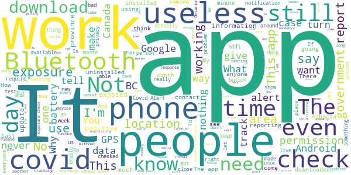

# COVID Alert - Let’s protect each other
App version ``1.1.4``

Analyzed with [covid-apps-observer](http://github.com/covid-apps-observer) project, version ``0.1``

## App overview
| | |
|-------------------------|-------------------------| 
| **Name**&nbsp;&nbsp;&nbsp;&nbsp;&nbsp;&nbsp;&nbsp;&nbsp;&nbsp;&nbsp;&nbsp;&nbsp;&nbsp;&nbsp;&nbsp;&nbsp;&nbsp;&nbsp;&nbsp;&nbsp;&nbsp;&nbsp;&nbsp;&nbsp;&nbsp;&nbsp;&nbsp;&nbsp;&nbsp;&nbsp;&nbsp;&nbsp;&nbsp;&nbsp;&nbsp;&nbsp;&nbsp;&nbsp;&nbsp;&nbsp;  | COVID Alert - Let’s protect each other |
| **Unique identifier** | ca.gc.hcsc.canada.stopcovid |
| **Link to Google Play** | [https://play.google.com/store/apps/details?id=ca.gc.hcsc.canada.stopcovid](https://play.google.com/store/apps/details?id=ca.gc.hcsc.canada.stopcovid) |
| **Summary**  | Health Canada Exposure Notification |
| **Privacy policy** | [https://www.canada.ca/en/public-health/services/diseases/coronavirus-disease-covid-19/covid-alert/privacy-policy.html](https://www.canada.ca/en/public-health/services/diseases/coronavirus-disease-covid-19/covid-alert/privacy-policy.html) |
| **Latest version** | 1.1.4 |
| **Last update** | 2020-12-18 16:05:17 |
| **Recent changes** | - New silent notifications when the app performs an exposure check, which will bring the app into the foreground briefly to help prevent gaps in exposure logs. - New links from the exposed screen for people who have not chosen a province or territory so they can access their area&#39;s guidance. |
| **Installs**  | 1,000,000+ |
| **Category** | Health & Fitness |
| **First release** | Jul 29, 2020 |
| **Size**  | 42M |
| **Supported Android version**  | 6.0 and up |

### Description
> Together, let’s slow the spread of COVID-19. Canada's COVID Alert app notifies you if someone you were near in the past 14 days tells the app they tested positive.
 COVID Alert uses Bluetooth to exchange random codes with nearby phones. It does not use or access any location data. COVID Alert works by determining how far away other phones are by the strength of their Bluetooth signal. 
 Several times a day, COVID Alert checks a list of codes from people who tell the app they tested positive. You’ll get a notification if a code you received matches one of the positive codes.
 If you test positive for COVID-19 you’ll receive a one-time key with your diagnosis to enter into COVID Alert. The app asks permission to share your random codes from the last 14 days with a central server.
 Other phones using COVID Alert check the central server periodically throughout the day. If they recorded any codes that match the codes in the central server, their user will be notified that they were exposed.
 COVID Alert has no way of knowing:
 -your location - COVID Alert does not use GPS or location services
 -your name or address
 -the place or time you were near someone
 -if you're currently near someone who was previously diagnosed
 Provincial and territorial governments are working to support COVID Alert across Canada. In some places, people cannot yet report a COVID-19 diagnosis through this app.
 It’s still helpful to keep COVID Alert on, no matter where you are.  That way, when people are able to report a diagnosis, you’ll find out if you were near them.
 COVID Alert was built by Health Canada with the Canadian Digital Service on the private exposure notification framework by Apple and Google.

### User interface
The developers of the app provide the following screenshots in the Google play store.
| | | |
|:-------------------------:|:-------------------------:|:-------------------------:|
 |   |   |   | 
 |  

## Development team
In the following we report the main information provided by the development team in the Google play store.

| | |
|-------------------------|-------------------------|
| **Developer**  | Health Canada | Santé Canada |
| **Website**  | [https://www.canada.ca/en/public-health/services/diseases/coronavirus-disease-covid-19/covid-alert/help.html](https://www.canada.ca/en/public-health/services/diseases/coronavirus-disease-covid-19/covid-alert/help.html) |
| **Email** | hc.AlerteCOVIDAlert.sc@canada.ca |
| **Physical address**  | - |
| **Other developed apps**  | [https://play.google.com/store/apps/developer?id=Health+Canada+%7C+Sant%C3%A9+Canada](https://play.google.com/store/apps/developer?id=Health+Canada+%7C+Sant%C3%A9+Canada) |

## Android support

| | |
|-------------------------|-------------------------|
| **Declared target Android version**  | Android10, version 10 (API level 29) |
| **Effective target Android version**  | Android10, version 10 (API level 29) |
| **Minimum supported Android version**  | Marshmallow, version 6.0 (API level 23) |
| **Maximum target Android version**  | - |

The larger the difference between the minimum and maximum supported Android versions, the better. A larger difference means a wider audience. For example, old phones have a very low Android version, so a high minimum supported Android version means that the app cannot be used by users with old phones, thus leading to accessibility problems. 

## Requested permissions

In the following we report the complete list of the permissions requested by the app. 

| **Permission** | **Protection level** | **Description** | 
|-------------------------|-------------------------|-------------------------|
 **android.permission ACCESS_NETWORK_STATE** | Normal | Allows applications to access information about networks. 
 **android.permission ACCESS_WIFI_STATE** | Normal | Allows applications to access information about Wi-Fi networks. 
 **android.permission BLUETOOTH** | Normal | Allows applications to connect to paired bluetooth devices. 
 **android.permission FOREGROUND_SERVICE** | Normal | Allows a regular application to use Service.startForeground. 
 **android.permission GET_TASKS** | Deprecated | This constant was deprecated in API level 21. No longer enforced. 
 **android.permission INTERNET** | Normal | Allows applications to open network sockets. 
 **android.permission RECEIVE_BOOT_COMPLETED** | Normal | Allows an application to receive the Intent.ACTION_BOOT_COMPLETED that is broadcast after the system finishes booting. 
 **android.permission WAKE_LOCK** | Normal | Allows using PowerManager WakeLocks to keep processor from sleeping or screen from dimming. 

## Mentioned servers

| **Server** | **Registrant** | **Registrant country** | **Creation date** | 
|-------------------------|-------------------------|-------------------------|-------------------------|
 | android.com | Google LLC | :us: US | 1997-06-23 04:00:00 |
 | google.com | Google LLC | :us: US | 1997-09-15 04:00:00 |
 | googleapis.com | Google LLC | :us: US | 2005-01-25 17:52:26 |

## Security analysis 

Below we report the main security warnings raised by our execution of the [Androwarn](https://github.com/maaaaz/androwarn) security analysis tool.

**Telephony identifiers leakage**
> - This application reads the numeric name (MCC+MNC) of current registered operator 
> - This application reads the operator name 

**Connection interfaces exfiltration**
> - This application reads details about the currently active data network 
> - This application tries to find out if the currently active data network is metered 

**Suspicious connection establishment**
> - This application opens a Socket and connects it to the remote address '' on the 'N/A' port  
> - This application opens a Socket and connects it to the remote address 'Ljava/lang/StringBuilder;->toString()Ljava/lang/String;' on the ': connect, resolve' port  
> - This application opens a Socket and connects it to the remote address 'Ljava/lang/StringBuilder;->toString()Ljava/lang/String;' on the 'N/A' port  
> - This application opens a Socket and connects it to the remote address 'Ljava/net/Proxy;->type()Ljava/net/Proxy$Type;' on the 'N/A' port  
> - This application opens a Socket and connects it to the remote address 'timeout' on the 'N/A' port  

**Pim data leakage**
> - This application accesses data stored in the clipboard 

**Code execution**
> - This application loads a native library 
> - This application executes a UNIX command 

## User ratings and reviews

Below we provide information about how end users are reacting to the app in terms of ratings and reviews in the Google Play store.

### Ratings

The COVID Alert - Let’s protect each other app has been installed by more than **1000000** times. At this time, **6920** rated the app and its average score is **3.491453**. Below we show the distribution of the ratings across the usual star-based rating of Google Play

:star::star::star::star::star:: 3431

:star::star::star::star:: 581

:star::star::star:: 700

:star::star:: 374

:star:: 1834

### Reviews 

#### 5-star reviews

> 7 sur 7  :date: __2020-12-20 19:15:32__

> Helpful app  :date: __2020-12-20 06:43:46__

> I appreciate the recent changes that make the check for exposure more visible. I know that app hasn't always worked as well as we'd all like, but I'm very glad it's one of the tools we have right now.  :date: __2020-12-20 01:57:17__

> Not sure how it really works.  :date: __2020-12-19 05:17:43__

> A good app  :date: __2020-12-18 21:08:49__

> Good  :date: __2020-12-17 21:29:13__

> I'm sure this app is great but I've finally given up and uninstalled it because BC has never and will never roll it out. At this point, it's no longer worth even the minimal impact on battery, storage, and update bandwidth. Many thanks to the developers for their considerations to privacy and security, including the commitment to open source, which I've seen lauded by technology experts the world over. I only wish our provincial government was competent enough to try it.  :date: __2020-12-17 08:47:47__

> Ok  :date: __2020-12-16 20:40:07__

> Works good but only useful if others use it within your circle  :date: __2020-12-16 14:04:14__

> Do it  :date: __2020-12-16 03:48:05__

#### 4-star reviews

> It could be very nice, but I am not sure that people testing covid positive really enter a code in the app unfortunately... I never got any alert... Thanks!  :date: __2020-12-19 16:09:48__

> Operates in the background, nothing to do, I see checks have happened but no exposures and no personally identifiable details. The more people download this the better.  :date: __2020-12-17 03:29:39__

> I know the app has some minor issues but no technology is perfect, so many thanks to all the hard working developers! My only suggestion is to have the date and time of exposure available to the users so contact tracing becomes easier.  :date: __2020-12-10 01:58:11__

> Wouldn't install using Google Play on LG 4. I was able to install it from iPad for the LG 4 and it appears to be working so far.  :date: __2020-12-09 01:51:19__

> Does what it says on the tin! Devs listened and fixed the problem thank you! Seems to work, however reports check when fully opened only according to the timestamps.  :date: __2020-12-07 05:28:40__

> \*\*UPDATE\*\* I actually fixed it. For some reason even though Google Play protect was showing updated, Google Play Services was not. It didn't want to update in the Play store, so I went through a back door way to update it. It works now though and thank you!\*\* Doesn't work on OnePlus 6 with the default stable OS @ Android 10 Oxygen OS 10.3.6. Google Play Services is October 2020 and security update is September 2020. It says not compatible with OS. It used to work up until a month or 2 ago.  :date: __2020-12-05 19:09:24__

> I loaded this app as soon as it was available. I recently learned that there was an issue with some users not getting alert info regularly n times per day. The app does not have a way of showing you this activity. Now I have found if you go to your phone Settings and search "Covid", two items will appear. If you tap on Covid-19 Exposure Notification, a list of the recent activity is displayed. The Covid Alert app MUST have a menu option to display this directly. Knowledge is power.  :date: __2020-12-04 16:43:36__

> Good  :date: __2020-12-03 11:14:27__

> After many months of covid alert being greyed out I finally figured it out. I had several google accounts on my phone for gaming apps. I had to remove all of the other gmail accounts in settings/accounts and backup/accounts then restart my phone, reinstall the app, and it finally prompted me to enable covid alert. Hopefully you can spread the word so others experiencing this problem can get the app to work. I will leave my review at 1 star for a little so maybe people having trouble might see it  :date: __2020-12-02 22:42:05__

> Awesome  :date: __2020-11-29 17:52:04__

#### 3-star reviews

> Not sure why checks stop all of a sudden: nothing nov 11 to nov 20, updated app, then stops dec 9 to dec 13. Samsung S8 Android 9, Covid 1.1.2 - opening app seems to help Just updated to 1.1.3 - ability to turn off app - let's see if it fixes the checks issue - 19.12.20 - v 1.1.4 no checks since 16.12.20 -  :date: __2020-12-20 00:23:22__

> Seems to work. But NEWS story said Android users had to update app. This should be communicated through the App.  :date: __2020-12-19 00:54:58__

> Not make ? Fruck you covid 19 not have covid19  :date: __2020-12-18 20:42:49__

> I had the earlier bug where almost 2 weeks passed and the app did no exposure checks. Over the past few days, the app will only register exposure checks after I open the app. My understanding was that this process was done automatically and in the background, but that's not the case right now.  :date: __2020-12-14 14:24:26__

> The app is easy to use but how accurate is it?  :date: __2020-12-10 03:26:45__

> Will this app have a feature that I can enter a key when I eventually be vaccinated so I have a mobile vaccine certificate?? Also, 15 minutes within 2 meters seems a little liberal (maybe 5 minutes would be better), but if that's what the professionals say I guess  :date: __2020-12-09 20:09:38__

> Space  :date: __2020-12-08 21:35:22__

> I wish I didnt have to be online for this app to work. Not everyone has much data.  :date: __2020-12-05 22:14:07__

> As with other users, this has stopped doing exposure checks since early November. I'm in touch with support but not getting anywhere quickly. Also just checked with other members of my household and all have stopped working, all on Android. Looks to be working after Nov 20 update. This looks to be broken again after working for a few days. No checks on Dec 2,3 or 4. Kept app open on Dec 05 and got a dozen checks in about an hour .  :date: __2020-12-05 19:06:17__

> I was told this app could help direct us if we get a red alert weres safe would be helpfull.  :date: __2020-12-04 20:45:21__

#### 2-star reviews

> Can't reset the app after exposure notification. I received a notice by the app that I was exposed to someone that tested positive for Covid-19, so I went to get tested, and my result was negative. However, there is no way I can find in the app to reset it, so it is still telling me that I have been exposed. I can't tell if it is the original exposure, or a new one. This really renders the app useless going forward after an exposure warning.  :date: __2020-12-12 17:09:45__

> Great idea, bad execution. Most people don't know about it still. Stores and places of employment should post awareness of this. Also, as others says, it does not seem to check. I got 19 checks in past 14 days and they were all time stamped today.  :date: __2020-12-12 15:33:06__

> If I get near a person who has been tested positive, my phone should give me immediate, discreet notification to allow me to move away from people near me. These two factors will be a proactive approach to preventing the spread of covid-19 instead of reporting after the fact. I think the developers of this app have done a very good job of protecting people's privacy. I don't think people's privacy ought to trump people's health and potentially their lives. Only one million downloads!?  :date: __2020-12-11 19:10:26__

> When it was announced there was a bug preventing some devices from regularly checking for exposure, I downloaded the update assuming that would fix any problems. I just checked the settings this morning (Dec 7) and the app had not checked since November 26th, and previous to that, November 20th.  :date: __2020-12-07 12:29:27__

> Just wondering if this tool is actually effective due to recent outbreaks across the country. If nobody reports infection with this tool, then there will be no notification to the other by this tool. If this is true, then this is as good as a DUD. Maybe this tool should show some statistic data to bring up user confidence level⁉  :date: __2020-12-06 01:29:09__

> My daughter has had four notifications. She works from home, has groceries delivered and only goes out to walk her dog. No one she knows of has had a positive test. After two tests of herself and her family she no longer reacts to notifications. This sounds like another problem with th app.  :date: __2020-12-05 02:24:00__

> Turning bluetooth off and back on disables the app, at least on my device. I need to open the app and reactivate it manually everytime bluetooth has been disabled momentarily.  :date: __2020-12-04 19:24:33__

> I checked my logs today and they only show as having checked at the precise time of opening the app, no other times in the past 2 weeks. Before I checked the logs I made sure that the app is up to date, that was done a bit over a week ago. The phone has been rebooted since the update yet nothing shows in the logs until I opened the app. Over the last two weeks I know for certain that I have been around other people who have the app installed. How often should I see it checking?  :date: __2020-12-04 16:30:34__

> I never received alert via this app that there was an update. I read CBC news story that alerted me to check Google Play Store for update!!! NOT GOOD ENOUGH!!!  :date: __2020-12-04 15:06:54__

> When I open it, it says last checked 125 hours ago. If I go into google settings it says it checked this morning. Not sure which info to believe (I checked the App store and it appears i already have the update).  :date: __2020-12-04 14:30:19__

#### 1-star reviews

> Says not available to work in my area, BC, if I change it to Ont, it works  :date: __2020-12-20 05:30:17__

> You need to be 1 foot apart for 15 mins gor this to work  :date: __2020-12-19 16:48:55__

> Useless outside of Ontario. It says, “not available in your area yet.” I live in Vancouver.  :date: __2020-12-18 22:17:14__

> Can't even enable it. The "enable" button doesn't work. Edit: Under "Permissions" in settings, the app apparently doesn't require any permissions  :date: __2020-12-17 14:44:27__

> it is bad  :date: __2020-12-17 03:02:50__

> I get a message that something at the system occurred after entering one time key.  :date: __2020-12-15 22:53:24__

> Not in Alberta  :date: __2020-12-15 17:55:33__

> This app hasn't worked for me in weeks. I had to Google, to find out there's a problem. I will try to reinstall to see if that works. Our tax dollars paid for this scam. Edit. Okay, I did a reinstall and its working. But now it tells me that British Columbia isn't in the program. Funny, BC was in the system for August and September.  :date: __2020-12-15 05:47:44__

> Taking way too long for BC to be included in this.  :date: __2020-12-15 03:37:48__

> Doesn't work in Alberta because our premier is deranged. That's no excuse however. Developer (Health Canada) should provide a mechanism for reporting positive tests regardless of Alberta Health brain damage. That they (Health Canada) have not is inexcusable. Effectively we are zero for two testing apps. Lovely.  :date: __2020-12-15 00:55:32__

