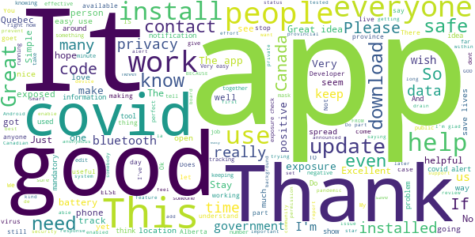

# COVID Alert - Let’s protect each other
App version ``1.1.5``

Analyzed with [covid-apps-observer](http://github.com/covid-apps-observer) project, version ``0.1``

## App overview
| | |
|-------------------------|-------------------------| 
| **Name**&nbsp;&nbsp;&nbsp;&nbsp;&nbsp;&nbsp;&nbsp;&nbsp;&nbsp;&nbsp;&nbsp;&nbsp;&nbsp;&nbsp;&nbsp;&nbsp;&nbsp;&nbsp;&nbsp;&nbsp;&nbsp;&nbsp;&nbsp;&nbsp;&nbsp;&nbsp;&nbsp;&nbsp;&nbsp;&nbsp;&nbsp;&nbsp;&nbsp;&nbsp;&nbsp;&nbsp;&nbsp;&nbsp;&nbsp;&nbsp;  | COVID Alert - Let’s protect each other |
| **Unique identifier** | ca.gc.hcsc.canada.stopcovid |
| **Link to Google Play** | [https://play.google.com/store/apps/details?id=ca.gc.hcsc.canada.stopcovid](https://play.google.com/store/apps/details?id=ca.gc.hcsc.canada.stopcovid) |
| **Summary**  | Health Canada Exposure Notification |
| **Privacy policy** | [https://www.canada.ca/en/public-health/services/diseases/coronavirus-disease-covid-19/covid-alert/privacy-policy.html](https://www.canada.ca/en/public-health/services/diseases/coronavirus-disease-covid-19/covid-alert/privacy-policy.html) |
| **Latest version** | 1.1.5 |
| **Last update** | 2020-12-22 20:44:19 |
| **Recent changes** | - Added notification date to exposed screen so people can identify more recent exposure notifications. - Maintenance updates (developers call them “package bumps” for WorkManager)” |
| **Installs**  | 1,000,000+ |
| **Category** | Health & Fitness |
| **First release** | Jul 29, 2020 |
| **Size**  | 42M |
| **Supported Android version**  | 6.0 and up |

### Description
> Together, let’s slow the spread of COVID-19. Canada's COVID Alert app notifies you if someone you were near in the past 14 days tells the app they tested positive.
 COVID Alert uses Bluetooth to exchange random codes with nearby phones. It does not use or access any location data. COVID Alert works by determining how far away other phones are by the strength of their Bluetooth signal. 
 Several times a day, COVID Alert checks a list of codes from people who tell the app they tested positive. You’ll get a notification if a code you received matches one of the positive codes.
 If you test positive for COVID-19 you’ll receive a one-time key with your diagnosis to enter into COVID Alert. The app asks permission to share your random codes from the last 14 days with a central server.
 Other phones using COVID Alert check the central server periodically throughout the day. If they recorded any codes that match the codes in the central server, their user will be notified that they were exposed.
 COVID Alert has no way of knowing:
 -your location - COVID Alert does not use GPS or location services
 -your name or address
 -the place or time you were near someone
 -if you're currently near someone who was previously diagnosed
 Provincial and territorial governments are working to support COVID Alert across Canada. In some places, people cannot yet report a COVID-19 diagnosis through this app.
 It’s still helpful to keep COVID Alert on, no matter where you are.  That way, when people are able to report a diagnosis, you’ll find out if you were near them.
 COVID Alert was built by Health Canada with the Canadian Digital Service on the private exposure notification framework by Apple and Google.

### User interface
The developers of the app provide the following screenshots in the Google play store.
| | | |
|:-------------------------:|:-------------------------:|:-------------------------:|
 |   |   |   | 
 |  

## Development team
In the following we report the main information provided by the development team in the Google play store.

| | |
|-------------------------|-------------------------|
| **Developer**  | Health Canada | Santé Canada |
| **Website**  | [https://www.canada.ca/en/public-health/services/diseases/coronavirus-disease-covid-19/covid-alert/help.html](https://www.canada.ca/en/public-health/services/diseases/coronavirus-disease-covid-19/covid-alert/help.html) |
| **Email** | hc.AlerteCOVIDAlert.sc@canada.ca |
| **Physical address**  | - |
| **Other developed apps**  | [https://play.google.com/store/apps/developer?id=Health+Canada+%7C+Sant%C3%A9+Canada](https://play.google.com/store/apps/developer?id=Health+Canada+%7C+Sant%C3%A9+Canada) |

## Android support

| | |
|-------------------------|-------------------------|
| **Declared target Android version**  | Android10, version 10 (API level 29) |
| **Effective target Android version**  | Android10, version 10 (API level 29) |
| **Minimum supported Android version**  | Marshmallow, version 6.0 (API level 23) |
| **Maximum target Android version**  | - |

The larger the difference between the minimum and maximum supported Android versions, the better. A larger difference means a wider audience. For example, old phones have a very low Android version, so a high minimum supported Android version means that the app cannot be used by users with old phones, thus leading to accessibility problems. 

## Requested permissions

In the following we report the complete list of the permissions requested by the app. 

| **Permission** | **Protection level** | **Description** | 
|-------------------------|-------------------------|-------------------------|
 **android.permission ACCESS_NETWORK_STATE** | Normal | Allows applications to access information about networks. 
 **android.permission ACCESS_WIFI_STATE** | Normal | Allows applications to access information about Wi-Fi networks. 
 **android.permission BLUETOOTH** | Normal | Allows applications to connect to paired bluetooth devices. 
 **android.permission FOREGROUND_SERVICE** | Normal | Allows a regular application to use Service.startForeground. 
 **android.permission GET_TASKS** | Deprecated | This constant was deprecated in API level 21. No longer enforced. 
 **android.permission INTERNET** | Normal | Allows applications to open network sockets. 
 **android.permission RECEIVE_BOOT_COMPLETED** | Normal | Allows an application to receive the Intent.ACTION_BOOT_COMPLETED that is broadcast after the system finishes booting. 
 **android.permission WAKE_LOCK** | Normal | Allows using PowerManager WakeLocks to keep processor from sleeping or screen from dimming. 

## Mentioned servers

| **Server** | **Registrant** | **Registrant country** | **Creation date** | 
|-------------------------|-------------------------|-------------------------|-------------------------|
 | android.com | Google LLC | :us: US | 1997-06-23 04:00:00 |
 | google.com | Google LLC | :us: US | 1997-09-15 04:00:00 |
 | googleapis.com | Google LLC | :us: US | 2005-01-25 17:52:26 |

## Security analysis 

Below we report the main security warnings raised by our execution of the [Androwarn](https://github.com/maaaaz/androwarn) security analysis tool.

**Telephony identifiers leakage**
> - This application reads the numeric name (MCC+MNC) of current registered operator 
> - This application reads the operator name 

**Connection interfaces exfiltration**
> - This application reads details about the currently active data network 
> - This application tries to find out if the currently active data network is metered 

**Suspicious connection establishment**
> - This application opens a Socket and connects it to the remote address '' on the 'N/A' port  
> - This application opens a Socket and connects it to the remote address 'Ljava/lang/StringBuilder;->toString()Ljava/lang/String;' on the ': connect, resolve' port  
> - This application opens a Socket and connects it to the remote address 'Ljava/lang/StringBuilder;->toString()Ljava/lang/String;' on the 'N/A' port  
> - This application opens a Socket and connects it to the remote address 'Ljava/net/Proxy;->type()Ljava/net/Proxy$Type;' on the 'N/A' port  
> - This application opens a Socket and connects it to the remote address 'timeout' on the 'N/A' port  

**Pim data leakage**
> - This application accesses data stored in the clipboard 

**Code execution**
> - This application loads a native library 
> - This application executes a UNIX command 

## User ratings and reviews

Below we provide information about how end users are reacting to the app in terms of ratings and reviews in the Google Play store.

### Ratings

The COVID Alert - Let’s protect each other app has been installed by more than **1000000** times. At this time, **7044** rated the app and its average score is **3.4110346**. Below we show the distribution of the ratings across the usual star-based rating of Google Play

:star::star::star::star::star:: 3392

:star::star::star::star:: 544

:star::star::star:: 699

:star::star:: 388

:star:: 2021

### Reviews 

#### 5-star reviews

> Just what we need!  :date: __2020-12-28 10:42:12__

> I appreciate this App and couldn't get it installed fast enough. I spent over 2 weeks in hospital fighting this horrible virus. I wish people would download this App and quit whining about getting the update "scanning for exposure" and be thankful we have this App. I wish I had this App before I got COVID. It is a horrible, deadly virus that was touch and go for me. Nine months later I am considered a "long-hauler" because I'm still dealing with problems from this virus. TAKE IT SERIOUS PEOPLE!  :date: __2020-12-28 05:42:41__

> So far so good.  :date: __2020-12-28 02:46:39__

> Half of my family now hates me.  :date: __2020-12-27 00:25:59__

> UPDATE: The app has been updated and this issue resolved. Thanks! I had the earlier bug where almost 2 weeks passed and the app did no exposure checks. Over the past few days, the app will only register exposure checks after I open the app. My understanding was that this process was done automatically and in the background, but that's not the case right now.  :date: __2020-12-26 22:27:37__

> This covid app on my Android definitely gives me so much information and updates even up to today God bless me for that I haven't contracted covid-19 I recommend you to download this app  :date: __2020-12-26 08:44:46__

> Everyone should install this app, it will save lives  :date: __2020-12-25 05:41:26__

> Edited: Updated review after Developer feedback. Fantastic app. Does exactly what it needs to. Install it. Keep Bluetooth on. Help prevent the spread.  :date: __2020-12-24 22:57:58__

> So Nice of them to have come up with such a Brilliant app..Ill take anything they offer knowing their Helping all of us. Thank you Kindly for this. And People its Free to Boot.😷🙏👍👍👌💪☝☝🙏😷😷.  :date: __2020-12-24 18:38:29__

> Change the app function so that if we're in contact with someone who has covid-19 for even 1 second that we're alerted. 15 minutes seems too long  :date: __2020-12-24 16:32:14__

#### 4-star reviews

> Feel it gives me a good comfort level. Am 81 and appreciate any help to stay safe. Blessings.  :date: __2020-12-24 22:09:05__

> Finally app is doing constant exposure checks  :date: __2020-12-23 04:15:28__

> It could be very nice, but I am not sure that people testing covid positive really enter a code in the app unfortunately... I never got any alert... I understand how it works but I doubt that there's a lot of people honest enough to enter their code in it for real. That's what I meant.. ;) Thanks!  :date: __2020-12-22 04:05:38__

> I like the idea of this, I hope this helps people be made more aware and can be safe in exposure from others. I shut mine off till I got outside, as I'm not around anyone when I'm at home. Am I supposed to keep this on, or just when I go out??  :date: __2020-12-21 15:52:01__

> Operates in the background, nothing to do, I see checks have happened but no exposures and no personally identifiable details. The more people download this the better.  :date: __2020-12-17 03:29:39__

> I know the app has some minor issues but no technology is perfect, so many thanks to all the hard working developers! My only suggestion is to have the date and time of exposure available to the users so contact tracing becomes easier.  :date: __2020-12-10 01:58:11__

> Wouldn't install using Google Play on LG 4. I was able to install it from iPad for the LG 4 and it appears to be working so far.  :date: __2020-12-09 01:51:19__

> Does what it says on the tin! Devs listened and fixed the problem thank you! Seems to work, however reports check when fully opened only according to the timestamps.  :date: __2020-12-07 05:28:40__

> \*\*UPDATE\*\* I actually fixed it. For some reason even though Google Play protect was showing updated, Google Play Services was not. It didn't want to update in the Play store, so I went through a back door way to update it. It works now though and thank you!\*\* Doesn't work on OnePlus 6 with the default stable OS @ Android 10 Oxygen OS 10.3.6. Google Play Services is October 2020 and security update is September 2020. It says not compatible with OS. It used to work up until a month or 2 ago.  :date: __2020-12-05 19:09:24__

> I loaded this app as soon as it was available. I recently learned that there was an issue with some users not getting alert info regularly n times per day. The app does not have a way of showing you this activity. Now I have found if you go to your phone Settings and search "Covid", two items will appear. If you tap on Covid-19 Exposure Notification, a list of the recent activity is displayed. The Covid Alert app MUST have a menu option to display this directly. Knowledge is power.  :date: __2020-12-04 16:43:36__

#### 3-star reviews

> New here .. what if the person with covid doesn't have the app or even makes a report can you not do it automatically when the tests are done..?  :date: __2020-12-23 16:00:37__

> Dies this App work?  :date: __2020-12-22 00:05:02__

> The "checking for exposures" notification is annoying. I wish it would show a notification in just the status bar without popping up on the screen.  :date: __2020-12-21 22:03:44__

> Not sure why checks stop all of a sudden: nothing nov 11 to nov 20, updated app, then stops dec 9 to dec 13. Samsung S8 Android 9, Covid 1.1.2 - opening app seems to help Just updated to 1.1.3 - ability to turn off app - let's see if it fixes the checks issue - 19.12.20 - v 1.1.4 no checks since 16.12.20 -  :date: __2020-12-20 00:23:22__

> Seems to work. But NEWS story said Android users had to update app. This should be communicated through the App.  :date: __2020-12-19 00:54:58__

> Not make ? Fruck you covid 19 not have covid19  :date: __2020-12-18 20:42:49__

> The app is easy to use but how accurate is it?  :date: __2020-12-10 03:26:45__

> Will this app have a feature that I can enter a key when I eventually be vaccinated so I have a mobile vaccine certificate?? Also, 15 minutes within 2 meters seems a little liberal (maybe 5 minutes would be better), but if that's what the professionals say I guess  :date: __2020-12-09 20:09:38__

> Space  :date: __2020-12-08 21:35:22__

> I wish I didnt have to be online for this app to work. Not everyone has much data.  :date: __2020-12-05 22:14:07__

#### 2-star reviews

> I am an avid supporter of the app concept. However I got a notification that I had been exposed to a positive case. Without any indication of when/where exposure happened, one does not have sufficient info to make an informed decision. The lack of info undermines the precautions someone takes when they are in public (ie. At the grocery store). I got a test, just as the app recommended, but I have to self isolate for 14 days regardless if I get a neg result. The app needs to be more precise.  :date: __2020-12-26 16:36:14__

> Used too much of my battery to be helpful especially since I rarely go out anyhow. It somehow used even more battery if I turned off Bluetooth. The choice to only notify you if you were around an infected person for a full 15 minutes also severely lowers its value.  :date: __2020-12-26 10:41:28__

> I like the app...but it keeps shutting my bluetooth off. Not sure why but it's annoying.  :date: __2020-12-25 22:56:20__

> Can't reset the app after exposure notification. I received a notice by the app that I was exposed to someone that tested positive for Covid-19, so I went to get tested, and my result was negative. However, there is no way I can find in the app to reset it, so it is still telling me that I have been exposed. I can't tell if it is the original exposure, or a new one. This really renders the app useless going forward after an exposure warning.  :date: __2020-12-12 17:09:45__

> Great idea, bad execution. Most people don't know about it still. Stores and places of employment should post awareness of this. Also, as others says, it does not seem to check. I got 19 checks in past 14 days and they were all time stamped today.  :date: __2020-12-12 15:33:06__

> If I get near a person who has been tested positive, my phone should give me immediate, discreet notification to allow me to move away from people near me. These two factors will be a proactive approach to preventing the spread of covid-19 instead of reporting after the fact. I think the developers of this app have done a very good job of protecting people's privacy. I don't think people's privacy ought to trump people's health and potentially their lives. Only one million downloads!?  :date: __2020-12-11 19:10:26__

> When it was announced there was a bug preventing some devices from regularly checking for exposure, I downloaded the update assuming that would fix any problems. I just checked the settings this morning (Dec 7) and the app had not checked since November 26th, and previous to that, November 20th.  :date: __2020-12-07 12:29:27__

> Just wondering if this tool is actually effective due to recent outbreaks across the country. If nobody reports infection with this tool, then there will be no notification to the other by this tool. If this is true, then this is as good as a DUD. Maybe this tool should show some statistic data to bring up user confidence level⁉  :date: __2020-12-06 01:29:09__

> My daughter has had four notifications. She works from home, has groceries delivered and only goes out to walk her dog. No one she knows of has had a positive test. After two tests of herself and her family she no longer reacts to notifications. This sounds like another problem with th app.  :date: __2020-12-05 02:24:00__

> Turning bluetooth off and back on disables the app, at least on my device. I need to open the app and reactivate it manually everytime bluetooth has been disabled momentarily.  :date: __2020-12-04 19:24:33__

#### 1-star reviews

> Still an absolutely useless app. Nova Scotia. New Brunswicke... the north pole?. Good job guys on rolling it out to major populations in Canada. Take your useless app, fire everyone involved, and hire some teen that makes an app country wide. It's been a year!!!🤬🤬🤬🇨🇦🇨🇦😷  :date: __2020-12-28 07:01:32__

> Useless if you live in B.C. or Alberta!  :date: __2020-12-28 06:41:10__

> Umecesarry pop ups  :date: __2020-12-28 04:33:47__

> Waste of tax money  :date: __2020-12-28 00:13:54__

> Why does this only work in Ontario. Does the Government of Canada realize the country has more than just 1 province. We're almost a year into this and you guys still can't figure this out, unreal.  :date: __2020-12-27 22:36:23__

> Sadly, this app does not solve any problem. The government thought that the privacy is far more important than people's lives. Even in the app You see that the government is trying to protect your privacy, but they don't have any announcement about how to protect people's lives in this app. It's a shame.  :date: __2020-12-27 05:50:18__

> Pointless  :date: __2020-12-27 03:16:22__

> Can't use in AB  :date: __2020-12-27 02:49:20__

> I DLed app so I could leave this comment. whats worse... 1- The developers that don't have a clue on how the public actually functions (singeling someone out for any reason is trouble, its like making fun of the kid next door cuz he got Reeboks instead of Nikes for christmas) assuming BIG ASSUME people are actually honest with the app (which they wont be revealing you have covid is asking the world to never speak or associate with you ever again) 2-needed an app to remind you to NOT be a jerk  :date: __2020-12-26 22:19:50__

> I am about ready to uninstall this app constant "checking notifications" and there seems to be no way to turn off them.  :date: __2020-12-26 05:34:25__

