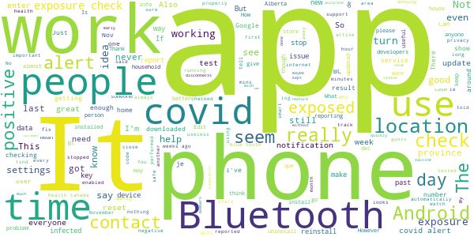
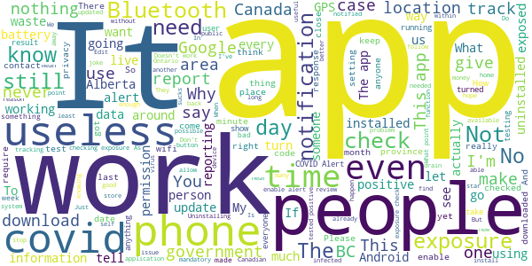

# COVID Alert - Let’s protect each other
App version ``1.1.5``

Analyzed with [covid-apps-observer](http://github.com/covid-apps-observer) project, version ``0.1``

## App overview
| | |
|-------------------------|-------------------------| 
| **Name**&nbsp;&nbsp;&nbsp;&nbsp;&nbsp;&nbsp;&nbsp;&nbsp;&nbsp;&nbsp;&nbsp;&nbsp;&nbsp;&nbsp;&nbsp;&nbsp;&nbsp;&nbsp;&nbsp;&nbsp;&nbsp;&nbsp;&nbsp;&nbsp;&nbsp;&nbsp;&nbsp;&nbsp;&nbsp;&nbsp;&nbsp;&nbsp;&nbsp;&nbsp;&nbsp;&nbsp;&nbsp;&nbsp;&nbsp;&nbsp;  | COVID Alert - Let’s protect each other |
| **Unique identifier** | ca.gc.hcsc.canada.stopcovid |
| **Link to Google Play** | [https://play.google.com/store/apps/details?id=ca.gc.hcsc.canada.stopcovid](https://play.google.com/store/apps/details?id=ca.gc.hcsc.canada.stopcovid) |
| **Summary**  | Health Canada Exposure Notification |
| **Privacy policy** | [https://www.canada.ca/en/public-health/services/diseases/coronavirus-disease-covid-19/covid-alert/privacy-policy.html](https://www.canada.ca/en/public-health/services/diseases/coronavirus-disease-covid-19/covid-alert/privacy-policy.html) |
| **Latest version** | 1.1.5 |
| **Last update** | 2020-12-22 20:44:19 |
| **Recent changes** | - Added notification date to exposed screen so people can identify more recent exposure notifications. - Maintenance updates (developers call them “package bumps” for WorkManager)” |
| **Installs**  | 1,000,000+ |
| **Category** | Health & Fitness |
| **First release** | Jul 29, 2020 |
| **Size**  | 42M |
| **Supported Android version**  | 6.0 and up |

### Description
> Together, let’s slow the spread of COVID-19. Canada's COVID Alert app notifies you if someone you were near in the past 14 days tells the app they tested positive.
 COVID Alert uses Bluetooth to exchange random codes with nearby phones. It does not use or access any location data. COVID Alert works by determining how far away other phones are by the strength of their Bluetooth signal. 
 Several times a day, COVID Alert checks a list of codes from people who tell the app they tested positive. You’ll get a notification if a code you received matches one of the positive codes.
 If you test positive for COVID-19 you’ll receive a one-time key with your diagnosis to enter into COVID Alert. The app asks permission to share your random codes from the last 14 days with a central server.
 Other phones using COVID Alert check the central server periodically throughout the day. If they recorded any codes that match the codes in the central server, their user will be notified that they were exposed.
 COVID Alert has no way of knowing:
 -your location - COVID Alert does not use GPS or location services
 -your name or address
 -the place or time you were near someone
 -if you're currently near someone who was previously diagnosed
 Provincial and territorial governments are working to support COVID Alert across Canada. In some places, people cannot yet report a COVID-19 diagnosis through this app.
 It’s still helpful to keep COVID Alert on, no matter where you are.  That way, when people are able to report a diagnosis, you’ll find out if you were near them.
 COVID Alert was built by Health Canada with the Canadian Digital Service on the private exposure notification framework by Apple and Google.

### User interface
The developers of the app provide the following screenshots in the Google play store.
| | | |
|:-------------------------:|:-------------------------:|:-------------------------:|
 |   |   |   | 
 |  

## Development team
In the following we report the main information provided by the development team in the Google play store.

| | |
|-------------------------|-------------------------|
| **Developer**  | Health Canada | Santé Canada |
| **Website**  | [https://www.canada.ca/en/public-health/services/diseases/coronavirus-disease-covid-19/covid-alert/help.html](https://www.canada.ca/en/public-health/services/diseases/coronavirus-disease-covid-19/covid-alert/help.html) |
| **Email** | hc.AlerteCOVIDAlert.sc@canada.ca |
| **Physical address**  | - |
| **Other developed apps**  | [https://play.google.com/store/apps/developer?id=Health+Canada+%7C+Sant%C3%A9+Canada](https://play.google.com/store/apps/developer?id=Health+Canada+%7C+Sant%C3%A9+Canada) |

## Android support

| | |
|-------------------------|-------------------------|
| **Declared target Android version**  | Android10, version 10 (API level 29) |
| **Effective target Android version**  | Android10, version 10 (API level 29) |
| **Minimum supported Android version**  | Marshmallow, version 6.0 (API level 23) |
| **Maximum target Android version**  | - |

The larger the difference between the minimum and maximum supported Android versions, the better. A larger difference means a wider audience. For example, old phones have a very low Android version, so a high minimum supported Android version means that the app cannot be used by users with old phones, thus leading to accessibility problems. 

## Requested permissions

In the following we report the complete list of the permissions requested by the app. 

| **Permission** | **Protection level** | **Description** | 
|-------------------------|-------------------------|-------------------------|
 **android.permission ACCESS_NETWORK_STATE** | Normal | Allows applications to access information about networks. 
 **android.permission ACCESS_WIFI_STATE** | Normal | Allows applications to access information about Wi-Fi networks. 
 **android.permission BLUETOOTH** | Normal | Allows applications to connect to paired bluetooth devices. 
 **android.permission FOREGROUND_SERVICE** | Normal | Allows a regular application to use Service.startForeground. 
 **android.permission GET_TASKS** | Deprecated | This constant was deprecated in API level 21. No longer enforced. 
 **android.permission INTERNET** | Normal | Allows applications to open network sockets. 
 **android.permission RECEIVE_BOOT_COMPLETED** | Normal | Allows an application to receive the Intent.ACTION_BOOT_COMPLETED that is broadcast after the system finishes booting. 
 **android.permission WAKE_LOCK** | Normal | Allows using PowerManager WakeLocks to keep processor from sleeping or screen from dimming. 

## Mentioned servers

| **Server** | **Registrant** | **Registrant country** | **Creation date** | 
|-------------------------|-------------------------|-------------------------|-------------------------|
 | android.com | Google LLC | :us: US | 1997-06-23 04:00:00 |
 | google.com | Google LLC | :us: US | 1997-09-15 04:00:00 |
 | googleapis.com | Google LLC | :us: US | 2005-01-25 17:52:26 |

## Security analysis 

Below we report the main security warnings raised by our execution of the [Androwarn](https://github.com/maaaaz/androwarn) security analysis tool.

**Telephony identifiers leakage**
> - This application reads the numeric name (MCC+MNC) of current registered operator 
> - This application reads the operator name 

**Connection interfaces exfiltration**
> - This application reads details about the currently active data network 
> - This application tries to find out if the currently active data network is metered 

**Suspicious connection establishment**
> - This application opens a Socket and connects it to the remote address '' on the 'N/A' port  
> - This application opens a Socket and connects it to the remote address 'Ljava/lang/StringBuilder;->toString()Ljava/lang/String;' on the ': connect, resolve' port  
> - This application opens a Socket and connects it to the remote address 'Ljava/lang/StringBuilder;->toString()Ljava/lang/String;' on the 'N/A' port  
> - This application opens a Socket and connects it to the remote address 'Ljava/net/Proxy;->type()Ljava/net/Proxy$Type;' on the 'N/A' port  
> - This application opens a Socket and connects it to the remote address 'timeout' on the 'N/A' port  

**Pim data leakage**
> - This application accesses data stored in the clipboard 

**Code execution**
> - This application loads a native library 
> - This application executes a UNIX command 

## User ratings and reviews

Below we provide information about how end users are reacting to the app in terms of ratings and reviews in the Google Play store.

### Ratings

The COVID Alert - Let’s protect each other app has been installed by more than **1000000** times. At this time, **7044** rated the app and its average score is **3.4110346**. Below we show the distribution of the ratings across the usual star-based rating of Google Play

:star::star::star::star::star:: 3392

:star::star::star::star:: 544

:star::star::star:: 699

:star::star:: 388

:star:: 2021

### Reviews 

#### 5-star reviews

> Very easy to use and the developers have gone to noticable lengths to ensure privacy, like going out of their way to have any data pass through Google on Android, and making all the code in the app and on the server open for anyone to see, play with, and edit. making it impossible for then to hide malicious things in the code (code review prevents bad code from being submitted)  :date: __2021-01-02 00:13:12__

> Update 2021/Jan/01 The app now features a On/Off toggling button, which is a time saver. Thanks! .... It does what is supposed to do but it blocks other wearables to connect with my phone for something as trivial as syncing data after a workout forcing me to uninstall the app first. It would be great if it had a toggling feature with a timer so you can pause it instead of uninstalling/installing it.  :date: __2021-01-01 22:58:09__

> ¼✓√™★@|  :date: __2021-01-01 08:43:46__

> My suspect-confirmed covid status was ignored before testing became widely available, and the hospital sent me home in a cab. This is a necessary app for all Canadians to stay alive with the amount of new viral particulate coming out of the melting Ice Caps into the future. Please everyone, wear a goddamned mask. Its stylish, I swear- you don't even need to dl this app.  :date: __2020-12-31 23:18:44__

> If we all had this app, COVID would be under control  :date: __2020-12-31 20:05:02__

> PLEASE TURN OFF THE POPUP ALERT THAT THE APP IS CHECKING FOR COVID EXPOSURES  :date: __2020-12-31 11:25:16__

> In early Dec. I wasn't able to show any scanning other than when I went directly to the app and it showed only the same time for scans as the time I opened it. Updates to the OS, around the 23rd has fixed the issue and I can see that the app is working as it should be. Thank you for your response. Thought you should know that the OS update resolved the problem.  :date: __2020-12-30 18:06:25__

> Great idea, provided by the Government of Canada as a tool to prevent exposure. App installation should be enforced to all device holders.  :date: __2020-12-29 09:40:49__

> Great app. Works in the background with no effort on your part.  :date: __2020-12-29 01:59:38__

> Only problem with this app is not everyone in the country has installed it. It is almost useless at the numbers installed so far. Although I'm glad to see people tentative of anything produced by government, I don't understand why then such a large percentage voted for the Big Government parties? People need to think through their conflicting beliefs and actions a little harder.  :date: __2020-12-29 01:20:59__

#### 4-star reviews

> I'm glad to have it. But.. it is limited in its use as we can not put it on our older organizations iPhones which we have, numerous model 6. Requires higher iOS version than iPhone 6 supports  :date: __2021-01-02 15:03:58__

> Update #2: The app finally appears to be working properly. Exposure checks are happening 3+ times per day, even without opening the app. Update: I spoke to soon. The showed exposure checks for a few days but stopped on the 28th. After I opened the app the logs showed a dozen or so checks in the last minute, but nothing since then. Is the app just not uploading IDs when it's closed or is it not sending out bluetooth beacons as well? Both situations aren't ideal but the latter is very worrying to me. EDIT: The problem I described below appears to have been fixed. I now see multiple checks per day, even without opening the app. I'm not convinced the app is checking for exposure and/or running in the background. The exposure log (settings->google->covid19->exposure checks) only shows checks after the app is opened. If I don't open the app for days or weeks and check the logs again, the most recent check lines up exactly with the last time the app was opened. I tried uninstalling-reinstalling and saw no change in behaviour. I've read that the app constantly checks for exposure as long as there is internet access but that doesn't seem to be happening on my device.  :date: __2021-01-01 03:24:20__

> Seems to work but the notification that is shown when it's searching for exposures should be disabled by default. With this on, it wakes up the screen and is just annoying. Just tell us if there is an actual exposure detected.  :date: __2020-12-28 23:31:24__

> Feel it gives me a good comfort level. Am 81 and appreciate any help to stay safe. Blessings.  :date: __2020-12-24 22:09:05__

> Finally app is doing constant exposure checks  :date: __2020-12-23 04:15:28__

> It could be very nice, but I am not sure that people testing covid positive really enter a code in the app unfortunately... I never got any alert... I understand how it works but I doubt that there's a lot of people honest enough to enter their code in it for real. That's what I meant.. ;) Thanks!  :date: __2020-12-22 04:05:38__

> I like the idea of this, I hope this helps people be made more aware and can be safe in exposure from others. I shut mine off till I got outside, as I'm not around anyone when I'm at home. Am I supposed to keep this on, or just when I go out??  :date: __2020-12-21 15:52:01__

> Operates in the background, nothing to do, I see checks have happened but no exposures and no personally identifiable details. The more people download this the better.  :date: __2020-12-17 03:29:39__

> I know the app has some minor issues but no technology is perfect, so many thanks to all the hard working developers! My only suggestion is to have the date and time of exposure available to the users so contact tracing becomes easier.  :date: __2020-12-10 01:58:11__

> Wouldn't install using Google Play on LG 4. I was able to install it from iPad for the LG 4 and it appears to be working so far.  :date: __2020-12-09 01:51:19__

#### 3-star reviews

> Do u have to keep your data on ??  :date: __2021-01-03 05:39:19__

> The app should turn on Bluetooth automatically when the phone disconnects from a (home) WiFi. Turning on Bluetooth when leaving the house is an irritant, as is having it on all the time.  :date: __2021-01-02 14:28:46__

> I love the idea of a COVID alert app, but this app has been out for months and there's still no reporting for BC.  :date: __2020-12-29 03:33:49__

> New here .. what if the person with covid doesn't have the app or even makes a report can you not do it automatically when the tests are done..?  :date: __2020-12-23 16:00:37__

> Dies this App work?  :date: __2020-12-22 00:05:02__

> The "checking for exposures" notification is annoying. I wish it would show a notification in just the status bar without popping up on the screen.  :date: __2020-12-21 22:03:44__

> Not sure why checks stop all of a sudden: nothing nov 11 to nov 20, updated app, then stops dec 9 to dec 13. Samsung S8 Android 9, Covid 1.1.2 - opening app seems to help Just updated to 1.1.3 - ability to turn off app - let's see if it fixes the checks issue - 19.12.20 - v 1.1.4 no checks since 16.12.20 -  :date: __2020-12-20 00:23:22__

> Seems to work. But NEWS story said Android users had to update app. This should be communicated through the App.  :date: __2020-12-19 00:54:58__

> Not make ? Fruck you covid 19 not have covid19  :date: __2020-12-18 20:42:49__

> The app is easy to use but how accurate is it?  :date: __2020-12-10 03:26:45__

#### 2-star reviews

> Seems to stop working without notice. I have to manually update the app when it does, but I'm never sure when it stops working so the tracking isn't reliable.  :date: __2021-01-03 12:17:25__

> Great idea, IF all Provences utilize them. But they don't so it's broken.  :date: __2021-01-02 18:32:43__

> Why is this not available in Alberta yet? It's almost 2021  :date: __2021-01-01 06:14:25__

> The "enable covid alert" button doesn't switch it on for me. It showed the animation, but no response. Dysfunctional. Good attempt though.  :date: __2020-12-31 19:04:00__

> Get the Canada health covid app to only learn Alberta is ineligible for it. That does not make sense to me  :date: __2020-12-31 04:39:34__

> While I support the concept of the app, the recent update that creates push notifications when the app is just checking for exposures is extremely irritating. The first time this happened I flew into a panic, only to realize the app just pushes these notifications when it's checking. I've quickly gone from getting worried when seeing the notifications, to just ignoring the app entirely, defeating much of the app's purpose. I've uninstalled, but will gladly reinstall if this update is reversed.  :date: __2020-12-30 07:29:36__

> I am an avid supporter of the app concept. However I got a notification that I had been exposed to a positive case. Without any indication of when/where exposure happened, one does not have sufficient info to make an informed decision. The lack of info undermines the precautions someone takes when they are in public (ie. At the grocery store). I got a test, just as the app recommended, but I have to self isolate for 14 days regardless if I get a neg result. The app needs to be more precise.  :date: __2020-12-26 16:36:14__

> Used too much of my battery to be helpful especially since I rarely go out anyhow. It somehow used even more battery if I turned off Bluetooth. The choice to only notify you if you were around an infected person for a full 15 minutes also severely lowers its value.  :date: __2020-12-26 10:41:28__

> I like the app...but it keeps shutting my bluetooth off. Not sure why but it's annoying.  :date: __2020-12-25 22:56:20__

> Can't reset the app after exposure notification. I received a notice by the app that I was exposed to someone that tested positive for Covid-19, so I went to get tested, and my result was negative. However, there is no way I can find in the app to reset it, so it is still telling me that I have been exposed. I can't tell if it is the original exposure, or a new one. This really renders the app useless going forward after an exposure warning.  :date: __2020-12-12 17:09:45__

#### 1-star reviews

> Extremely annoying. The app spams my notifications roughly every 10 minutes.  :date: __2021-01-03 08:52:32__

> In your ad for this application you have two people who live in separate houses but they visit each other on a regular basis. Isn't this contrary to what the Canadian government has been telling the public not to do for nearly a year? Shouldn't you be sticking to the message that the government has created?  :date: __2021-01-03 07:02:36__

> The app does not work on older versions of Android. My phone cannot be updated to latest release so it won't work. I've uninstalled it. (I could not give it a lower rating.)  :date: __2021-01-03 03:15:37__

> China state runs the app....why???  :date: __2021-01-02 21:03:50__

> Doesn't work for me, keeps demanding an update to Google play services which doesn't appear valid. Google pixel 2, all updates.  :date: __2021-01-02 03:57:50__

> You need to be 1 foot apart for 15 mins for you and the other person to "link" your apps together. So basically if you go to the mall for less then 15 mins and someone there was infected you wouldn't know cause the app didn't have time to "Link" with the other person. Also you need to be 1 foot apart for it to work or else the other person device is to far to "Link" anyways. JUST WEAR A MASK its better  :date: __2021-01-01 21:18:11__

> I cannot understand why this is still not a run in every province. I thought this would be a game changer. Faster tracing and informing. You rather have people phone us (and hope we answer) than use modern technology.  :date: __2021-01-01 19:08:10__

> .......How does the app keep you up to date on safety, locations and cases? People are reporting they have covid to the app or their health officials!? That's my point! Who is updating the app to let us aware? Health officials or people? I don't see many people within Nova Scotia going to let the app know that they have covid. Health officials, yes. Patients, no. Especially if their in the hospital on life support. Catch my drift, yet?  :date: __2020-12-30 22:49:52__

> Had to delete this app. As it was draining the battery really fast. And noticed that after I disabled it. It turned itself back on. It's a great idea. Need to work on the battery issue.  :date: __2020-12-30 15:44:58__

> Amazing idea with a major flaw; even if it says it doesn't track your phone it requires location services to be turned on (GPS). Most users turn off that service to extend battery life which renders the app useless. If the contact tracing is done via Bluetooth then it should work without the lication services. I'd say about half of the users are in the same boat with an offline contact tracing app. This has to be fixed.  :date: __2020-12-30 14:01:18__

