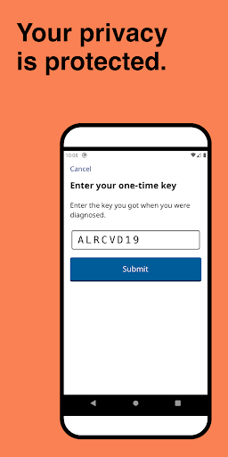
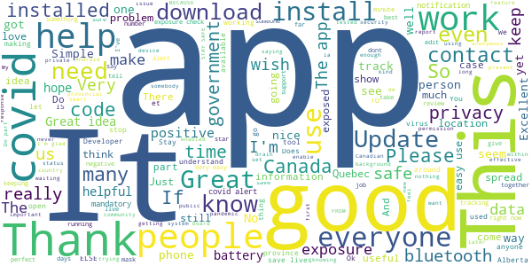
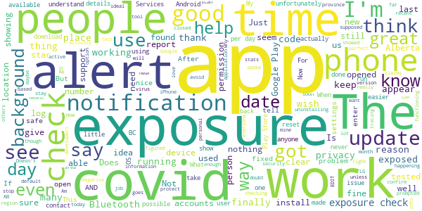
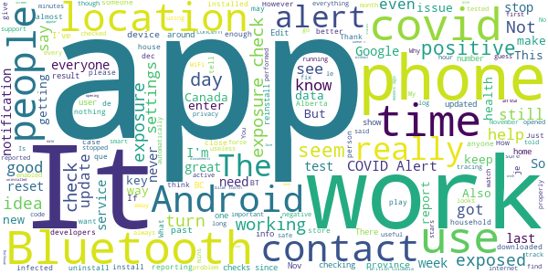
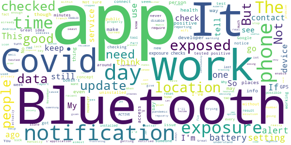
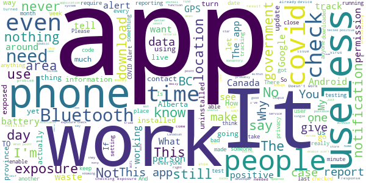

# COVID Alert - Let’s protect each other
App version ``1.1.6``

Analyzed with [covid-apps-observer](http://github.com/covid-apps-observer) project, version ``0.1``

## App overview
| | |
|-------------------------|-------------------------| 
| **Name**&nbsp;&nbsp;&nbsp;&nbsp;&nbsp;&nbsp;&nbsp;&nbsp;&nbsp;&nbsp;&nbsp;&nbsp;&nbsp;&nbsp;&nbsp;&nbsp;&nbsp;&nbsp;&nbsp;&nbsp;&nbsp;&nbsp;&nbsp;&nbsp;&nbsp;&nbsp;&nbsp;&nbsp;&nbsp;&nbsp;&nbsp;&nbsp;&nbsp;&nbsp;&nbsp;&nbsp;&nbsp;&nbsp;&nbsp;&nbsp;  | COVID Alert - Let’s protect each other |
| **Unique identifier** | ca.gc.hcsc.canada.stopcovid |
| **Link to Google Play** | [https://play.google.com/store/apps/details?id=ca.gc.hcsc.canada.stopcovid](https://play.google.com/store/apps/details?id=ca.gc.hcsc.canada.stopcovid) |
| **Summary**  | Health Canada Exposure Notification |
| **Privacy policy** | [https://www.canada.ca/en/public-health/services/diseases/coronavirus-disease-covid-19/covid-alert/privacy-policy.html](https://www.canada.ca/en/public-health/services/diseases/coronavirus-disease-covid-19/covid-alert/privacy-policy.html) |
| **Latest version** | 1.1.6 |
| **Last update** | 2021-01-04 16:44:50 |
| **Recent changes** | - Fixed a bug that showed exposure checks were happening when the app was off. No exposure checks actually happened while the app was off. - Stopped exposure check message from popping up on screen. The app will still continue to check for exposures. |
| **Installs**  | 1,000,000+ |
| **Category** | Health & Fitness |
| **First release** | Jul 29, 2020 |
| **Size**  | 42M |
| **Supported Android version**  | 6.0 and up |

### Description
> Together, let’s slow the spread of COVID-19. Canada's COVID Alert app notifies you if someone you were near in the past 14 days tells the app they tested positive.
 COVID Alert uses Bluetooth to exchange random codes with nearby phones. It does not use or access any location data. COVID Alert works by determining how far away other phones are by the strength of their Bluetooth signal. 
 Several times a day, COVID Alert checks a list of codes from people who tell the app they tested positive. You’ll get a notification if a code you received matches one of the positive codes.
 If you test positive for COVID-19 you’ll receive a one-time key with your diagnosis to enter into COVID Alert. The app asks permission to share your random codes from the last 14 days with a central server.
 Other phones using COVID Alert check the central server periodically throughout the day. If they recorded any codes that match the codes in the central server, their user will be notified that they were exposed.
 COVID Alert has no way of knowing:
 -your location - COVID Alert does not use GPS or location services
 -your name or address
 -the place or time you were near someone
 -if you're currently near someone who was previously diagnosed
 Provincial and territorial governments are working to support COVID Alert across Canada. In some places, people cannot yet report a COVID-19 diagnosis through this app.
 It’s still helpful to keep COVID Alert on, no matter where you are.  That way, when people are able to report a diagnosis, you’ll find out if you were near them.
 COVID Alert was built by Health Canada with the Canadian Digital Service on the private exposure notification framework by Apple and Google.

### User interface
The developers of the app provide the following screenshots in the Google play store.
| | | |
|:-------------------------:|:-------------------------:|:-------------------------:|
 |   |   |   | 
 |  

## Development team
In the following we report the main information provided by the development team in the Google play store.

| | |
|-------------------------|-------------------------|
| **Developer**  | Health Canada | Santé Canada |
| **Website**  | [https://www.canada.ca/en/public-health/services/diseases/coronavirus-disease-covid-19/covid-alert/help.html](https://www.canada.ca/en/public-health/services/diseases/coronavirus-disease-covid-19/covid-alert/help.html) |
| **Email** | hc.AlerteCOVIDAlert.sc@canada.ca |
| **Physical address**  | - |
| **Other developed apps**  | [https://play.google.com/store/apps/developer?id=Health+Canada+%7C+Sant%C3%A9+Canada](https://play.google.com/store/apps/developer?id=Health+Canada+%7C+Sant%C3%A9+Canada) |

## Android support

| | |
|-------------------------|-------------------------|
| **Declared target Android version**  | Android10, version 10 (API level 29) |
| **Effective target Android version**  | Android10, version 10 (API level 29) |
| **Minimum supported Android version**  | Marshmallow, version 6.0 (API level 23) |
| **Maximum target Android version**  | - |

The larger the difference between the minimum and maximum supported Android versions, the better. A larger difference means a wider audience. For example, old phones have a very low Android version, so a high minimum supported Android version means that the app cannot be used by users with old phones, thus leading to accessibility problems. 

## Requested permissions

In the following we report the complete list of the permissions requested by the app. 

| **Permission** | **Protection level** | **Description** | 
|-------------------------|-------------------------|-------------------------|
 **android.permission ACCESS_NETWORK_STATE** | Normal | Allows applications to access information about networks. 
 **android.permission ACCESS_WIFI_STATE** | Normal | Allows applications to access information about Wi-Fi networks. 
 **android.permission BLUETOOTH** | Normal | Allows applications to connect to paired bluetooth devices. 
 **android.permission FOREGROUND_SERVICE** | Normal | Allows a regular application to use Service.startForeground. 
 **android.permission GET_TASKS** | Deprecated | This constant was deprecated in API level 21. No longer enforced. 
 **android.permission INTERNET** | Normal | Allows applications to open network sockets. 
 **android.permission RECEIVE_BOOT_COMPLETED** | Normal | Allows an application to receive the Intent.ACTION_BOOT_COMPLETED that is broadcast after the system finishes booting. 
 **android.permission WAKE_LOCK** | Normal | Allows using PowerManager WakeLocks to keep processor from sleeping or screen from dimming. 

## Mentioned servers

| **Server** | **Registrant** | **Registrant country** | **Creation date** | 
|-------------------------|-------------------------|-------------------------|-------------------------|
 | android.com | Google LLC | :us: US | 1997-06-23 04:00:00 |
 | google.com | Google LLC | :us: US | 1997-09-15 04:00:00 |
 | googleapis.com | Google LLC | :us: US | 2005-01-25 17:52:26 |

## Security analysis 

Below we report the main security warnings raised by our execution of the [Androwarn](https://github.com/maaaaz/androwarn) security analysis tool.

**Telephony identifiers leakage**
> - This application reads the numeric name (MCC+MNC) of current registered operator 
> - This application reads the operator name 

**Connection interfaces exfiltration**
> - This application reads details about the currently active data network 
> - This application tries to find out if the currently active data network is metered 

**Suspicious connection establishment**
> - This application opens a Socket and connects it to the remote address '' on the 'N/A' port  
> - This application opens a Socket and connects it to the remote address 'Ljava/lang/StringBuilder;->toString()Ljava/lang/String;' on the ': connect, resolve' port  
> - This application opens a Socket and connects it to the remote address 'Ljava/lang/StringBuilder;->toString()Ljava/lang/String;' on the 'N/A' port  
> - This application opens a Socket and connects it to the remote address 'Ljava/net/Proxy;->type()Ljava/net/Proxy$Type;' on the 'N/A' port  
> - This application opens a Socket and connects it to the remote address 'timeout' on the 'N/A' port  

**Pim data leakage**
> - This application accesses data stored in the clipboard 

**Code execution**
> - This application loads a native library 
> - This application executes a UNIX command 

## User ratings and reviews

Below we provide information about how end users are reacting to the app in terms of ratings and reviews in the Google Play store.

### Ratings

The COVID Alert - Let’s protect each other app has been installed by more than **1000000** times. At this time, **7222** rated the app and its average score is **3.4080222**. Below we show the distribution of the ratings across the usual star-based rating of Google Play

:star::star::star::star::star:: 3417

:star::star::star::star:: 609

:star::star::star:: 709

:star::star:: 479

:star:: 2008

### Reviews 

#### 5-star reviews

> Good  :date: __2021-01-08 16:20:15__

> 5 stars just to boost app. even if its not perfect, or the most ideal, its the best we have. improvements will come as time goes by. this is a horrable situation our country has been thrust into, we all need to do our part to help. get the app, its not a step in the wrong direction.  :date: __2021-01-08 15:32:27__

> Have not received an alert yet Very good news  :date: __2021-01-07 20:12:13__

> I think it is very useful App but I still don't know if it works or not. It would be nice to show a log of proximity check. This way user will know if this apps works.  :date: __2021-01-07 05:36:26__

> I have to leave a new review. The app is fine. The problem is that not many people are using it. There are only just over 3,000 registered with keys. That's nothing when we are seeing over 2,000 cases DAILY. How are we expected to have any faith in being alerted if too few are brave enough to register their key. This is not the fault of the creators of this app. :(  :date: __2021-01-07 01:57:55__

> خوب است  :date: __2021-01-06 12:15:45__

> Still waiting for support for British Columbia.  :date: __2021-01-05 06:42:06__

> Very easy to use and the developers have gone to noticable lengths to ensure privacy, like going out of their way to have any data pass through Google on Android, and making all the code in the app and on the server open for anyone to see, play with, and edit. making it impossible for then to hide malicious things in the code (code review prevents bad code from being submitted)  :date: __2021-01-02 00:13:12__

> Update 2021/Jan/01 The app now features a On/Off toggling button, which is a time saver. Thanks! .... It does what is supposed to do but it blocks other wearables to connect with my phone for something as trivial as syncing data after a workout forcing me to uninstall the app first. It would be great if it had a toggling feature with a timer so you can pause it instead of uninstalling/installing it.  :date: __2021-01-01 22:58:09__

> ¼✓√™★@|  :date: __2021-01-01 08:43:46__

#### 4-star reviews

> Does what it says and protects privacy.. I would however like the option to turn on of off the exposure check notification, I found that more of a peace of mind thing when I did see it.  :date: __2021-01-05 02:30:37__

> I'm glad to have it. But.. it is limited in its use as we can not put it on our older organizations iPhones which we have, numerous model 6. Requires higher iOS version than iPhone 6 supports  :date: __2021-01-02 15:03:58__

> Update #2: The app finally appears to be working properly. Exposure checks are happening 3+ times per day, even without opening the app. Update: I spoke to soon. The showed exposure checks for a few days but stopped on the 28th. After I opened the app the logs showed a dozen or so checks in the last minute, but nothing since then. Is the app just not uploading IDs when it's closed or is it not sending out bluetooth beacons as well? Both situations aren't ideal but the latter is very worrying to me. EDIT: The problem I described below appears to have been fixed. I now see multiple checks per day, even without opening the app. I'm not convinced the app is checking for exposure and/or running in the background. The exposure log (settings->google->covid19->exposure checks) only shows checks after the app is opened. If I don't open the app for days or weeks and check the logs again, the most recent check lines up exactly with the last time the app was opened. I tried uninstalling-reinstalling and saw no change in behaviour. I've read that the app constantly checks for exposure as long as there is internet access but that doesn't seem to be happening on my device.  :date: __2021-01-01 03:24:20__

> Seems to work but the notification that is shown when it's searching for exposures should be disabled by default. With this on, it wakes up the screen and is just annoying. Just tell us if there is an actual exposure detected.  :date: __2020-12-28 23:31:24__

> Feel it gives me a good comfort level. Am 81 and appreciate any help to stay safe. Blessings.  :date: __2020-12-24 22:09:05__

> Finally app is doing constant exposure checks  :date: __2020-12-23 04:15:28__

> It could be very nice, but I am not sure that people testing covid positive really enter a code in the app unfortunately... I never got any alert... I understand how it works but I doubt that there's a lot of people honest enough to enter their code in it for real. That's what I meant.. ;) Thanks!  :date: __2020-12-22 04:05:38__

> I like the idea of this, I hope this helps people be made more aware and can be safe in exposure from others. I shut mine off till I got outside, as I'm not around anyone when I'm at home. Am I supposed to keep this on, or just when I go out??  :date: __2020-12-21 15:52:01__

> Operates in the background, nothing to do, I see checks have happened but no exposures and no personally identifiable details. The more people download this the better.  :date: __2020-12-17 03:29:39__

> I know the app has some minor issues but no technology is perfect, so many thanks to all the hard working developers! My only suggestion is to have the date and time of exposure available to the users so contact tracing becomes easier.  :date: __2020-12-10 01:58:11__

#### 3-star reviews

> I just heard that COVID Alert fails to work in British Columbia, Canada.  :date: __2021-01-06 07:42:45__

> Doesn't work for me, keeps demanding an update to Google play services which doesn't appear valid. Google pixel 2, all updates. Edit: everything was up to date, app and play services. Did a force stop on the app and it's working now.  :date: __2021-01-05 16:49:14__

> With other countries deciding to recycle contact tracing info into other uses, uninstalled as a precaution.  :date: __2021-01-05 15:43:07__

> moving along  :date: __2021-01-04 22:43:31__

> Not sure why checks stop all of a sudden: nothing nov 11 to nov 20, updated app, then stops dec 9 to dec 13. Samsung S8 Android 9, Covid 1.1.2 - opening app seems to help Just updated to 1.1.3 - ability to turn off app - let's see if it fixes the checks issue - 19.12.20 - v 1.1.4 no checks since 16.12.20 - (03.01.21) no checks since 27.12.20 - updated to v1.1.5 - nothing happened - opened app and 11 checks occurred all at once - this app keeps you on your toes - getting close to 50..  :date: __2021-01-04 03:54:08__

> Do u have to keep your data on ??  :date: __2021-01-03 05:39:19__

> The app should turn on Bluetooth automatically when the phone disconnects from a (home) WiFi. Turning on Bluetooth when leaving the house is an irritant, as is having it on all the time.  :date: __2021-01-02 14:28:46__

> I love the idea of a COVID alert app, but this app has been out for months and there's still no reporting for BC.  :date: __2020-12-29 03:33:49__

> New here .. what if the person with covid doesn't have the app or even makes a report can you not do it automatically when the tests are done..?  :date: __2020-12-23 16:00:37__

> Dies this App work?  :date: __2020-12-22 00:05:02__

#### 2-star reviews

> Just writing a review to report an issue. My phone stopped doing exposure checks 3 days ago (4 Jan 2021). Looks like that coincides with an update. I think something broke. Running on Android 8.0.0  :date: __2021-01-07 20:00:22__

> I see a comment from Dec 30th that the major flaw is that location settings need to be on. The response from the developer is that the user just needs to update the app. I just installed it (Jan 7th) and it is asking for location settings to be on. ...Not sure what the developer means, if I don't turn on the location, the app will not run.  :date: __2021-01-07 18:12:26__

> Great concept but the app is ineffective when Bluetooth or data is off? Why doesn't it have the option to manually enter where you were if it was turned off / battery died? Also, there should be a wider exposure range of reporting than within 6ft for at least 15 minutes.  :date: __2021-01-07 05:39:13__

> I dont like the fact that you have to keep your GPS location ON in order for it to be ENABLED!  :date: __2021-01-06 04:00:41__

> Usefulness most unclear in the absence of useful adoption&reporting stats in a given area. No social distancing capability either. Better to prevent than to cure? Not having been seriously ever field trialed explains a lot imho. No end in sight with these long overdue negotiations with BCH two weeks away from xmast holiday does not help. No new features release plan either??? Let's hope the vaccine works and we can get there. Revising to 2*s as CDS is actually revising app based on feedback.  :date: __2021-01-06 03:33:22__

> I was notified by a roommate who tested positive, I had been in contact with him for 10 days before he was notified, I thankfully tested negative but had been with him regularly. This app has no way to warn people about that. Nore did it warn me when he tested positive. He submitted a code in the app. My bluetooth is always on. I also work in an automotive industry and am in and out of customer vehicles. I'm high risk..... Should be linked to your health card, or other government issues ID.  :date: __2021-01-05 03:40:36__

> I am frustrating with that app doesn't have the vibration to alert me and warn me about those COVID-19 may be surrounded us. Please set up that vibrating with alert of flashing light. Thanks C.C.  :date: __2021-01-04 21:04:13__

> Continuously pops up an alert "COVID Alert" when just checking, creates a lot of anxiety.  :date: __2021-01-04 05:07:37__

> Seems to stop working without notice. I have to manually update the app when it does, but I'm never sure when it stops working so the tracking isn't reliable.  :date: __2021-01-03 12:17:25__

> Great idea, IF all Provences utilize them. But they don't so it's broken.  :date: __2021-01-02 18:32:43__

#### 1-star reviews

> Useless in British Columbia  :date: __2021-01-09 07:42:54__

> Doesn't work. My son was recently diagnosed, phones next to each other for hours. No exposure detected. He used his one key and all as instructed. App doesn't work. I'd give it no stars.  :date: __2021-01-09 05:37:16__

> Just a brick app that uses your data and drains your battery ..how is this app going to be accurate people who are suppose to self Isolate probably wont be using this app .... because they are dishonest anyways for not self isolating... its a complete waste of time to download  :date: __2021-01-09 05:24:10__

> Hi I have an iPhone 5s and I still cannot download the covid alert app justin trudeau said today jan 8 that all older iPhones can download the app now ? Why can i not?  :date: __2021-01-09 04:35:00__

> The app allows me to do a daily health check but nothing else. Does not Alert me to any possible contact with infected people. It says it is not compatible with my device SM-T387W. Since this device is my cell phone/tablet the app is useless for me.  :date: __2021-01-08 22:47:19__

> Where can you get a covid19 app that you will get a ping if you are in contact with a positive person in the whole of north America?  :date: __2021-01-08 05:25:40__

> It only works when you have internet and not everyone has data for their phones even with the bluetooth on it doesn't work without internet  :date: __2021-01-08 01:54:48__

> Literally doesn't do anything, just forces you to keep your location and Bluetooth on all day to waste battery. I know for a damn fact that there have been exposures in my area, and this app has never alerted me to a single thing  :date: __2021-01-07 21:38:24__

> Walk around downtown waving phone zero alerts 🤔  :date: __2021-01-07 15:07:03__

> This is a second review because I cannot respond to the developer after they responded......Thanks for your canned response! I stood within the 2 meters for 8 hours a day with my colleague who had the app and reported it through the app. Now another person has tested positive, 2 days ago, again close contact and STILL this app has not notified me. Waste of tax payers dollars  :date: __2021-01-06 23:19:36__

