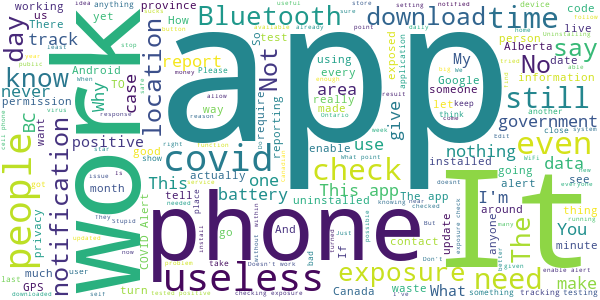

# COVID Alert - Let’s protect each other
App version ``1.1.7``

Analyzed with [covid-apps-observer](http://github.com/covid-apps-observer) project, version ``0.1``

## App overview
| | |
|-------------------------|-------------------------| 
| **Name**                                          | COVID Alert - Let’s protect each other |
| **Unique identifier** | ca.gc.hcsc.canada.stopcovid |
| **Link to Google Play** | [https://play.google.com/store/apps/details?id=ca.gc.hcsc.canada.stopcovid](https://play.google.com/store/apps/details?id=ca.gc.hcsc.canada.stopcovid) |
| **Summary**  | Health Canada Exposure Notification |
| **Privacy policy** | [https://www.canada.ca/en/public-health/services/diseases/coronavirus-disease-covid-19/covid-alert/privacy-policy.html](https://www.canada.ca/en/public-health/services/diseases/coronavirus-disease-covid-19/covid-alert/privacy-policy.html) |
| **Latest version** | 1.1.7 |
| **Last update** | 2021-01-14 16:00:05 |
| **Recent changes** | - Added new screens and instructions for people who entered a one-time key but have not yet shared their exposures. - Added app version number to the menu to help with support requests. - Added missing French sentence on thank you screen. |
| **Installs**  | 1,000,000+ |
| **Category** | Health & Fitness |
| **First release** | Jul 29, 2020 |
| **Size**  | 42M |
| **Supported Android version**  | 6.0 and up |

### Description
> Together, let’s slow the spread of COVID-19. Canada's COVID Alert app notifies you if someone you were near in the past 14 days tells the app they tested positive.
 COVID Alert uses Bluetooth to exchange random codes with nearby phones. It does not use or access any location data. COVID Alert works by determining how far away other phones are by the strength of their Bluetooth signal. 
 Several times a day, COVID Alert checks a list of codes from people who tell the app they tested positive. You’ll get a notification if a code you received matches one of the positive codes.
 If you test positive for COVID-19 you’ll receive a one-time key with your diagnosis to enter into COVID Alert. The app asks permission to share your random codes from the last 14 days with a central server.
 Other phones using COVID Alert check the central server periodically throughout the day. If they recorded any codes that match the codes in the central server, their user will be notified that they were exposed.
 COVID Alert has no way of knowing:
 -your location - COVID Alert does not use GPS or location services
 -your name or address
 -the place or time you were near someone
 -if you're currently near someone who was previously diagnosed
 Provincial and territorial governments are working to support COVID Alert across Canada. In some places, people cannot yet report a COVID-19 diagnosis through this app.
 It’s still helpful to keep COVID Alert on, no matter where you are.  That way, when people are able to report a diagnosis, you’ll find out if you were near them.
 COVID Alert was built by Health Canada with the Canadian Digital Service on the private exposure notification framework by Apple and Google.

### User interface
The developers of the app provide the following screenshots in the Google play store.
| | | |
|:-------------------------:|:-------------------------:|:-------------------------:|
 |   |   |   | 
 |  

## Development team
In the following we report the main information provided by the development team in the Google play store.

| | |
|-------------------------|-------------------------|
| **Developer**  | Health Canada | Santé Canada |
| **Website**  | [https://www.canada.ca/en/public-health/services/diseases/coronavirus-disease-covid-19/covid-alert/help.html](https://www.canada.ca/en/public-health/services/diseases/coronavirus-disease-covid-19/covid-alert/help.html) |
| **Email** | hc.AlerteCOVIDAlert.sc@canada.ca |
| **Physical address**  | - |
| **Other developed apps**  | [https://play.google.com/store/apps/developer?id=Health+Canada+%7C+Sant%C3%A9+Canada](https://play.google.com/store/apps/developer?id=Health+Canada+%7C+Sant%C3%A9+Canada) |

## Android support

| | |
|-------------------------|-------------------------|
| **Declared target Android version**  | Android10, version 10 (API level 29) |
| **Effective target Android version**  | Android10, version 10 (API level 29) |
| **Minimum supported Android version**  | Marshmallow, version 6.0 (API level 23) |
| **Maximum target Android version**  | - |

The larger the difference between the minimum and maximum supported Android versions, the better. A larger difference means a wider audience. For example, old phones have a very low Android version, so a high minimum supported Android version means that the app cannot be used by users with old phones, thus leading to accessibility problems. 

## Requested permissions

In the following we report the complete list of the permissions requested by the app. 

| **Permission** | **Protection level** | **Description** | 
|-------------------------|-------------------------|-------------------------|
 **android.permission ACCESS_NETWORK_STATE** | Normal | Allows applications to access information about networks. 
 **android.permission ACCESS_WIFI_STATE** | Normal | Allows applications to access information about Wi-Fi networks. 
 **android.permission BLUETOOTH** | Normal | Allows applications to connect to paired bluetooth devices. 
 **android.permission FOREGROUND_SERVICE** | Normal | Allows a regular application to use Service.startForeground. 
 **android.permission GET_TASKS** | Deprecated | This constant was deprecated in API level 21. No longer enforced. 
 **android.permission INTERNET** | Normal | Allows applications to open network sockets. 
 **android.permission RECEIVE_BOOT_COMPLETED** | Normal | Allows an application to receive the Intent.ACTION_BOOT_COMPLETED that is broadcast after the system finishes booting. 
 **android.permission WAKE_LOCK** | Normal | Allows using PowerManager WakeLocks to keep processor from sleeping or screen from dimming. 

## Mentioned servers

| **Server** | **Registrant** | **Registrant country** | **Creation date** | 
|-------------------------|-------------------------|-------------------------|-------------------------|
 | android.com | Google LLC | :us: US | 1997-06-23 04:00:00 |
 | google.com | Google LLC | :us: US | 1997-09-15 04:00:00 |
 | googleapis.com | Google LLC | :us: US | 2005-01-25 17:52:26 |

## Security analysis 

Below we report the main security warnings raised by our execution of the [Androwarn](https://github.com/maaaaz/androwarn) security analysis tool.

**Telephony identifiers leakage**
> - This application reads the numeric name (MCC+MNC) of current registered operator 
> - This application reads the operator name 

**Connection interfaces exfiltration**
> - This application reads details about the currently active data network 
> - This application tries to find out if the currently active data network is metered 

**Suspicious connection establishment**
> - This application opens a Socket and connects it to the remote address '' on the 'N/A' port  
> - This application opens a Socket and connects it to the remote address 'Ljava/lang/StringBuilder;->toString()Ljava/lang/String;' on the ': connect, resolve' port  
> - This application opens a Socket and connects it to the remote address 'Ljava/lang/StringBuilder;->toString()Ljava/lang/String;' on the 'N/A' port  
> - This application opens a Socket and connects it to the remote address 'Ljava/net/Proxy;->type()Ljava/net/Proxy$Type;' on the 'N/A' port  
> - This application opens a Socket and connects it to the remote address 'timeout' on the 'N/A' port  

**Pim data leakage**
> - This application accesses data stored in the clipboard 

**Code execution**
> - This application loads a native library 
> - This application executes a UNIX command 

## User ratings and reviews

Below we provide information about how end users are reacting to the app in terms of ratings and reviews in the Google Play store.

### Ratings

The COVID Alert - Let’s protect each other app has been installed by more than **1000000** times. At this time, **7313** rated the app and its average score is **3.4389262**. Below we show the distribution of the ratings across the usual star-based rating of Google Play

:star::star::star::star::star:: 3495

:star::star::star::star:: 677

:star::star::star:: 677

:star::star:: 471

:star:: 1993

### Reviews 

#### 5-star reviews

> Great app. I trust it and hope it will alert me if needed.  :date: __2021-01-16 00:50:32__

> Works as described.  :date: __2021-01-15 19:07:50__

> We would be better off if this was mandatory. Install the app, people  :date: __2021-01-14 03:43:16__

> I agree with the importance of this tool in our fight against the virus, however I'm concerned that unless everyone uses the app we will not be successful. I feel that the government should request that all service providers push this app to everyone's phone and activate it's ability to function. Even once this current pandemic ends this tool would be useful for other contagion outbreaks. Regards  :date: __2021-01-13 16:28:05__

> To everyone who gives 1 star because of "tracking" or Internet usage, you clearly don't know how to read. The app DOES NOT use GPS or track your location, it uses your phone's Bluetooth to listen for any nearby device Bluetooth where the person has tested positive. It is not a doctor or a person, it uses computer technology. If this is too difficult to comprehend, don't download the app. And no, the government isn't tracking you or using this to fine ppl.  :date: __2021-01-12 00:34:48__

> Great idea  :date: __2021-01-11 04:18:35__

> Seems robust enough  :date: __2021-01-10 15:22:46__

> Good  :date: __2021-01-08 16:20:15__

> 5 stars just to boost app. even if its not perfect, or the most ideal, its the best we have. improvements will come as time goes by. this is a horrable situation our country has been thrust into, we all need to do our part to help. get the app, its not a step in the wrong direction.  :date: __2021-01-08 15:32:27__

> Have not received an alert yet Very good news  :date: __2021-01-07 20:12:13__

#### 4-star reviews

> Like many others, I was pretty disappointed to find out that despite what this page says, it DOES require your device GPS/location services to be on. As soon as I turned it off, this app produces a warning that "Covid-19 alert is off". When you turn it on, it says "your phone needs to use Bluetooth to securely collect and share random IDs with other phones...", but then when you click continue, it says, "turn on the device location settings"... "The device location settings needs to be on for Bluetooth to detect nearby devices that have exposure notifications on...." So, no matter what you do, this app requires both Bluetooth AND GPS. Aside from that... we're in a pandemic and there are worse things to worry about, so I still encourage people to use it as it does help save lives and stop Covid.  :date: __2021-01-13 10:25:43__

> Does what it says and protects privacy.. I would however like the option to turn on of off the exposure check notification, I found that more of a peace of mind thing when I did see it.  :date: __2021-01-05 02:30:37__

> I'm glad to have it. But.. it is limited in its use as we can not put it on our older organizations iPhones which we have, numerous model 6. Requires higher iOS version than iPhone 6 supports  :date: __2021-01-02 15:03:58__

> Update #2: The app finally appears to be working properly. Exposure checks are happening 3+ times per day, even without opening the app. Update: I spoke to soon. The showed exposure checks for a few days but stopped on the 28th. After I opened the app the logs showed a dozen or so checks in the last minute, but nothing since then. Is the app just not uploading IDs when it's closed or is it not sending out bluetooth beacons as well? Both situations aren't ideal but the latter is very worrying to me. EDIT: The problem I described below appears to have been fixed. I now see multiple checks per day, even without opening the app. I'm not convinced the app is checking for exposure and/or running in the background. The exposure log (settings->google->covid19->exposure checks) only shows checks after the app is opened. If I don't open the app for days or weeks and check the logs again, the most recent check lines up exactly with the last time the app was opened. I tried uninstalling-reinstalling and saw no change in behaviour. I've read that the app constantly checks for exposure as long as there is internet access but that doesn't seem to be happening on my device.  :date: __2021-01-01 03:24:20__

> Seems to work but the notification that is shown when it's searching for exposures should be disabled by default. With this on, it wakes up the screen and is just annoying. Just tell us if there is an actual exposure detected.  :date: __2020-12-28 23:31:24__

> Feel it gives me a good comfort level. Am 81 and appreciate any help to stay safe. Blessings.  :date: __2020-12-24 22:09:05__

> Finally app is doing constant exposure checks  :date: __2020-12-23 04:15:28__

> It could be very nice, but I am not sure that people testing covid positive really enter a code in the app unfortunately... I never got any alert... I understand how it works but I doubt that there's a lot of people honest enough to enter their code in it for real. That's what I meant.. ;) Thanks!  :date: __2020-12-22 04:05:38__

> I like the idea of this, I hope this helps people be made more aware and can be safe in exposure from others. I shut mine off till I got outside, as I'm not around anyone when I'm at home. Am I supposed to keep this on, or just when I go out??  :date: __2020-12-21 15:52:01__

> Operates in the background, nothing to do, I see checks have happened but no exposures and no personally identifiable details. The more people download this the better.  :date: __2020-12-17 03:29:39__

#### 3-star reviews

> Edited: Fixed. To get people to use this is still nearly impossible task and almost most certainly not going to be effective tool in anyway sadly  :date: __2021-01-16 11:41:51__

> This is a great idea.Unfortunately, this app drains my battery very fast. I have a newer phone and my battery usually lasts a day and a half with moderate usage. After two days of having the app, I've had to turn off my location and Bluetooth during my work hours to extend my battery to the end of my day. From 8:00am to 11:00am, my battery dropped from 100% to 80% with very little personal usage. With a newer phone, this shouldn't be happening. Before I installed the app, this was not a problem.  :date: __2021-01-13 01:27:36__

> Samsung S8 Android 9, Covid 1.1.6 Seems to check consistently after changing Settings>apps>special access> optimize battery usage > turn off for Covid alert  :date: __2021-01-12 03:38:41__

> Great concept. But 2 things...I wish I had known about it sooner...how many people would comply if they knew it existed. More advertising needed. 2...I never use my location data. I don't believe it's safe. This app should be able to work without it when its bluetooth connected. I read other reviews that said the same, and the answer was it should work without it, u just need the newest version. Well I just downloaded today and it wants my location. I'm not comfortable with that.  :date: __2021-01-10 07:38:31__

> I just heard that COVID Alert fails to work in British Columbia, Canada.  :date: __2021-01-06 07:42:45__

> Doesn't work for me, keeps demanding an update to Google play services which doesn't appear valid. Google pixel 2, all updates. Edit: everything was up to date, app and play services. Did a force stop on the app and it's working now.  :date: __2021-01-05 16:49:14__

> With other countries deciding to recycle contact tracing info into other uses, uninstalled as a precaution.  :date: __2021-01-05 15:43:07__

> moving along  :date: __2021-01-04 22:43:31__

> Do u have to keep your data on ??  :date: __2021-01-03 05:39:19__

> The app should turn on Bluetooth automatically when the phone disconnects from a (home) WiFi. Turning on Bluetooth when leaving the house is an irritant, as is having it on all the time.  :date: __2021-01-02 14:28:46__

#### 2-star reviews

> The app will only notify you of an exposure IF the exposed person puts in his code! And only if you are around for 15 minutes and ONLY when the apps algorithm suspects the individual is contagious....... literally useless, it relies on people to self report which is impossible, no one wants the stigma, additionally there is no scientific established research that it takes 15 minutes for an exposure to deem someone "exposed" it could be 30 seconds or less. Good attempt but bad execution!  :date: __2021-01-11 19:57:18__

> For someone #StayingAtHome, for the last 10 months to limit contacts, this app is of limited value. More money should be spent on helping with contact tracing since that may be more effective at steming the spread of COVID19.  :date: __2021-01-10 17:26:11__

> Just writing a review to report an issue. My phone stopped doing exposure checks 3 days ago (4 Jan 2021). Looks like that coincides with an update. I think something broke. Running on Android 8.0.0  :date: __2021-01-07 20:00:22__

> I see a comment from Dec 30th that the major flaw is that location settings need to be on. The response from the developer is that the user just needs to update the app. I just installed it (Jan 7th) and it is asking for location settings to be on. ...Not sure what the developer means, if I don't turn on the location, the app will not run.  :date: __2021-01-07 18:12:26__

> Great concept but the app is ineffective when Bluetooth or data is off? Why doesn't it have the option to manually enter where you were if it was turned off / battery died? Also, there should be a wider exposure range of reporting than within 6ft for at least 15 minutes.  :date: __2021-01-07 05:39:13__

> I dont like the fact that you have to keep your GPS location ON in order for it to be ENABLED!  :date: __2021-01-06 04:00:41__

> Usefulness most unclear in the absence of useful adoption&reporting stats in a given area. No social distancing capability either. Better to prevent than to cure? Not having been seriously ever field trialed explains a lot imho. No end in sight with these long overdue negotiations with BCH two weeks away from xmast holiday does not help. No new features release plan either??? Let's hope the vaccine works and we can get there. Revising to 2*s as CDS is actually revising app based on feedback.  :date: __2021-01-06 03:33:22__

> I was notified by a roommate who tested positive, I had been in contact with him for 10 days before he was notified, I thankfully tested negative but had been with him regularly. This app has no way to warn people about that. Nore did it warn me when he tested positive. He submitted a code in the app. My bluetooth is always on. I also work in an automotive industry and am in and out of customer vehicles. I'm high risk..... Should be linked to your health card, or other government issues ID.  :date: __2021-01-05 03:40:36__

> I am frustrating with that app doesn't have the vibration to alert me and warn me about those COVID-19 may be surrounded us. Please set up that vibrating with alert of flashing light. Thanks C.C.  :date: __2021-01-04 21:04:13__

> Continuously pops up an alert "COVID Alert" when just checking, creates a lot of anxiety.  :date: __2021-01-04 05:07:37__

#### 1-star reviews

> Battery Drainer!!  :date: __2021-01-16 11:37:33__

> It's almost November and the app still only works in certain provinces for no good technical reason. It makes Canada look like a joke. Edit: January 2021 and still no support for reporting exposures in BC. 1 star.  :date: __2021-01-14 21:45:05__

> My whole Google photos, Gmail, hangouts, all that Google SUPPOSEDLY Secured for my on safety along with our (My 83 year old mother) MSN, Yahoo, WINDOWS, (Home shot at with one dead NOW). Emachine Computer, our cell phones with all of our application's have been stolen from me and my mother. I tried many times and had no help from your BIG SECURE AND SAFE hot shots although I've given you all of our information to call. NOPE. POLICE DIDN'T CARE, GUESS U TOO. RIGHT.  :date: __2021-01-14 09:42:15__

> It made my 3 years ago small memory old cell phone frozen. So, I had uninstalled it. Finally, my Antivirus App was no longer working any more even I uninstalled and reinstalled the Antivirus App again. It is a poor App not designed for small memory old phone. So, be caution! Do not install it on small memory old cell phone!  :date: __2021-01-13 03:47:56__

> It doesn't work, my building is fully pack of infected people and the application doesn't give any alarm or notification.  :date: __2021-01-12 19:48:32__

> This app doesnt even show any covid patients when you are in a hospital. A useless app eating the battery of your phone and tracking your location.  :date: __2021-01-11 20:59:24__

> Seems very like a good idea but really doesn't do anything because you can't input any information on it.  :date: __2021-01-11 17:41:10__

> Still isn't active in BC  :date: __2021-01-11 06:40:44__

> Requires the internet which I don't have.  :date: __2021-01-11 06:37:08__

> 🚫 BRITISH COLUMBIA - Very disappointed that after all these months since this app was developed ... this app still doesn't work inn B.C.!! What's the hold up Health Canada?! Do I need to contact Dr Henry or Minister Dix?!  :date: __2021-01-10 23:43:18__

