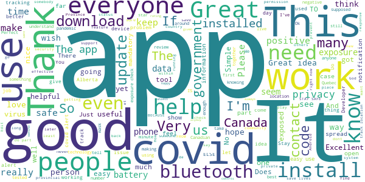
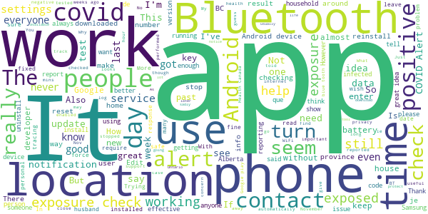

# COVID Alert - Let’s protect each other
App version ``1.1.8``

Analyzed with [covid-apps-observer](http://github.com/covid-apps-observer) project, version ``0.1``

## App overview
| | |
|-------------------------|-------------------------| 
| **Name**&nbsp;&nbsp;&nbsp;&nbsp;&nbsp;&nbsp;&nbsp;&nbsp;&nbsp;&nbsp;&nbsp;&nbsp;&nbsp;&nbsp;&nbsp;&nbsp;&nbsp;&nbsp;&nbsp;&nbsp;&nbsp;&nbsp;&nbsp;&nbsp;&nbsp;&nbsp;&nbsp;&nbsp;&nbsp;&nbsp;&nbsp;&nbsp;&nbsp;&nbsp;&nbsp;&nbsp;&nbsp;&nbsp;&nbsp;&nbsp;  | COVID Alert - Let’s protect each other |
| **Unique identifier** | ca.gc.hcsc.canada.stopcovid |
| **Link to Google Play** | [https://play.google.com/store/apps/details?id=ca.gc.hcsc.canada.stopcovid](https://play.google.com/store/apps/details?id=ca.gc.hcsc.canada.stopcovid) |
| **Summary**  | Health Canada Exposure Notification |
| **Privacy policy** | [https://www.canada.ca/en/public-health/services/diseases/coronavirus-disease-covid-19/covid-alert/privacy-policy.html](https://www.canada.ca/en/public-health/services/diseases/coronavirus-disease-covid-19/covid-alert/privacy-policy.html) |
| **Latest version** | 1.1.8 |
| **Last update** | 2021-01-20 16:05:26 |
| **Recent changes** | * Added ability to notify people of multiple exposures. Before, people could not receive new notifications while in an exposed state.  * Fixed bug that made “You’ve been exposed” notifications less visible when the phone was in use. * Maintenance updates (developers call them “package bumps”) for WorkManager. |
| **Installs**  | 1,000,000+ |
| **Category** | Health & Fitness |
| **First release** | Jul 29, 2020 |
| **Size**  | 42M |
| **Supported Android version**  | 6.0 and up |

### Description
> Together, let’s slow the spread of COVID-19. Canada's COVID Alert app notifies you if someone you were near in the past 14 days tells the app they tested positive.
 COVID Alert uses Bluetooth to exchange random codes with nearby phones. It does not use or access any location data. COVID Alert works by determining how far away other phones are by the strength of their Bluetooth signal. 
 Several times a day, COVID Alert checks a list of codes from people who tell the app they tested positive. You’ll get a notification if a code you received matches one of the positive codes.
 If you test positive for COVID-19 you’ll receive a one-time key with your diagnosis to enter into COVID Alert. The app asks permission to share your random codes from the last 14 days with a central server.
 Other phones using COVID Alert check the central server periodically throughout the day. If they recorded any codes that match the codes in the central server, their user will be notified that they were exposed.
 COVID Alert has no way of knowing:
 -your location - COVID Alert does not use GPS or location services
 -your name or address
 -the place or time you were near someone
 -if you're currently near someone who was previously diagnosed
 Provincial and territorial governments are working to support COVID Alert across Canada. In some places, people cannot yet report a COVID-19 diagnosis through this app.
 It’s still helpful to keep COVID Alert on, no matter where you are.  That way, when people are able to report a diagnosis, you’ll find out if you were near them.
 COVID Alert was built by Health Canada with the Canadian Digital Service on the private exposure notification framework by Apple and Google.

### User interface
The developers of the app provide the following screenshots in the Google play store.
| | | |
|:-------------------------:|:-------------------------:|:-------------------------:|
 |   |   |   | 
 |  

## Development team
In the following we report the main information provided by the development team in the Google play store.

| | |
|-------------------------|-------------------------|
| **Developer**  | Health Canada | Santé Canada |
| **Website**  | [https://www.canada.ca/en/public-health/services/diseases/coronavirus-disease-covid-19/covid-alert/help.html](https://www.canada.ca/en/public-health/services/diseases/coronavirus-disease-covid-19/covid-alert/help.html) |
| **Email** | hc.AlerteCOVIDAlert.sc@canada.ca |
| **Physical address**  | - |
| **Other developed apps**  | [https://play.google.com/store/apps/developer?id=Health+Canada+%7C+Sant%C3%A9+Canada](https://play.google.com/store/apps/developer?id=Health+Canada+%7C+Sant%C3%A9+Canada) |

## Android support

| | |
|-------------------------|-------------------------|
| **Declared target Android version**  | Android10, version 10 (API level 29) |
| **Effective target Android version**  | Android10, version 10 (API level 29) |
| **Minimum supported Android version**  | Marshmallow, version 6.0 (API level 23) |
| **Maximum target Android version**  | - |

The larger the difference between the minimum and maximum supported Android versions, the better. A larger difference means a wider audience. For example, old phones have a very low Android version, so a high minimum supported Android version means that the app cannot be used by users with old phones, thus leading to accessibility problems. 

## Requested permissions

In the following we report the complete list of the permissions requested by the app. 

| **Permission** | **Protection level** | **Description** | 
|-------------------------|-------------------------|-------------------------|
 **android.permission ACCESS_NETWORK_STATE** | Normal | Allows applications to access information about networks. 
 **android.permission ACCESS_WIFI_STATE** | Normal | Allows applications to access information about Wi-Fi networks. 
 **android.permission BLUETOOTH** | Normal | Allows applications to connect to paired bluetooth devices. 
 **android.permission FOREGROUND_SERVICE** | Normal | Allows a regular application to use Service.startForeground. 
 **android.permission GET_TASKS** | Deprecated | This constant was deprecated in API level 21. No longer enforced. 
 **android.permission INTERNET** | Normal | Allows applications to open network sockets. 
 **android.permission RECEIVE_BOOT_COMPLETED** | Normal | Allows an application to receive the Intent.ACTION_BOOT_COMPLETED that is broadcast after the system finishes booting. 
 **android.permission WAKE_LOCK** | Normal | Allows using PowerManager WakeLocks to keep processor from sleeping or screen from dimming. 

## Mentioned servers

| **Server** | **Registrant** | **Registrant country** | **Creation date** | 
|-------------------------|-------------------------|-------------------------|-------------------------|
 | android.com | Google LLC | :us: US | 1997-06-23 04:00:00 |
 | google.com | Google LLC | :us: US | 1997-09-15 04:00:00 |
 | googleapis.com | Google LLC | :us: US | 2005-01-25 17:52:26 |

## Security analysis 

Below we report the main security warnings raised by our execution of the [Androwarn](https://github.com/maaaaz/androwarn) security analysis tool.

**Telephony identifiers leakage**
> - This application reads the numeric name (MCC+MNC) of current registered operator 
> - This application reads the operator name 

**Connection interfaces exfiltration**
> - This application reads details about the currently active data network 
> - This application tries to find out if the currently active data network is metered 

**Suspicious connection establishment**
> - This application opens a Socket and connects it to the remote address '' on the 'N/A' port  
> - This application opens a Socket and connects it to the remote address 'Ljava/lang/StringBuilder;->toString()Ljava/lang/String;' on the ': connect, resolve' port  
> - This application opens a Socket and connects it to the remote address 'Ljava/lang/StringBuilder;->toString()Ljava/lang/String;' on the 'N/A' port  
> - This application opens a Socket and connects it to the remote address 'Ljava/net/Proxy;->type()Ljava/net/Proxy$Type;' on the 'N/A' port  
> - This application opens a Socket and connects it to the remote address 'timeout' on the 'N/A' port  

**Pim data leakage**
> - This application accesses data stored in the clipboard 

**Code execution**
> - This application loads a native library 
> - This application executes a UNIX command 

## User ratings and reviews

Below we provide information about how end users are reacting to the app in terms of ratings and reviews in the Google Play store.

### Ratings

The COVID Alert - Let’s protect each other app has been installed by more than **1000000** times. At this time, **7397** rated the app and its average score is **3.4826202**. Below we show the distribution of the ratings across the usual star-based rating of Google Play

:star::star::star::star::star:: 3620

:star::star::star::star:: 682

:star::star::star:: 692

:star::star:: 455

:star:: 1948

### Reviews 

#### 5-star reviews

> Its good but only works when others have the app too  :date: __2021-01-29 03:55:57__

> I'm very happy knowing that I will be contacted if exposed.  :date: __2021-01-28 12:10:20__

> Great so far, feel more protected already. science and technology!🤘  :date: __2021-01-27 19:36:03__

> I love it  :date: __2021-01-24 10:08:08__

> Lightweight, does not slow my phone down, minimal data collected. Far better to have this in your pocket than not, the more citizens use it, the better it gets.  :date: __2021-01-21 22:02:01__

> Good  :date: __2021-01-21 17:16:48__

> I'm using a four year old bucket droid, does not impact battery. 🤙  :date: __2021-01-21 04:02:28__

> Turning bluetooth off and back on disables the app, at least on my device. I need to open the app and reactivate it manually everytime bluetooth has been disabled momentarily. Edit : Issue was fixed in December update. App works great now.  :date: __2021-01-20 15:36:39__

> I love the fact that our country will work to get virus dealt with, but I will always remember that they were the very people that sent covid 19 onto our Fair planet in the first place.  :date: __2021-01-19 04:57:40__

> Hopefully more people in Ontario install it.  :date: __2021-01-18 01:11:45__

#### 4-star reviews

> Gettting alert  :date: __2021-01-22 14:41:58__

> Samsung S8 Android 9, Covid 1.1.6 Seems to check consistently after changing Settings>apps>special access> optimize battery usage > turn off for Covid alert  :date: __2021-01-19 05:51:10__

> Like many others, I was pretty disappointed to find out that despite what this page says, it DOES require your device GPS/location services to be on. As soon as I turned it off, this app produces a warning that "Covid-19 alert is off". When you turn it on, it says "your phone needs to use Bluetooth to securely collect and share random IDs with other phones...", but then when you click continue, it says, "turn on the device location settings"... "The device location settings needs to be on for Bluetooth to detect nearby devices that have exposure notifications on...." So, no matter what you do, this app requires both Bluetooth AND GPS. Aside from that... we're in a pandemic and there are worse things to worry about, so I still encourage people to use it as it does help save lives and stop Covid.  :date: __2021-01-13 10:25:43__

> Does what it says and protects privacy.. I would however like the option to turn on of off the exposure check notification, I found that more of a peace of mind thing when I did see it.  :date: __2021-01-05 02:30:37__

> I'm glad to have it. But.. it is limited in its use as we can not put it on our older organizations iPhones which we have, numerous model 6. Requires higher iOS version than iPhone 6 supports  :date: __2021-01-02 15:03:58__

> Update #2: The app finally appears to be working properly. Exposure checks are happening 3+ times per day, even without opening the app. Update: I spoke to soon. The showed exposure checks for a few days but stopped on the 28th. After I opened the app the logs showed a dozen or so checks in the last minute, but nothing since then. Is the app just not uploading IDs when it's closed or is it not sending out bluetooth beacons as well? Both situations aren't ideal but the latter is very worrying to me. EDIT: The problem I described below appears to have been fixed. I now see multiple checks per day, even without opening the app. I'm not convinced the app is checking for exposure and/or running in the background. The exposure log (settings->google->covid19->exposure checks) only shows checks after the app is opened. If I don't open the app for days or weeks and check the logs again, the most recent check lines up exactly with the last time the app was opened. I tried uninstalling-reinstalling and saw no change in behaviour. I've read that the app constantly checks for exposure as long as there is internet access but that doesn't seem to be happening on my device.  :date: __2021-01-01 03:24:20__

> Seems to work but the notification that is shown when it's searching for exposures should be disabled by default. With this on, it wakes up the screen and is just annoying. Just tell us if there is an actual exposure detected.  :date: __2020-12-28 23:31:24__

> Feel it gives me a good comfort level. Am 81 and appreciate any help to stay safe. Blessings.  :date: __2020-12-24 22:09:05__

> Finally app is doing constant exposure checks  :date: __2020-12-23 04:15:28__

> It could be very nice, but I am not sure that people testing covid positive really enter a code in the app unfortunately... I never got any alert... I understand how it works but I doubt that there's a lot of people honest enough to enter their code in it for real. That's what I meant.. ;) Thanks!  :date: __2020-12-22 04:05:38__

#### 3-star reviews

> I have been trying to get my one time code for testing positive. It is still not available five days later please help me. I have gone to the Ontario website multiple times. I guessing I am not the only one.  :date: __2021-01-24 01:10:23__

> Not enough people using the app. Have been to various places with outbreak without any notice form the app.  :date: __2021-01-23 07:02:40__

> l have this app on my Android phone, & it works fine. I am very disapointed that the app is still not available 4 my Samsung/Android devices. I would think great effort would be put in2 making sure all mainstream devices are included, 2 help protect everyone from this hideous, life robbing desease! *In response 2 the developer: Samsung IS an Android phone, running Android 10 OS, with Google Play always up 2 date. As 1 of the biggest makers of Android devices, that leaves a lot of people out!  :date: __2021-01-22 21:15:48__

> Would be a lot more effective if it did not require location services to be on. I usually keep location services off to save battery, and forget to turn it on (for this app) when I leave the house.  :date: __2021-01-19 00:05:06__

> Edited: Fixed. To get people to use this is still nearly impossible task and almost most certainly not going to be effective tool in anyway sadly  :date: __2021-01-16 11:41:51__

> This is a great idea.Unfortunately, this app drains my battery very fast. I have a newer phone and my battery usually lasts a day and a half with moderate usage. After two days of having the app, I've had to turn off my location and Bluetooth during my work hours to extend my battery to the end of my day. From 8:00am to 11:00am, my battery dropped from 100% to 80% with very little personal usage. With a newer phone, this shouldn't be happening. Before I installed the app, this was not a problem.  :date: __2021-01-13 01:27:36__

> Great concept. But 2 things...I wish I had known about it sooner...how many people would comply if they knew it existed. More advertising needed. 2...I never use my location data. I don't believe it's safe. This app should be able to work without it when its bluetooth connected. I read other reviews that said the same, and the answer was it should work without it, u just need the newest version. Well I just downloaded today and it wants my location. I'm not comfortable with that.  :date: __2021-01-10 07:38:31__

> I just heard that COVID Alert fails to work in British Columbia, Canada.  :date: __2021-01-06 07:42:45__

> Doesn't work for me, keeps demanding an update to Google play services which doesn't appear valid. Google pixel 2, all updates. Edit: everything was up to date, app and play services. Did a force stop on the app and it's working now.  :date: __2021-01-05 16:49:14__

> With other countries deciding to recycle contact tracing info into other uses, uninstalled as a precaution.  :date: __2021-01-05 15:43:07__

#### 2-star reviews

> I have tried to install this app several times. After I log in, I always get a message that "Something went wrong on our end. Please try again."  :date: __2021-01-23 15:09:21__

> I dont understand how this will ever work of it keeps turning itself off. I check everyday and have to turn the stupid thing back on.  :date: __2021-01-23 00:20:38__

> I no longer have an exposure log in google after recent update. No longer exists to check if the app is checking or not. So I don't know if if the app is working or not. Before the update it checked twice a day. Now ..? I have already said this-reply sent by app developer said to check my exposure log...how when it's not there? I am on Android 11 and app updated few days ago. So now what?  :date: __2021-01-21 21:27:19__

> Would be great to use even without data or wifi so I know who is having symptoms of coronavirus. I need to keep myself safe as I am looking after the elderly and disabled.  :date: __2021-01-19 08:23:37__

> Doesn't work in my province (BC). It has says reporting isn't available in my area since I downloaded this app in 2020. Good concept, but it doesn't work.  :date: __2021-01-19 03:29:40__

> Questionable. I downloaded back in september. I used to get a notification every week with a report, lasted a few weeks. Then i heard you have to check your app every day so it doesnt shut off. I used to be able to check the app in google settings, told me when it last checked, and how many interactions. No more. I dont really know if this app even works. Seems it was made by someone with little knowledge. I keep it running with the hope it is working, but have little faith.  :date: __2021-01-18 22:09:28__

> The app will only notify you of an exposure IF the exposed person puts in his code! And only if you are around for 15 minutes and ONLY when the apps algorithm suspects the individual is contagious....... literally useless, it relies on people to self report which is impossible, no one wants the stigma, additionally there is no scientific established research that it takes 15 minutes for an exposure to deem someone "exposed" it could be 30 seconds or less. Good attempt but bad execution!  :date: __2021-01-11 19:57:18__

> For someone #StayingAtHome, for the last 10 months to limit contacts, this app is of limited value. More money should be spent on helping with contact tracing since that may be more effective at steming the spread of COVID19.  :date: __2021-01-10 17:26:11__

> Just writing a review to report an issue. My phone stopped doing exposure checks 3 days ago (4 Jan 2021). Looks like that coincides with an update. I think something broke. Running on Android 8.0.0  :date: __2021-01-07 20:00:22__

> I see a comment from Dec 30th that the major flaw is that location settings need to be on. The response from the developer is that the user just needs to update the app. I just installed it (Jan 7th) and it is asking for location settings to be on. ...Not sure what the developer means, if I don't turn on the location, the app will not run.  :date: __2021-01-07 18:12:26__

#### 1-star reviews

> I spent 12+ hours in a major metropolitan healthcare setting, with multiple positive individuals around me. Not a single notification. Is it that the app isn't being used by people or, just as likely, is it yet another expensive, useless government project? Either way, it's clearly garbage. App deleted, since it obviously doesn't work as advertised. Edit: Dev's response proves my point. Either it's not being used or it simply does not work.  :date: __2021-01-29 21:46:48__

> An update was done and now I cant login. I put my email in to get a code sent to me and nothing gets sent.  :date: __2021-01-29 14:01:47__

> Useless in Alberta  :date: __2021-01-27 13:48:44__

> Covid doesn't exist so no point  :date: __2021-01-27 02:49:00__

> I thought this app was supposed to alert you of covid cases in your area according to the Canadian government website. Apparently Edmonton Alberta is not in Canada? As the app States it does not work in this area oops I think it's pretty silly that Google Play will only allow you to write a review if you give it a star. I gave it a star but it's fake I don't mean it lol the app waste of space on one's phone if it doesn't work in your own province.  :date: __2021-01-26 23:52:59__

> At first I gave this a five-star review because I think it's extremely important, however, a few people I know have been in contact with somebody who tested positive and all of Ontario's test centers turned them away. What is the point of a tracing app if people who have been in contact with people who have tested positive are not allowed to be tested? This app is essentially useless now. Great job, government. Can't be any more incompetent.  :date: __2021-01-25 17:55:02__

> I fully support the reason for this app. However, what's the point if it won't even do its job? I was standing RIGHT NEXT to someone who was positive for covid and my phone gave me absolutely NO INDICATION that I had been exposed. So what's the use of this app??????  :date: __2021-01-23 21:00:47__

> Covid is a scam  :date: __2021-01-22 08:05:57__

> It's a good app, but it has a major flaw: it depends on people reporting that they have a positive covid test in order for it to work. There are many articles that reported almost no one who has tested positive actually reported on the app. This app is next to useless. Save your storage space  :date: __2021-01-20 00:27:02__

> Why does it need Bluetooth? Doesn't seem to make sense that it would NEED Bluetooth to function and drain battery... Plus it's not even compatible in Coquitlam... 314+ days after pandemic confirmation...  :date: __2021-01-19 19:54:30__

