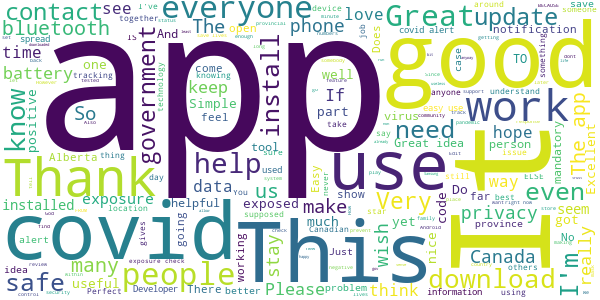
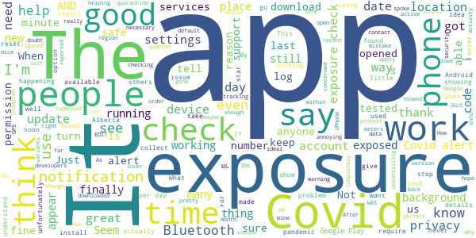
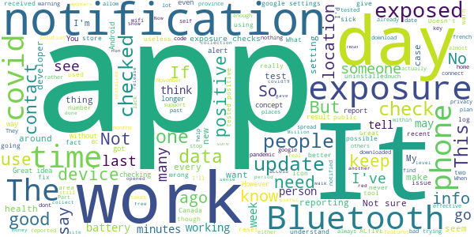
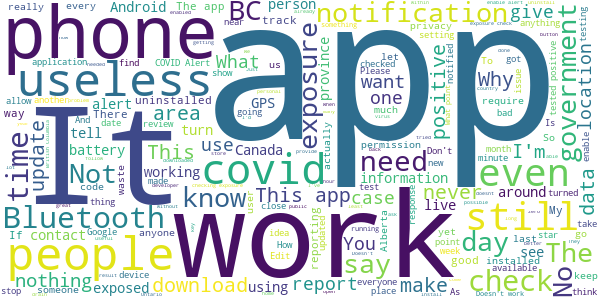

# COVID Alert - Let’s protect each other
App version ``1.2.0``

Analyzed with [covid-apps-observer](http://github.com/covid-apps-observer) project, version ``0.1``

## App overview
| | |
|-------------------------|-------------------------| 
| **Name**                                          | COVID Alert - Let’s protect each other |
| **Unique identifier** | ca.gc.hcsc.canada.stopcovid |
| **Link to Google Play** | [https://play.google.com/store/apps/details?id=ca.gc.hcsc.canada.stopcovid](https://play.google.com/store/apps/details?id=ca.gc.hcsc.canada.stopcovid) |
| **Summary**  | Health Canada Exposure Notification |
| **Privacy policy** | [https://www.canada.ca/en/public-health/services/diseases/coronavirus-disease-covid-19/covid-alert/privacy-policy.html](https://www.canada.ca/en/public-health/services/diseases/coronavirus-disease-covid-19/covid-alert/privacy-policy.html) |
| **Latest version** | 1.2.0 |
| **Last update** | 2021-02-09 15:48:24 |
| **Recent changes** | * Updated to collect some performance metrics to help us improve — while still protecting your privacy. * Added one-time notification to inform people of new metrics being collected and changes to the privacy notice. * Maintenance updates. |
| **Installs**  | 1,000,000+ |
| **Category** | Health & Fitness |
| **First release** | Jul 29, 2020 |
| **Size**  | 43M |
| **Supported Android version**  | 6.0 and up |

### Description
> Together, let’s slow the spread of COVID-19. Canada's COVID Alert app notifies you if someone you were near in the past 14 days tells the app they tested positive.
 COVID Alert uses Bluetooth to exchange random codes with nearby phones. It does not use or access any location data. COVID Alert works by determining how far away other phones are by the strength of their Bluetooth signal. 
 Several times a day, COVID Alert checks a list of codes from people who tell the app they tested positive. You’ll get a notification if a code you received matches one of the positive codes.
 If you test positive for COVID-19 you’ll receive a one-time key with your diagnosis to enter into COVID Alert. The app asks permission to share your random codes from the last 14 days with a central server.
 Other phones using COVID Alert check the central server periodically throughout the day. If they recorded any codes that match the codes in the central server, their user will be notified that they were exposed.
 COVID Alert has no way of knowing:
 -your location - COVID Alert does not use GPS or location services
 -your name or address
 -the place or time you were near someone
 -if you're currently near someone who was previously diagnosed
 Provincial and territorial governments are working to support COVID Alert across Canada. In some places, people cannot yet report a COVID-19 diagnosis through this app.
 It’s still helpful to keep COVID Alert on, no matter where you are.  That way, when people are able to report a diagnosis, you’ll find out if you were near them.
 COVID Alert was built by Health Canada with the Canadian Digital Service on the private exposure notification framework by Apple and Google.

### User interface
The developers of the app provide the following screenshots in the Google play store.
| | | |
|:-------------------------:|:-------------------------:|:-------------------------:|
 |   |   |   | 
 |  

## Development team
In the following we report the main information provided by the development team in the Google play store.

| | |
|-------------------------|-------------------------|
| **Developer**  | Health Canada | Santé Canada |
| **Website**  | [https://www.canada.ca/en/public-health/services/diseases/coronavirus-disease-covid-19/covid-alert/help.html](https://www.canada.ca/en/public-health/services/diseases/coronavirus-disease-covid-19/covid-alert/help.html) |
| **Email** | hc.AlerteCOVIDAlert.sc@canada.ca |
| **Physical address**  | - |
| **Other developed apps**  | [https://play.google.com/store/apps/developer?id=Health+Canada+%7C+Sant%C3%A9+Canada](https://play.google.com/store/apps/developer?id=Health+Canada+%7C+Sant%C3%A9+Canada) |

## Android support

| | |
|-------------------------|-------------------------|
| **Declared target Android version**  | Android10, version 10 (API level 29) |
| **Effective target Android version**  | Android10, version 10 (API level 29) |
| **Minimum supported Android version**  | Marshmallow, version 6.0 (API level 23) |
| **Maximum target Android version**  | - |

The larger the difference between the minimum and maximum supported Android versions, the better. A larger difference means a wider audience. For example, old phones have a very low Android version, so a high minimum supported Android version means that the app cannot be used by users with old phones, thus leading to accessibility problems. 

## Requested permissions

In the following we report the complete list of the permissions requested by the app. 

| **Permission** | **Protection level** | **Description** | 
|-------------------------|-------------------------|-------------------------|
 **android.permission ACCESS_NETWORK_STATE** | Normal | Allows applications to access information about networks. 
 **android.permission ACCESS_WIFI_STATE** | Normal | Allows applications to access information about Wi-Fi networks. 
 **android.permission BLUETOOTH** | Normal | Allows applications to connect to paired bluetooth devices. 
 **android.permission FOREGROUND_SERVICE** | Normal | Allows a regular application to use Service.startForeground. 
 **android.permission GET_TASKS** | Deprecated | This constant was deprecated in API level 21. No longer enforced. 
 **android.permission INTERNET** | Normal | Allows applications to open network sockets. 
 **android.permission RECEIVE_BOOT_COMPLETED** | Normal | Allows an application to receive the Intent.ACTION_BOOT_COMPLETED that is broadcast after the system finishes booting. 
 **android.permission WAKE_LOCK** | Normal | Allows using PowerManager WakeLocks to keep processor from sleeping or screen from dimming. 

## Mentioned servers

| **Server** | **Registrant** | **Registrant country** | **Creation date** | 
|-------------------------|-------------------------|-------------------------|-------------------------|
 | android.com | Google LLC | :us: US | 1997-06-23 04:00:00 |
 | google.com | Google LLC | :us: US | 1997-09-15 04:00:00 |
 | googleapis.com | Google LLC | :us: US | 2005-01-25 17:52:26 |

## Security analysis 

Below we report the main security warnings raised by our execution of the [Androwarn](https://github.com/maaaaz/androwarn) security analysis tool.

**Telephony identifiers leakage**
> - This application reads the numeric name (MCC+MNC) of current registered operator 
> - This application reads the operator name 

**Connection interfaces exfiltration**
> - This application reads details about the currently active data network 
> - This application tries to find out if the currently active data network is metered 

**Suspicious connection establishment**
> - This application opens a Socket and connects it to the remote address '' on the 'N/A' port  
> - This application opens a Socket and connects it to the remote address 'Ljava/lang/StringBuilder;->toString()Ljava/lang/String;' on the ': connect, resolve' port  
> - This application opens a Socket and connects it to the remote address 'Ljava/lang/StringBuilder;->toString()Ljava/lang/String;' on the 'N/A' port  
> - This application opens a Socket and connects it to the remote address 'Ljava/net/Proxy;->type()Ljava/net/Proxy$Type;' on the 'N/A' port  
> - This application opens a Socket and connects it to the remote address 'timeout' on the 'N/A' port  

**Pim data leakage**
> - This application accesses data stored in the clipboard 

**Code execution**
> - This application loads a native library 
> - This application executes a UNIX command 

## User ratings and reviews

Below we provide information about how end users are reacting to the app in terms of ratings and reviews in the Google Play store.

### Ratings

The COVID Alert - Let’s protect each other app has been installed by more than **1000000** times. At this time, **7608** rated the app and its average score is **3.5377605**. Below we show the distribution of the ratings across the usual star-based rating of Google Play

:star::star::star::star::star:: 3795

:star::star::star::star:: 822

:star::star::star:: 584

:star::star:: 495

:star:: 1912

### Reviews 

#### 5-star reviews

> Works very well I like it  :date: __2021-02-13 19:52:47__

> Download it , it'll save your life.  :date: __2021-02-12 10:05:26__

> Unfortunately my incompetent premiere can't rub 2 braincells together to allow this in alberta.  :date: __2021-02-11 06:43:10__

> Well thats so good for everyone,ever1 should have this app😊😊👅  :date: __2021-02-10 21:10:38__

> Useless if you're in a province who hasn't adopted the app. However the app itself is good, with strong privacy controls that would be nice to see in other apps on the store - Thanks Gov of Canada. Now, British Columbia and other non adopted provinces ------ get your s\*\*t together so we can use this.  :date: __2021-02-09 22:15:29__

> I find it is a great app to have makes you feel reassured that no one is close to you with the virus!  :date: __2021-02-03 17:59:40__

> The dawyne Johnson rock  :date: __2021-02-03 16:39:50__

> Perfect app  :date: __2021-02-02 18:09:01__

> easy  :date: __2021-02-02 00:51:18__

> Seems to work. Never been exposed yet anyway.  :date: __2021-02-01 16:50:05__

#### 4-star reviews

> I downloaded this app by mistake And downloaded self isolation form by mistake how to rectify it i am completely fine with no symptoms even i never came in touch with anyone just doing quarantine for 14 days i do have arrive can app only  :date: __2021-02-13 06:38:54__

> Samsung S8 Android 9, Covid 1.1.8 Seems to check consistently after changing Settings>apps>special access> optimize battery usage > turn off for Covid alert  :date: __2021-02-01 02:07:00__

> Gettting alert  :date: __2021-01-22 14:41:58__

> Like many others, I was pretty disappointed to find out that despite what this page says, it DOES require your device GPS/location services to be on. As soon as I turned it off, this app produces a warning that "Covid-19 alert is off". When you turn it on, it says "your phone needs to use Bluetooth to securely collect and share random IDs with other phones...", but then when you click continue, it says, "turn on the device location settings"... "The device location settings needs to be on for Bluetooth to detect nearby devices that have exposure notifications on...." So, no matter what you do, this app requires both Bluetooth AND GPS. Aside from that... we're in a pandemic and there are worse things to worry about, so I still encourage people to use it as it does help save lives and stop Covid.  :date: __2021-01-13 10:25:43__

> Does what it says and protects privacy.. I would however like the option to turn on of off the exposure check notification, I found that more of a peace of mind thing when I did see it.  :date: __2021-01-05 02:30:37__

> I'm glad to have it. But.. it is limited in its use as we can not put it on our older organizations iPhones which we have, numerous model 6. Requires higher iOS version than iPhone 6 supports  :date: __2021-01-02 15:03:58__

> Update #2: The app finally appears to be working properly. Exposure checks are happening 3+ times per day, even without opening the app. Update: I spoke to soon. The showed exposure checks for a few days but stopped on the 28th. After I opened the app the logs showed a dozen or so checks in the last minute, but nothing since then. Is the app just not uploading IDs when it's closed or is it not sending out bluetooth beacons as well? Both situations aren't ideal but the latter is very worrying to me. EDIT: The problem I described below appears to have been fixed. I now see multiple checks per day, even without opening the app. I'm not convinced the app is checking for exposure and/or running in the background. The exposure log (settings->google->covid19->exposure checks) only shows checks after the app is opened. If I don't open the app for days or weeks and check the logs again, the most recent check lines up exactly with the last time the app was opened. I tried uninstalling-reinstalling and saw no change in behaviour. I've read that the app constantly checks for exposure as long as there is internet access but that doesn't seem to be happening on my device.  :date: __2021-01-01 03:24:20__

> Seems to work but the notification that is shown when it's searching for exposures should be disabled by default. With this on, it wakes up the screen and is just annoying. Just tell us if there is an actual exposure detected.  :date: __2020-12-28 23:31:24__

> Feel it gives me a good comfort level. Am 81 and appreciate any help to stay safe. Blessings.  :date: __2020-12-24 22:09:05__

> Finally app is doing constant exposure checks  :date: __2020-12-23 04:15:28__

#### 3-star reviews

> I've been using this app since it was released. I have to be on wifi or my data for it to do its job. I commute on public transit 45 mins-hour a day. Sometimes I don't pull out my phone to turn on my data and I don't want to run out of data before my bill cycle resets. I look after the elderly.  :date: __2021-02-12 18:52:33__

> The app is fine on my Samsung A10 but I can't download it to my husband's Samsung 4 which is an older model Android. Is there a version that will work with this phone?????  :date: __2021-02-06 08:16:15__

> 22s  :date: __2021-01-30 16:22:45__

> I have been trying to get my one time code for testing positive. It is still not available five days later please help me. I have gone to the Ontario website multiple times. I guessing I am not the only one.  :date: __2021-01-24 01:10:23__

> Not enough people using the app. Have been to various places with outbreak without any notice form the app.  :date: __2021-01-23 07:02:40__

> l have this app on my Android phone, & it works fine. I am very disapointed that the app is still not available 4 my Samsung/Android devices. I would think great effort would be put in2 making sure all mainstream devices are included, 2 help protect everyone from this hideous, life robbing desease! *In response 2 the developer: Samsung IS an Android phone, running Android 10 OS, with Google Play always up 2 date. As 1 of the biggest makers of Android devices, that leaves a lot of people out!  :date: __2021-01-22 21:15:48__

> Would be a lot more effective if it did not require location services to be on. I usually keep location services off to save battery, and forget to turn it on (for this app) when I leave the house.  :date: __2021-01-19 00:05:06__

> Edited: Fixed. To get people to use this is still nearly impossible task and almost most certainly not going to be effective tool in anyway sadly  :date: __2021-01-16 11:41:51__

> This is a great idea.Unfortunately, this app drains my battery very fast. I have a newer phone and my battery usually lasts a day and a half with moderate usage. After two days of having the app, I've had to turn off my location and Bluetooth during my work hours to extend my battery to the end of my day. From 8:00am to 11:00am, my battery dropped from 100% to 80% with very little personal usage. With a newer phone, this shouldn't be happening. Before I installed the app, this was not a problem.  :date: __2021-01-13 01:27:36__

> Great concept. But 2 things...I wish I had known about it sooner...how many people would comply if they knew it existed. More advertising needed. 2...I never use my location data. I don't believe it's safe. This app should be able to work without it when its bluetooth connected. I read other reviews that said the same, and the answer was it should work without it, u just need the newest version. Well I just downloaded today and it wants my location. I'm not comfortable with that.  :date: __2021-01-10 07:38:31__

#### 2-star reviews

> 1. Don't want to have location on all the time just for this app. My phone, along with many others, can't update to Android 11. 2. Without the app it's 14 days isolation from last contact with a positive case. With the app it's 14 days *from the date you received the notification*. See saskatchewan.ca/covid19-apps . If the website is wrong, get them to fix it. 3. Now the app is collecting a lot more data. They say it isn't tied to your IP but how can you know for sure?  :date: __2021-02-12 16:03:16__

> Since the decisions to centrally collect metadata, I am no longer comfortable having the app installed on my device.  :date: __2021-02-11 20:55:40__

> It doesn't work on my phone:(  :date: __2021-02-09 02:32:45__

> Zero, but gave it a 2 for effort. It would be great to see the statistics on the number of events transpired, and if this has done anything or is just another waste of money. Thinking its the latter? Who is going to log in, as exposed, then go out for a walk to a crowded area? Million downloads? Hmmm.  :date: __2021-02-07 16:46:01__

> I support the idea of this app but I don't beleive it works. What use is it if nobody whom has received a positive test result shares this with the app? I have been very near to multiple cases over the past 2 months due to an outbreak at work and I've not had a single alert to this fact from this app. Clearly none of those cases were reported. I would be interested in knowing how many positive cases have been documented in my area vs how many were self-reported to this app.  :date: __2021-02-07 12:18:08__

> Battery Hog. I want to use it but my phone just dies to quickly  :date: __2021-02-04 19:12:56__

> I have tried to install this app several times. After I log in, I always get a message that "Something went wrong on our end. Please try again."  :date: __2021-01-23 15:09:21__

> I dont understand how this will ever work of it keeps turning itself off. I check everyday and have to turn the stupid thing back on.  :date: __2021-01-23 00:20:38__

> I no longer have an exposure log in google after recent update. No longer exists to check if the app is checking or not. So I don't know if if the app is working or not. Before the update it checked twice a day. Now ..? I have already said this-reply sent by app developer said to check my exposure log...how when it's not there? I am on Android 11 and app updated few days ago. So now what?  :date: __2021-01-21 21:27:19__

> Would be great to use even without data or wifi so I know who is having symptoms of coronavirus. I need to keep myself safe as I am looking after the elderly and disabled.  :date: __2021-01-19 08:23:37__

#### 1-star reviews

> Collecting metrics and privacy does not compute.  :date: __2021-02-13 19:55:55__

> I have been completely unable to turn on any exposure notifications. I have gone through every option in the help menu and nothing works. I tap "enable" and nothing happens. Why? There's no clear explanation as to why... I have a Chinese-made phone and that's the only thing I can think would prevent it from working.  :date: __2021-02-13 17:29:03__

> does this app work with an iPhone 6? seems like it doesn't, as my partner's iPhone 6 has iOS 12.1.2, this app (in the Apple world) says it needs iOS 14, and after repeatedly trying to update the ios being told can't update on this phone...so, if this is so, why isn't the app made to be more universal, in other words, backwards compatible?  :date: __2021-02-13 14:12:16__

> The government has dropped the ball on covid.  :date: __2021-02-13 07:19:35__

> Would give it zero stars if possible  :date: __2021-02-13 00:23:51__

> I don't allow Bluetooth access. I also don't allow nearby phone access. That's highly dangerous for hackers to get information.  :date: __2021-02-13 00:14:39__

> What an absolute joke of an app  :date: __2021-02-12 22:57:09__

> It keeps telling me to update Google play services, but it won't load to let me do that.  :date: __2021-02-12 21:42:21__

> Useless in BC  :date: __2021-02-12 21:10:39__

> Now that the app collects more data and is less private, I will unfortunately have to uninstall it. Too bad, it was well done before. I'll remove it and maybe check into the data details again later. Just saying "while still maintaining your privacy" while they have access to my IP address on a central server is not good enough.  :date: __2021-02-12 14:19:54__

