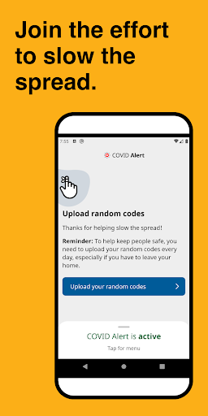
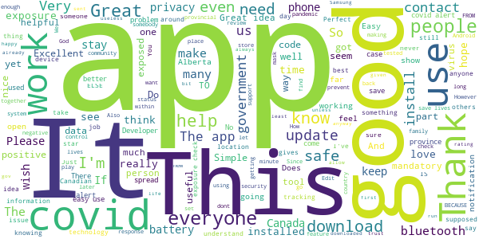
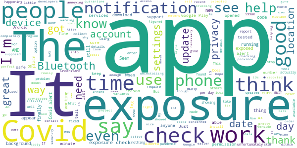
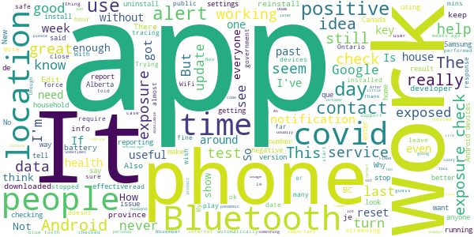
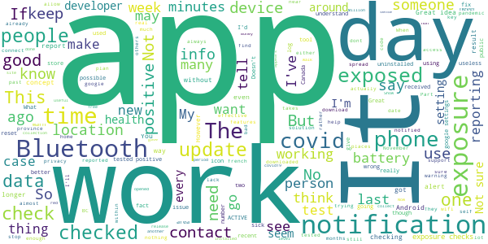
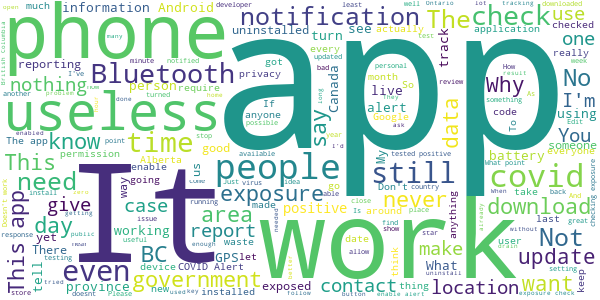

# COVID Alert - Let’s protect each other
App version ``1.2.1``

Analyzed with [covid-apps-observer](http://github.com/covid-apps-observer) project, version ``0.1``

## App overview
| | |
|-------------------------|-------------------------| 
| **Name**&nbsp;&nbsp;&nbsp;&nbsp;&nbsp;&nbsp;&nbsp;&nbsp;&nbsp;&nbsp;&nbsp;&nbsp;&nbsp;&nbsp;&nbsp;&nbsp;&nbsp;&nbsp;&nbsp;&nbsp;&nbsp;&nbsp;&nbsp;&nbsp;&nbsp;&nbsp;&nbsp;&nbsp;&nbsp;&nbsp;&nbsp;&nbsp;&nbsp;&nbsp;&nbsp;&nbsp;&nbsp;&nbsp;&nbsp;&nbsp;  | COVID Alert - Let’s protect each other |
| **Unique identifier** | ca.gc.hcsc.canada.stopcovid |
| **Link to Google Play** | [https://play.google.com/store/apps/details?id=ca.gc.hcsc.canada.stopcovid](https://play.google.com/store/apps/details?id=ca.gc.hcsc.canada.stopcovid) |
| **Summary**  | Health Canada Exposure Notification |
| **Privacy policy** | [https://www.canada.ca/en/public-health/services/diseases/coronavirus-disease-covid-19/covid-alert/privacy-policy.html](https://www.canada.ca/en/public-health/services/diseases/coronavirus-disease-covid-19/covid-alert/privacy-policy.html) |
| **Latest version** | 1.2.1 |
| **Last update** | 2021-02-26 18:04:50 |
| **Recent changes** | - Improving how often the app communicates with the server. |
| **Installs**  | 1,000,000+ |
| **Category** | Health & Fitness |
| **First release** | Jul 29, 2020 |
| **Size**  | 44M |
| **Supported Android version**  | 6.0 and up |

### Description
> Together, let’s slow the spread of COVID-19. Canada's COVID Alert app notifies you if someone you were near in the past 14 days tells the app they tested positive.
 COVID Alert uses Bluetooth to exchange random codes with nearby phones. It does not use or access any location data. COVID Alert works by determining how far away other phones are by the strength of their Bluetooth signal. 
 Several times a day, COVID Alert checks a list of codes from people who tell the app they tested positive. You’ll get a notification if a code you received matches one of the positive codes.
 If you test positive for COVID-19 you’ll receive a one-time key with your diagnosis to enter into COVID Alert. The app asks permission to share your random codes from the last 14 days with a central server.
 Other phones using COVID Alert check the central server periodically throughout the day. If they recorded any codes that match the codes in the central server, their user will be notified that they were exposed.
 COVID Alert has no way of knowing:
 -your location - COVID Alert does not use GPS or location services
 -your name or address
 -the place or time you were near someone
 -if you're currently near someone who was previously diagnosed
 Provincial and territorial governments are working to support COVID Alert across Canada. In some places, people cannot yet report a COVID-19 diagnosis through this app.
 It’s still helpful to keep COVID Alert on, no matter where you are.  That way, when people are able to report a diagnosis, you’ll find out if you were near them.
 COVID Alert was built by Health Canada with the Canadian Digital Service on the private exposure notification framework by Apple and Google.

### User interface
The developers of the app provide the following screenshots in the Google play store.
| | | |
|:-------------------------:|:-------------------------:|:-------------------------:|
 |   |   |   | 
 |  

## Development team
In the following we report the main information provided by the development team in the Google play store.

| | |
|-------------------------|-------------------------|
| **Developer**  | Health Canada | Santé Canada |
| **Website**  | [https://www.canada.ca/en/public-health/services/diseases/coronavirus-disease-covid-19/covid-alert/help.html](https://www.canada.ca/en/public-health/services/diseases/coronavirus-disease-covid-19/covid-alert/help.html) |
| **Email** | hc.AlerteCOVIDAlert.sc@canada.ca |
| **Physical address**  | - |
| **Other developed apps**  | [https://play.google.com/store/apps/developer?id=Health+Canada+%7C+Sant%C3%A9+Canada](https://play.google.com/store/apps/developer?id=Health+Canada+%7C+Sant%C3%A9+Canada) |

## Android support

| | |
|-------------------------|-------------------------|
| **Declared target Android version**  | Android10, version 10 (API level 29) |
| **Effective target Android version**  | Android10, version 10 (API level 29) |
| **Minimum supported Android version**  | Marshmallow, version 6.0 (API level 23) |
| **Maximum target Android version**  | - |

The larger the difference between the minimum and maximum supported Android versions, the better. A larger difference means a wider audience. For example, old phones have a very low Android version, so a high minimum supported Android version means that the app cannot be used by users with old phones, thus leading to accessibility problems. 

## Requested permissions

In the following we report the complete list of the permissions requested by the app. 

| **Permission** | **Protection level** | **Description** | 
|-------------------------|-------------------------|-------------------------|
 **android.permission ACCESS_NETWORK_STATE** | Normal | Allows applications to access information about networks. 
 **android.permission ACCESS_WIFI_STATE** | Normal | Allows applications to access information about Wi-Fi networks. 
 **android.permission BLUETOOTH** | Normal | Allows applications to connect to paired bluetooth devices. 
 **android.permission FOREGROUND_SERVICE** | Normal | Allows a regular application to use Service.startForeground. 
 **android.permission GET_TASKS** | Deprecated | This constant was deprecated in API level 21. No longer enforced. 
 **android.permission INTERNET** | Normal | Allows applications to open network sockets. 
 **android.permission RECEIVE_BOOT_COMPLETED** | Normal | Allows an application to receive the Intent.ACTION_BOOT_COMPLETED that is broadcast after the system finishes booting. 
 **android.permission WAKE_LOCK** | Normal | Allows using PowerManager WakeLocks to keep processor from sleeping or screen from dimming. 

## Mentioned servers

| **Server** | **Registrant** | **Registrant country** | **Creation date** | 
|-------------------------|-------------------------|-------------------------|-------------------------|
 | android.com | Google LLC | :us: US | 1997-06-23 04:00:00 |
 | google.com | Google LLC | :us: US | 1997-09-15 04:00:00 |
 | googleapis.com | Google LLC | :us: US | 2005-01-25 17:52:26 |

## Security analysis 

Below we report the main security warnings raised by our execution of the [Androwarn](https://github.com/maaaaz/androwarn) security analysis tool.

**Telephony identifiers leakage**
> - This application reads the numeric name (MCC+MNC) of current registered operator 
> - This application reads the operator name 

**Connection interfaces exfiltration**
> - This application reads details about the currently active data network 
> - This application tries to find out if the currently active data network is metered 

**Suspicious connection establishment**
> - This application opens a Socket and connects it to the remote address '' on the 'N/A' port  
> - This application opens a Socket and connects it to the remote address 'Ljava/lang/StringBuilder;->toString()Ljava/lang/String;' on the ': connect, resolve' port  
> - This application opens a Socket and connects it to the remote address 'Ljava/lang/StringBuilder;->toString()Ljava/lang/String;' on the 'N/A' port  
> - This application opens a Socket and connects it to the remote address 'Ljava/net/Proxy;->type()Ljava/net/Proxy$Type;' on the 'N/A' port  
> - This application opens a Socket and connects it to the remote address 'timeout' on the 'N/A' port  

**Pim data leakage**
> - This application accesses data stored in the clipboard 

**Code execution**
> - This application loads a native library 
> - This application loads a native library: 'Ljava/lang/String;->valueOf(Ljava/lang/Object;)Ljava/lang/String;' 
> - This application executes a UNIX command 

## User ratings and reviews

Below we provide information about how end users are reacting to the app in terms of ratings and reviews in the Google Play store.

### Ratings

The COVID Alert - Let’s protect each other app has been installed by more than **1000000** times. At this time, **7503** rated the app and its average score is **3.4794157**. Below we show the distribution of the ratings across the usual star-based rating of Google Play

:star::star::star::star::star:: 3677

:star::star::star::star:: 747

:star::star::star:: 548

:star::star:: 558

:star:: 1973

### Reviews 

#### 5-star reviews

> App does what it says it'll do. I wish it was mandatory for everyone to download. Otherwise I'd be more trusting of the "have not come in contact with anyone reported with covid in the app". Also to those complaining about the gov data collecting: trust me, they gov already has all the dirt on you already. They don't care what you're doing with your family for your birthday Susan. Get a grip.  :date: __2021-02-23 18:09:01__

> Since l downloaded this app has been working good  :date: __2021-02-23 01:58:31__

> Taking a long time to make fonts of the app a bit more to read ?  :date: __2021-02-21 10:44:19__

> Awesome  :date: __2021-02-20 09:22:01__

> Update - Thanks for the prompt reply. Hope this helps others stay notified and safe. / Original Post - I do not believe this app is working correctly. It was automaticlly set as a sleeping app on my Samsung phone. Sleeping apps won't run in the backgroud. This does not make sense.  :date: __2021-02-18 21:50:46__

> Works as described  :date: __2021-02-17 05:24:29__

> Very much appreciated  :date: __2021-02-15 14:49:38__

> Works very well I like it  :date: __2021-02-13 19:52:47__

> Download it , it'll save your life.  :date: __2021-02-12 10:05:26__

> Unfortunately my incompetent premiere can't rub 2 braincells together to allow this in alberta.  :date: __2021-02-11 06:43:10__

#### 4-star reviews

> It's a good option to have  :date: __2021-02-21 03:52:48__

> I like this app and think it is a necessary tool in our fight against Covid. However I am concerned that it hasn't been updated yet to take into account the new variants. 2 meters for 15 minutes doesn't seem safe anymore. I want to know whether I was 5 minutes within a 3 m distance of someone infected (or whatever parameters health authorities think would be precautionary taking into account the new variants).  :date: __2021-02-18 04:17:26__

> Did as you recommended. Force quit the app then restarted! The annoying number 1 gone! Thank you so much for your help! I truly think this is a wonderful addition in helping to combat this pandemic. I hope more people download it. :)  :date: __2021-02-18 01:27:22__

> Idk if this even works  :date: __2021-02-16 23:43:32__

> The way it says that it collects the data, it won't be able to notify you of an exposure as it's happening, mainly due to the careful way they have to apply the tracking tech in order to sustain your privacy, or people get upset. It can only tell you once it has been able to calculate exposure within 2 meters for 15 minutes, and it can't know that until it determines if it WAS during the contagious timeline, which isn't known until that data has been accurately reported by the cantagious patient  :date: __2021-02-16 12:36:52__

> I downloaded this app by mistake And downloaded self isolation form by mistake how to rectify it i am completely fine with no symptoms even i never came in touch with anyone just doing quarantine for 14 days i do have arrive can app only  :date: __2021-02-13 06:38:54__

> Samsung S8 Android 9, Covid 1.1.8 Seems to check consistently after changing Settings>apps>special access> optimize battery usage > turn off for Covid alert  :date: __2021-02-01 02:07:00__

> Gettting alert  :date: __2021-01-22 14:41:58__

> Like many others, I was pretty disappointed to find out that despite what this page says, it DOES require your device GPS/location services to be on. As soon as I turned it off, this app produces a warning that "Covid-19 alert is off". When you turn it on, it says "your phone needs to use Bluetooth to securely collect and share random IDs with other phones...", but then when you click continue, it says, "turn on the device location settings"... "The device location settings needs to be on for Bluetooth to detect nearby devices that have exposure notifications on...." So, no matter what you do, this app requires both Bluetooth AND GPS. Aside from that... we're in a pandemic and there are worse things to worry about, so I still encourage people to use it as it does help save lives and stop Covid.  :date: __2021-01-13 10:25:43__

> Does what it says and protects privacy.. I would however like the option to turn on of off the exposure check notification, I found that more of a peace of mind thing when I did see it.  :date: __2021-01-05 02:30:37__

#### 3-star reviews

> Stopped working from October to January. Kind of pointless if it doesn't work.  :date: __2021-02-26 23:04:27__

> My understanding is that THIS app is for Canadians? How come america doesnt have something like it?  :date: __2021-02-25 03:03:04__

> Government starts to use online screening before entering the mall in Ontario. Why not wisely to add the screening in this app and encourage more people to use this. Plus it is waste of time to ask people enter the code in the app IF they test positive. This app should link with the health card system, if they have covid test, it will show on here both negative n positive. So far, I don't see how useful this app is. But it can be useful if add more things in it.  :date: __2021-02-24 14:03:28__

> I'm pretty sure I was vacinated  :date: __2021-02-24 06:14:48__

> The idea of the app is ok, however I think an option that detects home location or to set it to home so it's not constantly using bluetooth would be useful. No houses are close enough to each other here to detect each other's bluetooth. Personally I'm rarely around people without the pandemic and only need it to be on when out.  :date: __2021-02-18 17:23:38__

> I've been using this app since it was released. I have to be on wifi or my data for it to do its job. I commute on public transit 45 mins-hour a day. Sometimes I don't pull out my phone to turn on my data and I don't want to run out of data before my bill cycle resets. I look after the elderly.  :date: __2021-02-12 18:52:33__

> The app is fine on my Samsung A10 but I can't download it to my husband's Samsung 4 which is an older model Android. Is there a version that will work with this phone?????  :date: __2021-02-06 08:16:15__

> 22s  :date: __2021-01-30 16:22:45__

> I have been trying to get my one time code for testing positive. It is still not available five days later please help me. I have gone to the Ontario website multiple times. I guessing I am not the only one.  :date: __2021-01-24 01:10:23__

> Not enough people using the app. Have been to various places with outbreak without any notice form the app.  :date: __2021-01-23 07:02:40__

#### 2-star reviews

> Great idea, but only 5 people in Canada are using it. Canada doesn't know how to reach out to its masses and connect with them on a personal level  :date: __2021-02-23 01:23:19__

> Not sure how useful this app is... This app is like the notorious pet rock - either does nothing or appears to do nothing. It would give a better sense of reliability if it reported to me how many other unique devices my phone came in the vicinity of and how many devices are reporting in the preceeding 24h period in my province / city. This app is worse than useless if I am the only one using it in all of Ontario. I'd rather free up space & release the processing power that this app is wasting.  :date: __2021-02-18 18:06:07__

> A few things need to change: 1) Allow opt-out of data collection 2) Make all non-exposure notification icons grey. Having a red icon pop up on a regular notification is startling. 3) Show relevant info when tapping a notification about new features. I tapped the one about data collection expecting an explanation but it just opened the app, I had to go to the gov't site and find that info myself.  :date: __2021-02-18 06:17:09__

> 1. Don't want to have location on all the time just for this app. My phone, along with many others, can't update to Android 11. 2. Without the app it's 14 days isolation from last contact with a positive case. With the app it's 14 days *from the date you received the notification*. See saskatchewan.ca/covid19-apps . If the website is wrong, get them to fix it. 3. Now the app is collecting a lot more data. They say it isn't tied to your IP but how can you know for sure?  :date: __2021-02-12 16:03:16__

> Since the decisions to centrally collect metadata, I am no longer comfortable having the app installed on my device.  :date: __2021-02-11 20:55:40__

> It doesn't work on my phone:(  :date: __2021-02-09 02:32:45__

> Zero, but gave it a 2 for effort. It would be great to see the statistics on the number of events transpired, and if this has done anything or is just another waste of money. Thinking its the latter? Who is going to log in, as exposed, then go out for a walk to a crowded area? Million downloads? Hmmm.  :date: __2021-02-07 16:46:01__

> I support the idea of this app but I don't beleive it works. What use is it if nobody whom has received a positive test result shares this with the app? I have been very near to multiple cases over the past 2 months due to an outbreak at work and I've not had a single alert to this fact from this app. Clearly none of those cases were reported. I would be interested in knowing how many positive cases have been documented in my area vs how many were self-reported to this app.  :date: __2021-02-07 12:18:08__

> Battery Hog. I want to use it but my phone just dies to quickly  :date: __2021-02-04 19:12:56__

> I have tried to install this app several times. After I log in, I always get a message that "Something went wrong on our end. Please try again."  :date: __2021-01-23 15:09:21__

#### 1-star reviews

> Not super useful, since despite the ads on TV in our area/local stations, it's apparently not usable in our Province. Which seems silly given the rises in cases the past few months, as well as the numbers of people going against public health out here.  :date: __2021-02-27 06:08:50__

> Tracking device. Our dictator and some of Castro, Trudeau wants us to all use these apps and the new bracelets so he can track us like a true dictator would. With this app being out, I now refuse to wear my mask. Don't listen to that evil man in charge! He is only out to take full control after he fills our country with violent criminals from Syria  :date: __2021-02-26 17:15:40__

> It has been a year since covid hit Vancouver. I cannot believe that there is "no coverage" in the tricities yet. I don't see any timeframe for my jurisdiction.  :date: __2021-02-26 12:49:01__

> Not useful if everyone isn't using it.  :date: __2021-02-25 19:12:04__

> Alert only after 15 minutes of exposure. Should warn of even 1 minute exposure.  :date: __2021-02-25 03:07:40__

> Not helping you fix this app you can hire developers for that one. I don't think the Bluetooth scanning doesn't work well and eats battery.  :date: __2021-02-25 01:41:36__

> App developers have still not improved the software enough to be used in BC. Issues known since October 2020  :date: __2021-02-24 16:45:48__

> Collecting data now. Not welcome  :date: __2021-02-23 13:56:02__

> Not accurate, damnedi f you do and dammed if you don't. I want to keep this installed but lost faith in the accuracy.  :date: __2021-02-23 03:13:14__

> I can't believe that the premier of British Columbia still can't get this after work. It's one year later we're still in lockdown and John Horgan can't provide enough data? How can we consider Canada to be an advanced Nation if we can't even use the same app around the country? Absolutely pathetic  :date: __2021-02-22 06:13:47__

