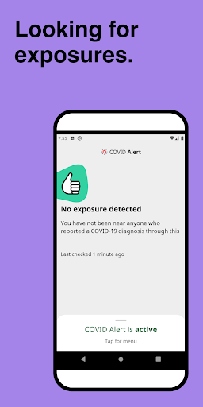

# COVID Alert - Let’s protect each other
App version ``1.2.4``

Analyzed with [covid-apps-observer](http://github.com/covid-apps-observer) project, version ``0.1``

## App overview
| | |
|-------------------------|-------------------------| 
| **Name**&nbsp;&nbsp;&nbsp;&nbsp;&nbsp;&nbsp;&nbsp;&nbsp;&nbsp;&nbsp;&nbsp;&nbsp;&nbsp;&nbsp;&nbsp;&nbsp;&nbsp;&nbsp;&nbsp;&nbsp;&nbsp;&nbsp;&nbsp;&nbsp;&nbsp;&nbsp;&nbsp;&nbsp;&nbsp;&nbsp;&nbsp;&nbsp;&nbsp;&nbsp;&nbsp;&nbsp;&nbsp;&nbsp;&nbsp;&nbsp;  | COVID Alert - Let’s protect each other |
| **Unique identifier** | ca.gc.hcsc.canada.stopcovid |
| **Link to Google Play** | [https://play.google.com/store/apps/details?id=ca.gc.hcsc.canada.stopcovid](https://play.google.com/store/apps/details?id=ca.gc.hcsc.canada.stopcovid) |
| **Summary**  | Health Canada Exposure Notification |
| **Privacy policy** | [https://www.canada.ca/en/public-health/services/diseases/coronavirus-disease-covid-19/covid-alert/privacy-policy.html](https://www.canada.ca/en/public-health/services/diseases/coronavirus-disease-covid-19/covid-alert/privacy-policy.html) |
| **Latest version** | 1.2.4 |
| **Last update** | 2021-03-25 21:30:59 |
| **Recent changes** | - Improved accessibility of the Menu button when using zoom features. - Maintenance updates. |
| **Installs**  | 1,000,000+ |
| **Category** | Health & Fitness |
| **First release** | Jul 29, 2020 |
| **Size**  | 52M |
| **Supported Android version**  | 6.0 and up |

### Description
> Together, let’s slow the spread of COVID-19. Canada's COVID Alert app notifies you if someone you were near in the past 14 days tells the app they tested positive.
 COVID Alert uses Bluetooth to exchange random codes with nearby phones. It does not use or access any location data. COVID Alert works by determining how far away other phones are by the strength of their Bluetooth signal. 
 Several times a day, COVID Alert checks a list of codes from people who tell the app they tested positive. You’ll get a notification if a code you received matches one of the positive codes.
 If you test positive for COVID-19 you’ll receive a one-time key with your diagnosis to enter into COVID Alert. The app asks permission to share your random codes from the last 14 days with a central server.
 Other phones using COVID Alert check the central server periodically throughout the day. If they recorded any codes that match the codes in the central server, their user will be notified that they were exposed.
 COVID Alert has no way of knowing:
 -your location - COVID Alert does not use GPS or location services
 -your name or address
 -the place or time you were near someone
 -if you're currently near someone who was previously diagnosed
 Provincial and territorial governments are working to support COVID Alert across Canada. In some places, people cannot yet report a COVID-19 diagnosis through this app.
 It’s still helpful to keep COVID Alert on, no matter where you are.  That way, when people are able to report a diagnosis, you’ll find out if you were near them.
 COVID Alert was built by Health Canada with the Canadian Digital Service on the private exposure notification framework by Apple and Google.

### User interface
The developers of the app provide the following screenshots in the Google play store.
| | | |
|:-------------------------:|:-------------------------:|:-------------------------:|
 |   |   |   | 
 |  

## Development team
In the following we report the main information provided by the development team in the Google play store.

| | |
|-------------------------|-------------------------|
| **Developer**  | Health Canada | Santé Canada |
| **Website**  | [https://www.canada.ca/en/public-health/services/diseases/coronavirus-disease-covid-19/covid-alert/help.html](https://www.canada.ca/en/public-health/services/diseases/coronavirus-disease-covid-19/covid-alert/help.html) |
| **Email** | hc.AlerteCOVIDAlert.sc@canada.ca |
| **Physical address**  | - |
| **Other developed apps**  | [https://play.google.com/store/apps/developer?id=Health+Canada+%7C+Sant%C3%A9+Canada](https://play.google.com/store/apps/developer?id=Health+Canada+%7C+Sant%C3%A9+Canada) |

## Android support

| | |
|-------------------------|-------------------------|
| **Declared target Android version**  | Pie, version 9 (API level 28) |
| **Effective target Android version**  | Pie, version 9 (API level 28) |
| **Minimum supported Android version**  | Marshmallow, version 6.0 (API level 23) |
| **Maximum target Android version**  | - |

The larger the difference between the minimum and maximum supported Android versions, the better. A larger difference means a wider audience. For example, old phones have a very low Android version, so a high minimum supported Android version means that the app cannot be used by users with old phones, thus leading to accessibility problems. 

## Requested permissions

In the following we report the complete list of the permissions requested by the app. 

| **Permission** | **Protection level** | **Description** | 
|-------------------------|-------------------------|-------------------------|
 **android.permission ACCESS_NETWORK_STATE** | Normal | Allows applications to access information about networks. 
 **android.permission ACCESS_WIFI_STATE** | Normal | Allows applications to access information about Wi-Fi networks. 
 **android.permission BLUETOOTH** | Normal | Allows applications to connect to paired bluetooth devices. 
 **android.permission FOREGROUND_SERVICE** | Normal | Allows a regular application to use Service.startForeground. 
 **android.permission GET_TASKS** | Deprecated | This constant was deprecated in API level 21. No longer enforced. 
 **android.permission INTERNET** | Normal | Allows applications to open network sockets. 
 **android.permission RECEIVE_BOOT_COMPLETED** | Normal | Allows an application to receive the Intent.ACTION_BOOT_COMPLETED that is broadcast after the system finishes booting. 
 **android.permission WAKE_LOCK** | Normal | Allows using PowerManager WakeLocks to keep processor from sleeping or screen from dimming. 

## Mentioned servers

| **Server** | **Registrant** | **Registrant country** | **Creation date** | 
|-------------------------|-------------------------|-------------------------|-------------------------|
 | android.com | Google LLC | :us: US | 1997-06-23 04:00:00 |
 | google.com | Google LLC | :us: US | 1997-09-15 04:00:00 |
 | googleapis.com | Google LLC | :us: US | 2005-01-25 17:52:26 |

## Security analysis 

Below we report the main security warnings raised by our execution of the [Androwarn](https://github.com/maaaaz/androwarn) security analysis tool.

**Telephony identifiers leakage**
> - This application reads the numeric name (MCC+MNC) of current registered operator 
> - This application reads the operator name 

**Connection interfaces exfiltration**
> - This application reads details about the currently active data network 
> - This application tries to find out if the currently active data network is metered 

**Suspicious connection establishment**
> - This application opens a Socket and connects it to the remote address '' on the 'N/A' port  
> - This application opens a Socket and connects it to the remote address 'Ljava/lang/StringBuilder;->toString()Ljava/lang/String;' on the ': connect, resolve' port  
> - This application opens a Socket and connects it to the remote address 'Ljava/lang/StringBuilder;->toString()Ljava/lang/String;' on the 'N/A' port  
> - This application opens a Socket and connects it to the remote address 'Ljava/net/Proxy;->type()Ljava/net/Proxy$Type;' on the 'N/A' port  
> - This application opens a Socket and connects it to the remote address 'timeout' on the 'N/A' port  

**Pim data leakage**
> - This application accesses data stored in the clipboard 

**Code execution**
> - This application loads a native library 
> - This application executes a UNIX command 

## User ratings and reviews

Below we provide information about how end users are reacting to the app in terms of ratings and reviews in the Google Play store.

### Ratings

The COVID Alert - Let’s protect each other app has been installed by more than **1000000** times. At this time, **7946** rated the app and its average score is **3.5705445**. Below we show the distribution of the ratings across the usual star-based rating of Google Play

:star::star::star::star::star:: 3964

:star::star::star::star:: 895

:star::star::star:: 698

:star::star:: 491

:star:: 1898

### Reviews 

#### 5-star reviews

> This app worked and reported an exposure. Update your app to dismiss an alert of an exposure and confirm that you got tested.  :date: __2021-03-26 21:34:17__

> I love it and encourage everyone to get it! (the latest update was annoying but it was solved)  :date: __2021-03-25 02:53:11__

> The Application itself is fine, it works in the background and does what it needs to do without you ever knowing that it was on. The downside to this whole thing is that the roll out and the execution of making this app an essential part of daily life for people during the pandemic was a flop so you don't really need it. Also at some point the app stopped "updating" you on the week that just happened.  :date: __2021-03-25 01:59:34__

> Great  :date: __2021-03-20 22:48:20__

> More people need to download this app. Editing my review after seeing other comments: STOP GIVING THIS APP 1 STAR YOU MORONS!! Youre not getting a notifocation because you havent been exposed to someone who has been exposed AND also has the app. Bad review = less people using the app = less likely to get a notifocation. Good review = more people using the app = you may actually find out through the app that you were exposed.  :date: __2021-03-18 14:25:40__

> Perfect for years thre the end of 2019 too 2021 and maybe longer  :date: __2021-03-14 19:00:04__

> Safe feeling  :date: __2021-03-13 18:20:09__

> It make it us alert  :date: __2021-03-11 21:13:27__

> Covid19  :date: __2021-03-11 06:41:18__

> Very good app just how you been exposed covt19  :date: __2021-03-09 01:00:03__

#### 4-star reviews

> I assume it's working properly, but it would be reassuring to have a visible counter that shows how many contact codes have been exchanged. I don't care where or when, but a running count would at least let me know that I'm not the only person in town that has this installed. Edit: it will tell me how many times it's checked for exposures, but how effective will that be if none of the people I've been in contact with have this app installed?  :date: __2021-03-23 21:18:14__

> Not complicated;informative, has updates on the virus (s)  :date: __2021-03-08 17:11:05__

> cool  :date: __2021-03-01 12:09:51__

> No problems to report  :date: __2021-03-01 10:58:30__

> Stay home and be safe  :date: __2021-02-28 04:26:50__

> It's a good option to have  :date: __2021-02-21 03:52:48__

> I like this app and think it is a necessary tool in our fight against Covid. However I am concerned that it hasn't been updated yet to take into account the new variants. 2 meters for 15 minutes doesn't seem safe anymore. I want to know whether I was 5 minutes within a 3 m distance of someone infected (or whatever parameters health authorities think would be precautionary taking into account the new variants).  :date: __2021-02-18 04:17:26__

> Did as you recommended. Force quit the app then restarted! The annoying number 1 gone! Thank you so much for your help! I truly think this is a wonderful addition in helping to combat this pandemic. I hope more people download it. :)  :date: __2021-02-18 01:27:22__

> Idk if this even works  :date: __2021-02-16 23:43:32__

> The way it says that it collects the data, it won't be able to notify you of an exposure as it's happening, mainly due to the careful way they have to apply the tracking tech in order to sustain your privacy, or people get upset. It can only tell you once it has been able to calculate exposure within 2 meters for 15 minutes, and it can't know that until it determines if it WAS during the contagious timeline, which isn't known until that data has been accurately reported by the cantagious patient  :date: __2021-02-16 12:36:52__

#### 3-star reviews

> As someone working in the healthcare field, I strongly recommend this app for everyone to use. There is however an issue with the app recently where it always sends a reminder notification that "bluetooth is off, unable to check for exposure" multiple times a day. It ends up being very annoying since I only turn off bluetooth at home, with no one else going out.  :date: __2021-03-20 18:17:29__

> Why does this app slow my phone down so much? It drains the battery twice as fast, and my phone is about half as fast. Everything lags while this app is running. I love the idea for the app, but this needs to be improved so as to discourage people from uninstalling it.  :date: __2021-03-20 01:25:15__

> decent  :date: __2021-03-16 04:50:19__

> Ok. So what kinds of data is the app now collecting and sending back to the mothership? As I cannot control any aettings  :date: __2021-03-14 19:52:25__

> Does this app give me updates on Tableau for my area. I have it on my computer but can't get it on my phone.  :date: __2021-03-14 16:26:52__

> Keeps asking to switch on the phone Bluetooth even though it is always on. Uninstalling as not working but just annoying.  :date: __2021-03-14 08:08:52__

> It is 100% voluntary COVID reporting which means that infected people will have to notify the app of their infection. What if they don't?  :date: __2021-03-13 21:01:17__

> Does this app work in alberta yet? Specifically jasper ab?  :date: __2021-03-11 16:33:37__

> Still not available for Alberta, it's been half a year  :date: __2021-03-07 20:07:25__

> I strongly support the principle behind this app and all measures to protect the users' privacy however it would be a HUGE asset to be alerted with a date of exposure, if not a date and time. It would help users identify how long to wait to get tested (asymptomatic individuals should isolate but wait 3-5 days to get swabbed to minimize false negatives) as well as to help with contact tracing. It would also possibly help users identify which activities they are doing are higher risk  :date: __2021-03-07 18:17:12__

#### 2-star reviews

> Often didn't update or work even when Bluetooth was on  :date: __2021-03-26 06:09:51__

> It says that a one time key is not available for my area? But I live in one of the most populated places in BC?  :date: __2021-03-23 22:58:23__

> Great idea but poor execution. It's not useful if persons with Covid are not given the codes to report it.  :date: __2021-03-19 12:17:13__

> Needs A Lot of Work. The concept is fine but a lot of flaws. I tested positive for Covid and about 3 times every day it tells me to get a new code to share my new exposures. I'm in quarantine for at least 10 days and not going anywhere. I had to turn it off because it was so annoying.  :date: __2021-03-18 19:47:09__

> Just hope no one forgets their phone!  :date: __2021-03-06 11:38:26__

> I have had this App on my phone since 08/20. Do to the nature of my job I frequent Toronto and Ottawa, both hot spots. Here we are in March, 6 months of using this app, yet not one single notification. I highly doubt it's effectiveness.  :date: __2021-03-01 16:19:06__

> Great idea, but only 5 people in Canada are using it. Canada doesn't know how to reach out to its masses and connect with them on a personal level  :date: __2021-02-23 01:23:19__

> Not sure how useful this app is... This app is like the notorious pet rock - either does nothing or appears to do nothing. It would give a better sense of reliability if it reported to me how many other unique devices my phone came in the vicinity of and how many devices are reporting in the preceeding 24h period in my province / city. This app is worse than useless if I am the only one using it in all of Ontario. I'd rather free up space & release the processing power that this app is wasting.  :date: __2021-02-18 18:06:07__

> A few things need to change: 1) Allow opt-out of data collection 2) Make all non-exposure notification icons grey. Having a red icon pop up on a regular notification is startling. 3) Show relevant info when tapping a notification about new features. I tapped the one about data collection expecting an explanation but it just opened the app, I had to go to the gov't site and find that info myself.  :date: __2021-02-18 06:17:09__

> 1. Don't want to have location on all the time just for this app. My phone, along with many others, can't update to Android 11. 2. Without the app it's 14 days isolation from last contact with a positive case. With the app it's 14 days *from the date you received the notification*. See saskatchewan.ca/covid19-apps . If the website is wrong, get them to fix it. 3. Now the app is collecting a lot more data. They say it isn't tied to your IP but how can you know for sure?  :date: __2021-02-12 16:03:16__

#### 1-star reviews

> Waste of Time, This app is a good concept but you have 2 major problems that you will be unable to overcome. First you are relying on the average person to download the app(which they aren't) and second you are again relying on them to input a code(which they aren't).  :date: __2021-03-27 14:59:59__

> Non functional for B.C. .Good idea though.  :date: __2021-03-26 16:53:41__

> My roommate got covid and he lives in the next room. But the app says "no exposure"!!  :date: __2021-03-25 23:09:09__

> What's the point of this app if it's not being used correctly ..... BTW it only takes a second to get COVID ...  :date: __2021-03-25 16:44:15__

> Not sure of purpose  :date: __2021-03-24 01:39:29__

> Good concept and I'm happy with the privacy protection protocols. A significant issue though is how frequently it reminds me to turn bluetooth on even though I'm at home. I don't want to turn notifications off because of this since it may cause me to miss a critical alert. Hopefully they manage to fix this persistent, annoying issue. UPDATE AFTER DEVS RESPONSE dropped from 3 stars to 1 star, I'm not fixing your app for you, contact Google yourself  :date: __2021-03-22 22:09:20__

> 100% just a placebo for people to feel safe, now a app that let's you upload pictures of anti maskers for public shaming that I could get behind.  :date: __2021-03-22 17:00:27__

> Don't get it.....  :date: __2021-03-21 00:16:05__

> This app is an embarrassment to our country. Seriously, we have done an appalling job dealing with this pandemic and an app which does virtually nothing just adds insult to all of the deaths. This app makes me ashamed to be Canadian. A complete failure of an app from a complete failure as a country. Nice one. To elaborate: please compare this app with the one which the South Korean government deployed. Theirs is clearly superior in every way. Check it out. We failed!  :date: __2021-03-20 03:46:06__

> USLESS APP!! Forgot I even had it because its never alerted me. Had it since April 2020  :date: __2021-03-20 02:15:18__

