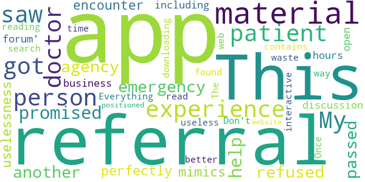

# Managing your stress & anxiety
App version ``1.1.1``

Analyzed with [covid-apps-observer](http://github.com/covid-apps-observer) project, version ``0.1``

## App overview
| | |
|-------------------------|-------------------------| 
| **Name**&nbsp;&nbsp;&nbsp;&nbsp;&nbsp;&nbsp;&nbsp;&nbsp;&nbsp;&nbsp;&nbsp;&nbsp;&nbsp;&nbsp;&nbsp;&nbsp;&nbsp;&nbsp;&nbsp;&nbsp;&nbsp;&nbsp;&nbsp;&nbsp;&nbsp;&nbsp;&nbsp;&nbsp;&nbsp;&nbsp;&nbsp;&nbsp;&nbsp;&nbsp;&nbsp;&nbsp;&nbsp;&nbsp;&nbsp;&nbsp;  | Managing your stress & anxiety |
| **Unique identifier** | com.camh.covid19_managing_stress |
| **Link to Google Play** | [https://play.google.com/store/apps/details?id=com.camh.covid19_managing_stress](https://play.google.com/store/apps/details?id=com.camh.covid19_managing_stress) |
| **Summary**  | Expert guidance to help manage worry, anxiety and stress due to COVID-19. |
| **Privacy policy** | [-](-) |
| **Latest version** | 1.1.1 |
| **Last update** | 2020-07-10 19:55:54 |
| **Recent changes** | Updated content with additional resources. |
| **Installs**  | 100+ |
| **Category** | Health & Fitness |
| **First release** | Apr 21, 2020 |
| **Size**  | 29M |
| **Supported Android version**  | 5.0 and up |

### Description
> This app provides information and evidence-based coping strategies to help you manage stress and anxiety during the COVID-19 pandemic. It is not intended to be a resource for people who require screening for COVID-19 or are experiencing a mental health crisis. If you are experiencing a mental health crisis, please contact 911 immediately or present to your nearest emergency department.
 The Centre for Addiction and Mental Health (CAMH) is Canada's largest mental health teaching hospital and one of the world's leading research centres in its field. CAMH is fully affiliated with the University of Toronto and is a Pan American Health Organization/World Health Organization Collaborating Centre.

### User interface
The developers of the app provide the following screenshots in the Google play store.
| | | |
|:-------------------------:|:-------------------------:|:-------------------------:|
 |   |   |   | 
 |   |   |   | 
 |   |   |   | 
 |   |   |   | 
 |   |   |   | 
 |   |   |   | 
 |   |   |   | 
 |   |  

## Development team
In the following we report the main information provided by the development team in the Google play store.

| | |
|-------------------------|-------------------------|
| **Developer**  | Centre for Addiction and Mental Health  (CAMH) |
| **Website**  | - |
| **Email** | scotty@camh.ca |
| **Physical address**  | - |
| **Other developed apps**  | [https://play.google.com/store/apps/developer?id=Centre+for+Addiction+and+Mental+Health++(CAMH)](https://play.google.com/store/apps/developer?id=Centre+for+Addiction+and+Mental+Health++(CAMH)) |

## Android support

| | |
|-------------------------|-------------------------|
| **Declared target Android version**  | Pie, version 9 (API level 28) |
| **Effective target Android version**  | Pie, version 9 (API level 28) |
| **Minimum supported Android version**  | Lollipop, version 5.0 (API level 21) |
| **Maximum target Android version**  | - |

The larger the difference between the minimum and maximum supported Android versions, the better. A larger difference means a wider audience. For example, old phones have a very low Android version, so a high minimum supported Android version means that the app cannot be used by users with old phones, thus leading to accessibility problems. 

## Requested permissions

In the following we report the complete list of the permissions requested by the app. 

| **Permission** | **Protection level** | **Description** | 
|-------------------------|-------------------------|-------------------------|
 **android.permission ACCESS_NETWORK_STATE** | Normal | Allows applications to access information about networks. 
 **android.permission INTERNET** | Normal | Allows applications to open network sockets. 
 **android.permission WRITE_EXTERNAL_STORAGE** | :warning:**Dangerous** | Allows an application to write to external storage. 

## Mentioned servers

| **Server** | **Registrant** | **Registrant country** | **Creation date** | 
|-------------------------|-------------------------|-------------------------|-------------------------|
-

## Security analysis 

Below we report the main security warnings raised by our execution of the [Androwarn](https://github.com/maaaaz/androwarn) security analysis tool.

**Connection interfaces exfiltration**
> - This application reads details about the currently active data network 
> - This application tries to find out if the currently active data network is metered 

**Code execution**
> - This application loads a native library: 'monodroid' 
> - This application loads a native library: 'monosgen-2.0' 
> - This application loads a native library: 'xamarin-app' 
> - This application loads a native library: 'xamarin-debug-app-helper' 

## User ratings and reviews

Below we provide information about how end users are reacting to the app in terms of ratings and reviews in the Google Play store.

### Ratings

The Managing your stress & anxiety app has been installed by more than **100** times. At this time, **-** rated the app and its average score is **0.0**. Below we show the distribution of the ratings across the usual star-based rating of Google Play

:star::star::star::star::star:: 0

:star::star::star::star:: 0

:star::star::star:: 0

:star::star:: 0

:star:: 0

### Reviews 

#### 5-star reviews

> Very useful  :date: __2020-08-11 19:37:06__

#### 4-star reviews

No recent reviews available with 4 stars.

#### 3-star reviews

No recent reviews available with 3 stars.

#### 2-star reviews

No recent reviews available with 2 stars.

#### 1-star reviews

> My only in-person experience as a patient: got a referral, then saw a doctor who promised to help and then, when I had an emergency, he passed me over to another agency that refused his referral. This app perfectly mimics the uselessness of that encounter, including having a 'discussion forum' that's only open during business hours. Everything on the app can be found with a web search. Don't waste your time downloading it.  :date: __2021-01-25 13:48:58__

> The app contains reading material only and is not interactive in any way. Once you read the material, the app is useless. This would be better positioned on a website.  :date: __2021-01-23 15:36:29__

