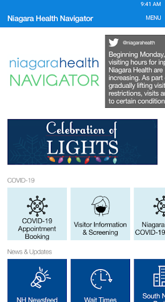
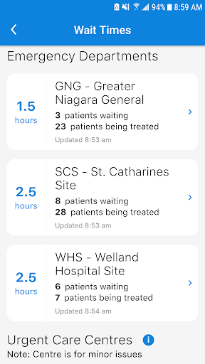
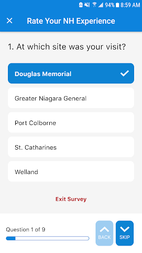
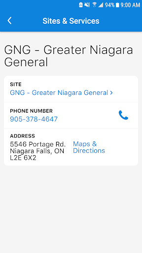
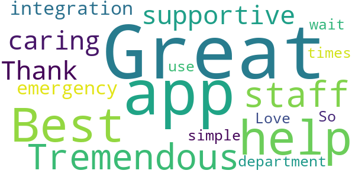
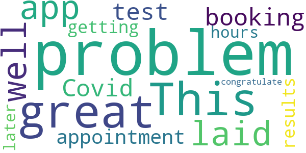
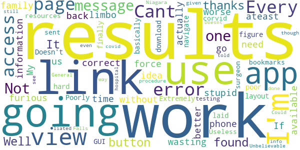

# Niagara Health Navigator
App version ``2.0.3``

Analyzed with [covid-apps-observer](http://github.com/covid-apps-observer) project, version ``0.1``

## App overview
| | |
|-------------------------|-------------------------| 
| **Name**&nbsp;&nbsp;&nbsp;&nbsp;&nbsp;&nbsp;&nbsp;&nbsp;&nbsp;&nbsp;&nbsp;&nbsp;&nbsp;&nbsp;&nbsp;&nbsp;&nbsp;&nbsp;&nbsp;&nbsp;&nbsp;&nbsp;&nbsp;&nbsp;&nbsp;&nbsp;&nbsp;&nbsp;&nbsp;&nbsp;&nbsp;&nbsp;&nbsp;&nbsp;&nbsp;&nbsp;&nbsp;&nbsp;&nbsp;&nbsp;  | Niagara Health Navigator |
| **Unique identifier** | com.identos.nav.niagara |
| **Link to Google Play** | [https://play.google.com/store/apps/details?id=com.identos.nav.niagara](https://play.google.com/store/apps/details?id=com.identos.nav.niagara) |
| **Summary**  | Niagara Health Navigator empowers you to connect to local health information. |
| **Privacy policy** | [https://identos.com/privacy-policy/](https://identos.com/privacy-policy/) |
| **Latest version** | 2.0.3 |
| **Last update** | 2021-03-04 14:33:12 |
| **Recent changes** | The Niagara Health Navigator helps patients, families &amp; community members stay on top of important hospital-related pandemic information. Our latest release includes an early release of the Ontario trusted account and an appointment booking tool. This release is limited to a small subset within our Niagara Falls Ultrasound Imaging. |
| **Installs**  | 10,000+ |
| **Category** | Medical |
| **First release** | Oct 7, 2019 |
| **Size**  | 31M |
| **Supported Android version**  | 6.0 and up |

### Description
> The Niagara Health Navigator is a made-in-Niagara digital solution that will put patients at the centre of their care by empowering users to manage their own health information from the convenience of a mobile device.
 Through the Niagara Health Navigator, users can access healthcare content to help support their well-being. This includes a number of COVID-19 apps to provide patients and community members with the most recent information related to Niagara Health’s COVID-19 response and directives of public health officials.
 In addition to COVID-related information, users can find:
 - Current wait times in NH Emergency Departments and Urgent Care Centres
 · Information on the process to book appointments and procedures
 · Important reminders for anyone coming to the hospital
 · Mental health and addictions resources
 · NH news
 We encourage users to engage with the content and provide feedback to improve future releases of the Navigator.

### User interface
The developers of the app provide the following screenshots in the Google play store.
| | | |
|:-------------------------:|:-------------------------:|:-------------------------:|
 |   |   |   | 
 |   |   |   | 
 |  

## Development team
In the following we report the main information provided by the development team in the Google play store.

| | |
|-------------------------|-------------------------|
| **Developer**  | Niagara Health |
| **Website**  | [https://niagarahealth.on.ca](https://niagarahealth.on.ca) |
| **Email** | help@niagarahealthnavigator.ca |
| **Physical address**  | - |
| **Other developed apps**  | [https://play.google.com/store/apps/developer?id=Niagara+Health](https://play.google.com/store/apps/developer?id=Niagara+Health) |

## Android support

| | |
|-------------------------|-------------------------|
| **Declared target Android version**  | Android10, version 10 (API level 29) |
| **Effective target Android version**  | Android10, version 10 (API level 29) |
| **Minimum supported Android version**  | Marshmallow, version 6.0 (API level 23) |
| **Maximum target Android version**  | - |

The larger the difference between the minimum and maximum supported Android versions, the better. A larger difference means a wider audience. For example, old phones have a very low Android version, so a high minimum supported Android version means that the app cannot be used by users with old phones, thus leading to accessibility problems. 

## Requested permissions

In the following we report the complete list of the permissions requested by the app. 

| **Permission** | **Protection level** | **Description** | 
|-------------------------|-------------------------|-------------------------|
 **android.permission ACCESS_NETWORK_STATE** | Normal | Allows applications to access information about networks. 
 **android.permission INTERNET** | Normal | Allows applications to open network sockets. 
 **android.permission VIBRATE** | Normal | Allows access to the vibrator. 

## Mentioned servers

| **Server** | **Registrant** | **Registrant country** | **Creation date** | 
|-------------------------|-------------------------|-------------------------|-------------------------|
 | googlesyndication.com | Google LLC | :us: US | 2003-01-21 06:17:24 |
 | google.com | Google LLC | :us: US | 1997-09-15 04:00:00 |
 | app-measurement.com | Google LLC | :us: US | 2015-06-19 20:13:31 |
 | crashlytics.com | Google LLC | :us: US | 2011-01-21 15:30:40 |
 | googleapis.com | Google LLC | :us: US | 2005-01-25 17:52:26 |
 | segment.com | Domains By Proxy, LLC | :us: US | 1998-07-06 04:00:00 |
 | segment.io | Segment.io, Inc. | :us: US | 2011-10-01 04:10:05 |
 | microsoft.com | Microsoft Corporation | :us: US | 1991-05-02 04:00:00 |

## Security analysis 

Below we report the main security warnings raised by our execution of the [Androwarn](https://github.com/maaaaz/androwarn) security analysis tool.

**Telephony identifiers leakage**
> - This application reads the ISO country code equivalent of the current registered operator's MCC (Mobile Country Code) 
> - This application reads the numeric name (MCC+MNC) of current registered operator 
> - This application reads the operator name 
> - This application reads the unique device ID, i.e the IMEI for GSM and the MEID or ESN for CDMA phones 

**Connection interfaces exfiltration**
> - This application reads details about the currently active data network 
> - This application tries to find out if the currently active data network is metered 

**Telephony services abuse**
> - This application makes phone calls 

**Suspicious connection establishment**
> - This application opens a Socket and connects it to the remote address '' on the 'N/A' port  
> - This application opens a Socket and connects it to the remote address 'Ljava/lang/StringBuilder;->toString()Ljava/lang/String;' on the 'N/A' port  
> - This application opens a Socket and connects it to the remote address 'Ljava/net/Proxy;->type()Ljava/net/Proxy$Type;' on the 'N/A' port  
> - This application opens a Socket and connects it to the remote address 'timeout' on the 'N/A' port  

**Code execution**
> - This application loads a native library 
> - This application loads a native library: 'tool-checker' 
> - This application executes a UNIX command 
> - This application executes a UNIX command containing this argument: 'getprop' 
> - This application executes a UNIX command containing this argument: 'mount' 

## User ratings and reviews

Below we provide information about how end users are reacting to the app in terms of ratings and reviews in the Google Play store.

### Ratings

The Niagara Health Navigator app has been installed by more than **10000** times. At this time, **27** rated the app and its average score is **3.6666667**. Below we show the distribution of the ratings across the usual star-based rating of Google Play

:star::star::star::star::star:: 16

:star::star::star::star:: 2

:star::star::star:: 1

:star::star:: 0

:star:: 8

### Reviews 

#### 5-star reviews

> Great help  :date: __2021-01-05 15:29:49__

> Best app ever.  :date: __2020-10-23 03:48:45__

> Tremendous staff so supportive and caring  :date: __2020-07-11 20:57:36__

> Thank you!!  :date: __2020-02-27 01:28:51__

> Great app!  :date: __2019-12-10 20:19:20__

> Great integration for emergency department wait times!  :date: __2019-10-28 21:44:37__

> So simple to use. Love it  :date: __2019-10-25 14:55:59__

#### 4-star reviews

> This is a great app well laid out I had no problem booking a Covid test appointment and I had no problem getting the results 24 hours later I congratulate them  :date: __2020-12-13 23:52:35__

#### 3-star reviews

> Could use many more options.  :date: __2019-10-22 07:26:24__

#### 2-star reviews

No recent reviews available with 2 stars.

#### 1-star reviews

> Cant access my results  :date: __2021-02-04 16:33:42__

> Every page is a error message. Not one link or button works. It's all cannot be found. Well thanks for wasting my time I can't go back to work without these results. My family is furious with me. If you're going to force us to use these stupid phone app ateast have the links be correct and the information we need actually available. I'm in limbo and I have no idea if I'm going to get better or worse.  :date: __2021-01-27 18:31:54__

> Extremely hard to navigate once you finally figure out how to download...very poor layout  :date: __2020-11-27 15:00:41__

> Doesn't work.  :date: __2020-11-01 18:33:30__

> Poorly laid out GUI for what's basically just bookmarks to other resources. Useless.  :date: __2020-10-09 01:15:23__

> was sent by my surgeon for corvid testing on 9/15/20 for a procedure to be done on 9/17/20 at the Niagara Falls General... as of 10/01/20 still can't see for myself what the results were...?????? was given info and told to use this app.  :date: __2020-10-01 06:08:18__

> Doesnt work  :date: __2020-08-15 19:26:54__

> Could not view covid-19 results even though the hospital liated this as the #1 way to view results. Unbelievable.  :date: __2020-08-02 20:53:13__

