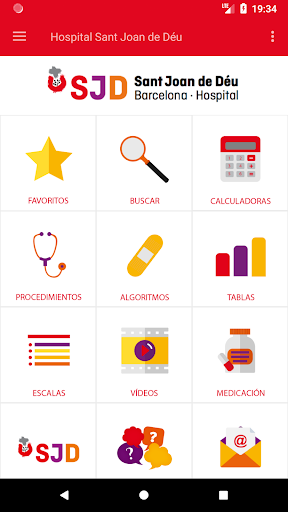

# E-pedia SJD
App version ``1.0.0-34``

Analyzed with [covid-apps-observer](http://github.com/covid-apps-observer) project, version ``0.1``

## App overview
| | |
|-------------------------|-------------------------| 
| **Name**&nbsp;&nbsp;&nbsp;&nbsp;&nbsp;&nbsp;&nbsp;&nbsp;&nbsp;&nbsp;&nbsp;&nbsp;&nbsp;&nbsp;&nbsp;&nbsp;&nbsp;&nbsp;&nbsp;&nbsp;&nbsp;&nbsp;&nbsp;&nbsp;&nbsp;&nbsp;&nbsp;&nbsp;&nbsp;&nbsp;&nbsp;&nbsp;&nbsp;&nbsp;&nbsp;&nbsp;&nbsp;&nbsp;&nbsp;&nbsp;  | E-pedia SJD |
| **Unique identifier** | com.mostrarium.sjd |
| **Link to Google Play** | [https://play.google.com/store/apps/details?id=com.mostrarium.sjd](https://play.google.com/store/apps/details?id=com.mostrarium.sjd) |
| **Summary**  | E-pedia SJD is an App aimed at nurses and nurses. |
| **Privacy policy** | [https://www.sjdhospitalbarcelona.org/ca/politica-privacitat](https://www.sjdhospitalbarcelona.org/ca/politica-privacitat) |
| **Latest version** | 1.0.0-34 |
| **Last update** | 2020-03-23 10:36:43 |
| **Recent changes** | Primera versió |
| **Installs**  | 1,000+ |
| **Category** | Medical |
| **First release** | Mar 23, 2020 |
| **Size**  | 31M |
| **Supported Android version**  | 4.1 and up |

### Description
> Atenció: Aquesta és una versió especial COVID19 de la App E-Pedia, creada per a facilitar la formació i l'actualizació de protocols i circuits a tots els profesionals de l'Hospital Sant Joan de Déu a través de l'apartado COVID-19.
 L'aplicació E-pedia HSJD està dirigida a infermeres i infermers que prestin assistència al pacient pediàtric de forma habitual o esporàdica. Una App professional pionera que els ofereix tota la informació necessària per a la pràctica diària, integrant recursos àgils, actualitzats i basats en evidència científica. El contingut està classificat en:
 Procediments: Documents elaborats per infermeres expertes de l'Hospital Sant Joan de Déu on es descriu la metodologia a seguir per desenvolupar diferents tècniques i activitats infermeres.
 Escales: Eines validades de valoració de gravetat davant diverses situacions clíniques, amb un recompte automatitzat dels valors de l'escala i una avaluació final del resultat.
 Algorismes: Seqüències d'actuació multidisciplinària davant diferents processos de malaltia, que li permetran anticipar-se, millorant la qualitat de l'atenció.
 Taules: Agrupació de contingut d'interès sobre diferents patologies, processos o actuacions.
 Calculadores: Eines validades pel càlcul ràpid de medicació en situacions de reanimació (RCP) i intubació, ritmes d'infusió, pèrdues insensibles, etc. 
 Medicació: Accés directe a la plataforma "Via Parenteral" de l'HSJD, on podrà consultar tot el que necessiti per administrar fàrmacs parenterals (dilució, vies d'administració, incompatibilitats...).
 Vídeos: Accés a contingut audiovisual d'alta qualitat. Vídeos dinàmics, curts i pràctics que donen suport a diferents procediments.
 Favorits: Recull els recursos que més s'adaptin a les teves necessitats per tenir-los a mà fàcilment sempre que necessitis.
 Propietat, autoria i desenvolupament
 L'App E-Pedia SJD ha estat finançada íntegrament per l'Hospital Sant Joan de Déu de Barcelona, propietari de la mateixa.
 La creació de l'App, així com la classificació, selecció i elaboració de part dels continguts correspon als autors:
 - José Manuel Blanco González, Màster en Lideratge i Gestió de Serveis d'Infermeria i Infermer Especialista en Pediatria. Responsable d'Infermeria d'Urgències Pediàtriques de l'Hospital Sant Joan de Déu Barcelona.
 - Ana Gil Carrasco, Màster en Infermeria Escolar i Investigació Infermera. Infermera assistencial d'Urgències Pediàtriques de l'Hospital Sant Joan de Déu Barcelona.
 - Maria del Pilar Hornillos Sánchez, Infermera Especialista en Pediatria i Biòloga. Infermera assistencial d'Urgències Pediàtriques de l'Hospital Sant Joan de Déu Barcelona.
 - Arnau Valls Esteve, Enginyer Superior de Telecomunicacions. Enginyer de R+D a l'Hospital Sant Joan de Déu de Barcelona en les àrees de Salut Digital, 3D i AI.
 Amb la col·laboració de les infermeres de l'HSJD autores dels procediments, tal com figura en cada un d'ells, l'assessorament de companyes i companys infermeres i pediatres i, el suport de la Direcció d'Infermeria, el Departament d'Innovació, el Servei de suport Metodològic Infermer, el Servei de Farmàcia i el Departament d'Audiovisuals de l'HSJD. El disseny i desenvolupament ha estat dut a terme per Mostrarium.

### User interface
The developers of the app provide the following screenshots in the Google play store.
| | | |
|:-------------------------:|:-------------------------:|:-------------------------:|
 |   |   |   | 
 |  

## Development team
In the following we report the main information provided by the development team in the Google play store.

| | |
|-------------------------|-------------------------|
| **Developer**  | Hospital Sant Joan de Déu Barcelona |
| **Website**  | [https://www.sjdhospitalbarcelona.org/](https://www.sjdhospitalbarcelona.org/) |
| **Email** | apps@sjdhospitalbarcelona.org |
| **Physical address**  | - |
| **Other developed apps**  | [https://play.google.com/store/apps/developer?id=Hospital+Sant+Joan+de+D%C3%A9u+Barcelona](https://play.google.com/store/apps/developer?id=Hospital+Sant+Joan+de+D%C3%A9u+Barcelona) |

## Android support

| | |
|-------------------------|-------------------------|
| **Declared target Android version**  | Pie, version 9 (API level 28) |
| **Effective target Android version**  | Pie, version 9 (API level 28) |
| **Minimum supported Android version**  | Jelly Bean, version 4.1.x (API level 16) |
| **Maximum target Android version**  | - |

The larger the difference between the minimum and maximum supported Android versions, the better. A larger difference means a wider audience. For example, old phones have a very low Android version, so a high minimum supported Android version means that the app cannot be used by users with old phones, thus leading to accessibility problems. 

## Requested permissions

In the following we report the complete list of the permissions requested by the app. 

| **Permission** | **Protection level** | **Description** | 
|-------------------------|-------------------------|-------------------------|
 **android.permission ACCESS_COARSE_LOCATION** | :warning:**Dangerous** | Allows an app to access approximate location. 
 **android.permission ACCESS_FINE_LOCATION** | :warning:**Dangerous** | Allows an app to access precise location. 
 **android.permission ACCESS_NETWORK_STATE** | Normal | Allows applications to access information about networks. 
 **android.permission CAMERA** | :warning:**Dangerous** | Required to be able to access the camera device. 
 **android.permission FLASHLIGHT** | - | - 
 **android.permission INTERNET** | Normal | Allows applications to open network sockets. 
 **android.permission READ_EXTERNAL_STORAGE** | :warning:**Dangerous** | Allows an application to read from external storage. 
 **android.permission VIBRATE** | Normal | Allows access to the vibrator. 
 **android.permission WAKE_LOCK** | Normal | Allows using PowerManager WakeLocks to keep processor from sleeping or screen from dimming. 
 **android.permission WRITE_EXTERNAL_STORAGE** | :warning:**Dangerous** | Allows an application to write to external storage. 
 **com.google.android.c2dm.permission RECEIVE** | - | - 
 **com.google.android.finsky.permission BIND_GET_INSTALL_REFERRER_SERVICE** | - | - 
 **com.google.android.providers.gsf.permission READ_GSERVICES** | - | - 

## Mentioned servers

| **Server** | **Registrant** | **Registrant country** | **Creation date** | 
|-------------------------|-------------------------|-------------------------|-------------------------|
 | googlesyndication.com | Google LLC | :us: US | 2003-01-21 06:17:24 |
 | google.com | Google LLC | :us: US | 1997-09-15 04:00:00 |
 | app-measurement.com | Google LLC | :us: US | 2015-06-19 20:13:31 |
 | linkedin.com | LinkedIn Corporation | :us: US | 2002-11-02 15:38:11 |
 | twitter.com | Twitter, Inc. | :us: US | 2000-01-21 16:28:17 |
 | facebook.com | Facebook, Inc. | :us: US | 1997-03-29 05:00:00 |
 | foursquare.com | Foursquare Labs, Inc. | :us: US | 2002-03-26 01:18:55 |
 | youtube.com | Google LLC | :us: US | 2005-02-15 05:13:12 |
 | vimeo.com | Vimeo, Inc. | :us: US | 2004-12-15 08:38:55 |
 | googleadservices.com | Google LLC | :us: US | 2003-06-19 16:34:53 |

## Security analysis 

Below we report the main security warnings raised by our execution of the [Androwarn](https://github.com/maaaaz/androwarn) security analysis tool.

**Connection interfaces exfiltration**
> - This application reads details about the currently active data network 

**Telephony services abuse**
> - This application makes phone calls 

**Pim data leakage**
> - This application accesses the contacts list 

**Code execution**
> - This application loads a native library: 'iconv' 
> - This application loads a native library: 'jniPdfium' 
> - This application loads a native library: 'modft2' 
> - This application loads a native library: 'modpdfium' 
> - This application loads a native library: 'modpng' 
> - This application loads a native library: 'zbarjni' 

## User ratings and reviews

Below we provide information about how end users are reacting to the app in terms of ratings and reviews in the Google Play store.

### Ratings

The E-pedia SJD app has been installed by more than **1000** times. At this time, **21** rated the app and its average score is **4.6666665**. Below we show the distribution of the ratings across the usual star-based rating of Google Play

:star::star::star::star::star:: 16

:star::star::star::star:: 3

:star::star::star:: 2

:star::star:: 0

:star:: 0

### Reviews 

#### 5-star reviews

No recent reviews available with 5 stars.

#### 4-star reviews

No recent reviews available with 4 stars.

#### 3-star reviews

No recent reviews available with 3 stars.

#### 2-star reviews

No recent reviews available with 2 stars.

#### 1-star reviews

No recent reviews available with 1 stars.
