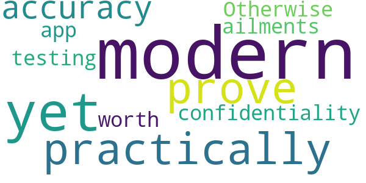

# Kenya Covid-19 Tracker
App version ``v0.4.38``

Analyzed with [covid-apps-observer](http://github.com/covid-apps-observer) project, version ``0.1``

## App overview
| | |
|-------------------------|-------------------------| 
| **Name**                                          | Kenya Covid-19 Tracker |
| **Unique identifier** | org.medicmobile.webapp.mobile.surveillance_covid19_kenya |
| **Link to Google Play** | [https://play.google.com/store/apps/details?id=org.medicmobile.webapp.mobile.surveillance_covid19_kenya](https://play.google.com/store/apps/details?id=org.medicmobile.webapp.mobile.surveillance_covid19_kenya) |
| **Summary**  | Kenya Covid-19 app for case surveillance, contact tracing & follow-up in Kenya |
| **Privacy policy** | [https://docs.google.com/document/d/e/2PACX-1vS1YCuJjwXX3lqddh0f2pSeRSBN98JW3zcp7HAu0idmju3BWdw67umiG_ck4sq0XzuNOyEeeEiOWx9C/pub](https://docs.google.com/document/d/e/2PACX-1vS1YCuJjwXX3lqddh0f2pSeRSBN98JW3zcp7HAu0idmju3BWdw67umiG_ck4sq0XzuNOyEeeEiOWx9C/pub) |
| **Latest version** | v0.4.38 |
| **Last update** | 2020-04-28 23:56:13 |
| **Recent changes** | Update production server URL |
| **Installs**  | 1,000+ |
| **Category** | Medical |
| **First release** | Apr 20, 2020 |
| **Size**  | Varies with device |
| **Supported Android version**  | 4.4 and up |

### Description
> The Kenya Covid-19 tracking application is an android application developed for Kenya’s COVID-19 surveillance & response team. The app is designed for use together with the KenyaEMR Covid-19 tracking system and is for use by field disease surveillance teams to report suspected Covid19 cases to the national surveillance system, conduct case investigations by submitting laboratory requests to the national testing laboratories through the Kenya EMR Covid-19 tracking system. The Kenya Covid-19 tracking app can also be used by Covid-19 contact tracing teams to conduct tracing and follow-up of contacts of patients confirmed to be Covid-19 infected and for monitoring these contacts during the quarantine period.

### User interface
The developers of the app provide the following screenshots in the Google play store.
| | | |
|:-------------------------:|:-------------------------:|:-------------------------:|
 |   |   |   | 
 |  

## Development team
In the following we report the main information provided by the development team in the Google play store.

| | |
|-------------------------|-------------------------|
| **Developer**  | Medic Mobile, Inc. |
| **Website**  | [http://medicmobile.org](http://medicmobile.org) |
| **Email** | support@medicmobile.org |
| **Physical address**  | [3254 19th Street, Floor Two San Francisco, CA 94110 USA](https://www.google.com/maps/search/3254%2019th%20Street,%20Floor%20Two%20San%20Francisco,%20CA%2094110%20USA) (Google Maps) |
| **Other developed apps**  | [https://play.google.com/store/apps/developer?id=Medic+Mobile,+Inc.](https://play.google.com/store/apps/developer?id=Medic+Mobile,+Inc.) |

## Android support

| | |
|-------------------------|-------------------------|
| **Declared target Android version**  | Pie, version 9 (API level 28) |
| **Effective target Android version**  | Pie, version 9 (API level 28) |
| **Minimum supported Android version**  | KitKat, version 4.4 - 4.4.4 (API level 19) |
| **Maximum target Android version**  | - |

The larger the difference between the minimum and maximum supported Android versions, the better. A larger difference means a wider audience. For example, old phones have a very low Android version, so a high minimum supported Android version means that the app cannot be used by users with old phones, thus leading to accessibility problems. 

## Requested permissions

In the following we report the complete list of the permissions requested by the app. 

| **Permission** | **Protection level** | **Description** | 
|-------------------------|-------------------------|-------------------------|
 **android.permission ACCESS_COARSE_LOCATION** | :warning:**Dangerous** | Allows an app to access approximate location. 
 **android.permission ACCESS_FINE_LOCATION** | :warning:**Dangerous** | Allows an app to access precise location. 
 **android.permission ACCESS_NETWORK_STATE** | Normal | Allows applications to access information about networks. 
 **android.permission INTERNET** | Normal | Allows applications to open network sockets. 
 **android.permission VIBRATE** | Normal | Allows access to the vibrator. 
 **android.permission WRITE_EXTERNAL_STORAGE** | :warning:**Dangerous** | Allows an application to write to external storage. 
 **com.android.launcher.permission INSTALL_SHORTCUT** | Normal | Allows an application to install a shortcut in Launcher. 
 **com.android.launcher.permission UNINSTALL_SHORTCUT** | Deprecated | Don't use this permission in your app. 

## Mentioned servers

| **Server** | **Registrant** | **Registrant country** | **Creation date** | 
|-------------------------|-------------------------|-------------------------|-------------------------|
 | medicmobile.org | Medic Mobile | :us: US | 2010-11-09 17:13:03 |
 | github.io | GitHub, Inc. | :us: US | 2013-03-08 19:12:48 |

## Security analysis 

Below we report the main security warnings raised by our execution of the [Androwarn](https://github.com/maaaaz/androwarn) security analysis tool.

**Telephony identifiers leakage**
> - This application reads the ISO country code equivalent of the current registered operator's MCC (Mobile Country Code) 
> - This application reads the MCC+MNC of the provider of the SIM 
> - This application reads the numeric name (MCC+MNC) of current registered operator 

**Location lookup**
> - This application reads location information from all available providers (WiFi, GPS etc.) 

**Connection interfaces exfiltration**
> - This application reads details about the currently active data network 

**Telephony services abuse**
> - This application makes phone calls 

**Pim data leakage**
> - This application accesses data stored in the clipboard 

**Code execution**
> - This application loads a native library 
> - This application loads a native library: '0' 
> - This application loads a native library: 'chromium_android_linker' 
> - This application loads a native library: 'chromium_android_linker.cr' 
> - This application executes a UNIX command containing this argument: 'getprop ro.product.cpu.abi' 

## User ratings and reviews

Below we provide information about how end users are reacting to the app in terms of ratings and reviews in the Google Play store.

### Ratings

The Kenya Covid-19 Tracker app has been installed by more than **1000** times. At this time, **20** rated the app and its average score is **2.3**. Below we show the distribution of the ratings across the usual star-based rating of Google Play

:star::star::star::star::star:: 6

:star::star::star::star:: 0

:star::star::star:: 1

:star::star:: 0

:star:: 13

### Reviews 

#### 5-star reviews

> Ok  :date: __2020-08-27 00:02:29__

> Best  :date: __2020-07-06 10:08:17__

> Good  :date: __2020-06-27 10:04:47__

#### 4-star reviews

No recent reviews available with 4 stars.

#### 3-star reviews

> I am yet to practically prove its accuracy and confidentiality! Otherwise, it is a modern app for our modern ailments, worth testing.  :date: __2020-07-08 05:57:19__

#### 2-star reviews

No recent reviews available with 2 stars.

#### 1-star reviews

> No sighn up option bure kabisi  :date: __2020-08-06 08:08:34__

> This app has only one option [login] so I need to know how to log in  :date: __2020-07-19 23:37:15__

> Which log in details do I use and there is no registration button?  :date: __2020-07-19 18:22:15__

> Help in getting user name and password  :date: __2020-07-13 21:21:26__

> Fake  :date: __2020-07-13 13:49:05__

> Can't long in There's place for registering to enable log Alternatively which credetials should one use to log in?  :date: __2020-07-08 23:30:14__

> Poor how can I login if i don't even have an account  :date: __2020-07-08 18:45:29__

> What are the login credentials I can't get them?  :date: __2020-07-08 05:27:55__

> Havent tried it yet it does not have a place to register a new account  :date: __2020-07-07 11:13:34__

> The app requires log in credentials. Where do I get mine?  :date: __2020-06-20 09:21:34__

