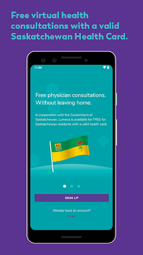
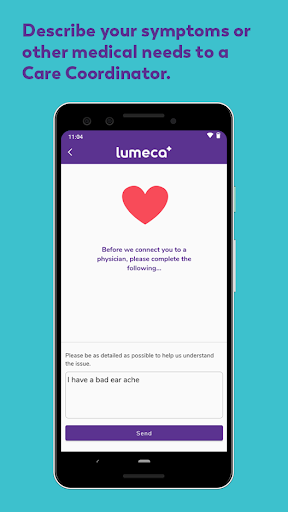
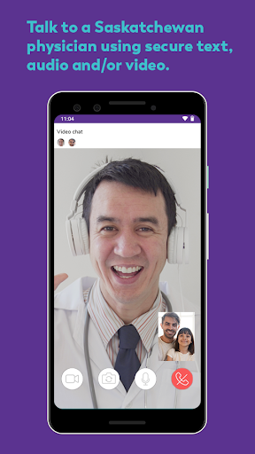
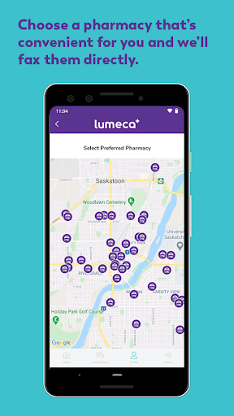
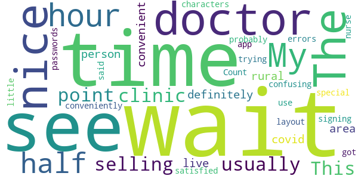
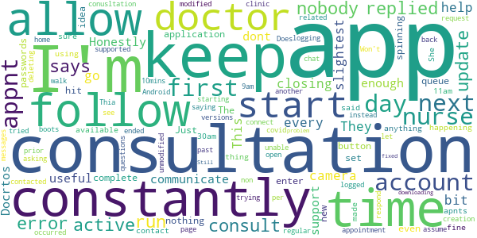

# Lumeca - See a doctor now - Free in Saskatchewan
App version ``2.0 (107)``

Analyzed with [covid-apps-observer](http://github.com/covid-apps-observer) project, version ``0.1``

## App overview
| | |
|-------------------------|-------------------------| 
| **Name**                                          | Lumeca - See a doctor now - Free in Saskatchewan |
| **Unique identifier** | rs.nosolutions.lumeca |
| **Link to Google Play** | [https://play.google.com/store/apps/details?id=rs.nosolutions.lumeca](https://play.google.com/store/apps/details?id=rs.nosolutions.lumeca) |
| **Summary**  | Speak to a doctor now. Free app for residents of Saskatchewan valid health cards |
| **Privacy policy** | [https://lumeca.com/privacy-policy/](https://lumeca.com/privacy-policy/) |
| **Latest version** | 2.0 (107) |
| **Last update** | 2021-03-12 14:28:18 |
| **Recent changes** | Lumeca offers easy, accessible, secure healthcare. From prescription renewals to mental health consults, our health practitioners are ready to connect with you. <b>In this update:</b> Fixes an issue where users with multiple whitespace characters in their name would crash upon entering a consultation. |
| **Installs**  | 5,000+ |
| **Category** | Medical |
| **First release** | May 31, 2019 |
| **Size**  | 110M |
| **Supported Android version**  | 6.0 and up |

### Description
> Lumeca Walk-In is a virtual health consultation tool that allows Saskatchewan Health Card holders the ability to connect with licensed Saskatchewan physicians for free. From prescription renewals to labs and referrals, Lumeca connects you to a physician within minutes. No commuting. No waiting rooms.  
 Safe. Secure. Confidential.
 With the guidance of our privacy officer, the entire team at Lumeca takes every measure to protect the information you provide to us through the platform. It is our duty to comply with the Personal Information Protection of Electronic Documents Act, along with the province’s Health Information Protection Act. Our team safeguards all data so that it is safe, secure, and encrypted.
 For more info, see our Terms of Use and Privacy Policies on our website.

### User interface
The developers of the app provide the following screenshots in the Google play store.
| | | |
|:-------------------------:|:-------------------------:|:-------------------------:|
 |   |   |   | 
 |  

## Development team
In the following we report the main information provided by the development team in the Google play store.

| | |
|-------------------------|-------------------------|
| **Developer**  | Lumeca Health Inc |
| **Website**  | [http://www.lumeca.com](http://www.lumeca.com) |
| **Email** | admin@lumeca.com |
| **Physical address**  | - |
| **Other developed apps**  | [https://play.google.com/store/apps/developer?id=Lumeca+Health+Inc](https://play.google.com/store/apps/developer?id=Lumeca+Health+Inc) |

## Android support

| | |
|-------------------------|-------------------------|
| **Declared target Android version**  | Android10, version 10 (API level 29) |
| **Effective target Android version**  | Android10, version 10 (API level 29) |
| **Minimum supported Android version**  | Marshmallow, version 6.0 (API level 23) |
| **Maximum target Android version**  | - |

The larger the difference between the minimum and maximum supported Android versions, the better. A larger difference means a wider audience. For example, old phones have a very low Android version, so a high minimum supported Android version means that the app cannot be used by users with old phones, thus leading to accessibility problems. 

## Requested permissions

In the following we report the complete list of the permissions requested by the app. 

| **Permission** | **Protection level** | **Description** | 
|-------------------------|-------------------------|-------------------------|
 **android.permission ACCESS_NETWORK_STATE** | Normal | Allows applications to access information about networks. 
 **android.permission ACCESS_WIFI_STATE** | Normal | Allows applications to access information about Wi-Fi networks. 
 **android.permission CAMERA** | :warning:**Dangerous** | Required to be able to access the camera device. 
 **android.permission INTERNET** | Normal | Allows applications to open network sockets. 
 **android.permission MODIFY_AUDIO_SETTINGS** | Normal | Allows an application to modify global audio settings. 
 **android.permission READ_EXTERNAL_STORAGE** | :warning:**Dangerous** | Allows an application to read from external storage. 
 **android.permission RECORD_AUDIO** | :warning:**Dangerous** | Allows an application to record audio. 
 **android.permission WAKE_LOCK** | Normal | Allows using PowerManager WakeLocks to keep processor from sleeping or screen from dimming. 
 **android.permission WRITE_EXTERNAL_STORAGE** | :warning:**Dangerous** | Allows an application to write to external storage. 
 **com.google.android.c2dm.permission RECEIVE** | - | - 
 **com.google.android.finsky.permission BIND_GET_INSTALL_REFERRER_SERVICE** | - | - 

## Mentioned servers

| **Server** | **Registrant** | **Registrant country** | **Creation date** | 
|-------------------------|-------------------------|-------------------------|-------------------------|
 | googlesyndication.com | Google LLC | :us: US | 2003-01-21 06:17:24 |
 | google.com | Google LLC | :us: US | 1997-09-15 04:00:00 |
 | app-measurement.com | Google LLC | :us: US | 2015-06-19 20:13:31 |
 | googleapis.com | Google LLC | :us: US | 2005-01-25 17:52:26 |
 | crashlytics.com | Google LLC | :us: US | 2011-01-21 15:30:40 |
 | googleapis.com | Google LLC | :us: US | 2005-01-25 17:52:26 |
 | googleadservices.com | Google LLC | :us: US | 2003-06-19 16:34:53 |
 | lumecaapp.com | Whois Privacy Service | :us: US | 2018-01-29 14:38:08 |
 | lumeca.com | Whois Privacy Service | :us: US | 2005-07-18 21:42:19 |

## Security analysis 

Below we report the main security warnings raised by our execution of the [Androwarn](https://github.com/maaaaz/androwarn) security analysis tool.

**Connection interfaces exfiltration**
> - This application reads details about the currently active data network 
> - This application tries to find out if the currently active data network is metered 

**Suspicious connection establishment**
> - This application opens a Socket and connects it to the remote address ' returned no addresses for  ; port is out of range' on the 'N/A' port  
> - This application opens a Socket and connects it to the remote address '' on the 'N/A' port  
> - This application opens a Socket and connects it to the remote address 'Ljava/lang/StringBuilder;->toString()Ljava/lang/String;' on the 'N/A' port  
> - This application opens a Socket and connects it to the remote address 'Ljava/net/Proxy;->type()Ljava/net/Proxy$Type;' on the 'N/A' port  
> - This application opens a Socket and connects it to the remote address 'timeout' on the 'N/A' port  

**Code execution**
> - This application loads a native library 
> - This application loads a native library: 'tool-checker' 
> - This application executes a UNIX command 
> - This application executes a UNIX command containing this argument: 'getprop' 
> - This application executes a UNIX command containing this argument: 'mount' 

## User ratings and reviews

Below we provide information about how end users are reacting to the app in terms of ratings and reviews in the Google Play store.

### Ratings

The Lumeca - See a doctor now - Free in Saskatchewan app has been installed by more than **5000** times. At this time, **125** rated the app and its average score is **4.64**. Below we show the distribution of the ratings across the usual star-based rating of Google Play

:star::star::star::star::star:: 110

:star::star::star::star:: 5

:star::star::star:: 0

:star::star:: 0

:star:: 10

### Reviews 

#### 5-star reviews

> Was very easy to sign up and add other family members. Got a response quickly and discreetly in the privacy of my own home.  :date: __2021-03-13 20:18:54__

> Very helpful and caring Coordinators and very easy to use. I had a very good experience with a Doctor who did not mind explaining things to me. If needed, I will not hesitate to use this again.  :date: __2021-03-10 14:45:14__

> Excellent experience. It was professional, very well administered and timely. The Dr. was very friendly and warm.  :date: __2021-03-09 19:46:34__

> The app is quick, easy, safe. The doctor that was assigned was very knowledgeable on my issue, and I would recommend the app over a mediclinic as it's faster and more convenient. The staff who set the appointment are very friendly and easy to talk to.  :date: __2021-03-07 19:25:39__

> Great service.  :date: __2021-03-04 14:37:28__

> Omg. I use to dread having to go to the doctors office. Wait 2 hours (for a scheduled appointment no less) for a 2 second prescription refill. Love that I can do it from home. And it's free!  :date: __2021-03-01 01:11:37__

> What a great app! I downloaded it, registered my account and spoke with a doctor all within 2 hours. Very impressed. I will definitely use this service again.  :date: __2021-02-25 19:30:36__

> This application is amazing! I was able to meet virtually with a fantastic doctor on a Sunday morning when my regular clinic was closed. Immediately after our meeting, my pharmacy recieved the fax for my prescription and I was able to pick it up later that day. I will definitely be recommending this app to others! A wonderful solution for those trying to stay home and stay safe during covid.  :date: __2021-02-21 19:01:54__

> Very easy to use!  :date: __2021-02-19 15:45:22__

> Very good. Quick and easy  :date: __2021-02-07 03:10:05__

#### 4-star reviews

> This was amazing. It was a little laggy but my internet is quite slow. So great to have access to medical care within 2 hours of me asking for an appointment! Thanks Lumeca!  :date: __2020-05-18 22:31:02__

> The app sucks but the doctors are great  :date: __2020-04-19 05:14:57__

#### 3-star reviews

> My wait time was an hour and a half, more than what I usually wait at a clinic so I don't see the wait time as a selling point. This is definitely convenient if you live in a rural area and during covid but if you can see a doctor in person conveniently you'll probably be more satisfied. The app layout is a little confusing, and when signing up they said that _ . , Count as special characters for your passwords, but I got errors trying to use those. The nurse was nice and the doctor was nice.  :date: __2020-04-13 20:27:50__

#### 2-star reviews

> The app is not letting me create a account  :date: __2020-04-07 00:31:12__

#### 1-star reviews

> This app just keeps closing every time I go to the consultation  :date: __2021-03-11 20:20:14__

> They will not help you the slightest bit if you don't have a camera.  :date: __2021-03-10 17:30:11__

> Honestly just not very useful. Docrtos and their support dont communicate enough and I constantly have to follow up but the application doesn't allow you to follow up with the doctor and you have to constantly start new consultations.  :date: __2020-12-23 23:57:33__

> The app won't even complete my account set up. I enter my passwords and hit the next button and nothing.  :date: __2020-11-09 19:55:00__

> Just keeps spinning...I have no idea if I'm in queue or what is happening, if anything.  :date: __2020-09-26 05:49:43__

> I am sure the app itself is fine, but my first time using it, no apnts were available that day (@11am) but the nurse made an appnt for me first thing the next day 7:30am. She said that they would contact me just before my appointment with the doctor. I was logged in 10mins prior to appnt but nobody contacted me. I replied to the open/active chat/consult, but nobody replied. I assume because i had an active consult i could not request another. I ended up at a walk in clinic at 9am instead.  :date: __2020-07-31 17:04:30__

> Won't allow me to start a (non-covid related) conusltation. It says "an error occurred while starting your consultation" and boots me back to the home page.  :date: __2020-05-14 19:09:18__

> Does this not run on Android 10? It won't run as it says it's only supported on "unmodified" versions. I haven't modified it. I only ever update it per the regular updates.  :date: __2020-04-23 19:19:35__

> Thia app will not let you get past the account creation.  :date: __2020-04-10 20:39:13__

> I'm trying to connect with a nurse and my messages keep saying error. I can see is asking me questions but I'm unable to respond. I tried logging out and deleting the app then downloading it. Still has fixed the problem.  :date: __2020-04-04 16:21:47__

