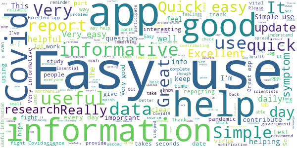
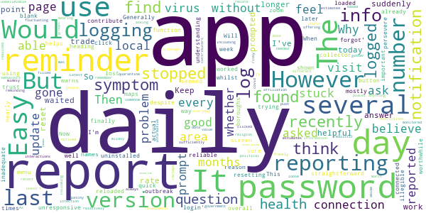
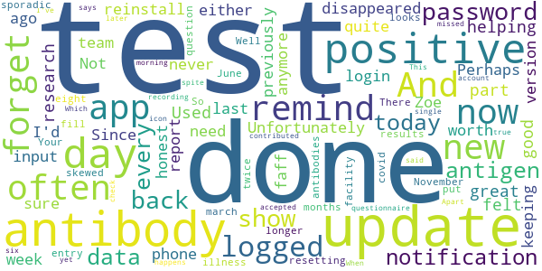
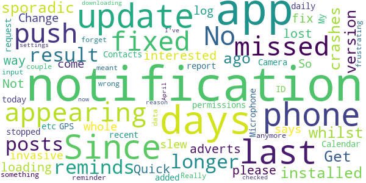
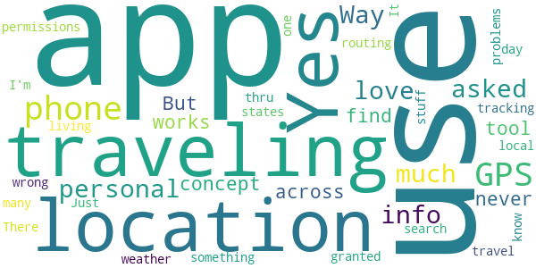

# COVID-related Android apps by the community

Author: `Ivano Malavolta` (ivanomalavolta@gmail.com)

Created at: `2020/11/21`

Report generated by the [covid-apps-observer](http://github.com/covid-apps-observer) project, version 0.1

# Table of contents 

- [Background](#background)
    * [Data sources and analyses](#data-sources-and-analyses)
        * [App metadata](#app-metadata)
        * [Requested permissions](#requested-permissions)
        * [Mentioned servers](#mentioned_servers)
        * [Security analysis](#security_analysis)
        * [User ratings and reviews](#user-ratings-and-reviews)
    * [Disclaimer](#disclaimer)
- [COVID Symptom Study](#covid-symptom-study)
- [Hunala](#hunala)

- [Credits](#credits)

# How to read this report

This report has been generated by the [covid-apps-observer](http://github.com/covid-apps-observer) project. The project automatically analyzes the apps by extracting information which is already publicly available either on the web or in the apps binary files. 

Our analysis covers the following apps:
| | |
|-------------------------|-------------------------| 
|  | COVID Symptom Study
|  | Hunala

The details of our analysis are presented in the remainder of this report.

For independent verification, the raw data and the source code of the project is publicly available in its GitHub repository [http://github.com/covid-apps-observer](http://github.com/covid-apps-observer) and its source code has been thoroughly commented in order to provide all the details about how the information provided in this report has been extracted. 

Any feedback, questions, and improvements about the project are very welcome, feel free to create an issue or pull request directly in its GitHub repository: [http://github.com/covid-apps-observer](http://github.com/covid-apps-observer).

## Data sources and analyses

The analysis of each app is structured around five main dimensions: 
* App metadata  
* Requested permissions
* Mentioned servers
* Androwarn analysis
* User ratings and reviews

In the following we describe the data sources and analysis performed for each dimension.

### App metadata

App metadata includes an overview of the main information about the app (for example, its name, releases, privacy policy, etc.), contact information of the development team, and the various Android versions supported by the app. This information is extracted from two main data sources:
* _Google Play store_: we automatically mined the web page of the Google Play store showing the basic information about the app and we parsed it in order to extract information about the app and development team 
* _Android Manifest file_: in our analysis we decompiled the binary file of the app (it is similar to a Zip archive but it contains the code of the app instead of normal files) and we extracted information about the supported Android versions, as it has been listed by its development team.

The extracted app metadata feeds the _App overview_, _Development team_, and _Android support_ sections of this report.
We make use of the [google-play-scraper](https://github.com/JoMingyu/google-play-scraper) tool for extracting the raw data related to this dimension of the project.

### Requested permissions

The Android operating system has a permission model which allows users to grant access to potentially privacy-related information. Every Android app has to explictly declare the permissions it needs to properly function in the Android Manifest file.  

In this report we also show the protection level of each permission, which is a key information for understanding how the requested permissions related to the user's privacy. We carefully analyzed the [official Android documentation (v. 29)](https://developer.android.com/reference/android/Manifest.permission), and it resulted that a permission requested by an Android app can belong to the following protection levels:
* **Dangerous**: higher-risk permissions that would give a requesting app access to private user data or control over the device that can negatively impact the user. Because this type of permission introduces potential risk, the system usually does not automatically grant it to the requesting app. For example, any dangerous permissions requested by an app may be displayed to the user and require confirmation before proceeding.
* **Normal**: this is the default and most common level in Android; normal permissions are lower-risk and give access to isolated app-level features, with minimal risk to other apps, the system, or the user. 
* **Signature**: permissions granted only if the requesting app is signed with the same certificate as the app that declared the permission
* **Appop**: old permission level, a reminiscence of the App Ops tool that Google introduced in Android 4.3.
* **Development**: optional permissions which can be granted to development-oriented apps.
* **Privileged**: permissions who give higher power to mobile apps w.r.t. other apps, such as binding to incoming calls, interacting via bluetooth with other devices without user interaction, etc.
* **Preinstalled**: reserved only for preinstalled apps
* **Installer**: allow the holder to start the permission usage screen for an app
* **RetailDemo**: permissions related to devices used in demonstrations in shops.
* **Pre23**: permissions automatically granted to apps targeting devices running pre-6.0 Android.
* **Upcoming**: permissions which will be released in the next version of the Android platform. 
* **Deprecated**: permissions belonging to old releases of the Android platform, they should not be used by developers since they will not be supported in the near future.
* **Not for use by third-party applications**: permissions which can be requested only by apps developed by Google.
* **Undefined**: this protection level is not documented by Google.

The permissions dimension of this project is based on the [Androguard](https://github.com/androguard/androguard) static analysis tool.

### Mentioned servers

We decompiled each app in order to look for all possible mentions of remote URLs. The mentioned URLs can refer to remote servers the the app is using for either sending or receiving information, web addresses for directing the user to an information website, and so on. 

:warning: It is important to note that this analysis is not meant to be complete and it is very prone to obfuscation. The servers reported here are simply _mentioned_ somewhere in the code of the app and are meant to just give an indication about the "hooks" of the app towards external resources. For example, for an Android app it is normal to contact Google services in order to send/receive push notifications, or to contact the servers of analytics services for having real-time diagnostics about crashes of the app or bugs.

This part of the analysis is based on the [Androguard](https://github.com/androguard/androguard) static analysis tool for identfying the raw URLs mentioned in the app; then, the information about each mentioned server is collected by performing a _whois_ lookup on the first-level domain present in the URL.

### Security analysis

This dimension is based on the [Androwarn](https://github.com/maaaaz/androwarn) structural and data flow analysis of Android bytecode. Androwarn is developed by the University of Lyon/INSA (France) and it has been used in several academic studies. According to its documentation, Androwarn targets the following categories of potential security issues:
* **Telephony identifiers exfiltration**: IMEI, IMSI, MCC, MNC, LAC, CID, operator's name, etc.
* **Device settings exfiltration**: software version, usage statistics, system settings, logs, etc.
* **Geolocation information leakage**: GPS/WiFi geolocation, etc.
* **Connection interfaces information exfiltration**: WiFi credentials, Bluetooth MAC adress, etc.
* **Telephony services abuse**: premium SMS sending, phone call composition, etc.
* **Audio/video flow interception**: call recording, video capture, etc.
* **Remote connection establishment**: socket open call, Bluetooth pairing, APN settings edit, etc.
* **PIM data leakage**: contacts, calendar, SMS, mails, clipboard, etc.
* **External memory operations**: file access on SD card, etc.
* **PIM data modification**: add/delete contacts, calendar events, etc.
* **Arbitrary code execution**: native code using JNI, UNIX command, privilege escalation, etc.
* **Denial of Service**: event notification deactivation, file deletion, process killing, virtual keyboard disable, terminal shutdown/reboot, etc.

Note: We do not consider this data point in the current version of our analyzers since it is too verbose for our purposes.

:warning: It is important to note that Androwarn is a static analysis tool, and as such it performs a variety of heuristics and approximations in its analyses. Said that, the results shown in this report are meant to provide an indication of _potential_ security issues and should be by no means treated as complete and correct.   

### User ratings and reviews

For this dimension we turn again to the web interface of the Google Play store. Firstly, we automatically mine summary statistics about user ratings from the web page of the app under analysis; then, we automatically download the newest 1000 reviews of the app under analysis. For each level of rating (5 stars, 4 stars, , etc., 1 star) we show:
- a word cloud presenting the main terms used by end users in their reviews in the Google Play store
- the last 10 reviews provided by app users in the Google Play store. 

This purposefully simple analysis is meant to help both future users and the development team of the app in understanding what are the main positive and negative points of the app under analysis.

We make use of the [google-play-scraper](https://github.com/JoMingyu/google-play-scraper) tool for extracting the raw data related to this dimension of the project.

## Disclaimer 

This report has been produced independently of any parties and its only objective is to help anybody in better understanding how COVID-related apps work in practice (and compare to each other). The results of this report are limited to the specific version of the software used for running the analyses and on the various heuristics implemented in there. In other words, the results of the analyzers may differ depending on the time and modalities in which they are executed. We do not guarantee that the results of the analyses and the corresponding contents of this report are fully complete or correct. The analysis software is licensed under the [MIT License](https://github.com/iivanoo/covid-apps-observer/blob/master/LICENSE).

# COVID Symptom Study
App version ``2.0.1``

Analyzed with [covid-apps-observer](http://github.com/covid-apps-observer) project, version ``0.1``

## App overview
| | |
|-------------------------|-------------------------| 
| **Name**&nbsp;&nbsp;&nbsp;&nbsp;&nbsp;&nbsp;&nbsp;&nbsp;&nbsp;&nbsp;&nbsp;&nbsp;&nbsp;&nbsp;&nbsp;&nbsp;&nbsp;&nbsp;&nbsp;&nbsp;&nbsp;&nbsp;&nbsp;&nbsp;&nbsp;&nbsp;&nbsp;&nbsp;&nbsp;&nbsp;&nbsp;&nbsp;&nbsp;&nbsp;&nbsp;&nbsp;&nbsp;&nbsp;&nbsp;&nbsp;  | COVID Symptom Study |
| **Unique identifier** | com.joinzoe.covid_zoe |
| **Link to Google Play** | [https://play.google.com/store/apps/details?id=com.joinzoe.covid_zoe](https://play.google.com/store/apps/details?id=com.joinzoe.covid_zoe) |
| **Summary**  | Help slow COVID-19 by self-reporting your symptoms daily, even if you feel well. |
| **Privacy policy** | [https://predict.study/covid-privacy-notice/](https://predict.study/covid-privacy-notice/) |
| **Latest version** | 2.0.1 |
| **Last update** | 2020-11-18 19:41:33 |
| **Recent changes** | Fixed push notification |
| **Installs**  | 1,000,000+ |
| **Category** | Health & Fitness |
| **First release** | Mar 20, 2020 |
| **Size**  | 35M |
| **Supported Android version**  | 5.0 and up |

### Description
> Take 1 minute each day and help fight the spread of COVID-19 in your community
 * Report your health daily even if you feel well
 * Get a daily estimate of COVID in your area
 * Help slow the outbreak near you
 Join millions of people supporting scientists at Stanford University, Harvard University, Massachusetts General Hospital, and King's College London to help fight coronavirus by identifying:
 * How fast the virus is spreading in your area
 * High-risk areas in the US
 * Who is most at risk, by better understanding symptoms linked to underlying health conditions
 You will contribute to advance research on COVID-19 in partnership with leading health researchers globally like TwinsUK, one of the most clinically detailed studies in the world.
 This app (formerly known as the Covid Symptom Tracker) allows you to help others, but does not give health advice. If you need health advice please visit the CDC website at: [https://www.cdc.gov/coronavirus/2019-ncov/index.html](https://www.cdc.gov/coronavirus/2019-ncov/index.html)
 This app has been designed for everyone to report their status not just those who are ill.
 It was designed by doctors and scientists at King's College London, Guys and St Thomas’ Hospitals and Zoe Global Limited, a health technology company.
 In the US the app is being used by the Nurses' Health Study to identify symptoms in active healthcare workers who are treating people with COVID across the country and risking their own health to help us.
 In response to recommendations by Stand Up To Cancer (SU2C), the app also includes questions for cancer patients and survivors, such as if they are living with cancer, what type of cancer and what treatment they are receiving.
 If you would like to help out in this difficult time, then you can. Download the app and share daily your own status, even if you are well. With your help we can understand much better the situation across the nation, how the disease presents itself to different people, and how it progresses.
 This is a new virus which the world has never seen before. There are a wide range of symptoms, which differ between people. With your help we can understand better how the disease presents itself depending upon individual factors such as health and age.
 No information you share will be used for commercial purposes.
 There are two parts to the app:
 HEALTH INFORMATION
 You will be asked to share some general information, such as your age and some health details, such as whether you have certain diseases.
 SYMPTOM TRACKING
 We will ask you every day to let us know how you feel, so you can share your symptoms. We will also ask whether you have visited the hospital, what treatment you received there, and whether you have been tested for COVID-19 (Coronavirus).

### User interface
The developers of the app provide the following screenshots in the Google play store.
| | | |
|:-------------------------:|:-------------------------:|:-------------------------:|
 |   |   |   | 
 |   |   |   | 
 |   |  

## Development team
In the following we report the main information provided by the development team in the Google play store.

| | |
|-------------------------|-------------------------|
| **Developer**  | Zoe Global Limited |
| **Website**  | [http://covid.joinzoe.com/](http://covid.joinzoe.com/) |
| **Email** | covid@joinzoe.com |
| **Physical address**  | [164 Westminster Bridge Road London SE1 7RW United Kingdom](https://www.google.com/maps/search/164%20Westminster%20Bridge%20Road%20London%20SE1%207RW%20United%20Kingdom) (Google Maps) |
| **Other developed apps**  | [https://play.google.com/store/apps/developer?id=Zoe+Global+Limited](https://play.google.com/store/apps/developer?id=Zoe+Global+Limited) |

## Android support

| | |
|-------------------------|-------------------------|
| **Declared target Android version**  | Android10, version 10 (API level 29) |
| **Effective target Android version**  | Android10, version 10 (API level 29) |
| **Minimum supported Android version**  | Lollipop, version 5.0 (API level 21) |
| **Maximum target Android version**  | - |

The larger the difference between the minimum and maximum supported Android versions, the better. A larger difference means a wider audience. For example, old phones have a very low Android version, so a high minimum supported Android version means that the app cannot be used by users with old phones, thus leading to accessibility problems. 

## Requested permissions

In the following we report the complete list of the permissions requested by the app. 

| **Permission** | **Protection level** | **Description** | 
|-------------------------|-------------------------|-------------------------|
 **android.permission ACCESS_BACKGROUND_LOCATION** | :warning:**Dangerous** | Allows an app to access location in the background. 
 **android.permission ACCESS_COARSE_LOCATION** | :warning:**Dangerous** | Allows an app to access approximate location. 
 **android.permission ACCESS_FINE_LOCATION** | :warning:**Dangerous** | Allows an app to access precise location. 
 **android.permission ACCESS_NETWORK_STATE** | Normal | Allows applications to access information about networks. 
 **android.permission CAMERA** | :warning:**Dangerous** | Required to be able to access the camera device. 
 **android.permission FOREGROUND_SERVICE** | Normal | Allows a regular application to use Service.startForeground. 
 **android.permission INTERNET** | Normal | Allows applications to open network sockets. 
 **android.permission MANAGE_DOCUMENTS** | Undefined | Allows an application to manage access to documents, usually as part of a document picker. 
 **android.permission MODIFY_AUDIO_SETTINGS** | Normal | Allows an application to modify global audio settings. 
 **android.permission READ_APP_BADGE** | - | - 
 **android.permission READ_CALENDAR** | :warning:**Dangerous** | Allows an application to read the user's calendar data. 
 **android.permission READ_CONTACTS** | :warning:**Dangerous** | Allows an application to read the user's contacts data. 
 **android.permission READ_EXTERNAL_STORAGE** | :warning:**Dangerous** | Allows an application to read from external storage. 
 **android.permission READ_INTERNAL_STORAGE** | - | - 
 **android.permission READ_PHONE_STATE** | :warning:**Dangerous** | Allows read only access to phone state, including the phone number of the device, current cellular network information, the status of any ongoing calls, and a list of any PhoneAccounts registered on the device. 
 **android.permission RECEIVE_BOOT_COMPLETED** | Normal | Allows an application to receive the Intent.ACTION_BOOT_COMPLETED that is broadcast after the system finishes booting. 
 **android.permission RECORD_AUDIO** | :warning:**Dangerous** | Allows an application to record audio. 
 **android.permission SYSTEM_ALERT_WINDOW** | Signature - preinstalled - appop - pre23 - development | Allows an app to create windows using the type WindowManager.LayoutParams.TYPE_APPLICATION_OVERLAY, shown on top of all other apps. 
 **android.permission USE_FINGERPRINT** | Normal | This constant was deprecated in API level 28. Applications should request USE_BIOMETRIC instead 
 **android.permission VIBRATE** | Normal | Allows access to the vibrator. 
 **android.permission WAKE_LOCK** | Normal | Allows using PowerManager WakeLocks to keep processor from sleeping or screen from dimming. 
 **android.permission WRITE_CALENDAR** | :warning:**Dangerous** | Allows an application to write the user's calendar data. 
 **android.permission WRITE_EXTERNAL_STORAGE** | :warning:**Dangerous** | Allows an application to write to external storage. 
 **android.permission WRITE_SETTINGS** | Signature - preinstalled - appop - pre23 | Allows an application to read or write the system settings. 
 **com.anddoes.launcher.permission UPDATE_COUNT** | - | - 
 **com.google.android.c2dm.permission RECEIVE** | - | - 
 **com.google.android.finsky.permission BIND_GET_INSTALL_REFERRER_SERVICE** | - | - 
 **com.google.android.gms.permission ACTIVITY_RECOGNITION** | - | - 
 **com.google.android.providers.gsf.permission READ_GSERVICES** | - | - 
 **com.htc.launcher.permission READ_SETTINGS** | - | - 
 **com.htc.launcher.permission UPDATE_SHORTCUT** | - | - 
 **com.huawei.android.launcher.permission CHANGE_BADGE** | - | - 
 **com.huawei.android.launcher.permission READ_SETTINGS** | - | - 
 **com.huawei.android.launcher.permission WRITE_SETTINGS** | - | - 
 **com.majeur.launcher.permission UPDATE_BADGE** | - | - 
 **com.oppo.launcher.permission READ_SETTINGS** | - | - 
 **com.oppo.launcher.permission WRITE_SETTINGS** | - | - 
 **com.sec.android.provider.badge.permission READ** | - | - 
 **com.sec.android.provider.badge.permission WRITE** | - | - 
 **com.sonyericsson.home.permission BROADCAST_BADGE** | - | - 
 **com.sonymobile.home.permission PROVIDER_INSERT_BADGE** | - | - 
 **me.everything.badger.permission BADGE_COUNT_READ** | - | - 
 **me.everything.badger.permission BADGE_COUNT_WRITE** | - | - 

## Mentioned servers

| **Server** | **Registrant** | **Registrant country** | **Creation date** | 
|-------------------------|-------------------------|-------------------------|-------------------------|
 | amplitude.com | Amplitude | :us: US | 1996-05-09 04:00:00 |
 | android.com | Google LLC | :us: US | 1997-06-23 04:00:00 |
 | google.com | Google LLC | :us: US | 1997-09-15 04:00:00 |
 | microsoft.com | Microsoft Corporation | :us: US | 1991-05-02 04:00:00 |
 | googleapis.com | Google LLC | :us: US | 2005-01-25 17:52:26 |
 | cloudfront.net | Amazon.com, Inc. | :us: US | 2008-04-25 18:25:49 |
 | expo.io | See PrivacyGuardian.org | :us: US | 2011-05-01 21:26:50 |

## Security analysis 

Below we report the main security warnings raised by our execution of the [Androwarn](https://github.com/maaaaz/androwarn) security analysis tool.

**Telephony identifiers leakage**
> - This application reads the ISO country code equivalent of the current registered operator's MCC (Mobile Country Code) 
> - This application reads the device phone type value 
> - This application reads the numeric name (MCC+MNC) of current registered operator 
> - This application reads the operator name 

**Location lookup**
> - This application reads location information from all available providers (WiFi, GPS etc.) 

**Connection interfaces exfiltration**
> - This application reads details about the currently active data network 
> - This application tries to find out if the currently active data network is metered 

**Suspicious connection establishment**
> - This application opens a Socket and connects it to the remote address '' on the 'N/A' port  
> - This application opens a Socket and connects it to the remote address 'Ljava/lang/StringBuilder;->toString()Ljava/lang/String;' on the ': connect, resolve' port  
> - This application opens a Socket and connects it to the remote address 'Ljava/lang/StringBuilder;->toString()Ljava/lang/String;' on the 'N/A' port  
> - This application opens a Socket and connects it to the remote address 'Ljava/net/Proxy;->type()Ljava/net/Proxy$Type;' on the 'N/A' port  
> - This application opens a Socket and connects it to the remote address 'timeout' on the 'N/A' port  

**Pim data leakage**
> - This application accesses data stored in the clipboard 

**Code execution**
> - This application loads a native library 
> - This application executes a UNIX command 

## User ratings and reviews

Below we provide information about how end users are reacting to the app in terms of ratings and reviews in the Google Play store.

### Ratings

The COVID Symptom Study app has been installed by more than **1000000** times. At this time, **126764** rated the app and its average score is **4.7755303**. Below we show the distribution of the ratings across the usual star-based rating of Google Play

:star::star::star::star::star:: 101544

:star::star::star::star:: 22768

:star::star::star:: 1942

:star::star:: 243

:star:: 267

### Reviews 

#### 5-star reviews

> Very simple use. Contains useful reports  :date: __2020-11-21 10:39:42__

> Seems like a chance to help. I trust them on how they manage data. Info they provide is interesting. Important to keep participating so Zoe have the data from many participants.  :date: __2020-11-21 10:33:32__

> Very informative  :date: __2020-11-21 10:21:36__

> Works well and data gathered being put to good use  :date: __2020-11-21 10:20:15__

> Simple to use  :date: __2020-11-21 10:17:13__

> C x  :date: __2020-11-21 10:14:29__

> Simple to use  :date: __2020-11-21 10:06:04__

> Easy to fill in and a cause worth helping with.  :date: __2020-11-21 10:05:30__

> Seems good and relevant  :date: __2020-11-21 10:00:42__

> A really useful app, with well broken down and presented data - and helps inform the science - sometimes the graphs won't load and sometimes the daily data comes in a little late in the day, but minor quibbles for a useful and informative app.  :date: __2020-11-21 09:59:42__

#### 4-star reviews

> Useful and hopefully helpful  :date: __2020-11-21 10:32:34__

> Easy to navigate and useful information  :date: __2020-11-21 10:29:32__

> Simple. Unfussy. Quick.  :date: __2020-11-21 10:16:03__

> I'd have preferred the opportunity to mention symptoms not listed. I'll never know whether they had any significance or not.  :date: __2020-11-21 10:15:27__

> Quick and easy to use  :date: __2020-11-21 10:14:19__

> Easy to use  :date: __2020-11-21 09:52:59__

> No confusion due to simple operation. Other options suggested. Good way to keep in touch.  :date: __2020-11-21 09:48:36__

> Helping the study  :date: __2020-11-21 09:45:42__

> Good to have daily reminders  :date: __2020-11-21 09:44:17__

> Easy to use. Interesting to read the updates and reports. I feel that our contributions help.  :date: __2020-11-21 09:42:27__

#### 3-star reviews

> Although easy to use and informative the estimated number of people with the virus in our area is widely different from government estimates and frankly unbelievable.  :date: __2020-11-21 10:36:03__

> I have been reporting daily in this app since March. The trade off was infection rate notification. Recently I've noticed that local rates are so wildly fluctuating that I believe it's not monitored and not based on anything of value. As such I've stopped reporting, there is no trade if you're not offering realistic information.  :date: __2020-11-20 23:35:49__

> Reminders have gone. Can't enable reminders in setup. Keep forgetting to report. Remind me!  :date: __2020-11-20 23:31:07__

> Easy to use. Started out with a daily reminder but quit sending reminders unexpectedly after many months of daily use. Would not accept password either until it was reset.  :date: __2020-11-20 23:21:46__

> I answer the same 3 questions every day. Cant see how this is helpful to the study  :date: __2020-11-20 22:59:29__

> I liked it before you made me put in a password.Why do I need one really?  :date: __2020-11-20 22:46:59__

> It would get 5 stars if the notifications didn't keep stopping. Without them I forget to report each day.  :date: __2020-11-20 21:40:48__

> There have been a couple of interruptions. I have recently had to reset my password and lig in again. The app itself is easy to use.  :date: __2020-11-20 20:10:55__

> Just wondering why I no longer get a daily prompt to report?  :date: __2020-11-20 20:00:24__

> Disappeared from my phone and logged me out at some point in the past so no symptom logging for a while. Would have been nice if it hadn't done this or had prompted me to log back in.  :date: __2020-11-20 18:32:55__

#### 2-star reviews

> I fill in the questionnaire every morning, the icon shows that I've done it today, yet later I get a notification and when I check in the app it says I haven't done it, so I do it again. This happens every single day. Apart from today, when it said i hadn't contributed for six days. Which is not true.  :date: __2020-11-21 00:29:29__

> When I missed out recording a day I could not get back into my account in spite of having an accepted new password.  :date: __2020-11-20 18:49:46__

> Display issues fixed but now no longer reminds me to report. Also noticed it is using 500 MB of space why?  :date: __2020-11-20 08:00:59__

> Could and should be delivering far more insight and data feedback to those members of the public like me who are reporting and contributing to  :date: __2020-11-20 04:31:25__

> App was great in practice but the fact you now have to make an account means its time tl uninstall. I have used this app since April and provided all relevant information, but i refuse to have to make an account.  :date: __2020-11-19 17:23:17__

> So far so good, but even though I haven't had a covid test someone else I live with could and could be positive but I could feel perfectly normal and say so on the app and say that I personally have not had a test, when actually I'm Asymptomatic. But I appreciate this as being part of the war effort.  :date: __2020-11-19 17:13:49__

#### 1-star reviews

> Since the recent update, the daily notification to report has stopped. My phone notifications are on and the app notifications are also on.  :date: __2020-11-20 22:04:34__

> No request to update today.....something wrong with app?  :date: __2020-11-20 19:18:03__

> Push notifications are not appearing anymore (last 6 days) so I forget to input my data. Really frustrating as the reminder meant I had missed only a couple of days since downloading the app in April. I have missed 4 out of the last 6 days now. I've checked my phone settings and there's no reason the notifications aren't appearing.  :date: __2020-11-20 15:50:52__

> Borked since latest update... can't sign in, can't recover password, can't create new account... error #403  :date: __2020-11-20 12:41:46__

> Update a couple of days ago required a login and informed was 283 days since I reported, have been reporting daily. Today's update results in a white screen after the home screen briefly appeared.  :date: __2020-11-19 21:20:11__

# Hunala
App version ``1.0``

Analyzed with [covid-apps-observer](http://github.com/covid-apps-observer) project, version ``0.1``

## App overview
| | |
|-------------------------|-------------------------| 
| **Name**&nbsp;&nbsp;&nbsp;&nbsp;&nbsp;&nbsp;&nbsp;&nbsp;&nbsp;&nbsp;&nbsp;&nbsp;&nbsp;&nbsp;&nbsp;&nbsp;&nbsp;&nbsp;&nbsp;&nbsp;&nbsp;&nbsp;&nbsp;&nbsp;&nbsp;&nbsp;&nbsp;&nbsp;&nbsp;&nbsp;&nbsp;&nbsp;&nbsp;&nbsp;&nbsp;&nbsp;&nbsp;&nbsp;&nbsp;&nbsp;  | Hunala |
| **Unique identifier** | edu.yale.fas.hunala |
| **Link to Google Play** | [https://play.google.com/store/apps/details?id=edu.yale.fas.hunala](https://play.google.com/store/apps/details?id=edu.yale.fas.hunala) |
| **Summary**  | Get a personalized assessment on your risk of contracting respiratory diseases. |
| **Privacy policy** | [https://hunala.yale.edu/privacy-policy](https://hunala.yale.edu/privacy-policy) |
| **Latest version** | 1.0 |
| **Last update** | 2020-05-30 02:41:46 |
| **Recent changes** | This update adds support for displaying the risk of respirator illness based on your current GPS location as well as many other improvements and bug fixes. |
| **Installs**  | 1,000+ |
| **Category** | Health & Fitness |
| **First release** | May 18, 2020 |
| **Size**  | 24M |
| **Supported Android version**  | 5.0 and up |

### Description
> Get a personalized assessment on your risk of contracting the flu and other respiratory diseases, updated daily.  Keep yourself and your community safe by staying informed about the spread of respiratory disease. Make proactive and intelligent decisions about your health by knowing how likely you are to get sick. 
 Hunala leverages cutting edge network science and machine learning (that uses both crowdsourced and public information) to determine your likelihood of contracting the flu or other respiratory illnesses. Using the information you provide about your own location and social interactions, Hunala maps the distribution of symptoms and can offer information about how to avoid contracting an illness. By updating information daily, you have a powerful tool for monitoring risk of exposure.
 Hunala’s networking sensor technology was developed in the lab of Sterling Professor at Yale University, Nicholas A. Christakis, MD, PhD, and his Human Nature Lab team. All results come directly from this research lab.
 How Hunala works: list people you spend time with, fill out a brief daily survey to self-report any symptoms you may have, and get daily updates on your exposure risk based on where you live.
 Use Hunala to: stay up-to-date on how flu and respiratory disease is spreading through your community, get recommendations on how to avoid contracting the flu, and help your community lower its risk of the flu by crowdsourcing an effective response.

### User interface
The developers of the app provide the following screenshots in the Google play store.
| | | |
|:-------------------------:|:-------------------------:|:-------------------------:|
 |   |   |   | 

## Development team
In the following we report the main information provided by the development team in the Google play store.

| | |
|-------------------------|-------------------------|
| **Developer**  | Yale University |
| **Website**  | [https://hunala.yale.edu](https://hunala.yale.edu) |
| **Email** | hunalaquestions@yale.edu |
| **Physical address**  | [25 Science Park New Haven, CT 06511](https://www.google.com/maps/search/25%20Science%20Park%20New%20Haven,%20CT%2006511) (Google Maps) |
| **Other developed apps**  | [https://play.google.com/store/apps/developer?id=Yale+University](https://play.google.com/store/apps/developer?id=Yale+University) |

## Android support

| | |
|-------------------------|-------------------------|
| **Declared target Android version**  | Pie, version 9 (API level 28) |
| **Effective target Android version**  | Pie, version 9 (API level 28) |
| **Minimum supported Android version**  | Lollipop, version 5.0 (API level 21) |
| **Maximum target Android version**  | - |

The larger the difference between the minimum and maximum supported Android versions, the better. A larger difference means a wider audience. For example, old phones have a very low Android version, so a high minimum supported Android version means that the app cannot be used by users with old phones, thus leading to accessibility problems. 

## Requested permissions

In the following we report the complete list of the permissions requested by the app. 

| **Permission** | **Protection level** | **Description** | 
|-------------------------|-------------------------|-------------------------|
 **android.permission ACCESS_BACKGROUND_LOCATION** | :warning:**Dangerous** | Allows an app to access location in the background. 
 **android.permission ACCESS_FINE_LOCATION** | :warning:**Dangerous** | Allows an app to access precise location. 
 **android.permission ACCESS_NETWORK_STATE** | Normal | Allows applications to access information about networks. 
 **android.permission INTERNET** | Normal | Allows applications to open network sockets. 
 **android.permission READ_CONTACTS** | :warning:**Dangerous** | Allows an application to read the user's contacts data. 
 **android.permission VIBRATE** | Normal | Allows access to the vibrator. 
 **android.permission WAKE_LOCK** | Normal | Allows using PowerManager WakeLocks to keep processor from sleeping or screen from dimming. 
 **com.google.android.c2dm.permission RECEIVE** | - | - 
 **com.google.android.finsky.permission BIND_GET_INSTALL_REFERRER_SERVICE** | - | - 
 **edu.yale.fas.hunala.permission C2D_MESSAGE** | - | - 

## Mentioned servers

| **Server** | **Registrant** | **Registrant country** | **Creation date** | 
|-------------------------|-------------------------|-------------------------|-------------------------|
 | android.com | Google LLC | :us: US | 1997-06-23 04:00:00 |
 | googlesyndication.com | Google LLC | :us: US | 2003-01-21 06:17:24 |
 | google.com | Google LLC | :us: US | 1997-09-15 04:00:00 |
 | app-measurement.com | Google LLC | :us: US | 2015-06-19 20:13:31 |
 | googleapis.com | Google LLC | :us: US | 2005-01-25 17:52:26 |
 | googleadservices.com | Google LLC | :us: US | 2003-06-19 16:34:53 |

## Security analysis 

Below we report the main security warnings raised by our execution of the [Androwarn](https://github.com/maaaaz/androwarn) security analysis tool.

**Connection interfaces exfiltration**
> - This application reads details about the currently active data network 
> - This application tries to find out if the currently active data network is metered 

**Suspicious connection establishment**
> - This application opens a Socket and connects it to the remote address '' on the 'N/A' port  
> - This application opens a Socket and connects it to the remote address 'Ljava/lang/StringBuilder;->toString()Ljava/lang/String;' on the ': connect, resolve' port  
> - This application opens a Socket and connects it to the remote address 'Ljava/lang/StringBuilder;->toString()Ljava/lang/String;' on the 'N/A' port  
> - This application opens a Socket and connects it to the remote address 'Ljava/net/Proxy;->type()Ljava/net/Proxy$Type;' on the 'N/A' port  
> - This application opens a Socket and connects it to the remote address 'timeout' on the 'N/A' port  

**Pim data leakage**
> - This application accesses data stored in the clipboard 

**Code execution**
> - This application loads a native library 
> - This application executes a UNIX command 

## User ratings and reviews

Below we provide information about how end users are reacting to the app in terms of ratings and reviews in the Google Play store.

### Ratings

The Hunala app has been installed by more than **1000** times. At this time, **7** rated the app and its average score is **3.142857**. Below we show the distribution of the ratings across the usual star-based rating of Google Play

:star::star::star::star::star:: 2

:star::star::star::star:: 1

:star::star::star:: 1

:star::star:: 2

:star:: 1

### Reviews 

#### 5-star reviews

> Needs more content. Great app though.  :date: __2020-11-18 19:16:46__

> Appreciate that it Asks for the bare minimum  :date: __2020-08-15 14:41:33__

#### 4-star reviews

> So the app is good but the notification schedule page is glitching out so I can't change the time.  :date: __2020-06-11 10:51:51__

#### 3-star reviews

> Why does personal risk max out of I say I've stayed home for non-illness reasons (eg, working from home to mitigate sars2 spread)?  :date: __2020-06-09 14:53:29__

#### 2-star reviews

> Very cool idea, but when I enter my phone number (doube and triple checked), no code is sent and I'm left without access to the app  :date: __2020-08-15 14:53:31__

> I had high hopes for this app. But the questions are few and don't allow nuance, and the results seem to vary wildly for no reason. I tried to provide feedback, but wasn't answered elsewhere, and in app does not allow questions/help/etc. Very disappointed and feel used  :date: __2020-06-09 16:10:03__

> Good idea, but after asking for my contacts, it tells me there is no information available in my area. There are globally available data sources, so that shouldn't be an issue. And you shouldn't need access to my contacts' information. If you know where I am, how many estimated cases there are, the size of the population and how many people I have contact with, you can show me a number representing my risk, and a note about the confidence level of that information.  :date: __2020-06-04 13:21:15__

#### 1-star reviews

> Way too much personal info asked.  :date: __2020-11-19 05:24:30__

> I love the concept. But I am traveling across the U.S. and the app "find my location" tool never works. Yes, my phone GPS is on. Yes, all permissions have been granted. I travel for a living and I know how to use this stuff. I am having no problems with local search, routing, weather and all the other apps that use my phone's GPS location. Just this one. There is something wrong with this app. It is of no use to me if it isn't tracking the many states I'm traveling thru each day.  :date: __2020-06-03 14:23:53__

# Credits

This project makes use of the following main third-party projects:
* Androguard: [https://github.com/androguard/androguard](https://github.com/androguard/androguard)
* Androwarn: [https://github.com/maaaaz/androwarn](https://github.com/maaaaz/androwarn)
* google_play_scraper: [https://github.com/JoMingyu/google-play-scraper](https://github.com/JoMingyu/google-play-scraper)
* whois: [https://github.com/DannyCork/python-whois](https://github.com/DannyCork/python-whois)
* BeautifulSoup: [https://www.crummy.com/software/BeautifulSoup](https://www.crummy.com/software/BeautifulSoup)

Other open-source projects used in this project include: 

- androguard==3.3.5
- appnope==0.1.0
- asn1crypto==1.3.0
- backcall==0.1.0
- beautifulsoup4==4.9.0
- bs4==0.0.1
- certifi==2020.4.5.1
- cffi==1.14.0
- chardet==3.0.4
- click==7.1.2
- colorama==0.4.3
- cryptography==2.9.2
- cycler==0.10.0
- decorator==4.4.2
- future==0.18.2
- google-play-scraper==0.1.1
- idna==2.9
- ipython==7.13.0
- ipython-genutils==0.2.0
- jedi==0.17.0
- Jinja2==2.11.2
- joblib==0.14.1
- kiwisolver==1.2.0
- lxml==4.5.0
- MarkupSafe==1.1.1
- matplotlib==3.2.1
- networkx==2.4
- nltk==3.5
- numpy==1.18.3
- parso==0.7.0
- pexpect==4.8.0
- pickleshare==0.7.5
- Pillow==7.1.2
- play-scraper==0.6.0
- prompt-toolkit==3.0.5
- ptyprocess==0.6.0
- pycountry==19.8.18
- pycparser==2.20
- pydot==1.4.1
- Pygments==2.6.1
- pyOpenSSL==19.1.0
- pyparsing==2.4.7
- python-dateutil==2.8.1
- regex==2020.4.4
- requests==2.23.0
- requests-futures==1.0.0
- six==1.14.0
- soupsieve==2.0
- tld==0.12.1
- tqdm==4.45.0
- traitlets==4.3.3
- urllib3==1.25.9
- wcwidth==0.1.9
- wordcloud==1.7.0

