# COVID Symptom Study
App version ``0.13``

Analyzed with [covid-apps-observer](http://github.com/covid-apps-observer) project, version ``0.1``

## App overview
| | |
|-------------------------|-------------------------| 
| **Name**&nbsp;&nbsp;&nbsp;&nbsp;&nbsp;&nbsp;&nbsp;&nbsp;&nbsp;&nbsp;&nbsp;&nbsp;&nbsp;&nbsp;&nbsp;&nbsp;&nbsp;&nbsp;&nbsp;&nbsp;&nbsp;&nbsp;&nbsp;&nbsp;&nbsp;&nbsp;&nbsp;&nbsp;&nbsp;&nbsp;&nbsp;&nbsp;&nbsp;&nbsp;&nbsp;&nbsp;&nbsp;&nbsp;&nbsp;&nbsp;  | COVID Symptom Study |
| **Unique identifier** | com.joinzoe.covid_zoe |
| **Link to Google Play** | [https://play.google.com/store/apps/details?id=com.joinzoe.covid_zoe](https://play.google.com/store/apps/details?id=com.joinzoe.covid_zoe) |
| **Summary**  | Help slow COVID-19 by self-reporting your symptoms daily, even if you feel well. |
| **Privacy policy** | [https://predict.study/covid-privacy-notice/](https://predict.study/covid-privacy-notice/) |
| **Latest version** | 0.13 |
| **Last update** | 2020-05-07 22:43:24 |
| **Recent changes** | Consolidated Welcome Screens Tiny fix to Profile select screen |
| **Installs**  | 1,000,000+ |
| **Category** | Health & Fitness |
| **First release** | Mar 20, 2020 |
| **Size**  | 18M |
| **Supported Android version**  | 5.0 and up |

### Description
> Take 1 minute each day and help fight the spread of COVID-19 in your community
 * Report your health daily even if you feel well
 * Get a daily estimate of COVID in your area
 * Help slow the outbreak near you
 Join millions of people supporting scientists at Stanford University, Harvard University, Massachusetts General Hospital, and King's College London to help fight coronavirus by identifying:
 * How fast the virus is spreading in your area
 * High-risk areas in the US
 * Who is most at risk, by better understanding symptoms linked to underlying health conditions
 You will contribute to advance research on COVID-19 in partnership with leading health researchers globally like TwinsUK, one of the most clinically detailed studies in the world.
 This app (formerly known as the Covid Symptom Tracker) allows you to help others, but does not give health advice. If you need health advice please visit the CDC website at: [https://www.cdc.gov/coronavirus/2019-ncov/index.html](https://www.cdc.gov/coronavirus/2019-ncov/index.html)
 This app has been designed for everyone to report their status not just those who are ill.
 It was designed by doctors and scientists at King's College London, Guys and St Thomas’ Hospitals and Zoe Global Limited, a health technology company.
 In the US the app is being used by the Nurses' Health Study to identify symptoms in active healthcare workers who are treating people with COVID across the country and risking their own health to help us.
 In response to recommendations by Stand Up To Cancer (SU2C), the app also includes questions for cancer patients and survivors, such as if they are living with cancer, what type of cancer and what treatment they are receiving.
 If you would like to help out in this difficult time, then you can. Download the app and share daily your own status, even if you are well. With your help we can understand much better the situation across the nation, how the disease presents itself to different people, and how it progresses.
 This is a new virus which the world has never seen before. There are a wide range of symptoms, which differ between people. With your help we can understand better how the disease presents itself depending upon individual factors such as health and age.
 No information you share will be used for commercial purposes.
 There are two parts to the app:
 HEALTH INFORMATION
 You will be asked to share some general information, such as your age and some health details, such as whether you have certain diseases.
 SYMPTOM TRACKING
 We will ask you every day to let us know how you feel, so you can share your symptoms. We will also ask whether you have visited the hospital, what treatment you received there, and whether you have been tested for COVID-19 (Coronavirus).

### User interface
The developers of the app provide the following screenshots in the Google play store.
| | | |
|:-------------------------:|:-------------------------:|:-------------------------:|
 | 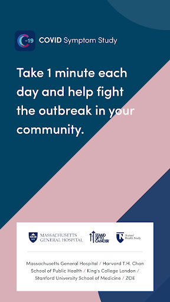  | 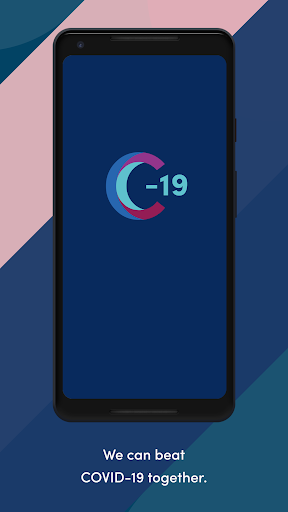  | 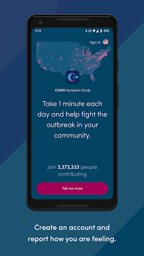  | 
 | 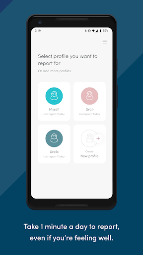  | 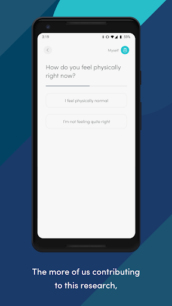  | 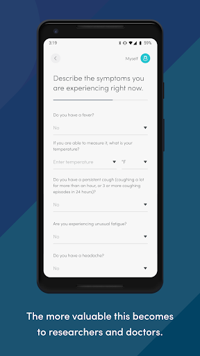  | 
 | 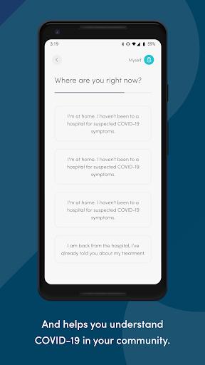  | 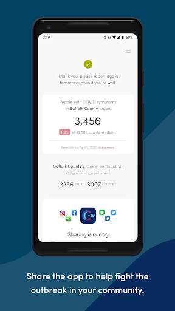 

## Development team
In the following we report the main information provided by the development team in the Google play store.

| | |
|-------------------------|-------------------------|
| **Developer**  | Zoe Global Limited |
| **Website**  | [http://covid.joinzoe.com/](http://covid.joinzoe.com/) |
| **Email** | covid@joinzoe.com |
| **Physical address**  | [164 Westminster Bridge Road London SE1 7RW United Kingdom](https://www.google.com/maps/search/164%20Westminster%20Bridge%20Road%20London%20SE1%207RW%20United%20Kingdom) (Google Maps) |
| **Other developed apps**  | [https://play.google.com/store/apps/developer?id=Zoe+Global+Limited](https://play.google.com/store/apps/developer?id=Zoe+Global+Limited) |

## Android support

| | |
|-------------------------|-------------------------|
| **Declared target Android version**  | Pie, version 9 (API level 28) |
| **Effective target Android version**  | Pie, version 9 (API level 28) |
| **Minimum supported Android version**  | Lollipop, version 5.0 (API level 21) |
| **Maximum target Android version**  | - |

The larger the difference between the minimum and maximum supported Android versions, the better. A larger difference means a wider audience. For example, old phones have a very low Android version, so a high minimum supported Android version means that the app cannot be used by users with old phones, thus leading to accessibility problems. 

## Requested permissions

In the following we report the complete list of the permissions requested by the app. 

| **Permission** | **Protection level** | **Description** | 
|-------------------------|-------------------------|-------------------------|
 **android.permission ACCESS_NETWORK_STATE** | Normal | Allows applications to access information about networks. 
 **android.permission ACCESS_WIFI_STATE** | Normal | Allows applications to access information about Wi-Fi networks. 
 **android.permission FOREGROUND_SERVICE** | Normal | Allows a regular application to use Service.startForeground. 
 **android.permission INTERNET** | Normal | Allows applications to open network sockets. 
 **android.permission MODIFY_AUDIO_SETTINGS** | Normal | Allows an application to modify global audio settings. 
 **android.permission RECEIVE_BOOT_COMPLETED** | Normal | Allows an application to receive the Intent.ACTION_BOOT_COMPLETED that is broadcast after the system finishes booting. 
 **android.permission REQUEST_INSTALL_PACKAGES** | Signature | Allows an application to request installing packages. 
 **android.permission STORAGE** | - | - 
 **android.permission SYSTEM_ALERT_WINDOW** | Signature - preinstalled - appop - pre23 - development | Allows an app to create windows using the type WindowManager.LayoutParams.TYPE_APPLICATION_OVERLAY, shown on top of all other apps. 
 **android.permission WAKE_LOCK** | Normal | Allows using PowerManager WakeLocks to keep processor from sleeping or screen from dimming. 
 **com.google.android.c2dm.permission RECEIVE** | - | - 
 **com.google.android.finsky.permission BIND_GET_INSTALL_REFERRER_SERVICE** | - | - 
 **com.joinzoe.covid_zoe.permission C2D_MESSAGE** | - | - 
 **host.exp.exponent.permission C2D_MESSAGE** | - | - 

## Mentioned servers

| **Server** | **Registrant** | **Registrant country** | **Creation date** | 
|-------------------------|-------------------------|-------------------------|-------------------------|
 | amplitude.com | Amplitude | :us: US | 1996-05-09 04:00:00 |
 | facebook.com | Facebook, Inc. | :us: US | 1997-03-29 05:00:00 |
 | google.com | Google LLC | :us: US | 1997-09-15 04:00:00 |
 | android.com | Google LLC | :us: US | 1997-06-23 04:00:00 |
 | googlesyndication.com | Google LLC | :us: US | 2003-01-21 06:17:24 |
 | googleapis.com | Google LLC | :us: US | 2005-01-25 17:52:26 |
 | w3.org | W3C | :us: US | 1994-07-06 04:00:00 |
 | doubleclick.net | Google Inc. | :us: US | 1996-01-16 05:00:00 |
 | gstatic.com | Google LLC | :us: US | 2008-02-11 15:31:25 |
 | googleapis.com | Google LLC | :us: US | 2005-01-25 17:52:26 |
 | app-measurement.com | Google LLC | :us: US | 2015-06-19 20:13:31 |
 | google-analytics.com | Google LLC | :us: US | 2005-07-18 19:24:32 |
 | segment.com | Domains By Proxy, LLC | :us: US | 1998-07-06 04:00:00 |
 | segment.io | Segment.io, Inc. | :us: US | 2011-10-01 04:10:05 |
 | expo.io | See PrivacyGuardian.org | :us: US | 2011-05-01 21:26:50 |
 | crashlytics.com | Google LLC | :us: US | 2011-01-21 15:30:40 |
 | cloudfront.net | Amazon.com, Inc. | :us: US | 2008-04-25 18:25:49 |
 | cloudfront.net | Amazon.com, Inc. | :us: US | 2008-04-25 18:25:49 |
 | googleadservices.com | Google LLC | :us: US | 2003-06-19 16:34:53 |

## Security analysis 

Below we report the main security warnings raised by our execution of the [Androwarn](https://github.com/maaaaz/androwarn) security analysis tool.

**Telephony identifiers leakage**
> - This application reads the ISO country code equivalent for the SIM provider's country code 
> - This application reads the ISO country code equivalent of the current registered operator's MCC (Mobile Country Code) 
> - This application reads the MCC+MNC of the provider of the SIM 
> - This application reads the Service Provider Name (SPN) 
> - This application reads the constant indicating the state of the device SIM card 
> - This application reads the device phone type value 
> - This application reads the numeric name (MCC+MNC) of current registered operator 
> - This application reads the operator name 
> - This application reads the radio technology (network type) currently in use on the device for data transmission 
> - This application reads the unique device ID, i.e the IMEI for GSM and the MEID or ESN for CDMA phones 

**Location lookup**
> - This application reads location information from all available providers (WiFi, GPS etc.) 

**Connection interfaces exfiltration**
> - This application reads details about the currently active data network 
> - This application tries to find out if the currently active data network is metered 

**Telephony services abuse**
> - This application makes phone calls 

**Audio video eavesdropping**
> - This application records audio from the 'CAMCORDER' source  
> - This application records audio from the 'DEFAULT' source  
> - This application records audio from the 'MIC' source  
> - This application captures video from the 'CAMERA' source 
> - This application captures video from the 'SURFACE' source 

**Suspicious connection establishment**
> - This application opens a Socket and connects it to the remote address '' on the 'N/A' port  
> - This application opens a Socket and connects it to the remote address 'Ljava/lang/StringBuilder;->toString()Ljava/lang/String;' on the ': connect, resolve' port  
> - This application opens a Socket and connects it to the remote address 'Ljava/lang/StringBuilder;->toString()Ljava/lang/String;' on the 'N/A' port  
> - This application opens a Socket and connects it to the remote address 'Ljava/net/Proxy;->type()Ljava/net/Proxy$Type;' on the 'N/A' port  
> - This application opens a Socket and connects it to the remote address 'timeout' on the 'N/A' port  

**Pim data leakage**
> - This application accesses data stored in the clipboard 

**Code execution**
> - This application loads a native library 
> - This application executes a UNIX command containing this argument: '2' 

## User ratings and reviews

Below we provide information about how end users are reacting to the app in terms of ratings and reviews in the Google Play store.

### Ratings

The COVID Symptom Study app has been installed by more than **1000000** times. At this time, **80321** rated the app and its average score is **4.6663737**. Below we show the distribution of the ratings across the usual star-based rating of Google Play

:star::star::star::star::star:: 58865

:star::star::star::star:: 17606

:star::star::star:: 2972

:star::star:: 262

:star:: 614

### Reviews 

#### 5-star reviews

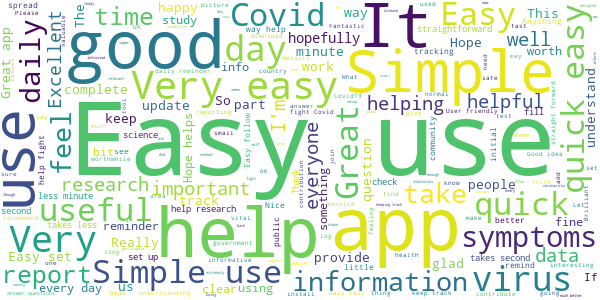

> Simple, quick, and clearly very important  :date: __2020-06-07 23:23:46__

> Very easy to use.  :date: __2020-06-07 23:08:42__

> Really easy to navigate all the questions.  :date: __2020-06-07 23:04:17__

> Extremely easy to use.  :date: __2020-06-07 22:19:33__

> Quick to report, easy to use  :date: __2020-06-07 22:16:12__

> Easy to use and informative  :date: __2020-06-07 22:12:29__

> Simple and quick to use  :date: __2020-06-07 21:31:39__

> Its been good  :date: __2020-06-07 21:23:34__

> Easy to use and once set up ok  :date: __2020-06-07 21:15:36__

> Easy to use  :date: __2020-06-07 21:11:04__

#### 4-star reviews

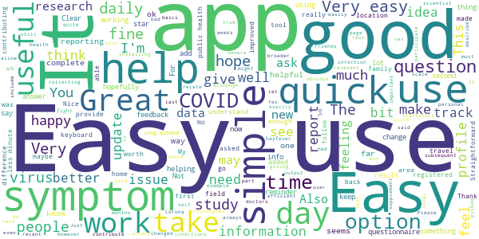

> It would be helpful to have an option to comment on ones health other than "feeling fine" or "not feeling fine".  :date: __2020-06-07 23:29:18__

> Fine, but people like me could do with an inbuilt reminder function. If course, one can take steps to do that for oneself! Just would help.  :date: __2020-06-07 20:33:28__

> Easy to use. I wish i could see more of the compiled data of other self reporters but i understand that could be misleading.  :date: __2020-06-07 19:58:41__

> Easy to use  :date: __2020-06-07 16:48:24__

> Easy to use. Although the Yes & No pop up a hair too easiky for someone who has to use a Stylus.  :date: __2020-06-07 15:56:06__

> Quietly, over time, builds a profile to help against the covid-19 epidemics.  :date: __2020-06-07 15:41:11__

> Straightforward questions. But some input fields are not designed well and make editing very difficult .. a basic form design error which should have been resolved during Beta Test.  :date: __2020-06-07 13:19:51__

> Easy to use  :date: __2020-06-07 12:20:23__

> Easy to use. Happy to feel I'm doing something to help.  :date: __2020-06-07 11:58:12__

> It would be good to be able to correct parts of med history  :date: __2020-06-07 11:14:31__

#### 3-star reviews

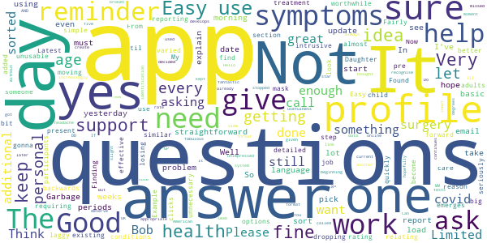

> In Denbigh early December a whole week in bed. Doctor came to me. I had gone 4 days not able to getup, eat or drink. Doctor if not improving in next 2 days off to hospital, pneumonia potential. He prescribed anti sickness tablets and anti biotics. I improved. I started with flu like symptoms. However I was struggling for breath, had loss of feeling in my finger tips, felt dreadful. I was at work and had to return home after 2 hours. Lacking in energy. Off work for 3 weeks. Need more space !  :date: __2020-06-07 12:13:51__

> Doesnt always prompt user to report.  :date: __2020-06-07 11:45:51__

> Not always clear if data has been submitted.  :date: __2020-06-07 09:29:11__

> OK but a bit clunky (e.g. why ask me every time if I've *ever* had a test, a daily notification /reminder to report in would be useful)  :date: __2020-06-06 22:38:56__

> I do not get any feedback. Trying to help with info, but the lack of any feedback is making it more of a chore each day. I will continue but, just letting you know I find it difficult to "recommend" this app. John Campbell COVID videos recommended...that is why I am participating.  :date: __2020-06-06 21:39:31__

> Not bad for a first attempt.  :date: __2020-06-06 10:25:02__

> Is easy to use, simple q's, not at all confusing. Reliable, doesn't crash or need weird permissions. Downside is that it doesn't give much info back on how the country as a whole is doing....that would be nice to know if it is safe out there....obviously totally ignoring this incompetent murderous governments advice due to it killing so many tens of thousands of us thru delay, incompetence and inaction  :date: __2020-06-05 15:19:55__

> Not sure why I'm using it ...is it track and trace?  :date: __2020-06-04 11:59:59__

> Unresponsive to yes/no drop down. Check box would be better  :date: __2020-06-04 01:16:07__

> Very boring app, but I hope it is useful.  :date: __2020-06-03 15:56:24__

#### 2-star reviews

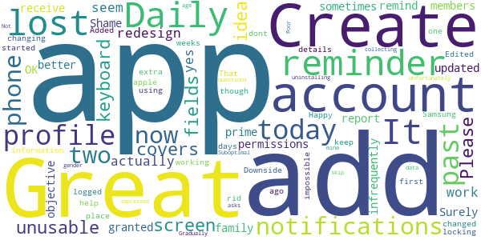

> Is this the app the government want us to install, I've seen so many?  :date: __2020-06-07 22:13:53__

> Good idea but bad user experience. Unnecessary clicks by asking every single day if you've been tested for the virus. Also the arrival screen (the blue one with the button to report is) is messy.  :date: __2020-06-07 15:50:07__

> Hold lot of junk mail since got this. Avoid !!  :date: __2020-06-05 17:25:30__

> App was working when we entered dailey report. The last two days, when we logged on, it showed that we had already reported our status?  :date: __2020-06-04 10:33:56__

> Not started yet glitches on it  :date: __2020-06-01 23:55:15__

> It seems a good idea but I haven't used the site log enough to form an opinlon  :date: __2020-05-29 19:39:40__

#### 1-star reviews

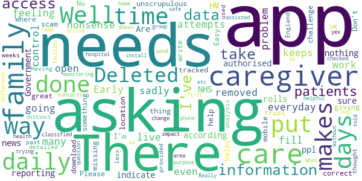

> Useful app, however very difficult to find. When typing in 'COVID' or 'corona' in the Google play browser this app does not show up. These tags/search phrases should be added for a wider reach  :date: __2020-06-07 21:09:19__

> I did not ask to get question about my heath.  :date: __2020-06-07 11:17:07__

> Pretty basic and no way to put past episodes in, missed my March bout of Covid apart from start date.  :date: __2020-06-06 18:17:51__

> Okay to use  :date: __2020-06-06 12:09:24__

> Why can't I pick the language? I live in Sweden but I don't speak Swedish. The app supports English language.  :date: __2020-06-03 10:38:46__

> You've stopped me reporting because having said I'm interested to the "want a test ... Help vital research" I have to have read a data sheet from 27th which I haven't received, but there is no option to report unless i click take part which I would do if I could day I've read the data sheet which I don't have. Catch 22, can't proceed so can't even report as normal. Fundamental software bug  :date: __2020-06-02 12:33:41__

> Well this app is not what it makes out to be, no control.over how many times you can fill out daily. It's a nonsense .  :date: __2020-05-31 09:46:05__

> Asking you to put how your feeling everyday is not a problem but then it keeps asking even when done. I don't have time for this so removed it. Well done for your attempts but sadly needs more work before going live.  :date: __2020-05-30 11:44:49__

> Early days  :date: __2020-05-30 00:41:54__

