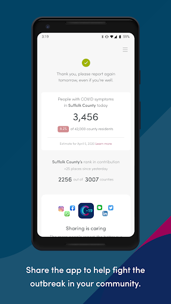
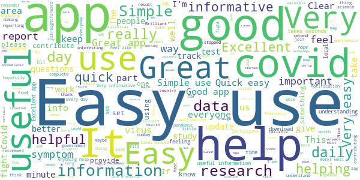
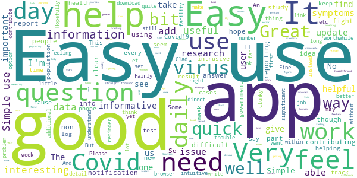
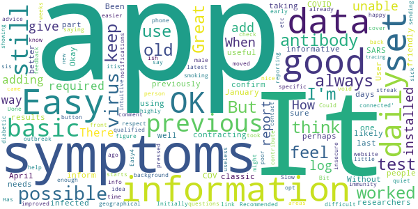
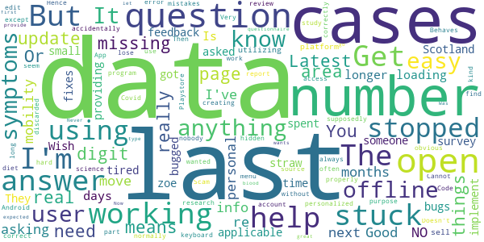

# COVID Symptom Study
App version ``0.14``

Analyzed with [covid-apps-observer](http://github.com/covid-apps-observer) project, version ``0.1``

## App overview
| | |
|-------------------------|-------------------------| 
| **Name**&nbsp;&nbsp;&nbsp;&nbsp;&nbsp;&nbsp;&nbsp;&nbsp;&nbsp;&nbsp;&nbsp;&nbsp;&nbsp;&nbsp;&nbsp;&nbsp;&nbsp;&nbsp;&nbsp;&nbsp;&nbsp;&nbsp;&nbsp;&nbsp;&nbsp;&nbsp;&nbsp;&nbsp;&nbsp;&nbsp;&nbsp;&nbsp;&nbsp;&nbsp;&nbsp;&nbsp;&nbsp;&nbsp;&nbsp;&nbsp;  | COVID Symptom Study |
| **Unique identifier** | com.joinzoe.covid_zoe |
| **Link to Google Play** | [https://play.google.com/store/apps/details?id=com.joinzoe.covid_zoe](https://play.google.com/store/apps/details?id=com.joinzoe.covid_zoe) |
| **Summary**  | Help slow COVID-19 by self-reporting your symptoms daily, even if you feel well. |
| **Privacy policy** | [https://predict.study/covid-privacy-notice/](https://predict.study/covid-privacy-notice/) |
| **Latest version** | 0.14 |
| **Last update** | 2020-06-10 09:47:22 |
| **Recent changes** | Support US Spanish Add Hayfever questions Add Atopy questions Make Isolation frequency questions optional, and appear weekly Add vitamin supplement question Fix yesterday/today issues with last updated profile dates Add offline and server-outage error handling Overhaul Covid tests screen to support multiple tests Update thank you / confirmation screen |
| **Installs**  | 1,000,000+ |
| **Category** | Health & Fitness |
| **First release** | Mar 20, 2020 |
| **Size**  | 51M |
| **Supported Android version**  | 5.0 and up |

### Description
> Take 1 minute each day and help fight the spread of COVID-19 in your community
 * Report your health daily even if you feel well
 * Get a daily estimate of COVID in your area
 * Help slow the outbreak near you
 Join millions of people supporting scientists at Stanford University, Harvard University, Massachusetts General Hospital, and King's College London to help fight coronavirus by identifying:
 * How fast the virus is spreading in your area
 * High-risk areas in the US
 * Who is most at risk, by better understanding symptoms linked to underlying health conditions
 You will contribute to advance research on COVID-19 in partnership with leading health researchers globally like TwinsUK, one of the most clinically detailed studies in the world.
 This app (formerly known as the Covid Symptom Tracker) allows you to help others, but does not give health advice. If you need health advice please visit the CDC website at: [https://www.cdc.gov/coronavirus/2019-ncov/index.html](https://www.cdc.gov/coronavirus/2019-ncov/index.html)
 This app has been designed for everyone to report their status not just those who are ill.
 It was designed by doctors and scientists at King's College London, Guys and St Thomas’ Hospitals and Zoe Global Limited, a health technology company.
 In the US the app is being used by the Nurses' Health Study to identify symptoms in active healthcare workers who are treating people with COVID across the country and risking their own health to help us.
 In response to recommendations by Stand Up To Cancer (SU2C), the app also includes questions for cancer patients and survivors, such as if they are living with cancer, what type of cancer and what treatment they are receiving.
 If you would like to help out in this difficult time, then you can. Download the app and share daily your own status, even if you are well. With your help we can understand much better the situation across the nation, how the disease presents itself to different people, and how it progresses.
 This is a new virus which the world has never seen before. There are a wide range of symptoms, which differ between people. With your help we can understand better how the disease presents itself depending upon individual factors such as health and age.
 No information you share will be used for commercial purposes.
 There are two parts to the app:
 HEALTH INFORMATION
 You will be asked to share some general information, such as your age and some health details, such as whether you have certain diseases.
 SYMPTOM TRACKING
 We will ask you every day to let us know how you feel, so you can share your symptoms. We will also ask whether you have visited the hospital, what treatment you received there, and whether you have been tested for COVID-19 (Coronavirus).

### User interface
The developers of the app provide the following screenshots in the Google play store.
| | | |
|:-------------------------:|:-------------------------:|:-------------------------:|
 |   |   |   | 
 |   |   |   | 
 |   |  

## Development team
In the following we report the main information provided by the development team in the Google play store.

| | |
|-------------------------|-------------------------|
| **Developer**  | Zoe Global Limited |
| **Website**  | [http://covid.joinzoe.com/](http://covid.joinzoe.com/) |
| **Email** | covid@joinzoe.com |
| **Physical address**  | [164 Westminster Bridge Road London SE1 7RW United Kingdom](https://www.google.com/maps/search/164%20Westminster%20Bridge%20Road%20London%20SE1%207RW%20United%20Kingdom) (Google Maps) |
| **Other developed apps**  | [https://play.google.com/store/apps/developer?id=Zoe+Global+Limited](https://play.google.com/store/apps/developer?id=Zoe+Global+Limited) |

## Android support

| | |
|-------------------------|-------------------------|
| **Declared target Android version**  | Pie, version 9 (API level 28) |
| **Effective target Android version**  | Pie, version 9 (API level 28) |
| **Minimum supported Android version**  | Lollipop, version 5.0 (API level 21) |
| **Maximum target Android version**  | - |

The larger the difference between the minimum and maximum supported Android versions, the better. A larger difference means a wider audience. For example, old phones have a very low Android version, so a high minimum supported Android version means that the app cannot be used by users with old phones, thus leading to accessibility problems. 

## Requested permissions

In the following we report the complete list of the permissions requested by the app. 

| **Permission** | **Protection level** | **Description** | 
|-------------------------|-------------------------|-------------------------|
 **android.permission ACCESS_NETWORK_STATE** | Normal | Allows applications to access information about networks. 
 **android.permission ACCESS_WIFI_STATE** | Normal | Allows applications to access information about Wi-Fi networks. 
 **android.permission FOREGROUND_SERVICE** | Normal | Allows a regular application to use Service.startForeground. 
 **android.permission INTERNET** | Normal | Allows applications to open network sockets. 
 **android.permission MODIFY_AUDIO_SETTINGS** | Normal | Allows an application to modify global audio settings. 
 **android.permission RECEIVE_BOOT_COMPLETED** | Normal | Allows an application to receive the Intent.ACTION_BOOT_COMPLETED that is broadcast after the system finishes booting. 
 **android.permission REQUEST_INSTALL_PACKAGES** | Signature | Allows an application to request installing packages. 
 **android.permission STORAGE** | - | - 
 **android.permission SYSTEM_ALERT_WINDOW** | Signature - preinstalled - appop - pre23 - development | Allows an app to create windows using the type WindowManager.LayoutParams.TYPE_APPLICATION_OVERLAY, shown on top of all other apps. 
 **android.permission WAKE_LOCK** | Normal | Allows using PowerManager WakeLocks to keep processor from sleeping or screen from dimming. 
 **com.google.android.c2dm.permission RECEIVE** | - | - 
 **com.google.android.finsky.permission BIND_GET_INSTALL_REFERRER_SERVICE** | - | - 
 **com.joinzoe.covid_zoe.permission C2D_MESSAGE** | - | - 
 **host.exp.exponent.permission C2D_MESSAGE** | - | - 

## Mentioned servers

| **Server** | **Registrant** | **Registrant country** | **Creation date** | 
|-------------------------|-------------------------|-------------------------|-------------------------|
 | amplitude.com | Amplitude | :us: US | 1996-05-09 04:00:00 |
 | facebook.com | Facebook, Inc. | :us: US | 1997-03-29 05:00:00 |
 | google.com | Google LLC | :us: US | 1997-09-15 04:00:00 |
 | android.com | Google LLC | :us: US | 1997-06-23 04:00:00 |
 | googlesyndication.com | Google LLC | :us: US | 2003-01-21 06:17:24 |
 | googleapis.com | Google LLC | :us: US | 2005-01-25 17:52:26 |
 | w3.org | W3C | :us: US | 1994-07-06 04:00:00 |
 | doubleclick.net | Google Inc. | :us: US | 1996-01-16 05:00:00 |
 | gstatic.com | Google LLC | :us: US | 2008-02-11 15:31:25 |
 | googleapis.com | Google LLC | :us: US | 2005-01-25 17:52:26 |
 | app-measurement.com | Google LLC | :us: US | 2015-06-19 20:13:31 |
 | google-analytics.com | Google LLC | :us: US | 2005-07-18 19:24:32 |
 | segment.com | Domains By Proxy, LLC | :us: US | 1998-07-06 04:00:00 |
 | segment.io | Segment.io, Inc. | :us: US | 2011-10-01 04:10:05 |
 | expo.io | See PrivacyGuardian.org | :us: US | 2011-05-01 21:26:50 |
 | crashlytics.com | Google LLC | :us: US | 2011-01-21 15:30:40 |
 | cloudfront.net | Amazon.com, Inc. | :us: US | 2008-04-25 18:25:49 |
 | cloudfront.net | Amazon.com, Inc. | :us: US | 2008-04-25 18:25:49 |
 | googleadservices.com | Google LLC | :us: US | 2003-06-19 16:34:53 |

## Security analysis 

Below we report the main security warnings raised by our execution of the [Androwarn](https://github.com/maaaaz/androwarn) security analysis tool.

**Telephony identifiers leakage**
> - This application reads the ISO country code equivalent for the SIM provider's country code 
> - This application reads the ISO country code equivalent of the current registered operator's MCC (Mobile Country Code) 
> - This application reads the MCC+MNC of the provider of the SIM 
> - This application reads the Service Provider Name (SPN) 
> - This application reads the constant indicating the state of the device SIM card 
> - This application reads the device phone type value 
> - This application reads the numeric name (MCC+MNC) of current registered operator 
> - This application reads the operator name 
> - This application reads the radio technology (network type) currently in use on the device for data transmission 
> - This application reads the unique device ID, i.e the IMEI for GSM and the MEID or ESN for CDMA phones 

**Location lookup**
> - This application reads location information from all available providers (WiFi, GPS etc.) 

**Connection interfaces exfiltration**
> - This application reads details about the currently active data network 
> - This application tries to find out if the currently active data network is metered 

**Telephony services abuse**
> - This application makes phone calls 

**Audio video eavesdropping**
> - This application records audio from the 'CAMCORDER' source  
> - This application records audio from the 'DEFAULT' source  
> - This application records audio from the 'MIC' source  
> - This application captures video from the 'CAMERA' source 
> - This application captures video from the 'SURFACE' source 

**Suspicious connection establishment**
> - This application opens a Socket and connects it to the remote address '' on the 'N/A' port  
> - This application opens a Socket and connects it to the remote address 'Ljava/lang/StringBuilder;->toString()Ljava/lang/String;' on the ': connect, resolve' port  
> - This application opens a Socket and connects it to the remote address 'Ljava/lang/StringBuilder;->toString()Ljava/lang/String;' on the 'N/A' port  
> - This application opens a Socket and connects it to the remote address 'Ljava/net/Proxy;->type()Ljava/net/Proxy$Type;' on the 'N/A' port  
> - This application opens a Socket and connects it to the remote address 'timeout' on the 'N/A' port  

**Pim data leakage**
> - This application accesses data stored in the clipboard 

**Code execution**
> - This application loads a native library 
> - This application executes a UNIX command containing this argument: '2' 

## User ratings and reviews

Below we provide information about how end users are reacting to the app in terms of ratings and reviews in the Google Play store.

### Ratings

The COVID Symptom Study app has been installed by more than **1000000** times. At this time, **91794** rated the app and its average score is **4.6830335**. Below we show the distribution of the ratings across the usual star-based rating of Google Play

:star::star::star::star::star:: 67946

:star::star::star::star:: 20081

:star::star::star:: 2814

:star::star:: 420

:star:: 530

### Reviews 

#### 5-star reviews

> Quick and easy to use  :date: __2020-10-24 09:21:02__

> Easy to use.  :date: __2020-10-24 03:42:09__

> Easy  :date: __2020-10-23 23:54:55__

> Like being able to check the rate in my locality  :date: __2020-10-23 23:23:40__

> Informative, and nice to know I'm helping in some small way to aid science in fight against coronavirus  :date: __2020-10-23 23:21:42__

> Simple to do.  :date: __2020-10-23 21:34:43__

> Easy to report, lots of up to date information.  :date: __2020-10-23 21:18:36__

> Easy and quick to use.  :date: __2020-10-23 19:57:50__

> Very quick and easy to use. Shares data on the pandemic  :date: __2020-10-23 19:48:18__

> Good  :date: __2020-10-23 16:52:11__

#### 4-star reviews

> Good  :date: __2020-10-23 21:39:49__

> It's taken me 4 days to relise I need to scroll down to respnd & submit (this is the first time I've ever used an app _ I can't even find the Govnt one!)  :date: __2020-10-23 20:16:08__

> Fair.  :date: __2020-10-23 19:20:49__

> Easy to use  :date: __2020-10-23 17:47:11__

> Questions require yes/no answers which isn't always appropriate. No facility to give a degree - eg mild, severe, constant or infrequent. This could be better recorded as a scale of 1 -10.  :date: __2020-10-23 16:21:37__

> Been working well since i downloaded, but I had to uninstall and re-install today due to a failure to open after a notification was received to record daily symptoms.  :date: __2020-10-23 14:22:15__

> Easy to use and very informative 👌  :date: __2020-10-23 12:16:50__

> Helpful but could be more obvious how to report. New to the app and didn't find reporting easy  :date: __2020-10-23 12:07:04__

> Good that it usually takes just a minute  :date: __2020-10-23 00:11:16__

> Ok  :date: __2020-10-22 23:35:52__

#### 3-star reviews

> Provides us with comfort. Keep it up.  :date: __2020-10-23 19:47:13__

> Didn't work so had to uninstall then start again new password etc. If it happens again wil l uninstall although you are doing a great job  :date: __2020-10-22 20:06:07__

> Stopped working yesterday  :date: __2020-10-19 07:49:58__

> Functional.  :date: __2020-10-18 12:32:19__

> Ok for 2 weeks, then app terminally failed, just showing blank white screen. Had to reinstall it which is hard as it doesn't come up when searching Play Store.  :date: __2020-10-17 13:38:17__

> Was working great, now I can't scroll through the covid tests to select the latest to give results, all you get is the first 3 tests.... I've had 16. Bit pointless having the test part of you can't add the result when you get it.  :date: __2020-10-16 15:18:29__

> Ok, but have to input the same info dob, height and weight eveytime.?  :date: __2020-10-16 12:01:10__

> Difficulty getting App to work for few days. Had to uninstall and then install again. Does not always seem to register the information I put in.  :date: __2020-10-15 15:36:36__

> Can't always move on to next question or page  :date: __2020-10-15 13:39:33__

> Does not always log the entries one makes - several times it has told me incorrectly that I have not replied for one or two days. No opportunity for making comments: I wanted to tell it that I had had antibody tests for research purposes (Biobank) but would not be told the results but could not do so - the only option was to record a "failed test".  :date: __2020-10-15 13:14:01__

#### 2-star reviews

> The app is good bit it's missing one digit off all the numbers. So it looks like there are just 75 cases of covid locally but it must be 750+. I know this as I can see numbers like 4,560,09 please fix it!  :date: __2020-10-23 00:44:08__

> Rubbish! The app will not move past the test questions. Constantly asks for new test info. Cannot complete the process.I have uninstalled it, that is how I deal with apps that do not work!  :date: __2020-10-17 12:01:04__

> Bugs that mean you can't fill things out properly are frustrating. I spent a long time answering multiple questions it was a little unclear that I was supposed to be focusing on pre covid and that there would be a second set of questions but like many friends of mine when arriving at the questions to answer for during lockdown the software froze and I could only exit in the hope I could go back but unfortunately exiting meant I no longer had an option to finish the survey  :date: __2020-10-15 20:52:09__

> Have been using for months, suddenly stopped loading. Have uninstalled and reinstalled but still get blank white screen.  :date: __2020-10-15 09:40:26__

> I kept trying to check in but was given all the registration questions every day, not just the symptom check, which was really annoying. So I reinstalled the app, created a new account and it worked for one day, but now I can't even get into the app, just get a white screen. How is it so broken?  :date: __2020-10-15 09:07:27__

> Suddenly stopped working.  :date: __2020-10-14 17:08:38__

> What am I missing?? When I click on Report Today in the main screen and I keep getting every day the same exhausting set of general health questions and have to complete my height, weight etc. Where are the questions about COVID-19 symptoms?  :date: __2020-10-10 11:07:41__

> App has been missing the last digit off figures for over 2 months now. Sent screenshots to the developer 3 weeks ago but nothing has changed. E.g. 234 cases in my area show as 23.  :date: __2020-10-07 23:41:52__

> Confusing and being forced through pages every day that have already been read.  :date: __2020-09-29 12:34:32__

#### 1-star reviews

> Registered on the app from day 1 of its release, told daily how i felt then added my partner, we both used the app to track how we were feeling while Sheilding. 6 month's taking part in the study, then suddenly on the12th October the app would not open. Lost months of daily log in. Tried to open app, but it's as if im using it for the first time. Still get regular emails saying to keep up the good work of logging in, even if your feeling well. Its a good concept, I didn't expect it to crash.  :date: __2020-10-20 01:46:27__

> Sadly unusable now as it won't let me or my wife log in or create a new account. Keep getting a 403 error.  :date: __2020-10-19 22:03:10__

> Doing a wonderful job. Only one star to try to alert a bug. It is possible to report with no internet connection. The report is also accepted. I have missed several days due to this bug before working out what was going on. Otherwise totally brilliant. Please respond as I want to amend this back to 5 stars. Thank you very much. 👍  :date: __2020-10-18 17:14:41__

> App seems fine for what it is. One thing I noticed is last question relates only too people who are at home or hospital. I think it should include people like myself who are working still. Although I'm not nhs , I think it will add a broader idea as too how the virus travels if you include working people and thier profession. *Edit* Uninstalling due too the recent email advertisement from ex pm wife's company. I installed app too help out with daily health updates. Not too further her portfolio.  :date: __2020-10-18 15:00:06__

> App will no longer open, just a white screen. Tried clearing cache, shutting down to no effect.  :date: __2020-10-15 11:26:15__

> My partner has a problem with the app (which is up to date) on her Motorola phone. After only 3 reported tests the screen is not showing any more as the available space has been filled, it just shows the "Is this list correct" button at the bottom and the "Add new test" at the top of the list. It won't scroll to show the other tests she's added or the new one she just added and there's no way to reduce the font size to get more in. It's stressing her out HELP  :date: __2020-10-15 09:19:25__

> I've used it for weeks, now it will not go further than showing the logo, then blanc screen. Tried reinstall and restarts of phone.  :date: __2020-10-15 08:48:11__

> App has stopped loading, just getting a blank white screen.  :date: __2020-10-15 08:32:15__

> App has suddenly stopped working on a Honor View 20 running Android 10.  :date: __2020-10-15 08:09:53__

> Can no longer get app to load . Tried reinstalling but get white screen and won't progress further. Its been working fine up until now. Galaxy note 9  :date: __2020-10-15 07:00:41__

