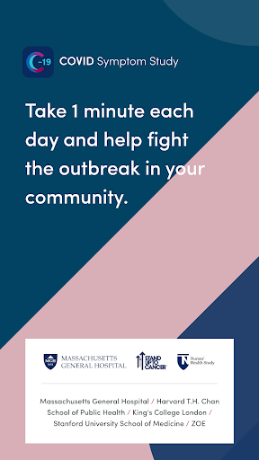
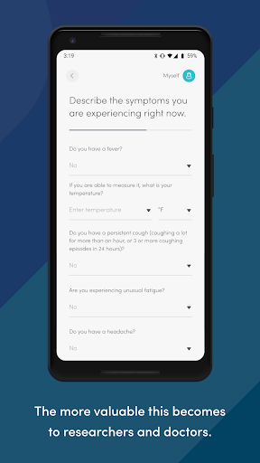
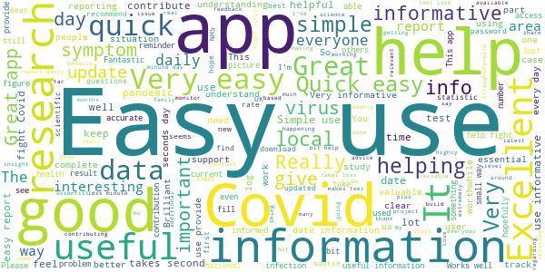
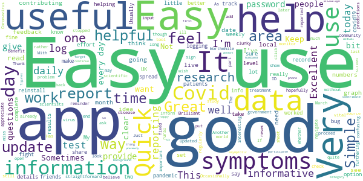
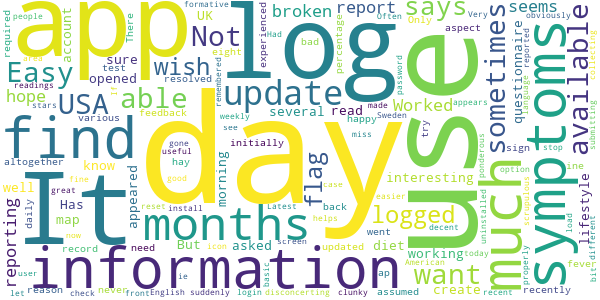
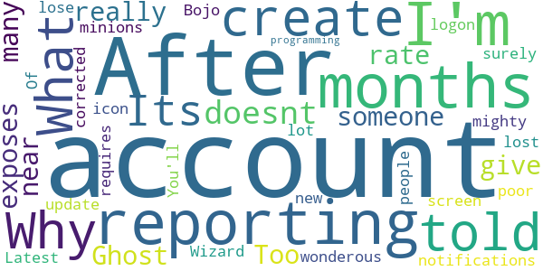
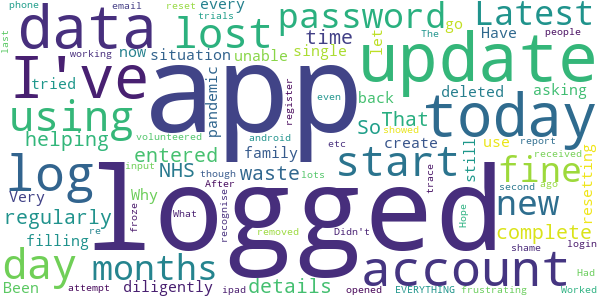

# COVID Symptom Study
App version ``2.0.0``

Analyzed with [covid-apps-observer](http://github.com/covid-apps-observer) project, version ``0.1``

## App overview
| | |
|-------------------------|-------------------------| 
| **Name**&nbsp;&nbsp;&nbsp;&nbsp;&nbsp;&nbsp;&nbsp;&nbsp;&nbsp;&nbsp;&nbsp;&nbsp;&nbsp;&nbsp;&nbsp;&nbsp;&nbsp;&nbsp;&nbsp;&nbsp;&nbsp;&nbsp;&nbsp;&nbsp;&nbsp;&nbsp;&nbsp;&nbsp;&nbsp;&nbsp;&nbsp;&nbsp;&nbsp;&nbsp;&nbsp;&nbsp;&nbsp;&nbsp;&nbsp;&nbsp;  | COVID Symptom Study |
| **Unique identifier** | com.joinzoe.covid_zoe |
| **Link to Google Play** | [https://play.google.com/store/apps/details?id=com.joinzoe.covid_zoe](https://play.google.com/store/apps/details?id=com.joinzoe.covid_zoe) |
| **Summary**  | Help slow COVID-19 by self-reporting your symptoms daily, even if you feel well. |
| **Privacy policy** | [https://predict.study/covid-privacy-notice/](https://predict.study/covid-privacy-notice/) |
| **Latest version** | 2.0.0 |
| **Last update** | 2020-11-13 19:03:37 |
| **Recent changes** | - Introduced new Schools Communities feature-set to help schools safeguard children via parents logging their children&#39;s health and COVID tests against school bubbles. - Added Trendlines showing how the # of active cases changes over time, personalised to your postcode. - Added Map showing the # of active cases in your area compared to areas near you. - Improved the Daily Reporting questions. - Introduced ability for users to Edit Location. |
| **Installs**  | 1,000,000+ |
| **Category** | Health & Fitness |
| **First release** | Mar 20, 2020 |
| **Size**  | 35M |
| **Supported Android version**  | 5.0 and up |

### Description
> Take 1 minute each day and help fight the spread of COVID-19 in your community
 * Report your health daily even if you feel well
 * Get a daily estimate of COVID in your area
 * Help slow the outbreak near you
 Join millions of people supporting scientists at Stanford University, Harvard University, Massachusetts General Hospital, and King's College London to help fight coronavirus by identifying:
 * How fast the virus is spreading in your area
 * High-risk areas in the US
 * Who is most at risk, by better understanding symptoms linked to underlying health conditions
 You will contribute to advance research on COVID-19 in partnership with leading health researchers globally like TwinsUK, one of the most clinically detailed studies in the world.
 This app (formerly known as the Covid Symptom Tracker) allows you to help others, but does not give health advice. If you need health advice please visit the CDC website at: [https://www.cdc.gov/coronavirus/2019-ncov/index.html](https://www.cdc.gov/coronavirus/2019-ncov/index.html)
 This app has been designed for everyone to report their status not just those who are ill.
 It was designed by doctors and scientists at King's College London, Guys and St Thomas’ Hospitals and Zoe Global Limited, a health technology company.
 In the US the app is being used by the Nurses' Health Study to identify symptoms in active healthcare workers who are treating people with COVID across the country and risking their own health to help us.
 In response to recommendations by Stand Up To Cancer (SU2C), the app also includes questions for cancer patients and survivors, such as if they are living with cancer, what type of cancer and what treatment they are receiving.
 If you would like to help out in this difficult time, then you can. Download the app and share daily your own status, even if you are well. With your help we can understand much better the situation across the nation, how the disease presents itself to different people, and how it progresses.
 This is a new virus which the world has never seen before. There are a wide range of symptoms, which differ between people. With your help we can understand better how the disease presents itself depending upon individual factors such as health and age.
 No information you share will be used for commercial purposes.
 There are two parts to the app:
 HEALTH INFORMATION
 You will be asked to share some general information, such as your age and some health details, such as whether you have certain diseases.
 SYMPTOM TRACKING
 We will ask you every day to let us know how you feel, so you can share your symptoms. We will also ask whether you have visited the hospital, what treatment you received there, and whether you have been tested for COVID-19 (Coronavirus).

### User interface
The developers of the app provide the following screenshots in the Google play store.
| | | |
|:-------------------------:|:-------------------------:|:-------------------------:|
 |   |   |   | 
 |   |   |   | 
 |   |  

## Development team
In the following we report the main information provided by the development team in the Google play store.

| | |
|-------------------------|-------------------------|
| **Developer**  | Zoe Global Limited |
| **Website**  | [http://covid.joinzoe.com/](http://covid.joinzoe.com/) |
| **Email** | covid@joinzoe.com |
| **Physical address**  | [164 Westminster Bridge Road London SE1 7RW United Kingdom](https://www.google.com/maps/search/164%20Westminster%20Bridge%20Road%20London%20SE1%207RW%20United%20Kingdom) (Google Maps) |
| **Other developed apps**  | [https://play.google.com/store/apps/developer?id=Zoe+Global+Limited](https://play.google.com/store/apps/developer?id=Zoe+Global+Limited) |

## Android support

| | |
|-------------------------|-------------------------|
| **Declared target Android version**  | Android10, version 10 (API level 29) |
| **Effective target Android version**  | Android10, version 10 (API level 29) |
| **Minimum supported Android version**  | Lollipop, version 5.0 (API level 21) |
| **Maximum target Android version**  | - |

The larger the difference between the minimum and maximum supported Android versions, the better. A larger difference means a wider audience. For example, old phones have a very low Android version, so a high minimum supported Android version means that the app cannot be used by users with old phones, thus leading to accessibility problems. 

## Requested permissions

In the following we report the complete list of the permissions requested by the app. 

| **Permission** | **Protection level** | **Description** | 
|-------------------------|-------------------------|-------------------------|
 **android.permission ACCESS_BACKGROUND_LOCATION** | :warning:**Dangerous** | Allows an app to access location in the background. 
 **android.permission ACCESS_COARSE_LOCATION** | :warning:**Dangerous** | Allows an app to access approximate location. 
 **android.permission ACCESS_FINE_LOCATION** | :warning:**Dangerous** | Allows an app to access precise location. 
 **android.permission ACCESS_NETWORK_STATE** | Normal | Allows applications to access information about networks. 
 **android.permission CAMERA** | :warning:**Dangerous** | Required to be able to access the camera device. 
 **android.permission FOREGROUND_SERVICE** | Normal | Allows a regular application to use Service.startForeground. 
 **android.permission INTERNET** | Normal | Allows applications to open network sockets. 
 **android.permission MANAGE_DOCUMENTS** | Undefined | Allows an application to manage access to documents, usually as part of a document picker. 
 **android.permission MODIFY_AUDIO_SETTINGS** | Normal | Allows an application to modify global audio settings. 
 **android.permission READ_CALENDAR** | :warning:**Dangerous** | Allows an application to read the user's calendar data. 
 **android.permission READ_CONTACTS** | :warning:**Dangerous** | Allows an application to read the user's contacts data. 
 **android.permission READ_EXTERNAL_STORAGE** | :warning:**Dangerous** | Allows an application to read from external storage. 
 **android.permission READ_INTERNAL_STORAGE** | - | - 
 **android.permission READ_PHONE_STATE** | :warning:**Dangerous** | Allows read only access to phone state, including the phone number of the device, current cellular network information, the status of any ongoing calls, and a list of any PhoneAccounts registered on the device. 
 **android.permission RECORD_AUDIO** | :warning:**Dangerous** | Allows an application to record audio. 
 **android.permission SYSTEM_ALERT_WINDOW** | Signature - preinstalled - appop - pre23 - development | Allows an app to create windows using the type WindowManager.LayoutParams.TYPE_APPLICATION_OVERLAY, shown on top of all other apps. 
 **android.permission USE_FINGERPRINT** | Normal | This constant was deprecated in API level 28. Applications should request USE_BIOMETRIC instead 
 **android.permission VIBRATE** | Normal | Allows access to the vibrator. 
 **android.permission WAKE_LOCK** | Normal | Allows using PowerManager WakeLocks to keep processor from sleeping or screen from dimming. 
 **android.permission WRITE_CALENDAR** | :warning:**Dangerous** | Allows an application to write the user's calendar data. 
 **android.permission WRITE_EXTERNAL_STORAGE** | :warning:**Dangerous** | Allows an application to write to external storage. 
 **android.permission WRITE_SETTINGS** | Signature - preinstalled - appop - pre23 | Allows an application to read or write the system settings. 
 **com.google.android.c2dm.permission RECEIVE** | - | - 
 **com.google.android.gms.permission ACTIVITY_RECOGNITION** | - | - 
 **com.google.android.providers.gsf.permission READ_GSERVICES** | - | - 

## Mentioned servers

| **Server** | **Registrant** | **Registrant country** | **Creation date** | 
|-------------------------|-------------------------|-------------------------|-------------------------|
 | amplitude.com | Amplitude | :us: US | 1996-05-09 04:00:00 |
 | android.com | Google LLC | :us: US | 1997-06-23 04:00:00 |
 | google.com | Google LLC | :us: US | 1997-09-15 04:00:00 |
 | microsoft.com | Microsoft Corporation | :us: US | 1991-05-02 04:00:00 |
 | cloudfront.net | Amazon.com, Inc. | :us: US | 2008-04-25 18:25:49 |
 | googleapis.com | Google LLC | :us: US | 2005-01-25 17:52:26 |
 | expo.io | See PrivacyGuardian.org | :us: US | 2011-05-01 21:26:50 |

## Security analysis 

Below we report the main security warnings raised by our execution of the [Androwarn](https://github.com/maaaaz/androwarn) security analysis tool.

**Telephony identifiers leakage**
> - This application reads the ISO country code equivalent of the current registered operator's MCC (Mobile Country Code) 
> - This application reads the device phone type value 
> - This application reads the numeric name (MCC+MNC) of current registered operator 
> - This application reads the operator name 

**Location lookup**
> - This application reads location information from all available providers (WiFi, GPS etc.) 

**Connection interfaces exfiltration**
> - This application reads details about the currently active data network 
> - This application tries to find out if the currently active data network is metered 

**Suspicious connection establishment**
> - This application opens a Socket and connects it to the remote address '' on the 'N/A' port  
> - This application opens a Socket and connects it to the remote address 'Ljava/lang/StringBuilder;->toString()Ljava/lang/String;' on the ': connect, resolve' port  
> - This application opens a Socket and connects it to the remote address 'Ljava/lang/StringBuilder;->toString()Ljava/lang/String;' on the 'N/A' port  
> - This application opens a Socket and connects it to the remote address 'Ljava/net/Proxy;->type()Ljava/net/Proxy$Type;' on the 'N/A' port  
> - This application opens a Socket and connects it to the remote address 'timeout' on the 'N/A' port  

**Pim data leakage**
> - This application accesses data stored in the clipboard 

**Code execution**
> - This application loads a native library 
> - This application executes a UNIX command 

## User ratings and reviews

Below we provide information about how end users are reacting to the app in terms of ratings and reviews in the Google Play store.

### Ratings

The COVID Symptom Study app has been installed by more than **1000000** times. At this time, **116844** rated the app and its average score is **4.7540874**. Below we show the distribution of the ratings across the usual star-based rating of Google Play

:star::star::star::star::star:: 93031

:star::star::star::star:: 20637

:star::star::star:: 2118

:star::star:: 376

:star:: 682

### Reviews 

#### 5-star reviews

> Simple to use and very informative.  :date: __2020-11-16 09:56:38__

> The best information, that you can trust. Would recommend everyone to download this app.  :date: __2020-11-16 09:56:30__

> Provides useful info to the powers that be  :date: __2020-11-16 09:56:28__

> Easy and quick to use. Surprised that it is not growing faster. The data made available is very informative. Why has the govt never encouraged people to join? And would they manage the pandemic better if they gave more weight to the info you produce?  :date: __2020-11-16 09:55:50__

> Very easy to use. Used it everyday for my wife and I since March. Takes less than ONE minute for both.  :date: __2020-11-16 09:55:13__

> Easy to use and provides interesting data regarding infection rates.  :date: __2020-11-16 09:54:15__

> I enjoy being kept up to date with data for my area and nationally  :date: __2020-11-16 09:54:08__

> Easy to use. Hope it's making a difference.  :date: __2020-11-16 09:53:49__

> Apart from the overall progress in understanding Covid, on a purely personal level I find it useful to see info for local area and it seems a better guide to the state of play than the ONS and PHE figures  :date: __2020-11-16 09:53:29__

> Easy to use but a bit clunky. However it's essential research so happy with it  :date: __2020-11-16 09:52:24__

#### 4-star reviews

> Could as about whethere you may previously had c 19 symptoms  :date: __2020-11-16 09:55:27__

> Easy to use app  :date: __2020-11-16 09:53:57__

> Usually good but randomly lost my ID today. Not helpful. Graphs could also be clearer.  :date: __2020-11-16 09:53:36__

> Quick and easy. Worth doing  :date: __2020-11-16 09:49:16__

> Easy to use and hopefully helping in the research  :date: __2020-11-16 09:48:37__

> Easy to use and useful  :date: __2020-11-16 09:46:32__

> Some benefit. Easy to use  :date: __2020-11-16 09:45:23__

> Reminds you every day  :date: __2020-11-16 09:41:48__

> Very simple and easy to use  :date: __2020-11-16 09:32:11__

> Simple to use  :date: __2020-11-16 09:29:51__

#### 3-star reviews

> Easy to use with interesting information available in the app.  :date: __2020-11-16 09:18:09__

> I have not been able to find the questionnaire for diet and lifestyle, not easy to find what I want to read about  :date: __2020-11-16 09:07:29__

> Has been working well in the UK. But when l opened the app this morning, a map of the USA appeared and l was asked to create an account? Not sure why  :date: __2020-11-16 09:03:14__

> It sometimes says I haven't logged in for several days when I know I have and recently it logged me out altogether and then when I went to log back in, it initially assumed I was in USA.  :date: __2020-11-16 08:33:25__

> I am happy with the ap but ine aspect I wish it had would be to flag if the symptoms you have which could be like me never experienced as bad hay fever and various day to day symptoms I wish it would flag up if you need a test.  :date: __2020-11-16 07:28:08__

> I try to report each day. There is not much feedback. Only the percentage. Not very much information after reporting for eight months.  :date: __2020-11-16 05:53:34__

> Sometimes the app doesn't record your daily log for some reason  :date: __2020-11-16 00:00:13__

> app updated and required sign in after months of use which was resolved but disconcerting  :date: __2020-11-15 22:14:02__

> It's a bit clunky. It appears to miss out days that I have reported on.  :date: __2020-11-15 22:02:57__

> Had to install again after suddenly wouldn't load, also had to log in today as icon had gone from front screen and was on American option. Often says I haven't log in day before when I have. Use to see how area is doing. Find weekly report in formative.  :date: __2020-11-15 21:00:26__

#### 2-star reviews

> After reporting for 6 months I'm told to create an account? What account? Why??  :date: __2020-11-16 09:20:56__

> Its.doesnt really give exposes rate like if u been near someone  :date: __2020-11-15 19:59:18__

> Too many Ghost notifications....surely the wonderous and mighty Wizard Of Bojo could get his minions to get this corrected?  :date: __2020-11-15 19:48:27__

> Latest update lost icon from screen & requires new logon. You'll lose a lot of people like this - poor programming.  :date: __2020-11-15 16:22:52__

#### 1-star reviews

> I have regularly entered my data on this app but today it has not only logged me out but has lost all details of me having ever logged in! That was a complete waste of time and not helping the NHS with data.  :date: __2020-11-16 08:55:27__

> So I've been diligently filling this in every single day since the start of this app with my family situation. I go to use it today and it's logged me out asking to create an account. Why now? App deleted  :date: __2020-11-16 06:09:59__

> Been using this since the start of the pandemic but the app has logged me out after the update and will not let me log back in. Have tried resetting my password but I am still unable to log in. Very frustrating!  :date: __2020-11-15 20:48:16__

> Worked fine for months after update can't log in, no password reset email received and new account froze. New account after second attempt opened. What a shame! Hope you haven't lost lots of people's data  :date: __2020-11-15 19:12:51__

> Latest update 14/11/2020 removed all trace of me even though I've been using it for months, volunteered for trials etc. Had to re- input EVERYTHING!!  :date: __2020-11-15 18:53:17__

> After the latest update I've been logged out and can't login again!  :date: __2020-11-15 16:41:04__

> The app has been working fine on ipad and android phone until today. Didn't recognise me so had to re register, so then showed my last report as 239 days ago.  :date: __2020-11-15 16:03:09__

