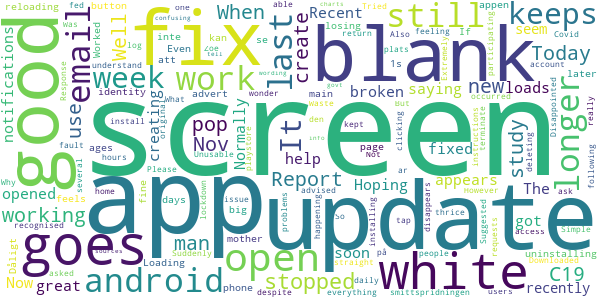

# COVID Symptom Study
App version ``2.0.2``

Analyzed with [covid-apps-observer](http://github.com/covid-apps-observer) project, version ``0.1``

## App overview
| | |
|-------------------------|-------------------------| 
| **Name**&nbsp;&nbsp;&nbsp;&nbsp;&nbsp;&nbsp;&nbsp;&nbsp;&nbsp;&nbsp;&nbsp;&nbsp;&nbsp;&nbsp;&nbsp;&nbsp;&nbsp;&nbsp;&nbsp;&nbsp;&nbsp;&nbsp;&nbsp;&nbsp;&nbsp;&nbsp;&nbsp;&nbsp;&nbsp;&nbsp;&nbsp;&nbsp;&nbsp;&nbsp;&nbsp;&nbsp;&nbsp;&nbsp;&nbsp;&nbsp;  | COVID Symptom Study |
| **Unique identifier** | com.joinzoe.covid_zoe |
| **Link to Google Play** | [https://play.google.com/store/apps/details?id=com.joinzoe.covid_zoe](https://play.google.com/store/apps/details?id=com.joinzoe.covid_zoe) |
| **Summary**  | Help slow COVID-19 by self-reporting your symptoms daily, even if you feel well. |
| **Privacy policy** | [https://predict.study/covid-privacy-notice/](https://predict.study/covid-privacy-notice/) |
| **Latest version** | 2.0.2 |
| **Last update** | 2020-11-26 17:15:53 |
| **Recent changes** | - Fixes for Push Notifications - Remove unnecessary permissions  - Fixes for AsyncStorage issues that cause some users to log out |
| **Installs**  | 1,000,000+ |
| **Category** | Health & Fitness |
| **First release** | Mar 20, 2020 |
| **Size**  | 35M |
| **Supported Android version**  | 5.0 and up |

### Description
> Take 1 minute each day and help fight the spread of COVID-19 in your community
 * Report your health daily even if you feel well
 * Get a daily estimate of COVID in your area
 * Help slow the outbreak near you
 Join millions of people supporting scientists at Stanford University, Harvard University, Massachusetts General Hospital, and King's College London to help fight coronavirus by identifying:
 * How fast the virus is spreading in your area
 * High-risk areas in the US
 * Who is most at risk, by better understanding symptoms linked to underlying health conditions
 You will contribute to advance research on COVID-19 in partnership with leading health researchers globally like TwinsUK, one of the most clinically detailed studies in the world.
 This app (formerly known as the Covid Symptom Tracker) allows you to help others, but does not give health advice. If you need health advice please visit the CDC website at: [https://www.cdc.gov/coronavirus/2019-ncov/index.html](https://www.cdc.gov/coronavirus/2019-ncov/index.html)
 This app has been designed for everyone to report their status not just those who are ill.
 It was designed by doctors and scientists at King's College London, Guys and St Thomas’ Hospitals and Zoe Global Limited, a health technology company.
 In the US the app is being used by the Nurses' Health Study to identify symptoms in active healthcare workers who are treating people with COVID across the country and risking their own health to help us.
 In response to recommendations by Stand Up To Cancer (SU2C), the app also includes questions for cancer patients and survivors, such as if they are living with cancer, what type of cancer and what treatment they are receiving.
 If you would like to help out in this difficult time, then you can. Download the app and share daily your own status, even if you are well. With your help we can understand much better the situation across the nation, how the disease presents itself to different people, and how it progresses.
 This is a new virus which the world has never seen before. There are a wide range of symptoms, which differ between people. With your help we can understand better how the disease presents itself depending upon individual factors such as health and age.
 No information you share will be used for commercial purposes.
 There are two parts to the app:
 HEALTH INFORMATION
 You will be asked to share some general information, such as your age and some health details, such as whether you have certain diseases.
 SYMPTOM TRACKING
 We will ask you every day to let us know how you feel, so you can share your symptoms. We will also ask whether you have visited the hospital, what treatment you received there, and whether you have been tested for COVID-19 (Coronavirus).

### User interface
The developers of the app provide the following screenshots in the Google play store.
| | | |
|:-------------------------:|:-------------------------:|:-------------------------:|
 |   |   |   | 
 |   |   |   | 
 |   |  

## Development team
In the following we report the main information provided by the development team in the Google play store.

| | |
|-------------------------|-------------------------|
| **Developer**  | Zoe Global Limited |
| **Website**  | [http://covid.joinzoe.com/](http://covid.joinzoe.com/) |
| **Email** | covid@joinzoe.com |
| **Physical address**  | [164 Westminster Bridge Road London SE1 7RW United Kingdom](https://www.google.com/maps/search/164%20Westminster%20Bridge%20Road%20London%20SE1%207RW%20United%20Kingdom) (Google Maps) |
| **Other developed apps**  | [https://play.google.com/store/apps/developer?id=Zoe+Global+Limited](https://play.google.com/store/apps/developer?id=Zoe+Global+Limited) |

## Android support

| | |
|-------------------------|-------------------------|
| **Declared target Android version**  | Android10, version 10 (API level 29) |
| **Effective target Android version**  | Android10, version 10 (API level 29) |
| **Minimum supported Android version**  | Lollipop, version 5.0 (API level 21) |
| **Maximum target Android version**  | - |

The larger the difference between the minimum and maximum supported Android versions, the better. A larger difference means a wider audience. For example, old phones have a very low Android version, so a high minimum supported Android version means that the app cannot be used by users with old phones, thus leading to accessibility problems. 

## Requested permissions

In the following we report the complete list of the permissions requested by the app. 

| **Permission** | **Protection level** | **Description** | 
|-------------------------|-------------------------|-------------------------|
 **android.permission ACCESS_BACKGROUND_LOCATION** | :warning:**Dangerous** | Allows an app to access location in the background. 
 **android.permission ACCESS_COARSE_LOCATION** | :warning:**Dangerous** | Allows an app to access approximate location. 
 **android.permission ACCESS_FINE_LOCATION** | :warning:**Dangerous** | Allows an app to access precise location. 
 **android.permission ACCESS_NETWORK_STATE** | Normal | Allows applications to access information about networks. 
 **android.permission CAMERA** | :warning:**Dangerous** | Required to be able to access the camera device. 
 **android.permission FOREGROUND_SERVICE** | Normal | Allows a regular application to use Service.startForeground. 
 **android.permission INTERNET** | Normal | Allows applications to open network sockets. 
 **android.permission MANAGE_DOCUMENTS** | Undefined | Allows an application to manage access to documents, usually as part of a document picker. 
 **android.permission MODIFY_AUDIO_SETTINGS** | Normal | Allows an application to modify global audio settings. 
 **android.permission READ_APP_BADGE** | - | - 
 **android.permission READ_CALENDAR** | :warning:**Dangerous** | Allows an application to read the user's calendar data. 
 **android.permission READ_CONTACTS** | :warning:**Dangerous** | Allows an application to read the user's contacts data. 
 **android.permission READ_EXTERNAL_STORAGE** | :warning:**Dangerous** | Allows an application to read from external storage. 
 **android.permission READ_INTERNAL_STORAGE** | - | - 
 **android.permission READ_PHONE_STATE** | :warning:**Dangerous** | Allows read only access to phone state, including the phone number of the device, current cellular network information, the status of any ongoing calls, and a list of any PhoneAccounts registered on the device. 
 **android.permission RECEIVE_BOOT_COMPLETED** | Normal | Allows an application to receive the Intent.ACTION_BOOT_COMPLETED that is broadcast after the system finishes booting. 
 **android.permission RECORD_AUDIO** | :warning:**Dangerous** | Allows an application to record audio. 
 **android.permission SYSTEM_ALERT_WINDOW** | Signature - preinstalled - appop - pre23 - development | Allows an app to create windows using the type WindowManager.LayoutParams.TYPE_APPLICATION_OVERLAY, shown on top of all other apps. 
 **android.permission USE_FINGERPRINT** | Normal | This constant was deprecated in API level 28. Applications should request USE_BIOMETRIC instead 
 **android.permission VIBRATE** | Normal | Allows access to the vibrator. 
 **android.permission WAKE_LOCK** | Normal | Allows using PowerManager WakeLocks to keep processor from sleeping or screen from dimming. 
 **android.permission WRITE_CALENDAR** | :warning:**Dangerous** | Allows an application to write the user's calendar data. 
 **android.permission WRITE_EXTERNAL_STORAGE** | :warning:**Dangerous** | Allows an application to write to external storage. 
 **android.permission WRITE_SETTINGS** | Signature - preinstalled - appop - pre23 | Allows an application to read or write the system settings. 
 **com.anddoes.launcher.permission UPDATE_COUNT** | - | - 
 **com.google.android.c2dm.permission RECEIVE** | - | - 
 **com.google.android.finsky.permission BIND_GET_INSTALL_REFERRER_SERVICE** | - | - 
 **com.google.android.gms.permission ACTIVITY_RECOGNITION** | - | - 
 **com.google.android.providers.gsf.permission READ_GSERVICES** | - | - 
 **com.htc.launcher.permission READ_SETTINGS** | - | - 
 **com.htc.launcher.permission UPDATE_SHORTCUT** | - | - 
 **com.huawei.android.launcher.permission CHANGE_BADGE** | - | - 
 **com.huawei.android.launcher.permission READ_SETTINGS** | - | - 
 **com.huawei.android.launcher.permission WRITE_SETTINGS** | - | - 
 **com.majeur.launcher.permission UPDATE_BADGE** | - | - 
 **com.oppo.launcher.permission READ_SETTINGS** | - | - 
 **com.oppo.launcher.permission WRITE_SETTINGS** | - | - 
 **com.sec.android.provider.badge.permission READ** | - | - 
 **com.sec.android.provider.badge.permission WRITE** | - | - 
 **com.sonyericsson.home.permission BROADCAST_BADGE** | - | - 
 **com.sonymobile.home.permission PROVIDER_INSERT_BADGE** | - | - 
 **me.everything.badger.permission BADGE_COUNT_READ** | - | - 
 **me.everything.badger.permission BADGE_COUNT_WRITE** | - | - 

## Mentioned servers

| **Server** | **Registrant** | **Registrant country** | **Creation date** | 
|-------------------------|-------------------------|-------------------------|-------------------------|
 | amplitude.com | Amplitude | :us: US | 1996-05-09 04:00:00 |
 | android.com | Google LLC | :us: US | 1997-06-23 04:00:00 |
 | google.com | Google LLC | :us: US | 1997-09-15 04:00:00 |
 | microsoft.com | Microsoft Corporation | :us: US | 1991-05-02 04:00:00 |
 | googleapis.com | Google LLC | :us: US | 2005-01-25 17:52:26 |
 | cloudfront.net | Amazon.com, Inc. | :us: US | 2008-04-25 18:25:49 |
 | expo.io | See PrivacyGuardian.org | :us: US | 2011-05-01 21:26:50 |

## Security analysis 

Below we report the main security warnings raised by our execution of the [Androwarn](https://github.com/maaaaz/androwarn) security analysis tool.

**Telephony identifiers leakage**
> - This application reads the ISO country code equivalent of the current registered operator's MCC (Mobile Country Code) 
> - This application reads the device phone type value 
> - This application reads the numeric name (MCC+MNC) of current registered operator 
> - This application reads the operator name 

**Location lookup**
> - This application reads location information from all available providers (WiFi, GPS etc.) 

**Connection interfaces exfiltration**
> - This application reads details about the currently active data network 
> - This application tries to find out if the currently active data network is metered 

**Suspicious connection establishment**
> - This application opens a Socket and connects it to the remote address '' on the 'N/A' port  
> - This application opens a Socket and connects it to the remote address 'Ljava/lang/StringBuilder;->toString()Ljava/lang/String;' on the ': connect, resolve' port  
> - This application opens a Socket and connects it to the remote address 'Ljava/lang/StringBuilder;->toString()Ljava/lang/String;' on the 'N/A' port  
> - This application opens a Socket and connects it to the remote address 'Ljava/net/Proxy;->type()Ljava/net/Proxy$Type;' on the 'N/A' port  
> - This application opens a Socket and connects it to the remote address 'timeout' on the 'N/A' port  

**Pim data leakage**
> - This application accesses data stored in the clipboard 

**Code execution**
> - This application loads a native library 
> - This application executes a UNIX command 

## User ratings and reviews

Below we provide information about how end users are reacting to the app in terms of ratings and reviews in the Google Play store.

### Ratings

The COVID Symptom Study app has been installed by more than **1000000** times. At this time, **130897** rated the app and its average score is **4.7591844**. Below we show the distribution of the ratings across the usual star-based rating of Google Play

:star::star::star::star::star:: 103296

:star::star::star::star:: 24661

:star::star::star:: 2300

:star::star:: 304

:star:: 336

### Reviews 

#### 5-star reviews

> Provides valuable insight into the pandemic.  :date: __2020-12-05 14:24:40__

> Important study and great updates  :date: __2020-12-05 14:23:26__

> Excellent app. Very simple but with options to see more of the research if you want to. This is the closest to real-time info on infection rates across the UK and I trust it more than government figures. Great to do my bit to help scientists (and ordinary people) understand coronavirus.  :date: __2020-12-05 13:40:29__

> Quick and easy way for everyone to contribe to knowledge of the disease.  :date: __2020-12-05 12:44:20__

> Easy to do. Grateful for everyone behind it and who use it to help us all stay safer and know the risks where we live  :date: __2020-12-05 12:27:35__

> The app today has stopped working. The app opens and immediately goes to a blank white screen. I use this everyday and have for over 6 months. Update. U installed and re installed. Fixed the problem  :date: __2020-12-05 11:00:42__

> It's good to feel you are doing something useful and it provides up to date info about the virus,  :date: __2020-12-05 10:55:23__

> Good citizen research. Used to remind me daily to report, seems not to do so now.  :date: __2020-12-05 10:16:54__

> Easy to use  :date: __2020-12-05 10:02:16__

> Very easy to use  :date: __2020-12-05 09:41:16__

#### 4-star reviews

> I had to reload the app and forgot my password and I never received a link to reset despite multiple attempts.Luckily I have another email address that I have used. I was logging for my husband who has had two tests due to surgery and it lost the dates. Otherwise a brilliant app and thank you for all your hard work  :date: __2020-12-05 13:28:58__

> Easy to use each day. Hopefully I'm helping their results.  :date: __2020-12-05 12:32:26__

> Although you're not inline with the NHS app, and your figures are showing fewer cases compared to the NHS app (not your fault), this is a well laid out, easy to use system. Thank you.  :date: __2020-12-05 11:20:15__

> Good to report symptoms as it is interesting to see how people's illness is developing / hopefully ending  :date: __2020-12-05 01:21:03__

> It seems to be quite capable but every time I try to give an update of my status it asks me to enter my entire profile again.  :date: __2020-12-04 19:12:40__

> Easy to use.  :date: __2020-12-04 17:17:23__

> Since the last update, I no longer receive reminders. I followed what the email said to fix the problem, but it didn't fix it. I rarely report now as I forget to open the app on my own.  :date: __2020-12-04 16:48:45__

> Good except recently I've not had reminders due to Android update glitch and I've reinstalled twice and still not getting them.  :date: __2020-12-04 14:07:45__

> Useful app for reporting Covid status and for keeping up to date with latest spread of virus throughout England.  :date: __2020-12-04 07:17:06__

> Easy to use  :date: __2020-12-03 19:11:53__

#### 3-star reviews

> Very quick to just check-in each day if you are prompted. Needed to reinstall twice to get prompts working again after glitch.  :date: __2020-12-05 11:51:25__

> I cant log off.  :date: __2020-12-05 10:18:42__

> Was great. Since Android update, notifications no longer appear and I often forget to report. Notifications are enabled for this app in my settings, so that's not the problem.  :date: __2020-12-05 09:14:01__

> Keeps crashing upon opening on Android, been ok until today  :date: __2020-12-04 23:57:06__

> Notifications have stopped and I keep forgetting without them  :date: __2020-12-03 19:04:23__

> Had it since the beginning and worked well, now i dont get reminders even after updating and following other instructions.  :date: __2020-12-03 18:54:36__

> I added 2 test results recently, now everyday the app asks "is this list correct" (of tests). It's a bit annoying. Can you just give an option to add a new test rather than ask each day. Apart from that the app is fine and I'll adjust my review if this minor annoyance is addressed.  :date: __2020-12-02 12:39:10__

> No longer getting daily reminders. Unable to rectify this problem  :date: __2020-12-02 06:29:15__

> Have been reporting since the very start but every day it says I haven't reported . Updated it as instructed and it said I hadn't logged on for 16 days! Started again to remind me to report when I have. Very frustrating. I'm in the North East where number of cases are large and so important that I report .  :date: __2020-12-01 11:37:18__

> Good on the whole, though app sometimes says I have not reported for 2-3 days, whereas I do so daily.  :date: __2020-12-01 10:45:51__

#### 2-star reviews

> Recent update appears to have broken the app. Now loads a blank screen. Hoping for a fix soon.  :date: __2020-12-04 18:41:57__

> The notifications no longer work after the last android update.. got the email saying you'd fixed it but it still doesn't work for me...help.  :date: __2020-12-03 22:30:24__

> Normally great but keeps creating when it's opened this week  :date: __2020-12-03 12:34:00__

> Good until recently now I seem to for ever uninstalling and reloading as it keeps losing my identity.  :date: __2020-12-02 20:14:01__

> It's stopped working for me in the last few days. I now get the big "C19" screen, then a "C19 Loading.." screen, then the main page pops up with the "Report Today, Even if you're Well" button but then about 1s later, the screen just goes white. If feels like an advert is about to pop up but no. I can no longer use the app because of this.  :date: __2020-12-01 13:02:37__

> Worked fine for ages, now it just opens to a blank white screen, my mother's app does the same on her phone.  :date: __2020-12-01 10:28:51__

> Dåligt att man inte i appen kan se smittspridningen på den plats man är.  :date: __2020-11-30 16:54:31__

> Not everything is Covid when you are not feeling 100%. I don't understand it. Also fed up of not being recognised when I log in. I wonder what this is good for really.  :date: __2020-11-29 17:55:46__

> Simple to use. However still not able to open after update. Downloaded update as advised on email today 28/11/20 But opens & then disappears!!! Please fix this issue for Android users.  :date: __2020-11-28 10:24:06__

> was good, cannot now access. goes straight to white screen despite following instructions to fix the fault. Disappointed.  :date: __2020-11-28 08:17:16__

#### 1-star reviews

> Brilliant app, supported it from the start. However now only gives me a white screen when i log on. Have reinstalled to no effect Shame . I have now given up and am no longer participating  :date: __2020-12-05 11:00:25__

> This rating only refers to today. On opening the app I get a white blank screen and can't do anything.  :date: __2020-12-04 15:54:59__

> I do not get notifications anymore  :date: __2020-12-03 19:23:48__

> Not able to use since the latest update. App opens then goes straight to a blank screen  :date: __2020-12-03 10:19:42__

> after last update wont open up properly on asus chromebook, very hard to hit report button at the start only showing about 3mm  :date: __2020-12-02 22:09:51__

> I cant log on anymore, impossible to scroll down to enter anything. It wont let me re-register using old email, or alternative address. Somebody in the IT team needs to go back to college! (or ask Dido for help) !  :date: __2020-12-02 14:53:27__

> Cannot get on the app for some reason,is there a problem  :date: __2020-12-02 12:18:44__

> The app has failed today. Re-installed it but a white screen is all I get. Have used it daily for 6 months.  :date: __2020-12-02 10:40:16__

> Was working well. Now just doesn't recognise me. Have uninstalled and reinstalled many times to no avail  :date: __2020-12-01 15:07:07__

> Seems to have been disabled on chrome computers. Still not working. Why not have an alternative of reporting on an ordinary web site (NOT an App) for those oldies who do not have up to date software?  :date: __2020-12-01 13:37:58__

