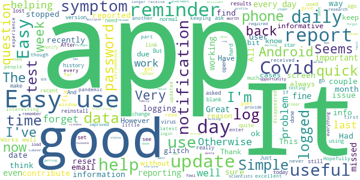

# COVID Symptom Study
App version ``2.0.2``

Analyzed with [covid-apps-observer](http://github.com/covid-apps-observer) project, version ``0.1``

## App overview
| | |
|-------------------------|-------------------------| 
| **Name**                                          | COVID Symptom Study |
| **Unique identifier** | com.joinzoe.covid_zoe |
| **Link to Google Play** | [https://play.google.com/store/apps/details?id=com.joinzoe.covid_zoe](https://play.google.com/store/apps/details?id=com.joinzoe.covid_zoe) |
| **Summary**  | Help slow COVID-19 by self-reporting your symptoms daily, even if you feel well. |
| **Privacy policy** | [https://predict.study/covid-privacy-notice/](https://predict.study/covid-privacy-notice/) |
| **Latest version** | 2.0.2 |
| **Last update** | 2020-11-26 17:15:53 |
| **Recent changes** | - Fixes for Push Notifications - Remove unnecessary permissions  - Fixes for AsyncStorage issues that cause some users to log out |
| **Installs**  | 1,000,000+ |
| **Category** | Health & Fitness |
| **First release** | Mar 20, 2020 |
| **Size**  | 35M |
| **Supported Android version**  | 5.0 and up |

### Description
> Take 1 minute each day and help fight the spread of COVID-19 in your community
 * Report your health daily even if you feel well
 * Get a daily estimate of COVID in your area
 * Help slow the outbreak near you
 Join millions of people supporting scientists at Stanford University, Harvard University, Massachusetts General Hospital, and King's College London to help fight coronavirus by identifying:
 * How fast the virus is spreading in your area
 * High-risk areas in the US
 * Who is most at risk, by better understanding symptoms linked to underlying health conditions
 You will contribute to advance research on COVID-19 in partnership with leading health researchers globally like TwinsUK, one of the most clinically detailed studies in the world.
 This app (formerly known as the Covid Symptom Tracker) allows you to help others, but does not give health advice. If you need health advice please visit the CDC website at: [https://www.cdc.gov/coronavirus/2019-ncov/index.html](https://www.cdc.gov/coronavirus/2019-ncov/index.html)
 This app has been designed for everyone to report their status not just those who are ill.
 It was designed by doctors and scientists at King's College London, Guys and St Thomas’ Hospitals and Zoe Global Limited, a health technology company.
 In the US the app is being used by the Nurses' Health Study to identify symptoms in active healthcare workers who are treating people with COVID across the country and risking their own health to help us.
 In response to recommendations by Stand Up To Cancer (SU2C), the app also includes questions for cancer patients and survivors, such as if they are living with cancer, what type of cancer and what treatment they are receiving.
 If you would like to help out in this difficult time, then you can. Download the app and share daily your own status, even if you are well. With your help we can understand much better the situation across the nation, how the disease presents itself to different people, and how it progresses.
 This is a new virus which the world has never seen before. There are a wide range of symptoms, which differ between people. With your help we can understand better how the disease presents itself depending upon individual factors such as health and age.
 No information you share will be used for commercial purposes.
 There are two parts to the app:
 HEALTH INFORMATION
 You will be asked to share some general information, such as your age and some health details, such as whether you have certain diseases.
 SYMPTOM TRACKING
 We will ask you every day to let us know how you feel, so you can share your symptoms. We will also ask whether you have visited the hospital, what treatment you received there, and whether you have been tested for COVID-19 (Coronavirus).

### User interface
The developers of the app provide the following screenshots in the Google play store.
| | | |
|:-------------------------:|:-------------------------:|:-------------------------:|
 |   |   |   | 
 |   |   |   | 
 |   |  

## Development team
In the following we report the main information provided by the development team in the Google play store.

| | |
|-------------------------|-------------------------|
| **Developer**  | Zoe Global Limited |
| **Website**  | [http://covid.joinzoe.com/](http://covid.joinzoe.com/) |
| **Email** | covid@joinzoe.com |
| **Physical address**  | [164 Westminster Bridge Road London SE1 7RW United Kingdom](https://www.google.com/maps/search/164%20Westminster%20Bridge%20Road%20London%20SE1%207RW%20United%20Kingdom) (Google Maps) |
| **Other developed apps**  | [https://play.google.com/store/apps/developer?id=Zoe+Global+Limited](https://play.google.com/store/apps/developer?id=Zoe+Global+Limited) |

## Android support

| | |
|-------------------------|-------------------------|
| **Declared target Android version**  | Android10, version 10 (API level 29) |
| **Effective target Android version**  | Android10, version 10 (API level 29) |
| **Minimum supported Android version**  | Lollipop, version 5.0 (API level 21) |
| **Maximum target Android version**  | - |

The larger the difference between the minimum and maximum supported Android versions, the better. A larger difference means a wider audience. For example, old phones have a very low Android version, so a high minimum supported Android version means that the app cannot be used by users with old phones, thus leading to accessibility problems. 

## Requested permissions

In the following we report the complete list of the permissions requested by the app. 

| **Permission** | **Protection level** | **Description** | 
|-------------------------|-------------------------|-------------------------|
 **android.permission ACCESS_BACKGROUND_LOCATION** | :warning:**Dangerous** | Allows an app to access location in the background. 
 **android.permission ACCESS_COARSE_LOCATION** | :warning:**Dangerous** | Allows an app to access approximate location. 
 **android.permission ACCESS_FINE_LOCATION** | :warning:**Dangerous** | Allows an app to access precise location. 
 **android.permission ACCESS_NETWORK_STATE** | Normal | Allows applications to access information about networks. 
 **android.permission CAMERA** | :warning:**Dangerous** | Required to be able to access the camera device. 
 **android.permission FOREGROUND_SERVICE** | Normal | Allows a regular application to use Service.startForeground. 
 **android.permission INTERNET** | Normal | Allows applications to open network sockets. 
 **android.permission MANAGE_DOCUMENTS** | Undefined | Allows an application to manage access to documents, usually as part of a document picker. 
 **android.permission MODIFY_AUDIO_SETTINGS** | Normal | Allows an application to modify global audio settings. 
 **android.permission READ_APP_BADGE** | - | - 
 **android.permission READ_CALENDAR** | :warning:**Dangerous** | Allows an application to read the user's calendar data. 
 **android.permission READ_CONTACTS** | :warning:**Dangerous** | Allows an application to read the user's contacts data. 
 **android.permission READ_EXTERNAL_STORAGE** | :warning:**Dangerous** | Allows an application to read from external storage. 
 **android.permission READ_INTERNAL_STORAGE** | - | - 
 **android.permission READ_PHONE_STATE** | :warning:**Dangerous** | Allows read only access to phone state, including the phone number of the device, current cellular network information, the status of any ongoing calls, and a list of any PhoneAccounts registered on the device. 
 **android.permission RECEIVE_BOOT_COMPLETED** | Normal | Allows an application to receive the Intent.ACTION_BOOT_COMPLETED that is broadcast after the system finishes booting. 
 **android.permission RECORD_AUDIO** | :warning:**Dangerous** | Allows an application to record audio. 
 **android.permission SYSTEM_ALERT_WINDOW** | Signature - preinstalled - appop - pre23 - development | Allows an app to create windows using the type WindowManager.LayoutParams.TYPE_APPLICATION_OVERLAY, shown on top of all other apps. 
 **android.permission USE_FINGERPRINT** | Normal | This constant was deprecated in API level 28. Applications should request USE_BIOMETRIC instead 
 **android.permission VIBRATE** | Normal | Allows access to the vibrator. 
 **android.permission WAKE_LOCK** | Normal | Allows using PowerManager WakeLocks to keep processor from sleeping or screen from dimming. 
 **android.permission WRITE_CALENDAR** | :warning:**Dangerous** | Allows an application to write the user's calendar data. 
 **android.permission WRITE_EXTERNAL_STORAGE** | :warning:**Dangerous** | Allows an application to write to external storage. 
 **android.permission WRITE_SETTINGS** | Signature - preinstalled - appop - pre23 | Allows an application to read or write the system settings. 
 **com.anddoes.launcher.permission UPDATE_COUNT** | - | - 
 **com.google.android.c2dm.permission RECEIVE** | - | - 
 **com.google.android.finsky.permission BIND_GET_INSTALL_REFERRER_SERVICE** | - | - 
 **com.google.android.gms.permission ACTIVITY_RECOGNITION** | - | - 
 **com.google.android.providers.gsf.permission READ_GSERVICES** | - | - 
 **com.htc.launcher.permission READ_SETTINGS** | - | - 
 **com.htc.launcher.permission UPDATE_SHORTCUT** | - | - 
 **com.huawei.android.launcher.permission CHANGE_BADGE** | - | - 
 **com.huawei.android.launcher.permission READ_SETTINGS** | - | - 
 **com.huawei.android.launcher.permission WRITE_SETTINGS** | - | - 
 **com.majeur.launcher.permission UPDATE_BADGE** | - | - 
 **com.oppo.launcher.permission READ_SETTINGS** | - | - 
 **com.oppo.launcher.permission WRITE_SETTINGS** | - | - 
 **com.sec.android.provider.badge.permission READ** | - | - 
 **com.sec.android.provider.badge.permission WRITE** | - | - 
 **com.sonyericsson.home.permission BROADCAST_BADGE** | - | - 
 **com.sonymobile.home.permission PROVIDER_INSERT_BADGE** | - | - 
 **me.everything.badger.permission BADGE_COUNT_READ** | - | - 
 **me.everything.badger.permission BADGE_COUNT_WRITE** | - | - 

## Mentioned servers

| **Server** | **Registrant** | **Registrant country** | **Creation date** | 
|-------------------------|-------------------------|-------------------------|-------------------------|
 | amplitude.com | Amplitude | :us: US | 1996-05-09 04:00:00 |
 | android.com | Google LLC | :us: US | 1997-06-23 04:00:00 |
 | google.com | Google LLC | :us: US | 1997-09-15 04:00:00 |
 | microsoft.com | Microsoft Corporation | :us: US | 1991-05-02 04:00:00 |
 | googleapis.com | Google LLC | :us: US | 2005-01-25 17:52:26 |
 | cloudfront.net | Amazon.com, Inc. | :us: US | 2008-04-25 18:25:49 |
 | expo.io | See PrivacyGuardian.org | :us: US | 2011-05-01 21:26:50 |

## Security analysis 

Below we report the main security warnings raised by our execution of the [Androwarn](https://github.com/maaaaz/androwarn) security analysis tool.

**Telephony identifiers leakage**
> - This application reads the ISO country code equivalent of the current registered operator's MCC (Mobile Country Code) 
> - This application reads the device phone type value 
> - This application reads the numeric name (MCC+MNC) of current registered operator 
> - This application reads the operator name 

**Location lookup**
> - This application reads location information from all available providers (WiFi, GPS etc.) 

**Connection interfaces exfiltration**
> - This application reads details about the currently active data network 
> - This application tries to find out if the currently active data network is metered 

**Suspicious connection establishment**
> - This application opens a Socket and connects it to the remote address '' on the 'N/A' port  
> - This application opens a Socket and connects it to the remote address 'Ljava/lang/StringBuilder;->toString()Ljava/lang/String;' on the ': connect, resolve' port  
> - This application opens a Socket and connects it to the remote address 'Ljava/lang/StringBuilder;->toString()Ljava/lang/String;' on the 'N/A' port  
> - This application opens a Socket and connects it to the remote address 'Ljava/net/Proxy;->type()Ljava/net/Proxy$Type;' on the 'N/A' port  
> - This application opens a Socket and connects it to the remote address 'timeout' on the 'N/A' port  

**Pim data leakage**
> - This application accesses data stored in the clipboard 

**Code execution**
> - This application loads a native library 
> - This application executes a UNIX command 

## User ratings and reviews

Below we provide information about how end users are reacting to the app in terms of ratings and reviews in the Google Play store.

### Ratings

The COVID Symptom Study app has been installed by more than **1000000** times. At this time, **130897** rated the app and its average score is **4.7591844**. Below we show the distribution of the ratings across the usual star-based rating of Google Play

:star::star::star::star::star:: 103296

:star::star::star::star:: 24661

:star::star::star:: 2300

:star::star:: 304

:star:: 336

### Reviews 

#### 5-star reviews

> Apart from recent slow response, fixed by deleting app & reloading updated version, had no problems and happy to help by using every day. Useful and well presented summary stats each day. Thank you.  :date: __2020-11-30 10:07:40__

> Easy to use  :date: __2020-11-30 09:59:02__

> I would recommend this app to anyone who wants to know more about where we are with Covid 19. The more people who use it the better.  :date: __2020-11-30 09:58:01__

> Ultra simple to use and a way to try and help get a handle on this disease. Update: over time the questions have reflected discoveries in the nature of the virus.  :date: __2020-11-30 09:41:22__

> Takes one minute to complete the daily survey to provide data to combat this virus.  :date: __2020-11-30 09:13:01__

> Great app to use  :date: __2020-11-30 08:57:00__

> Easy to use, excellent feedback in videos - your own small contribution to research, well worth doing  :date: __2020-11-30 08:22:12__

> Easy and important. I trust it  :date: __2020-11-30 07:55:21__

> Very up to date app, feel the information on here should be needed more. Why couldn't the NHS app and this one join forces?  :date: __2020-11-30 00:22:20__

> A few issues with notifications recently, but now fixed. I don't tend to remember to update daily unless I receive the notification. Useful info about the virus too.  :date: __2020-11-30 00:02:50__

#### 4-star reviews

> All easy enough and benefits us all  :date: __2020-11-30 10:17:22__

> Easy to use  :date: __2020-11-30 09:40:49__

> Works Well. Like the daily reminder.  :date: __2020-11-30 03:47:42__

> Great app helping with the battle against Covid19. keeping us all informed of infection rates and progress with vaccines.  :date: __2020-11-30 00:15:44__

> Fantastic to have the opportunity to contribute to such important research  :date: __2020-11-29 21:34:06__

> There was an app upgrade and it lost my COVID test history. As I don't remember the dates I had the tests I have to declare that I haven't had any tests. (Had two.)  :date: __2020-11-29 17:52:03__

> Seems like a good idea, very simple to use.  :date: __2020-11-29 14:29:31__

> Good usable data glad to help but the reminder even when reported is rather anoying  :date: __2020-11-29 12:32:01__

> Worked fine until 25 November update. Now it loads and goes to a blank screen. Update: a couple of days later it has started working again.  :date: __2020-11-29 11:48:10__

> It's a little "insensitive" regarding mild symptoms. Seems there is no way to report anything unless you declare more than one known symptom. Unusual or precursor symptoms may be missed. Anyway, worth contributing to to help the fight.  :date: __2020-11-29 10:41:30__

#### 3-star reviews

> Graph for cases not working  :date: __2020-11-29 20:11:13__

> Unfortunately has become worse with recent releases - one logged out users with no notification, meaning a good chunk of users has probably been lost who didn't notice they weren't getting them any more. The current version also doesn't open the app on tapping the notification, making it less seamless to report than before. The lack of a 'send'/'submit' button makes it unclear when a report has been completed. Could use this consistency, particularly given it needs to maintain good sample sizes.  :date: __2020-11-29 13:13:24__

> A slight problem. To proceed I have to tap I Have Never Had a Covid Test. I have, it was negative, and I am entirely well.  :date: __2020-11-29 10:45:33__

> Excellent for what it's doing. But unfortunately everytime I open to report for the day, it tells me to report for yesterday first. Everytime. And yet I report everyday. It also keeps losing covid-19 tests which I've had.  :date: __2020-11-28 12:14:53__

> Fine except for problems logging in, repeatedly. I use an android mobile.  :date: __2020-11-28 12:09:18__

> It's a good idea to help keep track BUT since the update it no longer reminds me to do it so now I keep forgetting to do it  :date: __2020-11-28 11:34:02__

> I installed from very early on to help with data gathering. Worked fine until 2 weeks ago when I had to fill all the forms in again to keep my account. Saw a message from creators saying there had been a blip which was now sorted. Today I go on to report and it says I haven't done do for 14 days. I have updated it every day and never missed. I'm not sure you really have sorted out your problems!  :date: __2020-11-28 10:45:47__

> Was easy to use but then it crashed. Deleted app then reinstalled. Continued to fail but this morning got in.  :date: __2020-11-28 10:31:25__

> Not always clear when to move to the next page, leaves you hanging, like now, I don't know if this review is going to be submitted or if I've just been wasting my time.  :date: __2020-11-27 22:47:57__

> Was a good app but now can't log in even after following link to reset password. Uninstalling and reinstalling doesnt work either. Just won't recognise password after reset....😕😕😕  :date: __2020-11-27 21:52:54__

#### 2-star reviews

> Not everything is Covid when you are not feeling 100%. I don't understand it. Also fed up of not being recognised when I log in. I wonder what this is good for really.  :date: __2020-11-29 17:55:46__

> Simple to use. However still not able to open after update. Downloaded update as advised on email today 28/11/20 But opens & then disappears!!! Please fix this issue for Android users.  :date: __2020-11-28 10:24:06__

> was good, cannot now access. goes straight to white screen despite following instructions to fix the fault. Disappointed.  :date: __2020-11-28 08:17:16__

> 23 Nov 2020 I have been participating with the study since lockdown. Suddenly for a week now the requests for daily reports stopped. When I tap on the app. it asked me to create a new account. Why? 27 Nov 2020 Response from Zoe that problems have occurred to several people. Suggested I install the update by clicking on playstore app. Tried thrice, kept on installing...... So I shall terminate. Waste of 3 hours! When I return to original app, it ask me to create a new one. What's happening!  :date: __2020-11-27 16:50:20__

> Was working well but now gets to home screen and goes blank. Unusable, deleting.  :date: __2020-11-27 12:49:26__

> Extremely confusing wording. Cannot tell if info and charts are just from this study or all govt sources.  :date: __2020-11-25 14:44:08__

> App just reset and feels off.. not sure what happened.  :date: __2020-11-24 09:34:33__

#### 1-star reviews

> Cannot get past the first set of questions....it says next question but doesn't move on....have tried more than once to access.  :date: __2020-11-28 16:28:32__

> Since changing my phone to a fold 2 this app no longer works. It appears to think that the phone is a tablet  :date: __2020-11-28 11:43:52__

> Used to be brilliant but now goes immediately to a white screen so fails to be of any use  :date: __2020-11-27 22:07:31__

> This app is a pain in the ass some days ago it went wrong and asked me to log in which i did numerous times then i was asked for e mail and pass word which i did several times again i was asked for password which i did several times only to be asked to log in then asked for password again.This i tried for several days i am now so fed up and have given up.You try to help by takeing part in these studies and wonder who the hell supervises the system.No more time wasteing apps for me.  :date: __2020-11-27 20:55:59__

> Stopped working on latest android on galaxy s10. Startup shows then I get blank white screen. Reinstalled but still no good. Come on people, this is too important to screw up!  :date: __2020-11-27 18:16:00__

> Unable to access ap.  :date: __2020-11-27 17:27:31__

> Was working but now thanks to the update it no longer works out goes to a white screen  :date: __2020-11-27 15:33:16__

> Has been working well for months, now when I log in to the app I just have a blank white screen, despite updating to V.2  :date: __2020-11-27 14:40:07__

> The update doesn't work in Google play  :date: __2020-11-27 13:23:52__

> Was using app ..got locked out last wk .Couldn't get back into the app. Got email suggesting being a computer fault ..to download another updated app ..did this and still not working. Fed up trying  :date: __2020-11-27 12:51:42__

