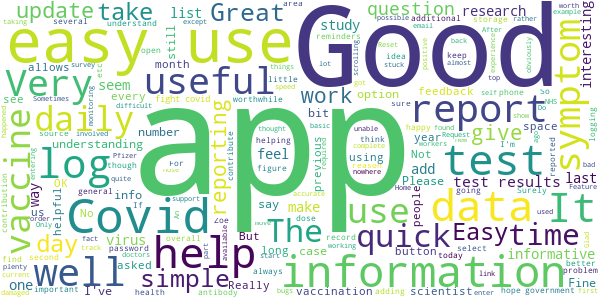
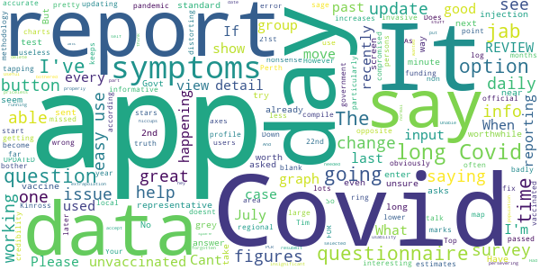

# COVID Symptom Study
App version ``2.5.0``

Analyzed with [covid-apps-observer](http://github.com/covid-apps-observer) project, version ``0.1``

## App overview
| | |
|-------------------------|-------------------------| 
| **Name**&nbsp;&nbsp;&nbsp;&nbsp;&nbsp;&nbsp;&nbsp;&nbsp;&nbsp;&nbsp;&nbsp;&nbsp;&nbsp;&nbsp;&nbsp;&nbsp;&nbsp;&nbsp;&nbsp;&nbsp;&nbsp;&nbsp;&nbsp;&nbsp;&nbsp;&nbsp;&nbsp;&nbsp;&nbsp;&nbsp;&nbsp;&nbsp;&nbsp;&nbsp;&nbsp;&nbsp;&nbsp;&nbsp;&nbsp;&nbsp;  | COVID Symptom Study |
| **Unique identifier** | com.joinzoe.covid_zoe |
| **Link to Google Play** | [https://play.google.com/store/apps/details?id=com.joinzoe.covid_zoe](https://play.google.com/store/apps/details?id=com.joinzoe.covid_zoe) |
| **Summary**  | Help slow COVID-19 by self-reporting your symptoms daily, even if you feel well. |
| **Privacy policy** | [https://predict.study/covid-privacy-notice/](https://predict.study/covid-privacy-notice/) |
| **Latest version** | 2.5.0 |
| **Last update** | 2021-05-13 15:07:39 |
| **Recent changes** | Improved support for screen readers. Add support for deep links / universal links.  |
| **Installs**  | 1,000,000+ |
| **Category** | Health & Fitness |
| **First release** | Mar 20, 2020 |
| **Size**  | 38M |
| **Supported Android version**  | 5.0 and up |

### Description
> Take 1 minute each day and help fight the spread of COVID-19 in your community
 * Report your health daily even if you feel well
 * Get a daily estimate of COVID in your area
 * Help slow the outbreak near you
 Join millions of people supporting scientists at Stanford University, Harvard University, Massachusetts General Hospital, and King's College London to help fight coronavirus by identifying:
 * How fast the virus is spreading in your area
 * High-risk areas in the US
 * Who is most at risk, by better understanding symptoms linked to underlying health conditions
 You will contribute to advance research on COVID-19 in partnership with leading health researchers globally like TwinsUK, one of the most clinically detailed studies in the world.
 This app (formerly known as the Covid Symptom Tracker) allows you to help others, but does not give health advice. If you need health advice please visit the CDC website at: [https://www.cdc.gov/coronavirus/2019-ncov/index.html](https://www.cdc.gov/coronavirus/2019-ncov/index.html)
 This app has been designed for everyone to report their status not just those who are ill.
 It was designed by doctors and scientists at King's College London, Guys and St Thomas’ Hospitals and Zoe Global Limited, a health technology company.
 In the US the app is being used by the Nurses' Health Study to identify symptoms in active healthcare workers who are treating people with COVID across the country and risking their own health to help us.
 In response to recommendations by Stand Up To Cancer (SU2C), the app also includes questions for cancer patients and survivors, such as if they are living with cancer, what type of cancer and what treatment they are receiving.
 If you would like to help out in this difficult time, then you can. Download the app and share daily your own status, even if you are well. With your help we can understand much better the situation across the nation, how the disease presents itself to different people, and how it progresses.
 This is a new virus which the world has never seen before. There are a wide range of symptoms, which differ between people. With your help we can understand better how the disease presents itself depending upon individual factors such as health and age.
 No information you share will be used for commercial purposes.
 There are two parts to the app:
 HEALTH INFORMATION
 You will be asked to share some general information, such as your age and some health details, such as whether you have certain diseases.
 SYMPTOM TRACKING
 We will ask you every day to let us know how you feel, so you can share your symptoms. We will also ask whether you have visited the hospital, what treatment you received there, and whether you have been tested for COVID-19 (Coronavirus).

### User interface
The developers of the app provide the following screenshots in the Google play store.
| | | |
|:-------------------------:|:-------------------------:|:-------------------------:|
 |   |   |   | 
 |   |   |   | 
 |   |  

## Development team
In the following we report the main information provided by the development team in the Google play store.

| | |
|-------------------------|-------------------------|
| **Developer**  | Zoe Global Limited |
| **Website**  | [http://covid.joinzoe.com/](http://covid.joinzoe.com/) |
| **Email** | covid@joinzoe.com |
| **Physical address**  | [164 Westminster Bridge Road London SE1 7RW United Kingdom](https://www.google.com/maps/search/164%20Westminster%20Bridge%20Road%20London%20SE1%207RW%20United%20Kingdom) (Google Maps) |
| **Other developed apps**  | [https://play.google.com/store/apps/developer?id=Zoe+Global+Limited](https://play.google.com/store/apps/developer?id=Zoe+Global+Limited) |

## Android support

| | |
|-------------------------|-------------------------|
| **Declared target Android version**  | Android10, version 10 (API level 29) |
| **Effective target Android version**  | Android10, version 10 (API level 29) |
| **Minimum supported Android version**  | Lollipop, version 5.0 (API level 21) |
| **Maximum target Android version**  | - |

The larger the difference between the minimum and maximum supported Android versions, the better. A larger difference means a wider audience. For example, old phones have a very low Android version, so a high minimum supported Android version means that the app cannot be used by users with old phones, thus leading to accessibility problems. 

## Requested permissions

In the following we report the complete list of the permissions requested by the app. 

| **Permission** | **Protection level** | **Description** | 
|-------------------------|-------------------------|-------------------------|
 **android.permission ACCESS_NETWORK_STATE** | Normal | Allows applications to access information about networks. 
 **android.permission ACCESS_WIFI_STATE** | Normal | Allows applications to access information about Wi-Fi networks. 
 **android.permission INTERNET** | Normal | Allows applications to open network sockets. 
 **android.permission READ_APP_BADGE** | - | - 
 **android.permission READ_EXTERNAL_STORAGE** | :warning:**Dangerous** | Allows an application to read from external storage. 
 **android.permission RECEIVE_BOOT_COMPLETED** | Normal | Allows an application to receive the Intent.ACTION_BOOT_COMPLETED that is broadcast after the system finishes booting. 
 **android.permission WAKE_LOCK** | Normal | Allows using PowerManager WakeLocks to keep processor from sleeping or screen from dimming. 
 **android.permission WRITE_EXTERNAL_STORAGE** | :warning:**Dangerous** | Allows an application to write to external storage. 
 **com.anddoes.launcher.permission UPDATE_COUNT** | - | - 
 **com.google.android.c2dm.permission RECEIVE** | - | - 
 **com.google.android.finsky.permission BIND_GET_INSTALL_REFERRER_SERVICE** | - | - 
 **com.htc.launcher.permission READ_SETTINGS** | - | - 
 **com.htc.launcher.permission UPDATE_SHORTCUT** | - | - 
 **com.huawei.android.launcher.permission CHANGE_BADGE** | - | - 
 **com.huawei.android.launcher.permission READ_SETTINGS** | - | - 
 **com.huawei.android.launcher.permission WRITE_SETTINGS** | - | - 
 **com.majeur.launcher.permission UPDATE_BADGE** | - | - 
 **com.oppo.launcher.permission READ_SETTINGS** | - | - 
 **com.oppo.launcher.permission WRITE_SETTINGS** | - | - 
 **com.sec.android.provider.badge.permission READ** | - | - 
 **com.sec.android.provider.badge.permission WRITE** | - | - 
 **com.sonyericsson.home.permission BROADCAST_BADGE** | - | - 
 **com.sonymobile.home.permission PROVIDER_INSERT_BADGE** | - | - 
 **me.everything.badger.permission BADGE_COUNT_READ** | - | - 
 **me.everything.badger.permission BADGE_COUNT_WRITE** | - | - 

## Mentioned servers

| **Server** | **Registrant** | **Registrant country** | **Creation date** | 
|-------------------------|-------------------------|-------------------------|-------------------------|
 | amplitude.com | Amplitude | :us: US | 1996-05-09 04:00:00 |
 | android.com | Google LLC | :us: US | 1997-06-23 04:00:00 |
 | google.com | Google LLC | :us: US | 1997-09-15 04:00:00 |
 | microsoft.com | Microsoft Corporation | :us: US | 1991-05-02 04:00:00 |
 | googleapis.com | Google LLC | :us: US | 2005-01-25 17:52:26 |
 | cloudfront.net | Amazon.com, Inc. | :us: US | 2008-04-25 18:25:49 |
 | expo.io | See PrivacyGuardian.org | :us: US | 2011-05-01 21:26:50 |

## Security analysis 

Below we report the main security warnings raised by our execution of the [Androwarn](https://github.com/maaaaz/androwarn) security analysis tool.

**Telephony identifiers leakage**
> - This application reads the ISO country code equivalent of the current registered operator's MCC (Mobile Country Code) 
> - This application reads the device phone type value 
> - This application reads the numeric name (MCC+MNC) of current registered operator 
> - This application reads the operator name 

**Location lookup**
> - This application reads location information from all available providers (WiFi, GPS etc.) 

**Connection interfaces exfiltration**
> - This application reads details about the currently active data network 
> - This application tries to find out if the currently active data network is metered 

**Suspicious connection establishment**
> - This application opens a Socket and connects it to the remote address '' on the 'N/A' port  
> - This application opens a Socket and connects it to the remote address 'Ljava/lang/StringBuilder;->toString()Ljava/lang/String;' on the ': connect, resolve' port  
> - This application opens a Socket and connects it to the remote address 'Ljava/lang/StringBuilder;->toString()Ljava/lang/String;' on the 'N/A' port  
> - This application opens a Socket and connects it to the remote address 'Ljava/net/Proxy;->type()Ljava/net/Proxy$Type;' on the 'N/A' port  
> - This application opens a Socket and connects it to the remote address 'timeout' on the 'N/A' port  

**Pim data leakage**
> - This application accesses data stored in the clipboard 

**Code execution**
> - This application loads a native library 
> - This application loads a native library: 'log' 
> - This application loads a native library: 'sentry' 
> - This application loads a native library: 'sentry-android' 
> - This application executes a UNIX command 

## User ratings and reviews

Below we provide information about how end users are reacting to the app in terms of ratings and reviews in the Google Play store.

### Ratings

The COVID Symptom Study app has been installed by more than **1000000** times. At this time, **122338** rated the app and its average score is **4.7461443**. Below we show the distribution of the ratings across the usual star-based rating of Google Play

:star::star::star::star::star:: 98431

:star::star::star::star:: 19606

:star::star::star:: 2505

:star::star:: 748

:star:: 1048

### Reviews 

#### 5-star reviews

> Simple and Clear  :date: __2021-07-04 14:24:22__

> Informative and easy to use  :date: __2021-07-04 12:35:03__

> Very gòod and easy to use. Information about covid cases very useful.  :date: __2021-07-04 12:28:08__

> Glad to be helping  :date: __2021-07-04 12:16:35__

> Easy to use. Happy to be if some use.  :date: __2021-07-04 09:23:54__

> Really useful and helpful app. Brilliant explanations in simple language.  :date: __2021-07-04 00:13:31__

> Great way to understand what is happening across the country and a wealth of useful data for the app owners and for government and to help us in the longer term too.  :date: __2021-07-03 23:59:40__

> a brilliant aide in these difficult days  :date: __2021-07-03 21:55:29__

> Does what it is supposed to.  :date: __2021-07-03 16:14:50__

> It's great to be part of a survey that's helping scientists to make informed decisions based on our daily reports.  :date: __2021-07-03 13:00:10__

#### 4-star reviews

> Important App. Giving almost real time guidance to authorities. Request the authors of app start monitoring injury by Vaccine among active workers. A third dose of the Pfizer vaccine will be disastrous. I estimate 10% of workers in their 40s and 50s will be semi permanently damaged by this vaccine. I live in a residence for disabled people. 3% were damaged by second dose of the Pfizer vaccine at my Home. Please refer to Byram Bridle PhD Robert Malone, Brett Weinstein Steve Kirsch gary null show  :date: __2021-07-04 07:39:31__

> Easy to use to report symptoms and record tests and vaccination data. An excellent source of data driven information. Would be great if the NHS and Government advice reflected the Zoe app data more rapidly. It would be really helpful if the Zoe app could link to the NHS Covid apps, for example reporting test results during a period of self-isolation.  :date: __2021-07-03 16:08:36__

> Not sure it us fully geared to including long Covid symptoms kthough you say you are doing long Covid survey as well.  :date: __2021-07-03 14:32:51__

> Plenty of information here..  :date: __2021-07-02 21:58:40__

> The app is easy to use.  :date: __2021-07-01 15:55:48__

> Would be a 5 star but for the fact when entering the antibody test results there's not the appropriate criteria to select. Only the positive, negative, etc, there should be an antibodies present or antibodies not present to select  :date: __2021-07-01 10:34:29__

> Easy to use App. I like the fact that it keeps track of your vaccinations & test results. The daily updates for my area are interesting too  :date: __2021-07-01 10:32:54__

> Good app do find useful and easy to deal with  :date: __2021-06-30 07:43:15__

> Shame that I can't update my email address  :date: __2021-06-29 20:26:42__

> A very simple and easy to use app - however, it would be really good if test results could be listed with the most recent first and have the 'this list is correct' button at the top alongside the 'enter a new test' button so that you don't have to spend time every day scrolling all the way to the bottom of your list of test results that, for some of us, go back over a year in order to progress to the next section.  :date: __2021-06-29 17:20:11__

#### 3-star reviews

> Long questionnaire on eating, but worthwhile.  :date: __2021-06-29 18:36:19__

> A great thing to do to help research the epidemic. App itself is not that easy to use. I had to load it and try to sign in several times before I got going with it. First time I have up but then it came back to it.  :date: __2021-06-25 20:44:00__

> Great app, seem to be having issues recently with logging in, resolved by uninstalling and reinstalling hence 3*  :date: __2021-06-24 16:23:34__

> Fairly easy to use  :date: __2021-06-23 12:00:22__

> I did not receive the extra surveys for mental health and Long Covid no matter what I tried so it is not representative.  :date: __2021-06-13 22:10:01__

> Have used this app for a long time until now. Its been stuck for a few days since my 2nd jab. When asked about symptoms near injection site the next button goes grey and I can't move forward so no longer able to report.  :date: __2021-06-13 12:26:18__

> A very worthwhile app in the current situation but now having issues with app saying I didnt report the day before when I did. Also cannot report today as it doesn't get beyond the screen 'Are you experiencing any symptoms near the injection site'. I click Next which greys out and then nothing happens. Not any Internet issue as everything else is working.  :date: __2021-06-12 18:15:50__

> I had my 2nd jab last week. I didn't have any reactions afterwards? But when I try to enter no symptoms from jab , the app freezes??  :date: __2021-06-12 14:06:46__

> Can't report as of today 12/06/21. In general app is OK but unable to add previous symptoms. When installed only basic information was required. There was not, and still isn't, a way of adding possible previous contracting the SARS-COV-2 COVID-19 virus.  :date: __2021-06-12 12:58:38__

> I haven't been able to report for days because I can't get past the long Covid questionnaire. Please can you offer the option to say I haven't had Covid and close it, or allow me to skip the survey altogether so that I can tell you how I am.  :date: __2021-06-11 17:50:29__

#### 2-star reviews

> The app stuck on a questionnaire about covid and covid symptoms of which I have none but I can't get out of it. If I close the app and reopen it is back at the questionnaire with no option to say I haven't had covid and I've not had any symptoms.  :date: __2021-06-10 14:56:18__

> This app has been fine up until now, but being asked to confirm, every day, that my vaccination info hasn't changed (I've had both, so why would it?) and my tests... its bad design and its getting very annoying. Just put a button so we can report changes if they happen? Its making me want to uninstall it. Thanks  :date: __2021-06-09 12:43:13__

> For goodness sake get the graph axis right... 8 June 2021.  :date: __2021-06-08 15:05:45__

> Please fix the error with the days. I report every day and am frustrated that it continually tells me 2 days even to to 5. I've emailed, no reply. I've tried everything I can think of to get an answer. Am I wasting my time doing this?  :date: __2021-05-28 19:06:11__

> Not very helpful  :date: __2021-05-18 17:28:00__

> This app has suddenly started misbehaving. It says it is offline when it is not. Even after reinstalling it will not open- it crashes. Annoying.  :date: __2021-05-11 12:01:50__

> I send daily details but still have up to 3 reminders. Only way of getting rid of notification is to repeat . This gives false reading .  :date: __2021-05-10 18:59:47__

> App keeps locking me out, saying cant identify me, also i cant stay logged in after i get help to log back in, then im back to square 1.. ive been logging since the beginning daily till the last few days, it needs sorting for me to continue.  :date: __2021-05-09 20:08:38__

#### 1-star reviews

> Uninstalled after a year in protest at Tim Spector advocating vaccines for children.  :date: __2021-07-02 19:28:36__

> Completely freezes on start up screen  :date: __2021-06-14 12:46:15__

> Cannot send data about 2nd vacation as it's asking about symptoms and will not go past this section, press enter and it just hangs  :date: __2021-06-12 11:30:37__

> Trying to add second vaccine, and have got stuck on the side effects page. Press the Next button and instead of going to the next page, the button just greys out. I can no longer report my daily symptoms because it just won't let me out of the side effects page. (Usually this is a \*\*\*\** app)  :date: __2021-06-12 09:04:45__

> Won't open. Constant message saying offline.  :date: __2021-06-11 22:25:57__

> Can't complete todays log. After tapping "feel ok" app throws up a long Covid Questionnaire with no exit! I've never had it! Fix this or I'm out....  :date: __2021-06-10 09:06:29__

> Guys, you added questionnaire about long Covid which doesn't allow option to say you never had Covid. And you cannot complete your daily data entry without completing long Covid Fix it!!  :date: __2021-06-10 08:59:40__

> Doesnt differ from long covid symptoms as a reporting app  :date: __2021-06-08 18:24:45__

> Oh dear it's really gone to pot. I constantly have to enter my postcode and now can't report as the added questionnaire won't let me past question 1 as I can't enter a 'No' Please sort this out.  :date: __2021-06-02 09:38:00__

> Has up to date info but I'm unable to log my vaccination, told to ensure I have latest updates etc. so even reinstalled app to ensure this, but still can't. Disappointing. Update 30th May, tried reinstalling app yet again and still unable to log vaccination so think I'll give up with it.  :date: __2021-05-30 15:41:22__

