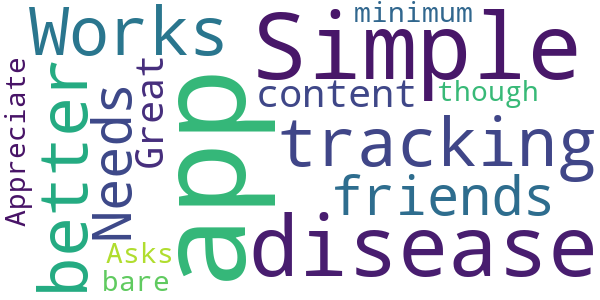

# Hunala
App version ``1.0``

Analyzed with [covid-apps-observer](http://github.com/covid-apps-observer) project, version ``0.1``

## App overview
| | |
|-------------------------|-------------------------| 
| **Name**                                          | Hunala |
| **Unique identifier** | edu.yale.fas.hunala |
| **Link to Google Play** | [https://play.google.com/store/apps/details?id=edu.yale.fas.hunala](https://play.google.com/store/apps/details?id=edu.yale.fas.hunala) |
| **Summary**  | Get a personalized assessment on your risk of contracting respiratory diseases. |
| **Privacy policy** | [https://hunala.yale.edu/privacy-policy](https://hunala.yale.edu/privacy-policy) |
| **Latest version** | 1.0 |
| **Last update** | 2020-05-30 02:41:46 |
| **Recent changes** | This update adds support for displaying the risk of respirator illness based on your current GPS location as well as many other improvements and bug fixes. |
| **Installs**  | 1,000+ |
| **Category** | Health & Fitness |
| **First release** | May 18, 2020 |
| **Size**  | 24M |
| **Supported Android version**  | 5.0 and up |

### Description
> Get a personalized assessment on your risk of contracting the flu and other respiratory diseases, updated daily.  Keep yourself and your community safe by staying informed about the spread of respiratory disease. Make proactive and intelligent decisions about your health by knowing how likely you are to get sick. 
 Hunala leverages cutting edge network science and machine learning (that uses both crowdsourced and public information) to determine your likelihood of contracting the flu or other respiratory illnesses. Using the information you provide about your own location and social interactions, Hunala maps the distribution of symptoms and can offer information about how to avoid contracting an illness. By updating information daily, you have a powerful tool for monitoring risk of exposure.
 Hunala’s networking sensor technology was developed in the lab of Sterling Professor at Yale University, Nicholas A. Christakis, MD, PhD, and his Human Nature Lab team. All results come directly from this research lab.
 How Hunala works: list people you spend time with, fill out a brief daily survey to self-report any symptoms you may have, and get daily updates on your exposure risk based on where you live.
 Use Hunala to: stay up-to-date on how flu and respiratory disease is spreading through your community, get recommendations on how to avoid contracting the flu, and help your community lower its risk of the flu by crowdsourcing an effective response.

### User interface
The developers of the app provide the following screenshots in the Google play store.
| | | |
|:-------------------------:|:-------------------------:|:-------------------------:|
 |   |   |   | 

## Development team
In the following we report the main information provided by the development team in the Google play store.

| | |
|-------------------------|-------------------------|
| **Developer**  | Yale University |
| **Website**  | [https://hunala.yale.edu](https://hunala.yale.edu) |
| **Email** | hunalaquestions@yale.edu |
| **Physical address**  | [25 Science Park New Haven, CT 06511](https://www.google.com/maps/search/25%20Science%20Park%20New%20Haven,%20CT%2006511) (Google Maps) |
| **Other developed apps**  | [https://play.google.com/store/apps/developer?id=Yale+University](https://play.google.com/store/apps/developer?id=Yale+University) |

## Android support

| | |
|-------------------------|-------------------------|
| **Declared target Android version**  | Pie, version 9 (API level 28) |
| **Effective target Android version**  | Pie, version 9 (API level 28) |
| **Minimum supported Android version**  | Lollipop, version 5.0 (API level 21) |
| **Maximum target Android version**  | - |

The larger the difference between the minimum and maximum supported Android versions, the better. A larger difference means a wider audience. For example, old phones have a very low Android version, so a high minimum supported Android version means that the app cannot be used by users with old phones, thus leading to accessibility problems. 

## Requested permissions

In the following we report the complete list of the permissions requested by the app. 

| **Permission** | **Protection level** | **Description** | 
|-------------------------|-------------------------|-------------------------|
 **android.permission ACCESS_BACKGROUND_LOCATION** | :warning:**Dangerous** | Allows an app to access location in the background. 
 **android.permission ACCESS_FINE_LOCATION** | :warning:**Dangerous** | Allows an app to access precise location. 
 **android.permission ACCESS_NETWORK_STATE** | Normal | Allows applications to access information about networks. 
 **android.permission INTERNET** | Normal | Allows applications to open network sockets. 
 **android.permission READ_CONTACTS** | :warning:**Dangerous** | Allows an application to read the user's contacts data. 
 **android.permission VIBRATE** | Normal | Allows access to the vibrator. 
 **android.permission WAKE_LOCK** | Normal | Allows using PowerManager WakeLocks to keep processor from sleeping or screen from dimming. 
 **com.google.android.c2dm.permission RECEIVE** | - | - 
 **com.google.android.finsky.permission BIND_GET_INSTALL_REFERRER_SERVICE** | - | - 
 **edu.yale.fas.hunala.permission C2D_MESSAGE** | - | - 

## Mentioned servers

| **Server** | **Registrant** | **Registrant country** | **Creation date** | 
|-------------------------|-------------------------|-------------------------|-------------------------|
 | android.com | Google LLC | :us: US | 1997-06-23 04:00:00 |
 | googlesyndication.com | Google LLC | :us: US | 2003-01-21 06:17:24 |
 | google.com | Google LLC | :us: US | 1997-09-15 04:00:00 |
 | app-measurement.com | Google LLC | :us: US | 2015-06-19 20:13:31 |
 | googleapis.com | Google LLC | :us: US | 2005-01-25 17:52:26 |
 | googleadservices.com | Google LLC | :us: US | 2003-06-19 16:34:53 |

## Security analysis 

Below we report the main security warnings raised by our execution of the [Androwarn](https://github.com/maaaaz/androwarn) security analysis tool.

**Connection interfaces exfiltration**
> - This application reads details about the currently active data network 
> - This application tries to find out if the currently active data network is metered 

**Suspicious connection establishment**
> - This application opens a Socket and connects it to the remote address '' on the 'N/A' port  
> - This application opens a Socket and connects it to the remote address 'Ljava/lang/StringBuilder;->toString()Ljava/lang/String;' on the ': connect, resolve' port  
> - This application opens a Socket and connects it to the remote address 'Ljava/lang/StringBuilder;->toString()Ljava/lang/String;' on the 'N/A' port  
> - This application opens a Socket and connects it to the remote address 'Ljava/net/Proxy;->type()Ljava/net/Proxy$Type;' on the 'N/A' port  
> - This application opens a Socket and connects it to the remote address 'timeout' on the 'N/A' port  

**Pim data leakage**
> - This application accesses data stored in the clipboard 

**Code execution**
> - This application loads a native library 
> - This application executes a UNIX command 

## User ratings and reviews

Below we provide information about how end users are reacting to the app in terms of ratings and reviews in the Google Play store.

### Ratings

The Hunala app has been installed by more than **1000** times. At this time, **7** rated the app and its average score is **3.142857**. Below we show the distribution of the ratings across the usual star-based rating of Google Play

:star::star::star::star::star:: 2

:star::star::star::star:: 1

:star::star::star:: 1

:star::star:: 2

:star:: 1

### Reviews 

#### 5-star reviews

> Needs more content. Great app though.  :date: __2020-11-18 19:16:46__

> Appreciate that it Asks for the bare minimum  :date: __2020-08-15 14:41:33__

#### 4-star reviews

> So the app is good but the notification schedule page is glitching out so I can't change the time.  :date: __2020-06-11 10:51:51__

#### 3-star reviews

> Why does personal risk max out of I say I've stayed home for non-illness reasons (eg, working from home to mitigate sars2 spread)?  :date: __2020-06-09 14:53:29__

#### 2-star reviews

> Sorry, a fail out of the gate: I enter my phone; they send a text; I switch to my SMS app to get the code; I switch back to Hunala. It restarts the app and asks for my phone Basic Android event-flow  :date: __2020-11-27 19:57:06__

> Very cool idea, but when I enter my phone number (doube and triple checked), no code is sent and I'm left without access to the app  :date: __2020-08-15 14:53:31__

> I had high hopes for this app. But the questions are few and don't allow nuance, and the results seem to vary wildly for no reason. I tried to provide feedback, but wasn't answered elsewhere, and in app does not allow questions/help/etc. Very disappointed and feel used  :date: __2020-06-09 16:10:03__

> Good idea, but after asking for my contacts, it tells me there is no information available in my area. There are globally available data sources, so that shouldn't be an issue. And you shouldn't need access to my contacts' information. If you know where I am, how many estimated cases there are, the size of the population and how many people I have contact with, you can show me a number representing my risk, and a note about the confidence level of that information.  :date: __2020-06-04 13:21:15__

#### 1-star reviews

> Way too much personal info asked.  :date: __2020-11-19 05:24:30__

> I love the concept. But I am traveling across the U.S. and the app "find my location" tool never works. Yes, my phone GPS is on. Yes, all permissions have been granted. I travel for a living and I know how to use this stuff. I am having no problems with local search, routing, weather and all the other apps that use my phone's GPS location. Just this one. There is something wrong with this app. It is of no use to me if it isn't tracking the many states I'm traveling thru each day.  :date: __2020-06-03 14:23:53__

