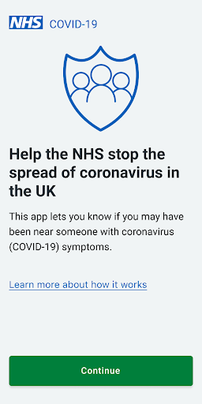
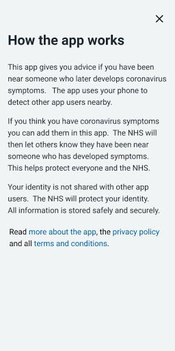
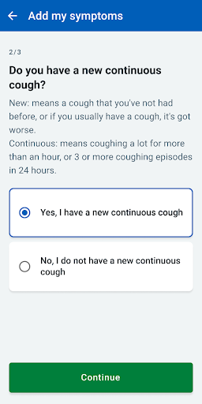
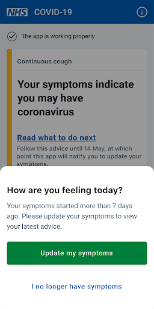

# NHS COVID-19 – Isle of Wight residents only
App version ``Varies with device``

Analyzed with [covid-apps-observer](http://github.com/covid-apps-observer) project, version ``0.1``

## App overview
| | |
|-------------------------|-------------------------| 
| **Name**&nbsp;&nbsp;&nbsp;&nbsp;&nbsp;&nbsp;&nbsp;&nbsp;&nbsp;&nbsp;&nbsp;&nbsp;&nbsp;&nbsp;&nbsp;&nbsp;&nbsp;&nbsp;&nbsp;&nbsp;&nbsp;&nbsp;&nbsp;&nbsp;&nbsp;&nbsp;&nbsp;&nbsp;&nbsp;&nbsp;&nbsp;&nbsp;&nbsp;&nbsp;&nbsp;&nbsp;&nbsp;&nbsp;&nbsp;&nbsp;  | NHS COVID-19 – Isle of Wight residents only |
| **Unique identifier** | uk.nhs.nhsx.colocate |
| **Link to Google Play** | [https://play.google.com/store/apps/details?id=uk.nhs.nhsx.colocate](https://play.google.com/store/apps/details?id=uk.nhs.nhsx.colocate) |
| **Summary**  | The NHS needs Islanders to play your part in the fight against coronavirus |
| **Privacy policy** | [https://covid19.nhs.uk/our-policies.html](https://covid19.nhs.uk/our-policies.html) |
| **Latest version** | Varies with device |
| **Last update** | 2020-05-09 00:07:00 |
| **Recent changes** | NHS COVID-19 – Isle of Wight residents only |
| **Installs**  | 10,000+ |
| **Category** | Medical |
| **First release** | - |
| **Size**  | Varies with device |
| **Supported Android version**  | Varies with device |

### Description
> This is the first version of the app, currently available for Isle of Wight residents only. If you develop symptoms of coronavirus and report them in the app, the NHS COVID-19 app will anonymously warn those that you have been near to. They will receive advice from the NHS on the right action to take to stop the virus spreading further. This means that people can be quickly encouraged to self-isolate before they become infectious, allowing the country to stay one step ahead of the virus.

### User interface
The developers of the app provide the following screenshots in the Google play store.
| | | |
|:-------------------------:|:-------------------------:|:-------------------------:|
 |   |   |   | 
 |   |  

## Development team
In the following we report the main information provided by the development team in the Google play store.

| | |
|-------------------------|-------------------------|
| **Developer**  | NHSX |
| **Website**  | - |
| **Email** | NHSCovid-19AppStoreSupport@nhsbsa.nhs.uk |
| **Physical address**  | - |
| **Other developed apps**  | [https://play.google.com/store/apps/developer?id=NHSX](https://play.google.com/store/apps/developer?id=NHSX) |

## Android support

| | |
|-------------------------|-------------------------|
| **Declared target Android version**  | Android10, version 10 (API level 29) |
| **Effective target Android version**  | Android10, version 10 (API level 29) |
| **Minimum supported Android version**  | Nougat, version 7.0 (API level 24) |
| **Maximum target Android version**  | - |

The larger the difference between the minimum and maximum supported Android versions, the better. A larger difference means a wider audience. For example, old phones have a very low Android version, so a high minimum supported Android version means that the app cannot be used by users with old phones, thus leading to accessibility problems. 

## Requested permissions

In the following we report the complete list of the permissions requested by the app. 

| **Permission** | **Protection level** | **Description** | 
|-------------------------|-------------------------|-------------------------|
 **android.permission ACCESS_BACKGROUND_LOCATION** | :warning:**Dangerous** | Allows an app to access location in the background. 
 **android.permission ACCESS_COARSE_LOCATION** | :warning:**Dangerous** | Allows an app to access approximate location. 
 **android.permission ACCESS_FINE_LOCATION** | :warning:**Dangerous** | Allows an app to access precise location. 
 **android.permission ACCESS_NETWORK_STATE** | Normal | Allows applications to access information about networks. 
 **android.permission BLUETOOTH** | Normal | Allows applications to connect to paired bluetooth devices. 
 **android.permission BLUETOOTH_ADMIN** | Normal | Allows applications to discover and pair bluetooth devices. 
 **android.permission FOREGROUND_SERVICE** | Normal | Allows a regular application to use Service.startForeground. 
 **android.permission INTERNET** | Normal | Allows applications to open network sockets. 
 **android.permission RECEIVE_BOOT_COMPLETED** | Normal | Allows an application to receive the Intent.ACTION_BOOT_COMPLETED that is broadcast after the system finishes booting. 
 **android.permission WAKE_LOCK** | Normal | Allows using PowerManager WakeLocks to keep processor from sleeping or screen from dimming. 
 **android.permission WRITE_INTERNAL_STORAGE** | - | - 
 **com.google.android.c2dm.permission RECEIVE** | - | - 

## Mentioned servers

| **Server** | **Registrant** | **Registrant country** | **Creation date** | 
|-------------------------|-------------------------|-------------------------|-------------------------|
 | google.com | Google LLC | :us: US | 1997-09-15 04:00:00 |
 | crashlytics.com | Google LLC | :us: US | 2011-01-21 15:30:40 |
 | microsoft.com | Microsoft Corporation | :us: US | 1991-05-02 04:00:00 |
 | googlesource.com | Google LLC | :us: US | 2004-10-20 18:31:43 |
 | googleapis.com | Google LLC | :us: US | 2005-01-25 17:52:26 |
 |  | - | - | 1996-08-01 00:00:00 |
 |  | - | - | 1996-08-01 00:00:00 |
 |  | - | - | 1996-08-01 00:00:00 |
 |  | - | - | 1996-08-01 00:00:00 |
 |  | - | - | 1996-08-01 00:00:00 |

## Security analysis 

Below we report the main security warnings raised by our execution of the [Androwarn](https://github.com/maaaaz/androwarn) security analysis tool.

**Telephony identifiers leakage**
> - This application reads the ISO country code equivalent of the current registered operator's MCC (Mobile Country Code) 
> - This application reads the numeric name (MCC+MNC) of current registered operator 
> - This application reads the operator name 

**Connection interfaces exfiltration**
> - This application reads details about the currently active data network 
> - This application tries to find out if the currently active data network is metered 

**Telephony services abuse**
> - This application makes phone calls 

**Suspicious connection establishment**
> - This application opens a Socket and connects it to the remote address '' on the 'N/A' port  
> - This application opens a Socket and connects it to the remote address 'Ljava/lang/StringBuilder;->toString()Ljava/lang/String;' on the 'N/A' port  
> - This application opens a Socket and connects it to the remote address 'Ljava/net/Proxy;->type()Ljava/net/Proxy$Type;' on the 'N/A' port  
> - This application opens a Socket and connects it to the remote address 'timeout' on the 'N/A' port  

## User ratings and reviews

Below we provide information about how end users are reacting to the app in terms of ratings and reviews in the Google Play store.

### Ratings

The NHS COVID-19 – Isle of Wight residents only app has been installed by more than **10000** times. At this time, **-** rated the app and its average score is **-**. Below we show the distribution of the ratings across the usual star-based rating of Google Play

:star::star::star::star::star:: -

:star::star::star::star:: -

:star::star::star:: -

:star::star:: -

:star:: -

### Reviews 

#### 5-star reviews

No recent reviews available with 5 stars.

#### 4-star reviews

No recent reviews available with 4 stars.

#### 3-star reviews

No recent reviews available with 3 stars.

#### 2-star reviews

No recent reviews available with 2 stars.

#### 1-star reviews

No recent reviews available with 1 stars.
