# COVID-related Android apps - custom analysis

Author: `Ivano Malavolta` (ivanomalavolta@gmail.com)

Created at: `2020/10/26`

Report generated by the [covid-apps-observer](http://github.com/covid-apps-observer) project, version 0.1

# Table of contents 

- [Background](#background)
    * [Data sources and analyses](#data-sources-and-analyses)
        * [App metadata](#app-metadata)
        * [Requested permissions](#requested-permissions)
        * [Mentioned servers](#mentioned_servers)
        * [Security analysis](#security_analysis)
        * [User ratings and reviews](#user-ratings-and-reviews)
    * [Disclaimer](#disclaimer)
- [CredoWeb Österreich – Ihr Gesundheitsnetzwerk!](#credoweb-österreich-–-ihr-gesundheitsnetzwerk)
- [First Aid-Australian Red Cross](#first-aid-australian-red-cross)
- [ROPAH Guides](#ropah-guides)
- [Pill Reminder & Medication Reminder: MedicineWise](#pill-reminder--medication-reminder-medicinewise)
- [Queanbeyan GP Super Clinic](#queanbeyan-gp-super-clinic)
- [GiveBlood](#giveblood)
- [PainPoint –Prevent Work Injury](#painpoint-–prevent-work-injury)
- [PTSD Coach Canada](#ptsd-coach-canada)
- [gym4all](#gym4all)
- [PatientConcept](#patientconcept)
- [CredoWeb Deutschland – Ihr Gesundheitsnetzwerk!](#credoweb-deutschland-–-ihr-gesundheitsnetzwerk)
- [Pollenflug-Vorhersage](#pollenflug-vorhersage)
- [Erkältungs-Tipps](#erkältungs-tipps)
- [Selbsthilfe Brandenburgs Norden](#selbsthilfe-brandenburgs-norden)
- [Deutsche Apotheker Zeitung](#deutsche-apotheker-zeitung)
- [Simple Symptom Diary](#simple-symptom-diary)
- [alerta ETS, notificación anónima y gratuita](#alerta-ets-notificación-anónima-y-gratuita)
- [Agenda Mobile](#agenda-mobile)
- [COLONCOP](#coloncop)
- [NAOS Game](#naos-game)
- [(silencio) barcelona](#(silencio)-barcelona)
- [Club Natacio Barcelona](#club-natacio-barcelona)
- [CALIOPE: Calidad del Aire](#caliope-calidad-del-aire)
- [Bolsa Empleo SAS 2.0](#bolsa-empleo-sas-2.0)
- [meSoigner - Ma pharmacie tout de suite](#mesoigner---ma-pharmacie-tout-de-suite)
- [Ma Pharmacie Leadersanté](#ma-pharmacie-leadersanté)
- [myAPHM](#myaphm)
- [Daily PSO](#daily-pso)
- [RetinaRisk](#retinarisk)
- [SexOS](#sexos)
- [VideoInsight®](#videoinsight®)
- [Farmacia Levorato Este](#farmacia-levorato-este)
- [XINFO CNOP COMUNICAZIONE 3.0](#xinfo-cnop-comunicazione-3.0)
- [Prontuario Farmaceutico](#prontuario-farmaceutico)
- [Energy Live Piscine](#energy-live-piscine)
- [TMT World - Congress & Events](#tmt-world---congress--events)
- [WEBGYM：運動の習慣化をサポート！](#webgym：運動の習慣化をサポート！)
- [StepWalk Pedometer](#stepwalk-pedometer)
- [Huidmonitor](#huidmonitor)
- [MCA ETDR](#mca-etdr)
- [MY LUZ](#my-luz)
- [Аналоги лекарств, справочник лекарств](#аналоги-лекарств-справочник-лекарств)
- [Медздрав](#медздрав)
- [Аналоги лекарств](#аналоги-лекарств)
- [Похудеть без диеты](#похудеть-без-диеты)
- [Well Pharmacy NHS prescription delivery](#well-pharmacy-nhs-prescription-delivery)
- [DREX](#drex)
- [L&R Hosiery Selector](#lr-hosiery-selector)
- [MyTens US by BewellConnect](#mytens-us-by-bewellconnect)
- [MJN Pediatric Product Guide](#mjn-pediatric-product-guide)
- [HeyDoctor](#heydoctor)
- [California Family Fitness](#california-family-fitness)
- [Babylon - Healthcheck, video appointments & more](#babylon---healthcheck-video-appointments--more)
- [myCOMPASS PA](#mycompass-pa)
- [MyACCESS Wisconsin](#myaccess-wisconsin)
- [Harris County Public Health](#harris-county-public-health)
- [FreeStyle LibreLink - US](#freestyle-librelink---us)
- [Indiana WIC](#indiana-wic)
- [Abound Diabetes Mgmt](#abound-diabetes-mgmt)
- [NYC ACCESS HRA](#nyc-access-hra)
- [What's covered](#what's-covered)
- [KnowBullying by SAMHSA](#knowbullying-by-samhsa)
- [YMCA of Northwest North Carolina](#ymca-of-northwest-north-carolina)
- [PLC](#plc)
- [My Health Advisor](#my-health-advisor)

- [Credits](#credits)

# How to read this report

This report has been generated by the [covid-apps-observer](http://github.com/covid-apps-observer) project. The project automatically analyzes the apps by extracting information which is already publicly available either on the web or in the apps binary files. 

Our analysis covers the following apps:
| | |
|-------------------------|-------------------------| 
|  | CredoWeb Österreich – Ihr Gesundheitsnetzwerk!
|  | First Aid-Australian Red Cross
|  | ROPAH Guides
|  | Pill Reminder & Medication Reminder: MedicineWise
|  | Queanbeyan GP Super Clinic
|  | GiveBlood
|  | PainPoint –Prevent Work Injury
|  | PTSD Coach Canada
|  | gym4all
|  | PatientConcept
|  | CredoWeb Deutschland – Ihr Gesundheitsnetzwerk!
|  | Pollenflug-Vorhersage
|  | Erkältungs-Tipps
|  | Selbsthilfe Brandenburgs Norden
|  | Deutsche Apotheker Zeitung
|  | Simple Symptom Diary
|  | alerta ETS, notificación anónima y gratuita
|  | Agenda Mobile
|  | COLONCOP
|  | NAOS Game
|  | (silencio) barcelona
|  | Club Natacio Barcelona
|  | CALIOPE: Calidad del Aire
|  | Bolsa Empleo SAS 2.0
|  | meSoigner - Ma pharmacie tout de suite
|  | Ma Pharmacie Leadersanté
|  | myAPHM
|  | Daily PSO
|  | RetinaRisk
|  | SexOS
|  | VideoInsight®
|  | Farmacia Levorato Este
|  | XINFO CNOP COMUNICAZIONE 3.0
|  | Prontuario Farmaceutico
|  | Energy Live Piscine
|  | TMT World - Congress & Events
|  | WEBGYM：運動の習慣化をサポート！
|  | StepWalk Pedometer
|  | Huidmonitor
|  | MCA ETDR
| 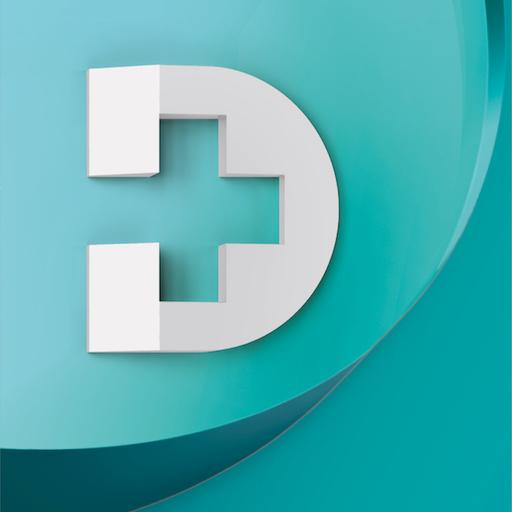 | MY LUZ
|  | Аналоги лекарств, справочник лекарств
|  | Медздрав
|  | Аналоги лекарств
|  | Похудеть без диеты
|  | Well Pharmacy NHS prescription delivery
|  | DREX
|  | L&R Hosiery Selector
|  | MyTens US by BewellConnect
|  | MJN Pediatric Product Guide
|  | HeyDoctor
|  | California Family Fitness
|  | Babylon - Healthcheck, video appointments & more
|  | myCOMPASS PA
|  | MyACCESS Wisconsin
|  | Harris County Public Health
|  | FreeStyle LibreLink - US
| 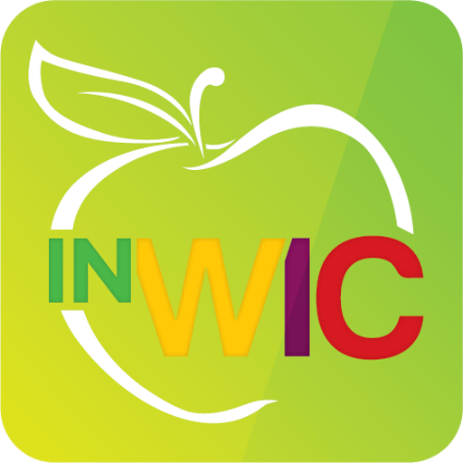 | Indiana WIC
|  | Abound Diabetes Mgmt
|  | NYC ACCESS HRA
|  | What's covered
|  | KnowBullying by SAMHSA
|  | YMCA of Northwest North Carolina
|  | PLC
|  | My Health Advisor

The details of our analysis are presented in the remainder of this report.

For independent verification, the raw data and the source code of the project is publicly available in its GitHub repository [http://github.com/covid-apps-observer](http://github.com/covid-apps-observer) and its source code has been thoroughly commented in order to provide all the details about how the information provided in this report has been extracted. 

Any feedback, questions, and improvements about the project are very welcome, feel free to create an issue or pull request directly in its GitHub repository: [http://github.com/covid-apps-observer](http://github.com/covid-apps-observer).

## Data sources and analyses

The analysis of each app is structured around five main dimensions: 
* App metadata  
* Requested permissions
* Mentioned servers
* Androwarn analysis
* User ratings and reviews

In the following we describe the data sources and analysis performed for each dimension.

### App metadata

App metadata includes an overview of the main information about the app (for example, its name, releases, privacy policy, etc.), contact information of the development team, and the various Android versions supported by the app. This information is extracted from two main data sources:
* _Google Play store_: we automatically mined the web page of the Google Play store showing the basic information about the app and we parsed it in order to extract information about the app and development team 
* _Android Manifest file_: in our analysis we decompiled the binary file of the app (it is similar to a Zip archive but it contains the code of the app instead of normal files) and we extracted information about the supported Android versions, as it has been listed by its development team.

The extracted app metadata feeds the _App overview_, _Development team_, and _Android support_ sections of this report.
We make use of the [google-play-scraper](https://github.com/JoMingyu/google-play-scraper) tool for extracting the raw data related to this dimension of the project.

### Requested permissions

The Android operating system has a permission model which allows users to grant access to potentially privacy-related information. Every Android app has to explictly declare the permissions it needs to properly function in the Android Manifest file.  

In this report we also show the protection level of each permission, which is a key information for understanding how the requested permissions related to the user's privacy. We carefully analyzed the [official Android documentation (v. 29)](https://developer.android.com/reference/android/Manifest.permission), and it resulted that a permission requested by an Android app can belong to the following protection levels:
* **Dangerous**: higher-risk permissions that would give a requesting app access to private user data or control over the device that can negatively impact the user. Because this type of permission introduces potential risk, the system usually does not automatically grant it to the requesting app. For example, any dangerous permissions requested by an app may be displayed to the user and require confirmation before proceeding.
* **Normal**: this is the default and most common level in Android; normal permissions are lower-risk and give access to isolated app-level features, with minimal risk to other apps, the system, or the user. 
* **Signature**: permissions granted only if the requesting app is signed with the same certificate as the app that declared the permission
* **Appop**: old permission level, a reminiscence of the App Ops tool that Google introduced in Android 4.3.
* **Development**: optional permissions which can be granted to development-oriented apps.
* **Privileged**: permissions who give higher power to mobile apps w.r.t. other apps, such as binding to incoming calls, interacting via bluetooth with other devices without user interaction, etc.
* **Preinstalled**: reserved only for preinstalled apps
* **Installer**: allow the holder to start the permission usage screen for an app
* **RetailDemo**: permissions related to devices used in demonstrations in shops.
* **Pre23**: permissions automatically granted to apps targeting devices running pre-6.0 Android.
* **Upcoming**: permissions which will be released in the next version of the Android platform. 
* **Deprecated**: permissions belonging to old releases of the Android platform, they should not be used by developers since they will not be supported in the near future.
* **Not for use by third-party applications**: permissions which can be requested only by apps developed by Google.
* **Undefined**: this protection level is not documented by Google.

The permissions dimension of this project is based on the [Androguard](https://github.com/androguard/androguard) static analysis tool.

### Mentioned servers

We decompiled each app in order to look for all possible mentions of remote URLs. The mentioned URLs can refer to remote servers the the app is using for either sending or receiving information, web addresses for directing the user to an information website, and so on. 

:warning: It is important to note that this analysis is not meant to be complete and it is very prone to obfuscation. The servers reported here are simply _mentioned_ somewhere in the code of the app and are meant to just give an indication about the "hooks" of the app towards external resources. For example, for an Android app it is normal to contact Google services in order to send/receive push notifications, or to contact the servers of analytics services for having real-time diagnostics about crashes of the app or bugs.

This part of the analysis is based on the [Androguard](https://github.com/androguard/androguard) static analysis tool for identfying the raw URLs mentioned in the app; then, the information about each mentioned server is collected by performing a _whois_ lookup on the first-level domain present in the URL.

### Security analysis

This dimension is based on the [Androwarn](https://github.com/maaaaz/androwarn) structural and data flow analysis of Android bytecode. Androwarn is developed by the University of Lyon/INSA (France) and it has been used in several academic studies. According to its documentation, Androwarn targets the following categories of potential security issues:
* **Telephony identifiers exfiltration**: IMEI, IMSI, MCC, MNC, LAC, CID, operator's name, etc.
* **Device settings exfiltration**: software version, usage statistics, system settings, logs, etc.
* **Geolocation information leakage**: GPS/WiFi geolocation, etc.
* **Connection interfaces information exfiltration**: WiFi credentials, Bluetooth MAC adress, etc.
* **Telephony services abuse**: premium SMS sending, phone call composition, etc.
* **Audio/video flow interception**: call recording, video capture, etc.
* **Remote connection establishment**: socket open call, Bluetooth pairing, APN settings edit, etc.
* **PIM data leakage**: contacts, calendar, SMS, mails, clipboard, etc.
* **External memory operations**: file access on SD card, etc.
* **PIM data modification**: add/delete contacts, calendar events, etc.
* **Arbitrary code execution**: native code using JNI, UNIX command, privilege escalation, etc.
* **Denial of Service**: event notification deactivation, file deletion, process killing, virtual keyboard disable, terminal shutdown/reboot, etc.

Note: We do not consider this data point in the current version of our analyzers since it is too verbose for our purposes.

:warning: It is important to note that Androwarn is a static analysis tool, and as such it performs a variety of heuristics and approximations in its analyses. Said that, the results shown in this report are meant to provide an indication of _potential_ security issues and should be by no means treated as complete and correct.   

### User ratings and reviews

For this dimension we turn again to the web interface of the Google Play store. Firstly, we automatically mine summary statistics about user ratings from the web page of the app under analysis; then, we automatically download the newest 1000 reviews of the app under analysis. For each level of rating (5 stars, 4 stars, , etc., 1 star) we show:
- a word cloud presenting the main terms used by end users in their reviews in the Google Play store
- the last 10 reviews provided by app users in the Google Play store. 

This purposefully simple analysis is meant to help both future users and the development team of the app in understanding what are the main positive and negative points of the app under analysis.

We make use of the [google-play-scraper](https://github.com/JoMingyu/google-play-scraper) tool for extracting the raw data related to this dimension of the project.

## Disclaimer 

This report has been produced independently of any parties and its only objective is to help anybody in better understanding how COVID-related apps work in practice (and compare to each other). The results of this report are limited to the specific version of the software used for running the analyses and on the various heuristics implemented in there. In other words, the results of the analyzers may differ depending on the time and modalities in which they are executed. We do not guarantee that the results of the analyses and the corresponding contents of this report are fully complete or correct. The analysis software is licensed under the [MIT License](https://github.com/iivanoo/covid-apps-observer/blob/master/LICENSE).

# CredoWeb Österreich – Ihr Gesundheitsnetzwerk!
App version ``2.4.6``

Analyzed with [covid-apps-observer](http://github.com/covid-apps-observer) project, version ``0.1``

## App overview
| | |
|-------------------------|-------------------------| 
| **Name**&nbsp;&nbsp;&nbsp;&nbsp;&nbsp;&nbsp;&nbsp;&nbsp;&nbsp;&nbsp;&nbsp;&nbsp;&nbsp;&nbsp;&nbsp;&nbsp;&nbsp;&nbsp;&nbsp;&nbsp;&nbsp;&nbsp;&nbsp;&nbsp;&nbsp;&nbsp;&nbsp;&nbsp;&nbsp;&nbsp;&nbsp;&nbsp;&nbsp;&nbsp;&nbsp;&nbsp;&nbsp;&nbsp;&nbsp;&nbsp;  | CredoWeb Österreich – Ihr Gesundheitsnetzwerk! |
| **Unique identifier** | at.credoweb.android |
| **Link to Google Play** | [https://play.google.com/store/apps/details?id=at.credoweb.android](https://play.google.com/store/apps/details?id=at.credoweb.android) |
| **Summary**  | CredoWeb verbindet die gesamte Gesundheitsbranche Österreichs in einer App! |
| **Privacy policy** | [https://www.credoweb.at/privacy-policy](https://www.credoweb.at/privacy-policy) |
| **Latest version** | 2.4.6 |
| **Last update** | 2020-10-18 17:47:16 |
| **Recent changes** | Niemand mag Bugs in der App - wir auch nicht!  Deshalb updaten wir CredoWeb regelmäßig und verbessern ständig unsere App.  Jedes Update enthält Fehlerbehebungen und Verbesserungen der Performance. |
| **Installs**  | 100+ |
| **Category** | Medizin |
| **First release** | 27.09.2017 |
| **Size**  | 55M |
| **Supported Android version**  | 5.0 oder höher |

### Description
> CredoWeb - Das österreichische Netzwerk für Gesundheit.
 www.CredoWeb.at verbindet die gesamte Gesundheitsbranche auf einer professionellen Plattform! Es ermöglicht Ärzten und allen Health Professionals sich mit Kollegen und der Öffentlichkeit zu unterhalten. Jeder kann ein kostenloses Profil erstellen und so sein medizinisches Leistungsspektrum optimal darstellen. 
 Durch CredoWeb erhalten alle einen professionellen Zugang zu Fachinformationen, aktuell und gefiltert nach Ihren Bedürfnissen. Bei der Suche nach einem bestimmten Themenbereich werden alle relevanten Artikel und Informationen, gleich gemeinsam mit den Kontaktdaten von spezialisierten ÄrztInnen aufgelistet. So fällt es PatientInnen leichter, sich gezielt über neue wissenschaftliche Erkenntnisse und mögliche Therapieoptionen zu informieren und auszutauschen. Noch einfacher kann man Arzt und Patient nicht zusammenbringen.
 App-Funktionen:
 • Artikel posten und Erfahrungen mit Kollegen austauschen
 • Aktuelle medizinische Informationen lesen
 • An virtuellen Diskussionen und Veranstaltungen teilnehmen

### User interface
The developers of the app provide the following screenshots in the Google play store.
| | | |
|:-------------------------:|:-------------------------:|:-------------------------:|
 |   |   |   | 
 |   |  

## Development team
In the following we report the main information provided by the development team in the Google play store.

| | |
|-------------------------|-------------------------|
| **Developer**  | CredoWeb Services |
| **Website**  | [http://www.credoweb.bg](http://www.credoweb.bg) |
| **Email** | it@credoweb.bg |
| **Physical address**  | - |
| **Other developed apps**  | [https://play.google.com/store/apps/developer?id=CredoWeb+Services](https://play.google.com/store/apps/developer?id=CredoWeb+Services) |

## Android support

| | |
|-------------------------|-------------------------|
| **Declared target Android version**  | Pie, version 9 (API level 28) |
| **Effective target Android version**  | Pie, version 9 (API level 28) |
| **Minimum supported Android version**  | KitKat, version 4.4 - 4.4.4 (API level 19) |
| **Maximum target Android version**  | - |

The larger the difference between the minimum and maximum supported Android versions, the better. A larger difference means a wider audience. For example, old phones have a very low Android version, so a high minimum supported Android version means that the app cannot be used by users with old phones, thus leading to accessibility problems. 

## Requested permissions

In the following we report the complete list of the permissions requested by the app. 

| **Permission** | **Protection level** | **Description** | 
|-------------------------|-------------------------|-------------------------|
 **android.permission ACCESS_FINE_LOCATION** | :warning:**Dangerous** | Allows an app to access precise location. 
 **android.permission ACCESS_NETWORK_STATE** | Normal | Allows applications to access information about networks. 
 **android.permission CAMERA** | :warning:**Dangerous** | Required to be able to access the camera device. 
 **android.permission INTERNET** | Normal | Allows applications to open network sockets. 
 **android.permission READ_APP_BADGE** | - | - 
 **android.permission READ_EXTERNAL_STORAGE** | :warning:**Dangerous** | Allows an application to read from external storage. 
 **android.permission READ_PHONE_STATE** | :warning:**Dangerous** | Allows read only access to phone state, including the phone number of the device, current cellular network information, the status of any ongoing calls, and a list of any PhoneAccounts registered on the device. 
 **android.permission RECEIVE_BOOT_COMPLETED** | Normal | Allows an application to receive the Intent.ACTION_BOOT_COMPLETED that is broadcast after the system finishes booting. 
 **android.permission VIBRATE** | Normal | Allows access to the vibrator. 
 **android.permission WAKE_LOCK** | Normal | Allows using PowerManager WakeLocks to keep processor from sleeping or screen from dimming. 
 **android.permission WRITE_EXTERNAL_STORAGE** | :warning:**Dangerous** | Allows an application to write to external storage. 
 **com.anddoes.launcher.permission UPDATE_COUNT** | - | - 
 **com.google.android.c2dm.permission RECEIVE** | - | - 
 **com.google.android.finsky.permission BIND_GET_INSTALL_REFERRER_SERVICE** | - | - 
 **com.htc.launcher.permission READ_SETTINGS** | - | - 
 **com.htc.launcher.permission UPDATE_SHORTCUT** | - | - 
 **com.huawei.android.launcher.permission CHANGE_BADGE** | - | - 
 **com.huawei.android.launcher.permission READ_SETTINGS** | - | - 
 **com.huawei.android.launcher.permission WRITE_SETTINGS** | - | - 
 **com.majeur.launcher.permission UPDATE_BADGE** | - | - 
 **com.oppo.launcher.permission READ_SETTINGS** | - | - 
 **com.oppo.launcher.permission WRITE_SETTINGS** | - | - 
 **com.sec.android.provider.badge.permission READ** | - | - 
 **com.sec.android.provider.badge.permission WRITE** | - | - 
 **com.sonyericsson.home.permission BROADCAST_BADGE** | - | - 
 **com.sonymobile.home.permission PROVIDER_INSERT_BADGE** | - | - 
 **me.everything.badger.permission BADGE_COUNT_READ** | - | - 
 **me.everything.badger.permission BADGE_COUNT_WRITE** | - | - 

## Mentioned servers

| **Server** | **Registrant** | **Registrant country** | **Creation date** | 
|-------------------------|-------------------------|-------------------------|-------------------------|
 | cloudfront.net | Amazon.com, Inc. | :us: US | 2008-04-25 18:25:49 |
 | credoweb.co | GDPR Masked | :us: US | 2017-11-08 16:15:36 |
 | lilly.com | Eli Lilly and Company | :us: US | 1991-05-10 04:00:00 |
 | google.com | Google LLC | :us: US | 1997-09-15 04:00:00 |
 | xmlpull.org | WhoisGuard, Inc. | PA | 2001-11-26 20:33:08 |
 | facebook.com | Facebook, Inc. | :us: US | 1997-03-29 05:00:00 |
 | googlesyndication.com | Google LLC | :us: US | 2003-01-21 06:17:24 |
 | doubleclick.net | Google Inc. | :us: US | 1996-01-16 05:00:00 |
 | gstatic.com | Google LLC | :us: US | 2008-02-11 15:31:25 |
 | googleapis.com | Google LLC | :us: US | 2005-01-25 17:52:26 |
 | app-measurement.com | Google LLC | :us: US | 2015-06-19 20:13:31 |
 | youtube.com | Google LLC | :us: US | 2005-02-15 05:13:12 |
 | googleapis.com | Google LLC | :us: US | 2005-01-25 17:52:26 |
 | credoweb.at | - | - | - |
 | credoweb.com | GDPR Masked | BG | 1999-08-04 17:12:46 |
 | crashlytics.com | Google LLC | :us: US | 2011-01-21 15:30:40 |

## Security analysis 

Below we report the main security warnings raised by our execution of the [Androwarn](https://github.com/maaaaz/androwarn) security analysis tool.

**Telephony identifiers leakage**
> - This application reads the device phone type value 
> - This application reads the numeric name (MCC+MNC) of current registered operator 
> - This application reads the operator name 
> - This application reads the radio technology (network type) currently in use on the device for data transmission 

**Connection interfaces exfiltration**
> - This application reads details about the currently active data network 
> - This application tries to find out if the currently active data network is metered 

**Telephony services abuse**
> - This application makes phone calls 

**Suspicious connection establishment**
> - This application opens a Socket and connects it to the remote address '' on the 'N/A' port  
> - This application opens a Socket and connects it to the remote address 'Ljava/lang/StringBuilder;->toString()Ljava/lang/String;' on the ': connect, resolve' port  
> - This application opens a Socket and connects it to the remote address 'Ljava/lang/StringBuilder;->toString()Ljava/lang/String;' on the 'N/A' port  
> - This application opens a Socket and connects it to the remote address 'Ljava/net/Proxy;->type()Ljava/net/Proxy$Type;' on the 'N/A' port  
> - This application opens a Socket and connects it to the remote address 'timeout' on the 'N/A' port  

**Pim data leakage**
> - This application accesses the downloads folder 
> - This application accesses data stored in the clipboard 

## User ratings and reviews

Below we provide information about how end users are reacting to the app in terms of ratings and reviews in the Google Play store.

### Ratings

The CredoWeb Österreich – Ihr Gesundheitsnetzwerk! app has been installed by more than **100** times. At this time, **8** rated the app and its average score is **5.0**. Below we show the distribution of the ratings across the usual star-based rating of Google Play

:star::star::star::star::star:: 8

:star::star::star::star:: 0

:star::star::star:: 0

:star::star:: 0

:star:: 0

### Reviews 

#### 5-star reviews

No recent reviews available with 5 stars.

#### 4-star reviews

No recent reviews available with 4 stars.

#### 3-star reviews

No recent reviews available with 3 stars.

#### 2-star reviews

No recent reviews available with 2 stars.

#### 1-star reviews

No recent reviews available with 1 stars.

# First Aid-Australian Red Cross
App version ``3.3.0``

Analyzed with [covid-apps-observer](http://github.com/covid-apps-observer) project, version ``0.1``

## App overview
| | |
|-------------------------|-------------------------| 
| **Name**&nbsp;&nbsp;&nbsp;&nbsp;&nbsp;&nbsp;&nbsp;&nbsp;&nbsp;&nbsp;&nbsp;&nbsp;&nbsp;&nbsp;&nbsp;&nbsp;&nbsp;&nbsp;&nbsp;&nbsp;&nbsp;&nbsp;&nbsp;&nbsp;&nbsp;&nbsp;&nbsp;&nbsp;&nbsp;&nbsp;&nbsp;&nbsp;&nbsp;&nbsp;&nbsp;&nbsp;&nbsp;&nbsp;&nbsp;&nbsp;  | First Aid-Australian Red Cross |
| **Unique identifier** | com.cube.gdpc.aus |
| **Link to Google Play** | [https://play.google.com/store/apps/details?id=com.cube.gdpc.aus](https://play.google.com/store/apps/details?id=com.cube.gdpc.aus) |
| **Summary**  | First Aid at your finger tips! |
| **Privacy policy** | [http://www.redcross.org.au/privacy.aspx](http://www.redcross.org.au/privacy.aspx) |
| **Latest version** | 3.3.0 |
| **Last update** | 2020-08-17 17:41:19 |
| **Recent changes** | We&#39;ve fixed some minor issues you may have been experiencing. |
| **Installs**  | 100,000+ |
| **Category** | Medical |
| **First release** | Sep 3, 2013 |
| **Size**  | 8.7M |
| **Supported Android version**  | 5.0 and up |

### Description
> Simple. Free. It can save a life. The official Australian Red Cross First Aid app gives you instant access to the information you need to know to handle the most common first aid emergencies. Interactive and simple step-by-step advice means it’s never been easier to know first aid. 
 Developed for the Australian market as part of a global project by the International Federation of Red Cross and Red Crescent societies and Red Cross’ Global Disaster Preparedness Centre the APP features up to date CPR and First Aid guidelines as set out by the Australian Resuscitation Council (ARC).
 To ensure your app content is available at the time of an emergency, please open the app upon installation so the app can retrieve all relevant local content before the need strikes.

### User interface
The developers of the app provide the following screenshots in the Google play store.
| | | |
|:-------------------------:|:-------------------------:|:-------------------------:|
 |   |   |   | 
 |   |  

## Development team
In the following we report the main information provided by the development team in the Google play store.

| | |
|-------------------------|-------------------------|
| **Developer**  | Australian Red Cross |
| **Website**  | [http://www.redcross.org.au](http://www.redcross.org.au) |
| **Email** | contactus@redcross.org.au |
| **Physical address**  | - |
| **Other developed apps**  | [https://play.google.com/store/apps/developer?id=Australian+Red+Cross](https://play.google.com/store/apps/developer?id=Australian+Red+Cross) |

## Android support

| | |
|-------------------------|-------------------------|
| **Declared target Android version**  | Pie, version 9 (API level 28) |
| **Effective target Android version**  | Pie, version 9 (API level 28) |
| **Minimum supported Android version**  | Lollipop, version 5.0 (API level 21) |
| **Maximum target Android version**  | - |

The larger the difference between the minimum and maximum supported Android versions, the better. A larger difference means a wider audience. For example, old phones have a very low Android version, so a high minimum supported Android version means that the app cannot be used by users with old phones, thus leading to accessibility problems. 

## Requested permissions

In the following we report the complete list of the permissions requested by the app. 

| **Permission** | **Protection level** | **Description** | 
|-------------------------|-------------------------|-------------------------|
 **android.permission ACCESS_FINE_LOCATION** | :warning:**Dangerous** | Allows an app to access precise location. 
 **android.permission ACCESS_NETWORK_STATE** | Normal | Allows applications to access information about networks. 
 **android.permission INTERNET** | Normal | Allows applications to open network sockets. 
 **android.permission RECEIVE_BOOT_COMPLETED** | Normal | Allows an application to receive the Intent.ACTION_BOOT_COMPLETED that is broadcast after the system finishes booting. 
 **android.permission WAKE_LOCK** | Normal | Allows using PowerManager WakeLocks to keep processor from sleeping or screen from dimming. 
 **com.google.android.c2dm.permission RECEIVE** | - | - 
 **com.google.android.finsky.permission BIND_GET_INSTALL_REFERRER_SERVICE** | - | - 

## Mentioned servers

| **Server** | **Registrant** | **Registrant country** | **Creation date** | 
|-------------------------|-------------------------|-------------------------|-------------------------|
 | ytimg.com | Google LLC | :us: US | 2007-12-11 22:38:13 |
 | googleapis.com | Google LLC | :us: US | 2005-01-25 17:52:26 |
 | youtube.com | Google LLC | :us: US | 2005-02-15 05:13:12 |
 | cubeapis.com | 3 SIDED CUBE DESIGN LTD | :fr: FR | 2013-03-12 12:38:04 |
 | facebook.com | Facebook, Inc. | :us: US | 1997-03-29 05:00:00 |
 | google.com | Google LLC | :us: US | 1997-09-15 04:00:00 |
 | googlesyndication.com | Google LLC | :us: US | 2003-01-21 06:17:24 |
 | google-analytics.com | Google LLC | :us: US | 2005-07-18 19:24:32 |
 | app-measurement.com | Google LLC | :us: US | 2015-06-19 20:13:31 |
 | googletagmanager.com | Google LLC | :us: US | 2011-11-11 23:39:05 |
 | cube-cdn.com | Whois Privacy Service | :us: US | 2016-10-07 10:14:07 |
 | w3.org | W3C | :us: US | 1994-07-06 04:00:00 |
 | googleapis.com | Google LLC | :us: US | 2005-01-25 17:52:26 |
 | googleadservices.com | Google LLC | :us: US | 2003-06-19 16:34:53 |
 | staticflickr.com | SmugMug, Inc. | :us: US | 2006-02-04 23:06:52 |
 | crashlytics.com | Google LLC | :us: US | 2011-01-21 15:30:40 |
 | flickr.com | SmugMug, Inc. | :us: US | 2003-11-22 07:49:51 |
 | gravatar.com | Automattic, Inc. | :us: US | 2004-07-15 20:57:48 |
 | googleapis.com | Google LLC | :us: US | 2005-01-25 17:52:26 |
 | twitter.com | Twitter, Inc. | :us: US | 2000-01-21 16:28:17 |

## Security analysis 

Below we report the main security warnings raised by our execution of the [Androwarn](https://github.com/maaaaz/androwarn) security analysis tool.

**Telephony identifiers leakage**
> - This application reads the ISO country code equivalent for the SIM provider's country code 
> - This application reads the ISO country code equivalent of the current registered operator's MCC (Mobile Country Code) 
> - This application reads the constant indicating the state of the device SIM card 
> - This application reads the numeric name (MCC+MNC) of current registered operator 
> - This application reads the operator name 

**Location lookup**
> - This application reads location information from all available providers (WiFi, GPS etc.) 

**Connection interfaces exfiltration**
> - This application reads details about the currently active data network 
> - This application tries to find out if the currently active data network is metered 

**Telephony services abuse**
> - This application makes phone calls 

**Suspicious connection establishment**
> - This application opens a Socket and connects it to the remote address '' on the 'N/A' port  
> - This application opens a Socket and connects it to the remote address 'Ljava/lang/StringBuilder;->toString()Ljava/lang/String;' on the 'N/A' port  
> - This application opens a Socket and connects it to the remote address 'Ljava/net/Proxy;->type()Ljava/net/Proxy$Type;' on the 'N/A' port  
> - This application opens a Socket and connects it to the remote address 'timeout' on the 'N/A' port  

**Pim data leakage**
> - This application accesses the contacts list 

**Code execution**
> - This application loads a native library 

## User ratings and reviews

Below we provide information about how end users are reacting to the app in terms of ratings and reviews in the Google Play store.

### Ratings

The First Aid-Australian Red Cross app has been installed by more than **100000** times. At this time, **1235** rated the app and its average score is **4.487805**. Below we show the distribution of the ratings across the usual star-based rating of Google Play

:star::star::star::star::star:: 844

:star::star::star::star:: 271

:star::star::star:: 60

:star::star:: 0

:star:: 60

### Reviews 

#### 5-star reviews

> Nil  :date: __2020-10-09 18:14:32__

> Great App to have for any situation  :date: __2020-09-24 07:31:25__

> Learn something new everyday  :date: __2020-09-14 12:01:51__

> Good. Easy to follow  :date: __2020-07-30 20:10:26__

> Good to keep yourself up to date. I do agree with other reviews that a search bar would be good.  :date: __2020-07-14 03:40:02__

> Brilliant recommend this app to anyone,and especially Mother's and/or Father's ,Carers of children who have never done a first aid course.  :date: __2020-06-03 16:40:57__

> Helped burns member at work  :date: __2020-05-11 13:49:36__

> All good ,You have to be spot on to get a pass  :date: __2020-04-28 12:53:46__

> Great  :date: __2020-04-09 22:45:43__

> Very handy to have this app in your pocket.  :date: __2020-03-30 11:56:27__

#### 4-star reviews

> A nice go to app for first aid. A hand over report section would be a good addition.  :date: __2020-10-16 03:30:52__

> Great app, wish it had a search bar for quicker searching. Also please add a guide for managing / detecting temperature?  :date: __2020-05-12 05:43:28__

> Good  :date: __2020-04-22 17:06:40__

> It needs a search function (digging through menus for information wastes precious emergency time) but it's great that there's finally an app with Australian first aid information.  :date: __2020-03-02 02:05:40__

> Great work  :date: __2020-01-28 09:09:06__

> Very user friendly  :date: __2020-01-04 14:01:37__

> Good idea putting in the auto call Emergency and Poison Hotlines, moving diagrams and timer. Very useful. Could do with detailed steps though.  :date: __2019-11-12 09:46:04__

> good app. Try to add multiple language for immigration or visitors  :date: __2019-11-11 23:32:58__

> Great APP  :date: __2019-10-24 19:00:46__

> I'm sure it's just me, but I can't get the right answer to one of the Prepare quiz questions (4). I've tried all possible combinations without success.  :date: __2019-08-21 06:41:59__

#### 3-star reviews

> No info re bites or stings  :date: __2020-10-03 12:47:39__

> Grest app but with everything that is going on at the moment, i can't help but feel info on covid-19 would have been useful in dispelling fears and quashing stupid remidies like those that Trump is sprouting. Kinda missed the boat there guys.  :date: __2020-04-26 11:36:22__

> Yes, the information you've provided is fantastic & certainly is a must for all Australians, visitors too. However, have available some maps where certain pests are found around our country & please, please, please, you need a lot of appropriate pictures throughout this App. Saying, reading is one thing but to visually see, identify is another. A picture is worth a thousand words & when a person's life is suddenly in your hands, the right identifying image could be the key in saving their life.  :date: __2020-03-29 06:24:04__

> Needs a search function and information on bites and stings.  :date: __2020-03-12 01:38:43__

> Some functions don't work in the tests and some correct answers are no recognised.  :date: __2020-01-12 10:11:34__

> In 'emergency' where is snake bite? This is Australian and it doesn't seem to be there. Not an emergency?  :date: __2019-01-23 00:55:27__

> Needs to be able to be used while offline  :date: __2018-10-10 01:10:13__

> Answers to questions are in a grey colour and harder to read and print is 
quite small especially to use for older people  :date: __2018-07-08 08:50:51__

> Why is the Australian emergency number listed as 112 when it is 000 ?  :date: __2018-04-23 14:32:57__

> You need to be able to search by symptoms.  This is most important  :date: __2018-04-13 11:41:35__

#### 2-star reviews

> Like another reviewer, I am appalled that internet access is required. Yesterday I wanted to check heart attack symptoms but my internet was out of action. I called nurse on line who then called triple zero. I probably wasted 30 precious minutes trying to get the app to work  :date: __2018-09-03 07:10:43__

> Actually this is a great app, but appalled to find that I could not use it 
with no internet access as it insisted on doing an update when I was in an 
area with no coverage. A life could be lost!!!!!  :date: __2018-08-07 06:38:27__

> Very basic stuff. I thought it would be a lot more comprehensive, like an 
app version of their handbook. Good for an introductory or a reminder  :date: __2018-07-22 15:49:09__

> Needed this in a remote location... it wouldn't do anything other than want 
to connect to update. Would display nothing at all. Slightly out of date 
first aid help is better than not knowing what to do at all!! WARNING..no 
internet means No first aid advice at all!  :date: __2018-07-15 16:46:53__

> Wants far too much private information not relevant to using the app. A pity, I now recommend alternative apps.  :date: __2017-09-06 12:19:43__

> The 2016-2017 versions have rediculous permissions, why does it need access to my Identity and Media Files?  :date: __2017-05-07 03:37:59__

> No bites treatment in emergencies.  Very strange that you have to look in the 'learn' section for information on bites and stings.  :date: __2017-02-03 01:15:37__

> Couldn't find an option. NO app on Android should ever give forced notifications without an option to switch off. I can't rate higher than 2 if an app breaks this rule.  :date: __2017-01-12 11:13:22__

> App needs a place to add in you current certification and renewal dates as a reminder.  :date: __2016-11-09 08:58:39__

> In regards to the water depth one.  :date: __2016-09-16 14:03:48__

#### 1-star reviews

> Pretty useless first aid when it cant even connect to the internet  :date: __2020-06-02 03:36:52__

> No seach engine for specifics eg nose bleed. Will uninstall.  :date: __2020-01-14 07:48:06__

> just downloaded after a first aid course and without explanation it wants to download a file? first aid is important, do is cyber security! what is it trying to download?  :date: __2019-08-04 09:43:45__

> the app starts and needs new data down loaded fails to download. tried on wifi and data reinstalled.  :date: __2019-07-24 07:14:01__

> One of the first aid procedures is wrong & potentially fatal.  :date: __2019-06-22 13:53:41__

> Fails to complete a location information download. An therefore won't start.  :date: __2019-03-11 05:52:16__

> Uninstalled because ads popping up every few seconds (malware).  :date: __2019-03-01 01:56:18__

> latest update wants to download data from an unknown site. what!!!!  :date: __2019-02-27 06:28:27__

> It is good all the reviewers say but the most important thing is that there has not been a single reply from the redcross to any questions asked by reviewers especially as to why it can't be used off-line. For a global organisation it is so important to answer the questions asked but the red Cross does not answer any questions.  :date: __2018-10-10 06:52:06__

> Don't try to sneak in extra authorizations with explanation. Still no explanation why you need extras authorizations???  :date: __2017-02-12 00:13:30__

# ROPAH Guides
App version ``1.1``

Analyzed with [covid-apps-observer](http://github.com/covid-apps-observer) project, version ``0.1``

## App overview
| | |
|-------------------------|-------------------------| 
| **Name**&nbsp;&nbsp;&nbsp;&nbsp;&nbsp;&nbsp;&nbsp;&nbsp;&nbsp;&nbsp;&nbsp;&nbsp;&nbsp;&nbsp;&nbsp;&nbsp;&nbsp;&nbsp;&nbsp;&nbsp;&nbsp;&nbsp;&nbsp;&nbsp;&nbsp;&nbsp;&nbsp;&nbsp;&nbsp;&nbsp;&nbsp;&nbsp;&nbsp;&nbsp;&nbsp;&nbsp;&nbsp;&nbsp;&nbsp;&nbsp;  | ROPAH Guides |
| **Unique identifier** | au.org.pafoundation.ropah_guides |
| **Link to Google Play** | [https://play.google.com/store/apps/details?id=au.org.pafoundation.ropah_guides](https://play.google.com/store/apps/details?id=au.org.pafoundation.ropah_guides) |
| **Summary**  | An ebook resource for educating Radiation Oncology patients at the PA Hospital. |
| **Privacy policy** | [https://www.pafoundation.org.au/system/redactor_assets/documents/273/Privacy_Policy_for_Publication.pdf](https://www.pafoundation.org.au/system/redactor_assets/documents/273/Privacy_Policy_for_Publication.pdf) |
| **Latest version** | 1.1 |
| **Last update** | 2019-10-08 15:01:02 |
| **Recent changes** | Stability and performance improvements |
| **Installs**  | 100+ |
| **Category** | Medical |
| **First release** | Oct 10, 2018 |
| **Size**  | 38M |
| **Supported Android version**  | 4.4 and up |

### Description
> The ROPAH Guides application provides an online portal for the publication and distribution of interactive ebooks specifically designed to educate patients about radiation therapy and associated healthcare practices performed at the Ipswich Road and Raymond Terrace Radiation Oncology campuses, Princess Alexandra Hospital, Brisbane, Australia.
 The development of this resource is an initiative of the Princess Alexandra Hospital’s Cancer Services Division and PA Research Foundation.
 All content available for download in the ROPAH Guides is produced by qualified health care professionals with experience in Radiation Oncology and is reviewed prior to publication by a multidisciplinary team employed by the Princess Alexandra Hospital’s Cancer Services Division.
 In clinical use, the ROPAH Guides application is recommended to patients after attending a consultation with their Radiation Oncology Specialist at the Princess Alexandra Hospital. Patients can then download specific ebook content from within the application onto their smart phone or tablet device.
 The ebook content featured for download in the ROPAH Guides is not a replacement for specific medical advice and should be viewed by patients only as directed by a Radiation Oncologist.

### User interface
The developers of the app provide the following screenshots in the Google play store.
| | | |
|:-------------------------:|:-------------------------:|:-------------------------:|
 |   |   |   | 
 |   |   | 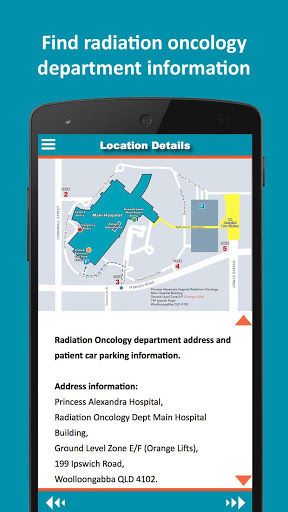  | 

## Development team
In the following we report the main information provided by the development team in the Google play store.

| | |
|-------------------------|-------------------------|
| **Developer**  | PA Research Foundation |
| **Website**  | [https://pafoundation.org.au/ropah-guides-app](https://pafoundation.org.au/ropah-guides-app) |
| **Email** | ROPAH_patient_info@health.qld.gov.au |
| **Physical address**  | [Building 1, Princess Alexandra Hospital, 199 Ipswich Rd, Woolloongabba QLD Australia 4102](https://www.google.com/maps/search/Building%201,%20Princess%20Alexandra%20Hospital,%20199%20Ipswich%20Rd,%20Woolloongabba%20QLD%20Australia%204102) (Google Maps) |
| **Other developed apps**  | [https://play.google.com/store/apps/developer?id=PA+Research+Foundation](https://play.google.com/store/apps/developer?id=PA+Research+Foundation) |

## Android support

| | |
|-------------------------|-------------------------|
| **Declared target Android version**  | Oreo, version 8.0.0 (API level 26) |
| **Effective target Android version**  | Oreo, version 8.0.0 (API level 26) |
| **Minimum supported Android version**  | KitKat, version 4.4 - 4.4.4 (API level 19) |
| **Maximum target Android version**  | - |

The larger the difference between the minimum and maximum supported Android versions, the better. A larger difference means a wider audience. For example, old phones have a very low Android version, so a high minimum supported Android version means that the app cannot be used by users with old phones, thus leading to accessibility problems. 

## Requested permissions

In the following we report the complete list of the permissions requested by the app. 

| **Permission** | **Protection level** | **Description** | 
|-------------------------|-------------------------|-------------------------|
 **android.permission ACCESS_NETWORK_STATE** | Normal | Allows applications to access information about networks. 
 **android.permission ACCESS_WIFI_STATE** | Normal | Allows applications to access information about Wi-Fi networks. 
 **android.permission CHANGE_NETWORK_STATE** | Normal | Allows applications to change network connectivity state. 
 **android.permission CHANGE_WIFI_STATE** | Normal | Allows applications to change Wi-Fi connectivity state. 
 **android.permission INTERNET** | Normal | Allows applications to open network sockets. 
 **android.permission MEDIA_CONTENT_CONTROL** | Not for use by third-party applications due to privacy of media consumption | Allows an application to know what content is playing and control its playback. 
 **android.permission READ_EXTERNAL_STORAGE** | :warning:**Dangerous** | Allows an application to read from external storage. 
 **android.permission RECEIVE_BOOT_COMPLETED** | Normal | Allows an application to receive the Intent.ACTION_BOOT_COMPLETED that is broadcast after the system finishes booting. 
 **android.permission WAKE_LOCK** | Normal | Allows using PowerManager WakeLocks to keep processor from sleeping or screen from dimming. 
 **android.permission WRITE_EXTERNAL_STORAGE** | :warning:**Dangerous** | Allows an application to write to external storage. 
 **au.org.pafoundation.ropah_guides.permission C2D_MESSAGE** | - | - 
 **com.android.vending CHECK_LICENSE** | - | - 
 **com.google.android.c2dm.permission RECEIVE** | - | - 

## Mentioned servers

| **Server** | **Registrant** | **Registrant country** | **Creation date** | 
|-------------------------|-------------------------|-------------------------|-------------------------|
 | googlesyndication.com | Google LLC | :us: US | 2003-01-21 06:17:24 |
 | googleapis.com | Google LLC | :us: US | 2005-01-25 17:52:26 |
 | google.com | Google LLC | :us: US | 1997-09-15 04:00:00 |
 | microsoft.com | Microsoft Corporation | :us: US | 1991-05-02 04:00:00 |

## Security analysis 

Below we report the main security warnings raised by our execution of the [Androwarn](https://github.com/maaaaz/androwarn) security analysis tool.

**Telephony identifiers leakage**
> - This application reads the ISO country code equivalent of the current registered operator's MCC (Mobile Country Code) 
> - This application reads the numeric name (MCC+MNC) of current registered operator 
> - This application reads the operator name 
> - This application reads the unique device ID, i.e the IMEI for GSM and the MEID or ESN for CDMA phones 

**Connection interfaces exfiltration**
> - This application reads details about the currently active data network 
> - This application tries to find out if the currently active data network is metered 

**Code execution**
> - This application loads a native library: 'monodroid' 
> - This application loads a native library: 'xamarin-app' 
> - This application executes a UNIX command 

## User ratings and reviews

Below we provide information about how end users are reacting to the app in terms of ratings and reviews in the Google Play store.

### Ratings

The ROPAH Guides app has been installed by more than **100** times. At this time, **-** rated the app and its average score is **0.0**. Below we show the distribution of the ratings across the usual star-based rating of Google Play

:star::star::star::star::star:: 0

:star::star::star::star:: 0

:star::star::star:: 0

:star::star:: 0

:star:: 0

### Reviews 

#### 5-star reviews

> Very informative. Works well.  :date: __2019-12-28 10:48:53__

#### 4-star reviews

No recent reviews available with 4 stars.

#### 3-star reviews

No recent reviews available with 3 stars.

#### 2-star reviews

No recent reviews available with 2 stars.

#### 1-star reviews

No recent reviews available with 1 stars.

# Pill Reminder & Medication Reminder: MedicineWise
App version ``3.2.8``

Analyzed with [covid-apps-observer](http://github.com/covid-apps-observer) project, version ``0.1``

## App overview
| | |
|-------------------------|-------------------------| 
| **Name**&nbsp;&nbsp;&nbsp;&nbsp;&nbsp;&nbsp;&nbsp;&nbsp;&nbsp;&nbsp;&nbsp;&nbsp;&nbsp;&nbsp;&nbsp;&nbsp;&nbsp;&nbsp;&nbsp;&nbsp;&nbsp;&nbsp;&nbsp;&nbsp;&nbsp;&nbsp;&nbsp;&nbsp;&nbsp;&nbsp;&nbsp;&nbsp;&nbsp;&nbsp;&nbsp;&nbsp;&nbsp;&nbsp;&nbsp;&nbsp;  | Pill Reminder & Medication Reminder: MedicineWise |
| **Unique identifier** | au.org.nps.medicinelistplus |
| **Link to Google Play** | [https://play.google.com/store/apps/details?id=au.org.nps.medicinelistplus](https://play.google.com/store/apps/details?id=au.org.nps.medicinelistplus) |
| **Summary**  | MedicineWise: ad-free pill reminder &amp; tracker. Store &amp; share health info. 💊🔔⏰ |
| **Privacy policy** | [http://www.nps.org.au/about-this-website/privacy](http://www.nps.org.au/about-this-website/privacy) |
| **Latest version** | 3.2.8 |
| **Last update** | 2020-10-24 03:37:59 |
| **Recent changes** | Bug fixes and improvements including auto-logout issues some users are experiencing. For assistance or suggestions contact us: medicinewiseapp@nps.org.au |
| **Installs**  | 50,000+ |
| **Category** | Medical |
| **First release** | Dec 11, 2013 |
| **Size**  | 8.7M |
| **Supported Android version**  | 5.0 and up |

### Description
> Scan or search for medication, create medicines list, schedule reminders, store &
 share health information, learn more about your medicines and gain access to a
 large library of carer’s content for a stress-free and streamlined process.
 NPS MedicineWise is a not-for-profit health organisation, dedicated to creating a
 more MedicineWise Australia.
 ----------------------------------------------
 💊 KEY FEATURES
 ----------------------------------------------
 ● Create individual profiles
 ● Generate medicine list through barcode scanner or from database
 ● Medical conditions & allergy tracker
 ● Store contact information in case of emergency
 ● Pill tracker & schedule reminders and doctor’s appointments
 ● Quick access to Consumer Medicines Information (CMI)
 ● Track and share test results
 ● Cross-device compatible
 Whether you have carer responsibilities, take different types of medication or you
 have a busy lifestyle and need a reminder to take your medicine, MedicineWise
 makes the process stress free, streamlined and simple.
 📋 MEDICATION LOG
 Use the medicine scanner to scan barcodes and instantly add your item to the list, or
 search through the Australian medicines database. From there you can add dosage
 guidelines and use the calendar to schedule reminders to take your medicine and to
 remind those you care for, attend doctor appointments and more.
 As a carer, have peace of mind knowing you can now easily manage multiple
 medicines lists for all those you care for.
 ⏰ MEDS REMINDERS
 It’s easy to forget about taking medication, especially if you’re a busy person or have
 a lot of medicines to keep track of. With MedicineWise, you can use the handy
 calendar to schedule reminders to take your medicine or remind those you care for,
 attend doctor’s appointments and ensure that you keep on top of yours and the
 health regime of those you care for.
 As a carer, the Medicinewise app will help you remember medicines routine for all
 those you care for
 💊 ACCESS MEDICINES RESOURCES
 As well as managing your medication, you’ll have instant access to a huge range of
 useful learning resources and Consumer Medicines Information (CMI). From videos
 and webpages to downloadable PDFs, you’ll be able to learn more about your
 medicine and stay informed about your health.
 A large library of health-related content is available for Carers to help you care for
 others and look after yourself.
 􀀀STORE & SHARE IMPORTANT HEALTH INFORMATION
 From blood pressure tests to your body weight over time, you can store, track and
 graph tests as well as store important medical information such as allergies,
 conditions and contact details of healthcare professionals. You can share this
 information in just a few seconds via email.
 For more information or assistance with using the app, please contact us at
 MedicineWiseapp@nps.org.au or (02) 8217 8700. We are available to help you
 Monday-Friday 9AM-5PM AEST.
 <b>MEDICINE & HEALTH MANAGEMENT MADE EASY – DOWNLOAD MEDICINEWISE TODAY!</b>

### User interface
The developers of the app provide the following screenshots in the Google play store.
| | | |
|:-------------------------:|:-------------------------:|:-------------------------:|
 |   |   |   | 
 |  

## Development team
In the following we report the main information provided by the development team in the Google play store.

| | |
|-------------------------|-------------------------|
| **Developer**  | NPS Medicinewise |
| **Website**  | [https://www.nps.org.au/medical-info/consumer-info/medicinewise-app/](https://www.nps.org.au/medical-info/consumer-info/medicinewise-app/) |
| **Email** | medicinewiseapp@nps.org.au |
| **Physical address**  | - |
| **Other developed apps**  | [https://play.google.com/store/apps/developer?id=NPS+Medicinewise](https://play.google.com/store/apps/developer?id=NPS+Medicinewise) |

## Android support

| | |
|-------------------------|-------------------------|
| **Declared target Android version**  | Pie, version 9 (API level 28) |
| **Effective target Android version**  | Pie, version 9 (API level 28) |
| **Minimum supported Android version**  | Lollipop, version 5.0 (API level 21) |
| **Maximum target Android version**  | - |

The larger the difference between the minimum and maximum supported Android versions, the better. A larger difference means a wider audience. For example, old phones have a very low Android version, so a high minimum supported Android version means that the app cannot be used by users with old phones, thus leading to accessibility problems. 

## Requested permissions

In the following we report the complete list of the permissions requested by the app. 

| **Permission** | **Protection level** | **Description** | 
|-------------------------|-------------------------|-------------------------|
 **android.permission ACCESS_NETWORK_STATE** | Normal | Allows applications to access information about networks. 
 **android.permission CAMERA** | :warning:**Dangerous** | Required to be able to access the camera device. 
 **android.permission FLASHLIGHT** | - | - 
 **android.permission GET_ACCOUNTS** | :warning:**Dangerous** | Allows access to the list of accounts in the Accounts Service. 
 **android.permission GET_TASKS** | Deprecated | This constant was deprecated in API level 21. No longer enforced. 
 **android.permission INTERNET** | Normal | Allows applications to open network sockets. 
 **android.permission READ_EXTERNAL_STORAGE** | :warning:**Dangerous** | Allows an application to read from external storage. 
 **android.permission RECEIVE_BOOT_COMPLETED** | Normal | Allows an application to receive the Intent.ACTION_BOOT_COMPLETED that is broadcast after the system finishes booting. 
 **android.permission VIBRATE** | Normal | Allows access to the vibrator. 
 **android.permission WAKE_LOCK** | Normal | Allows using PowerManager WakeLocks to keep processor from sleeping or screen from dimming. 
 **android.permission WRITE_EXTERNAL_STORAGE** | :warning:**Dangerous** | Allows an application to write to external storage. 
 **android.permission WRITE_SYNC_SETTINGS** | Normal | Allows applications to write the sync settings. 
 **au.com.outware.caveman.nps ACCESS_DATA** | - | - 
 **au.org.nps.medicinelistplus.permission C2D_MESSAGE** | - | - 
 **au.org.nps.medicinelistplus.permission UA_DATA** | - | - 
 **com.google.android.c2dm.permission RECEIVE** | - | - 
 **com.google.android.finsky.permission BIND_GET_INSTALL_REFERRER_SERVICE** | - | - 

## Mentioned servers

| **Server** | **Registrant** | **Registrant country** | **Creation date** | 
|-------------------------|-------------------------|-------------------------|-------------------------|
 | snomed.info | IHTSDO | GB | 2001-09-13 05:40:58 |
 | sgizmo.com | - | :us: US | 2005-05-24 17:23:04 |
 | crashlytics.com | Google LLC | :us: US | 2011-01-21 15:30:40 |
 | facebook.com | Facebook, Inc. | :us: US | 1997-03-29 05:00:00 |
 | googlesyndication.com | Google LLC | :us: US | 2003-01-21 06:17:24 |
 | google.com | Google LLC | :us: US | 1997-09-15 04:00:00 |
 | google-analytics.com | Google LLC | :us: US | 2005-07-18 19:24:32 |
 | app-measurement.com | Google LLC | :us: US | 2015-06-19 20:13:31 |
 | urbanairship.com | DNStination Inc. | :us: US | 2009-04-14 06:34:46 |
 | asnapieu.com | DNStination Inc. | :us: US | 2019-05-15 21:27:07 |
 | hockeyapp.net | Microsoft Corporation | :us: US | 2011-01-23 18:46:43 |
 | hl7.org | Health Level Seven | :us: US | 1996-03-11 05:00:00 |
 | googleadservices.com | Google LLC | :us: US | 2003-06-19 16:34:53 |

## Security analysis 

Below we report the main security warnings raised by our execution of the [Androwarn](https://github.com/maaaaz/androwarn) security analysis tool.

**Telephony identifiers leakage**
> - This application reads the ISO country code equivalent of the current registered operator's MCC (Mobile Country Code) 
> - This application reads the numeric name (MCC+MNC) of current registered operator 
> - This application reads the operator name 

**Location lookup**
> - This application reads location information from all available providers (WiFi, GPS etc.) 

**Connection interfaces exfiltration**
> - This application reads details about the currently active data network 

**Telephony services abuse**
> - This application makes phone calls 

**Suspicious connection establishment**
> - This application opens a Socket and connects it to the remote address '' on the 'N/A' port  
> - This application opens a Socket and connects it to the remote address 'Ljava/lang/StringBuilder;->toString()Ljava/lang/String;' on the 'N/A' port  
> - This application opens a Socket and connects it to the remote address 'Ljava/net/Proxy;->type()Ljava/net/Proxy$Type;' on the 'N/A' port  
> - This application opens a Socket and connects it to the remote address 'timeout' on the 'N/A' port  

**Pim data leakage**
> - This application accesses the calendar 
> - This application accesses data stored in the clipboard 

## User ratings and reviews

Below we provide information about how end users are reacting to the app in terms of ratings and reviews in the Google Play store.

### Ratings

The Pill Reminder & Medication Reminder: MedicineWise app has been installed by more than **50000** times. At this time, **400** rated the app and its average score is **3.57**. Below we show the distribution of the ratings across the usual star-based rating of Google Play

:star::star::star::star::star:: 184

:star::star::star::star:: 48

:star::star::star:: 56

:star::star:: 36

:star:: 76

### Reviews 

#### 5-star reviews

> Excellent  :date: __2020-10-05 08:56:12__

> Very helpful  :date: __2020-06-06 11:18:49__

> Great app to store info  :date: __2020-04-16 10:53:40__

> Love it. I forget all the time to take my meds  :date: __2020-04-15 13:37:17__

> I'm 73 and find this app great for meds reminders  :date: __2020-02-14 09:57:04__

> Neat app to organise your medications. You can also enter you blood pressure, sugar readings and generate a useful report for that. Well done NPS, I will certainly recommend it for my patients.  :date: __2019-12-26 09:15:47__

> It's great - As a Hospital Pharmacist I will happily recommend it to patients 😃  :date: __2019-12-03 22:36:47__

> Had some problems with the update but these have resolved. It's actually now better than before. I can now email my medicines list without the header of the second page over writing the list at that point. Anyway, this is definitely the best app to keep all of your medicines together for when you need it.  :date: __2019-07-05 00:10:02__

> very good app  :date: __2019-06-25 09:18:36__

> I use this app to keep track of and give accurate information on my many medications. Also great for when I attend hospital & specialists when they need to know all my meds & dosage. Great functional app.  :date: __2019-06-25 01:45:56__

#### 4-star reviews

> Hi Guys, thanks for your great product. Is there any chance of a no sign in option? Sign in bug again after every update.  :date: __2020-10-13 00:01:12__

> Only a limited number of medicines found by scanning, but all were found by name search. No ability that i could see to print out the list which would be useful to carry in a wallet or purse. Entering date of birth seemed very tedious but the developer responded and explained the best way to get back to the year of birth which made it easy. Good response from the developer. Added a star!  :date: __2020-06-06 02:36:22__

> Can't print or save details to give to my doctors.  :date: __2020-04-21 09:33:59__

> Good once ypu get used to it have been using for about 5 years  :date: __2019-09-10 04:21:34__

> Cannot add daily quantities of medication. Keeps blocking any quantities entered.Even the default is added as above. It defaults back to zero.Tapping the entry does nothing.  :date: __2019-07-15 14:38:38__

> a very handy appI'll  :date: __2019-06-26 10:32:47__

> Good app, have resolved daylight saving issue, but could you please add Noonan Syndrome to the list of health conditions?  :date: __2019-04-13 11:15:01__

> Makes listing medications so much easier at a new doctor or hospital addmissions  :date: __2018-12-06 05:55:33__

> Good app but every time I try to add one of my medications it crashes. Just this one medication. The others added fine.  :date: __2018-04-08 00:03:04__

> I had previously deleted this app because of login problems and ongoing issues with locking up. I have now reinstalled the app (Feb 2018) and created a new account. Seems to be working OK. Still don't know what version I'm  running!  :date: __2018-02-16 12:48:51__

#### 3-star reviews

> Was working perfectly until a couple of months ago. Now logs me out and will not recognise my login. Have to uninstall, reinstall. Happens every 2-3 days.  :date: __2020-10-21 00:15:29__

> A borderline app in my opinion. Just enough features to make it useful, almost enough faults to make me uninstall. The app tries to do it all and with this objective limits user control . I don't want reminders but it's more complex than it needs to be to change them. Can't easily add or delete menu items. I use more than one device but apparently the app won't allow two devices to log in simultaneously but there's no warning of this. App is ok, but could be much better  :date: __2020-08-01 08:46:40__

> Continuously displays the 'spinning circle' when trying to e-mail medicine list or syncing with good wifi network/4G connection. Never times out and rarely e-mails or syncs. Have persisted for some years but doesn't really improve in these network issues. 12JUL2020: Reverting to v3.2.3 (2 updates back) allows the network connections/e-mail to work.  :date: __2020-07-12 13:48:37__

> It would be a helpful app however I wish the reminders could actually be set to make a sound/alarm. I cannot seem to find such option. I am not always looking at my phone or have it nearby to SEE a reminder.  :date: __2020-05-13 12:20:01__

> This app seemed great at the start offering helpful things like blood pressure reports etc. its now very frustrating. When trying to generate a report it goes into thinking mode and nothing happens. IT then asked me to log back in and when I did all medication data had gone. This app promises the world but doesn't deliver ☹️  :date: __2019-07-16 08:06:14__

> Interesting changes, frustrated that you now have to enter password every time you log in.  :date: __2019-06-25 10:24:47__

> very helpful when going to hospital or new doctor.  :date: __2019-06-25 08:11:37__

> Generally useful but it would be handy to be able to put in recurring appointments and also record health events such as scans and blood tests. My wife has just started chemo for pancreatic cancer and there are a lot of appointments and tests to remember. I guess it is primarily there for medicines - which it does well, but being able to put start and finish dates on the schedules that set the reminders accordingly would help a lot.  :date: __2019-01-02 02:36:43__

> I am not always getting the reminders to take medication. And I am looking for a way to know what time I took a PRN medication and when it is next due, I do not take PRN meds at the same time every day, for it depends on when I need them.  :date: __2018-12-29 23:56:19__

> I got this app so that I would get reminders for my meds, but the reminder apparently does not work for the Samsung Galaxy S7! Is this able to be fixed, if not I will need to look for an app that will give reminders. Cheers  :date: __2018-11-19 00:53:07__

#### 2-star reviews

> No medicines found by scanning but ok inputting manually. Only shows 4 of my medicines instead of 8. How do I view the rest.  :date: __2020-06-25 15:55:41__

> Does not even barcodes from any of my medicines requires a postcode for Australia when I am itinerant and officially don't have one! Two glaring problems that make me think little research was done!  :date: __2020-04-16 01:57:41__

> I can't access data. Had password reset still can't get in  :date: __2019-11-27 00:08:26__

> A bit basic really  :date: __2019-08-15 03:37:23__

> Good concept, but buggy execution.  :date: __2019-05-05 00:48:18__

> the app has great features and can add plenty of information, but no matter what I try I can't get it to give me a notification or reminder for when to take my tablets. I tried turning the reminders off and on, and I checked all the permissions but still can't figure it out.  :date: __2019-04-30 23:04:52__

> while this app is good, theres nowhere for me to view a history of the meds taken or when. rather i need to generate and email a report which is a bit pointless if i just want to see it onscreen.. also the medicine start and end dates dont bring up a calendar, rather is a text baded field?????  :date: __2019-01-04 12:38:27__

> Was great to start with but if you add more than one or two people it becomes slow and lags. Also time out length is to short.  :date: __2018-10-05 06:10:43__

> The app won't email my medication list.  :date: __2018-07-28 06:48:03__

> Good digital record of medications.. great for visit to new 
doctor/hospital. Would love a proper diary function for past history. Would 
love to be able to sort by date and subject. I use Notes for this purpose 
but unwieldy doesn't work too well  :date: __2018-05-13 10:40:38__

#### 1-star reviews

> Frequently signs you out (appears to be after each update). So notifications stop, then I personally forget to take any meds for a couple of days because I don't realise. Going to find another strategy.  :date: __2020-10-11 02:49:33__

> I missed my dose 3 times, keeps logging out automatically when med is once a week. Useless.  :date: __2020-09-30 01:44:15__

> useless application, a good idea, that has been terribly executed. IMHO a waste of tax payers money. All my medications couldn't be added because it didnt recognise the barcodes. Adding family members doesnt mean they get access to the same info. adding statistics and test results doesnt allow you to see trends oe ar historical information.  :date: __2020-08-13 13:09:00__

> Pretty lousy the app could not find at least one medication out of 13 that I scanned. Was unable to fill out field for reasons for taking medication. Too much friggin around with this. No thanks, I can put all info on my profile on the phone easy enough. Uninstall this one I think.  :date: __2020-07-18 23:57:48__

> OMG this app is sooooooo stupid i tried setting the up and gave up and uninstalled the app. usless as  :date: __2020-04-17 09:35:41__

> Useless. All it does is crash repeatedly  :date: __2019-10-18 05:52:36__

> I have issues logging on every time I use it. Takes forever to log in when it does. Most of the time I just give up waiting. Seemed ok first day of use but now I can never log in.  :date: __2019-08-26 03:45:07__

> App requested to sign up. Great. Asked to set PIN for security. Open the app, enter correct PIN then it asks to sign in again. Over the top security requirements.  :date: __2019-07-30 01:09:38__

> na no good  :date: __2019-06-29 00:57:34__

> i was getting notifications and all but now i dont get any so now i have forgotten to take some medication, not happy with the app anymore very disappointed, now ive updated it and still don't get any notifications whats going on this is stupid  :date: __2019-06-26 00:14:49__

# Queanbeyan GP Super Clinic
App version ``2.0``

Analyzed with [covid-apps-observer](http://github.com/covid-apps-observer) project, version ``0.1``

## App overview
| | |
|-------------------------|-------------------------| 
| **Name**&nbsp;&nbsp;&nbsp;&nbsp;&nbsp;&nbsp;&nbsp;&nbsp;&nbsp;&nbsp;&nbsp;&nbsp;&nbsp;&nbsp;&nbsp;&nbsp;&nbsp;&nbsp;&nbsp;&nbsp;&nbsp;&nbsp;&nbsp;&nbsp;&nbsp;&nbsp;&nbsp;&nbsp;&nbsp;&nbsp;&nbsp;&nbsp;&nbsp;&nbsp;&nbsp;&nbsp;&nbsp;&nbsp;&nbsp;&nbsp;  | Queanbeyan GP Super Clinic |
| **Unique identifier** | base.com.healthsite.queanbeyan |
| **Link to Google Play** | [https://play.google.com/store/apps/details?id=base.com.healthsite.queanbeyan](https://play.google.com/store/apps/details?id=base.com.healthsite.queanbeyan) |
| **Summary**  | The Queanbeyan GP Super Clinic App |
| **Privacy policy** | [https://www.healthsite.com.au/privacy-policy](https://www.healthsite.com.au/privacy-policy) |
| **Latest version** | 2.0 |
| **Last update** | 2020-04-15 08:35:49 |
| **Recent changes** | Bug fixes |
| **Installs**  | 500+ |
| **Category** | Medical |
| **First release** | Feb 6, 2020 |
| **Size**  | 4.0M |
| **Supported Android version**  | 6.0 and up |

### Description
> The Queanbeyan GP Super Clinic App
 Allows you to Book an Appointment, Contact the Medical Centre easily, get directions to the Clinic, view Practice Info, After Hours Care details and Practice

### User interface
The developers of the app provide the following screenshots in the Google play store.
| | | |
|:-------------------------:|:-------------------------:|:-------------------------:|
 |   |   |   | 

## Development team
In the following we report the main information provided by the development team in the Google play store.

| | |
|-------------------------|-------------------------|
| **Developer**  | Healthsite Apps |
| **Website**  | - |
| **Email** | info@healthsite.com.au |
| **Physical address**  | - |
| **Other developed apps**  | [https://play.google.com/store/apps/developer?id=Healthsite+Apps](https://play.google.com/store/apps/developer?id=Healthsite+Apps) |

## Android support

| | |
|-------------------------|-------------------------|
| **Declared target Android version**  | Pie, version 9 (API level 28) |
| **Effective target Android version**  | Pie, version 9 (API level 28) |
| **Minimum supported Android version**  | Marshmallow, version 6.0 (API level 23) |
| **Maximum target Android version**  | - |

The larger the difference between the minimum and maximum supported Android versions, the better. A larger difference means a wider audience. For example, old phones have a very low Android version, so a high minimum supported Android version means that the app cannot be used by users with old phones, thus leading to accessibility problems. 

## Requested permissions

In the following we report the complete list of the permissions requested by the app. 

| **Permission** | **Protection level** | **Description** | 
|-------------------------|-------------------------|-------------------------|
 **android.permission ACCESS_ASSISTED_GPS** | - | - 
 **android.permission ACCESS_COARSE_LOCATION** | :warning:**Dangerous** | Allows an app to access approximate location. 
 **android.permission ACCESS_FINE_LOCATION** | :warning:**Dangerous** | Allows an app to access precise location. 
 **android.permission ACCESS_GPS** | - | - 
 **android.permission ACCESS_NETWORK_STATE** | Normal | Allows applications to access information about networks. 
 **android.permission CALL_PHONE** | :warning:**Dangerous** | Allows an application to initiate a phone call without going through the Dialer user interface for the user to confirm the call. 
 **android.permission INTERNET** | Normal | Allows applications to open network sockets. 
 **android.permission WRITE_EXTERNAL_STORAGE** | :warning:**Dangerous** | Allows an application to write to external storage. 

## Mentioned servers

| **Server** | **Registrant** | **Registrant country** | **Creation date** | 
|-------------------------|-------------------------|-------------------------|-------------------------|
 | googlesyndication.com | Google LLC | :us: US | 2003-01-21 06:17:24 |
 | google.com | Google LLC | :us: US | 1997-09-15 04:00:00 |
 | healthsite.io | Health Media Group Pty Ltd | :australia: AU | 2015-05-04 02:58:22 |
 | googleapis.com | Google LLC | :us: US | 2005-01-25 17:52:26 |

## Security analysis 

Below we report the main security warnings raised by our execution of the [Androwarn](https://github.com/maaaaz/androwarn) security analysis tool.

**Connection interfaces exfiltration**
> - This application reads details about the currently active data network 
> - This application tries to find out if the currently active data network is metered 

**Telephony services abuse**
> - This application makes phone calls 

**Suspicious connection establishment**
> - This application opens a Socket and connects it to the remote address '1' on the 'N/A' port  
> - This application opens a Socket and connects it to the remote address 'Ljava/lang/StringBuilder;->toString()Ljava/lang/String;' on the 'N/A' port  
> - This application opens a Socket and connects it to the remote address 'Ljava/net/Proxy;->type()Ljava/net/Proxy$Type;' on the 'N/A' port  
> - This application opens a Socket and connects it to the remote address 'timeout' on the 'N/A' port  

## User ratings and reviews

Below we provide information about how end users are reacting to the app in terms of ratings and reviews in the Google Play store.

### Ratings

The Queanbeyan GP Super Clinic app has been installed by more than **500** times. At this time, **-** rated the app and its average score is **0.0**. Below we show the distribution of the ratings across the usual star-based rating of Google Play

:star::star::star::star::star:: 0

:star::star::star::star:: 0

:star::star::star:: 0

:star::star:: 0

:star:: 0

### Reviews 

#### 5-star reviews

No recent reviews available with 5 stars.

#### 4-star reviews

No recent reviews available with 4 stars.

#### 3-star reviews

No recent reviews available with 3 stars.

#### 2-star reviews

No recent reviews available with 2 stars.

#### 1-star reviews

No recent reviews available with 1 stars.

# GiveBlood
App version ``2.16.4``

Analyzed with [covid-apps-observer](http://github.com/covid-apps-observer) project, version ``0.1``

## App overview
| | |
|-------------------------|-------------------------| 
| **Name**&nbsp;&nbsp;&nbsp;&nbsp;&nbsp;&nbsp;&nbsp;&nbsp;&nbsp;&nbsp;&nbsp;&nbsp;&nbsp;&nbsp;&nbsp;&nbsp;&nbsp;&nbsp;&nbsp;&nbsp;&nbsp;&nbsp;&nbsp;&nbsp;&nbsp;&nbsp;&nbsp;&nbsp;&nbsp;&nbsp;&nbsp;&nbsp;&nbsp;&nbsp;&nbsp;&nbsp;&nbsp;&nbsp;&nbsp;&nbsp;  | GiveBlood |
| **Unique identifier** | ca.blood.giveblood |
| **Link to Google Play** | [https://play.google.com/store/apps/details?id=ca.blood.giveblood](https://play.google.com/store/apps/details?id=ca.blood.giveblood) |
| **Summary**  | Canadian Blood Services App for booking life-giving blood donation appointments. |
| **Privacy policy** | [https://myaccount.blood.ca/en/terms-use#privacy-policy](https://myaccount.blood.ca/en/terms-use#privacy-policy) |
| **Latest version** | 2.16.4 |
| **Last update** | 2020-10-21 14:28:33 |
| **Recent changes** | - Bug fixes |
| **Installs**  | 100,000+ |
| **Category** | Medical |
| **First release** | May 2, 2014 |
| **Size**  | 39M |
| **Supported Android version**  | 4.4 and up |

### Description
> GiveBlood is the official app of Canadian Blood Services. This app makes it easy for donors in Canada (excluding Quebec) to book, manage and keep track of their donations on the go. Users can locate their nearest donor centres and confirm their donation appointment with ease and efficiency.
 Features:
 • Search for donation centres near you
 • Use your current location to map local centres, and view their services and amenities
 • Bookmark your favourite locations
 • View available time slots
 • Book, view or cancel a donation appointment
 • Add appointments and reminders to your calendar
 • Easily sign-up or sign-in to access your account information
 • View and manage your personal profile 
 • View and manage your notification settings
 • Store and retrieve your donor card 
 • View your donation history
 • Share your donation history on social
 • Receive news and updates
 • Send feedback
 GiveBlood is available in English and French. The displayed version corresponds to the language that you have selected in your device settings.

### User interface
The developers of the app provide the following screenshots in the Google play store.
| | | |
|:-------------------------:|:-------------------------:|:-------------------------:|
 |   |   |   | 
 |   |   |   | 
 |   |  

## Development team
In the following we report the main information provided by the development team in the Google play store.

| | |
|-------------------------|-------------------------|
| **Developer**  | Canadian Blood Services |
| **Website**  | [https://www.blood.ca](https://www.blood.ca) |
| **Email** | feedback@blood.ca |
| **Physical address**  | - |
| **Other developed apps**  | [https://play.google.com/store/apps/developer?id=Canadian+Blood+Services](https://play.google.com/store/apps/developer?id=Canadian+Blood+Services) |

## Android support

| | |
|-------------------------|-------------------------|
| **Declared target Android version**  | Android10, version 10 (API level 29) |
| **Effective target Android version**  | Android10, version 10 (API level 29) |
| **Minimum supported Android version**  | KitKat, version 4.4 - 4.4.4 (API level 19) |
| **Maximum target Android version**  | - |

The larger the difference between the minimum and maximum supported Android versions, the better. A larger difference means a wider audience. For example, old phones have a very low Android version, so a high minimum supported Android version means that the app cannot be used by users with old phones, thus leading to accessibility problems. 

## Requested permissions

In the following we report the complete list of the permissions requested by the app. 

| **Permission** | **Protection level** | **Description** | 
|-------------------------|-------------------------|-------------------------|
 **android.permission ACCESS_COARSE_LOCATION** | :warning:**Dangerous** | Allows an app to access approximate location. 
 **android.permission ACCESS_FINE_LOCATION** | :warning:**Dangerous** | Allows an app to access precise location. 
 **android.permission ACCESS_NETWORK_STATE** | Normal | Allows applications to access information about networks. 
 **android.permission ACCESS_WIFI_STATE** | Normal | Allows applications to access information about Wi-Fi networks. 
 **android.permission CAMERA** | :warning:**Dangerous** | Required to be able to access the camera device. 
 **android.permission GET_ACCOUNTS** | :warning:**Dangerous** | Allows access to the list of accounts in the Accounts Service. 
 **android.permission INTERNET** | Normal | Allows applications to open network sockets. 
 **android.permission READ_CALENDAR** | :warning:**Dangerous** | Allows an application to read the user's calendar data. 
 **android.permission READ_EXTERNAL_STORAGE** | :warning:**Dangerous** | Allows an application to read from external storage. 
 **android.permission RECEIVE_BOOT_COMPLETED** | Normal | Allows an application to receive the Intent.ACTION_BOOT_COMPLETED that is broadcast after the system finishes booting. 
 **android.permission VIBRATE** | Normal | Allows access to the vibrator. 
 **android.permission WAKE_LOCK** | Normal | Allows using PowerManager WakeLocks to keep processor from sleeping or screen from dimming. 
 **android.permission WRITE_CALENDAR** | :warning:**Dangerous** | Allows an application to write the user's calendar data. 
 **android.permission WRITE_EXTERNAL_STORAGE** | :warning:**Dangerous** | Allows an application to write to external storage. 
 **com.google.android.c2dm.permission RECEIVE** | - | - 
 **com.google.android.finsky.permission BIND_GET_INSTALL_REFERRER_SERVICE** | - | - 
 **com.google.android.providers.gsf.permission READ_GSERVICES** | - | - 

## Mentioned servers

| **Server** | **Registrant** | **Registrant country** | **Creation date** | 
|-------------------------|-------------------------|-------------------------|-------------------------|
 | googleapis.com | Google LLC | :us: US | 2005-01-25 17:52:26 |
 | connectedinteractive.com | Connected Interactive | :canada: CA | 2010-05-15 18:46:01 |
 | facebook.com | Facebook, Inc. | :us: US | 1997-03-29 05:00:00 |
 | google.com | Google LLC | :us: US | 1997-09-15 04:00:00 |
 | googlesyndication.com | Google LLC | :us: US | 2003-01-21 06:17:24 |
 | doubleclick.net | Google Inc. | :us: US | 1996-01-16 05:00:00 |
 | gstatic.com | Google LLC | :us: US | 2008-02-11 15:31:25 |
 | googleapis.com | Google LLC | :us: US | 2005-01-25 17:52:26 |
 | app-measurement.com | Google LLC | :us: US | 2015-06-19 20:13:31 |
 | googleapis.com | Google LLC | :us: US | 2005-01-25 17:52:26 |
 | w3.org | W3C | :us: US | 1994-07-06 04:00:00 |
 | apache.org | The Apache Software Foundation | :us: US | 1995-04-11 04:00:00 |
 | crashlytics.com | Google LLC | :us: US | 2011-01-21 15:30:40 |
 | googleapis.com | Google LLC | :us: US | 2005-01-25 17:52:26 |
 | googleadservices.com | Google LLC | :us: US | 2003-06-19 16:34:53 |
 | xml.org | OASIS Open | :us: US | 1997-02-03 05:00:00 |

## Security analysis 

Below we report the main security warnings raised by our execution of the [Androwarn](https://github.com/maaaaz/androwarn) security analysis tool.

**Telephony identifiers leakage**
> - This application reads the device phone type value 
> - This application reads the numeric name (MCC+MNC) of current registered operator 
> - This application reads the operator name 
> - This application reads the radio technology (network type) currently in use on the device for data transmission 

**Connection interfaces exfiltration**
> - This application reads details about the currently active data network 
> - This application tries to find out if the currently active data network is metered 

**Telephony services abuse**
> - This application makes phone calls 

**Suspicious connection establishment**
> - This application opens a Socket and connects it to the remote address '' on the 'N/A' port  
> - This application opens a Socket and connects it to the remote address 'Ljava/lang/StringBuilder;->toString()Ljava/lang/String;' on the 'N/A' port  
> - This application opens a Socket and connects it to the remote address 'Ljava/net/Proxy;->type()Ljava/net/Proxy$Type;' on the 'N/A' port  
> - This application opens a Socket and connects it to the remote address 'timeout' on the 'N/A' port  

**Code execution**
> - This application loads a native library 
> - This application loads a native library: 'c++_shared' 
> - This application loads a native library: 'jniPdfium' 
> - This application loads a native library: 'modft2' 
> - This application loads a native library: 'modpdfium' 
> - This application loads a native library: 'modpng' 
> - This application loads a native library: 'pl_droidsonroids_gif' 

## User ratings and reviews

Below we provide information about how end users are reacting to the app in terms of ratings and reviews in the Google Play store.

### Ratings

The GiveBlood app has been installed by more than **100000** times. At this time, **4428** rated the app and its average score is **4.8986783**. Below we show the distribution of the ratings across the usual star-based rating of Google Play

:star::star::star::star::star:: 4156

:star::star::star::star:: 185

:star::star::star:: 39

:star::star:: 9

:star:: 39

### Reviews 

#### 5-star reviews

> The staff are absolutely wonderful! The whole experience was not stressful at all. All staff and volunteers are amazing.  :date: __2020-10-26 03:51:17__

> Works great and easy to use.  :date: __2020-10-26 00:20:22__

> I love to donate my blood  :date: __2020-10-24 16:44:36__

> Great interface. Easy to use.  :date: __2020-10-22 19:32:38__

> Always great staff!  :date: __2020-10-21 21:12:44__

> Appreciate the reminder notices for upcoming appointments Staff welcoming and professional.  :date: __2020-10-20 16:41:25__

> Such a simple and useful application. No problems that I can find!  :date: __2020-10-20 03:35:02__

> Great app. Works well!  :date: __2020-10-20 00:40:56__

> App works well, reminds you of when you can book an appointment, the scheduling function is easy.  :date: __2020-10-19 18:17:38__

> Makes it easy to schedule and reschedule appointments. I really like the stat tracking, and the appointment reminders. One reccommendation: please don't have the clinic search default to whole blood. I thought the app wouldn't allow me to book plasma appointments.  :date: __2020-10-19 01:59:35__

#### 4-star reviews

> Works well.  :date: __2020-10-16 06:04:03__

> It looks nice, and better than phone booking. It's also nice that you can fill out the survey, get a Q-Pass easily, have a digital donor card, and track your stats. But it's buggy sometimes, and I don't usually trust the "available days" calendar since days "without availability" still have bookable slots when you click them.  :date: __2020-09-29 02:04:44__

> Very knowledgeable staff  :date: __2020-09-27 15:46:07__

> Easy and convenient  :date: __2020-09-17 17:17:52__

> Great interface for saving lives.  :date: __2020-08-02 20:49:21__

> The app is handy for having all your info in one place, definitely helpful for the electronic questionnaire and q-pass  :date: __2020-07-15 16:15:01__

> Good  :date: __2020-06-30 21:25:16__

> good  :date: __2020-06-23 16:17:58__

> Took a bit to get started, help desk was amazing. Up and running now, booking appointments into 2021.  :date: __2020-05-22 09:16:40__

> It would be amazing if the app could tell you when your blood donation was used by someone. Positive feedback loop.  :date: __2020-05-12 00:31:30__

#### 3-star reviews

> It would be nice if you received a notice when your blood is used. Having that feedback to know you helped change a life.  :date: __2020-10-11 01:35:08__

> The dates just show up as Aug...so you have to click on it to find the date and if the date isn't going to work you have to start all over again, not very user friendly.  :date: __2020-07-22 00:44:38__

> Good  :date: __2020-05-25 13:04:37__

> Remarkable. Lovely!  :date: __2020-04-27 03:37:33__

> Its ok and i like not having to carry my card around. Search funtionality is kinda frustrating.  :date: __2020-02-17 02:43:46__

> Difficult to find clinics in rural areas  :date: __2019-11-08 01:22:05__

> Clunky at best  :date: __2019-11-04 20:29:31__

> I wish I was able to see upcoming appointments even when I have an appointment scheduled as I want to see if any other better options are available before cancelling my appointment  :date: __2019-07-31 01:49:56__

> Don't like the repeated requests for access to contacts & location. I'm not a milennial. I value my privacy. Wish the app would remember my privacy preferences. Other than that, it works well.  :date: __2019-07-20 22:54:21__

> I had book an appointment on 1st July and the location was not open on that day and its not update and I went there for nothing. It should at least update the schedule if the event is cancel or pospone.  :date: __2019-07-02 21:41:11__

#### 2-star reviews

> Since the COVID-19 started, the app has become useless. Book at your favorite location and they cancel the event about 6 weeks before. You'd think if they have issues with a site, they'd just stop using it completely. Instead they try to transfer the set appointments 15 kms away. If they cancel an event, they should just notify you the appointment is cancelled. If we wanted an appointment at the 2nd location, we would have booked it there. The app needs to do what it is supposed to do.  :date: __2020-07-31 04:41:28__

> Won't let me install my donor card number  :date: __2020-05-27 03:17:25__

> It was not obvious how to book a time after selecting a day.  :date: __2020-04-24 22:46:14__

> The new version sucks. I cant make new appointments . It doesn't tell me when I'm eligible to make new appointments and wont tell me where blood drives are being held because my last appointment is still listed ( I cant get rid of it) and it says it wont show new places while I have an upcoming (3 weeks ago) appointment. And by the looks of it the developers could care less that there are these errors because they've not answered anyones comments.  :date: __2019-12-10 22:25:15__

> Broken. It wont send me verification email but I still get all the marketing emails. Techs support and staff at the donation centers unable to fix the issues and associate my card with the app even after multiple calls and locations and attempts. So it's useless.  :date: __2019-11-22 21:30:48__

> Useless  :date: __2019-10-16 18:18:10__

> Problems changing appointment times within the same day  :date: __2019-09-27 15:09:36__

> I find the information great. However trying to book an appointment is nearly impossible. It took several attempts  :date: __2019-09-25 23:45:26__

> Kinda annoyed really... tried to reschedule on the app and as it turns out it was unable to do so while I was at work. When I went to do it at home it said I had an appointment in 12 days. Then it refreshed and said I didnt have one booked yet. Then I had to make a totally new appointment. And on appointment day it is really difficult to get the questionnaire to work properly. Not a very smooth system in my experience.  :date: __2019-09-10 05:56:10__

> Slow, difficult to use, still says my appointment from 2 weeks ago is booked so it won't let me schedule my next. Screen has to be turned very bright to scan  :date: __2019-09-03 15:37:28__

#### 1-star reviews

> It won't let me book my next appointment after going to my first one. I'll have to call now.  :date: __2020-10-15 01:50:02__

> Unacceptable password reset system. Frustrating. Poor instructions.  :date: __2020-09-21 11:19:14__

> Demanded my donor number "if " I had received it already. I hadn't but it would not let me continue. The registration seemed to suggest I didn't need my number yet, hence the "If". I'm trying to do my part and I can't believe this app won't let me register.  :date: __2020-07-17 05:44:17__

> Garbage app, we need blood donations an myself, wife and kid cannot register because we all apparently have accounts... What a joke. Still a garbage app. I've registered and now I am not able to get into my account. I've set up a new password, then inputted said password and it says it's still wrong. Absolute trash of an application, all I want to do is donate blood.  :date: __2020-05-23 22:09:00__

> There was no q-pass on the app after completing the questionnaire on my laptop so I had to redo it on my tiny cell screen 😑😠  :date: __2020-04-29 16:39:39__

> Booking Plasma appointments do not work.  :date: __2020-03-24 01:58:27__

> Appointment times don't load  :date: __2020-03-17 21:12:34__

> This app never works. Every time I log in, it gives me problems. Either it can't find any donor centres near me (there are many close by) or it doesn't let me log in and tells me an error has occurred. I hate it.  :date: __2020-03-15 21:01:27__

> Bad  :date: __2020-01-24 18:40:54__

> Unfortunately, the app doesn't work. Keeps loading forever.  :date: __2019-12-18 15:43:36__

# PainPoint –Prevent Work Injury
App version ``1.0.5``

Analyzed with [covid-apps-observer](http://github.com/covid-apps-observer) project, version ``0.1``

## App overview
| | |
|-------------------------|-------------------------| 
| **Name**&nbsp;&nbsp;&nbsp;&nbsp;&nbsp;&nbsp;&nbsp;&nbsp;&nbsp;&nbsp;&nbsp;&nbsp;&nbsp;&nbsp;&nbsp;&nbsp;&nbsp;&nbsp;&nbsp;&nbsp;&nbsp;&nbsp;&nbsp;&nbsp;&nbsp;&nbsp;&nbsp;&nbsp;&nbsp;&nbsp;&nbsp;&nbsp;&nbsp;&nbsp;&nbsp;&nbsp;&nbsp;&nbsp;&nbsp;&nbsp;  | PainPoint –Prevent Work Injury |
| **Unique identifier** | ca.on.ohcow.msda |
| **Link to Google Play** | [https://play.google.com/store/apps/details?id=ca.on.ohcow.msda](https://play.google.com/store/apps/details?id=ca.on.ohcow.msda) |
| **Summary**  | Go through a basic workplace ergonomic assessment using diagrams and questions. |
| **Privacy policy** | [http://www.ohcow.on.ca](http://www.ohcow.on.ca) |
| **Latest version** | 1.0.5 |
| **Last update** | 2015-10-06 16:11:40 |
| **Recent changes** | change swipe behaviour. fix a bug. |
| **Installs**  | 1,000+ |
| **Category** | Health & Fitness |
| **First release** | Sep 16, 2015 |
| **Size**  | 2.7M |
| **Supported Android version**  | 4.0 and up |

### Description
> Download this useful app that delivers a very basic ergonomic assessment by running through a series of diagrams and questions to pinpoint musculoskeletal pain, identify possible sources, and discover practical solutions - right from your smartphone! The results are depicted on a body map, with recommendations to address work-related MSD hazards that could be contributing to your discomfort.  No personal data is collected, but summary results can be shared with others (at your discretion) in order to report hazards or foster solutions.
 While a professional ergonomic assessment is considered the most effective way to address work-related discomfort, this app is a good first step to help you recognize the signs of MSD and take action for prevention. For more information, visit www.ohcow.on.ca/resources or to make an inquiry or discuss a worksite visit, contact us at painpoint@ohcow.ca
  
 This app is the result of a valuable and productive professional collaboration: combining the clinical expertise and ergonomic content of the Occupational Health Clinic for Ontario Workers (OHCOW) with the technological knowledge and communication skills of the Canadian Centre for Occupational Health and Safety’s (CCOHS), www.ccohs.ca

### User interface
The developers of the app provide the following screenshots in the Google play store.
| | | |
|:-------------------------:|:-------------------------:|:-------------------------:|
 |   |   |   | 
 |   |  

## Development team
In the following we report the main information provided by the development team in the Google play store.

| | |
|-------------------------|-------------------------|
| **Developer**  | OHCOW |
| **Website**  | [http://www.ohcow.on.ca](http://www.ohcow.on.ca) |
| **Email** | ohcowapps@gmail.com |
| **Physical address**  | - |
| **Other developed apps**  | [https://play.google.com/store/apps/developer?id=OHCOW](https://play.google.com/store/apps/developer?id=OHCOW) |

## Android support

| | |
|-------------------------|-------------------------|
| **Declared target Android version**  | Lollipop, version 5.1 (API level 22) |
| **Effective target Android version**  | Lollipop, version 5.1 (API level 22) |
| **Minimum supported Android version**  | Ice Cream Sandwich, version 4.0.1 - 4.0.2 (API level 14) |
| **Maximum target Android version**  | - |

The larger the difference between the minimum and maximum supported Android versions, the better. A larger difference means a wider audience. For example, old phones have a very low Android version, so a high minimum supported Android version means that the app cannot be used by users with old phones, thus leading to accessibility problems. 

## Requested permissions

In the following we report the complete list of the permissions requested by the app. 

| **Permission** | **Protection level** | **Description** | 
|-------------------------|-------------------------|-------------------------|
 **android.permission ACCESS_NETWORK_STATE** | Normal | Allows applications to access information about networks. 
 **android.permission ACCESS_WIFI_STATE** | Normal | Allows applications to access information about Wi-Fi networks. 
 **android.permission INTERNET** | Normal | Allows applications to open network sockets. 
 **android.permission WRITE_EXTERNAL_STORAGE** | :warning:**Dangerous** | Allows an application to write to external storage. 

## Mentioned servers

| **Server** | **Registrant** | **Registrant country** | **Creation date** | 
|-------------------------|-------------------------|-------------------------|-------------------------|
 | google-analytics.com | Google LLC | :us: US | 2005-07-18 19:24:32 |
 | google.com | Google LLC | :us: US | 1997-09-15 04:00:00 |
 | facebook.com | Facebook, Inc. | :us: US | 1997-03-29 05:00:00 |
 | doubleclick.net | Google Inc. | :us: US | 1996-01-16 05:00:00 |
 | gstatic.com | Google LLC | :us: US | 2008-02-11 15:31:25 |
 | googletagmanager.com | Google LLC | :us: US | 2011-11-11 23:39:05 |

## Security analysis 

Below we report the main security warnings raised by our execution of the [Androwarn](https://github.com/maaaaz/androwarn) security analysis tool.

**Telephony identifiers leakage**
> - This application reads the device phone type value 
> - This application reads the numeric name (MCC+MNC) of current registered operator 
> - This application reads the radio technology (network type) currently in use on the device for data transmission 

**Connection interfaces exfiltration**
> - This application reads details about the currently active data network 
> - This application tries to find out if the currently active data network is metered 

**Telephony services abuse**
> - This application makes phone calls 

## User ratings and reviews

Below we provide information about how end users are reacting to the app in terms of ratings and reviews in the Google Play store.

### Ratings

The PainPoint –Prevent Work Injury app has been installed by more than **1000** times. At this time, **5** rated the app and its average score is **5.0**. Below we show the distribution of the ratings across the usual star-based rating of Google Play

:star::star::star::star::star:: 5

:star::star::star::star:: 0

:star::star::star:: 0

:star::star:: 0

:star:: 0

### Reviews 

#### 5-star reviews

No recent reviews available with 5 stars.

#### 4-star reviews

No recent reviews available with 4 stars.

#### 3-star reviews

No recent reviews available with 3 stars.

#### 2-star reviews

No recent reviews available with 2 stars.

#### 1-star reviews

No recent reviews available with 1 stars.

# PTSD Coach Canada
App version ``2.0``

Analyzed with [covid-apps-observer](http://github.com/covid-apps-observer) project, version ``0.1``

## App overview
| | |
|-------------------------|-------------------------| 
| **Name**&nbsp;&nbsp;&nbsp;&nbsp;&nbsp;&nbsp;&nbsp;&nbsp;&nbsp;&nbsp;&nbsp;&nbsp;&nbsp;&nbsp;&nbsp;&nbsp;&nbsp;&nbsp;&nbsp;&nbsp;&nbsp;&nbsp;&nbsp;&nbsp;&nbsp;&nbsp;&nbsp;&nbsp;&nbsp;&nbsp;&nbsp;&nbsp;&nbsp;&nbsp;&nbsp;&nbsp;&nbsp;&nbsp;&nbsp;&nbsp;  | PTSD Coach Canada |
| **Unique identifier** | ca.gc.veterans.ptsd.ptsdcoach |
| **Link to Google Play** | [https://play.google.com/store/apps/details?id=ca.gc.veterans.ptsd.ptsdcoach](https://play.google.com/store/apps/details?id=ca.gc.veterans.ptsd.ptsdcoach) |
| **Summary**  | PTSD Coach Canada app |
| **Privacy policy** | [https://www.veterans.gc.ca/eng/about-vac/terms-and-conditions](https://www.veterans.gc.ca/eng/about-vac/terms-and-conditions) |
| **Latest version** | 2.0 |
| **Last update** | 2019-03-30 16:15:48 |
| **Recent changes** | - Language switching is now integrated into the app Settings menu (in the previous version the language setting was based on device language) - New tools have been added to help with the management of distress associated with PTSD - The educational content has been updated to align with the most current information on PTSD (DSM-V) - The assessment tool has been updated to align with DSM-V |
| **Installs**  | 5,000+ |
| **Category** | Medical |
| **First release** | May 3, 2013 |
| **Size**  | 83M |
| **Supported Android version**  | 6.0 and up |

### Description
> The PTSD Coach Canada app can help you learn about and manage symptoms that can occur after trauma.
  
 This application is always with you when you need it and provides:
  
 Education about PTSD;
 A self-assessment tool;
 Tools for managing the distress associated with post-traumatic stress;
 Information on crisis support;
 Information about professional treatment.
  
 If you have, or think you might have PTSD, this app is for you. PTSD Coach Canada provides you with information and self-help tools based on research findings. The app can be used as an education and symptom management tool, prior to, or as part of face-to-face care with a mental health professional. Family and friends can also learn from this app.

### User interface
The developers of the app provide the following screenshots in the Google play store.
| | | |
|:-------------------------:|:-------------------------:|:-------------------------:|
 |   |   |   | 
 |   |  

## Development team
In the following we report the main information provided by the development team in the Google play store.

| | |
|-------------------------|-------------------------|
| **Developer**  | Veterans Affairs (VAC) / Anciens Combattants (ACC) |
| **Website**  | [http://veterans.gc.ca](http://veterans.gc.ca) |
| **Email** | christopher.clissold@canada.ca |
| **Physical address**  | - |
| **Other developed apps**  | [https://play.google.com/store/apps/developer?id=Veterans+Affairs+(VAC)+/+Anciens+Combattants+(ACC)](https://play.google.com/store/apps/developer?id=Veterans+Affairs+(VAC)+/+Anciens+Combattants+(ACC)) |

## Android support

| | |
|-------------------------|-------------------------|
| **Declared target Android version**  | Pie, version 9 (API level 28) |
| **Effective target Android version**  | Pie, version 9 (API level 28) |
| **Minimum supported Android version**  | Marshmallow, version 6.0 (API level 23) |
| **Maximum target Android version**  | - |

The larger the difference between the minimum and maximum supported Android versions, the better. A larger difference means a wider audience. For example, old phones have a very low Android version, so a high minimum supported Android version means that the app cannot be used by users with old phones, thus leading to accessibility problems. 

## Requested permissions

In the following we report the complete list of the permissions requested by the app. 

| **Permission** | **Protection level** | **Description** | 
|-------------------------|-------------------------|-------------------------|
 **android.permission ACCESS_FINE_LOCATION** | :warning:**Dangerous** | Allows an app to access precise location. 
 **android.permission ACCESS_NETWORK_STATE** | Normal | Allows applications to access information about networks. 
 **android.permission INTERNET** | Normal | Allows applications to open network sockets. 
 **android.permission READ_CONTACTS** | :warning:**Dangerous** | Allows an application to read the user's contacts data. 
 **android.permission READ_EXTERNAL_STORAGE** | :warning:**Dangerous** | Allows an application to read from external storage. 
 **android.permission RECEIVE_BOOT_COMPLETED** | Normal | Allows an application to receive the Intent.ACTION_BOOT_COMPLETED that is broadcast after the system finishes booting. 
 **android.permission RECORD_AUDIO** | :warning:**Dangerous** | Allows an application to record audio. 
 **android.permission WRITE_EXTERNAL_STORAGE** | :warning:**Dangerous** | Allows an application to write to external storage. 

## Mentioned servers

| **Server** | **Registrant** | **Registrant country** | **Creation date** | 
|-------------------------|-------------------------|-------------------------|-------------------------|
 | flurry.com | Oath Inc. | :us: US | 1998-05-04 04:00:00 |
 | parse.com | Parse, LLC. | :us: US | 1994-04-08 04:00:00 |
 | crashlytics.com | Google LLC | :us: US | 2011-01-21 15:30:40 |

## Security analysis 

Below we report the main security warnings raised by our execution of the [Androwarn](https://github.com/maaaaz/androwarn) security analysis tool.

**Telephony identifiers leakage**
> - This application reads the numeric name (MCC+MNC) of current registered operator 
> - This application reads the operator name 

**Connection interfaces exfiltration**
> - This application reads details about the currently active data network 
> - This application tries to find out if the currently active data network is metered 

**Telephony services abuse**
> - This application makes phone calls 

**Audio video eavesdropping**
> - This application records audio from the 'MIC' source  

## User ratings and reviews

Below we provide information about how end users are reacting to the app in terms of ratings and reviews in the Google Play store.

### Ratings

The PTSD Coach Canada app has been installed by more than **5000** times. At this time, **37** rated the app and its average score is **3.837838**. Below we show the distribution of the ratings across the usual star-based rating of Google Play

:star::star::star::star::star:: 17

:star::star::star::star:: 7

:star::star::star:: 6

:star::star:: 4

:star:: 3

### Reviews 

#### 5-star reviews

> At times so very help fill.  :date: __2019-12-26 03:38:44__

> The relaxation exercises are amazing!  :date: __2017-09-02 23:05:02__

> Veterans Affairs. Good job. Well done.  :date: __2014-09-02 16:35:10__

> This is  good even if you don't have PTSD its just great for  every day life the best app I have found,  just wish it didn't come along with the stigma of PTSD  :date: __2013-12-14 00:43:25__

> I use this to teach basic self-regulation skills, and also for home use with my family. The visual breathing exercise is gold... Perfect for those who are have difficulty "taking a breath" when anxious or stressed. Great resource!  :date: __2013-07-07 04:29:36__

#### 4-star reviews

> Assist in my focus toward an emotional and mental state of clarity and more calmness throuh my daily life. There are good reminders in thIs app about the simple things that can be done to bring serenity to oneself.	For myself with a sustained severe traumatic brain injury ovet 20 yrs ago a number of my symptoms were listed as ptsd like. The techniques used in this app are so beneficial to my sense of mental clarity. They are some Ive used for a long tome and some are new.  :date: __2013-12-23 17:55:10__

#### 3-star reviews

> One major problem is after you setup the personalized Images and Audio file connections for you application during the initial startup setup do not move those files at anytime after the setup from those directories because you'll have to run Setup from the main screen for those file again and when you do you'll have to select Images or Audio buttons to reestablish those file connections it causes the application to crash, then the application will not run and you will have to Uninstall and Re-Install the application to repair the file connections.  :date: __2017-03-18 18:22:11__

> Here's an idea: how about you fund mental health properly? This app has some useful tools but it's not the same as real therapy with a human being on the other end.  :date: __2014-11-26 04:16:20__

#### 2-star reviews

> Samsung 26th - Nougat 7.0, will not install. Error 504, have tried every trick I can think of, (including a cold restart), issue persists. Help  :date: __2017-07-01 20:55:28__

> Cannot switch to french.... French veteran'd dont or do you beleive we cannot get ptsd  :date: __2014-04-16 15:03:13__

#### 1-star reviews

> The government puts so much weight on out dated research. Its studying the 
effects of war as perceived in the 80s. That's how far behind it is and yet 
that's not even close to the right generation. Our boys have been asked to 
do something for their country that the country doesnt even understand and 
the government thinks a little app will make fix the optics ... cute  :date: __2018-04-17 11:18:30__

> PTSD coach Canada cannot be installed   this is the message I keep receiving, great waste of money to create a uses app  :date: __2017-05-16 15:10:28__

> Cumbersome, too difficult to manage, not effective or useful due to level of effort to interfaces.  :date: __2013-12-25 11:59:31__

# gym4all
App version ``2.8.3``

Analyzed with [covid-apps-observer](http://github.com/covid-apps-observer) project, version ``0.1``

## App overview
| | |
|-------------------------|-------------------------| 
| **Name**&nbsp;&nbsp;&nbsp;&nbsp;&nbsp;&nbsp;&nbsp;&nbsp;&nbsp;&nbsp;&nbsp;&nbsp;&nbsp;&nbsp;&nbsp;&nbsp;&nbsp;&nbsp;&nbsp;&nbsp;&nbsp;&nbsp;&nbsp;&nbsp;&nbsp;&nbsp;&nbsp;&nbsp;&nbsp;&nbsp;&nbsp;&nbsp;&nbsp;&nbsp;&nbsp;&nbsp;&nbsp;&nbsp;&nbsp;&nbsp;  | gym4all |
| **Unique identifier** | de.hector.clubapp.gym4all |
| **Link to Google Play** | [https://play.google.com/store/apps/details?id=de.hector.clubapp.gym4all](https://play.google.com/store/apps/details?id=de.hector.clubapp.gym4all) |
| **Summary**  | Deine Fitnessclubs in Wasserburg, Dorfen und Taufkirchen. |
| **Privacy policy** | [https://www.gym4all.club/datenschutz](https://www.gym4all.club/datenschutz) |
| **Latest version** | 2.8.3 |
| **Last update** | 2020-07-01 15:32:33 |
| **Recent changes** | Corona Update: Lass&#39; dir die aktuelle Auslastung deines Clubs direkt in der App anzeigen |
| **Installs**  | 100+ |
| **Category** | Gesundheit & Fitness |
| **First release** | 31.07.2019 |
| **Size**  | 47M |
| **Supported Android version**  | 5.0 oder höher |

### Description
> Mit der gym4all App hast du dein Fitnessstudio immer in deiner Hosentasche mit dabei! Du kannst ganz einfach Deine Mitgliedsdaten ändern und Neuigkeiten über deinen Fitnessclub erfahren.

### User interface
The developers of the app provide the following screenshots in the Google play store.
| | | |
|:-------------------------:|:-------------------------:|:-------------------------:|
 | 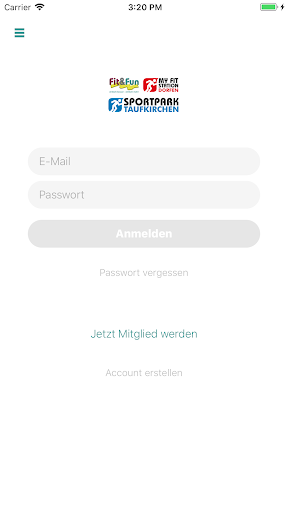  |   | 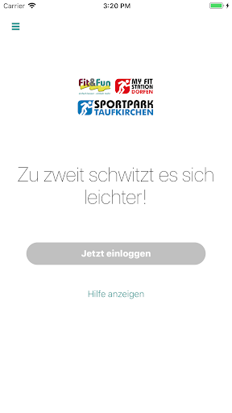  | 
 | 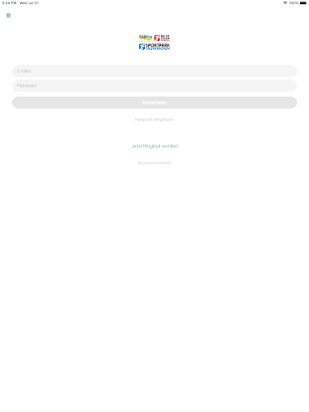  | 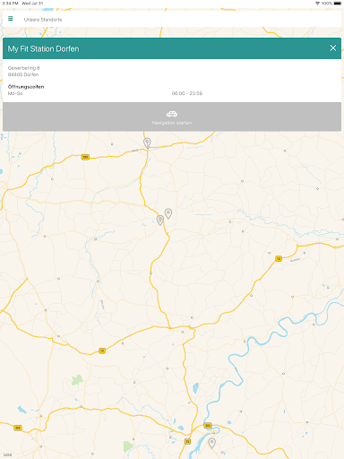  | 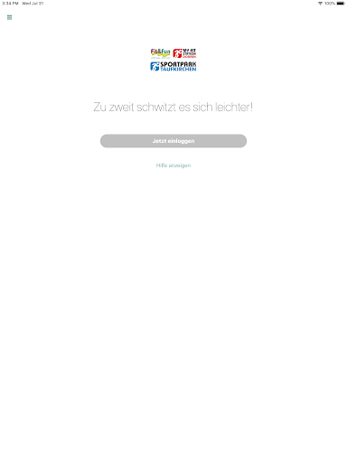  | 
 |   |   |   | 

## Development team
In the following we report the main information provided by the development team in the Google play store.

| | |
|-------------------------|-------------------------|
| **Developer**  | Happy Systems GmbH |
| **Website**  | [https://www.gym4all.club/](https://www.gym4all.club/) |
| **Email** | ehlers@entrecode.de |
| **Physical address**  | - |
| **Other developed apps**  | [https://play.google.com/store/apps/developer?id=Happy+Systems+GmbH](https://play.google.com/store/apps/developer?id=Happy+Systems+GmbH) |

## Android support

| | |
|-------------------------|-------------------------|
| **Declared target Android version**  | Pie, version 9 (API level 28) |
| **Effective target Android version**  | Pie, version 9 (API level 28) |
| **Minimum supported Android version**  | Lollipop, version 5.0 (API level 21) |
| **Maximum target Android version**  | - |

The larger the difference between the minimum and maximum supported Android versions, the better. A larger difference means a wider audience. For example, old phones have a very low Android version, so a high minimum supported Android version means that the app cannot be used by users with old phones, thus leading to accessibility problems. 

## Requested permissions

In the following we report the complete list of the permissions requested by the app. 

| **Permission** | **Protection level** | **Description** | 
|-------------------------|-------------------------|-------------------------|
 **android.permission ACCESS_NETWORK_STATE** | Normal | Allows applications to access information about networks. 
 **android.permission ACCESS_WIFI_STATE** | Normal | Allows applications to access information about Wi-Fi networks. 
 **android.permission CAMERA** | :warning:**Dangerous** | Required to be able to access the camera device. 
 **android.permission FOREGROUND_SERVICE** | Normal | Allows a regular application to use Service.startForeground. 
 **android.permission INTERNET** | Normal | Allows applications to open network sockets. 
 **android.permission MODIFY_AUDIO_SETTINGS** | Normal | Allows an application to modify global audio settings. 
 **android.permission RECEIVE_BOOT_COMPLETED** | Normal | Allows an application to receive the Intent.ACTION_BOOT_COMPLETED that is broadcast after the system finishes booting. 
 **android.permission REQUEST_INSTALL_PACKAGES** | Signature | Allows an application to request installing packages. 
 **android.permission STORAGE** | - | - 
 **android.permission SYSTEM_ALERT_WINDOW** | Signature - preinstalled - appop - pre23 - development | Allows an app to create windows using the type WindowManager.LayoutParams.TYPE_APPLICATION_OVERLAY, shown on top of all other apps. 
 **android.permission WAKE_LOCK** | Normal | Allows using PowerManager WakeLocks to keep processor from sleeping or screen from dimming. 
 **com.google.android.c2dm.permission RECEIVE** | - | - 
 **com.google.android.finsky.permission BIND_GET_INSTALL_REFERRER_SERVICE** | - | - 
 **de.hector.clubapp.gym4all.permission C2D_MESSAGE** | - | - 
 **host.exp.exponent.permission C2D_MESSAGE** | - | - 

## Mentioned servers

| **Server** | **Registrant** | **Registrant country** | **Creation date** | 
|-------------------------|-------------------------|-------------------------|-------------------------|
 | amplitude.com | Amplitude | :us: US | 1996-05-09 04:00:00 |
 | segment.com | Domains By Proxy, LLC | :us: US | 1998-07-06 04:00:00 |
 | segment.io | Segment.io, Inc. | :us: US | 2011-10-01 04:10:05 |
 | facebook.com | Facebook, Inc. | :us: US | 1997-03-29 05:00:00 |
 | google.com | Google LLC | :us: US | 1997-09-15 04:00:00 |
 | android.com | Google LLC | :us: US | 1997-06-23 04:00:00 |
 | googlesyndication.com | Google LLC | :us: US | 2003-01-21 06:17:24 |
 | googleapis.com | Google LLC | :us: US | 2005-01-25 17:52:26 |
 | w3.org | W3C | :us: US | 1994-07-06 04:00:00 |
 | doubleclick.net | Google Inc. | :us: US | 1996-01-16 05:00:00 |
 | gstatic.com | Google LLC | :us: US | 2008-02-11 15:31:25 |
 | googleapis.com | Google LLC | :us: US | 2005-01-25 17:52:26 |
 | google-analytics.com | Google LLC | :us: US | 2005-07-18 19:24:32 |
 | app-measurement.com | Google LLC | :us: US | 2015-06-19 20:13:31 |
 | expo.io | See PrivacyGuardian.org | :us: US | 2011-05-01 21:26:50 |
 | cloudfront.net | Amazon.com, Inc. | :us: US | 2008-04-25 18:25:49 |
 | cloudfront.net | Amazon.com, Inc. | :us: US | 2008-04-25 18:25:49 |
 | exp.com | GDPR Masked | BG | 1994-09-19 04:00:00 |
 | crashlytics.com | Google LLC | :us: US | 2011-01-21 15:30:40 |
 | googleadservices.com | Google LLC | :us: US | 2003-06-19 16:34:53 |

## Security analysis 

Below we report the main security warnings raised by our execution of the [Androwarn](https://github.com/maaaaz/androwarn) security analysis tool.

**Telephony identifiers leakage**
> - This application reads the ISO country code equivalent for the SIM provider's country code 
> - This application reads the ISO country code equivalent of the current registered operator's MCC (Mobile Country Code) 
> - This application reads the MCC+MNC of the provider of the SIM 
> - This application reads the Service Provider Name (SPN) 
> - This application reads the constant indicating the state of the device SIM card 
> - This application reads the device phone type value 
> - This application reads the numeric name (MCC+MNC) of current registered operator 
> - This application reads the operator name 
> - This application reads the radio technology (network type) currently in use on the device for data transmission 
> - This application reads the unique device ID, i.e the IMEI for GSM and the MEID or ESN for CDMA phones 

**Location lookup**
> - This application reads location information from all available providers (WiFi, GPS etc.) 

**Connection interfaces exfiltration**
> - This application reads details about the currently active data network 
> - This application tries to find out if the currently active data network is metered 

**Telephony services abuse**
> - This application makes phone calls 

**Audio video eavesdropping**
> - This application records audio from the 'CAMCORDER' source  
> - This application records audio from the 'DEFAULT' source  
> - This application records audio from the 'MIC' source  
> - This application captures video from the 'CAMERA' source 
> - This application captures video from the 'SURFACE' source 

**Suspicious connection establishment**
> - This application opens a Socket and connects it to the remote address '' on the 'N/A' port  
> - This application opens a Socket and connects it to the remote address 'Ljava/lang/StringBuilder;->toString()Ljava/lang/String;' on the ': connect, resolve' port  
> - This application opens a Socket and connects it to the remote address 'Ljava/lang/StringBuilder;->toString()Ljava/lang/String;' on the 'N/A' port  
> - This application opens a Socket and connects it to the remote address 'Ljava/net/Proxy;->type()Ljava/net/Proxy$Type;' on the 'N/A' port  
> - This application opens a Socket and connects it to the remote address 'timeout' on the 'N/A' port  

**Pim data leakage**
> - This application accesses data stored in the clipboard 

**Code execution**
> - This application loads a native library 
> - This application executes a UNIX command containing this argument: '2' 

## User ratings and reviews

Below we provide information about how end users are reacting to the app in terms of ratings and reviews in the Google Play store.

### Ratings

The gym4all app has been installed by more than **100** times. At this time, **-** rated the app and its average score is **0.0**. Below we show the distribution of the ratings across the usual star-based rating of Google Play

:star::star::star::star::star:: 0

:star::star::star::star:: 0

:star::star::star:: 0

:star::star:: 0

:star:: 0

### Reviews 

#### 5-star reviews

No recent reviews available with 5 stars.

#### 4-star reviews

No recent reviews available with 4 stars.

#### 3-star reviews

No recent reviews available with 3 stars.

#### 2-star reviews

No recent reviews available with 2 stars.

#### 1-star reviews

No recent reviews available with 1 stars.

# PatientConcept
App version ``4.19.4``

Analyzed with [covid-apps-observer](http://github.com/covid-apps-observer) project, version ``0.1``

## App overview
| | |
|-------------------------|-------------------------| 
| **Name**&nbsp;&nbsp;&nbsp;&nbsp;&nbsp;&nbsp;&nbsp;&nbsp;&nbsp;&nbsp;&nbsp;&nbsp;&nbsp;&nbsp;&nbsp;&nbsp;&nbsp;&nbsp;&nbsp;&nbsp;&nbsp;&nbsp;&nbsp;&nbsp;&nbsp;&nbsp;&nbsp;&nbsp;&nbsp;&nbsp;&nbsp;&nbsp;&nbsp;&nbsp;&nbsp;&nbsp;&nbsp;&nbsp;&nbsp;&nbsp;  | PatientConcept |
| **Unique identifier** | de.neurosys.patientconceptapp |
| **Link to Google Play** | [https://play.google.com/store/apps/details?id=de.neurosys.patientconceptapp](https://play.google.com/store/apps/details?id=de.neurosys.patientconceptapp) |
| **Summary**  | PatientConcept ist Ihr Therapieassistent bei chronischen Erkrankungen. |
| **Privacy policy** | [https://neurosys.de/datenschutzerklaerung/#tab-id-3](https://neurosys.de/datenschutzerklaerung/#tab-id-3) |
| **Latest version** | 4.19.4 |
| **Last update** | 2020-10-17 12:52:26 |
| **Recent changes** | - Nutzen der PatientConcept-App ohne Praxis möglich - Usability in Einstellungen verbessert - diverse Fehlerbehebungen |
| **Installs**  | 1.000+ |
| **Category** | Medizin |
| **First release** | 12.07.2016 |
| **Size**  | 8,1M |
| **Supported Android version**  | 6.0 oder höher |

### Description
> PatientConcept ist Ihr Therapieassistent bei chronischen Erkrankungen.
 Chronische Erkrankungen sind oft mit langfristigen Therapien verbunden und stellen die Betroffenen vor viele Herausforderungen im Alltag. PatientConcept wurde speziell für Menschen mit chronischen Erkrankungen entwickelt und ermöglicht Patientinnen und Patienten, die Erkrankung zu dokumentieren, Therapiepläne zu kontrollieren und mit ihrer behandelnden Praxis in Verbindung zu bleiben. 
 PatientConcept als Arzt-Patienten-Kommunikationssystem
 Nutzen Sie PatientConcept vollständig anonym, ohne die Eingabe persönlicher Daten. Nimmt Ihre Praxis am System PatientConcept teil, so können Sie über die App auch Gesundheitswerte teilen, die nur von Ihrem Arzt entschlüsselt werden können – generieren Sie hierzu lediglich Ihre PatientConcept-ID. 
 WICHTIGSTE FUNKTIONEN
 THERAPIEKONTROLLE
 Wurde Ihnen von Ihrem Arzt eine langfristige Therapie verordnet, so können Sie die verordnete Therapie mit allen Kontrollterminen in PatientConcept übersichtlich und einfach verfolgen. Die Therapiekontrolle steht Ihnen nur zur Verfügung, wenn Ihre behandelnde Praxis am System PatientConcept teilnimmt.
 TAGEBÜCHER FÜR UNTERSCHIEDLICHE ERKRANKUNGEN
 Mit den Tagebuchfunktionen können Sie Ihre Erkrankung(en) dokumentieren und sich besser auf Ihren nächsten Besuch beim Arzt vorbereiten. Die Tagebücher stehen Ihnen auch ohne die Auswahl einer Praxis zur Verfügung.
 Tagebuchfunktion für Multiple Sklerose (MS) 
 Im MS-Tagebuch können Sie die Symptome Ihrer MS-Erkrankung erfassen und dokumentieren, beispielsweise Schübe, Fatigue und Ihre allgemeine Befindlichkeit. Sie finden hier auch einen Bereich für die Familienplanung mit MS. Das MS-Tagebuch hilft Ihnen und Ihrem Arzt, Ihre Therapie auf Ihre individuellen Bedürfnisse abzustimmen. 
 Tagebuchfunktion für Migräne
 Mit dem Migräne-Tagebuch haben Sie Ihre Migräne im Griff: Sie dokumentieren hier Ihre Migräne-Attacken nach Datum und Uhrzeit, Schmerzstellen und Begleitsymptomen für Ihren nächsten Termin beim Arzt.
 Tagebuchfunktion für Spastik
 Spastische Anfälle treten bei einigen Krankheiten als Begleitsymptom auf. Mit dem Spastik-Tagebuch können Sie zusätzlich zur Medikation Ihre spastischen Anfälle dokumentieren. 
 Tagebuchfunktion für Morbus Gaucher 
 Das Morbus-Gaucher-Tagebuch wurde speziell für die Unterstützung der Substratreduktionstherapie bei Morbus Gaucher entwickelt. Sie erhalten während Ihrer Therapie in regelmäßigen Abständen kurze, individuelle Nachrichten. Zudem steht Ihnen eine Erinnerungsfunktion an die Medikamenteneinnahme zur Verfügung.
 	
 WEITERE NÜTZLICHE FUNKTIONEN
 Darüber hinaus enthält PatientConcept weitere hilfreiche Funktionen, die Ihnen dabei helfen, Ihren Alltag mit der Erkrankung besser zu bewältigen, wie beispielsweise einen Pillenwecker, einen Aktivitätsmonitor, eine Terminanfragefunktion und die Möglichkeit der Folgerezeptbestellung in Ihrer Praxis. 
 Entdecken Sie PatientConcept, Ihren smarten Therapieassistenten!

### User interface
The developers of the app provide the following screenshots in the Google play store.
| | | |
|:-------------------------:|:-------------------------:|:-------------------------:|
 | 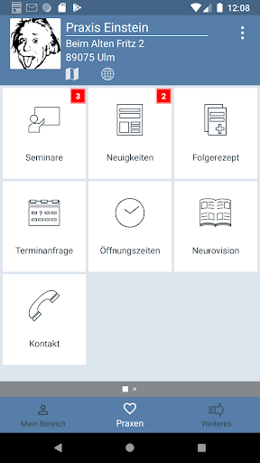  | 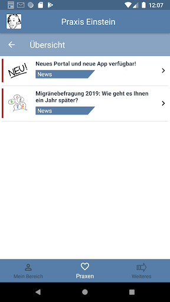  | 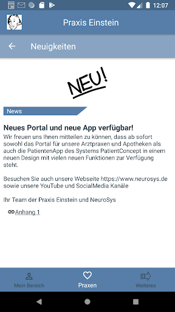  | 
 | 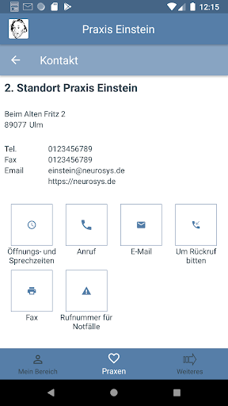  | 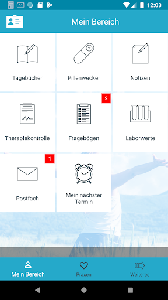  | 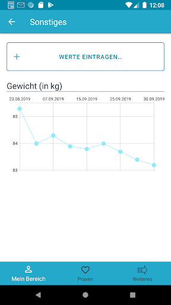  | 
 | 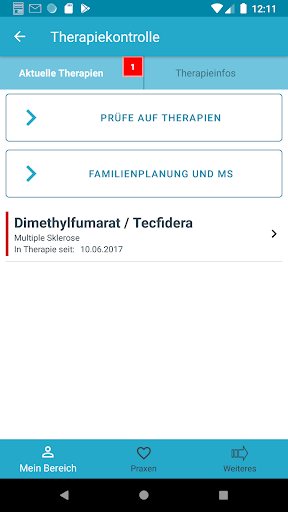  | 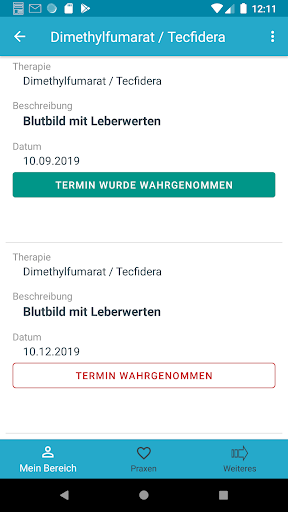 

## Development team
In the following we report the main information provided by the development team in the Google play store.

| | |
|-------------------------|-------------------------|
| **Developer**  | NeuroSys GmbH |
| **Website**  | [http://www.neurosys.de](http://www.neurosys.de) |
| **Email** | entwicklung@neurosys.de |
| **Physical address**  | - |
| **Other developed apps**  | [https://play.google.com/store/apps/developer?id=NeuroSys+GmbH](https://play.google.com/store/apps/developer?id=NeuroSys+GmbH) |

## Android support

| | |
|-------------------------|-------------------------|
| **Declared target Android version**  | Android10, version 10 (API level 29) |
| **Effective target Android version**  | Android10, version 10 (API level 29) |
| **Minimum supported Android version**  | Marshmallow, version 6.0 (API level 23) |
| **Maximum target Android version**  | - |

The larger the difference between the minimum and maximum supported Android versions, the better. A larger difference means a wider audience. For example, old phones have a very low Android version, so a high minimum supported Android version means that the app cannot be used by users with old phones, thus leading to accessibility problems. 

## Requested permissions

In the following we report the complete list of the permissions requested by the app. 

| **Permission** | **Protection level** | **Description** | 
|-------------------------|-------------------------|-------------------------|
 **android.permission ACCESS_COARSE_LOCATION** | :warning:**Dangerous** | Allows an app to access approximate location. 
 **android.permission ACCESS_FINE_LOCATION** | :warning:**Dangerous** | Allows an app to access precise location. 
 **android.permission ACCESS_NETWORK_STATE** | Normal | Allows applications to access information about networks. 
 **android.permission CAMERA** | :warning:**Dangerous** | Required to be able to access the camera device. 
 **android.permission FOREGROUND_SERVICE** | Normal | Allows a regular application to use Service.startForeground. 
 **android.permission INTERNET** | Normal | Allows applications to open network sockets. 
 **android.permission READ_EXTERNAL_STORAGE** | :warning:**Dangerous** | Allows an application to read from external storage. 
 **android.permission RECEIVE_BOOT_COMPLETED** | Normal | Allows an application to receive the Intent.ACTION_BOOT_COMPLETED that is broadcast after the system finishes booting. 
 **android.permission VIBRATE** | Normal | Allows access to the vibrator. 
 **android.permission WAKE_LOCK** | Normal | Allows using PowerManager WakeLocks to keep processor from sleeping or screen from dimming. 
 **android.permission WRITE_EXTERNAL_STORAGE** | :warning:**Dangerous** | Allows an application to write to external storage. 
 **com.google.android.c2dm.permission RECEIVE** | - | - 

## Mentioned servers

| **Server** | **Registrant** | **Registrant country** | **Creation date** | 
|-------------------------|-------------------------|-------------------------|-------------------------|
 | google.com | Google LLC | :us: US | 1997-09-15 04:00:00 |
 | facebook.com | Facebook, Inc. | :us: US | 1997-03-29 05:00:00 |
 | googleapis.com | Google LLC | :us: US | 2005-01-25 17:52:26 |
 | patientconcept.de | - | - | - |
 | tbook.de | - | - | - |
 | crashlytics.com | Google LLC | :us: US | 2011-01-21 15:30:40 |

## Security analysis 

Below we report the main security warnings raised by our execution of the [Androwarn](https://github.com/maaaaz/androwarn) security analysis tool.

**Telephony identifiers leakage**
> - This application reads the device phone type value 

**Connection interfaces exfiltration**
> - This application reads details about the currently active data network 
> - This application tries to find out if the currently active data network is metered 

**Telephony services abuse**
> - This application makes phone calls 

**Suspicious connection establishment**
> - This application opens a Socket and connects it to the remote address '' on the 'N/A' port  
> - This application opens a Socket and connects it to the remote address 'Lcz/msebera/android/httpclient/HttpHost;->getPort()I' on the 'Lcz/msebera/android/httpclient/HttpHost;->getPort()I' port  
> - This application opens a Socket and connects it to the remote address 'Ljava/lang/StringBuilder;->toString()Ljava/lang/String;' on the 'N/A' port  
> - This application opens a Socket and connects it to the remote address 'Ljava/net/Proxy;->type()Ljava/net/Proxy$Type;' on the 'N/A' port  
> - This application opens a Socket and connects it to the remote address 'timeout' on the 'N/A' port  

**Code execution**
> - This application loads a native library: 'Ljava/lang/String;->valueOf(Ljava/lang/Object;)Ljava/lang/String;' 

## User ratings and reviews

Below we provide information about how end users are reacting to the app in terms of ratings and reviews in the Google Play store.

### Ratings

The PatientConcept app has been installed by more than **1000** times. At this time, **15** rated the app and its average score is **4.4**. Below we show the distribution of the ratings across the usual star-based rating of Google Play

:star::star::star::star::star:: 10

:star::star::star::star:: 2

:star::star::star:: 2

:star::star:: 1

:star:: 0

### Reviews 

#### 5-star reviews

> Das Beste in diesem Berieich bisher !!  :date: __2020-08-02 18:25:28__

> super - endlich etwas Brauchbares  :date: __2019-07-08 14:32:21__

> Super! Einfache Bedienung!  :date: __2018-03-29 09:50:29__

> Einfach zu nutzen. Funktioniert bei mir einwandfrei!  :date: __2018-03-09 13:28:49__

> Top!  :date: __2017-06-07 21:59:39__

> Sehr gut  :date: __2017-03-20 12:04:12__

#### 4-star reviews

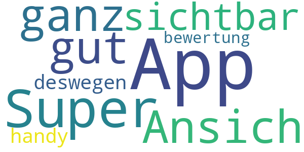

> Super App  :date: __2018-07-02 16:05:06__

> Ansich ganz gut aber hab die app nicht sichtbar auf dem handy deswegen bewertung 1 hier  :date: __2017-06-26 11:38:06__

#### 3-star reviews

> Wie kann die App so i in der Smartphone-Oberfläche platziert werden, dass die App bei Bedarf auch schnell gefunden wird???  :date: __2020-04-03 10:52:31__

#### 2-star reviews

No recent reviews available with 2 stars.

#### 1-star reviews

No recent reviews available with 1 stars.

# CredoWeb Deutschland – Ihr Gesundheitsnetzwerk!
App version ``2.4.6``

Analyzed with [covid-apps-observer](http://github.com/covid-apps-observer) project, version ``0.1``

## App overview
| | |
|-------------------------|-------------------------| 
| **Name**&nbsp;&nbsp;&nbsp;&nbsp;&nbsp;&nbsp;&nbsp;&nbsp;&nbsp;&nbsp;&nbsp;&nbsp;&nbsp;&nbsp;&nbsp;&nbsp;&nbsp;&nbsp;&nbsp;&nbsp;&nbsp;&nbsp;&nbsp;&nbsp;&nbsp;&nbsp;&nbsp;&nbsp;&nbsp;&nbsp;&nbsp;&nbsp;&nbsp;&nbsp;&nbsp;&nbsp;&nbsp;&nbsp;&nbsp;&nbsp;  | CredoWeb Deutschland – Ihr Gesundheitsnetzwerk! |
| **Unique identifier** | de.credoweb.android |
| **Link to Google Play** | [https://play.google.com/store/apps/details?id=de.credoweb.android](https://play.google.com/store/apps/details?id=de.credoweb.android) |
| **Summary**  | CredoWeb verbindet die gesamte Gesundheitsbranche Deutschland in einer App! |
| **Privacy policy** | [https://www.credoweb.de/privacy-policy](https://www.credoweb.de/privacy-policy) |
| **Latest version** | 2.4.6 |
| **Last update** | 2020-10-18 17:51:06 |
| **Recent changes** | Niemand mag Bugs in der App - wir auch nicht! Deshalb updaten wir CredoWeb regelmäßig und verbessern ständig unsere App. Jedes Update enthält Fehlerbehebungen und Verbesserungen der Performance. |
| **Installs**  | 10+ |
| **Category** | Medizin |
| **First release** | 06.06.2018 |
| **Size**  | 55M |
| **Supported Android version**  | 5.0 oder höher |

### Description
> CredoWeb - Das deutsche Netzwerk für Gesundheit.
 www.CredoWeb.de verbindet die gesamte Gesundheitsbranche auf einer professionellen Plattform! Es ermöglicht Ärzten und allen Health Professionals sich mit Kollegen und der Öffentlichkeit zu unterhalten. Jeder kann ein kostenloses Profil erstellen und so sein medizinisches Leistungsspektrum optimal darstellen.
 Durch CredoWeb erhalten alle einen professionellen Zugang zu Fachinformationen, aktuell und gefiltert nach Ihren Bedürfnissen. Bei der Suche nach einem bestimmten Themenbereich werden alle relevanten Artikel und Informationen, gleich gemeinsam mit den Kontaktdaten von spezialisierten ÄrztInnen aufgelistet. So fällt es PatientInnen leichter, sich gezielt über neue wissenschaftliche Erkenntnisse und mögliche Therapieoptionen zu informieren und auszutauschen. Noch einfacher kann man Arzt und Patient nicht zusammenbringen.
 App-Funktionen:
 • Artikel posten und Erfahrungen mit Kollegen austauschen
 • Aktuelle medizinische Informationen lesen
 • An virtuellen Diskussionen und Veranstaltungen teilnehmen

### User interface
The developers of the app provide the following screenshots in the Google play store.
| | | |
|:-------------------------:|:-------------------------:|:-------------------------:|
 |   |   |   | 
 |   | 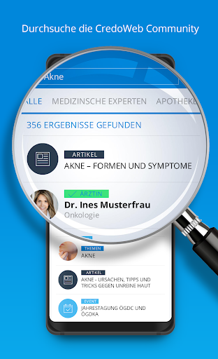 

## Development team
In the following we report the main information provided by the development team in the Google play store.

| | |
|-------------------------|-------------------------|
| **Developer**  | CredoWeb Services |
| **Website**  | [http://www.credoweb.bg](http://www.credoweb.bg) |
| **Email** | it@credoweb.bg |
| **Physical address**  | - |
| **Other developed apps**  | [https://play.google.com/store/apps/developer?id=CredoWeb+Services](https://play.google.com/store/apps/developer?id=CredoWeb+Services) |

## Android support

| | |
|-------------------------|-------------------------|
| **Declared target Android version**  | Pie, version 9 (API level 28) |
| **Effective target Android version**  | Pie, version 9 (API level 28) |
| **Minimum supported Android version**  | KitKat, version 4.4 - 4.4.4 (API level 19) |
| **Maximum target Android version**  | - |

The larger the difference between the minimum and maximum supported Android versions, the better. A larger difference means a wider audience. For example, old phones have a very low Android version, so a high minimum supported Android version means that the app cannot be used by users with old phones, thus leading to accessibility problems. 

## Requested permissions

In the following we report the complete list of the permissions requested by the app. 

| **Permission** | **Protection level** | **Description** | 
|-------------------------|-------------------------|-------------------------|
 **android.permission ACCESS_FINE_LOCATION** | :warning:**Dangerous** | Allows an app to access precise location. 
 **android.permission ACCESS_NETWORK_STATE** | Normal | Allows applications to access information about networks. 
 **android.permission CAMERA** | :warning:**Dangerous** | Required to be able to access the camera device. 
 **android.permission INTERNET** | Normal | Allows applications to open network sockets. 
 **android.permission READ_APP_BADGE** | - | - 
 **android.permission READ_EXTERNAL_STORAGE** | :warning:**Dangerous** | Allows an application to read from external storage. 
 **android.permission READ_PHONE_STATE** | :warning:**Dangerous** | Allows read only access to phone state, including the phone number of the device, current cellular network information, the status of any ongoing calls, and a list of any PhoneAccounts registered on the device. 
 **android.permission RECEIVE_BOOT_COMPLETED** | Normal | Allows an application to receive the Intent.ACTION_BOOT_COMPLETED that is broadcast after the system finishes booting. 
 **android.permission VIBRATE** | Normal | Allows access to the vibrator. 
 **android.permission WAKE_LOCK** | Normal | Allows using PowerManager WakeLocks to keep processor from sleeping or screen from dimming. 
 **android.permission WRITE_EXTERNAL_STORAGE** | :warning:**Dangerous** | Allows an application to write to external storage. 
 **com.anddoes.launcher.permission UPDATE_COUNT** | - | - 
 **com.google.android.c2dm.permission RECEIVE** | - | - 
 **com.google.android.finsky.permission BIND_GET_INSTALL_REFERRER_SERVICE** | - | - 
 **com.htc.launcher.permission READ_SETTINGS** | - | - 
 **com.htc.launcher.permission UPDATE_SHORTCUT** | - | - 
 **com.huawei.android.launcher.permission CHANGE_BADGE** | - | - 
 **com.huawei.android.launcher.permission READ_SETTINGS** | - | - 
 **com.huawei.android.launcher.permission WRITE_SETTINGS** | - | - 
 **com.majeur.launcher.permission UPDATE_BADGE** | - | - 
 **com.oppo.launcher.permission READ_SETTINGS** | - | - 
 **com.oppo.launcher.permission WRITE_SETTINGS** | - | - 
 **com.sec.android.provider.badge.permission READ** | - | - 
 **com.sec.android.provider.badge.permission WRITE** | - | - 
 **com.sonyericsson.home.permission BROADCAST_BADGE** | - | - 
 **com.sonymobile.home.permission PROVIDER_INSERT_BADGE** | - | - 
 **me.everything.badger.permission BADGE_COUNT_READ** | - | - 
 **me.everything.badger.permission BADGE_COUNT_WRITE** | - | - 

## Mentioned servers

| **Server** | **Registrant** | **Registrant country** | **Creation date** | 
|-------------------------|-------------------------|-------------------------|-------------------------|
 | cloudfront.net | Amazon.com, Inc. | :us: US | 2008-04-25 18:25:49 |
 | credoweb.co | GDPR Masked | :us: US | 2017-11-08 16:15:36 |
 | lilly.com | Eli Lilly and Company | :us: US | 1991-05-10 04:00:00 |
 | google.com | Google LLC | :us: US | 1997-09-15 04:00:00 |
 | xmlpull.org | WhoisGuard, Inc. | PA | 2001-11-26 20:33:08 |
 | facebook.com | Facebook, Inc. | :us: US | 1997-03-29 05:00:00 |
 | googlesyndication.com | Google LLC | :us: US | 2003-01-21 06:17:24 |
 | doubleclick.net | Google Inc. | :us: US | 1996-01-16 05:00:00 |
 | gstatic.com | Google LLC | :us: US | 2008-02-11 15:31:25 |
 | googleapis.com | Google LLC | :us: US | 2005-01-25 17:52:26 |
 | app-measurement.com | Google LLC | :us: US | 2015-06-19 20:13:31 |
 | youtube.com | Google LLC | :us: US | 2005-02-15 05:13:12 |
 | googleapis.com | Google LLC | :us: US | 2005-01-25 17:52:26 |
 | credoweb.de | - | - | - |
 | credoweb.com | GDPR Masked | BG | 1999-08-04 17:12:46 |
 | crashlytics.com | Google LLC | :us: US | 2011-01-21 15:30:40 |

## Security analysis 

Below we report the main security warnings raised by our execution of the [Androwarn](https://github.com/maaaaz/androwarn) security analysis tool.

**Telephony identifiers leakage**
> - This application reads the device phone type value 
> - This application reads the numeric name (MCC+MNC) of current registered operator 
> - This application reads the operator name 
> - This application reads the radio technology (network type) currently in use on the device for data transmission 

**Connection interfaces exfiltration**
> - This application reads details about the currently active data network 
> - This application tries to find out if the currently active data network is metered 

**Telephony services abuse**
> - This application makes phone calls 

**Suspicious connection establishment**
> - This application opens a Socket and connects it to the remote address '' on the 'N/A' port  
> - This application opens a Socket and connects it to the remote address 'Ljava/lang/StringBuilder;->toString()Ljava/lang/String;' on the ': connect, resolve' port  
> - This application opens a Socket and connects it to the remote address 'Ljava/lang/StringBuilder;->toString()Ljava/lang/String;' on the 'N/A' port  
> - This application opens a Socket and connects it to the remote address 'Ljava/net/Proxy;->type()Ljava/net/Proxy$Type;' on the 'N/A' port  
> - This application opens a Socket and connects it to the remote address 'timeout' on the 'N/A' port  

**Pim data leakage**
> - This application accesses the downloads folder 
> - This application accesses data stored in the clipboard 

## User ratings and reviews

Below we provide information about how end users are reacting to the app in terms of ratings and reviews in the Google Play store.

### Ratings

The CredoWeb Deutschland – Ihr Gesundheitsnetzwerk! app has been installed by more than **10** times. At this time, **-** rated the app and its average score is **0.0**. Below we show the distribution of the ratings across the usual star-based rating of Google Play

:star::star::star::star::star:: 0

:star::star::star::star:: 0

:star::star::star:: 0

:star::star:: 0

:star:: 0

### Reviews 

#### 5-star reviews

No recent reviews available with 5 stars.

#### 4-star reviews

No recent reviews available with 4 stars.

#### 3-star reviews

No recent reviews available with 3 stars.

#### 2-star reviews

No recent reviews available with 2 stars.

#### 1-star reviews

No recent reviews available with 1 stars.

# Pollenflug-Vorhersage
App version ``2.7``

Analyzed with [covid-apps-observer](http://github.com/covid-apps-observer) project, version ``0.1``

## App overview
| | |
|-------------------------|-------------------------| 
| **Name**&nbsp;&nbsp;&nbsp;&nbsp;&nbsp;&nbsp;&nbsp;&nbsp;&nbsp;&nbsp;&nbsp;&nbsp;&nbsp;&nbsp;&nbsp;&nbsp;&nbsp;&nbsp;&nbsp;&nbsp;&nbsp;&nbsp;&nbsp;&nbsp;&nbsp;&nbsp;&nbsp;&nbsp;&nbsp;&nbsp;&nbsp;&nbsp;&nbsp;&nbsp;&nbsp;&nbsp;&nbsp;&nbsp;&nbsp;&nbsp;  | Pollenflug-Vorhersage |
| **Unique identifier** | de.hexal.pollenflug |
| **Link to Google Play** | [https://play.google.com/store/apps/details?id=de.hexal.pollenflug](https://play.google.com/store/apps/details?id=de.hexal.pollenflug) |
| **Summary**  | Die Pollenflug-Vorhersage mit vielen Funktionen für die Allergie-Saison 2020 |
| **Privacy policy** | [https://allergie.hexal.de/pollenflug/pollenflug-app/#android](https://allergie.hexal.de/pollenflug/pollenflug-app/#android) |
| **Latest version** | 2.7 |
| **Last update** | 2020-03-18 12:43:23 |
| **Recent changes** | Dieses Update enthält:  - Fehlerbehebungen im Tagebuch - App-Optimierungen - Update Startbildschirm  Eine beschwerdefreie Allergiezeit wünscht Hexal! |
| **Installs**  | 500.000+ |
| **Category** | Gesundheit & Fitness |
| **First release** | 11.05.2011 |
| **Size**  | 13M |
| **Supported Android version**  | 5.0 oder höher |

### Description
> Die Pollenflug-Vorhersage mit vielen weiteren Funktionen für die Allergie-Saison 2020. Welche Pollen fliegen heute? Die Android-App von Hexal zeigt Ihnen die Pollenflug-Vorhersage aktuell und zielgenau – mit vielen Extras, wie der Alarmfunktion.
 • Die Pollenflug-Vorhersage für 15 allergieauslösende Pflanzen: tagesaktuell und ortsgenau
 • Vorhersage für 7 Tage (bei Drehen des Bildschirms)
 • Komfortable Slider-Navigation
 • Jahres-Pollenflugkalender der 15 Pflanzen
 • Symbole auch über Ihre Form unterscheidbar (für User mit Rot- Grün Sehschwäche)
 • Übersichtliche Vorhersage- Karten für Deutschland und die Bundesländer
 • Zielgenaue Suche nach Ort, Postleitzahl oder Standorterkennung (GPS) in Deutschland
 • Deutschland-Trend: So entwickelt sich der aktuelle Pollenflug
 • Individualisierte Nutzung: Eigene Orte und Pflanzen in den Einstellungen auswählen
 • Lassen Sie sich warnen: Mit Push- Benachrichtigungen, wenn „Ihre“ Pollen vorhergesagt sind!
 • Informationen zu den allergieauslösenden Pflanzen
 • Tagebuchfunktion
 • 3x tägliche Aktualisierung der Daten
 • Notruf- Telefonnummern
 • Installierbar auf SD Karte (App2SD)

### User interface
The developers of the app provide the following screenshots in the Google play store.
| | | |
|:-------------------------:|:-------------------------:|:-------------------------:|
 | 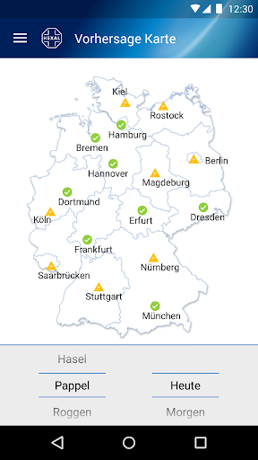  | 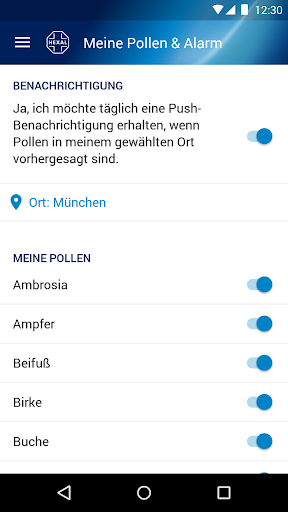  | 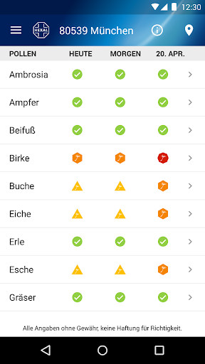  | 
 | 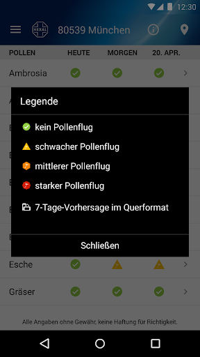  | 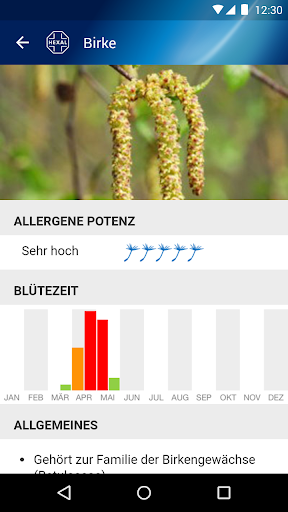  | 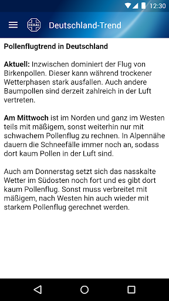  | 
 | 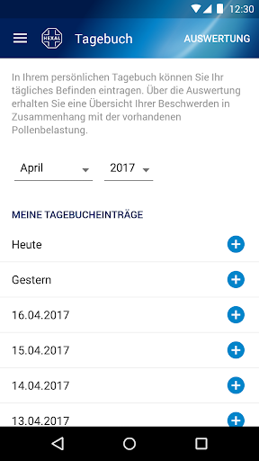 

## Development team
In the following we report the main information provided by the development team in the Google play store.

| | |
|-------------------------|-------------------------|
| **Developer**  | Hexal AG |
| **Website**  | [http://www.allergie.hexal.de](http://www.allergie.hexal.de) |
| **Email** | webmaster@hexal.com |
| **Physical address**  | - |
| **Other developed apps**  | [https://play.google.com/store/apps/developer?id=Hexal+AG](https://play.google.com/store/apps/developer?id=Hexal+AG) |

## Android support

| | |
|-------------------------|-------------------------|
| **Declared target Android version**  | Pie, version 9 (API level 28) |
| **Effective target Android version**  | Pie, version 9 (API level 28) |
| **Minimum supported Android version**  | Lollipop, version 5.0 (API level 21) |
| **Maximum target Android version**  | - |

The larger the difference between the minimum and maximum supported Android versions, the better. A larger difference means a wider audience. For example, old phones have a very low Android version, so a high minimum supported Android version means that the app cannot be used by users with old phones, thus leading to accessibility problems. 

## Requested permissions

In the following we report the complete list of the permissions requested by the app. 

| **Permission** | **Protection level** | **Description** | 
|-------------------------|-------------------------|-------------------------|
 **android.permission ACCESS_COARSE_LOCATION** | :warning:**Dangerous** | Allows an app to access approximate location. 
 **android.permission ACCESS_FINE_LOCATION** | :warning:**Dangerous** | Allows an app to access precise location. 
 **android.permission ACCESS_NETWORK_STATE** | Normal | Allows applications to access information about networks. 
 **android.permission INTERNET** | Normal | Allows applications to open network sockets. 
 **android.permission RECEIVE_BOOT_COMPLETED** | Normal | Allows an application to receive the Intent.ACTION_BOOT_COMPLETED that is broadcast after the system finishes booting. 
 **android.permission VIBRATE** | Normal | Allows access to the vibrator. 
 **android.permission WAKE_LOCK** | Normal | Allows using PowerManager WakeLocks to keep processor from sleeping or screen from dimming. 
 **com.google.android.c2dm.permission RECEIVE** | - | - 
 **com.google.android.finsky.permission BIND_GET_INSTALL_REFERRER_SERVICE** | - | - 

## Mentioned servers

| **Server** | **Registrant** | **Registrant country** | **Creation date** | 
|-------------------------|-------------------------|-------------------------|-------------------------|
 | googlesyndication.com | Google LLC | :us: US | 2003-01-21 06:17:24 |
 | google.com | Google LLC | :us: US | 1997-09-15 04:00:00 |
 | facebook.com | Facebook, Inc. | :us: US | 1997-03-29 05:00:00 |
 | app-measurement.com | Google LLC | :us: US | 2015-06-19 20:13:31 |
 | hexal-elements.de | - | - | - |
 | hexal.de | - | - | - |
 | googleapis.com | Google LLC | :us: US | 2005-01-25 17:52:26 |
 | googleapis.com | Google LLC | :us: US | 2005-01-25 17:52:26 |

## Security analysis 

Below we report the main security warnings raised by our execution of the [Androwarn](https://github.com/maaaaz/androwarn) security analysis tool.

**Telephony identifiers leakage**
> - This application reads the unique device ID, i.e the IMEI for GSM and the MEID or ESN for CDMA phones 

**Connection interfaces exfiltration**
> - This application reads details about the currently active data network 
> - This application tries to find out if the currently active data network is metered 

**Telephony services abuse**
> - This application makes phone calls 

**Suspicious connection establishment**
> - This application opens a Socket and connects it to the remote address '' on the 'N/A' port  
> - This application opens a Socket and connects it to the remote address 'Ljava/lang/StringBuilder;->toString()Ljava/lang/String;' on the 'N/A' port  
> - This application opens a Socket and connects it to the remote address 'Ljava/net/Proxy;->type()Ljava/net/Proxy$Type;' on the 'N/A' port  
> - This application opens a Socket and connects it to the remote address 'timeout' on the 'N/A' port  

**Code execution**
> - This application executes a UNIX command 

## User ratings and reviews

Below we provide information about how end users are reacting to the app in terms of ratings and reviews in the Google Play store.

### Ratings

The Pollenflug-Vorhersage app has been installed by more than **500000** times. At this time, **7561** rated the app and its average score is **4.594203**. Below we show the distribution of the ratings across the usual star-based rating of Google Play

:star::star::star::star::star:: 5211

:star::star::star::star:: 1913

:star::star::star:: 269

:star::star:: 59

:star:: 109

### Reviews 

#### 5-star reviews

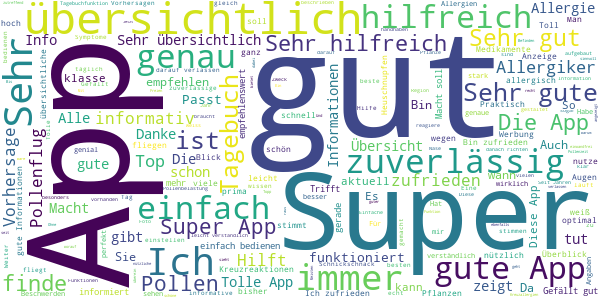

> sehr gute genaue Auskunft  :date: __2020-10-20 17:29:00__

> Ist sehr hilfreich. Super  :date: __2020-10-12 22:45:41__

> Aloha die App ist echt super  :date: __2020-10-11 13:28:58__

> Alles passt.  :date: __2020-10-07 20:28:58__

> Ich kann mich immer genau darauf verlassen und hab auch durch die App gelernt wauf was ich alles reagiere.  :date: __2020-10-05 23:39:38__

> Trifft jedesmal zu 👌👍  :date: __2020-10-04 09:33:42__

> Sehr gut ! Es gelingt doch tagesaktuell und ortsspezifisch mit dieser App allergene Verursacher einzugrenzen und zu bestimmen.  :date: __2020-10-03 18:40:39__

> Top!  :date: __2020-09-23 17:18:17__

> Sehr gut👍 mit dazugehörigen Kreuzallergien,da weiss man genau worauf man achten muss Weiter so 👍  :date: __2020-09-23 12:21:15__

> App ist nützlich und gibt mir die nötigen Informationen  :date: __2020-09-23 10:59:03__

#### 4-star reviews

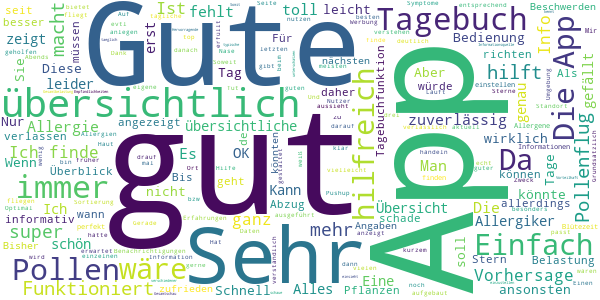

> Ich schaue taeglich, um mich danach einzustellen  :date: __2020-09-14 18:36:08__

> Alles gut  :date: __2020-09-12 18:34:54__

> Sehr gut.  :date: __2020-09-06 12:20:18__

> Ganz gut  :date: __2020-09-04 19:41:26__

> Hervorragende Informationsquelle!  :date: __2020-09-01 17:15:48__

> Die App bietet einen guten Schnell Überblick. Vorteilhaft ist die Gesamtschau auf die Belastung verschiedener Pollen, die man vielleicht in ihrer Gesamtbelastung sonst nicht einsieht oder unterschätzen könnte. Gerade dann, wenn man zwar seine typische Allergie kennt, aber evtl. andere Pollen Empfindlichkeiten nicht oder noch nicht. Somit erschliest sich eine weitere Art eines Allergie Tests durch die App.  :date: __2020-08-22 14:58:57__

> Sehr genau, toll..  :date: __2020-08-16 20:05:31__

> Funktioniert so wie erwartet  :date: __2020-08-15 19:24:05__

> Sehr gut  :date: __2020-08-15 14:19:12__

> Gute Einteilung, ausführliche Beschreibung. Einfach gut!  :date: __2020-08-13 14:28:49__

#### 3-star reviews

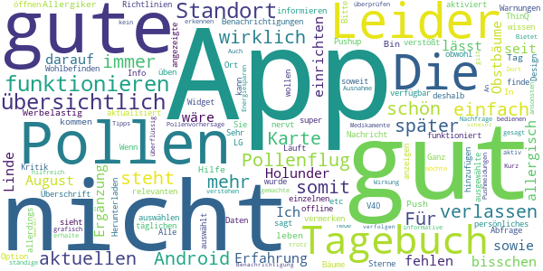

> Ich habe die App seit August ich muss bisschen mehr Erfahrung machen  :date: __2020-09-03 20:55:21__

> Tagebuch lässt sich nicht einrichten  :date: __2020-07-20 09:25:03__

> Für mich fehlen noch Linde und Holunder sowie Obstbäume, bin darauf auch allergisch. Ergänzung wäre schön.  :date: __2020-07-11 18:21:44__

> Werbelastig aber da kann man gut mit leben  :date: __2020-06-06 11:59:51__

> Bin Allergiker. App gute Hilfe durch den Tag zu kommen.  :date: __2020-06-01 13:46:57__

> Push-Benachrichtigungen funktionieren nicht.  :date: __2020-04-21 18:40:12__

> In der App kann man die einzelnen Pollen der Bäume etc auswählen, somit sieht man dann auch später nur noch die relevanten Pollen. Gut finde ich auch das Tagebuch, in der man sein persönliches Wohlbefinden vermerken kann. Leider muss ich aber auch Kritik üben, deshalb auch nur 3 Sterne. Die Pushup Nachricht funktioniert leider nicht, obwohl diese aktiviert wurde. Somit muss man immer die App öffnen um sich über den täglichen Pollenflug zu informieren 🤔🤔  :date: __2020-04-17 17:23:43__

> Läuft Gut  :date: __2020-04-14 10:14:37__

> Die wollen-Sie-wirklich-die-App-verlassen Abfrage nervt, und verstößt gegen Android App Design-Richtlinien.  :date: __2020-04-14 09:15:58__

> Ganz gut soweit  :date: __2020-04-11 17:14:21__

#### 2-star reviews

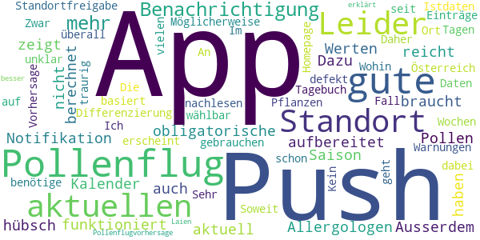

> Push Notifikation funktioniert nicht. Ausserdem berechnet die App den Pollenflug nicht an aktuellen Werten, sondern zeigt einem hübsch aufbereitet welche Pollen aktuell Saison haben. Dazu reicht der obligatorische Kalender vom Allergologen auch, dazu braucht man keine App mit Standortfreigabe.  :date: __2020-08-30 12:52:29__

> Möglicherweise gute App... aber kein Österreich dabei. Sehr traurig....  :date: __2020-07-24 07:32:08__

> Leider kein Ort wählbar sondern nur für den aktuellen Standort. Zwar gute Differenzierung nach Pflanzen, aber unklar, ob die Vorhersage auf Istdaten basiert.  :date: __2020-05-02 11:50:45__

> Soweit eine gute App. Push Benachrichtigung geht nur leider schon seit vielen Wochen nicht mehr. Daher ist diese App für mich nicht mehr zu gebrauchen. Ich benötige die Warnungen!  :date: __2020-05-01 11:51:47__

> Push-Benachrichtigung defekt  :date: __2020-03-18 13:08:43__

> Im Tagebuch erscheint für die Einträge überall "Kein Pollenflug". An diesen Tagen war aber auf jeden Fall Pollenflug (auf der Homepage kann man es für seinen Standort nachlesen). Wohin sind die Daten?  :date: __2020-02-25 20:46:36__

> Die Pollenflugvorhersage könnte besser erklärt werden für Laien.  :date: __2020-01-16 11:31:33__

#### 1-star reviews

> Falsche Angaben. Ambrosia kein Pollenflug. Ist aber bis Ende September akut.  :date: __2020-09-22 15:25:56__

> wundermich warum ich die ganze zeit probleme habe und Symptome von der Pollenallergie.... schau wahrend der arbeit auf die app..... kein pollenflug fur die nachsten tage vorraus gesagt.... heute richtig krasse Symptome bekommen und wunder mich schon,schau uber google, ist bei Gräsern voll ausschlag angezeigt und in der app sreht gar nichts davon! also ich solltmich svhon darauf verlassen kōnnen. deswegen installier ich mir sowas! wird direkt deinstalliert. katastrophe.....  :date: __2020-09-21 10:47:12__

> Zeigt seit Monaten nie aktuelle Pollenvorkommen an / nie das was andere Anbieter anzeigen an. Push funktioniert trotz korrekter Systemkonfiguration nicht. Unbrauchbar  :date: __2020-09-19 15:14:42__

> Diese App funktioniert nur mit Standort Freigabe. Das halte ich für überflüssig und fragwürdig. Warum kann ich nicht einfach meine Region auswählen, oder meine Postleitzahl angeben? Solange ihr nicht nachbessert, suche ich mir eine andere Alternative. Die App ist zudem unübersichtlich. Ich kann zwar eine Region auswählen, muss dann aber jedes Allergen einzeln durchgehen. Leider wurde die Pollenflug App des DWD eingestellt. Die war Konkurrenzlos.  :date: __2020-06-20 11:19:57__

> Megaschlecht. App findet meinen Ort nicht. Man wird nicht eingewiesen, wie man Pollen eingeben kann. Dafür im Menü zig Werbung für Hexal-Produkte. Gleich wieder gelöscht.  :date: __2020-06-03 17:46:16__

> Zeigt nichts an.... Wieder deinstalliert  :date: __2020-06-01 12:38:30__

> Beschissene App  :date: __2020-06-01 11:36:44__

> Eine Vorhersage, die seit drei Tagen behauptet, dass keine Pappel-Pollen mehr fliegen, obwohl hier am Niederrhein die Luft voll ist von "Pappelschnee", den watte-ähnlichen Samen, hat für mich ihren Zweck verfehlt - das ist Schrott!  :date: __2020-05-21 13:34:11__

> Ist gut und verlässlich!!!!  :date: __2020-05-19 05:55:11__

> die app sagt mir, keine Verbindung zum Internet, aber ich bin online. Schade kann meine Stadt nicht eingeben und nutzen.  :date: __2020-04-27 12:29:12__

# Erkältungs-Tipps
App version ``1.4.4``

Analyzed with [covid-apps-observer](http://github.com/covid-apps-observer) project, version ``0.1``

## App overview
| | |
|-------------------------|-------------------------| 
| **Name**&nbsp;&nbsp;&nbsp;&nbsp;&nbsp;&nbsp;&nbsp;&nbsp;&nbsp;&nbsp;&nbsp;&nbsp;&nbsp;&nbsp;&nbsp;&nbsp;&nbsp;&nbsp;&nbsp;&nbsp;&nbsp;&nbsp;&nbsp;&nbsp;&nbsp;&nbsp;&nbsp;&nbsp;&nbsp;&nbsp;&nbsp;&nbsp;&nbsp;&nbsp;&nbsp;&nbsp;&nbsp;&nbsp;&nbsp;&nbsp;  | Erkältungs-Tipps |
| **Unique identifier** | de.healthlab.erkaeltung |
| **Link to Google Play** | [https://play.google.com/store/apps/details?id=de.healthlab.erkaeltung](https://play.google.com/store/apps/details?id=de.healthlab.erkaeltung) |
| **Summary**  | Mit den &quot;Erkältungs-Tipps&quot; sind Sie ideal gegen Husten, Schnupfen &amp; Co gerüstet. |
| **Privacy policy** | [http://www.lifeline.de/datenschutzerklaerung/](http://www.lifeline.de/datenschutzerklaerung/) |
| **Latest version** | 1.4.4 |
| **Last update** | 2020-10-07 13:53:59 |
| **Recent changes** | Erkältungs-Tipps:  Danke für Ihre Hinweise. Wir haben kleinere Optimierungen vorgenommen und in dieses Update integriert.  Sie haben einen Verbesserungsvorschlag oder möchten eine Fehlfunktion melden? Wir freuen uns über Emails an service@lifeline.de  Ihr Lifeline-Team |
| **Installs**  | 50.000+ |
| **Category** | Medizin |
| **First release** | 02.11.2012 |
| **Size**  | 4,9M |
| **Supported Android version**  | 4.1 oder höher |

### Description
> Die App bietet auserlesene Expertentipps zu den wichtigsten Fragen in Sachen "Erkältung", zeigt Ihnen, wie Sie mit einfachen Mitteln gegen eine Erkältung vorgehen können und erlaubt es Ihnen, Ihr neues Fachwissen umgehend mit Freunden zu teilen.
 ENTDECKEN SIE IN DIESER APP:
 > Welche Hausmittel bei Erkältungen helfen!
 > Wie Sie Schnupfen erfolgreich abschütteln!
 > Wie Sie Husten erfolgreich behandeln!
 > Wie Sie Halsschmerzen gekonnt bekämpfen!
 > Wie Sie Gliederschmerzen lindern!
 > Wie Sie am besten auf Fieber reagieren!
 > Wie die Homöopathie bei Erkältungen hilft!
 > Wie Sie Erkältungen vorbeugen!
 > Wie Sie Ihr Immunsystem stärken!
 ... und viele Tipps & Tricks mehr !
 **************************************************
 WICHTIGSTE APP-FEATURES & FUNKTIONEN:
 **************************************************
 > ERKÄLTUNGS-TIPPS
 Entdecken Sie eine große Auswahl von praktischen Erkältungs-Tipps – allgemein verständlich erklärt und alltagstauglich zusammengefasst.
 > 10 KATEGORIEN
 Finden Sie in 10 Kategorien, welche alle wichtigen Themen rund um Erkältungen abdecken, hilfreiche Tipps & Tricks.
 > ZUFALLS-TIPP
 Lassen Sie sich von einem zufällig ausgewählten Erkältungs-Tipp überraschen und rufen anschließend weitere Zufalls-Tipps auf.
 > FAVORITEN-LISTE
 Markieren Sie Ihre favorisierten Tipps und speichern Sie sie separat als Favoriten, um sie jederzeit rasch wiederzufinden.
 > INTERNE SUCHE
 Durchsuchen Sie mit der internen Suchfunktion sämtliche Inhalte der App oder stöbern Sie in allen Erkältungs-Tipps von A-Z.
 > WEITERLEITEN & EMPFEHLEN
 Teilen Sie Tipps mit erkälteten Kollegen oder Freunden. Einfach direkt aus der App per E-Mail weiterleiten oder via Facebook und Twitter posten.
 > EINFACHE NAVIGATION
 Blättern Sie ganz unkompliziert mit einem einfachen „Fingerwisch“ von Tipp zu Tipp.
 > FORTLAUFENDE AKTUALISIERUNG
 Freuen Sie sich auf eine Aktualisierung der Erkältungs-Tipps durch regelmäßige Updates.
 > INTEGRIERTE DATENBANK
 Greifen Sie auf sämtliche Erkältungs-Tipps jederzeit und überall zu – eine Verbindung mit dem Internet ist nicht nötig!
 ***** DIE 10 TIPP-KATEGORIEN IM ÜBERBLICK: *****
 # Allgemeine Tipps
 # Husten
 # Halsschmerzen
 # Schnupfen
 # Fieber
 # Gliederschmerzen
 # Immunsystem stärken
 # Homöopathie
 # Bronchitis
 # Grippe
 *** WIR WÜNSCHEN IHNEN VIEL ERFOLG BEI DER ANWENDUNG DER TIPPS ***
 Feedback und Anregungen sind herzlich willkommen – vielen Dank für Ihr Vertrauen!

### User interface
The developers of the app provide the following screenshots in the Google play store.
| | | |
|:-------------------------:|:-------------------------:|:-------------------------:|
 |   |   |   | 
 |   |  

## Development team
In the following we report the main information provided by the development team in the Google play store.

| | |
|-------------------------|-------------------------|
| **Developer**  | FUNKE Digital GmbH |
| **Website**  | [http://www.lifeline.de](http://www.lifeline.de) |
| **Email** | redaktion@lifeline.de |
| **Physical address**  | [Friedrichstraße 70 10117 Berlin](https://www.google.com/maps/search/Friedrichstraße%2070%2010117%20Berlin) (Google Maps) |
| **Other developed apps**  | [https://play.google.com/store/apps/developer?id=9133839059669565336](https://play.google.com/store/apps/developer?id=9133839059669565336) |

## Android support

| | |
|-------------------------|-------------------------|
| **Declared target Android version**  | Nougat, version 7.1 (API level 25) |
| **Effective target Android version**  | Nougat, version 7.1 (API level 25) |
| **Minimum supported Android version**  | Ice Cream Sandwich, version 4.0.3 - 4.0.4 (API level 15) |
| **Maximum target Android version**  | - |

The larger the difference between the minimum and maximum supported Android versions, the better. A larger difference means a wider audience. For example, old phones have a very low Android version, so a high minimum supported Android version means that the app cannot be used by users with old phones, thus leading to accessibility problems. 

## Requested permissions

In the following we report the complete list of the permissions requested by the app. 

| **Permission** | **Protection level** | **Description** | 
|-------------------------|-------------------------|-------------------------|
 **android.permission ACCESS_NETWORK_STATE** | Normal | Allows applications to access information about networks. 
 **android.permission INTERNET** | Normal | Allows applications to open network sockets. 

## Mentioned servers

| **Server** | **Registrant** | **Registrant country** | **Creation date** | 
|-------------------------|-------------------------|-------------------------|-------------------------|
 | adition.com | Virtual Minds AG | :de: DE | 2002-05-30 14:36:47 |
 | facebook.com | Facebook, Inc. | :us: US | 1997-03-29 05:00:00 |
 | google.com | Google LLC | :us: US | 1997-09-15 04:00:00 |
 | googlesyndication.com | Google LLC | :us: US | 2003-01-21 06:17:24 |
 | google-analytics.com | Google LLC | :us: US | 2005-07-18 19:24:32 |
 | googletagmanager.com | Google LLC | :us: US | 2011-11-11 23:39:05 |
 | twitter.com | Twitter, Inc. | :us: US | 2000-01-21 16:28:17 |
 | crashlytics.com | Google LLC | :us: US | 2011-01-21 15:30:40 |
 | googleapis.com | Google LLC | :us: US | 2005-01-25 17:52:26 |

## Security analysis 

Below we report the main security warnings raised by our execution of the [Androwarn](https://github.com/maaaaz/androwarn) security analysis tool.

**Telephony identifiers leakage**
> - This application reads the device phone type value 
> - This application reads the numeric name (MCC+MNC) of current registered operator 
> - This application reads the operator name 

**Connection interfaces exfiltration**
> - This application reads details about the currently active data network 
> - This application tries to find out if the currently active data network is metered 

**Telephony services abuse**
> - This application makes phone calls 

**Suspicious connection establishment**
> - This application opens a Socket and connects it to the remote address '10' on the 'N/A' port  
> - This application opens a Socket and connects it to the remote address '2' on the 'N/A' port  
> - This application opens a Socket and connects it to the remote address '3' on the 'N/A' port  
> - This application opens a Socket and connects it to the remote address '5' on the 'N/A' port  
> - This application opens a Socket and connects it to the remote address 'timeout' on the 'N/A' port  

## User ratings and reviews

Below we provide information about how end users are reacting to the app in terms of ratings and reviews in the Google Play store.

### Ratings

The Erkältungs-Tipps app has been installed by more than **50000** times. At this time, **317** rated the app and its average score is **4.1**. Below we show the distribution of the ratings across the usual star-based rating of Google Play

:star::star::star::star::star:: 156

:star::star::star::star:: 95

:star::star::star:: 28

:star::star:: 19

:star:: 19

### Reviews 

#### 5-star reviews

> Top  :date: __2020-06-10 23:48:35__

> Ich finde die App super sehr informatief  :date: __2020-02-23 22:21:31__

> Sehr gute und hilfreiche Tipps.  :date: __2019-06-27 16:35:36__

> sehr gute infomartion  :date: __2019-01-26 23:57:31__

> Finde die App sehr hilfreich  :date: __2018-03-18 14:46:51__

> Sehr gut kann man sich nach richten  :date: __2018-02-19 16:05:56__

> Super!  :date: __2018-02-08 18:27:04__

> Gute alt bewerte mittel  Gute Hilfe  :date: __2017-12-11 15:04:56__

> Zur schnellen Übersicht bestens geeignet!  :date: __2017-11-12 18:25:43__

> Sehr gut  :date: __2017-10-31 21:03:52__

#### 4-star reviews

> Diese App hat mir gut geholfen.Es sind wertvolle Tipps dabei.  :date: __2019-11-13 11:48:24__

> Sehr informativ Beschreibungen.  :date: __2018-03-02 20:50:12__

> Sehr umfangreich und gut beschrieben  :date: __2017-11-28 15:51:19__

> Die Lesbarkeit der Menüleiste unten ist bei meinem 5 Zoll Smartphone stark eingeschränkt. Ansonsten eine brauchbare App, die nützliche Tipps parat hält.  :date: __2017-02-07 16:45:51__

> Man kann es zwar weiter schicken aber leider nicht uber wathsapp schade,ansonsten gut.  :date: __2016-01-23 21:29:21__

> Toll  :date: __2015-09-24 22:02:02__

> Gut  :date: __2015-03-02 06:46:51__

> Tolle Ideen...  :date: __2014-11-05 15:06:09__

> Hilfreich bei ersten anzeichen und zum vorbeugen  :date: __2014-10-21 15:14:34__

> Für alle die erkältet sind oder etwas ähnliches haben ist dies eine gute APP. Außerdem nimmt es sehr WENIG Speicherplatz weg.  :date: __2014-04-23 12:02:27__

#### 3-star reviews

> leider ist bei einigen Tipps etwas durcheinander  :date: __2019-01-16 09:33:42__

> Bitte die Tipps beim Themengebiet Husten noch einmal prüfen, denn ab "Lindenblütentee bei produktiven Husten" werden falsche Tipps geöffnet.  :date: __2018-12-01 14:03:01__

> Warum ist die Schrift so klein? Etwas altmodisch aufgemacht, obwohl die Inhalte gut sind. Etwas moderner und mit Bildern würde sie bestimmt mehr gefallen.  :date: __2017-10-11 11:31:37__

> Schrift voll klein  :date: __2015-02-28 23:11:46__

> Nix dabei was man so schon wusste ansonsten ganz ok  :date: __2014-11-01 18:04:42__

> Inhalt o.k. aber die Aufmachung naja  :date: __2013-07-21 02:19:58__

> Abwehrkräfte stärken und Homöopathie funktioniert nicht auf Galaxy S2  :date: __2013-02-16 13:27:13__

#### 2-star reviews

No recent reviews available with 2 stars.

#### 1-star reviews

> Könnte wieder aktualisiert werden.  :date: __2020-01-25 23:28:54__

> App lässt sich nicht beenden. SGS 3  :date: __2013-03-18 22:33:12__

# Selbsthilfe Brandenburgs Norden
App version ``2.0.0``

Analyzed with [covid-apps-observer](http://github.com/covid-apps-observer) project, version ``0.1``

## App overview
| | |
|-------------------------|-------------------------| 
| **Name**&nbsp;&nbsp;&nbsp;&nbsp;&nbsp;&nbsp;&nbsp;&nbsp;&nbsp;&nbsp;&nbsp;&nbsp;&nbsp;&nbsp;&nbsp;&nbsp;&nbsp;&nbsp;&nbsp;&nbsp;&nbsp;&nbsp;&nbsp;&nbsp;&nbsp;&nbsp;&nbsp;&nbsp;&nbsp;&nbsp;&nbsp;&nbsp;&nbsp;&nbsp;&nbsp;&nbsp;&nbsp;&nbsp;&nbsp;&nbsp;  | Selbsthilfe Brandenburgs Norden |
| **Unique identifier** | de.mediafoundation.brbnorden |
| **Link to Google Play** | [https://play.google.com/store/apps/details?id=de.mediafoundation.brbnorden](https://play.google.com/store/apps/details?id=de.mediafoundation.brbnorden) |
| **Summary**  | App als Hilfe zur Selbsthilfe für Brandenburgs Norden. |
| **Privacy policy** | [-](-) |
| **Latest version** | 2.0.0 |
| **Last update** | 2020-02-07 07:56:39 |
| **Recent changes** | Fehler bei der Kontaktanzeige behoben. |
| **Installs**  | 50+ |
| **Category** | Gesundheit & Fitness |
| **First release** | 09.09.2018 |
| **Size**  | 2,7M |
| **Supported Android version**  | 5.0 oder höher |

### Description
> App als Hilfe zur Selbsthilfe und zur Schaffung von Synergien für Brandenburgs Norden. Die App berichtet in Wort, Video und Audio von 150 Selbsthilfegruppen im Raum Oranienburg, Uckermark, Schwedt, Perleberg und Eberswalde und ist Teil der kompletten Normierung von Selbsthilfe-Apps im Land Brandenburg und Berlin.

### User interface
The developers of the app provide the following screenshots in the Google play store.
| | | |
|:-------------------------:|:-------------------------:|:-------------------------:|
 | 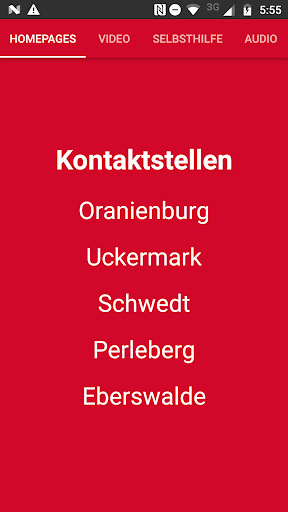  | 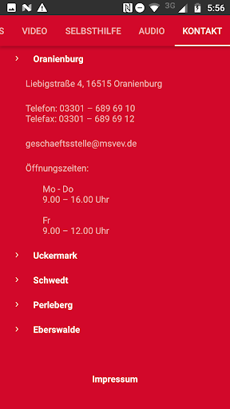 

## Development team
In the following we report the main information provided by the development team in the Google play store.

| | |
|-------------------------|-------------------------|
| **Developer**  | Media Foundation |
| **Website**  | - |
| **Email** | mgw@media-foundation.de |
| **Physical address**  | - |
| **Other developed apps**  | [https://play.google.com/store/apps/developer?id=Media+Foundation](https://play.google.com/store/apps/developer?id=Media+Foundation) |

## Android support

| | |
|-------------------------|-------------------------|
| **Declared target Android version**  | Pie, version 9 (API level 28) |
| **Effective target Android version**  | Pie, version 9 (API level 28) |
| **Minimum supported Android version**  | Lollipop, version 5.0 (API level 21) |
| **Maximum target Android version**  | - |

The larger the difference between the minimum and maximum supported Android versions, the better. A larger difference means a wider audience. For example, old phones have a very low Android version, so a high minimum supported Android version means that the app cannot be used by users with old phones, thus leading to accessibility problems. 

## Requested permissions

In the following we report the complete list of the permissions requested by the app. 

| **Permission** | **Protection level** | **Description** | 
|-------------------------|-------------------------|-------------------------|
 **android.permission ACCESS_NETWORK_STATE** | Normal | Allows applications to access information about networks. 
 **android.permission INTERNET** | Normal | Allows applications to open network sockets. 
 **android.permission WAKE_LOCK** | Normal | Allows using PowerManager WakeLocks to keep processor from sleeping or screen from dimming. 
 **com.google.android.c2dm.permission RECEIVE** | - | - 
 **com.google.android.finsky.permission BIND_GET_INSTALL_REFERRER_SERVICE** | - | - 

## Mentioned servers

| **Server** | **Registrant** | **Registrant country** | **Creation date** | 
|-------------------------|-------------------------|-------------------------|-------------------------|
 | googlesyndication.com | Google LLC | :us: US | 2003-01-21 06:17:24 |
 | google.com | Google LLC | :us: US | 1997-09-15 04:00:00 |
 | app-measurement.com | Google LLC | :us: US | 2015-06-19 20:13:31 |
 | googleadservices.com | Google LLC | :us: US | 2003-06-19 16:34:53 |

## Security analysis 

Below we report the main security warnings raised by our execution of the [Androwarn](https://github.com/maaaaz/androwarn) security analysis tool.

**Connection interfaces exfiltration**
> - This application reads details about the currently active data network 

**Suspicious connection establishment**
> - This application opens a Socket and connects it to the remote address '' on the '' port  
> - This application opens a Socket and connects it to the remote address 'Network subsystem is unavailable' on the 'N/A' port  
> - This application opens a Socket and connects it to the remote address 'timeout' on the 'N/A' port  

**Pim data leakage**
> - This application accesses data stored in the clipboard 

**Code execution**
> - This application loads a native library: 'flutter' 

## User ratings and reviews

Below we provide information about how end users are reacting to the app in terms of ratings and reviews in the Google Play store.

### Ratings

The Selbsthilfe Brandenburgs Norden app has been installed by more than **50** times. At this time, **-** rated the app and its average score is **0.0**. Below we show the distribution of the ratings across the usual star-based rating of Google Play

:star::star::star::star::star:: 0

:star::star::star::star:: 0

:star::star::star:: 0

:star::star:: 0

:star:: 0

### Reviews 

#### 5-star reviews

> Kommt Havelland auch noch?  :date: __2018-10-25 19:27:30__

#### 4-star reviews

No recent reviews available with 4 stars.

#### 3-star reviews

No recent reviews available with 3 stars.

#### 2-star reviews

No recent reviews available with 2 stars.

#### 1-star reviews

No recent reviews available with 1 stars.

# Deutsche Apotheker Zeitung
App version ``2.3``

Analyzed with [covid-apps-observer](http://github.com/covid-apps-observer) project, version ``0.1``

## App overview
| | |
|-------------------------|-------------------------| 
| **Name**&nbsp;&nbsp;&nbsp;&nbsp;&nbsp;&nbsp;&nbsp;&nbsp;&nbsp;&nbsp;&nbsp;&nbsp;&nbsp;&nbsp;&nbsp;&nbsp;&nbsp;&nbsp;&nbsp;&nbsp;&nbsp;&nbsp;&nbsp;&nbsp;&nbsp;&nbsp;&nbsp;&nbsp;&nbsp;&nbsp;&nbsp;&nbsp;&nbsp;&nbsp;&nbsp;&nbsp;&nbsp;&nbsp;&nbsp;&nbsp;  | Deutsche Apotheker Zeitung |
| **Unique identifier** | de.doctronic.mobilexaver.daz |
| **Link to Google Play** | [https://play.google.com/store/apps/details?id=de.doctronic.mobilexaver.daz](https://play.google.com/store/apps/details?id=de.doctronic.mobilexaver.daz) |
| **Summary**  | Die Deutsche Apotheker Zeitung auf Ihrem Smartphone oder Tablet |
| **Privacy policy** | [-](-) |
| **Latest version** | 2.3 |
| **Last update** | 2017-12-22 11:49:21 |
| **Recent changes** | - Kleinere Fehler wurden behoben |
| **Installs**  | 10.000+ |
| **Category** | Medizin |
| **First release** | 20.09.2012 |
| **Size**  | 21M |
| **Supported Android version**  | 4.1 oder höher |

### Description
> Die Deutsche Apotheker Zeitung auf Ihrem Smartphone oder Tablet: Verfolgen Sie die aktuellen Nachrichten aus dem Apothekenmarkt und lesen Sie jede Woche die Deutsche Apotheker Zeitung (DAZ) und die Apotheker Zeitung (AZ) bereits vor dem Erscheinen der Print-Ausgabe.
 Die App der Deutschen Apotheker Zeitung liefert ständig aktuelle Meldungen aus der Apothekenpraxis, der Gesundheitspolitik und der Pharmazie. So behalten Sie die Apothekenbranche im Blick, übersichtlich und kompakt.
 Abonnenten der Deutschen Apotheker Zeitung (DAZ) können die DAZ und die Apotheker Zeitung (AZ) ab der ersten Ausgabe des Jahres 2015 lesen. Jede Woche stehen ihnen die aktuellen Ausgaben bereits vor dem Erscheinen der Print-Ausgaben in der App zur Verfügung. In übersichtlicher und gut lesbarer Form erschließen sich Ihnen die vielfältigen Inhalte der DAZ – von neuen Arzneimitteln über Hintergründe und Kommentare zur Gesundheitspolitik bis zu Highlights wie der Serie „POP – Patienten-orientierte Pharmazie“ oder den „Pharmako-logisch“-Artikeln.
 - Aktuelle Nachrichten aus dem Apothekenmarkt, der Pharmazie und Medizin und der Gesundheitspolitik
 - Alle Artikel aus der Deutschen Apotheker Zeitung (DAZ) und der Apotheker Zeitung (AZ) – bereits vor Erscheinen der Print-Ausgaben (für Abonnenten)
 - Alle DAZ- und AZ-Ausgaben ab Nr. 1, 2015 zum Download oder online verfügbar

### User interface
The developers of the app provide the following screenshots in the Google play store.
| | | |
|:-------------------------:|:-------------------------:|:-------------------------:|
 |   | 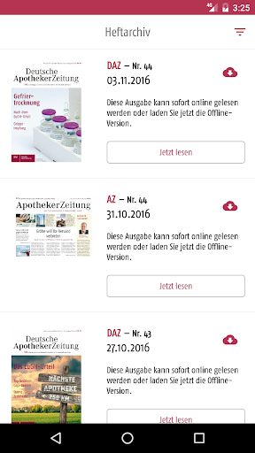  |   | 
 |   |   | 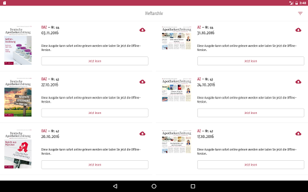  | 
 | 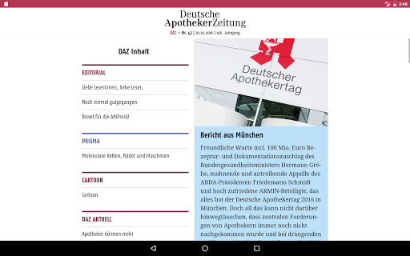  |   |   | 
 |   | 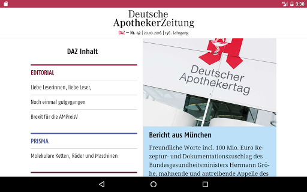  | 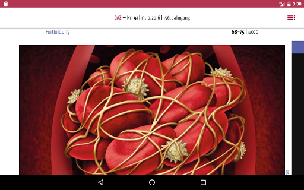  | 

## Development team
In the following we report the main information provided by the development team in the Google play store.

| | |
|-------------------------|-------------------------|
| **Developer**  | Deutscher Apotheker Verlag |
| **Website**  | [http://www.deutscher-apotheker-verlag.de/bereiche/apps.html](http://www.deutscher-apotheker-verlag.de/bereiche/apps.html) |
| **Email** | support@deutscher-apotheker-verlag.de |
| **Physical address**  | [Birkenwaldstr. 44 70191 Stuttgart](https://www.google.com/maps/search/Birkenwaldstr.%2044%2070191%20Stuttgart) (Google Maps) |
| **Other developed apps**  | [https://play.google.com/store/apps/developer?id=Deutscher+Apotheker+Verlag](https://play.google.com/store/apps/developer?id=Deutscher+Apotheker+Verlag) |

## Android support

| | |
|-------------------------|-------------------------|
| **Declared target Android version**  | Lollipop, version 5.0 (API level 21) |
| **Effective target Android version**  | Lollipop, version 5.0 (API level 21) |
| **Minimum supported Android version**  | Jelly Bean, version 4.1.x (API level 16) |
| **Maximum target Android version**  | - |

The larger the difference between the minimum and maximum supported Android versions, the better. A larger difference means a wider audience. For example, old phones have a very low Android version, so a high minimum supported Android version means that the app cannot be used by users with old phones, thus leading to accessibility problems. 

## Requested permissions

In the following we report the complete list of the permissions requested by the app. 

| **Permission** | **Protection level** | **Description** | 
|-------------------------|-------------------------|-------------------------|
 **android.permission ACCESS_NETWORK_STATE** | Normal | Allows applications to access information about networks. 
 **android.permission INTERNET** | Normal | Allows applications to open network sockets. 
 **android.permission WAKE_LOCK** | Normal | Allows using PowerManager WakeLocks to keep processor from sleeping or screen from dimming. 
 **android.permission WRITE_EXTERNAL_STORAGE** | :warning:**Dangerous** | Allows an application to write to external storage. 

## Mentioned servers

| **Server** | **Registrant** | **Registrant country** | **Creation date** | 
|-------------------------|-------------------------|-------------------------|-------------------------|
 | google-analytics.com | Google LLC | :us: US | 2005-07-18 19:24:32 |
 | googleapis.com | Google LLC | :us: US | 2005-01-25 17:52:26 |
 | google.com | Google LLC | :us: US | 1997-09-15 04:00:00 |
 | googletagmanager.com | Google LLC | :us: US | 2011-11-11 23:39:05 |
 | deutsche-apotheker-zeitung.de | - | - | - |
 | hockeyapp.net | Microsoft Corporation | :us: US | 2011-01-23 18:46:43 |

## Security analysis 

Below we report the main security warnings raised by our execution of the [Androwarn](https://github.com/maaaaz/androwarn) security analysis tool.

**Telephony identifiers leakage**
> - This application reads the device phone type value 

**Connection interfaces exfiltration**
> - This application reads details about the currently active data network 
> - This application tries to find out if the currently active data network is metered 

**Suspicious connection establishment**
> - This application opens a Socket and connects it to the remote address '10' on the 'N/A' port  
> - This application opens a Socket and connects it to the remote address '2' on the 'N/A' port  
> - This application opens a Socket and connects it to the remote address '3' on the 'N/A' port  
> - This application opens a Socket and connects it to the remote address '5' on the 'N/A' port  
> - This application opens a Socket and connects it to the remote address 'timeout' on the 'N/A' port  

**Code execution**
> - This application loads a native library: 'rdpdf' 

## User ratings and reviews

Below we provide information about how end users are reacting to the app in terms of ratings and reviews in the Google Play store.

### Ratings

The Deutsche Apotheker Zeitung app has been installed by more than **10000** times. At this time, **26** rated the app and its average score is **3.6923077**. Below we show the distribution of the ratings across the usual star-based rating of Google Play

:star::star::star::star::star:: 13

:star::star::star::star:: 4

:star::star::star:: 3

:star::star:: 0

:star:: 6

### Reviews 

#### 5-star reviews

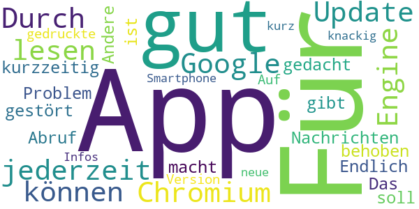

> sehr gut  :date: __2019-07-30 21:25:28__

> ....jederzeit alles lesen können...  :date: __2016-11-15 20:49:35__

> Durch ein Update der Google Chromium Engine war kurzzeitig der Abruf der Nachrichten gestört. Das Problem ist behoben.  :date: __2015-08-11 08:55:48__

> Endlich eine App!  :date: __2015-07-12 10:04:48__

> Für das was die App gedacht ist,  macht sie auch was sie soll. Für alles Andere gibt es die gedruckte Version. Auf dem Smartphone kurz und knackig neue Infos.  :date: __2013-09-16 10:03:08__

#### 4-star reviews

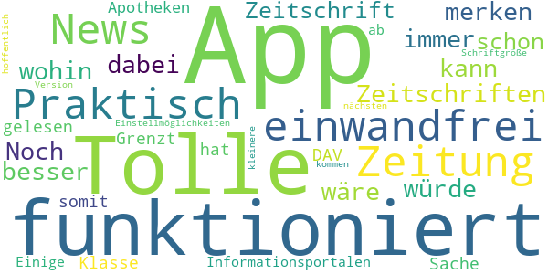

> Tolle App, funktioniert einwandfrei! Praktisch, dass man die News, Zeitung und Zeitschriften immer dabei haben kann.   Noch besser wäre, wenn sich die App merken würde, bis wohin man z.B. die Zeitschrift schon gelesen hat.  :date: __2017-09-18 11:33:27__

> Klasse Sache! Grenzt somit den DAV von anderen Apotheken-Informationsportalen ab. Einige Einstellmöglichkeiten (kleinere Schriftgröße u.a.) kommen hoffentlich mit der nächsten Version.  :date: __2012-10-12 11:04:21__

#### 3-star reviews

No recent reviews available with 3 stars.

#### 2-star reviews

No recent reviews available with 2 stars.

#### 1-star reviews

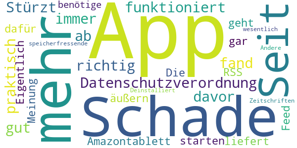

> Seit der Datenschutzverordnung funktioniert die App nicht mehr. Schade fand 
sie davor richtig gut und praktisch.  :date: __2018-05-27 23:01:14__

> Stürzt immer ab auf meinem Amazontablett  :date: __2016-06-26 22:08:04__

> Eigentlich kann ich gar keine Meinung äußern, da die app nicht zu starten geht. Schade :/  :date: __2015-07-31 15:32:12__

> Die App liefert nur einen RSS-Feed, dafür benötige ich keine speicherfressende App. Andere Zeitschriften Apps können wesentlich mehr. Deinstalliert.  :date: __2012-11-03 14:02:18__

# Simple Symptom Diary
App version ``2.0.7``

Analyzed with [covid-apps-observer](http://github.com/covid-apps-observer) project, version ``0.1``

## App overview
| | |
|-------------------------|-------------------------| 
| **Name**&nbsp;&nbsp;&nbsp;&nbsp;&nbsp;&nbsp;&nbsp;&nbsp;&nbsp;&nbsp;&nbsp;&nbsp;&nbsp;&nbsp;&nbsp;&nbsp;&nbsp;&nbsp;&nbsp;&nbsp;&nbsp;&nbsp;&nbsp;&nbsp;&nbsp;&nbsp;&nbsp;&nbsp;&nbsp;&nbsp;&nbsp;&nbsp;&nbsp;&nbsp;&nbsp;&nbsp;&nbsp;&nbsp;&nbsp;&nbsp;  | Simple Symptom Diary |
| **Unique identifier** | dk.kalorieopslag.symdir |
| **Link to Google Play** | [https://play.google.com/store/apps/details?id=dk.kalorieopslag.symdir](https://play.google.com/store/apps/details?id=dk.kalorieopslag.symdir) |
| **Summary**  | Symdir is a symptom diary to help you track and understand your symptoms. |
| **Privacy policy** | [-](-) |
| **Latest version** | 2.0.7 |
| **Last update** | 2016-01-13 11:07:04 |
| **Recent changes** | Export option added Bug fix |
| **Installs**  | 10,000+ |
| **Category** | Health & Fitness |
| **First release** | Sep 30, 2015 |
| **Size**  | 3.3M |
| **Supported Android version**  | 4.0.3 and up |

### Description
> <b>Symdir is a simple and dedicated app to help you track and understand your symptoms. </b> We make it extremely easy to record you daily symptoms and how you feel in just a few clicks. Symdir is developed in collaboration with patients, scientists and doctors.
 ★★★★★ "Remarkably easy,  and a great way to keep track of your disease symptoms"
 ★★★★★ " Intuitive, and beautiful design. So easy to understand.”
 ★★★★★ "Symdir keep me in control of my illness…"
 <b>Main features</b>
 • Track unlimited symptoms
 • Register factors that you suspect influence your symptoms
 • View your symptoms in an easy to understand graph
 • Smart analyze your data, to find out what could be the course for your symptoms
 • Export your data by email (CSV format)
 • Everything included (NO in-app purchases)
 <b>Download TODAY – get in control of you illness. </b>
 This app can be used for logging and tracking symptoms in relation to: Lupus, Migraine, Headache, Post-operation, Pain, Stroke, Diabetes, Sleep Problems, Asthma, Heart Disease, Anxiety, Depression, COPD, and more...
 Below you can find a list of common symptoms you can log:
 - Headache
 - Abdominal pain
 - Back pain
 - Fever
 - Nausea
 - Rash
 - Cough
 - Chest pain
 - Lower back pain
 - Chronic tiredness
 - Diarrhea
 - Memory problems
 - Tootache
 - Heart races
 - Fatigue
 - Depression
 - Sore throat
 - Vomiting
 - Bloating
 - Weakness
 - Dizziness
 - Heartburn
 - Sweating
 ... and many more

### User interface
The developers of the app provide the following screenshots in the Google play store.
| | | |
|:-------------------------:|:-------------------------:|:-------------------------:|
 |   |   |   | 
 |  

## Development team
In the following we report the main information provided by the development team in the Google play store.

| | |
|-------------------------|-------------------------|
| **Developer**  | SILECI Apps |
| **Website**  | [http://kalorieopslag.dk/SILECIapps/](http://kalorieopslag.dk/SILECIapps/) |
| **Email** | mail@kalorieopslag.dk |
| **Physical address**  | [O. palmes Al. 33 Denmark](https://www.google.com/maps/search/O.%20palmes%20Al.%2033%20Denmark) (Google Maps) |
| **Other developed apps**  | [https://play.google.com/store/apps/developer?id=SILECI+Apps](https://play.google.com/store/apps/developer?id=SILECI+Apps) |

## Android support

| | |
|-------------------------|-------------------------|
| **Declared target Android version**  | - |
| **Effective target Android version**  | Ice Cream Sandwich, version 4.0.3 - 4.0.4 (API level 15) |
| **Minimum supported Android version**  | Ice Cream Sandwich, version 4.0.3 - 4.0.4 (API level 15) |
| **Maximum target Android version**  | - |

The larger the difference between the minimum and maximum supported Android versions, the better. A larger difference means a wider audience. For example, old phones have a very low Android version, so a high minimum supported Android version means that the app cannot be used by users with old phones, thus leading to accessibility problems. 

## Requested permissions

In the following we report the complete list of the permissions requested by the app. 

| **Permission** | **Protection level** | **Description** | 
|-------------------------|-------------------------|-------------------------|
 **android.permission ACCESS_NETWORK_STATE** | Normal | Allows applications to access information about networks. 
 **android.permission INTERNET** | Normal | Allows applications to open network sockets. 

## Mentioned servers

| **Server** | **Registrant** | **Registrant country** | **Creation date** | 
|-------------------------|-------------------------|-------------------------|-------------------------|
 | googleapis.com | Google LLC | :us: US | 2005-01-25 17:52:26 |
 | doubleclick.net | Google Inc. | :us: US | 1996-01-16 05:00:00 |
 | google.com | Google LLC | :us: US | 1997-09-15 04:00:00 |
 | googletagmanager.com | Google LLC | :us: US | 2011-11-11 23:39:05 |
 | gstatic.com | Google LLC | :us: US | 2008-02-11 15:31:25 |
 | google-analytics.com | Google LLC | :us: US | 2005-07-18 19:24:32 |
 | admob.com | Google LLC | :us: US | 2005-12-07 02:56:54 |

## Security analysis 

Below we report the main security warnings raised by our execution of the [Androwarn](https://github.com/maaaaz/androwarn) security analysis tool.

**Telephony identifiers leakage**
> - This application reads the device phone type value 
> - This application reads the numeric name (MCC+MNC) of current registered operator 
> - This application reads the radio technology (network type) currently in use on the device for data transmission 

**Connection interfaces exfiltration**
> - This application reads details about the currently active data network 
> - This application tries to find out if the currently active data network is metered 

**Telephony services abuse**
> - This application makes phone calls 

## User ratings and reviews

Below we provide information about how end users are reacting to the app in terms of ratings and reviews in the Google Play store.

### Ratings

The Simple Symptom Diary app has been installed by more than **10000** times. At this time, **124** rated the app and its average score is **3.42**. Below we show the distribution of the ratings across the usual star-based rating of Google Play

:star::star::star::star::star:: 35

:star::star::star::star:: 30

:star::star::star:: 28

:star::star:: 15

:star:: 16

### Reviews 

#### 5-star reviews

> Excellent. Simple, customizable and for the data junky: exportable. I use it to track any environmental variable, moods, sleep, excercise, water etc and of course every outcome: vigor, acuity and the negative of course headaches, etc etc. Along with myfitnesspal it's the only health ap I need.  :date: __2020-01-09 16:12:22__

> great app, efficient and easy to use.  :date: __2019-08-10 13:17:10__

> A really useful app. It does exactly what I need it to do.  :date: __2019-05-16 08:55:16__

> Please make a paid option too so that we could hide the ads.. Ads consume a 
lot of data..  :date: __2018-05-07 10:49:06__

> Simple. Useful. You can get creative and customize it.  :date: __2017-10-07 05:40:11__

> Exactly what it says - add your symptoms and track their severity by day. Also lets you add specific notes and gives you nice charts and graphs you can export and show to your doctor. Great for people with chronic illness or pain.  :date: __2017-09-22 18:32:16__

> Great balance of customizability and ease of use.  :date: __2017-03-15 00:44:27__

> Very intuitive and easy to customize  :date: __2017-01-11 07:47:16__

> Would like to be able to edit symptom names, in case mistake was made, but otherwise it's great.  :date: __2016-06-01 01:30:27__

> Simple and easy to use!  :date: __2016-05-14 03:33:51__

#### 4-star reviews

> Good so far but I'm wary that they haven't worked on it for a couple of years!  :date: __2019-09-20 09:43:56__

> very simple and easy to use for recording symptoms. the reporting leaves something to be desired. I'd like to be able to select one symptoms and then see how all the factors compare for that one symptom instead of selecting then one at a time.  :date: __2019-07-13 06:52:26__

> Simple but effective, works well for me.  :date: __2018-06-12 23:01:20__

> Actually pretty useful. It can show correlations between factors and symptoms. It would be better if there were three measurements in a day, morning, mid, and night. Then time of day could be a factor. Can track menses but it won't do reminders like other apps.  :date: __2017-09-28 13:53:54__

> A good functional app with a nice interface. Only two things I'd like to change - a quicker way to travel to a specific day (I'm entering data from another app) and the ability to test for statistical significance when comparing a factor and symptom. (Is 3.32 vs 3.00 significant?)  :date: __2017-08-11 15:39:58__

> Love the app! Very easy, simple and useful. Would like to see a line graph over time where you could pick the symptoms and factors included so you can look for patterns yourself. I would also like it if there were an option to put the factors on a scale.  :date: __2017-03-01 00:37:54__

> Simple. I wish the export function worked or if I was smart enough to figure out how to use it.  :date: __2016-10-20 17:42:19__

> Very easy to use, easy to add symptoms and factors.  4 instead of 5 because it only logs the day, not the time.  :date: __2016-09-23 06:15:50__

> The purpose and general fulfillment of the app is good but has terrible ui errors like slow updates of the layers, dissappearing elements, overlapping text and buttons, etc. Please fix the UI as there is no other app as good as this  :date: __2016-08-04 22:57:32__

> I don't really understand what the numbers in the calculation stand for? Result: 4 or 4,5- what does it mean? Also would be better to put in symptoms not by day only but make it possible to put time, and make it possible to make a few notes during the day - because symptoms may change throughout the day, too.  How can I check my previous notes? Another idea is to be able to attach files - like pictures to be able to control the visual symptoms.And the result could be introduced in some graphics or diagrams?  :date: __2016-06-04 20:18:26__

#### 3-star reviews

> It great and simpele, but need some updating, very old and buggy interface  :date: __2019-05-11 14:59:31__

> has potential but needs work. its ui is confusing.  :date: __2019-04-14 00:50:40__

> This is just what i was looking for but you cannot edit any entries. I will 
continue to ise thos app. Please fix this. I would jave given it a higher 
rating.  :date: __2018-06-16 02:00:29__

> Basic app that does its job.  :date: __2018-03-21 01:35:52__

> I like the basic system, but it needs to support distinct symptom episodes rather than just daily summary data to be truly useful for the type of analysis it is intended to provide.  :date: __2017-12-29 23:46:46__

> This is helping a lot as I prepare for Dr visits. I'm confused about the factor buttons. Not sure if I should choose -, + or neither to add a curtain factor. I also wish that every symptom didn't show on each day. Would like to choose from list to only show ones for that day. The graph is great. I wish there was a way to see notes and factors on the graph as well. Last, I would really love if the symptoms could be added by time of day along with factors that affect one single symptom. Thank you for creating this app and I look forward to updates.  :date: __2017-11-28 17:06:41__

> Great idea but how do I chose which day? I had a fever yesterday Nov 19 but not today yet it still says fever for Nov 20? Help please!  :date: __2017-11-20 22:46:12__

> The concept of the app is good, but the execution is leaving a little to be desired. The last update was January 2016?? Did we lose the developer, or has the project just been abandoned?  It has been mentioned that when you want to add a more, you click on the symptom thinking it will assign it to that symptom (like, 'I forgot to take abcdef medication this morning.') and it just adds to the severity. The user interface could use some help.  Prepopulated symptoms from which to choose, as well as factors, would make this more seemless to work with for more people. Again, GREAT idea, but don't stop working on it! Come back and listen to the people! We are looking for an app like this, but this one needs work...  :date: __2017-10-19 13:54:37__

> Would be perfect in its Simplicity except for one glaring omission: symptoms do not always appear on the same day of the factors that caused them. For example, a food reaction can occur up to 3 days later. For this reason, the application really needs to allow someone to record a factor and then adjust it's reach into the future, for example 1 to 4 days. This would make the analysis function much more useful, because it can then look for factors that most often occur zero to four days before the symptom appears or worsens. Likewise, if a symptom that already exists gets better within the reach of a potential Factor, it would strongly indicate the factor does not contribute to that symptom.  :date: __2017-10-18 00:11:09__

> Although the app records symptoms and factors in a way that's easy to use and customise the interface is clunky. I'm also disappointed by the graphing options.  :date: __2017-05-08 00:16:02__

#### 2-star reviews

> Having tried this app out by recording last month's symptoms and calling up the chart, I couldn't export it even though I have a Google address. Then I found that one of the symptoms appeared on today's date, when I haven't had it today. There was no way I could remove this symptom from today without deleting the actual symptom from the database! Such a lovely idea for an app if it worked properly. And there are no instructions.  :date: __2020-02-04 21:25:58__

> The app ws working great for a few months. I was tracking everything in readiness for an important doctors appointment next week. Woke up this morning to find all my tracking has gone! And there is no way that I can see to bring it back! Months of tracking gone. Now this is going to make a huge impact on my upcoming appointment.  :date: __2019-12-07 09:57:01__

> I mean, the thing I want is here... it tracks whether symptoms are related to factors I set. But its just so rough I'm gonna keep looking for other apps...  :date: __2018-02-01 11:23:18__

> I like the design and how quick and easy it is to fill out but I am installing it because you can only make one entry per day and my symptoms change a lot dieing the day.  :date: __2018-01-13 07:24:23__

> Frustrated with this. Its very basic, easy to use. I just wish they took it further it has potential but doesn't do much. Can't look at factors can't undo mistakes poor instructions on how to use. Wish I could see a list of symptoms by day instead of days per symptom. I see how it could be useful for one symptom. Its also messy, symptoms and factors should be on different pages not scroll through a list. I wish they would make it better. Only good thing is how east it is to log a symptom.  :date: __2017-09-12 13:10:36__

> Why does a symptom for one day show up on every day? Think I would love this app if not for that. It's counterintuitive.  :date: __2017-08-21 04:49:06__

> It would be much better if you could add a symptom to the day before....  :date: __2017-06-27 09:23:06__

> You need to be able to track specific obs. Like how do you track a fever from 1-5?  :date: __2017-05-18 12:01:41__

> After that, it wouldn't allow me to move forward or input more information.  :date: __2016-09-26 16:37:48__

> Doesn't fit in whole screen for Android, need better explanation of how to use.  :date: __2015-12-14 00:54:25__

#### 1-star reviews

> The instructions on inputing dates not clear, I failed to go beyond that section  :date: __2020-04-26 03:29:17__

> Can't export data because I can't add an email. Can't fix this because the email address provided on Google Play Store is no longer valid. Very, very disappointed and sad. This app is incredible but without being able to export data, it's 100% useless.  :date: __2019-12-22 06:34:24__

> Used this app for many months but now it has just cleared all my data. So much for valueing your users data  :date: __2019-12-15 13:57:09__

> Won't work with newer androids.  :date: __2019-10-27 06:15:33__

> Didnt work. Very sensitive or just wudnt respond. Also so simple its pointless  :date: __2017-08-07 00:00:28__

> Needs to work on tablets or at least support landscape mode  :date: __2017-07-12 13:06:40__

> I put in the symptoms I had today and it adds them for yesterday too. I didn't have them yesterday! When I deleted them for yesterday it deleted them for today as well. Stupid app.  :date: __2017-06-02 00:29:20__

> Layout is confusing, you can't edit symptoms, there's no instructions on what buttons do. The majority of the time using this app is clicking around messing things up. There should be more options and a more appealing interface.  :date: __2016-08-26 00:11:01__

> Total waste of time  :date: __2015-11-03 11:49:03__

# alerta ETS, notificación anónima y gratuita
App version ``6.1``

Analyzed with [covid-apps-observer](http://github.com/covid-apps-observer) project, version ``0.1``

## App overview
| | |
|-------------------------|-------------------------| 
| **Name**&nbsp;&nbsp;&nbsp;&nbsp;&nbsp;&nbsp;&nbsp;&nbsp;&nbsp;&nbsp;&nbsp;&nbsp;&nbsp;&nbsp;&nbsp;&nbsp;&nbsp;&nbsp;&nbsp;&nbsp;&nbsp;&nbsp;&nbsp;&nbsp;&nbsp;&nbsp;&nbsp;&nbsp;&nbsp;&nbsp;&nbsp;&nbsp;&nbsp;&nbsp;&nbsp;&nbsp;&nbsp;&nbsp;&nbsp;&nbsp;  | alerta ETS, notificación anónima y gratuita |
| **Unique identifier** | es.youaremarketing.alertaETS |
| **Link to Google Play** | [https://play.google.com/store/apps/details?id=es.youaremarketing.alertaETS](https://play.google.com/store/apps/details?id=es.youaremarketing.alertaETS) |
| **Summary**  | Notifica que te han detectado una Enfermedad/Infección de Transmisión Sexual |
| **Privacy policy** | [https://muyalerta.com/aviso-legal/index.php](https://muyalerta.com/aviso-legal/index.php) |
| **Latest version** | 6.1 |
| **Last update** | 2020-05-12 18:59:39 |
| **Recent changes** | Se han añadido mejoras en la seguridad. ¿Tienes cualquier duda o sugerencia? Escríbenos a: soporte@muyalerta.com |
| **Installs**  | 1.000+ |
| **Category** | Salud y bienestar |
| **First release** | 23 oct. 2017 |
| **Size**  | 2,0M |
| **Supported Android version**  | 4.1 y versiones posteriores |

### Description
> ¿Te han detectado una Enfermedad o Infección de Transmisión Sexual (ETS/ITS)? alertaETS, notifica de forma anónima y gratis a tus ex parejas sexuales con esta app. Evita pasar el mal trago de decir que te han detectado una E.T.S. (Enfermedad de Transmisión Sexual) o I.T.S. (Infección de Transmisión Sexual), también llamadas enfermedades venéreas, con esta App. No somos la mejor opción, pero es una opción mucho mejor que no notificar.
 Notifica de forma fácil, rápida y anónima introduciendo el email o teléfono de tus ex parejas sexuales. Recibirá un email/SMS de nuestra app para que se realice una analítica por su salud:
 NOTIFICACIÓN IMPORTANTE: Hola, este mensaje es meramente informativo: una pareja reciente le han detectado una ETS. + info: muyalerta.com/ets

### User interface
The developers of the app provide the following screenshots in the Google play store.
| | | |
|:-------------------------:|:-------------------------:|:-------------------------:|
 |   |   |   | 
 |   |   |   | 
 |   |   |   | 
 |   |  

## Development team
In the following we report the main information provided by the development team in the Google play store.

| | |
|-------------------------|-------------------------|
| **Developer**  | Hola Soluciones |
| **Website**  | [https://muyalerta.com/ets/index.php](https://muyalerta.com/ets/index.php) |
| **Email** | soporte@muyalerta.com |
| **Physical address**  | [c/ Calzada Lateral del norte, 22. 35014 Las Palmas de Gran Canaria.](https://www.google.com/maps/search/c/%20Calzada%20Lateral%20del%20norte,%2022.%2035014%20Las%20Palmas%20de%20Gran%20Canaria.) (Google Maps) |
| **Other developed apps**  | [https://play.google.com/store/apps/developer?id=4718980408761560186](https://play.google.com/store/apps/developer?id=4718980408761560186) |

## Android support

| | |
|-------------------------|-------------------------|
| **Declared target Android version**  | Pie, version 9 (API level 28) |
| **Effective target Android version**  | Pie, version 9 (API level 28) |
| **Minimum supported Android version**  | Jelly Bean, version 4.1.x (API level 16) |
| **Maximum target Android version**  | - |

The larger the difference between the minimum and maximum supported Android versions, the better. A larger difference means a wider audience. For example, old phones have a very low Android version, so a high minimum supported Android version means that the app cannot be used by users with old phones, thus leading to accessibility problems. 

## Requested permissions

In the following we report the complete list of the permissions requested by the app. 

| **Permission** | **Protection level** | **Description** | 
|-------------------------|-------------------------|-------------------------|
 **android.permission ACCESS_NETWORK_STATE** | Normal | Allows applications to access information about networks. 
 **android.permission GET_ACCOUNTS** | :warning:**Dangerous** | Allows access to the list of accounts in the Accounts Service. 
 **android.permission INTERNET** | Normal | Allows applications to open network sockets. 
 **android.permission READ_CONTACTS** | :warning:**Dangerous** | Allows an application to read the user's contacts data. 
 **android.permission WAKE_LOCK** | Normal | Allows using PowerManager WakeLocks to keep processor from sleeping or screen from dimming. 
 **android.permission WRITE_CONTACTS** | :warning:**Dangerous** | Allows an application to write the user's contacts data. 
 **com.anddoes.launcher.permission UPDATE_COUNT** | - | - 
 **com.google.android.c2dm.permission RECEIVE** | - | - 
 **com.htc.launcher.permission READ_SETTINGS** | - | - 
 **com.htc.launcher.permission UPDATE_SHORTCUT** | - | - 
 **com.majeur.launcher.permission UPDATE_BADGE** | - | - 
 **com.sec.android.provider.badge.permission READ** | - | - 
 **com.sec.android.provider.badge.permission WRITE** | - | - 
 **com.sonyericsson.home.permission BROADCAST_BADGE** | - | - 
 **es.youaremarketing.alertaETS.permission C2D_MESSAGE** | - | - 

## Mentioned servers

| **Server** | **Registrant** | **Registrant country** | **Creation date** | 
|-------------------------|-------------------------|-------------------------|-------------------------|
 | googlesyndication.com | Google LLC | :us: US | 2003-01-21 06:17:24 |
 | google.com | Google LLC | :us: US | 1997-09-15 04:00:00 |
 | googleapis.com | Google LLC | :us: US | 2005-01-25 17:52:26 |
 | app-measurement.com | Google LLC | :us: US | 2015-06-19 20:13:31 |
 | doubleclick.net | Google Inc. | :us: US | 1996-01-16 05:00:00 |
 | gstatic.com | Google LLC | :us: US | 2008-02-11 15:31:25 |
 | rjfun.com | Domains By Proxy, LLC | :us: US | 2013-08-17 21:03:34 |
 | googleapis.com | Google LLC | :us: US | 2005-01-25 17:52:26 |

## Security analysis 

Below we report the main security warnings raised by our execution of the [Androwarn](https://github.com/maaaaz/androwarn) security analysis tool.

**Telephony identifiers leakage**
> - This application reads the device phone type value 
> - This application reads the numeric name (MCC+MNC) of current registered operator 
> - This application reads the radio technology (network type) currently in use on the device for data transmission 

**Connection interfaces exfiltration**
> - This application reads details about the currently active data network 
> - This application tries to find out if the currently active data network is metered 

**Telephony services abuse**
> - This application makes phone calls 

## User ratings and reviews

Below we provide information about how end users are reacting to the app in terms of ratings and reviews in the Google Play store.

### Ratings

The alerta ETS, notificación anónima y gratuita app has been installed by more than **1000** times. At this time, **8** rated the app and its average score is **3.5**. Below we show the distribution of the ratings across the usual star-based rating of Google Play

:star::star::star::star::star:: 5

:star::star::star::star:: 0

:star::star::star:: 0

:star::star:: 0

:star:: 3

### Reviews 

#### 5-star reviews

> Genial  :date: __2020-08-15 15:28:01__

> Gran servicio de salud pública. P.D.: chicXs! Habéis pensado en utilizar la plataforma WhatsApp para notificar y así no tener limitaciones en la gratuidad?  :date: __2020-05-29 17:15:44__

> Muy buena iniciativa. Permite notificar de forma anónima a tus parejas sexuales y así controlar la difusión de las ETS.  :date: __2019-11-01 17:02:02__

> Muy util  :date: __2018-09-29 00:12:05__

#### 4-star reviews

No recent reviews available with 4 stars.

#### 3-star reviews

No recent reviews available with 3 stars.

#### 2-star reviews

No recent reviews available with 2 stars.

#### 1-star reviews

> No funciona vaya estafa ahora como aviso que pena  :date: __2018-06-15 13:13:19__

# Agenda Mobile
App version ``1.0.0``

Analyzed with [covid-apps-observer](http://github.com/covid-apps-observer) project, version ``0.1``

## App overview
| | |
|-------------------------|-------------------------| 
| **Name**&nbsp;&nbsp;&nbsp;&nbsp;&nbsp;&nbsp;&nbsp;&nbsp;&nbsp;&nbsp;&nbsp;&nbsp;&nbsp;&nbsp;&nbsp;&nbsp;&nbsp;&nbsp;&nbsp;&nbsp;&nbsp;&nbsp;&nbsp;&nbsp;&nbsp;&nbsp;&nbsp;&nbsp;&nbsp;&nbsp;&nbsp;&nbsp;&nbsp;&nbsp;&nbsp;&nbsp;&nbsp;&nbsp;&nbsp;&nbsp;  | Agenda Mobile |
| **Unique identifier** | es.infomed.agendamobile |
| **Link to Google Play** | [https://play.google.com/store/apps/details?id=es.infomed.agendamobile](https://play.google.com/store/apps/details?id=es.infomed.agendamobile) |
| **Summary**  | Consulte la agenda de Gesden desde cualquier dispositivo ( Smartphone,tablet.. ) |
| **Privacy policy** | [http://grupoinfomed.es/condiciones-de-venta.html](http://grupoinfomed.es/condiciones-de-venta.html) |
| **Latest version** | 1.0.0 |
| **Last update** | 2015-12-18 13:00:20 |
| **Recent changes** | - |
| **Installs**  | 1.000+ |
| **Category** | Medicina |
| **First release** | 18 dic. 2015 |
| **Size**  | 1.001k |
| **Supported Android version**  | 4.1 y versiones posteriores |

### Description
> La Agenda Mobile es una App que permite a los profesionales de la clínica consultar la Agenda de Gesden desde cualquier dispositivo móvil, tableta o Smartphone, con conexión a internet.

### User interface
The developers of the app provide the following screenshots in the Google play store.
| | | |
|:-------------------------:|:-------------------------:|:-------------------------:|
 |   |   |   | 
 |   |  

## Development team
In the following we report the main information provided by the development team in the Google play store.

| | |
|-------------------------|-------------------------|
| **Developer**  | INFOMED |
| **Website**  | [http://www.grupoinfomed.es](http://www.grupoinfomed.es) |
| **Email** | infomed@grupoinfomed.es |
| **Physical address**  | - |
| **Other developed apps**  | [https://play.google.com/store/apps/developer?id=INFOMED](https://play.google.com/store/apps/developer?id=INFOMED) |

## Android support

| | |
|-------------------------|-------------------------|
| **Declared target Android version**  | Lollipop, version 5.1 (API level 22) |
| **Effective target Android version**  | Lollipop, version 5.1 (API level 22) |
| **Minimum supported Android version**  | Jelly Bean, version 4.1.x (API level 16) |
| **Maximum target Android version**  | - |

The larger the difference between the minimum and maximum supported Android versions, the better. A larger difference means a wider audience. For example, old phones have a very low Android version, so a high minimum supported Android version means that the app cannot be used by users with old phones, thus leading to accessibility problems. 

## Requested permissions

In the following we report the complete list of the permissions requested by the app. 

| **Permission** | **Protection level** | **Description** | 
|-------------------------|-------------------------|-------------------------|
 **android.permission ACCESS_NETWORK_STATE** | Normal | Allows applications to access information about networks. 
 **android.permission ACCESS_WIFI_STATE** | Normal | Allows applications to access information about Wi-Fi networks. 
 **android.permission INTERNET** | Normal | Allows applications to open network sockets. 

## Mentioned servers

| **Server** | **Registrant** | **Registrant country** | **Creation date** | 
|-------------------------|-------------------------|-------------------------|-------------------------|
 | gstatic.com | Google LLC | :us: US | 2008-02-11 15:31:25 |

## Security analysis 

Below we report the main security warnings raised by our execution of the [Androwarn](https://github.com/maaaaz/androwarn) security analysis tool.

**Connection interfaces exfiltration**
> - This application reads details about the currently active data network 
> - This application tries to find out if the currently active data network is metered 

**Telephony services abuse**
> - This application makes phone calls 

## User ratings and reviews

Below we provide information about how end users are reacting to the app in terms of ratings and reviews in the Google Play store.

### Ratings

The Agenda Mobile app has been installed by more than **1000** times. At this time, **18** rated the app and its average score is **1.5**. Below we show the distribution of the ratings across the usual star-based rating of Google Play

:star::star::star::star::star:: 2

:star::star::star::star:: 0

:star::star::star:: 0

:star::star:: 1

:star:: 15

### Reviews 

#### 5-star reviews

> Perfecta para consultar las citas de la agenda Gesden  :date: __2017-03-29 11:25:17__

> Me va perfecto para organizar mis citas  :date: __2016-02-04 12:37:41__

#### 4-star reviews

No recent reviews available with 4 stars.

#### 3-star reviews

No recent reviews available with 3 stars.

#### 2-star reviews

No recent reviews available with 2 stars.

#### 1-star reviews

> Error de entrada a la app  :date: __2019-04-01 09:28:25__

> falla con mucha frecuencia  :date: __2019-02-15 18:29:09__

> No funciona casi nunca. No sirve para nada  :date: __2018-11-29 09:54:01__

> No importa que tengas diferentes usuarios, todos pueden ver lo de todos. No tienes una visión general de mes o de semana, todo es diario. Nada intuitiva. Es una lástima que te veas obligado a usarla por el programa de gestión de la clínica. Pésimo servicio de atención al cliente. No la recomiendo  :date: __2018-11-12 18:16:59__

> Error siempre al entrar. Dicen que es por los puertos del router pero nada. 
Para que hacen una aplicación en la que tengo que tocar el router. Mala no, 
lo siguiente  :date: __2018-04-26 14:25:58__

> Errores constantes que obligan a reidentificarse. Las citas reprogramadas y anuladas se repiten induciendo a errores. Muy mala, sin actualizar desde la primera versión en 2015  :date: __2018-03-30 12:28:15__

> lo mismo q para todos es inservible  :date: __2018-02-27 21:42:11__

> Una App q solo ocupa espacio en tu móvil, porque es totalmente inútil  :date: __2018-02-06 19:40:02__

> Da error constantemente para acceder y una vez que tienes suerte de entrar, en dos pasos se va otra vez.  :date: __2017-12-13 11:13:59__

> Da error muy a menudo y no se pueden modificar las citas o bloquear horas. No puedo corregir tiempos de trabajo o bloquear cuando no puedo ir o aumentar horas de trabajo. No me sirve para controlar o corregir errores.  :date: __2017-09-08 00:49:02__

# COLONCOP
App version ``1.0.1``

Analyzed with [covid-apps-observer](http://github.com/covid-apps-observer) project, version ``0.1``

## App overview
| | |
|-------------------------|-------------------------| 
| **Name**&nbsp;&nbsp;&nbsp;&nbsp;&nbsp;&nbsp;&nbsp;&nbsp;&nbsp;&nbsp;&nbsp;&nbsp;&nbsp;&nbsp;&nbsp;&nbsp;&nbsp;&nbsp;&nbsp;&nbsp;&nbsp;&nbsp;&nbsp;&nbsp;&nbsp;&nbsp;&nbsp;&nbsp;&nbsp;&nbsp;&nbsp;&nbsp;&nbsp;&nbsp;&nbsp;&nbsp;&nbsp;&nbsp;&nbsp;&nbsp;  | COLONCOP |
| **Unique identifier** | com.imaidea.norgine.coloncop |
| **Link to Google Play** | [https://play.google.com/store/apps/details?id=com.imaidea.norgine.coloncop](https://play.google.com/store/apps/details?id=com.imaidea.norgine.coloncop) |
| **Summary**  | Cálculo colonoscopia vigilancia post-polipectomía |
| **Privacy policy** | [http://www.coloncop.com/politica_es.html](http://www.coloncop.com/politica_es.html) |
| **Latest version** | 1.0.1 |
| **Last update** | 2018-11-07 11:05:20 |
| **Recent changes** | V.1.0.1. Se ha mejorado el resultado de algunos cálculos. ● Guía de la Asociación Española de Gastroenterología (AEG), Sociedad Española de Medicina de Familia y Comunitaria (SEMFYC) y Centro Cochrane Iberoamericano (CCIb); 2.009 ● Guía Europea para asegurar la calidad en la detección y el diagnóstico del cáncer colorrectal (IARC, International Agency for Research on Cancer); 2.012. ● Guía de la Sociedad Catalana de Digestología (SCD); 2.016. Aval científico de AEG, SEED y SCD. |
| **Installs**  | 1.000+ |
| **Category** | Medicina |
| **First release** | 24 jul. 2018 |
| **Size**  | 2,8M |
| **Supported Android version**  | 8.0 y versiones posteriores |

### Description
> La aplicación COLONCOP es una herramienta de ayuda a los profesionales que tiene como objetivo facilitar la correcta recomendación sobre la prevención y vigilancia de lesiones neoplásicas del colon en base a criterios de riesgo y lesiones detectadas en la colonoscopia índice. Así como la recomendación de vigilancia según los antecedentes personales y familiares de cáncer colorrectal.
 Esta es una aplicación que se ha desarrollado dentro del Plan Estratégico sobre el manejo de las neoplasias colorrectales de la Sociedad Catalana de Digestología y con el soporte del Dr. Antonio José Hervás Molina, miembro de la Asociación Española de Gastroenterología, con el objetivo final de facilitar a los clínicos la correcta recomendación de los intervalos entre las colonoscopias de vigilancia.
 La aplicación permite seleccionar entre tres guías de práctica clínica: 
 ● Guía de la Asociación Española de Gastroenterología (AEG), Sociedad Española de Medicina de Familia y Comunitaria (SEMFYC) y Centro Cochrane Iberoamericano (CCIb); 2.009
 ● Guía Europea para asegurar la calidad en la detección y el diagnóstico del cáncer colorrectal (IARC, International Agency for Research on Cancer); 2.012.
 ● Guía de la Sociedad Catalana de Digestología (SCD); 2.016.
 La aplicación COLONCOP cuenta con el aval científico de las sociedades: AEG, SEED y SCD.

### User interface
The developers of the app provide the following screenshots in the Google play store.
| | | |
|:-------------------------:|:-------------------------:|:-------------------------:|
 |   | 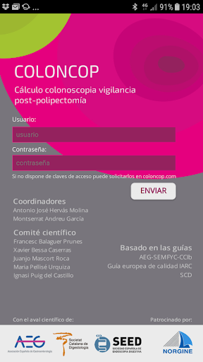  | 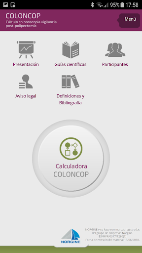  | 
 | 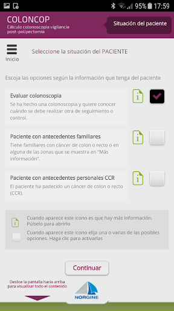  | 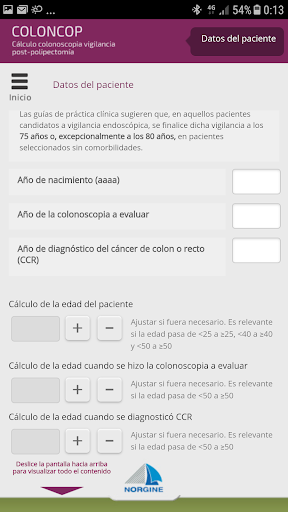  |   | 
 | 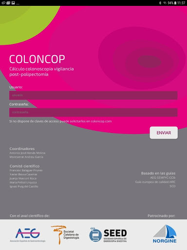  | 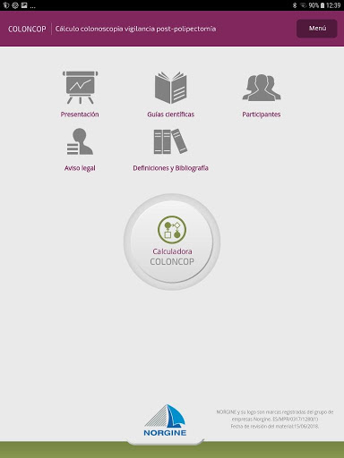  |   | 
 |   |   |   | 
 |   |   | 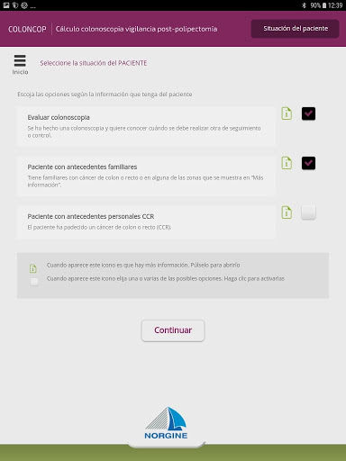  | 
 | 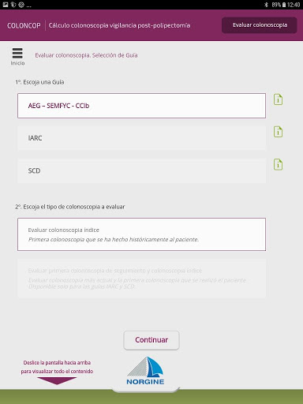  | 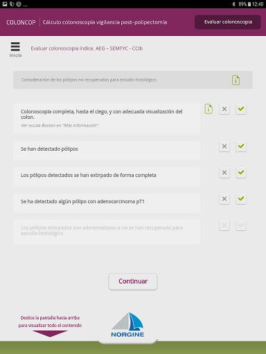 

## Development team
In the following we report the main information provided by the development team in the Google play store.

| | |
|-------------------------|-------------------------|
| **Developer**  | Imaidea Interactiva |
| **Website**  | [http://www.coloncop.com](http://www.coloncop.com) |
| **Email** | developer@imaidea.com |
| **Physical address**  | - |
| **Other developed apps**  | [https://play.google.com/store/apps/developer?id=Imaidea+Interactiva](https://play.google.com/store/apps/developer?id=Imaidea+Interactiva) |

## Android support

| | |
|-------------------------|-------------------------|
| **Declared target Android version**  | - |
| **Effective target Android version**  | Oreo, version 8.0.0 (API level 26) |
| **Minimum supported Android version**  | Oreo, version 8.0.0 (API level 26) |
| **Maximum target Android version**  | - |

The larger the difference between the minimum and maximum supported Android versions, the better. A larger difference means a wider audience. For example, old phones have a very low Android version, so a high minimum supported Android version means that the app cannot be used by users with old phones, thus leading to accessibility problems. 

## Requested permissions

In the following we report the complete list of the permissions requested by the app. 

| **Permission** | **Protection level** | **Description** | 
|-------------------------|-------------------------|-------------------------|
 **android.permission ACCESS_NETWORK_STATE** | Normal | Allows applications to access information about networks. 
 **android.permission INTERNET** | Normal | Allows applications to open network sockets. 

## Mentioned servers

| **Server** | **Registrant** | **Registrant country** | **Creation date** | 
|-------------------------|-------------------------|-------------------------|-------------------------|
 | gstatic.com | Google LLC | :us: US | 2008-02-11 15:31:25 |

## Security analysis 

Below we report the main security warnings raised by our execution of the [Androwarn](https://github.com/maaaaz/androwarn) security analysis tool.

**Telephony services abuse**
> - This application makes phone calls 

## User ratings and reviews

Below we provide information about how end users are reacting to the app in terms of ratings and reviews in the Google Play store.

### Ratings

The COLONCOP app has been installed by more than **1000** times. At this time, **-** rated the app and its average score is **0.0**. Below we show the distribution of the ratings across the usual star-based rating of Google Play

:star::star::star::star::star:: 0

:star::star::star::star:: 0

:star::star::star:: 0

:star::star:: 0

:star:: 0

### Reviews 

#### 5-star reviews

No recent reviews available with 5 stars.

#### 4-star reviews

No recent reviews available with 4 stars.

#### 3-star reviews

No recent reviews available with 3 stars.

#### 2-star reviews

No recent reviews available with 2 stars.

#### 1-star reviews

No recent reviews available with 1 stars.

# NAOS Game
App version ``2.0.8``

Analyzed with [covid-apps-observer](http://github.com/covid-apps-observer) project, version ``0.1``

## App overview
| | |
|-------------------------|-------------------------| 
| **Name**&nbsp;&nbsp;&nbsp;&nbsp;&nbsp;&nbsp;&nbsp;&nbsp;&nbsp;&nbsp;&nbsp;&nbsp;&nbsp;&nbsp;&nbsp;&nbsp;&nbsp;&nbsp;&nbsp;&nbsp;&nbsp;&nbsp;&nbsp;&nbsp;&nbsp;&nbsp;&nbsp;&nbsp;&nbsp;&nbsp;&nbsp;&nbsp;&nbsp;&nbsp;&nbsp;&nbsp;&nbsp;&nbsp;&nbsp;&nbsp;  | NAOS Game |
| **Unique identifier** | es.bioderma.biodermagame |
| **Link to Google Play** | [https://play.google.com/store/apps/details?id=es.bioderma.biodermagame](https://play.google.com/store/apps/details?id=es.bioderma.biodermagame) |
| **Summary**  | ¡Aprende y gana premios! |
| **Privacy policy** | [https://www.bioderma.es/politica-de-privacidad](https://www.bioderma.es/politica-de-privacidad) |
| **Latest version** | 2.0.8 |
| **Last update** | 2020-10-02 12:55:41 |
| **Recent changes** | - |
| **Installs**  | 1.000+ |
| **Category** | Salud y bienestar |
| **First release** | 28 feb. 2018 |
| **Size**  | 26M |
| **Supported Android version**  | 5.0 y versiones posteriores |

### Description
> ¡NOVEDAD: NAOS GAME!
 ¡Aprende ganando!
 La formación es la clave para el consejo farmacéutico diferencial, por ello hemos desarrollado esta app exclusiva para ti.
 Conviértete en un experto de Bioderma e Institut Esthederm a través de la realización de NAOS Quizes y la participación en Retos de ventas y visibilidad.
 Cuántos más NAOS Points (puntos de formación) consigas, más posibilidades tendrás de llegar a la final de NAOS Game. ¡Recuerda que un viaje a Los Alpes está en juego!
 Además, gana premios cada mes para canjear por productos de nuestra tienda Online de NAOS Game. ¡Mímate mucho y luce una piel radiante!
 Empieza ahora a jugar siguiendo estos paso: 
 Proceso de registro: datos personales y código de punto de venta (éste último lo puedes consultar a tu delegado)
 Validación del mail de confirmación (Te llegará un mail al correo que hayas usado en la inscripción)
 ¡A jugar!
 Naos Game te sorprenderá con muchas novedades:
 - DermoChat: consulta tus dudas directamente con nuestras formadoras especialistas
 - Descubre la plataforma NAOS Online para dinamizar Bioderma e Institut Esthederm en tu farmacia o centro de estética
 - Consulta el Ranking de tu zona y el Ranking dentro de tu punto de venta
 - Consulta el estado de los premios escogidos en la tienda online
 - Descubre noticias de NAOS a través de notificaciones, ¡estarás a la última!

### User interface
The developers of the app provide the following screenshots in the Google play store.
| | | |
|:-------------------------:|:-------------------------:|:-------------------------:|
 |   |   |   | 
 |  

## Development team
In the following we report the main information provided by the development team in the Google play store.

| | |
|-------------------------|-------------------------|
| **Developer**  | Laboratorios BIODERMA |
| **Website**  | [https://www.naosonline.es](https://www.naosonline.es) |
| **Email** | biodermagame@bioderma.es |
| **Physical address**  | - |
| **Other developed apps**  | [https://play.google.com/store/apps/developer?id=Laboratorios+BIODERMA](https://play.google.com/store/apps/developer?id=Laboratorios+BIODERMA) |

## Android support

| | |
|-------------------------|-------------------------|
| **Declared target Android version**  | Android10, version 10 (API level 29) |
| **Effective target Android version**  | Android10, version 10 (API level 29) |
| **Minimum supported Android version**  | Lollipop, version 5.0 (API level 21) |
| **Maximum target Android version**  | - |

The larger the difference between the minimum and maximum supported Android versions, the better. A larger difference means a wider audience. For example, old phones have a very low Android version, so a high minimum supported Android version means that the app cannot be used by users with old phones, thus leading to accessibility problems. 

## Requested permissions

In the following we report the complete list of the permissions requested by the app. 

| **Permission** | **Protection level** | **Description** | 
|-------------------------|-------------------------|-------------------------|
 **android.permission ACCESS_NETWORK_STATE** | Normal | Allows applications to access information about networks. 
 **android.permission CAMERA** | :warning:**Dangerous** | Required to be able to access the camera device. 
 **android.permission INTERNET** | Normal | Allows applications to open network sockets. 
 **android.permission READ_EXTERNAL_STORAGE** | :warning:**Dangerous** | Allows an application to read from external storage. 
 **android.permission WAKE_LOCK** | Normal | Allows using PowerManager WakeLocks to keep processor from sleeping or screen from dimming. 
 **android.permission WRITE_EXTERNAL_STORAGE** | :warning:**Dangerous** | Allows an application to write to external storage. 
 **com.google.android.c2dm.permission RECEIVE** | - | - 
 **com.google.android.finsky.permission BIND_GET_INSTALL_REFERRER_SERVICE** | - | - 

## Mentioned servers

| **Server** | **Registrant** | **Registrant country** | **Creation date** | 
|-------------------------|-------------------------|-------------------------|-------------------------|
 | crashlytics.com | Google LLC | :us: US | 2011-01-21 15:30:40 |
 | googlesyndication.com | Google LLC | :us: US | 2003-01-21 06:17:24 |
 | google.com | Google LLC | :us: US | 1997-09-15 04:00:00 |
 | app-measurement.com | Google LLC | :us: US | 2015-06-19 20:13:31 |
 | googleadservices.com | Google LLC | :us: US | 2003-06-19 16:34:53 |

## Security analysis 

Below we report the main security warnings raised by our execution of the [Androwarn](https://github.com/maaaaz/androwarn) security analysis tool.

**Connection interfaces exfiltration**
> - This application reads details about the currently active data network 

**Pim data leakage**
> - This application accesses the downloads folder 
> - This application accesses data stored in the clipboard 

**Code execution**
> - This application loads a native library 
> - This application loads a native library: 'crashlytics' 
> - This application loads a native library: 'flutter' 

## User ratings and reviews

Below we provide information about how end users are reacting to the app in terms of ratings and reviews in the Google Play store.

### Ratings

The NAOS Game app has been installed by more than **1000** times. At this time, **72** rated the app and its average score is **3.9583333**. Below we show the distribution of the ratings across the usual star-based rating of Google Play

:star::star::star::star::star:: 43

:star::star::star::star:: 9

:star::star::star:: 6

:star::star:: 2

:star:: 12

### Reviews 

#### 5-star reviews

> Genial  :date: __2020-01-24 15:22:11__

> Ha ido genial hasta que la actualice hace tres días, se ha quedado con el mensaje actualizar y no puedo entrar  :date: __2019-10-29 21:56:39__

> Muy buena  :date: __2019-10-28 15:36:19__

> Me encanta  :date: __2019-10-28 12:42:59__

> Genial  :date: __2019-10-26 21:02:54__

#### 4-star reviews

> Genial  :date: __2020-01-24 15:41:22__

> Buena  :date: __2019-10-26 15:59:56__

#### 3-star reviews

> Muy buena, hasta que se atasca  :date: __2020-01-24 18:19:19__

> No se puede actualizar  :date: __2019-10-29 23:33:18__

#### 2-star reviews

> Me pasa lo mismo q en varios comentarios que he leído. Entro en la app, sale el mensaje de que hay una actualización, redirige a google play y no da ninguna opcion de actualizar, solo desinstalar o abrir...  :date: __2019-10-29 21:56:15__

> Falla todo el rato y no deja crear una cuenta...-.-  :date: __2018-04-30 19:01:20__

#### 1-star reviews

> Tengo problemas para acceder a la aplicación. Se queda bloqueada.  :date: __2020-01-19 22:39:55__

> cuando menos te lo esperas deja de funcionar  :date: __2020-01-19 01:41:44__

> No se puede actualizar  :date: __2019-10-29 17:51:54__

> No me va bien, me dice que actualice y no me deja  :date: __2019-10-29 11:14:59__

> No hay manera de actualizar, queda bloqueado  :date: __2019-10-28 11:22:34__

> Con la última actualización no me deja entrar. Me pone nueva actualización disponible pero yaaaa lo tengo actualizadooooooo  :date: __2019-10-28 11:17:12__

> No se puede actualizar la aplicación.La he desinstalado varias veces y vuelve a dar el error cuando intentas actualizar  :date: __2019-10-28 00:01:07__

> Imposible actualizar la app, desinstalas la aplicacion, la instalas y vuelve el mensaje de actulizar la app.  :date: __2019-10-27 19:02:07__

> Desde que actualicé ayer la App no me deja acceder, me sale un aviso de que hay una actualización nueva y si intento volver a actualizar me lleva a esta página directamente.  :date: __2019-10-27 18:26:22__

> No hay manera de actualizar. Queda bloqueado.  :date: __2019-10-26 21:25:18__

# (silencio) barcelona
App version ``4.2.9``

Analyzed with [covid-apps-observer](http://github.com/covid-apps-observer) project, version ``0.1``

## App overview
| | |
|-------------------------|-------------------------| 
| **Name**&nbsp;&nbsp;&nbsp;&nbsp;&nbsp;&nbsp;&nbsp;&nbsp;&nbsp;&nbsp;&nbsp;&nbsp;&nbsp;&nbsp;&nbsp;&nbsp;&nbsp;&nbsp;&nbsp;&nbsp;&nbsp;&nbsp;&nbsp;&nbsp;&nbsp;&nbsp;&nbsp;&nbsp;&nbsp;&nbsp;&nbsp;&nbsp;&nbsp;&nbsp;&nbsp;&nbsp;&nbsp;&nbsp;&nbsp;&nbsp;  | (silencio) barcelona |
| **Unique identifier** | com.fitnessmobileapps.silenciobarcelona |
| **Link to Google Play** | [https://play.google.com/store/apps/details?id=com.fitnessmobileapps.silenciobarcelona](https://play.google.com/store/apps/details?id=com.fitnessmobileapps.silenciobarcelona) |
| **Summary**  | Planificar y programar sus clases con nosotros desde su dispositivo móvil. |
| **Privacy policy** | [https://www.mindbodyonline.com/privacy-policy](https://www.mindbodyonline.com/privacy-policy) |
| **Latest version** | 4.2.9 |
| **Last update** | 2019-12-12 18:20:32 |
| **Recent changes** | - |
| **Installs**  | 100+ |
| **Category** | Salud y bienestar |
| **First release** | 1 may. 2017 |
| **Size**  | 7,3M |
| **Supported Android version**  | 4.1 y versiones posteriores |

### Description
> Bienvenido a (silencio) barcelona ®, que te ofrece un paréntesis en tu día a día para conectar contigo mismo bajo el método (silencio) ® de escucha, orientación y acompañamiento de expertos, para alcanzar el equilibrio físico, mental, emocional y espiritual, y ser la mejor versión de ti mismo. 
 Descargando la app, podrás planificar y gestionar tus visitas (consultar nuestra agenda de clases y eventos y pedir una cita, mirar los precios de las terapias y comprarlas online) además de recibir promociones exclusivas o encontrar información de contacto. 
 Visita también nuestra página en Facebook, Instagram y web www.silenciobarcelona.com

### User interface
The developers of the app provide the following screenshots in the Google play store.
| | | |
|:-------------------------:|:-------------------------:|:-------------------------:|
 |   |   |   | 

## Development team
In the following we report the main information provided by the development team in the Google play store.

| | |
|-------------------------|-------------------------|
| **Developer**  | MINDBODY Branded Apps |
| **Website**  | [https://www.mindbodyonline.com/branded-apps](https://www.mindbodyonline.com/branded-apps) |
| **Email** | support@mindbodyonline.com |
| **Physical address**  | [MINDBODY, Inc. 4051 Broad Street, Suite 220 San Luis Obispo, California 93401](https://www.google.com/maps/search/MINDBODY,%20Inc.%204051%20Broad%20Street,%20Suite%20220%20San%20Luis%20Obispo,%20California%2093401) (Google Maps) |
| **Other developed apps**  | [https://play.google.com/store/apps/developer?id=MINDBODY+Branded+Apps](https://play.google.com/store/apps/developer?id=MINDBODY+Branded+Apps) |

## Android support

| | |
|-------------------------|-------------------------|
| **Declared target Android version**  | Pie, version 9 (API level 28) |
| **Effective target Android version**  | Pie, version 9 (API level 28) |
| **Minimum supported Android version**  | Jelly Bean, version 4.1.x (API level 16) |
| **Maximum target Android version**  | - |

The larger the difference between the minimum and maximum supported Android versions, the better. A larger difference means a wider audience. For example, old phones have a very low Android version, so a high minimum supported Android version means that the app cannot be used by users with old phones, thus leading to accessibility problems. 

## Requested permissions

In the following we report the complete list of the permissions requested by the app. 

| **Permission** | **Protection level** | **Description** | 
|-------------------------|-------------------------|-------------------------|
 **android.permission ACCESS_FINE_LOCATION** | :warning:**Dangerous** | Allows an app to access precise location. 
 **android.permission ACCESS_NETWORK_STATE** | Normal | Allows applications to access information about networks. 
 **android.permission INTERNET** | Normal | Allows applications to open network sockets. 
 **android.permission READ_CALENDAR** | :warning:**Dangerous** | Allows an application to read the user's calendar data. 
 **android.permission RECEIVE_BOOT_COMPLETED** | Normal | Allows an application to receive the Intent.ACTION_BOOT_COMPLETED that is broadcast after the system finishes booting. 
 **android.permission VIBRATE** | Normal | Allows access to the vibrator. 
 **android.permission WAKE_LOCK** | Normal | Allows using PowerManager WakeLocks to keep processor from sleeping or screen from dimming. 
 **android.permission WRITE_CALENDAR** | :warning:**Dangerous** | Allows an application to write the user's calendar data. 
 **com.google.android.c2dm.permission RECEIVE** | - | - 

## Mentioned servers

| **Server** | **Registrant** | **Registrant country** | **Creation date** | 
|-------------------------|-------------------------|-------------------------|-------------------------|
 | google-analytics.com | Google LLC | :us: US | 2005-07-18 19:24:32 |
 | amplitude.com | Amplitude | :us: US | 1996-05-09 04:00:00 |
 | facebook.com | Facebook, Inc. | :us: US | 1997-03-29 05:00:00 |
 | mindbodyonline.com | MINDBODY, Inc. | us | 2005-02-24 21:28:06 |
 | flurry.com | Oath Inc. | :us: US | 1998-05-04 04:00:00 |
 | googlesyndication.com | Google LLC | :us: US | 2003-01-21 06:17:24 |
 | google.com | Google LLC | :us: US | 1997-09-15 04:00:00 |

## Security analysis 

Below we report the main security warnings raised by our execution of the [Androwarn](https://github.com/maaaaz/androwarn) security analysis tool.

**Telephony identifiers leakage**
> - This application reads the ISO country code equivalent of the current registered operator's MCC (Mobile Country Code) 
> - This application reads the device phone type value 
> - This application reads the numeric name (MCC+MNC) of current registered operator 
> - This application reads the operator name 
> - This application reads the unique device ID, i.e the IMEI for GSM and the MEID or ESN for CDMA phones 

**Location lookup**
> - This application reads location information from all available providers (WiFi, GPS etc.) 

**Connection interfaces exfiltration**
> - This application reads details about the currently active data network 
> - This application tries to find out if the currently active data network is metered 

**Telephony services abuse**
> - This application makes phone calls 

**Suspicious connection establishment**
> - This application opens a Socket and connects it to the remote address '' on the 'N/A' port  
> - This application opens a Socket and connects it to the remote address 'Ljava/lang/StringBuilder;->toString()Ljava/lang/String;' on the 'N/A' port  
> - This application opens a Socket and connects it to the remote address 'Ljava/net/Proxy;->type()Ljava/net/Proxy$Type;' on the 'N/A' port  
> - This application opens a Socket and connects it to the remote address 'timeout' on the 'N/A' port  

**Pim data leakage**
> - This application accesses the calendar 

**Code execution**
> - This application executes a UNIX command containing this argument: 'logcat -d' 

## User ratings and reviews

Below we provide information about how end users are reacting to the app in terms of ratings and reviews in the Google Play store.

### Ratings

The (silencio) barcelona app has been installed by more than **100** times. At this time, **-** rated the app and its average score is **0.0**. Below we show the distribution of the ratings across the usual star-based rating of Google Play

:star::star::star::star::star:: 0

:star::star::star::star:: 0

:star::star::star:: 0

:star::star:: 0

:star:: 0

### Reviews 

#### 5-star reviews

No recent reviews available with 5 stars.

#### 4-star reviews

No recent reviews available with 4 stars.

#### 3-star reviews

No recent reviews available with 3 stars.

#### 2-star reviews

No recent reviews available with 2 stars.

#### 1-star reviews

No recent reviews available with 1 stars.

# Club Natacio Barcelona
App version ``3.67.29``

Analyzed with [covid-apps-observer](http://github.com/covid-apps-observer) project, version ``0.1``

## App overview
| | |
|-------------------------|-------------------------| 
| **Name**&nbsp;&nbsp;&nbsp;&nbsp;&nbsp;&nbsp;&nbsp;&nbsp;&nbsp;&nbsp;&nbsp;&nbsp;&nbsp;&nbsp;&nbsp;&nbsp;&nbsp;&nbsp;&nbsp;&nbsp;&nbsp;&nbsp;&nbsp;&nbsp;&nbsp;&nbsp;&nbsp;&nbsp;&nbsp;&nbsp;&nbsp;&nbsp;&nbsp;&nbsp;&nbsp;&nbsp;&nbsp;&nbsp;&nbsp;&nbsp;  | Club Natacio Barcelona |
| **Unique identifier** | com.proyecto.clubnataciobarcelona |
| **Link to Google Play** | [https://play.google.com/store/apps/details?id=com.proyecto.clubnataciobarcelona](https://play.google.com/store/apps/details?id=com.proyecto.clubnataciobarcelona) |
| **Summary**  | Es la mejor solución para para mejorar tus objetivos! |
| **Privacy policy** | [https://trainingym.com/politica-de-privacidad/](https://trainingym.com/politica-de-privacidad/) |
| **Latest version** | 3.67.29 |
| **Last update** | 2020-08-27 01:01:14 |
| **Recent changes** | - |
| **Installs**  | 1.000+ |
| **Category** | Salud y bienestar |
| **First release** | 1 oct. 2019 |
| **Size**  | 35M |
| **Supported Android version**  | 4.3 y versiones posteriores |

### Description
> Descobreix l’aplicació mòvil del Club Natació Barcelona que t’ajudarà a posar-te en forma i mantenir la motivació diària i necessària per convertir la pràctica esportiva en un ritual per al teu dia a dia
 Entrenaments personalitzats, consells, seguiment periòdic i tota la informació relacionada amb les nostres activitats dirigides per no perdre mai la motivació i mantenir-se en forma sigui molt més senzill. Ara aconseguir els teus objectius serà més fàcil. 
 Esport, salut i benestar en una única aplicació.

### User interface
The developers of the app provide the following screenshots in the Google play store.
| | | |
|:-------------------------:|:-------------------------:|:-------------------------:|
 |   |   |   | 
 |   |  

## Development team
In the following we report the main information provided by the development team in the Google play store.

| | |
|-------------------------|-------------------------|
| **Developer**  | Intelinova Software |
| **Website**  | [http://www.cnb.cat/](http://www.cnb.cat/) |
| **Email** | informatica@trainingym.com |
| **Physical address**  | - |
| **Other developed apps**  | [https://play.google.com/store/apps/developer?id=Intelinova+Software](https://play.google.com/store/apps/developer?id=Intelinova+Software) |

## Android support

| | |
|-------------------------|-------------------------|
| **Declared target Android version**  | Pie, version 9 (API level 28) |
| **Effective target Android version**  | Pie, version 9 (API level 28) |
| **Minimum supported Android version**  | Jelly Bean, version 4.3.x (API level 18) |
| **Maximum target Android version**  | - |

The larger the difference between the minimum and maximum supported Android versions, the better. A larger difference means a wider audience. For example, old phones have a very low Android version, so a high minimum supported Android version means that the app cannot be used by users with old phones, thus leading to accessibility problems. 

## Requested permissions

In the following we report the complete list of the permissions requested by the app. 

| **Permission** | **Protection level** | **Description** | 
|-------------------------|-------------------------|-------------------------|
 **android.permission ACCESS_COARSE_LOCATION** | :warning:**Dangerous** | Allows an app to access approximate location. 
 **android.permission ACCESS_FINE_LOCATION** | :warning:**Dangerous** | Allows an app to access precise location. 
 **android.permission ACCESS_NETWORK_STATE** | Normal | Allows applications to access information about networks. 
 **android.permission BLUETOOTH** | Normal | Allows applications to connect to paired bluetooth devices. 
 **android.permission BLUETOOTH_ADMIN** | Normal | Allows applications to discover and pair bluetooth devices. 
 **android.permission BODY_SENSORS** | :warning:**Dangerous** | Allows an application to access data from sensors that the user uses to measure what is happening inside his/her body, such as heart rate. 
 **android.permission CAMERA** | :warning:**Dangerous** | Required to be able to access the camera device. 
 **android.permission GET_TASKS** | Deprecated | This constant was deprecated in API level 21. No longer enforced. 
 **android.permission INTERNET** | Normal | Allows applications to open network sockets. 
 **android.permission NFC** | Normal | Allows applications to perform I/O operations over NFC. 
 **android.permission VIBRATE** | Normal | Allows access to the vibrator. 
 **android.permission WAKE_LOCK** | Normal | Allows using PowerManager WakeLocks to keep processor from sleeping or screen from dimming. 
 **android.permission WRITE_EXTERNAL_STORAGE** | :warning:**Dangerous** | Allows an application to write to external storage. 
 **com.google.android.c2dm.permission RECEIVE** | - | - 
 **com.google.android.finsky.permission BIND_GET_INSTALL_REFERRER_SERVICE** | - | - 
 **com.proyecto.tgcustom.permission MAPS_RECEIVE** | - | - 

## Mentioned servers

| **Server** | **Registrant** | **Registrant country** | **Creation date** | 
|-------------------------|-------------------------|-------------------------|-------------------------|
 | trainingymapp.com | WhoisGuard, Inc. | PA | 2012-07-21 21:03:30 |
 | youtube.com | Google LLC | :us: US | 2005-02-15 05:13:12 |
 | google.com | Google LLC | :us: US | 1997-09-15 04:00:00 |
 | facebook.com | Facebook, Inc. | :us: US | 1997-03-29 05:00:00 |
 | googleapis.com | Google LLC | :us: US | 2005-01-25 17:52:26 |
 | jabber.org | Jabber.org | :us: US | 1998-12-25 05:00:00 |
 | xmlpull.org | WhoisGuard, Inc. | PA | 2001-11-26 20:33:08 |
 | googlesyndication.com | Google LLC | :us: US | 2003-01-21 06:17:24 |
 | app-measurement.com | Google LLC | :us: US | 2015-06-19 20:13:31 |
 | crashlytics.com | Google LLC | :us: US | 2011-01-21 15:30:40 |
 | w3.org | W3C | :us: US | 1994-07-06 04:00:00 |
 | igniterealtime.org | Whois Privacy Service | :us: US | 2006-07-13 21:57:03 |
 | jivesoftware.com | REDACTED FOR PRIVACY | :us: US | 2001-05-12 20:30:50 |
 | jivesoftware.org | Jive Software | :us: US | 2001-05-12 20:30:49 |
 | apache.org | The Apache Software Foundation | :us: US | 1995-04-11 04:00:00 |

## Security analysis 

Below we report the main security warnings raised by our execution of the [Androwarn](https://github.com/maaaaz/androwarn) security analysis tool.

**Telephony identifiers leakage**
> - This application reads the device phone type value 
> - This application reads the numeric name (MCC+MNC) of current registered operator 
> - This application reads the operator name 

**Connection interfaces exfiltration**
> - This application reads details about the currently active data network 
> - This application tries to find out if the currently active data network is metered 

**Suspicious connection establishment**
> - This application opens a Socket and connects it to the remote address '10' on the 'N/A' port  
> - This application opens a Socket and connects it to the remote address '3' on the 'N/A' port  
> - This application opens a Socket and connects it to the remote address 'Ljava/net/Proxy;->type()Ljava/net/Proxy$Type;' on the 'N/A' port  
> - This application opens a Socket and connects it to the remote address 'Lorg/apache/http/conn/ConnectTimeoutException;->getMessage()Ljava/lang/String;' on the 'N/A' port  

**Code execution**
> - This application loads a native library 
> - This application loads a native library: 'csalgorithm' 
> - This application executes a UNIX command containing this argument: 'getprop' 

## User ratings and reviews

Below we provide information about how end users are reacting to the app in terms of ratings and reviews in the Google Play store.

### Ratings

The Club Natacio Barcelona app has been installed by more than **1000** times. At this time, **7** rated the app and its average score is **4.0**. Below we show the distribution of the ratings across the usual star-based rating of Google Play

:star::star::star::star::star:: 4

:star::star::star::star:: 1

:star::star::star:: 1

:star::star:: 0

:star:: 1

### Reviews 

#### 5-star reviews

No recent reviews available with 5 stars.

#### 4-star reviews

No recent reviews available with 4 stars.

#### 3-star reviews

No recent reviews available with 3 stars.

#### 2-star reviews

No recent reviews available with 2 stars.

#### 1-star reviews

> No va  :date: __2020-05-25 15:24:21__

# CALIOPE: Calidad del Aire
App version ``Varía según el dispositivo.``

Analyzed with [covid-apps-observer](http://github.com/covid-apps-observer) project, version ``0.1``

## App overview
| | |
|-------------------------|-------------------------| 
| **Name**&nbsp;&nbsp;&nbsp;&nbsp;&nbsp;&nbsp;&nbsp;&nbsp;&nbsp;&nbsp;&nbsp;&nbsp;&nbsp;&nbsp;&nbsp;&nbsp;&nbsp;&nbsp;&nbsp;&nbsp;&nbsp;&nbsp;&nbsp;&nbsp;&nbsp;&nbsp;&nbsp;&nbsp;&nbsp;&nbsp;&nbsp;&nbsp;&nbsp;&nbsp;&nbsp;&nbsp;&nbsp;&nbsp;&nbsp;&nbsp;  | CALIOPE: Calidad del Aire |
| **Unique identifier** | es.bsc.earthscience.caliope |
| **Link to Google Play** | [https://play.google.com/store/apps/details?id=es.bsc.earthscience.caliope](https://play.google.com/store/apps/details?id=es.bsc.earthscience.caliope) |
| **Summary**  | Pronóstico de Calidad del Aire del Barcelona Supercomputer Center |
| **Privacy policy** | [-](-) |
| **Latest version** | Varía según el dispositivo. |
| **Last update** | 2016-05-26 10:59:09 |
| **Recent changes** | - |
| **Installs**  | 10.000+ |
| **Category** | Salud y bienestar |
| **First release** | 25 oct. 2013 |
| **Size**  | Varía según el dispositivo. |
| **Supported Android version**  | Varía según el dispositivo. |

### Description
> Esta aplicación permite visualizar el pronóstico de la calidad del aire en España además de los mapas de concentración para las próximas 12 horas de los principales contaminantes atmosféricos: ozono (O3), dióxido de nitrógeno (NO2), dióxido de azufre (SO2) y material particulado (PM10 y PM2.5).
 La aplicación utiliza el GPS de su dispositivo móvil para establecer su ubicación y consultar en línea las bases de datos del Sistema CALIOPE, mostrando el pronóstico de la calidad del aire en las estaciones más cercanas, a través de cinco categorías: buena, admisible, deficiente, mala y muy mala.
 Está dirigida a todas las personas interesadas en el estado de la calidad del aire, bien sea porque son susceptibles a enfermedades cardiorrespiratorias, tienen niños pequeños, realizan actividades deportivas al aire libre o porque simplemente les preocupa el aire que respiran.
 La información aquí mostrada es parte del pronóstico diario generado por el Sistema de Pronóstico de la Calidad del Aire CALIOPE (www.bsc.es/caliope), ejecutado en el Superordenador MareNostrum, del Barcelona Supercomputing Center – Centro Nacional de Supercomputación.
 Actualmente se reciben observaciones desde la red Europea de observación e información sobre medio ambiente (EIONET):European Environment Agency (EEA) (http://www.eionet.europa.eu/aqportal)

### User interface
The developers of the app provide the following screenshots in the Google play store.
| | | |
|:-------------------------:|:-------------------------:|:-------------------------:|
 |   |   |   | 
 |   |   |   | 
 |   |   |   | 
 |   |   |   | 
 |   |   |   | 
 |   |   |   | 
 |   |   |   | 
 |  

## Development team
In the following we report the main information provided by the development team in the Google play store.

| | |
|-------------------------|-------------------------|
| **Developer**  | Barcelona Supercomputing Center |
| **Website**  | [http://www.bsc.es/earth-sciences/](http://www.bsc.es/earth-sciences/) |
| **Email** | caliope@bsc.es |
| **Physical address**  | - |
| **Other developed apps**  | [https://play.google.com/store/apps/developer?id=Barcelona+Supercomputing+Center](https://play.google.com/store/apps/developer?id=Barcelona+Supercomputing+Center) |

## Android support

| | |
|-------------------------|-------------------------|
| **Declared target Android version**  | Marshmallow, version 6.0 (API level 23) |
| **Effective target Android version**  | Marshmallow, version 6.0 (API level 23) |
| **Minimum supported Android version**  | Ice Cream Sandwich, version 4.0.1 - 4.0.2 (API level 14) |
| **Maximum target Android version**  | - |

The larger the difference between the minimum and maximum supported Android versions, the better. A larger difference means a wider audience. For example, old phones have a very low Android version, so a high minimum supported Android version means that the app cannot be used by users with old phones, thus leading to accessibility problems. 

## Requested permissions

In the following we report the complete list of the permissions requested by the app. 

| **Permission** | **Protection level** | **Description** | 
|-------------------------|-------------------------|-------------------------|
 **android.permission ACCESS_COARSE_LOCATION** | :warning:**Dangerous** | Allows an app to access approximate location. 
 **android.permission ACCESS_FINE_LOCATION** | :warning:**Dangerous** | Allows an app to access precise location. 
 **android.permission ACCESS_NETWORK_STATE** | Normal | Allows applications to access information about networks. 
 **android.permission ACCESS_WIFI_STATE** | Normal | Allows applications to access information about Wi-Fi networks. 
 **android.permission INTERNET** | Normal | Allows applications to open network sockets. 
 **android.permission WAKE_LOCK** | Normal | Allows using PowerManager WakeLocks to keep processor from sleeping or screen from dimming. 

## Mentioned servers

| **Server** | **Registrant** | **Registrant country** | **Creation date** | 
|-------------------------|-------------------------|-------------------------|-------------------------|
 | google-analytics.com | Google LLC | :us: US | 2005-07-18 19:24:32 |
 | googleapis.com | Google LLC | :us: US | 2005-01-25 17:52:26 |
 | google.com | Google LLC | :us: US | 1997-09-15 04:00:00 |
 | googletagmanager.com | Google LLC | :us: US | 2011-11-11 23:39:05 |
 | gstatic.com | Google LLC | :us: US | 2008-02-11 15:31:25 |

## Security analysis 

Below we report the main security warnings raised by our execution of the [Androwarn](https://github.com/maaaaz/androwarn) security analysis tool.

**Connection interfaces exfiltration**
> - This application reads details about the currently active data network 
> - This application tries to find out if the currently active data network is metered 

## User ratings and reviews

Below we provide information about how end users are reacting to the app in terms of ratings and reviews in the Google Play store.

### Ratings

The CALIOPE: Calidad del Aire app has been installed by more than **10000** times. At this time, **217** rated the app and its average score is **3.26**. Below we show the distribution of the ratings across the usual star-based rating of Google Play

:star::star::star::star::star:: 76

:star::star::star::star:: 37

:star::star::star:: 24

:star::star:: 28

:star:: 52

### Reviews 

#### 5-star reviews

> Muy buen trabajo.  :date: __2019-02-27 15:29:28__

> CALIOPE es una gran herramienta de modelización de la contaminación, espero que con el tiempo se pueda conseguir resoluciones a escalas más pequeñas.  Añadiría datos a tiempo real, y datos de los últimos días. Y para episodios de contaminación en tu zona, que te avisara. Buen trabajo!! Espero que poco a poco se pueda mejorar!!  :date: __2017-11-25 09:27:32__

> Muy buena e informacion clara  :date: __2017-11-23 14:13:36__

> Conocí la aplicación gracias a un seminario que nos dieron en el master. ¡Muy útil!  :date: __2017-03-20 18:30:29__

> No se abre ,da error del servidor, con lo bien que me informaba  :date: __2017-03-12 12:02:11__

> Me parece una aplicación realmente útil. Es importante conocer el estado del aire que respiramos y por desgracia poca gente le da la importancia que merece este aspecto. La aplicación aunque en cuanto a diseño no es ninguna maravilla cumple perfectamente con lo prometido.  :date: __2016-08-31 09:55:26__

> Creo que es una app muy útil si te mueves por la ciudad en bici o moto. O si haces deporte cerca de zonas con mucho tráfico. Ya para poner la puntilla: podría enviar avisos de niveles muy altos (o eso haría que no salgamos de casa?). Muy buen trabajo. Gracias  :date: __2016-08-24 19:26:13__

> Muy útil pero.. ¿la app tiene la funcionalidad de que te avise en caso una ciudad restrinja el tráfico durante unos días como hizo Madrid el año pasado en 2 ocasiones? La app Madrid contaminación sí que tiene esa opción y sería muy útil que Caliope la tuviera también en el caso de Madrid o de cualquier otra ciudad española restrinjiera el tráfico. Por último, el mapa no me gusta mucho y podría ser estéticamente más atractivo. Quitando todo esto es una app muy buena, sobre todo por lo de la predicción a futuro de la contaminación.  :date: __2016-07-20 02:42:27__

> Sensacional como apoyo a mascara antipolucion. Al montar en bicicleta por ciudad te orienta en el uso de mascara sabiendo en todo momento si su uso es imprescindible.  :date: __2016-02-02 23:38:04__

> Caliope  :date: __2014-07-16 22:10:01__

#### 4-star reviews

> Me parece bastante acertada (La estoy probando) Creo que las horas de la parte superior, no coinciden con las horas del deslizante.  :date: __2019-04-02 11:47:45__

> Útil y sencilla, aunque da miedo ver la mala calidad del aire que respiramos  :date: __2016-05-06 19:44:57__

> Buena i clara de facil manejo i con los datos muy claros  :date: __2016-03-25 11:05:59__

> Falta un widget  :date: __2015-11-15 22:25:58__

> Es una app muy útil para saber en tiempo real la calidad del aire contaminado que respiramos  :date: __2015-08-31 13:50:11__

> La resolución de las barras que miden el nivel de «bondad» respecto a la concentración de los contaminantes es insuficienciente, ¡están pixeladas! Me gustaría que fueran barras más estéticas y claras. También creo que sería muy interesante que además de indicar los niveles de bondad, cosa que me parece un poco pueril, se acompañara también con el dato de la concentración real de cada contaminante.  :date: __2013-12-22 09:39:54__

> Aunque le falta el widget.  :date: __2013-12-20 14:47:23__

> Excelente aplicación. No le doy 5 estrellas por que debe mejorar en su fluidez, va algo tosca.  :date: __2013-12-08 11:49:30__

> La interfaz debería seguir más las directrices de Google que de IOS.... mejoren esto y pondré cinco estrellas.  :date: __2013-12-05 22:00:30__

> Buena  :date: __2013-12-03 22:12:57__

#### 3-star reviews

> Le volvería a dar cinco estrellas si se pudieran volver a ver los contaminantes en el mapa, que desaparecieron en este mes de julio. Pasadas las vacaciones estivales volveré a comprobar la corrección de este error, también informado en el comentario anterior de otro usuario, y actualizaría el presente comentario. Es una lástima que esta magnífica aplicación para la que se han invertido tantos recursos, haya perdido la mitad de su funcionalidad por la falta de mantenimiento.  :date: __2019-07-20 18:33:38__

> Sigo la web del proyecto desde hace tiempo. Conocí la app hace unos días. La app me parece muy buena de info y organización. Pero he estado comprobando con los datos que están dando las estaciones de la Junta de Andalucía y en esta app siempre da valores muy inferiores a los oficiales. ¿Están tomando los datos desde esta fuente? ¿O son datos de modelización sin conexión a los datos cuantitativos o cualitativos oficiales? Gracias  :date: __2017-06-21 21:24:48__

> Si tu movil tiene botones virtuales en vez de físicos no puedes salir de la aplicación, no aparecen por ningú lado y tienes que reiniciar el movil.  :date: __2016-10-05 16:36:23__

> No me deja sacar los botones para salir de la aplicación. Estoy con Android 6.0 y mi móvil no tiene botones físicos. Cuando cambie eso, le doy 5 estrellas, porque como aplicación está muy bien  :date: __2016-02-02 17:58:59__

> Deberían mejorar la interfaz, es horrible y no funciona todo lo bien que debería.  :date: __2015-11-12 13:26:37__

> Android 4.1.2 Sony xperia go, al seleccionar contaminante dentro del mapa la aplicación se cierra. Ubicación Valladolid. Sigue igual tras actualizar.  :date: __2014-02-08 01:19:43__

> La idea es fantástica, pero la apariencia y rendimiento deja que desear. No entiendo como a estas alturas los desarrolladores siguen saltándose a la torera las indicaciones de desarrollo Android, especialmente en apps oficiales del gobierno...  :date: __2013-12-07 13:51:50__

> La idea y el diseño están bien. Pero la app aun está un poco verde y se atora y tarda un poco.  :date: __2013-12-03 19:19:52__

#### 2-star reviews

> Tengo un problema. La aplicación está muy bien pero no veo como cerrarla. Tengo que reiniciar el móvil. Lo he probado todo y muy a mi pesar la he desinstalado. Me gustaría que me informaran cuando haya una forma de salir o por lo menos aparezcan los símbolos de Android al pie, cosa que para un centro de supercomputación no creo que sea mucho problema.  :date: __2020-01-26 21:10:34__

> Ha dejado de funcionar. ¿alguna explicación del desarrollador?  :date: __2019-08-29 17:35:45__

> Era muy buena, especialmente por sus mapas de calor, pero estos hace tiempo que no funcionan: problemas conectando con la base de datos.  :date: __2019-08-01 18:37:03__

> Hace mucho tiempo que el mapa de ICA para mí zona es siempre el mismo.  :date: __2019-03-19 19:23:27__

> No tiene  datos de casi  ningún  sitio y parece  que los pocos que  tiene no son muy fiables,  eso si como  esta  montada  está  bien.  :date: __2016-11-01 20:14:12__

> Lleva días que no funciona, no es capaz de determinar la ubicación, se queda buscando y buscando tanto en un Honor 7 como en el iPad. No es la primera vez que pasa, va por temporadas. Buscaré otra opciones y la verdad es una pena porque cuando funciona es la mejor, pero.....  :date: __2016-06-25 20:27:43__

> Le falta los datos actuales de cada estación y que las estaciones estén actualizadas. Por ejemplo en Almería faltan estaciones como Bédar, Mojácar y Fernán Pérez. También sobra la estación de Aguamarga que ya no está en funcionamiento.  :date: __2014-11-25 16:38:23__

> La última versión no funciona bien, no me carga los datos de las estaciones  :date: __2014-03-27 15:34:11__

#### 1-star reviews

> No consigo visualizar los mapas adecuadamente  :date: __2019-11-02 11:54:08__

> Buenas tardes. Cuando me descargue la APP iba genial. Ahora lleva muchísimo tiempo que no se puede ver las distintas opciones de contaminantes en el mapa. Muy mal, han tenido mucho tiempo para solucionar este problema.  :date: __2019-09-19 15:24:41__

> funcinaba perfecto hasta hace 15 días, ahora no indica la posicion estimada de los contaminantes en el mapa.  :date: __2019-07-11 14:20:54__

> No carga, da errores... En fin, una castaña.  :date: __2018-08-08 01:15:03__

> No conecta con el servidor  :date: __2017-04-09 12:15:06__

> Ha dejado de funcionar  :date: __2017-03-10 19:19:15__

> No funciona con Android 7  :date: __2017-03-10 00:38:34__

> Muchas veces no funciona  :date: __2015-11-19 00:50:01__

> La mayoría de las veces la aplicación se traba y no recoge ningún dato.  Generalmente cuando esto sucede ya no se puede cambiar de tab ni realizar ninguna otra acción. Espero que se solucione en la siguiente actualización porque la aplicación es útil y necesaria sobretodo ahora que tan mal está el aire aquí en Madrid...  :date: __2015-11-18 00:20:52__

> Es común en apps que no son las top que no las adapten realmente a Android. Ésta es básicamente un clon de la de iOS. Eso ya sería malo en si mismo, pero es que además funciona muy mal. Tiene mucho lag y los botones no siempre funcionan. Entiendo que la financiación para los proyectos es la que es. Alguna vez podríamos dar preferencia a Android sabiendo que la gran mayoría de la población tiene ese sistema operativo y no iOS. Y si no, que funcione. Es lo mínimo  :date: __2015-11-11 21:00:04__

# Bolsa Empleo SAS 2.0
App version ``2.1.99``

Analyzed with [covid-apps-observer](http://github.com/covid-apps-observer) project, version ``0.1``

## App overview
| | |
|-------------------------|-------------------------| 
| **Name**&nbsp;&nbsp;&nbsp;&nbsp;&nbsp;&nbsp;&nbsp;&nbsp;&nbsp;&nbsp;&nbsp;&nbsp;&nbsp;&nbsp;&nbsp;&nbsp;&nbsp;&nbsp;&nbsp;&nbsp;&nbsp;&nbsp;&nbsp;&nbsp;&nbsp;&nbsp;&nbsp;&nbsp;&nbsp;&nbsp;&nbsp;&nbsp;&nbsp;&nbsp;&nbsp;&nbsp;&nbsp;&nbsp;&nbsp;&nbsp;  | Bolsa Empleo SAS 2.0 |
| **Unique identifier** | es.jcajrc.ibolsatrabajosas20 |
| **Link to Google Play** | [https://play.google.com/store/apps/details?id=es.jcajrc.ibolsatrabajosas20](https://play.google.com/store/apps/details?id=es.jcajrc.ibolsatrabajosas20) |
| **Summary**  | Conozca &quot;a tiempo real&quot; las puntuaciones de corte de la bolsa de empleo del SAS. |
| **Privacy policy** | [-](-) |
| **Latest version** | 2.1.99 |
| **Last update** | 2019-10-18 22:43:25 |
| **Recent changes** | Resolución de problemas con algunas contrataciones de jornada parcial. Además se han resuelto algunos problemas con librerías de android |
| **Installs**  | 50.000+ |
| **Category** | Medicina |
| **First release** | 6 nov. 2014 |
| **Size**  | 5,4M |
| **Supported Android version**  | 5.0 y versiones posteriores |

### Description
> La finalidad de esta aplicación es poder acceder a las notas de corte de la Bolsa de Empleo del Servicio Andaluz de Salud desde nuestro smartphone pudiendo guardar los consultas más frecuentes sin necesidad de tener que rellenar todos los datos de búsqueda cada vez que se quiere comprobar además de comprobarlos todos de una vez.
 Además esta aplicación permite que el uso de datos de nuestras tarifas de datos se reduzca en más de un 1000% respecto a la consulta sobre la página oficial. Esta aplicación es NO OFICIAL aunque se sirve de esta para obtener todas las notas de corte de los centros adheridos. Es decir, la información mostrada es la misma que la oficial y actualizada a tiempo real.
 Como usar la aplicación	
 En la parte superior izquierda aparecerá el botón de menú para seleccionar las secciones:
 CONSULTA: Inicialmente para almacenar las notas de corte de los centros deseado debe cambiarse a la sección de Consulta. Para ver una nota primero debe seleccionar los criterios para consultar la nota de corte. 
 - Hay 3 parámetros obligatorios: Tipo de Vinculación, Sistema de Acceso y Centro/Categoría. - - Además existen 4 filtros optativos para poder encontrar más rápido el centro/categoría buscada que son: Tipo de Personal, Provincia, Centro y Categoría.
 1. Seleccione primero el Tipo de Vinculación y Sistema de Acceso.
 2. A continuación busque el centro y pulse sobre él para expandir todas las categorías existentes en ese centro o utilice los filtros optativos para mejorar la búsqueda. En la lista solo aparecen los 48 primeros centros que cumplen los criterios por lo que será necesario usar alguno de los optativos para validar su búsqueda.
 3. Pulse sobre la categoría que desea informarse y aparecerá una ventana con los datos oficial del SAS de la nota de corte. Puede pulsar el botón "guardar favorito" para guardar la búsqueda.
 FAVORITOS: Una vez que se tenga almacenado algún favorito automáticamente al arrancar la aplicación se	accederá en esta sección con los últimos valores introducidos. En ella aparecerán listados todos estos favoritos con los siguientes valores:
 	- Nota de Corte y entre paréntesis la diferencia entre el número de nombramientos realizados y el número de nombramientos desde el reseteo de ellos. Además, en caso de que el último contrato dado haya sido un contrato a tiempo parcial aparecerá la leyenda JP en morado.
 	- En la misma línea aparecerá también la última vez que se actualizó la nota.
 	- En la siguiente línea aparecerán los parámetros de la consulta. Tipo vinculación (Corta Duración CD o Larga Duración LD), Sistema de Acceso (Promoción Interna PI, Turno Libre TL o Reserva Discapacitados RD) y finalmente el centro y la categoría.
 	- Por última en la última línea aparecerán el número de nombramientos total desde hace un año, la fecha de corta y la fecha de la última vez que se llamó desde la Bolsa. Cuando esta fecha es de hoy aparecerá en morado..
 Podrá usar el botón + para abrir las opciones sobre favoritos y al pinchar sobre un favorito aparece un menú de este.
 CONTRATACIONES: Podrá buscar por categoría los centros donde se han realizado contrataciones en el día actual con de nota, tipo de contrato, tipo vinculación, etc...
 CALCULADORA JT: En esta sección podrá calcular las horas que deben realizarse según los días de contrato, reducción y número de noches. Recuerde leer las consideraciones para tener un dato correcto.
 CALCULADORA OPE SAS:  En esta sección podrá calcular la puntuación final de su examen de la OPE 2016 a partir de sus respuestas correctas e incorrectas en la parte teórica y prática.
 LICENCIAS Y PERMISOS:En esta sección podrá buscar información oficial sobre los tipos de licencias y permisos SAS, significado, requisitos, etc.
 EVENTOS GERHONTE:En esta sección podrá buscar el significado de los eventos de las planillas de Gerhonte.
 INFORMACION: Información sobre app
 	Para dudas y sugerencias jcajrc@gmail.com
 	Visitanos en https://www.facebook.com/JCAJRC

### User interface
The developers of the app provide the following screenshots in the Google play store.
| | | |
|:-------------------------:|:-------------------------:|:-------------------------:|
 | 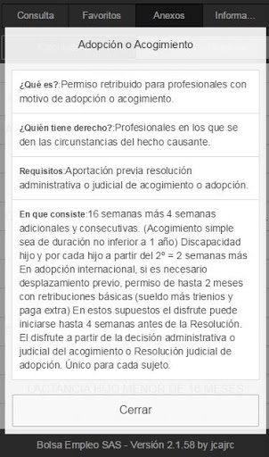  | 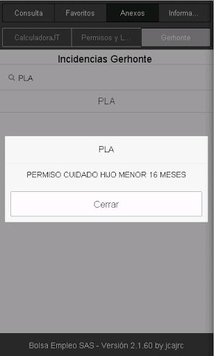  |   | 
 |   |   |   | 
 |   |   |   | 
 |  

## Development team
In the following we report the main information provided by the development team in the Google play store.

| | |
|-------------------------|-------------------------|
| **Developer**  | JCAJRC Productions |
| **Website**  | [https://www.facebook.com/JCAJRC](https://www.facebook.com/JCAJRC) |
| **Email** | jcajrc@gmail.com |
| **Physical address**  | - |
| **Other developed apps**  | [https://play.google.com/store/apps/developer?id=JCAJRC+Productions](https://play.google.com/store/apps/developer?id=JCAJRC+Productions) |

## Android support

| | |
|-------------------------|-------------------------|
| **Declared target Android version**  | Oreo, version 8.0.0 (API level 26) |
| **Effective target Android version**  | Oreo, version 8.0.0 (API level 26) |
| **Minimum supported Android version**  | Ice Cream Sandwich, version 4.0.1 - 4.0.2 (API level 14) |
| **Maximum target Android version**  | - |

The larger the difference between the minimum and maximum supported Android versions, the better. A larger difference means a wider audience. For example, old phones have a very low Android version, so a high minimum supported Android version means that the app cannot be used by users with old phones, thus leading to accessibility problems. 

## Requested permissions

In the following we report the complete list of the permissions requested by the app. 

| **Permission** | **Protection level** | **Description** | 
|-------------------------|-------------------------|-------------------------|
 **android.permission ACCESS_COARSE_LOCATION** | :warning:**Dangerous** | Allows an app to access approximate location. 
 **android.permission ACCESS_FINE_LOCATION** | :warning:**Dangerous** | Allows an app to access precise location. 
 **android.permission ACCESS_NETWORK_STATE** | Normal | Allows applications to access information about networks. 
 **android.permission INTERNET** | Normal | Allows applications to open network sockets. 
 **android.permission VIBRATE** | Normal | Allows access to the vibrator. 
 **android.permission WRITE_EXTERNAL_STORAGE** | :warning:**Dangerous** | Allows an application to write to external storage. 

## Mentioned servers

| **Server** | **Registrant** | **Registrant country** | **Creation date** | 
|-------------------------|-------------------------|-------------------------|-------------------------|
 | googlesyndication.com | Google LLC | :us: US | 2003-01-21 06:17:24 |
 | google.com | Google LLC | :us: US | 1997-09-15 04:00:00 |
 | doubleclick.net | Google Inc. | :us: US | 1996-01-16 05:00:00 |
 | gstatic.com | Google LLC | :us: US | 2008-02-11 15:31:25 |
 | rjfun.com | Domains By Proxy, LLC | :us: US | 2013-08-17 21:03:34 |
 | googleapis.com | Google LLC | :us: US | 2005-01-25 17:52:26 |

## Security analysis 

Below we report the main security warnings raised by our execution of the [Androwarn](https://github.com/maaaaz/androwarn) security analysis tool.

**Telephony identifiers leakage**
> - This application reads the device phone type value 
> - This application reads the numeric name (MCC+MNC) of current registered operator 
> - This application reads the radio technology (network type) currently in use on the device for data transmission 

**Connection interfaces exfiltration**
> - This application reads details about the currently active data network 
> - This application tries to find out if the currently active data network is metered 

**Telephony services abuse**
> - This application makes phone calls 

## User ratings and reviews

Below we provide information about how end users are reacting to the app in terms of ratings and reviews in the Google Play store.

### Ratings

The Bolsa Empleo SAS 2.0 app has been installed by more than **50000** times. At this time, **374** rated the app and its average score is **3.77**. Below we show the distribution of the ratings across the usual star-based rating of Google Play

:star::star::star::star::star:: 165

:star::star::star::star:: 101

:star::star::star:: 26

:star::star:: 22

:star:: 60

### Reviews 

#### 5-star reviews

> 👍  :date: __2020-09-24 11:19:39__

> Estupenda  :date: __2020-08-31 21:25:06__

> Va bien asi te enteras de los contratos nuevos  :date: __2020-06-24 04:24:42__

> La app es genial, una vez la usas un par de veces es bastante fácil. Lo único que le falta bajo de mi punto de vista es poder ver todos los contratos que dan en el día, de momento solo puedes ver la nota del último contrato o por lo menos eso creo. Si hubiese una lista de todos los contratos del año sería una maravilla. De todos modos un gran trabajo, enhorabuena y gracias.  :date: __2020-06-23 15:52:57__

> He estado utilizando esta app hasta hace 5 días q me ha empezado a fallar. No me carga la información de los contratos que se hacen a diario, me aparece un error " error handleerror 1:0". No sé q hacer, ya he desinstalado y vuelto a instalar, reiniciado y sigue dándome error. Q puedo hacer???  :date: __2020-04-14 12:39:02__

> Deberíais subir la puntuación en el filtro. La experiencia se puntúa ahora sobre 70 y 135 se queda corto (comprobado tras salir los últimos listados). Un saludo.  :date: __2019-12-02 21:28:42__

> Va muy bien  :date: __2019-11-27 21:51:52__

> Excelente aplicación. Detalla rápidamente las contrataciones y el baremo al minuto. Muy satisfecho.  :date: __2019-10-19 21:41:05__

> Buena  :date: __2019-09-30 15:55:53__

> Hasta el momento parece q buena  :date: __2019-09-23 15:15:46__

#### 4-star reviews

> La app es muy buena, pero lo mejor sería al menos poder ver la nota de corte y el inicio del contrato al menos (o el tiempo del contrato), eso facilitaría el miedo de todos por si nos ha saltado o no.  :date: __2020-09-18 15:01:54__

> Les he enviado un email. Gracias por la atención. ??  :date: __2020-05-22 18:41:26__

> Manipulación de alimentos  :date: __2020-04-09 20:35:30__

> Está bien, pero puede mejorar por ejemplo en el apartado gráfico y mostrar la duración del contrato ..  :date: __2020-01-09 19:50:06__

> Esta muy bien aunque llevamos varios días que va muy lenta en poner los datos que buscamos. Espero que se corrijan porque en estos momentos estamos en momento de contrataciones y es importante tenrla la app al 100%  :date: __2019-11-27 12:55:40__

> la aplicación es muy útil y en general está bastante bien. Sería genial que informara la duración real de los contratos aunque lo veo técnicamente muy complicado.  :date: __2019-09-22 19:20:50__

> Gracias. De momento me funciona estupendamente Sugerencia: podríais poner un apartado donde pudieramos ver ubicados los centros en un mapa?😬😉  :date: __2019-09-09 10:19:06__

> Menos publicidad estaría bien  :date: __2019-07-04 10:37:42__

> parece que lo han corregido, por lo que en justicia tambien corrijo la valoración. llevo android 9 bajo galaxy s10 plus.  :date: __2019-07-03 01:05:30__

> App recomendable. Alguien me puede decir como guardar en favoritos una busqueda generalizada de contrataciones de una categoría?. Saludos.  :date: __2019-06-18 10:25:48__

#### 3-star reviews

> Te doy un error ejemplo categoría auxiliar de enfermería - serranía de ronda Málaga - día 22 me sale que fue última vez que contrataron y la fecha de corte. Y ya te digo yo que no es esa. Algunas veces le cuesta actualizar .tengo actualizada la app según app store, que consejo me das (?) Hay veces y ahora en verano que son demasiados cambios y llamadas podrías aconsejarnos (?)  :date: __2020-06-24 20:37:47__

> La categoría de matrona no funciona puesto que ahora dan los contratos por enfermería especialista obstétrico - ginecológica  :date: __2019-11-27 10:34:36__

> tras la ultoma actualización no sale si el contrato nes jornada parcial o no, he tenido que llamar al hospital para ver que han dado. es posible arreglarlo?  :date: __2019-09-26 10:45:46__

> La contratación de auxiliar de enfermeria que es la que miro suele fallar muchísimo en los contratos te dice que han contratado jornada parcial cuando han hecho jornada completa,comprobado que falla mucho  :date: __2018-10-25 10:52:03__

> Gracias por responder. ¿no hay alguna forma de automatizar la puntuación de 
corte por día? Es posible que por mi ignorancia este diciendo una 
barbaridad, en todo caso, de nuevo gracias por la app y un saludo.  :date: __2018-05-27 22:01:55__

> De una semana a esta parte al abrirla inmediatamente se cierra. No puedo 
acceder.  :date: __2018-05-18 12:18:07__

> La aplicación esta muy bien, pero hace unos dias q no va se cierra de un 
pantallazo.. espero q lo arreglen rapido  :date: __2018-05-18 09:42:25__

> Llevo varios días intentando acceder a la app. Y tal y como se abre, se 
cierra de un pantallazo. La he desinstalado e instalado nuevamente, ya 
varias veces y nada. Alguna solución? Gracias  :date: __2018-05-15 09:37:04__

> Se me cierra sola  :date: __2018-05-05 14:56:06__

> Por lo que veo en contrataciones del dia no aparecen los contratos que se hacen en el turno de discapacitados  :date: __2018-02-14 15:31:44__

#### 2-star reviews

> Aplicación poco intuitiva y muy engorrosa de usar, poco currada... Por ejemplo: selecciono mi categoría, los hospitales donde tengo disponibilidad, el tipo de acceso y contrato, y que me salgan TODOS los contratos hechos ese día, ordenados por hospital, por ejemplo. Así de fácil.  :date: __2020-10-21 15:53:53__

> no se descarga. hay algún fallo?  :date: __2020-06-09 19:18:31__

> No me aparece la calculadora ope  :date: __2019-05-31 16:34:25__

> al ver las contrataciones de hoy me sale un error " Respuesta: [object Object]". Graci as  :date: __2019-05-28 10:04:24__

> Bien pero los anuncios a página completa muy mal  :date: __2019-01-08 20:17:50__

> Hola desde hace varios dias tengo el mismo problema que demas gente. No me 
funciona bien la app se me cierra de repente y me vuelve a la pantalla 
inicial. Necesito que la arreglen me es muy util gracias  :date: __2018-05-17 22:54:58__

> Llevo unos dias que la app se me cierra sin llegar a abrir. La he 
desinstalado e instalado varias veces y nada.  :date: __2018-05-17 12:20:39__

> Se cierra la aplicación d un pantallazo, tal y como describen algunos en 
estos comentarios, alguna solución??  :date: __2018-05-15 19:34:07__

> Llevo varios meses con la aplicación y nunca tube problema ahora noe deja 
entra no carga directamente se cierra  :date: __2018-05-15 00:24:46__

> No me funciona las consultas le doy a expandir y no sale nada  :date: __2017-02-14 10:40:16__

#### 1-star reviews

> Las contrataciones deberia de salir todas sin necesidad de poner categoría y ciudad. Además de que hay que actualizar, debería de avisar cuando se ha dado un contrato según cada perfil, muchos trabajadores tenemos varias categorías tecnico y en fermeria/fisio, si tiene sentido porque lo ponemos en el perfil, es muy molesto mirar una a una, si no quieren molestarse en mejorar allá ustedes, por su contestación le he bajado la puntuacion  :date: __2020-10-17 20:10:22__

> LA TENGO QUE DESINSTALAR, SALE LA PUBLICIDAD Y NO HAY FORMA DE QUITARLA PARA VER LAS ÚLTIMAS CONTRATACIONES  :date: __2020-09-03 13:44:33__

> Estaba descargandola cuando leo que no es la oficial...y me pregunto y Entonces?? Me crea dudas y he cancelado la descarga... Quiero información real y a tiempo real también .. En fin... Cuando aquí hagan las publicaciones quizás esa información ya no exista..? O como? Jaja  :date: __2020-08-18 15:42:09__

> Es horrible lo mal que va. Cada vez que pinchas en una tarda alrededor de 30 segundos en aparecer, si quieres ir haciendo consultas rápidas una tras otra es imposible.  :date: __2020-07-24 12:26:58__

> Creia que iba a ser genial una app del sas y de contrataciones. Hay que estar buscando en todos sitios. No era mejor una lista de todas las contrataciones y ya en ella información? Para que quiero saber que hoy han contratado a uno en Almería? Lo que queremos ver todos aqui es como van las cosas. No es para nada fácil. No se para qué tantas opciones cuando no sabes ni para que sirven. Era más fácil lo que necesitábamos.  :date: __2020-06-06 01:22:58__

> Anuncios invasivos. Estoy cansado de abrir la app y que suene a todo trapo el anuncio del Candy Crush de fondo.  :date: __2020-05-15 10:40:16__

> La aplicación no me funciona , cuando intento acceder a los centros Salta un anuncio y no me deja hacer nada dandome error.  :date: __2020-04-09 17:55:19__

> Llevo seis días que no funciona la aplicación en ninguno de mis dispositivo.  :date: __2020-04-06 17:55:00__

> No me deja descargarla porque la versopn dw mo movil es muy antigua al igual quecel movil y no me seja ya actualizar la version  :date: __2019-12-10 11:06:29__

> En mi caso, la aplicación no funciona Pensaba que era por el sistema operativo de Iphone...pero me la he descargado desde otro móvil y sigue sin dejarte ver las contrataciones ni almacenar favoritos Anteriormente la había estado utilizando sin problemas  :date: __2019-09-25 13:50:41__

# meSoigner - Ma pharmacie tout de suite
App version ``1.10.4``

Analyzed with [covid-apps-observer](http://github.com/covid-apps-observer) project, version ``0.1``

## App overview
| | |
|-------------------------|-------------------------| 
| **Name**&nbsp;&nbsp;&nbsp;&nbsp;&nbsp;&nbsp;&nbsp;&nbsp;&nbsp;&nbsp;&nbsp;&nbsp;&nbsp;&nbsp;&nbsp;&nbsp;&nbsp;&nbsp;&nbsp;&nbsp;&nbsp;&nbsp;&nbsp;&nbsp;&nbsp;&nbsp;&nbsp;&nbsp;&nbsp;&nbsp;&nbsp;&nbsp;&nbsp;&nbsp;&nbsp;&nbsp;&nbsp;&nbsp;&nbsp;&nbsp;  | meSoigner - Ma pharmacie tout de suite |
| **Unique identifier** | fr.mesoigner.app |
| **Link to Google Play** | [https://play.google.com/store/apps/details?id=fr.mesoigner.app](https://play.google.com/store/apps/details?id=fr.mesoigner.app) |
| **Summary**  | Envoi d&#39;ordonnance et commande de médicaments à ma pharmacie, rappel de prise |
| **Privacy policy** | [https://www.mesoigner.fr/politique-confidentialite](https://www.mesoigner.fr/politique-confidentialite) |
| **Latest version** | 1.10.4 |
| **Last update** | 2020-09-09 17:49:24 |
| **Recent changes** | Correctifs et améliorations de performance |
| **Installs**  | 5 000+ |
| **Category** | Santé et remise en forme |
| **First release** | 29 janv. 2018 |
| **Size**  | 27M |
| **Supported Android version**  | 5.0 ou version ultérieure |

### Description
> Avec l'application meSoigner – ma pharmacie tout de suite,  je bénéficie de nombreux avantages : livraison, retrait prioritaire en pharmacie, paiement en ligne ... fini la file d’attente !
  
 Je peux :
 -    Commander des médicaments et produits de parapharmacie en quelques clics
 -    Envoyer la photo de mon ordonnance pour qu'elle soit prête à mon passage à la pharmacie
 -    Programmer l'heure de prise de mes médicaments pour ne plus les oublier
 -    Scanner le code barre d’un médicament ou d’un produit de parapharmacie afin d’obtenir les indications d’usage ou la notice
 -    Contacter mon pharmacien de manière sécurisée avec la messagerie instantanée
 -    Consulter les promotions faites par ma pharmacie
  
 Avec l'application meSoigner, mon pharmacien est plus réactif et plus proche de moi !

### User interface
The developers of the app provide the following screenshots in the Google play store.
| | | |
|:-------------------------:|:-------------------------:|:-------------------------:|
 |   |   |   | 
 |   |   |   | 

## Development team
In the following we report the main information provided by the development team in the Google play store.

| | |
|-------------------------|-------------------------|
| **Developer**  | Mesoigner.fr |
| **Website**  | [https://www.mesoigner.fr](https://www.mesoigner.fr) |
| **Email** | sav@mesoigner.fr |
| **Physical address**  | - |
| **Other developed apps**  | [https://play.google.com/store/apps/developer?id=Mesoigner.fr](https://play.google.com/store/apps/developer?id=Mesoigner.fr) |

## Android support

| | |
|-------------------------|-------------------------|
| **Declared target Android version**  | Pie, version 9 (API level 28) |
| **Effective target Android version**  | Pie, version 9 (API level 28) |
| **Minimum supported Android version**  | Lollipop, version 5.0 (API level 21) |
| **Maximum target Android version**  | - |

The larger the difference between the minimum and maximum supported Android versions, the better. A larger difference means a wider audience. For example, old phones have a very low Android version, so a high minimum supported Android version means that the app cannot be used by users with old phones, thus leading to accessibility problems. 

## Requested permissions

In the following we report the complete list of the permissions requested by the app. 

| **Permission** | **Protection level** | **Description** | 
|-------------------------|-------------------------|-------------------------|
 **android.permission ACCESS_COARSE_LOCATION** | :warning:**Dangerous** | Allows an app to access approximate location. 
 **android.permission ACCESS_FINE_LOCATION** | :warning:**Dangerous** | Allows an app to access precise location. 
 **android.permission ACCESS_NETWORK_STATE** | Normal | Allows applications to access information about networks. 
 **android.permission ACCESS_WIFI_STATE** | Normal | Allows applications to access information about Wi-Fi networks. 
 **android.permission CAMERA** | :warning:**Dangerous** | Required to be able to access the camera device. 
 **android.permission FLASHLIGHT** | - | - 
 **android.permission INTERNET** | Normal | Allows applications to open network sockets. 
 **android.permission READ_APP_BADGE** | - | - 
 **android.permission READ_EXTERNAL_STORAGE** | :warning:**Dangerous** | Allows an application to read from external storage. 
 **android.permission RECEIVE_BOOT_COMPLETED** | Normal | Allows an application to receive the Intent.ACTION_BOOT_COMPLETED that is broadcast after the system finishes booting. 
 **android.permission VIBRATE** | Normal | Allows access to the vibrator. 
 **android.permission WAKE_LOCK** | Normal | Allows using PowerManager WakeLocks to keep processor from sleeping or screen from dimming. 
 **android.permission WRITE_EXTERNAL_STORAGE** | :warning:**Dangerous** | Allows an application to write to external storage. 
 **com.anddoes.launcher.permission UPDATE_COUNT** | - | - 
 **com.google.android.c2dm.permission RECEIVE** | - | - 
 **com.htc.launcher.permission READ_SETTINGS** | - | - 
 **com.htc.launcher.permission UPDATE_SHORTCUT** | - | - 
 **com.huawei.android.launcher.permission CHANGE_BADGE** | - | - 
 **com.huawei.android.launcher.permission READ_SETTINGS** | - | - 
 **com.huawei.android.launcher.permission WRITE_SETTINGS** | - | - 
 **com.majeur.launcher.permission UPDATE_BADGE** | - | - 
 **com.oppo.launcher.permission READ_SETTINGS** | - | - 
 **com.oppo.launcher.permission WRITE_SETTINGS** | - | - 
 **com.sec.android.provider.badge.permission READ** | - | - 
 **com.sec.android.provider.badge.permission WRITE** | - | - 
 **com.sonyericsson.home.permission BROADCAST_BADGE** | - | - 
 **com.sonymobile.home.permission PROVIDER_INSERT_BADGE** | - | - 
 **fr.mesoigner.app.permission C2D_MESSAGE** | - | - 
 **fr.mesoigner.app.permission PushHandlerActivity** | - | - 
 **me.everything.badger.permission BADGE_COUNT_READ** | - | - 
 **me.everything.badger.permission BADGE_COUNT_WRITE** | - | - 

## Mentioned servers

| **Server** | **Registrant** | **Registrant country** | **Creation date** | 
|-------------------------|-------------------------|-------------------------|-------------------------|
 | googlesyndication.com | Google LLC | :us: US | 2003-01-21 06:17:24 |
 | google.com | Google LLC | :us: US | 1997-09-15 04:00:00 |
 | app-measurement.com | Google LLC | :us: US | 2015-06-19 20:13:31 |
 | appspot.com | Google LLC | :us: US | 2005-03-10 02:27:55 |
 | mesoigner.fr | PHARMACIE DE CORBIAC | - | 2010-04-09 17:43:55 |
 | gstatic.com | Google LLC | :us: US | 2008-02-11 15:31:25 |
 | googleapis.com | Google LLC | :us: US | 2005-01-25 17:52:26 |

## Security analysis 

Below we report the main security warnings raised by our execution of the [Androwarn](https://github.com/maaaaz/androwarn) security analysis tool.

**Connection interfaces exfiltration**
> - This application reads details about the currently active data network 
> - This application tries to find out if the currently active data network is metered 

**Telephony services abuse**
> - This application makes phone calls 

**Pim data leakage**
> - This application accesses the downloads folder 
> - This application accesses data stored in the clipboard 

**Code execution**
> - This application loads a native library: 'Scanner' 
> - This application loads a native library: 'opencv_java3' 
> - This application executes a UNIX command containing this argument: 'Ljava/lang/StringBuilder;->toString()Ljava/lang/String;' 

## User ratings and reviews

Below we provide information about how end users are reacting to the app in terms of ratings and reviews in the Google Play store.

### Ratings

The meSoigner - Ma pharmacie tout de suite app has been installed by more than **5000** times. At this time, **94** rated the app and its average score is **4.4574466**. Below we show the distribution of the ratings across the usual star-based rating of Google Play

:star::star::star::star::star:: 69

:star::star::star::star:: 14

:star::star::star:: 3

:star::star:: 1

:star:: 7

### Reviews 

#### 5-star reviews

> Génial par sa simplicité J'avais déjà un compte en ligne avec ma pharmacie Désormais avec cette application je me facilite la vie ⚕️ bravo... J'adore  :date: __2020-10-22 13:25:26__

> Vraiment très bon outil à tout les points, félicitations.  :date: __2020-09-30 10:10:41__

> Application géniale et très efficace...👍🤗  :date: __2020-09-10 19:12:22__

> Facile à utiliser  :date: __2020-08-26 12:51:07__

> Plutôt pratique pour ma part.  :date: __2020-08-25 18:52:47__

> Très pratique  :date: __2020-06-17 17:33:24__

> Très bien, super pratique.  :date: __2020-05-20 18:55:32__

> Très bonne application,un gagne temps. Plus qu'à passer à la pharmacie récupérer son ordonnance. Je conseille vivement de télécharger l'application  :date: __2020-05-14 15:26:33__

> Très bien.  :date: __2020-05-06 12:37:58__

> Très bien satisfaite.  :date: __2020-04-27 11:08:12__

#### 4-star reviews

> Bien pratique en cette période difficile.  :date: __2020-04-18 12:21:01__

> Bien  :date: __2018-10-11 23:19:22__

#### 3-star reviews

> Ne fonctionne pas régulièrement. Dommage car c'est une excellente solution pour envoyer les ordonnances.  :date: __2020-04-16 13:59:41__

> Dommage que le rappel de prise n'affiche pas uniquement la liste des 
posologies à prendre au moment du rappel.  :date: __2018-06-21 09:55:50__

#### 2-star reviews

> Pas clair  :date: __2019-10-17 09:53:50__

#### 1-star reviews

> Concurrence plus intéressante  :date: __2020-10-16 02:06:07__

> Inscription impossible mais scores et déjà une publicité !  :date: __2020-06-02 05:25:08__

> Bof. Pas à jout  :date: __2020-05-03 17:50:58__

> Bug  :date: __2020-04-22 11:33:13__

> Se ferme sans crier gare ! Pénible  :date: __2020-03-06 15:21:39__

> Impossible de scanner les codes barre et QR. Lors de la création du compte 
de pharmacie l'application ne trouve rien tant pas le nom que par le code 
postal.  :date: __2018-07-18 20:26:43__

> C'est simple: les rappels ne fonctionnent pas. Absolument inutile. Merci de 
supprimer mon compte.  :date: __2018-06-09 08:51:50__

# Ma Pharmacie Leadersanté
App version ``1.41.0``

Analyzed with [covid-apps-observer](http://github.com/covid-apps-observer) project, version ``0.1``

## App overview
| | |
|-------------------------|-------------------------| 
| **Name**&nbsp;&nbsp;&nbsp;&nbsp;&nbsp;&nbsp;&nbsp;&nbsp;&nbsp;&nbsp;&nbsp;&nbsp;&nbsp;&nbsp;&nbsp;&nbsp;&nbsp;&nbsp;&nbsp;&nbsp;&nbsp;&nbsp;&nbsp;&nbsp;&nbsp;&nbsp;&nbsp;&nbsp;&nbsp;&nbsp;&nbsp;&nbsp;&nbsp;&nbsp;&nbsp;&nbsp;&nbsp;&nbsp;&nbsp;&nbsp;  | Ma Pharmacie Leadersanté |
| **Unique identifier** | fr.leadersante.main |
| **Link to Google Play** | [https://play.google.com/store/apps/details?id=fr.leadersante.main](https://play.google.com/store/apps/details?id=fr.leadersante.main) |
| **Summary**  | Retrouvez tous les services de votre pharmacie Leadersanté. |
| **Privacy policy** | [http://application.leadersante-groupe.fr/CGU.pdf](http://application.leadersante-groupe.fr/CGU.pdf) |
| **Latest version** | 1.41.0 |
| **Last update** | 2020-10-19 14:29:36 |
| **Recent changes** | - Intégration de MyPrivilege : consultez votre carte et cumulez des points fidélité directement depuis l&#39;application ! - Correction de quelques bugs |
| **Installs**  | 1 000+ |
| **Category** | Santé et remise en forme |
| **First release** | 8 nov. 2018 |
| **Size**  | 51M |
| **Supported Android version**  | 5.0 ou version ultérieure |

### Description
> L'application Leadersanté vous permet d'accéder à tous les services de votre pharmacie : 
 - commandez des produits, livrés chez vous ou à retirer sur place
 - envoyez vos ordonnances pour un retrait rapide des produits en pharmacie
 - programmez un entretien individuel avec votre pharmacien
 L'application est dédiée aux pharmacies du réseau Leadersanté.

### User interface
The developers of the app provide the following screenshots in the Google play store.
| | | |
|:-------------------------:|:-------------------------:|:-------------------------:|
 |   |   |   | 

## Development team
In the following we report the main information provided by the development team in the Google play store.

| | |
|-------------------------|-------------------------|
| **Developer**  | Leadersanté |
| **Website**  | [https://leadersante.fr/](https://leadersante.fr/) |
| **Email** | contact@leadersante.fr |
| **Physical address**  | - |
| **Other developed apps**  | [https://play.google.com/store/apps/developer?id=Leadersant%C3%A9](https://play.google.com/store/apps/developer?id=Leadersant%C3%A9) |

## Android support

| | |
|-------------------------|-------------------------|
| **Declared target Android version**  | Pie, version 9 (API level 28) |
| **Effective target Android version**  | Pie, version 9 (API level 28) |
| **Minimum supported Android version**  | Lollipop, version 5.0 (API level 21) |
| **Maximum target Android version**  | - |

The larger the difference between the minimum and maximum supported Android versions, the better. A larger difference means a wider audience. For example, old phones have a very low Android version, so a high minimum supported Android version means that the app cannot be used by users with old phones, thus leading to accessibility problems. 

## Requested permissions

In the following we report the complete list of the permissions requested by the app. 

| **Permission** | **Protection level** | **Description** | 
|-------------------------|-------------------------|-------------------------|
 **android.permission ACCESS_COARSE_LOCATION** | :warning:**Dangerous** | Allows an app to access approximate location. 
 **android.permission ACCESS_FINE_LOCATION** | :warning:**Dangerous** | Allows an app to access precise location. 
 **android.permission ACCESS_NETWORK_STATE** | Normal | Allows applications to access information about networks. 
 **android.permission ACCESS_WIFI_STATE** | Normal | Allows applications to access information about Wi-Fi networks. 
 **android.permission CAMERA** | :warning:**Dangerous** | Required to be able to access the camera device. 
 **android.permission CAMERA_ROLL** | - | - 
 **android.permission FOREGROUND_SERVICE** | Normal | Allows a regular application to use Service.startForeground. 
 **android.permission INTERNET** | Normal | Allows applications to open network sockets. 
 **android.permission MODIFY_AUDIO_SETTINGS** | Normal | Allows an application to modify global audio settings. 
 **android.permission READ_EXTERNAL_STORAGE** | :warning:**Dangerous** | Allows an application to read from external storage. 
 **android.permission RECEIVE_BOOT_COMPLETED** | Normal | Allows an application to receive the Intent.ACTION_BOOT_COMPLETED that is broadcast after the system finishes booting. 
 **android.permission REQUEST_INSTALL_PACKAGES** | Signature | Allows an application to request installing packages. 
 **android.permission STORAGE** | - | - 
 **android.permission SYSTEM_ALERT_WINDOW** | Signature - preinstalled - appop - pre23 - development | Allows an app to create windows using the type WindowManager.LayoutParams.TYPE_APPLICATION_OVERLAY, shown on top of all other apps. 
 **android.permission VIBRATE** | Normal | Allows access to the vibrator. 
 **android.permission WAKE_LOCK** | Normal | Allows using PowerManager WakeLocks to keep processor from sleeping or screen from dimming. 
 **android.permission WRITE_EXTERNAL_STORAGE** | :warning:**Dangerous** | Allows an application to write to external storage. 
 **com.google.android.c2dm.permission RECEIVE** | - | - 
 **com.google.android.finsky.permission BIND_GET_INSTALL_REFERRER_SERVICE** | - | - 
 **fr.leadersante.main.permission C2D_MESSAGE** | - | - 
 **host.exp.exponent.permission C2D_MESSAGE** | - | - 

## Mentioned servers

| **Server** | **Registrant** | **Registrant country** | **Creation date** | 
|-------------------------|-------------------------|-------------------------|-------------------------|
 | amplitude.com | Amplitude | :us: US | 1996-05-09 04:00:00 |
 | facebook.com | Facebook, Inc. | :us: US | 1997-03-29 05:00:00 |
 | google.com | Google LLC | :us: US | 1997-09-15 04:00:00 |
 | android.com | Google LLC | :us: US | 1997-06-23 04:00:00 |
 | googlesyndication.com | Google LLC | :us: US | 2003-01-21 06:17:24 |
 | googleapis.com | Google LLC | :us: US | 2005-01-25 17:52:26 |
 | w3.org | W3C | :us: US | 1994-07-06 04:00:00 |
 | doubleclick.net | Google Inc. | :us: US | 1996-01-16 05:00:00 |
 | gstatic.com | Google LLC | :us: US | 2008-02-11 15:31:25 |
 | googleapis.com | Google LLC | :us: US | 2005-01-25 17:52:26 |
 | app-measurement.com | Google LLC | :us: US | 2015-06-19 20:13:31 |
 | google-analytics.com | Google LLC | :us: US | 2005-07-18 19:24:32 |
 | segment.com | Domains By Proxy, LLC | :us: US | 1998-07-06 04:00:00 |
 | segment.io | Segment.io, Inc. | :us: US | 2011-10-01 04:10:05 |
 | expo.io | See PrivacyGuardian.org | :us: US | 2011-05-01 21:26:50 |
 | crashlytics.com | Google LLC | :us: US | 2011-01-21 15:30:40 |
 | cloudfront.net | Amazon.com, Inc. | :us: US | 2008-04-25 18:25:49 |
 | cloudfront.net | Amazon.com, Inc. | :us: US | 2008-04-25 18:25:49 |
 | googleadservices.com | Google LLC | :us: US | 2003-06-19 16:34:53 |

## Security analysis 

Below we report the main security warnings raised by our execution of the [Androwarn](https://github.com/maaaaz/androwarn) security analysis tool.

**Telephony identifiers leakage**
> - This application reads the ISO country code equivalent for the SIM provider's country code 
> - This application reads the ISO country code equivalent of the current registered operator's MCC (Mobile Country Code) 
> - This application reads the MCC+MNC of the provider of the SIM 
> - This application reads the Service Provider Name (SPN) 
> - This application reads the constant indicating the state of the device SIM card 
> - This application reads the device phone type value 
> - This application reads the numeric name (MCC+MNC) of current registered operator 
> - This application reads the operator name 
> - This application reads the radio technology (network type) currently in use on the device for data transmission 
> - This application reads the unique device ID, i.e the IMEI for GSM and the MEID or ESN for CDMA phones 

**Location lookup**
> - This application reads location information from all available providers (WiFi, GPS etc.) 

**Connection interfaces exfiltration**
> - This application reads details about the currently active data network 
> - This application tries to find out if the currently active data network is metered 

**Telephony services abuse**
> - This application makes phone calls 

**Audio video eavesdropping**
> - This application records audio from the 'CAMCORDER' source  
> - This application records audio from the 'DEFAULT' source  
> - This application records audio from the 'MIC' source  
> - This application captures video from the 'CAMERA' source 
> - This application captures video from the 'SURFACE' source 

**Suspicious connection establishment**
> - This application opens a Socket and connects it to the remote address '' on the 'N/A' port  
> - This application opens a Socket and connects it to the remote address 'Ljava/lang/StringBuilder;->toString()Ljava/lang/String;' on the ': connect, resolve' port  
> - This application opens a Socket and connects it to the remote address 'Ljava/lang/StringBuilder;->toString()Ljava/lang/String;' on the 'N/A' port  
> - This application opens a Socket and connects it to the remote address 'Ljava/net/Proxy;->type()Ljava/net/Proxy$Type;' on the 'N/A' port  
> - This application opens a Socket and connects it to the remote address 'timeout' on the 'N/A' port  

**Pim data leakage**
> - This application accesses data stored in the clipboard 

**Code execution**
> - This application loads a native library 
> - This application executes a UNIX command containing this argument: '2' 

## User ratings and reviews

Below we provide information about how end users are reacting to the app in terms of ratings and reviews in the Google Play store.

### Ratings

The Ma Pharmacie Leadersanté app has been installed by more than **1000** times. At this time, **16** rated the app and its average score is **4.0625**. Below we show the distribution of the ratings across the usual star-based rating of Google Play

:star::star::star::star::star:: 11

:star::star::star::star:: 1

:star::star::star:: 1

:star::star:: 0

:star:: 3

### Reviews 

#### 5-star reviews

> Application ludique et complete, utile pour economiser du temps et eviter les files d'attente Pas encore testé le service de livraison, je me le reserve pour une prochaine commande plus consequente, je testerai la gratuité pour la 1ere fois comme cela m'a eté proposé  :date: __2020-10-19 19:20:04__

> Génial  :date: __2020-06-19 16:35:46__

> Une application qui m'a bien aidé 👍🏾👍🏾  :date: __2020-03-20 11:38:17__

> Top pour rester en contact avec mon pharmacien ! Très simple d'utilisation ! Je conseille !!  :date: __2019-11-25 15:51:11__

#### 4-star reviews

No recent reviews available with 4 stars.

#### 3-star reviews

> Parfaite pour transmettre les ordonnances. Par contre impossible de commander la parapharmacie, bloque sur le paiement.  :date: __2020-06-30 09:13:26__

#### 2-star reviews

No recent reviews available with 2 stars.

#### 1-star reviews

> Rien ne fonctionne ça m'agace Nulle cette application  :date: __2020-10-15 15:42:35__

> Après avoir autorisé le gps, me situe à Paris alors que je suis à Marseille. Si je rentre le nom de ma pharmacie ( qui m'a donné le nom de l'appli) : adresse inconnue au bataillon. Soyons sérieux...  :date: __2020-09-03 18:40:13__

> Après avoir mis mes identifiants, écran blanc. Ne sert a rien  :date: __2019-11-23 18:26:18__

# myAPHM
App version ``1.2.0.0``

Analyzed with [covid-apps-observer](http://github.com/covid-apps-observer) project, version ``0.1``

## App overview
| | |
|-------------------------|-------------------------| 
| **Name**&nbsp;&nbsp;&nbsp;&nbsp;&nbsp;&nbsp;&nbsp;&nbsp;&nbsp;&nbsp;&nbsp;&nbsp;&nbsp;&nbsp;&nbsp;&nbsp;&nbsp;&nbsp;&nbsp;&nbsp;&nbsp;&nbsp;&nbsp;&nbsp;&nbsp;&nbsp;&nbsp;&nbsp;&nbsp;&nbsp;&nbsp;&nbsp;&nbsp;&nbsp;&nbsp;&nbsp;&nbsp;&nbsp;&nbsp;&nbsp;  | myAPHM |
| **Unique identifier** | fr.ap_hm.myaphm |
| **Link to Google Play** | [https://play.google.com/store/apps/details?id=fr.ap_hm.myaphm](https://play.google.com/store/apps/details?id=fr.ap_hm.myaphm) |
| **Summary**  | Mon espace privé APHM |
| **Privacy policy** | [https://myaphm.ap-hm.fr/Accueil/Conditionsdutilisation.aspx](https://myaphm.ap-hm.fr/Accueil/Conditionsdutilisation.aspx) |
| **Latest version** | 1.2.0.0 |
| **Last update** | 2019-12-19 16:50:44 |
| **Recent changes** | Mon hôpital sur mobile ! |
| **Installs**  | 1 000+ |
| **Category** | Santé et remise en forme |
| **First release** | 19 déc. 2019 |
| **Size**  | 3,1M |
| **Supported Android version**  | 4.4 ou version ultérieure |

### Description
> Visualisez automatiquement vos rendez-vous à l'Assistance Publique Hôpitaux de Marseille
 Vous avez consulté, été hospitalisé, avez passé un examen d'imagerie ou une prise de sang ?
 L' AP-HM vous envoie automatiquement vos résultats et comptes-rendus.
 Vous disposez en plus d'un espace sécurisé de stockage pour y déposer tous vos documents médicaux qui seront accessibles via un simple smartphone ou ordinateur quel que soit l'endroit où vous vous trouvez.

### User interface
The developers of the app provide the following screenshots in the Google play store.
| | | |
|:-------------------------:|:-------------------------:|:-------------------------:|
 |   |   |   | 
 |   |   |   | 
 |  

## Development team
In the following we report the main information provided by the development team in the Google play store.

| | |
|-------------------------|-------------------------|
| **Developer**  | HOPSIS |
| **Website**  | [https://myaphm.ap-hm.fr](https://myaphm.ap-hm.fr) |
| **Email** | contact@hopsis.fr |
| **Physical address**  | - |
| **Other developed apps**  | [https://play.google.com/store/apps/developer?id=HOPSIS](https://play.google.com/store/apps/developer?id=HOPSIS) |

## Android support

| | |
|-------------------------|-------------------------|
| **Declared target Android version**  | Pie, version 9 (API level 28) |
| **Effective target Android version**  | Pie, version 9 (API level 28) |
| **Minimum supported Android version**  | KitKat, version 4.4 - 4.4.4 (API level 19) |
| **Maximum target Android version**  | - |

The larger the difference between the minimum and maximum supported Android versions, the better. A larger difference means a wider audience. For example, old phones have a very low Android version, so a high minimum supported Android version means that the app cannot be used by users with old phones, thus leading to accessibility problems. 

## Requested permissions

In the following we report the complete list of the permissions requested by the app. 

| **Permission** | **Protection level** | **Description** | 
|-------------------------|-------------------------|-------------------------|
 **android.permission CAMERA** | :warning:**Dangerous** | Required to be able to access the camera device. 
 **android.permission FLASHLIGHT** | - | - 
 **android.permission INTERNET** | Normal | Allows applications to open network sockets. 
 **android.permission READ_EXTERNAL_STORAGE** | :warning:**Dangerous** | Allows an application to read from external storage. 
 **android.permission WRITE_EXTERNAL_STORAGE** | :warning:**Dangerous** | Allows an application to write to external storage. 

## Mentioned servers

| **Server** | **Registrant** | **Registrant country** | **Creation date** | 
|-------------------------|-------------------------|-------------------------|-------------------------|
 | appspot.com | Google LLC | :us: US | 2005-03-10 02:27:55 |
 | google.com | Google LLC | :us: US | 1997-09-15 04:00:00 |
 | gstatic.com | Google LLC | :us: US | 2008-02-11 15:31:25 |
 | googleapis.com | Google LLC | :us: US | 2005-01-25 17:52:26 |

## Security analysis 

Below we report the main security warnings raised by our execution of the [Androwarn](https://github.com/maaaaz/androwarn) security analysis tool.

**Connection interfaces exfiltration**
> - This application reads details about the currently active data network 
> - This application tries to find out if the currently active data network is metered 

**Telephony services abuse**
> - This application makes phone calls 

**Pim data leakage**
> - This application accesses the downloads folder 
> - This application accesses data stored in the clipboard 

## User ratings and reviews

Below we provide information about how end users are reacting to the app in terms of ratings and reviews in the Google Play store.

### Ratings

The myAPHM app has been installed by more than **1000** times. At this time, **-** rated the app and its average score is **0.0**. Below we show the distribution of the ratings across the usual star-based rating of Google Play

:star::star::star::star::star:: 0

:star::star::star::star:: 0

:star::star::star:: 0

:star::star:: 0

:star:: 0

### Reviews 

#### 5-star reviews

No recent reviews available with 5 stars.

#### 4-star reviews

No recent reviews available with 4 stars.

#### 3-star reviews

No recent reviews available with 3 stars.

#### 2-star reviews

No recent reviews available with 2 stars.

#### 1-star reviews

No recent reviews available with 1 stars.

# Daily PSO
App version ``2.0.3``

Analyzed with [covid-apps-observer](http://github.com/covid-apps-observer) project, version ``0.1``

## App overview
| | |
|-------------------------|-------------------------| 
| **Name**&nbsp;&nbsp;&nbsp;&nbsp;&nbsp;&nbsp;&nbsp;&nbsp;&nbsp;&nbsp;&nbsp;&nbsp;&nbsp;&nbsp;&nbsp;&nbsp;&nbsp;&nbsp;&nbsp;&nbsp;&nbsp;&nbsp;&nbsp;&nbsp;&nbsp;&nbsp;&nbsp;&nbsp;&nbsp;&nbsp;&nbsp;&nbsp;&nbsp;&nbsp;&nbsp;&nbsp;&nbsp;&nbsp;&nbsp;&nbsp;  | Daily PSO |
| **Unique identifier** | fr.infostrates.dailypso |
| **Link to Google Play** | [https://play.google.com/store/apps/details?id=fr.infostrates.dailypso](https://play.google.com/store/apps/details?id=fr.infostrates.dailypso) |
| **Summary**  | DAILYPSO Apporte Conseils, Informations et aux patients psoriasiques Suivi |
| **Privacy policy** | [https://static.janssen-emea.com/sites/default/files/France/uploads/Mentions%20l%C3%A9gales/Application/PolitiqueProtectionViePrivee.application.html](https://static.janssen-emea.com/sites/default/files/France/uploads/Mentions%20l%C3%A9gales/Application/PolitiqueProtectionViePrivee.application.html) |
| **Latest version** | 2.0.3 |
| **Last update** | 2019-09-11 16:39:26 |
| **Recent changes** | les nouvelles fonctionnalités de DailyPso :  -	Nouvelle charte graphique -	Synchronisation du calendrier Dailypso (rappels de rendez-vous ou prise de traitement) avec le calendrier du téléphone -	Mise en ligne du jeu PsoInvaders pour mieux comprendre le mécanisme du psoriasis -	Nouvelles fiches « Les conseils au quotidien » -	Ajout d’un lexique sur le psoriasis et son environnement |
| **Installs**  | 5 000+ |
| **Category** | Santé et remise en forme |
| **First release** | 6 janv. 2016 |
| **Size**  | 9,0M |
| **Supported Android version**  | 4.4 ou version ultérieure |

### Description
> Découvrez DAILYPSO, votre nouvel allié face au Psoriasis ! 
 Le psoriasis, encore mal connu, est une maladie chronique de la peau qui cause de réelles souffrances physiques et psychiques chez les personnes qui en sont atteintes. Non contagieux, il touche 2 à 3 millions de français et peut avoir, dans certains cas, un impact important sur leur vie sociale, privée et professionnelle. 
 Conçue en étroite collaboration avec l’association de patients France Psoriasis et le dermatologue Morad LAHFA, DAILYPSO est la première application mobile pensée et développée pour aider les personnes touchées par le psoriasis à mieux vivre au quotidien. De manière intuitive, vous retrouverez des informations de qualité pour mieux comprendre la maladie, de nombreux conseils thématiques pour améliorer son quotidien et un carnet de bord interactif unique pour un suivi régulier de l’évolution de sa maladie. 
 • Des informations de qualité pour tout savoir sur le psoriasis : son origine, ses différentes formes, son évolution, comment le traiter ? Retrouvez facilement les réponses à toutes vos questions grâce à des informations à jour validées médicalement
 • Des conseils pratiques pour mieux vivre au quotidien : hygiène, alimentation, activité physique, gestion de la douleur, vacances, travail … Accédez immédiatement à de nombreuses fiches-conseils thématiques rédigés et validés par des patients et des professionnels de santé.
 • Un carnet de bord interactif unique : suivi de vos traitements, prise de photo des plaques de psoriasis, évaluation des symptômes, identification des facteurs déclencheurs et évolution de votre ressenti par rapport à la maladie. Découvrez dès aujourd’hui une nouvelle façon de suivre l’évolution de la maladie au cours du temps et accédez à des conseils contextualisés en fonction de l’état de votre psoriasis.
 • D’autres fonctionnalités pratiques : rappels de traitement et de rendez-vous, coordonnées médecins et association de patient, notifications thématiques.
 Pour des informations complémentaires sur le Psoriasis, likez la page Facebook Psoriasis : Parlons-en (https://www.facebook.com/Psoriasisparlonsen/ ) ou rendez-vous sur le site internet Janssen France (http://www.janssen-france.fr/le-psoriasis).

### User interface
The developers of the app provide the following screenshots in the Google play store.
| | | |
|:-------------------------:|:-------------------------:|:-------------------------:|
 |   |   |   | 
 |   |   |   | 
 |   |   |   | 
 |   |   |   | 
 |   |   |   | 
 |  

## Development team
In the following we report the main information provided by the development team in the Google play store.

| | |
|-------------------------|-------------------------|
| **Developer**  | Janssen Pharmaceutica N.V. |
| **Website**  | [http://www.janssen-france.fr](http://www.janssen-france.fr) |
| **Email** | mbelin@its.jnj.com |
| **Physical address**  | - |
| **Other developed apps**  | [https://play.google.com/store/apps/developer?id=Janssen+Pharmaceutica+N.V.](https://play.google.com/store/apps/developer?id=Janssen+Pharmaceutica+N.V.) |

## Android support

| | |
|-------------------------|-------------------------|
| **Declared target Android version**  | KitKat, version 4.4 - 4.4.4 (API level 19) |
| **Effective target Android version**  | KitKat, version 4.4 - 4.4.4 (API level 19) |
| **Minimum supported Android version**  | KitKat, version 4.4 - 4.4.4 (API level 19) |
| **Maximum target Android version**  | - |

The larger the difference between the minimum and maximum supported Android versions, the better. A larger difference means a wider audience. For example, old phones have a very low Android version, so a high minimum supported Android version means that the app cannot be used by users with old phones, thus leading to accessibility problems. 

## Requested permissions

In the following we report the complete list of the permissions requested by the app. 

| **Permission** | **Protection level** | **Description** | 
|-------------------------|-------------------------|-------------------------|
 **android.permission ACCESS_NETWORK_STATE** | Normal | Allows applications to access information about networks. 
 **android.permission ACCESS_WIFI_STATE** | Normal | Allows applications to access information about Wi-Fi networks. 
 **android.permission GET_ACCOUNTS** | :warning:**Dangerous** | Allows access to the list of accounts in the Accounts Service. 
 **android.permission INTERNET** | Normal | Allows applications to open network sockets. 
 **android.permission RECEIVE_BOOT_COMPLETED** | Normal | Allows an application to receive the Intent.ACTION_BOOT_COMPLETED that is broadcast after the system finishes booting. 
 **android.permission VIBRATE** | Normal | Allows access to the vibrator. 
 **android.permission WAKE_LOCK** | Normal | Allows using PowerManager WakeLocks to keep processor from sleeping or screen from dimming. 
 **android.permission WRITE_EXTERNAL_STORAGE** | :warning:**Dangerous** | Allows an application to write to external storage. 
 **com.google.android.c2dm.permission RECEIVE** | - | - 
 **fr.infostrates.dailypso.permission C2D_MESSAGE** | - | - 

## Mentioned servers

| **Server** | **Registrant** | **Registrant country** | **Creation date** | 
|-------------------------|-------------------------|-------------------------|-------------------------|
 | facebook.com | Facebook, Inc. | :us: US | 1997-03-29 05:00:00 |
 | google.com | Google LLC | :us: US | 1997-09-15 04:00:00 |
 | google-analytics.com | Google LLC | :us: US | 2005-07-18 19:24:32 |
 | googletagmanager.com | Google LLC | :us: US | 2011-11-11 23:39:05 |
 | infobip.com | REDACTED FOR PRIVACY | HR | 2003-10-16 14:09:37 |
 | gstatic.com | Google LLC | :us: US | 2008-02-11 15:31:25 |

## Security analysis 

Below we report the main security warnings raised by our execution of the [Androwarn](https://github.com/maaaaz/androwarn) security analysis tool.

**Telephony identifiers leakage**
> - This application reads the ISO country code equivalent of the current registered operator's MCC (Mobile Country Code) 
> - This application reads the MCC+MNC of the provider of the SIM 
> - This application reads the constant indicating the state of the device SIM card 
> - This application reads the numeric name (MCC+MNC) of current registered operator 
> - This application reads the operator name 

**Location lookup**
> - This application reads location information from all available providers (WiFi, GPS etc.) 

**Connection interfaces exfiltration**
> - This application reads details about the currently active data network 
> - This application tries to find out if the currently active data network is metered 

**Telephony services abuse**
> - This application makes phone calls 

**Pim data leakage**
> - This application accesses the MMS list 
> - This application accesses the SMS list 
> - This application accesses data stored in the clipboard 

**Code execution**
> - This application loads a native library 
> - This application loads a native library: 'Ljava/lang/System;->mapLibraryName(Ljava/lang/String;)Ljava/lang/String;' 
> - This application loads a native library: 'chromium_android_linker' 
> - This application loads a native library: 'chromium_android_linker.cr' 
> - This application executes a UNIX command containing this argument: 'getprop ro.product.cpu.abi' 

## User ratings and reviews

Below we provide information about how end users are reacting to the app in terms of ratings and reviews in the Google Play store.

### Ratings

The Daily PSO app has been installed by more than **5000** times. At this time, **19** rated the app and its average score is **4.0526314**. Below we show the distribution of the ratings across the usual star-based rating of Google Play

:star::star::star::star::star:: 8

:star::star::star::star:: 6

:star::star::star:: 3

:star::star:: 2

:star:: 0

### Reviews 

#### 5-star reviews

> Parfait  :date: __2018-11-04 05:40:17__

> Bien vu!  :date: __2017-11-06 20:03:50__

#### 4-star reviews

> Bonjour Sur l'application vous ne parlez que de biothérapie dans les conseils alors que plusieurs traitement existent dont le très connu Methotrexate. Allez vous faire évoluer les renseignements et mettre éventuellement un onglet avec les différents médicaments proposés par les médecins ? Merci pour votre réponse et cette super idées. Je souffre moi même de pso cutané + rhumatisme pso. Bonne journée. Fabienne MAIORANA  :date: __2019-11-19 11:05:14__

> Très bonne appli pour les atteintes de pso cutané mais pas adapté à ma situation : rhumatismes pso sans atteinte cutané. C'est dommage que ça ne soit pas prit en charge. Par contre vraiment très complet et très facile d'utilisation pour suivre l'évolution de sa maladie de peau ! Très beau travail BRAVO  :date: __2016-02-28 11:31:21__

#### 3-star reviews

No recent reviews available with 3 stars.

#### 2-star reviews

> La partie traitement est trop restrictive et on ne peut pas ajouter plusieurs noms dans une seule catégorie ( un seul traitement local, etc..) donc pas utilisable pour moi  :date: __2018-11-22 20:16:23__

#### 1-star reviews

No recent reviews available with 1 stars.

# RetinaRisk
App version ``2.1.43``

Analyzed with [covid-apps-observer](http://github.com/covid-apps-observer) project, version ``0.1``

## App overview
| | |
|-------------------------|-------------------------| 
| **Name**&nbsp;&nbsp;&nbsp;&nbsp;&nbsp;&nbsp;&nbsp;&nbsp;&nbsp;&nbsp;&nbsp;&nbsp;&nbsp;&nbsp;&nbsp;&nbsp;&nbsp;&nbsp;&nbsp;&nbsp;&nbsp;&nbsp;&nbsp;&nbsp;&nbsp;&nbsp;&nbsp;&nbsp;&nbsp;&nbsp;&nbsp;&nbsp;&nbsp;&nbsp;&nbsp;&nbsp;&nbsp;&nbsp;&nbsp;&nbsp;  | RetinaRisk |
| **Unique identifier** | com.retinarisk |
| **Link to Google Play** | [https://play.google.com/store/apps/details?id=com.retinarisk](https://play.google.com/store/apps/details?id=com.retinarisk) |
| **Summary**  | Þekktu áhættuna á sjónhættulegri sjónukvilla af völdum sykursýki. |
| **Privacy policy** | [https://retinarisk.com/privacy-policy](https://retinarisk.com/privacy-policy) |
| **Latest version** | 2.1.43 |
| **Last update** | 2020-10-14 20:08:44 |
| **Recent changes** | Thanks for choosing the RetinaRisk app! This release includes: - Updated UI for the &quot;Trends&quot; section - Added screening reminder with push-notifications - New fields for the export values in .csv file - Minor bug fixes and interface improvements |
| **Installs**  | 500.000+ |
| **Category** | Heilsa og hreysti |
| **First release** | 19. jún. 2018 |
| **Size**  | 25M |
| **Supported Android version**  | 5.0 og nýrra |

### Description
> Know your risk of developing sight-threatening diabetic retinopathy.
  
 The RetinaRisk app is designed for individuals with diabetes and is the first mobile application of its kind for diabetic retinopathy risk calculation. 
 The clinically validated algorithm allows users to assess their individualized risk of developing sight-threatening eye disease by inserting their risk profile (type and duration of diabetes, gender, existing retinopathy, HbA1c and blood pressure). The app enables users to analyze their risk results to learn about the key risk factors impacting their individualized results allowing them take mitigation actions to lower the risk. Find out whether you are in high or low risk of developing sight-threatening diabetic retinopathy. Find out what you should do to lower your risk and achieve target levels
  
 Choose your language from English, Icelandic, Spanish and German currently available. 
  
 Access extensive educational material to learn more about diabetes and its many complications, including diabetic retinopathy
  
 Track your progress over time using the trends feature that enables users to track their risk progression over time, set goals and export risk results. 
  
 The RetinaRisk app was developed by Risk Medical Solutions which is a scientific and academic based software house located in Iceland with over 30 years of experience in screening for diabetic retinopathy and treating diabetes.

### User interface
The developers of the app provide the following screenshots in the Google play store.
| | | |
|:-------------------------:|:-------------------------:|:-------------------------:|
 |   |   |   | 
 |   |   |   | 
 |   |   |   | 
 |   |   |   | 
 |   |  

## Development team
In the following we report the main information provided by the development team in the Google play store.

| | |
|-------------------------|-------------------------|
| **Developer**  | Risk Medical Solutions |
| **Website**  | [http://www.retinarisk.com](http://www.retinarisk.com) |
| **Email** | hello@retinarisk.com |
| **Physical address**  | [Grandagarður 16 101 Reykjavik Iceland ](https://www.google.com/maps/search/Grandagarður%2016%20101%20Reykjavik%20Iceland%20) (Google Maps) |
| **Other developed apps**  | [https://play.google.com/store/apps/developer?id=Risk+Medical+Solutions](https://play.google.com/store/apps/developer?id=Risk+Medical+Solutions) |

## Android support

| | |
|-------------------------|-------------------------|
| **Declared target Android version**  | Android10, version 10 (API level 29) |
| **Effective target Android version**  | Android10, version 10 (API level 29) |
| **Minimum supported Android version**  | Lollipop, version 5.0 (API level 21) |
| **Maximum target Android version**  | - |

The larger the difference between the minimum and maximum supported Android versions, the better. A larger difference means a wider audience. For example, old phones have a very low Android version, so a high minimum supported Android version means that the app cannot be used by users with old phones, thus leading to accessibility problems. 

## Requested permissions

In the following we report the complete list of the permissions requested by the app. 

| **Permission** | **Protection level** | **Description** | 
|-------------------------|-------------------------|-------------------------|
 **android.permission ACCESS_NETWORK_STATE** | Normal | Allows applications to access information about networks. 
 **android.permission GET_ACCOUNTS** | :warning:**Dangerous** | Allows access to the list of accounts in the Accounts Service. 
 **android.permission INTERNET** | Normal | Allows applications to open network sockets. 
 **android.permission USE_CREDENTIALS** | - | - 
 **android.permission WAKE_LOCK** | Normal | Allows using PowerManager WakeLocks to keep processor from sleeping or screen from dimming. 
 **android.permission WRITE_EXTERNAL_STORAGE** | :warning:**Dangerous** | Allows an application to write to external storage. 
 **com.android.vending BILLING** | - | - 
 **com.google.android.c2dm.permission RECEIVE** | - | - 
 **com.google.android.finsky.permission BIND_GET_INSTALL_REFERRER_SERVICE** | - | - 

## Mentioned servers

| **Server** | **Registrant** | **Registrant country** | **Creation date** | 
|-------------------------|-------------------------|-------------------------|-------------------------|
 | googlesyndication.com | Google LLC | :us: US | 2003-01-21 06:17:24 |
 | google.com | Google LLC | :us: US | 1997-09-15 04:00:00 |
 | facebook.com | Facebook, Inc. | :us: US | 1997-03-29 05:00:00 |
 | google-analytics.com | Google LLC | :us: US | 2005-07-18 19:24:32 |
 | app-measurement.com | Google LLC | :us: US | 2015-06-19 20:13:31 |
 | googleapis.com | Google LLC | :us: US | 2005-01-25 17:52:26 |
 | googleadservices.com | Google LLC | :us: US | 2003-06-19 16:34:53 |
 | googleapis.com | Google LLC | :us: US | 2005-01-25 17:52:26 |
 | crashlytics.com | Google LLC | :us: US | 2011-01-21 15:30:40 |
 | whatsapp.com | Whatsapp Inc. | :us: US | 2008-09-04 12:39:12 |
 | gstatic.com | Google LLC | :us: US | 2008-02-11 15:31:25 |

## Security analysis 

Below we report the main security warnings raised by our execution of the [Androwarn](https://github.com/maaaaz/androwarn) security analysis tool.

**Telephony identifiers leakage**
> - This application reads the numeric name (MCC+MNC) of current registered operator 
> - This application reads the operator name 

**Connection interfaces exfiltration**
> - This application reads details about the currently active data network 
> - This application tries to find out if the currently active data network is metered 

**Telephony services abuse**
> - This application makes phone calls 

**Suspicious connection establishment**
> - This application opens a Socket and connects it to the remote address '' on the 'N/A' port  
> - This application opens a Socket and connects it to the remote address 'Ljava/lang/StringBuilder;->toString()Ljava/lang/String;' on the 'N/A' port  
> - This application opens a Socket and connects it to the remote address 'Ljava/net/Proxy;->type()Ljava/net/Proxy$Type;' on the 'N/A' port  
> - This application opens a Socket and connects it to the remote address 'timeout' on the 'N/A' port  

**Pim data leakage**
> - This application accesses data stored in the clipboard 

**Code execution**
> - This application loads a native library: 'crashlytics' 
> - This application executes a UNIX command 

## User ratings and reviews

Below we provide information about how end users are reacting to the app in terms of ratings and reviews in the Google Play store.

### Ratings

The RetinaRisk app has been installed by more than **500000** times. At this time, **287** rated the app and its average score is **4.03**. Below we show the distribution of the ratings across the usual star-based rating of Google Play

:star::star::star::star::star:: 196

:star::star::star::star:: 8

:star::star::star:: 26

:star::star:: 11

:star:: 46

### Reviews 

#### 5-star reviews

No recent reviews available with 5 stars.

#### 4-star reviews

No recent reviews available with 4 stars.

#### 3-star reviews

No recent reviews available with 3 stars.

#### 2-star reviews

No recent reviews available with 2 stars.

#### 1-star reviews

No recent reviews available with 1 stars.

# SexOS
App version ``2.0``

Analyzed with [covid-apps-observer](http://github.com/covid-apps-observer) project, version ``0.1``

## App overview
| | |
|-------------------------|-------------------------| 
| **Name**&nbsp;&nbsp;&nbsp;&nbsp;&nbsp;&nbsp;&nbsp;&nbsp;&nbsp;&nbsp;&nbsp;&nbsp;&nbsp;&nbsp;&nbsp;&nbsp;&nbsp;&nbsp;&nbsp;&nbsp;&nbsp;&nbsp;&nbsp;&nbsp;&nbsp;&nbsp;&nbsp;&nbsp;&nbsp;&nbsp;&nbsp;&nbsp;&nbsp;&nbsp;&nbsp;&nbsp;&nbsp;&nbsp;&nbsp;&nbsp;  | SexOS |
| **Unique identifier** | it.androweb.SexOS |
| **Link to Google Play** | [https://play.google.com/store/apps/details?id=it.androweb.SexOS](https://play.google.com/store/apps/details?id=it.androweb.SexOS) |
| **Summary**  | SexOS si occupa dei più diffusi problemi della vita sessuale maschile |
| **Privacy policy** | [-](-) |
| **Latest version** | 2.0 |
| **Last update** | 2016-03-09 16:29:51 |
| **Recent changes** | - |
| **Installs**  | 10.000+ |
| **Category** | Medicina |
| **First release** | 9 mar 2016 |
| **Size**  | 68M |
| **Supported Android version**  | 4.0 e versioni successive |

### Description
> SexOS è un'applicazione gratuita che si occupa dei più diffusi piccoli e grandi problemi della vita sessuale maschile, e naturalmente, delle loro possibili soluzioni.
 Multimediale e interattiva, SexOS è la guida utile e immediata, ma scientificamente rigorosa, dove trovare una prima risposta a tanti dubbi e curiosità, e consigli e suggerimenti per amare meglio e per tutta la vita.
 Può essere utilizzata anche come un vero e proprio manuale, da consultare quando serve un aiuto veloce e concreto.
 Scritta dall'andrologo Prof. Alessandro Littara in un linguaggio semplice e adatto a tutti, SexOS accompagna l’utente ("principiante" o "esperto") in un percorso di navigazione personalizzato nei seguenti argomenti: anatomia maschile, erezione, eiaculazione precoce, disturbi e curiosità.
 Disclaimer
 Le informazioni contenute nella app “SexOS” hanno uno scopo puramente informativo, e non intendono in alcun caso e ad alcun titolo sostituire il rapporto dell'utente con il proprio medico curante; inoltre, in nessun caso e a nessun titolo tali informazioni costituiscono diagnosi. Si declina ogni responsabilità conseguente all'errato o improprio utilizzo della app “SexOS” e dei suoi contenuti, in qualsiasi formato essi siano resi disponibili all'utente.

### User interface
The developers of the app provide the following screenshots in the Google play store.
| | | |
|:-------------------------:|:-------------------------:|:-------------------------:|
 |   |   |   | 
 |   |   |   | 
 |   |   |   | 
 |   |   |   | 
 |   |   |   | 

## Development team
In the following we report the main information provided by the development team in the Google play store.

| | |
|-------------------------|-------------------------|
| **Developer**  | Alessandro Giuseppe Littara |
| **Website**  | [http://www.androweb.it/sexos](http://www.androweb.it/sexos) |
| **Email** | app@androweb.it |
| **Physical address**  | - |
| **Other developed apps**  | [https://play.google.com/store/apps/developer?id=Alessandro+Giuseppe+Littara](https://play.google.com/store/apps/developer?id=Alessandro+Giuseppe+Littara) |

## Android support

| | |
|-------------------------|-------------------------|
| **Declared target Android version**  | Marshmallow, version 6.0 (API level 23) |
| **Effective target Android version**  | Marshmallow, version 6.0 (API level 23) |
| **Minimum supported Android version**  | Ice Cream Sandwich, version 4.0.1 - 4.0.2 (API level 14) |
| **Maximum target Android version**  | - |

The larger the difference between the minimum and maximum supported Android versions, the better. A larger difference means a wider audience. For example, old phones have a very low Android version, so a high minimum supported Android version means that the app cannot be used by users with old phones, thus leading to accessibility problems. 

## Requested permissions

In the following we report the complete list of the permissions requested by the app. 

| **Permission** | **Protection level** | **Description** | 
|-------------------------|-------------------------|-------------------------|
 **android.permission ACCESS_COARSE_LOCATION** | :warning:**Dangerous** | Allows an app to access approximate location. 
 **android.permission ACCESS_FINE_LOCATION** | :warning:**Dangerous** | Allows an app to access precise location. 
 **android.permission ACCESS_MOCK_LOCATION** | - | - 
 **android.permission ACCESS_NETWORK_STATE** | Normal | Allows applications to access information about networks. 
 **android.permission ACCESS_WIFI_STATE** | Normal | Allows applications to access information about Wi-Fi networks. 
 **android.permission INTERNET** | Normal | Allows applications to open network sockets. 
 **android.permission WRITE_EXTERNAL_STORAGE** | :warning:**Dangerous** | Allows an application to write to external storage. 

## Mentioned servers

| **Server** | **Registrant** | **Registrant country** | **Creation date** | 
|-------------------------|-------------------------|-------------------------|-------------------------|
 | appcelerator.com | - | :us: US | 2007-07-09 14:31:06 |
 | androweb.it | Alessandro Littara | :it: IT | 2003-06-13 00:00:00 |
 | w3.org | W3C | :us: US | 1994-07-06 04:00:00 |

## Security analysis 

Below we report the main security warnings raised by our execution of the [Androwarn](https://github.com/maaaaz/androwarn) security analysis tool.

**Location lookup**
> - This application reads location information from all available providers (WiFi, GPS etc.) 

**Connection interfaces exfiltration**
> - This application reads details about the currently active data network 
> - This application tries to find out if the currently active data network is metered 

**Telephony services abuse**
> - This application makes phone calls 

**Suspicious connection establishment**
> - This application opens a Socket and connects it to the remote address '5' on the '7' port  

**Pim data leakage**
> - This application accesses the calendar 

**Code execution**
> - This application loads a native library: 'Ljava/util/Iterator;->next()Ljava/lang/Object;' 
> - This application loads a native library: 'kroll-v8' 
> - This application loads a native library: 'stlport_shared' 
> - This application loads a native library: 'tiverify' 

## User ratings and reviews

Below we provide information about how end users are reacting to the app in terms of ratings and reviews in the Google Play store.

### Ratings

The SexOS app has been installed by more than **10000** times. At this time, **42** rated the app and its average score is **3.7619047**. Below we show the distribution of the ratings across the usual star-based rating of Google Play

:star::star::star::star::star:: 22

:star::star::star::star:: 6

:star::star::star:: 3

:star::star:: 4

:star:: 7

### Reviews 

#### 5-star reviews

No recent reviews available with 5 stars.

#### 4-star reviews

No recent reviews available with 4 stars.

#### 3-star reviews

No recent reviews available with 3 stars.

#### 2-star reviews

> Non funziona! Rimane lo sfondo bianco  :date: __2017-02-26 11:55:21__

#### 1-star reviews

> Non funziona  :date: __2020-05-30 09:28:51__

# VideoInsight®
App version ``2.0.4``

Analyzed with [covid-apps-observer](http://github.com/covid-apps-observer) project, version ``0.1``

## App overview
| | |
|-------------------------|-------------------------| 
| **Name**&nbsp;&nbsp;&nbsp;&nbsp;&nbsp;&nbsp;&nbsp;&nbsp;&nbsp;&nbsp;&nbsp;&nbsp;&nbsp;&nbsp;&nbsp;&nbsp;&nbsp;&nbsp;&nbsp;&nbsp;&nbsp;&nbsp;&nbsp;&nbsp;&nbsp;&nbsp;&nbsp;&nbsp;&nbsp;&nbsp;&nbsp;&nbsp;&nbsp;&nbsp;&nbsp;&nbsp;&nbsp;&nbsp;&nbsp;&nbsp;  | VideoInsight® |
| **Unique identifier** | it.fasv.videoinsight |
| **Link to Google Play** | [https://play.google.com/store/apps/details?id=it.fasv.videoinsight](https://play.google.com/store/apps/details?id=it.fasv.videoinsight) |
| **Summary**  | Videoinsight® Method è un supporto per la fisica e il benessere psicologico |
| **Privacy policy** | [http://www.fasv.it](http://www.fasv.it) |
| **Latest version** | 2.0.4 |
| **Last update** | 2018-04-12 18:38:06 |
| **Recent changes** | What&#39;s new in version 2.0.4  - Text changes and useful updates - Fixed minor bugs - Improvements on security and interfaces |
| **Installs**  | 50+ |
| **Category** | Medicina |
| **First release** | 16 mar 2016 |
| **Size**  | 17M |
| **Supported Android version**  | 4.1 e versioni successive |

### Description
> The Videoinsight® Method by Rebecca Russo is a support for Physical and
 Psychological Well-being. It is a psychological enhancing method that 
 involves the vision of contemporary Art Videos, selected according to their 
 content and transformative potential, with the intent to catalyze 
 the Videoinsight® psychological experience and to facilitate the process that 
 allows the individual to stimulate sensations, emotions, learning, psycho-
 aptitude orientation, actions and changes. Videoinsight® means the capacity 
 to understand the interior psychic pathway and consequently to allow 
 therapeutic transformation. It is a simple and essential intuition, a discovery, 
 an awareness that involves mind and emotions at conscious and 
 unconscious levels.
 Videoinsight® Art for Care by Videoinsight® Foundation is an innovative and 
 interactive Art exhibition aimed to support, prevent and promote Body and 
 Mind Well-being. Spectators are invited to relate in a deep and dynamic way 
 with selected Art Videos from Videoinsight® Collection with High 
 Videoinsight®  Impact .Videoinsight® Art for Care Videos contain a significant 
 psycho-diagnostic and psycho-therapeutic meaning. They can help to treat 
 the psychological and psychosomatic discomfort after a mental or corporal 
 stress, increasing the resistance capacity and improving the cognitive and 
 behavioural power, offering new solutions, improving the orientation of 
 attitudes and talents for evolution.  
 The Videoinsight® Method has been verified in the clinical, psychological and 
 medical setting. The Videoinsight® Method integrates Culture and Health in a 
 novel, holistic and interdisciplinary way. Its efficacy has been demonstrated 
 through objective Medical studies and recognized by the international 
 scientific community.  Videoinsight® Art Videos are selected with 
 competence, responsibility and professional ethics on the basis of the 
 psychological needs of the viewer. They immediately engage mind and heart, 
 break defences of intellectual judgment, stimulate narrative interpretation, 
 activate insights by pressing on the personalities potentials. The ability to 
 select the appropriate videos is the result of several years of research carried 
 out on the basis of a specific and integrated skill in the psycho-therapeutic 
 and artistic fields.

### User interface
The developers of the app provide the following screenshots in the Google play store.
| | | |
|:-------------------------:|:-------------------------:|:-------------------------:|
 |   |   |   | 
 |   |  

## Development team
In the following we report the main information provided by the development team in the Google play store.

| | |
|-------------------------|-------------------------|
| **Developer**  | Videoinsight® Foundation |
| **Website**  | [http://www.fasv.it/](http://www.fasv.it/) |
| **Email** | videoinsight@videoinsight.it |
| **Physical address**  | - |
| **Other developed apps**  | [https://play.google.com/store/apps/developer?id=Videoinsight%C2%AE+Foundation](https://play.google.com/store/apps/developer?id=Videoinsight%C2%AE+Foundation) |

## Android support

| | |
|-------------------------|-------------------------|
| **Declared target Android version**  | Lollipop, version 5.1 (API level 22) |
| **Effective target Android version**  | Lollipop, version 5.1 (API level 22) |
| **Minimum supported Android version**  | Ice Cream Sandwich, version 4.0.1 - 4.0.2 (API level 14) |
| **Maximum target Android version**  | - |

The larger the difference between the minimum and maximum supported Android versions, the better. A larger difference means a wider audience. For example, old phones have a very low Android version, so a high minimum supported Android version means that the app cannot be used by users with old phones, thus leading to accessibility problems. 

## Requested permissions

In the following we report the complete list of the permissions requested by the app. 

| **Permission** | **Protection level** | **Description** | 
|-------------------------|-------------------------|-------------------------|
 **android.permission ACCESS_COARSE_LOCATION** | :warning:**Dangerous** | Allows an app to access approximate location. 
 **android.permission ACCESS_FINE_LOCATION** | :warning:**Dangerous** | Allows an app to access precise location. 
 **android.permission ACCESS_NETWORK_STATE** | Normal | Allows applications to access information about networks. 
 **android.permission ACCESS_WIFI_STATE** | Normal | Allows applications to access information about Wi-Fi networks. 
 **android.permission GET_ACCOUNTS** | :warning:**Dangerous** | Allows access to the list of accounts in the Accounts Service. 
 **android.permission INTERNET** | Normal | Allows applications to open network sockets. 
 **android.permission VIBRATE** | Normal | Allows access to the vibrator. 
 **android.permission WAKE_LOCK** | Normal | Allows using PowerManager WakeLocks to keep processor from sleeping or screen from dimming. 
 **android.permission WRITE_EXTERNAL_STORAGE** | :warning:**Dangerous** | Allows an application to write to external storage. 
 **com.google.android.c2dm.permission RECEIVE** | - | - 
 **it.fasv.videoinsight.permission C2D_MESSAGE** | - | - 

## Mentioned servers

| **Server** | **Registrant** | **Registrant country** | **Creation date** | 
|-------------------------|-------------------------|-------------------------|-------------------------|
 | google.com | Google LLC | :us: US | 1997-09-15 04:00:00 |
 | facebook.com | Facebook, Inc. | :us: US | 1997-03-29 05:00:00 |
 | doubleclick.net | Google Inc. | :us: US | 1996-01-16 05:00:00 |
 | gstatic.com | Google LLC | :us: US | 2008-02-11 15:31:25 |

## Security analysis 

Below we report the main security warnings raised by our execution of the [Androwarn](https://github.com/maaaaz/androwarn) security analysis tool.

**Telephony identifiers leakage**
> - This application reads the device phone type value 
> - This application reads the numeric name (MCC+MNC) of current registered operator 
> - This application reads the radio technology (network type) currently in use on the device for data transmission 

**Connection interfaces exfiltration**
> - This application reads details about the currently active data network 
> - This application tries to find out if the currently active data network is metered 

**Telephony services abuse**
> - This application makes phone calls 

## User ratings and reviews

Below we provide information about how end users are reacting to the app in terms of ratings and reviews in the Google Play store.

### Ratings

The VideoInsight® app has been installed by more than **50** times. At this time, **-** rated the app and its average score is **0.0**. Below we show the distribution of the ratings across the usual star-based rating of Google Play

:star::star::star::star::star:: 0

:star::star::star::star:: 0

:star::star::star:: 0

:star::star:: 0

:star:: 0

### Reviews 

#### 5-star reviews

No recent reviews available with 5 stars.

#### 4-star reviews

No recent reviews available with 4 stars.

#### 3-star reviews

No recent reviews available with 3 stars.

#### 2-star reviews

No recent reviews available with 2 stars.

#### 1-star reviews

No recent reviews available with 1 stars.

# Farmacia Levorato Este
App version ``1.4.0``

Analyzed with [covid-apps-observer](http://github.com/covid-apps-observer) project, version ``0.1``

## App overview
| | |
|-------------------------|-------------------------| 
| **Name**&nbsp;&nbsp;&nbsp;&nbsp;&nbsp;&nbsp;&nbsp;&nbsp;&nbsp;&nbsp;&nbsp;&nbsp;&nbsp;&nbsp;&nbsp;&nbsp;&nbsp;&nbsp;&nbsp;&nbsp;&nbsp;&nbsp;&nbsp;&nbsp;&nbsp;&nbsp;&nbsp;&nbsp;&nbsp;&nbsp;&nbsp;&nbsp;&nbsp;&nbsp;&nbsp;&nbsp;&nbsp;&nbsp;&nbsp;&nbsp;  | Farmacia Levorato Este |
| **Unique identifier** | it.farmacialevorato |
| **Link to Google Play** | [https://play.google.com/store/apps/details?id=it.farmacialevorato](https://play.google.com/store/apps/details?id=it.farmacialevorato) |
| **Summary**  | App ufficiale della Farmacia Levorato per la prenotazione online dei farmaci |
| **Privacy policy** | [http://eur-lex.europa.eu/legal-content/EN/TXT/HTML/?uri=CELEX:31995L0046](http://eur-lex.europa.eu/legal-content/EN/TXT/HTML/?uri=CELEX:31995L0046) |
| **Latest version** | 1.4.0 |
| **Last update** | 2016-07-13 14:50:54 |
| **Recent changes** | - |
| **Installs**  | 100+ |
| **Category** | Salute e fitness |
| **First release** | 14 lug 2016 |
| **Size**  | 2,8M |
| **Supported Android version**  | 3.0 e versioni successive |

### Description
> Grazie al sistema di prenotazione, da non ritenersi come vendita online, è possibile prenotare i farmaci, sia da banco che con prescrizione medica, caricando una semplice foto delle ricette e saltare eventuali code in farmacia risparmiando così tempo.
 Per maggiori informazioni visita il sito www.farmacialevorato.it

### User interface
The developers of the app provide the following screenshots in the Google play store.
| | | |
|:-------------------------:|:-------------------------:|:-------------------------:|
 |   |   |   | 

## Development team
In the following we report the main information provided by the development team in the Google play store.

| | |
|-------------------------|-------------------------|
| **Developer**  | Colorser |
| **Website**  | [http://www.farmacialevorato.it](http://www.farmacialevorato.it) |
| **Email** | info@farmacialevorato.it |
| **Physical address**  | - |
| **Other developed apps**  | [https://play.google.com/store/apps/developer?id=Colorser](https://play.google.com/store/apps/developer?id=Colorser) |

## Android support

| | |
|-------------------------|-------------------------|
| **Declared target Android version**  | Lollipop, version 5.1 (API level 22) |
| **Effective target Android version**  | Lollipop, version 5.1 (API level 22) |
| **Minimum supported Android version**  | Honeycomb, version 3.0 (API level 11) |
| **Maximum target Android version**  | - |

The larger the difference between the minimum and maximum supported Android versions, the better. A larger difference means a wider audience. For example, old phones have a very low Android version, so a high minimum supported Android version means that the app cannot be used by users with old phones, thus leading to accessibility problems. 

## Requested permissions

In the following we report the complete list of the permissions requested by the app. 

| **Permission** | **Protection level** | **Description** | 
|-------------------------|-------------------------|-------------------------|
 **android.permission ACCESS_NETWORK_STATE** | Normal | Allows applications to access information about networks. 
 **android.permission CALL_PHONE** | :warning:**Dangerous** | Allows an application to initiate a phone call without going through the Dialer user interface for the user to confirm the call. 
 **android.permission CAMERA** | :warning:**Dangerous** | Required to be able to access the camera device. 
 **android.permission INTERNET** | Normal | Allows applications to open network sockets. 
 **android.permission READ_EXTERNAL_STORAGE** | :warning:**Dangerous** | Allows an application to read from external storage. 
 **android.permission WRITE_EXTERNAL_STORAGE** | :warning:**Dangerous** | Allows an application to write to external storage. 

## Mentioned servers

| **Server** | **Registrant** | **Registrant country** | **Creation date** | 
|-------------------------|-------------------------|-------------------------|-------------------------|
 | googleapis.com | Google LLC | :us: US | 2005-01-25 17:52:26 |
 | google.com | Google LLC | :us: US | 1997-09-15 04:00:00 |
 | doubleclick.net | Google Inc. | :us: US | 1996-01-16 05:00:00 |
 | googletagmanager.com | Google LLC | :us: US | 2011-11-11 23:39:05 |
 | parse.com | Parse, LLC. | :us: US | 1994-04-08 04:00:00 |
 | twitter.com | Twitter, Inc. | :us: US | 2000-01-21 16:28:17 |
 | google-analytics.com | Google LLC | :us: US | 2005-07-18 19:24:32 |

## Security analysis 

Below we report the main security warnings raised by our execution of the [Androwarn](https://github.com/maaaaz/androwarn) security analysis tool.

**Telephony identifiers leakage**
> - This application reads the device phone type value 
> - This application reads the numeric name (MCC+MNC) of current registered operator 
> - This application reads the radio technology (network type) currently in use on the device for data transmission 

**Connection interfaces exfiltration**
> - This application reads details about the currently active data network 
> - This application tries to find out if the currently active data network is metered 

**Telephony services abuse**
> - This application makes phone calls 

**Pim data leakage**
> - This application accesses the downloads folder 

## User ratings and reviews

Below we provide information about how end users are reacting to the app in terms of ratings and reviews in the Google Play store.

### Ratings

The Farmacia Levorato Este app has been installed by more than **100** times. At this time, **-** rated the app and its average score is **0.0**. Below we show the distribution of the ratings across the usual star-based rating of Google Play

:star::star::star::star::star:: 0

:star::star::star::star:: 0

:star::star::star:: 0

:star::star:: 0

:star:: 0

### Reviews 

#### 5-star reviews

> Perfetta per prenotare i propri ordini ed avere la certezza che tutto sia disponibile.  :date: __2017-05-06 10:08:31__

#### 4-star reviews

No recent reviews available with 4 stars.

#### 3-star reviews

No recent reviews available with 3 stars.

#### 2-star reviews

No recent reviews available with 2 stars.

#### 1-star reviews

No recent reviews available with 1 stars.

# XINFO CNOP COMUNICAZIONE 3.0
App version ``2.3.0``

Analyzed with [covid-apps-observer](http://github.com/covid-apps-observer) project, version ``0.1``

## App overview
| | |
|-------------------------|-------------------------| 
| **Name**&nbsp;&nbsp;&nbsp;&nbsp;&nbsp;&nbsp;&nbsp;&nbsp;&nbsp;&nbsp;&nbsp;&nbsp;&nbsp;&nbsp;&nbsp;&nbsp;&nbsp;&nbsp;&nbsp;&nbsp;&nbsp;&nbsp;&nbsp;&nbsp;&nbsp;&nbsp;&nbsp;&nbsp;&nbsp;&nbsp;&nbsp;&nbsp;&nbsp;&nbsp;&nbsp;&nbsp;&nbsp;&nbsp;&nbsp;&nbsp;  | XINFO CNOP COMUNICAZIONE 3.0 |
| **Unique identifier** | it.xchannel.cnop |
| **Link to Google Play** | [https://play.google.com/store/apps/details?id=it.xchannel.cnop](https://play.google.com/store/apps/details?id=it.xchannel.cnop) |
| **Summary**  | Sistema di comunicazione istituzionale |
| **Privacy policy** | [https://www.cgm.com/it/privacy_policy_1/privacy_policy.it.jsp](https://www.cgm.com/it/privacy_policy_1/privacy_policy.it.jsp) |
| **Latest version** | 2.3.0 |
| **Last update** | 2019-10-31 17:45:26 |
| **Recent changes** | Risolto un problema che su alcuni dispositivi impediva la corretta visualizzazione dei documenti |
| **Installs**  | 5.000+ |
| **Category** | Medicina |
| **First release** | 4 lug 2017 |
| **Size**  | 17M |
| **Supported Android version**  | 4.1 e versioni successive |

### Description
> Sistema di comunicazione istituzionale tra il Consiglio Nazionale degli Psicologi e gli iscritti all'albo

### User interface
The developers of the app provide the following screenshots in the Google play store.
| | | |
|:-------------------------:|:-------------------------:|:-------------------------:|
 |   |  

## Development team
In the following we report the main information provided by the development team in the Google play store.

| | |
|-------------------------|-------------------------|
| **Developer**  | CGM XDENT Software srl |
| **Website**  | [http://www.xdent.it](http://www.xdent.it) |
| **Email** | supporto@xdent.it |
| **Physical address**  | - |
| **Other developed apps**  | [https://play.google.com/store/apps/developer?id=CGM+XDENT+Software+srl](https://play.google.com/store/apps/developer?id=CGM+XDENT+Software+srl) |

## Android support

| | |
|-------------------------|-------------------------|
| **Declared target Android version**  | Pie, version 9 (API level 28) |
| **Effective target Android version**  | Pie, version 9 (API level 28) |
| **Minimum supported Android version**  | Jelly Bean, version 4.1.x (API level 16) |
| **Maximum target Android version**  | - |

The larger the difference between the minimum and maximum supported Android versions, the better. A larger difference means a wider audience. For example, old phones have a very low Android version, so a high minimum supported Android version means that the app cannot be used by users with old phones, thus leading to accessibility problems. 

## Requested permissions

In the following we report the complete list of the permissions requested by the app. 

| **Permission** | **Protection level** | **Description** | 
|-------------------------|-------------------------|-------------------------|
 **android.permission INTERNET** | Normal | Allows applications to open network sockets. 
 **android.permission READ_CONTACTS** | :warning:**Dangerous** | Allows an application to read the user's contacts data. 
 **android.permission WRITE_EXTERNAL_STORAGE** | :warning:**Dangerous** | Allows an application to write to external storage. 
 **com.google.android.c2dm.permission RECEIVE** | - | - 
 **it.xchannel.cnop.permission C2D_MESSAGE** | - | - 

## Mentioned servers

| **Server** | **Registrant** | **Registrant country** | **Creation date** | 
|-------------------------|-------------------------|-------------------------|-------------------------|
 | amazon.com | Amazon Technologies, Inc. | :us: US | 1994-11-01 05:00:00 |
 | amazonaws.com | Amazon.com, Inc. | :us: US | 2005-08-18 02:10:45 |
 | inner-active.mobi | Domains By Proxy, LLC | :us: US | 2010-10-11 20:31:29 |

## Security analysis 

Below we report the main security warnings raised by our execution of the [Androwarn](https://github.com/maaaaz/androwarn) security analysis tool.

**Telephony identifiers leakage**
> - This application reads the unique device ID, i.e the IMEI for GSM and the MEID or ESN for CDMA phones 

**Location lookup**
> - This application reads location information from all available providers (WiFi, GPS etc.) 

**Connection interfaces exfiltration**
> - This application reads details about the currently active data network 

**Telephony services abuse**
> - This application makes phone calls 

**Audio video eavesdropping**
> - This application records audio from the 'CAMCORDER' source  
> - This application captures video from the 'CAMERA' source 

**Code execution**
> - This application loads a native library 
> - This application loads a native library: 'revandroid' 

## User ratings and reviews

Below we provide information about how end users are reacting to the app in terms of ratings and reviews in the Google Play store.

### Ratings

The XINFO CNOP COMUNICAZIONE 3.0 app has been installed by more than **5000** times. At this time, **18** rated the app and its average score is **3.8333333**. Below we show the distribution of the ratings across the usual star-based rating of Google Play

:star::star::star::star::star:: 11

:star::star::star::star:: 2

:star::star::star:: 0

:star::star:: 1

:star:: 4

### Reviews 

#### 5-star reviews

> Bella idea.  :date: __2017-10-20 01:38:46__

#### 4-star reviews

> Noi siam piccoli, ma cresceremo  :date: __2017-10-18 15:08:22__

#### 3-star reviews

No recent reviews available with 3 stars.

#### 2-star reviews

> Sono insoddisfatto perché non apre i link ai contenuti delle news. net::ERR_CLEARTEXT_NOT_PERMITTED (huawey mate 20 lite 64gb)  :date: __2020-03-10 15:37:41__

#### 1-star reviews

> Non si avvia.  :date: __2020-04-22 23:23:37__

> impossibile accedere alla app, non si avvia  :date: __2019-01-29 18:25:07__

> App del tutto inutile. E' una replica del sito e se ne poteva fare a meno.  :date: __2018-03-29 15:30:29__

# Prontuario Farmaceutico
App version ``1.0``

Analyzed with [covid-apps-observer](http://github.com/covid-apps-observer) project, version ``0.1``

## App overview
| | |
|-------------------------|-------------------------| 
| **Name**&nbsp;&nbsp;&nbsp;&nbsp;&nbsp;&nbsp;&nbsp;&nbsp;&nbsp;&nbsp;&nbsp;&nbsp;&nbsp;&nbsp;&nbsp;&nbsp;&nbsp;&nbsp;&nbsp;&nbsp;&nbsp;&nbsp;&nbsp;&nbsp;&nbsp;&nbsp;&nbsp;&nbsp;&nbsp;&nbsp;&nbsp;&nbsp;&nbsp;&nbsp;&nbsp;&nbsp;&nbsp;&nbsp;&nbsp;&nbsp;  | Prontuario Farmaceutico |
| **Unique identifier** | it.dr.prontuariofarmaceutico |
| **Link to Google Play** | [https://play.google.com/store/apps/details?id=it.dr.prontuariofarmaceutico](https://play.google.com/store/apps/details?id=it.dr.prontuariofarmaceutico) |
| **Summary**  | Lista dei farmaci e parafarmaci in commercio in Italia |
| **Privacy policy** | [-](-) |
| **Latest version** | 1.0 |
| **Last update** | 2017-07-17 21:14:46 |
| **Recent changes** | - Aggiunta la lista dei parafarmaci italia - Aggiornamento database farmaci - Aggiornamento delle posologie e delle indicazioni - Aggiunta la possibilità di condividere un farmaco tramite email |
| **Installs**  | 100.000+ |
| **Category** | Medicina |
| **First release** | 9 feb 2014 |
| **Size**  | 3,5M |
| **Supported Android version**  | 4.0 e versioni successive |

### Description
> L'applicazione Prontuario Farmaceutico consente di effettuare la ricerca dei farmaci e parafarmaci in commercio in Italia.
 La ricerca può essere effettuata filtrando per:
 - Nome
 - A.T.C.
 - Principio Attivo
 E' possibile visualizzare il dettaglio del farmaco/parafarmaco, in particolare:
 - Nome
 - Principio Attivo
 - Confezione
 - Classe
 - Nota AIFA
 - Ricetta
 - Tipo
 - Info Agg.
 - ATC
 - AIC
 - Prezzo
 - Ditta
 - Posologia e Indicazioni (attraverso una connessione internet)
 L'applicazione non ha bisogno dell'utilizzo di una connessione internet per visualizzare i dati del farmaco/parafarmaco ricercato, tranne per le posologie e le indicazioni.
 Per informazioni, suggerimenti, problemi e consigli inviate una email allo sviluppatore.

### User interface
The developers of the app provide the following screenshots in the Google play store.
| | | |
|:-------------------------:|:-------------------------:|:-------------------------:|
 |   |   |   | 
 |  

## Development team
In the following we report the main information provided by the development team in the Google play store.

| | |
|-------------------------|-------------------------|
| **Developer**  | Davide Ruffolo |
| **Website**  | - |
| **Email** | davruf.develop@gmail.com |
| **Physical address**  | [Via Cellini, 29 87036 Rende (CS)](https://www.google.com/maps/search/Via%20Cellini,%2029%2087036%20Rende%20(CS)) (Google Maps) |
| **Other developed apps**  | [https://play.google.com/store/apps/developer?id=Davide+Ruffolo](https://play.google.com/store/apps/developer?id=Davide+Ruffolo) |

## Android support

| | |
|-------------------------|-------------------------|
| **Declared target Android version**  | Donut, version 1.6 (API level 4) |
| **Effective target Android version**  | Donut, version 1.6 (API level 4) |
| **Minimum supported Android version**  | Ice Cream Sandwich, version 4.0.1 - 4.0.2 (API level 14) |
| **Maximum target Android version**  | - |

The larger the difference between the minimum and maximum supported Android versions, the better. A larger difference means a wider audience. For example, old phones have a very low Android version, so a high minimum supported Android version means that the app cannot be used by users with old phones, thus leading to accessibility problems. 

## Requested permissions

In the following we report the complete list of the permissions requested by the app. 

| **Permission** | **Protection level** | **Description** | 
|-------------------------|-------------------------|-------------------------|
 **android.permission ACCESS_NETWORK_STATE** | Normal | Allows applications to access information about networks. 
 **android.permission INTERNET** | Normal | Allows applications to open network sockets. 

## Mentioned servers

| **Server** | **Registrant** | **Registrant country** | **Creation date** | 
|-------------------------|-------------------------|-------------------------|-------------------------|
 | google.com | Google LLC | :us: US | 1997-09-15 04:00:00 |
 | doubleclick.net | Google Inc. | :us: US | 1996-01-16 05:00:00 |

## Security analysis 

Below we report the main security warnings raised by our execution of the [Androwarn](https://github.com/maaaaz/androwarn) security analysis tool.

**Telephony identifiers leakage**
> - This application reads the device phone type value 
> - This application reads the numeric name (MCC+MNC) of current registered operator 
> - This application reads the radio technology (network type) currently in use on the device for data transmission 

**Connection interfaces exfiltration**
> - This application reads details about the currently active data network 
> - This application tries to find out if the currently active data network is metered 

**Telephony services abuse**
> - This application makes phone calls 

## User ratings and reviews

Below we provide information about how end users are reacting to the app in terms of ratings and reviews in the Google Play store.

### Ratings

The Prontuario Farmaceutico app has been installed by more than **100000** times. At this time, **890** rated the app and its average score is **3.7**. Below we show the distribution of the ratings across the usual star-based rating of Google Play

:star::star::star::star::star:: 410

:star::star::star::star:: 178

:star::star::star:: 89

:star::star:: 53

:star:: 160

### Reviews 

#### 5-star reviews

> Eccellente. Semplice ma completissima, esaustiva, fornisce molte informazioni.  :date: __2020-09-20 08:29:33__

> Positiva  :date: __2020-08-28 12:24:13__

> Intwressante  :date: __2020-06-03 16:52:02__

> Ottimo  :date: __2020-05-28 19:27:55__

> Tutto ciò che serve!  :date: __2020-03-04 23:26:02__

> Molto funzionale  :date: __2020-02-09 16:06:15__

> L ho subito testata per vedere se riportava correttamente la classe di prescrizione della vancomicina ( cosa che molti medici di medicina generale ignorano)ed ha superato brillantemente il test  :date: __2019-12-06 09:52:45__

> Ottimo. Fatto benissimo  :date: __2019-11-09 16:43:54__

> Nonostante per alcuni farmaci riporti nelle indicazioni l'errata descrizione di un farmaco oculare (sempre lo stesso, forse un bug nell'app, spero risolvibile), a mio parere resta una delle migliori applicazioni del genere.  :date: __2019-08-14 11:08:52__

> ottima  :date: __2019-08-10 10:31:16__

#### 4-star reviews

> Utilizzo da 3 anni l'applicazione con soddisfazione. Ma vorrei chiedere allo sviluppatore perché quando si digita un nome del farmaco è necessario farlo per intero e non appaiono, come accade in altre app, a mano a mano che si inseriscono le lettere, i suggerimenti dei farmaci corrispondenti alle lettere digitate fino a quel momento. Questo eviterebbe errori di digitazione sulla tastiera e velocizzerebbe di molto la ricerca. Condivido le critiche sulle indicazioni farmacologiche. aggiornare!  :date: __2020-09-01 18:55:04__

> Ok!  :date: __2019-11-14 23:01:20__

> È un APP.che uso da molto tempo è buona ma non eccelsa  :date: __2019-09-02 11:34:35__

> Ottime informazioni.  :date: __2019-08-27 13:13:19__

> Ottimo ausilio per la mia professione.  :date: __2019-06-30 14:15:26__

> Bella applicazione... molto utile. L'unica finezza.. Metterei l'implementazione dei QR.  :date: __2019-03-20 21:46:09__

> Aiutate nella scrittura del nome commerciale giusto, appena sbagli una 
lettera non trova nulla. A volte i pazienti sono confusi e non ricordano 
bene come si scrive.  :date: __2018-07-14 05:21:16__

> Quasi perfetto.  :date: __2018-06-02 10:30:45__

> Semplice consultazione e rapidi risultati  :date: __2018-03-30 18:22:01__

> Unica pecca: inserire una cronologia dei farmaci cercati! Per il resto perfetto!  :date: __2017-04-18 09:52:31__

#### 3-star reviews

> Spesso, per molti medicinali vengono riportate le indicazioni relative alla Pilocarpina cloridrato collirio della Allergan, anche per prodotti completamente diversi.  :date: __2020-09-29 18:48:09__

> Non viene più aggiornato? Si chiude! Mancano la possibilità di condividere i dettagli del farmaco e i suggerimenti per il completamento automatico durante la ricerca. Sarebbe utile avere il database consultabile offline.  :date: __2020-04-21 16:30:22__

> Riporta informazioni su un farmaco (pilocarpina) piuttosto che su quello selezionato. Risolvete questo bug.  :date: __2020-01-28 14:45:03__

> Non è male nel complesso, ma non è completa di tutti i nomi e a volte riporta indicazioni errate. Vedi samefast con le indicazioni sbagliate .  :date: __2019-09-25 14:14:01__

> non ci sono indicati gli effetti collaterali  :date: __2019-04-29 09:37:18__

> È buona come app. ed è molto utile la possibilità di scansionare il codice per la ricerca. Però ci sono dei problemi per alcuni farmaci come l'Acetamol (paracetamolo) ma riporta nelle indicazioni la Pilocarpina (collirio)  :date: __2019-03-31 18:38:57__

> Non funziona il codice a barre  :date: __2019-03-13 09:10:50__

> Buona. Ma dovrebbe aggiornarsi  :date: __2019-02-12 19:18:46__

> lindicazione terapeutica errata per il farmaco rolufta. Controllate bene prima di scrivere cose errate  :date: __2018-11-27 19:48:45__

> A volte descrizione errata delle indicazioni del farmaco. Esempio: la voce "Vivin C" indica che tale farmaco è indicato per pressione introculare e glaucoma! Ma quando mai, se serve per i sintomi dell'influenza, in quanto paracetamolo? Correggete!  :date: __2018-10-21 23:05:38__

#### 2-star reviews

> Ottimo per trovare i farmaci che servono. Bisogna assolutamente rettificare le indicazioni di ogni farmaco che attualmente sono uguali per tutti.  :date: __2020-04-18 10:07:10__

> Su molti farmaci, nelle indicazioni scrive sempre: pilocarpina cloridrato allergan ecc. ecc. Quindi è impossibile sapere le giuste indicazioni. Peccato, da aggiornare  :date: __2020-02-03 09:57:30__

> Attenzione mostra le indicazioni come PILOCARPINA su molti farmaci. Probabilmente qualche errore di programmazione.  :date: __2019-12-27 20:35:21__

> Niente da fare. Non trovo , prostemol , droseplus. Non c'è aggiornamento.  :date: __2019-11-08 13:29:10__

> bisogna fare manutenzione. Su tanti prodotti appare tra le indicazioni: la pilocarpina ....... che non c'entra niente. Peccato prima funzionava meglio.  :date: __2019-07-18 22:27:27__

> ho trovato nelle indicazioni dell'ANANASE che cura pressione oculare e glaucoma, quando invece è un anti infiammatorio estratto dall'ananas. Le indicazioni riportate fanno riferimento all'endicarpina cloridrato. Il database riporta che l'aggiornamento farmaceutico è del mese corrente, ma penso che in effetti non sia così.  :date: __2019-02-16 19:37:30__

> Non conosco bene la lingua inglese  :date: __2018-12-10 19:24:14__

> Indicazioni terapeutiche inappropriate, fuorvianti e non aggiornate (es.: bimixin)  :date: __2018-10-19 00:49:42__

> Dice che molti farmaci che cerco non sono presenti nel data base.  :date: __2018-04-25 10:37:31__

> Manacano i generici ed i prezzi  :date: __2017-11-21 23:01:45__

#### 1-star reviews

> La App. attualmente non funziona, perché?  :date: __2020-09-20 10:52:44__

> Non sono presenti tutti i farmaci  :date: __2020-08-18 11:56:41__

> ATTENZIONE. Ho trovato informazioni relative al LYSEE in cui lo riferivano un farmaco per glaucoma, mentre invece è per dolori neuromuscolari, e il glaucoma rientra nelle controindicazioni per non prendere il farmaco.  :date: __2020-07-21 01:56:15__

> Pessima App, non riporta i prezzi dei medicinali e neanche le varie versioni del generico.  :date: __2020-05-14 09:39:08__

> Manca aggiornamento e qualche farmaco  :date: __2020-01-03 22:12:13__

> Qualsiasi farmaco si cerca da la medesima indicazione terapeutica. Si prega di verificare immediatamente Grazie  :date: __2019-11-04 20:51:17__

> Non funziona. Si apre e si chiude da solo.  :date: __2019-09-17 19:30:17__

> Era un'app perfetta fino a 7-8 mesi fa. Ormai le schede di troppi farmaci riportano erroneamente dettagli sulla pilocarpina e non sul farmaco indicato. Adesso va addirittura in crash appena effettuo la ricerca di un farmaco. L'ho dovuta disinstallare. Spero vengano apportate delle modifiche.  :date: __2019-08-25 17:57:16__

> una schifezza pericolosa ...indicazioni errate sui farmaci ...roba da denuncia  :date: __2019-08-20 17:18:34__

> non funziona più altrimenti non era male  :date: __2019-07-29 13:18:54__

# Energy Live Piscine
App version ``2.2``

Analyzed with [covid-apps-observer](http://github.com/covid-apps-observer) project, version ``0.1``

## App overview
| | |
|-------------------------|-------------------------| 
| **Name**&nbsp;&nbsp;&nbsp;&nbsp;&nbsp;&nbsp;&nbsp;&nbsp;&nbsp;&nbsp;&nbsp;&nbsp;&nbsp;&nbsp;&nbsp;&nbsp;&nbsp;&nbsp;&nbsp;&nbsp;&nbsp;&nbsp;&nbsp;&nbsp;&nbsp;&nbsp;&nbsp;&nbsp;&nbsp;&nbsp;&nbsp;&nbsp;&nbsp;&nbsp;&nbsp;&nbsp;&nbsp;&nbsp;&nbsp;&nbsp;  | Energy Live Piscine |
| **Unique identifier** | it.nealogic.energylive |
| **Link to Google Play** | [https://play.google.com/store/apps/details?id=it.nealogic.energylive](https://play.google.com/store/apps/details?id=it.nealogic.energylive) |
| **Summary**  | La nuovissima app ufficiale delle Piscine Energy Live di Bari |
| **Privacy policy** | [http://www.energy-live.it/privacy.html](http://www.energy-live.it/privacy.html) |
| **Latest version** | 2.2 |
| **Last update** | 2020-01-28 16:32:05 |
| **Recent changes** | Migliorata la compatibilità con i dispositivi di ultima generazione. |
| **Installs**  | 1.000+ |
| **Category** | Salute e fitness |
| **First release** | 30 set 2016 |
| **Size**  | 27M |
| **Supported Android version**  | 4.1 e versioni successive |

### Description
> ENERGY LIVE APP è la nuovissima versione dell'applicazione firmata Piscine Energy Live, Bari, che ti consente di tenerti informato su tutte le novità e le promozioni, di conoscere gli orari e le attività, ti permette di effettuare prenotazioni e/o cancellare le tue lezioni direttamente on line. 
 La app offre una serie di servizi personalizzati per tutti i soci della piscina.
 Cosa aspetti?
 Scarica gratis la tua Energy App!
 Tante novità ti aspettano!
 Ricorda che tra i nostri corsi abbiamo: acquafitness, zumba, acquagym, nuoto neonatale, acquazumba, ecc.
 La app Energy è la prima e sola applicazione utilizzabile gratuitamente che interagisce real-time con il sistema Gymnasium System di Inforyou (Gruppo TeamSystem), per visualizzare corsi, effettuare prenotazioni, annullare prenotazioni e sospendere gli abbonamenti.
 Tutti i marchi citati appartengono ai legittimi proprietari.

### User interface
The developers of the app provide the following screenshots in the Google play store.
| | | |
|:-------------------------:|:-------------------------:|:-------------------------:|
 |   |   |   | 
 |   |   |   | 
 |   |   |   | 
 |   |   |   | 
 |   |   |   | 

## Development team
In the following we report the main information provided by the development team in the Google play store.

| | |
|-------------------------|-------------------------|
| **Developer**  | NeaLogic |
| **Website**  | [http://www.energy-live.it](http://www.energy-live.it) |
| **Email** | info@energy-live.it |
| **Physical address**  | [viale Luigi Einaudi 27, Bari, Italia](https://www.google.com/maps/search/viale%20Luigi%20Einaudi%2027,%20Bari,%20Italia) (Google Maps) |
| **Other developed apps**  | [https://play.google.com/store/apps/developer?id=5505067895680349232](https://play.google.com/store/apps/developer?id=5505067895680349232) |

## Android support

| | |
|-------------------------|-------------------------|
| **Declared target Android version**  | Pie, version 9 (API level 28) |
| **Effective target Android version**  | Pie, version 9 (API level 28) |
| **Minimum supported Android version**  | Jelly Bean, version 4.1.x (API level 16) |
| **Maximum target Android version**  | - |

The larger the difference between the minimum and maximum supported Android versions, the better. A larger difference means a wider audience. For example, old phones have a very low Android version, so a high minimum supported Android version means that the app cannot be used by users with old phones, thus leading to accessibility problems. 

## Requested permissions

In the following we report the complete list of the permissions requested by the app. 

| **Permission** | **Protection level** | **Description** | 
|-------------------------|-------------------------|-------------------------|
 **android.permission ACCESS_NETWORK_STATE** | Normal | Allows applications to access information about networks. 
 **android.permission GET_TASKS** | Deprecated | This constant was deprecated in API level 21. No longer enforced. 
 **android.permission INTERNET** | Normal | Allows applications to open network sockets. 
 **android.permission READ_CALENDAR** | :warning:**Dangerous** | Allows an application to read the user's calendar data. 
 **android.permission VIBRATE** | Normal | Allows access to the vibrator. 
 **android.permission WAKE_LOCK** | Normal | Allows using PowerManager WakeLocks to keep processor from sleeping or screen from dimming. 
 **android.permission WRITE_CALENDAR** | :warning:**Dangerous** | Allows an application to write the user's calendar data. 
 **com.google.android.c2dm.permission RECEIVE** | - | - 
 **com.google.android.providers.gsf.permission READ_GSERVICES** | - | - 
 **it.nealogic.energylive.permission C2D_MESSAGE** | - | - 

## Mentioned servers

| **Server** | **Registrant** | **Registrant country** | **Creation date** | 
|-------------------------|-------------------------|-------------------------|-------------------------|
 | googlesyndication.com | Google LLC | :us: US | 2003-01-21 06:17:24 |
 | googleapis.com | Google LLC | :us: US | 2005-01-25 17:52:26 |
 | google.com | Google LLC | :us: US | 1997-09-15 04:00:00 |
 | crashlytics.com | Google LLC | :us: US | 2011-01-21 15:30:40 |

## Security analysis 

Below we report the main security warnings raised by our execution of the [Androwarn](https://github.com/maaaaz/androwarn) security analysis tool.

**Connection interfaces exfiltration**
> - This application reads details about the currently active data network 
> - This application tries to find out if the currently active data network is metered 

**Suspicious connection establishment**
> - This application opens a Socket and connects it to the remote address '10' on the 'N/A' port  
> - This application opens a Socket and connects it to the remote address '2' on the 'N/A' port  
> - This application opens a Socket and connects it to the remote address '3' on the 'N/A' port  
> - This application opens a Socket and connects it to the remote address '5' on the 'N/A' port  
> - This application opens a Socket and connects it to the remote address 'timeout' on the 'N/A' port  

**Code execution**
> - This application loads a native library: 'monodroid' 
> - This application loads a native library: 'xamarin-app' 

## User ratings and reviews

Below we provide information about how end users are reacting to the app in terms of ratings and reviews in the Google Play store.

### Ratings

The Energy Live Piscine app has been installed by more than **1000** times. At this time, **15** rated the app and its average score is **4.6**. Below we show the distribution of the ratings across the usual star-based rating of Google Play

:star::star::star::star::star:: 13

:star::star::star::star:: 0

:star::star::star:: 1

:star::star:: 0

:star:: 1

### Reviews 

#### 5-star reviews

> facile da utilizzare ed molto utile...  :date: __2017-01-11 17:51:53__

> Che meraviglia finalmente una bella innovazione! Con la borsa sempre in auto prenoto o cancello la mia lezione di acquagym in piena autonomia.  :date: __2016-10-16 22:15:28__

> Che bella innovazione, finalmente sono libero di gestire il mio abbonamento in piena autonomia.  :date: __2016-10-16 22:06:53__

> Molto utile e facile da usare.  :date: __2016-10-15 16:34:27__

> Una app per prenotare lezione di acquafitness e di nuoto non si era mai visto.. innovativa.  :date: __2016-10-15 15:04:46__

#### 4-star reviews

No recent reviews available with 4 stars.

#### 3-star reviews

> A volte perde i dati utente e si blocca, sono costretta a disinstallarla e a fare un nuovo download  :date: __2018-01-22 10:25:28__

#### 2-star reviews

No recent reviews available with 2 stars.

#### 1-star reviews

> Pur riuscendo ad accedere non riesco più a prenotare le lezioni con la app ma solo via web!! Correggete!!!  :date: __2017-08-31 23:48:50__

# TMT World - Congress & Events
App version ``1.0.5``

Analyzed with [covid-apps-observer](http://github.com/covid-apps-observer) project, version ``0.1``

## App overview
| | |
|-------------------------|-------------------------| 
| **Name**&nbsp;&nbsp;&nbsp;&nbsp;&nbsp;&nbsp;&nbsp;&nbsp;&nbsp;&nbsp;&nbsp;&nbsp;&nbsp;&nbsp;&nbsp;&nbsp;&nbsp;&nbsp;&nbsp;&nbsp;&nbsp;&nbsp;&nbsp;&nbsp;&nbsp;&nbsp;&nbsp;&nbsp;&nbsp;&nbsp;&nbsp;&nbsp;&nbsp;&nbsp;&nbsp;&nbsp;&nbsp;&nbsp;&nbsp;&nbsp;  | TMT World - Congress & Events |
| **Unique identifier** | it.codeatlas.tmtworld.congress |
| **Link to Google Play** | [https://play.google.com/store/apps/details?id=it.codeatlas.tmtworld.congress](https://play.google.com/store/apps/details?id=it.codeatlas.tmtworld.congress) |
| **Summary**  | L’app che raccoglie tutti gli eventi organizzati da TMT. |
| **Privacy policy** | [http://www.tmtworld.it/assets/TMT_GDPR-online.pdf](http://www.tmtworld.it/assets/TMT_GDPR-online.pdf) |
| **Latest version** | 1.0.5 |
| **Last update** | 2019-01-29 10:44:59 |
| **Recent changes** | v1.0.5 - Aggiunta compatibilità fino Android 9.0 Pie - Ripristinato corretto funzionamento della lista congressi  v1.0.4 - Miglioramenti grafici minori  v1.0.3 - Miglioramenti grafici minori  v1.0.2 - Aggiunta compatibilità fino Android 8.1 Oreo - Correzioni grafiche minori |
| **Installs**  | 100+ |
| **Category** | Medicina |
| **First release** | 12 set 2013 |
| **Size**  | 3,4M |
| **Supported Android version**  | 4.1 e versioni successive |

### Description
> TMT Congress & Events è l’app che ti permette di scoprire ed iscriverti a tutti gli eventi organizzati da TMT srl. 
 Per ogni evento potrete avere tutte le informazioni che vi interessano: leggere il programma, scaricare le slide, rimanere aggiornati sugli ultimi avvisi e visualizzare la sede sulla mappa.
 Arricchisce l’applicazione la possibilità di accedere ai dati scaricati anche offline.
 L’offerta formativa proposta è destinata a medici, infermieri, biologi, farmacisti e a tutti i principali profili delle professioni sanitarie.
 TMT è accreditato Provider per la Formazione Continua in Medicina (ECM) – codice identificativo 676.

### User interface
The developers of the app provide the following screenshots in the Google play store.
| | | |
|:-------------------------:|:-------------------------:|:-------------------------:|
 |   |   |   | 
 |  

## Development team
In the following we report the main information provided by the development team in the Google play store.

| | |
|-------------------------|-------------------------|
| **Developer**  | Code Atlas SRL |
| **Website**  | [http://www.tmtworld.it/](http://www.tmtworld.it/) |
| **Email** | info@codeatlas.it |
| **Physical address**  | [Via Claudio Monteverdi, Legnano, Italy](https://www.google.com/maps/search/Via%20Claudio%20Monteverdi,%20Legnano,%20Italy) (Google Maps) |
| **Other developed apps**  | [https://play.google.com/store/apps/developer?id=4659762743986504305](https://play.google.com/store/apps/developer?id=4659762743986504305) |

## Android support

| | |
|-------------------------|-------------------------|
| **Declared target Android version**  | Pie, version 9 (API level 28) |
| **Effective target Android version**  | Pie, version 9 (API level 28) |
| **Minimum supported Android version**  | Jelly Bean, version 4.1.x (API level 16) |
| **Maximum target Android version**  | - |

The larger the difference between the minimum and maximum supported Android versions, the better. A larger difference means a wider audience. For example, old phones have a very low Android version, so a high minimum supported Android version means that the app cannot be used by users with old phones, thus leading to accessibility problems. 

## Requested permissions

In the following we report the complete list of the permissions requested by the app. 

| **Permission** | **Protection level** | **Description** | 
|-------------------------|-------------------------|-------------------------|
 **android.permission ACCESS_COARSE_LOCATION** | :warning:**Dangerous** | Allows an app to access approximate location. 
 **android.permission ACCESS_FINE_LOCATION** | :warning:**Dangerous** | Allows an app to access precise location. 
 **android.permission ACCESS_NETWORK_STATE** | Normal | Allows applications to access information about networks. 
 **android.permission ACCESS_WIFI_STATE** | Normal | Allows applications to access information about Wi-Fi networks. 
 **android.permission INTERNET** | Normal | Allows applications to open network sockets. 
 **android.permission WAKE_LOCK** | Normal | Allows using PowerManager WakeLocks to keep processor from sleeping or screen from dimming. 
 **com.google.android.c2dm.permission RECEIVE** | - | - 
 **com.google.android.finsky.permission BIND_GET_INSTALL_REFERRER_SERVICE** | - | - 

## Mentioned servers

| **Server** | **Registrant** | **Registrant country** | **Creation date** | 
|-------------------------|-------------------------|-------------------------|-------------------------|
 | googlesyndication.com | Google LLC | :us: US | 2003-01-21 06:17:24 |
 | google.com | Google LLC | :us: US | 1997-09-15 04:00:00 |
 | app-measurement.com | Google LLC | :us: US | 2015-06-19 20:13:31 |
 | crashlytics.com | Google LLC | :us: US | 2011-01-21 15:30:40 |
 | w3.org | W3C | :us: US | 1994-07-06 04:00:00 |
 | tmtworld.it | hidden | - | 2000-11-27 00:00:00 |

## Security analysis 

Below we report the main security warnings raised by our execution of the [Androwarn](https://github.com/maaaaz/androwarn) security analysis tool.

**Connection interfaces exfiltration**
> - This application reads details about the currently active data network 

## User ratings and reviews

Below we provide information about how end users are reacting to the app in terms of ratings and reviews in the Google Play store.

### Ratings

The TMT World - Congress & Events app has been installed by more than **100** times. At this time, **5** rated the app and its average score is **5.0**. Below we show the distribution of the ratings across the usual star-based rating of Google Play

:star::star::star::star::star:: 5

:star::star::star::star:: 0

:star::star::star:: 0

:star::star:: 0

:star:: 0

### Reviews 

#### 5-star reviews

> Bellissima app  :date: __2013-09-16 08:55:51__

#### 4-star reviews

No recent reviews available with 4 stars.

#### 3-star reviews

No recent reviews available with 3 stars.

#### 2-star reviews

No recent reviews available with 2 stars.

#### 1-star reviews

No recent reviews available with 1 stars.

# WEBGYM：運動の習慣化をサポート！
App version ``2.1.2``

Analyzed with [covid-apps-observer](http://github.com/covid-apps-observer) project, version ``0.1``

## App overview
| | |
|-------------------------|-------------------------| 
| **Name**&nbsp;&nbsp;&nbsp;&nbsp;&nbsp;&nbsp;&nbsp;&nbsp;&nbsp;&nbsp;&nbsp;&nbsp;&nbsp;&nbsp;&nbsp;&nbsp;&nbsp;&nbsp;&nbsp;&nbsp;&nbsp;&nbsp;&nbsp;&nbsp;&nbsp;&nbsp;&nbsp;&nbsp;&nbsp;&nbsp;&nbsp;&nbsp;&nbsp;&nbsp;&nbsp;&nbsp;&nbsp;&nbsp;&nbsp;&nbsp;  | WEBGYM：運動の習慣化をサポート！ |
| **Unique identifier** | jp.co.sportsoasis.webgym |
| **Link to Google Play** | [https://play.google.com/store/apps/details?id=jp.co.sportsoasis.webgym](https://play.google.com/store/apps/details?id=jp.co.sportsoasis.webgym) |
| **Summary**  | Anytime, anywhere gym lessons, the training from beginner to expert, you can carry around a gym! And let&#39;s lead in training in WEBGYM! |
| **Privacy policy** | [http://sportsoasis-webgym.socialcast.jp/pub/privacy](http://sportsoasis-webgym.socialcast.jp/pub/privacy) |
| **Latest version** | 2.1.2 |
| **Last update** | 2020-09-10 04:09:26 |
| **Recent changes** | WEBGYM LIVEアプリへ遷移するボタンを追加しました。 |
| **Installs**  | 100,000+ |
| **Category** | Health & Fitness |
| **First release** | Jun 6, 2017 |
| **Size**  | 18M |
| **Supported Android version**  | 4.4 and up |

### Description
> 初心者からエキスパートまで、ジムを持ち歩くことができます！
 今、ジムに通っている方も近くにジムがない、昔ジムに通っていた方も運動を短時間で、自宅で職場で、どこでもという方向けに、アプリでオアシスを使っていただけるように。コンセプトは、「オアシスを持ち歩く＆WEBGYMで繋がる」「週２回開くだけ」
 オアシスのレッスンやトレーニングメニューが使え、
 アプリユーザー同士の繋がれるスマートフォンアプリ　「WEBGYM」
 アプリと仲間があなたの健幸をサポート。
 機能の説明
 WEBGYM Appでは、３つの機能「①ジム　②交流場　③ログ」を使って、日々のトレーニングとして利用いただけます。
 １．ジム
 オアシスのノウハウが詰まった400種類以上の運動メニューが使えます。ストレッチから本格的なトレーニングまで幅広いメニューがあるので、どなたでも安心してお使いいただけます。
 お手持ちのスマホが「オアシス」に。
 　スタジオ
 人気インストラクターのエアロビクスやステップエクササイズ、ヨガやピラティスなど豊富なスタジオレッスンが受けられます。
 アプリなので、２４時間レッスンが受けることができます。
 　おすすめメニュー
 アプリがあなたの目的、目標に合わせて自動的にメニューをピックアップ。
 運動することに慣れていない方でも安心して運動することができます
 　ダイエット
 ダイエットに最適なメニューが使えます。
 「ダイエットしたいけど、どうしたらいいかわからない」という方でも、アプリを開くだけ。
 あなたも30日間のダイエットにチャレンジしてみませんか？
 　ストレッチ
 肩こりや腰痛など、身体の不調にお悩みの方にはストレッチがおススメです。
 ストレッチで全身を気持ちよく筋肉を伸ばすことで、疲労回復効果も期待できます。
 　ジムエリア
 フィットネスクラブにあるマシンをつかったトレーニングメニューが使えます。
 わかりやすい解説を聞きながら使うことで、より効果的にトレーニングすることができます。
 また、フィットネスクラブ行く前、行った後の予習・復習もすることができます。
 　自宅トレーニング（自体重）
 広いスペースは必要なく、ご自宅で自体重できるメニューをご準備。ヒップアップやお腹の引き締めなど、目的に合わせたメニューがあなたの願望を叶えます。
 　トレーナに聞く
 オアシスで実際に活動している人気パーソナルトレーナーが作成したトレーニングメニューが使えます。
 スマホでパーソナルトレーニングを体験することができます。
 　自宅トレーニング（器具あり）
 オアシスオリジナル家庭用フィットネス器具の「ながらクッション」や「バランスボール」など、ホームフィットネスアイテムを使ったメニューが使えます。「器具を使ったエクササイズメニュー」で、安心してホームエクササイズすることができます。
 　スポーツ
 ゴルフや水泳など、日頃からスポーツを楽しむ方におススメなメニューが使えます。競技力向上や疲労回復などに期待できます。
 ２.交流場
 トレーニングの感想や画像投稿ができ、ユーザー同士繋がることができます。WEBGYMでの体験が、仲間とコミュニケーションを深めます。
 　リアルタイム
 全WEBGYMユーザーの投稿を見ることができます。周りの人の投稿がモチベーションを高めてくれます。
 　コミュニティ
 ハッシュタグ（＃）をつけて投稿することによって、自分の興味のある「コミュニティ」に参加することができます。同じ興味を持った仲間と交流し、フィットネスライフをより楽しみましょう！
 　フォロー
 お気に入りのユーザーをフォローして、ユーザーの投稿をみることができます。どんなトレーニングしているかも見ることができるので、目標とする人がしているメニューを真似することもできます。
 　ランキング
 アプリユーザーの#運動の継続期間、#消費カロリーのランキングを見ることができます。仲間と競いあいながらトレーニングして、盛り上がりましょう！
 ３．ログ
 過去のトレーニングの記録を見ることができます。プレミアム会員では、消費カロリーや摂取カロリー、トレーニング内容など詳しい情報も見ることができます、自分のトレーニング記録を見ることで、目標達成や健康管理に役立ちます。
 また、カレンダー背景の”信号と同じ”、背景の色があなたのトレーニング状況を色でフィードバックしています。
 「赤」＝頑張りましょう「黄」＝あと１回使いましょう
 「青」＝Good job
 　メダル
 トレーニングしたり、ユーザーを応援したりすることで、「WEBGYMメダル」が獲得できます。このメダルを集めれば集めるほど、使えるメニューが増えていきます。また、自身の運動するモチベーションにも活用できます。
 プレミアム課金について
 ※プレミアム会員になるともっと便利に使えます！
 1.自分の好きな時間で、スタジオメニュー全視聴可能
    スタジオメニュー関して、無料利用者は現時点開催スタジオメニューのみ利用可能であるが、プレミアム会員は全てのスタジオメニューを、時間規制なく利用することができる
 ２.広告の非表示
 ３.自分のオリジナルメニュー作成が可能
 　プレミアム会員は、全てのコンテンツを自分でカスタマイズし、オリジナルメニューの作成を行うことができる
 ４.お気に入り機能の追加
 　プレミアム会員はお気に入り機能が追加され、星印を押したコンテンツをお気に入りカテゴリーから使用することで利便性が高まる
 ５.下記、運動記録全機能の解放と日・週・月別の閲覧が可能
 （１）食事摂取カロリー
 （２）日常消費カロリー
 （３）アクティブ消費カロリー
 （４）WEBGYM消費カロリー
 ６.検索機能の追加
 　メニュー名、作用する部位にて検索が行えるようになります
 ７.トレーナー機能の追加 
 （１）WEBGYMトレーナーとのチャット形式のゴール設定
 （２）ゴール設定から、運動を習慣化させる「やってみようリスト」生成機能
 （３）ゴール設定から、個々人に合わせた「オリジナル運動メニューの」提案
 （４）オリジナル運動メニュー・やってみようリスト達成に応じた、応援、賞賛機能
 　（１）〜（４）の機能から、
 　①ゴール設定（目標設定）
 　②運動提案（オリジナルメニュー作成）
 　③運動の習慣化
 　をWEBGYM トレーナーがサポートいたします。
 プレミアム会員へ登録を選択すると、Google Play ストアにてお支払い手続きが行われます。プレミアム会員料は1ヶ月契約980円、3ヶ月契約2,600円、年間契約8,900円となります。尚、初めの2週間は無料トライアルとなります。2週間の無料トライアル後はキャンセルを行わない限り、自動的にプレミアム会員へ移行されますのでご確認下さい。１度ご契約いただくと自動的に更新されますが、ご契約のキャンセルをご希望の場合には、ご契約いただいている期間の最終日より２４時間以上前にキャンセルの手続きをする必要があります。
 また、ご契約の自動更新は、お支払い手続き完了後、Google Play ストア設定にてオフにすることが可能です。ご契約内容のご確認やご変更はGoogle Play ストアにてお願いします。
 アプリ利用規約及びプライバシーポリシーはこちらから
 http://sportsoasis-webgym.socialcast.jp/pub/app_agreement

### User interface
The developers of the app provide the following screenshots in the Google play store.
| | | |
|:-------------------------:|:-------------------------:|:-------------------------:|
 |   |   |   | 
 |   |   |   | 
 |   |   |   | 
 |   |   |   | 
 |   |   |   | 
 |   |   |   | 
 |   |   |   | 
 |   |  

## Development team
In the following we report the main information provided by the development team in the Google play store.

| | |
|-------------------------|-------------------------|
| **Developer**  | 東急スポーツオアシス |
| **Website**  | [https://sportsoasis-webgym.socialcast.jp/inquiry/input](https://sportsoasis-webgym.socialcast.jp/inquiry/input) |
| **Email** | webgym@sportsoasis.jp |
| **Physical address**  | [東京都港区南青山2-6-21TK南青山ビル](https://www.google.com/maps/search/東京都港区南青山2-6-21TK南青山ビル) (Google Maps) |
| **Other developed apps**  | [https://play.google.com/store/apps/developer?id=%E6%9D%B1%E6%80%A5%E3%82%B9%E3%83%9D%E3%83%BC%E3%83%84%E3%82%AA%E3%82%A2%E3%82%B7%E3%82%B9](https://play.google.com/store/apps/developer?id=%E6%9D%B1%E6%80%A5%E3%82%B9%E3%83%9D%E3%83%BC%E3%83%84%E3%82%AA%E3%82%A2%E3%82%B7%E3%82%B9) |

## Android support

| | |
|-------------------------|-------------------------|
| **Declared target Android version**  | Pie, version 9 (API level 28) |
| **Effective target Android version**  | Pie, version 9 (API level 28) |
| **Minimum supported Android version**  | KitKat, version 4.4 - 4.4.4 (API level 19) |
| **Maximum target Android version**  | - |

The larger the difference between the minimum and maximum supported Android versions, the better. A larger difference means a wider audience. For example, old phones have a very low Android version, so a high minimum supported Android version means that the app cannot be used by users with old phones, thus leading to accessibility problems. 

## Requested permissions

In the following we report the complete list of the permissions requested by the app. 

| **Permission** | **Protection level** | **Description** | 
|-------------------------|-------------------------|-------------------------|
 **android.permission ACCESS_COARSE_LOCATION** | :warning:**Dangerous** | Allows an app to access approximate location. 
 **android.permission ACCESS_FINE_LOCATION** | :warning:**Dangerous** | Allows an app to access precise location. 
 **android.permission ACCESS_NETWORK_STATE** | Normal | Allows applications to access information about networks. 
 **android.permission BODY_SENSORS** | :warning:**Dangerous** | Allows an application to access data from sensors that the user uses to measure what is happening inside his/her body, such as heart rate. 
 **android.permission CAMERA** | :warning:**Dangerous** | Required to be able to access the camera device. 
 **android.permission FOREGROUND_SERVICE** | Normal | Allows a regular application to use Service.startForeground. 
 **android.permission INTERNET** | Normal | Allows applications to open network sockets. 
 **android.permission READ_EXTERNAL_STORAGE** | :warning:**Dangerous** | Allows an application to read from external storage. 
 **android.permission VIBRATE** | Normal | Allows access to the vibrator. 
 **android.permission WAKE_LOCK** | Normal | Allows using PowerManager WakeLocks to keep processor from sleeping or screen from dimming. 
 **android.permission WRITE_EXTERNAL_STORAGE** | :warning:**Dangerous** | Allows an application to write to external storage. 
 **com.android.vending BILLING** | - | - 
 **com.google.android.c2dm.permission RECEIVE** | - | - 
 **com.google.android.finsky.permission BIND_GET_INSTALL_REFERRER_SERVICE** | - | - 
 **com.google.android.gms.permission ACTIVITY_RECOGNITION** | - | - 
 **com.google.android.providers.gsf.permission READ_GSERVICES** | - | - 

## Mentioned servers

| **Server** | **Registrant** | **Registrant country** | **Creation date** | 
|-------------------------|-------------------------|-------------------------|-------------------------|
 | googleapis.com | Google LLC | :us: US | 2005-01-25 17:52:26 |
 | facebook.com | Facebook, Inc. | :us: US | 1997-03-29 05:00:00 |
 | googlesyndication.com | Google LLC | :us: US | 2003-01-21 06:17:24 |
 | google.com | Google LLC | :us: US | 1997-09-15 04:00:00 |
 | doubleclick.net | Google Inc. | :us: US | 1996-01-16 05:00:00 |
 | gstatic.com | Google LLC | :us: US | 2008-02-11 15:31:25 |
 | googleapis.com | Google LLC | :us: US | 2005-01-25 17:52:26 |
 | app-measurement.com | Google LLC | :us: US | 2015-06-19 20:13:31 |
 | twitter.com | Twitter, Inc. | :us: US | 2000-01-21 16:28:17 |
 | crashlytics.com | Google LLC | :us: US | 2011-01-21 15:30:40 |
 | w3.org | W3C | :us: US | 1994-07-06 04:00:00 |

## Security analysis 

Below we report the main security warnings raised by our execution of the [Androwarn](https://github.com/maaaaz/androwarn) security analysis tool.

**Telephony identifiers leakage**
> - This application reads the MCC+MNC of the provider of the SIM 
> - This application reads the Service Provider Name (SPN) 
> - This application reads the device phone type value 
> - This application reads the numeric name (MCC+MNC) of current registered operator 
> - This application reads the operator name 
> - This application reads the radio technology (network type) currently in use on the device for data transmission 

**Connection interfaces exfiltration**
> - This application reads details about the currently active data network 
> - This application tries to find out if the currently active data network is metered 

**Telephony services abuse**
> - This application makes phone calls 

**Suspicious connection establishment**
> - This application opens a Socket and connects it to the remote address '' on the 'N/A' port  
> - This application opens a Socket and connects it to the remote address 'Ljava/lang/StringBuilder;->toString()Ljava/lang/String;' on the 'N/A' port  
> - This application opens a Socket and connects it to the remote address 'Ljava/net/Proxy;->type()Ljava/net/Proxy$Type;' on the 'N/A' port  
> - This application opens a Socket and connects it to the remote address 'timeout' on the 'N/A' port  

**Pim data leakage**
> - This application accesses the contacts list 
> - This application accesses the downloads folder 

## User ratings and reviews

Below we provide information about how end users are reacting to the app in terms of ratings and reviews in the Google Play store.

### Ratings

The WEBGYM：運動の習慣化をサポート！ app has been installed by more than **100000** times. At this time, **370** rated the app and its average score is **3.94**. Below we show the distribution of the ratings across the usual star-based rating of Google Play

:star::star::star::star::star:: 126

:star::star::star::star:: 152

:star::star::star:: 59

:star::star:: 11

:star:: 22

### Reviews 

#### 5-star reviews

> トレーナーのルンバ好き♪毎日続いてます  :date: __2018-09-27 23:37:35__

#### 4-star reviews

No recent reviews available with 4 stars.

#### 3-star reviews

No recent reviews available with 3 stars.

#### 2-star reviews

No recent reviews available with 2 stars.

#### 1-star reviews

> Support english lang  :date: __2017-12-26 09:38:38__

> Kak  :date: __2017-12-24 04:17:46__

# StepWalk Pedometer
App version ``3.44``

Analyzed with [covid-apps-observer](http://github.com/covid-apps-observer) project, version ``0.1``

## App overview
| | |
|-------------------------|-------------------------| 
| **Name**&nbsp;&nbsp;&nbsp;&nbsp;&nbsp;&nbsp;&nbsp;&nbsp;&nbsp;&nbsp;&nbsp;&nbsp;&nbsp;&nbsp;&nbsp;&nbsp;&nbsp;&nbsp;&nbsp;&nbsp;&nbsp;&nbsp;&nbsp;&nbsp;&nbsp;&nbsp;&nbsp;&nbsp;&nbsp;&nbsp;&nbsp;&nbsp;&nbsp;&nbsp;&nbsp;&nbsp;&nbsp;&nbsp;&nbsp;&nbsp;  | StepWalk Pedometer |
| **Unique identifier** | jp.gr.java_conf.fum.android.stepwalk |
| **Link to Google Play** | [https://play.google.com/store/apps/details?id=jp.gr.java_conf.fum.android.stepwalk](https://play.google.com/store/apps/details?id=jp.gr.java_conf.fum.android.stepwalk) |
| **Summary**  | You can leave the record of the walk by carrying StepWalk. |
| **Privacy policy** | [https://fum4dev-apps.firebaseapp.com/privacy.html](https://fum4dev-apps.firebaseapp.com/privacy.html) |
| **Latest version** | 3.44 |
| **Last update** | 2020-07-06 12:43:08 |
| **Recent changes** | ●3.44 ・Fixed screen not launching on widget click. ・Bugfix. ●3.42 ・Processing improvement. ・Bugfix. ●3.40 ・Dark mode support (can be changed on the setting screen) ・Dark mode support for map (can be changed on the map setting screen) ・Bugfix. ●3.37 ・Fixed a memory leak when displaying images on the map screen. ●3.36 ・Added functions to the color picker dialog. ・Adjusted the widget. ・Bugfix. ●3.33 ・Changed to adaptive icon. ・Changed backup and restore on Android 9.0 or higher. ・Bugfix. |
| **Installs**  | 100,000+ |
| **Category** | Health & Fitness |
| **First release** | Sep 12, 2013 |
| **Size**  | 4.1M |
| **Supported Android version**  | 4.1 and up |

### Description
> StepWalk is an app loaded with handy features for walking such as a pedometer. By walking with your device, it records the number of steps you've taken and your location information. 
 Details of the app's features are as follows: 
 ●Pedometer
 Counts the number of steps you've taken and displays time, distance and calories. 
 To avoid counting unwanted steps, it will start recording from the 10th step. (But not when in sleep mode.)
 By turning off "COUNT" on the main screen, you can turn off the pedometer. 
 ※ As the retrieval of location information operates simultaneously with the pedometer, when "COUNT" is turned off, "LOCATION" will also be turned off. 
 ●Graph
 The Day・Week・Month・Year・Rank of the recorded number of steps will be displayed as a graph. ("Rank" displays the top 50 days in recorded steps.)
 By selecting "Display calorie" on the graph screen menu, you can also see the calorie graph. 
 You can adjust stride and weight of specific dates in "Day".
 ●Map
 Displays the recorded walking route.
 If location information is acquired by GPS, "footprints" will be displayed. If location information is acquired only by the network, "pin" will be displayed.
 When you tap the info window or long press the map, it displays the Street View.
 By turning off "LOCATION" on the main screen, you can turn off location retrieval.
 ※ Turning on / off the GPS and network is device setting.
 ○ Time Selection
 By selecting the target time, the approximate location at that time will be displayed on the map as a "miniature bulb". 
 ○ View Photos 
 Any photos taken during the day will be displayed at the bottom. 
 Selecting the photo (setting it in the center by swiping) will display the approximate location where the photo was taken on the map with a "treasure chest". 
 Tap on the photo to enlarge it. 
 ○Location Info Email
 You can send location information via mailer or SMS app. Its location can be changed.
 Google Maps URL link is inserted in the body, and the recipient can check its location on Google Maps (app or web).
 ●Settings
 Set stride, weight, pedometer sensitivity, location accuracy (GPS, network) and dark mode.
 By default, the dark mode change screens according to the dark theme on Android 10 and later devices.
 In the settings, you can select either light or dark mode.
 Map dark mode can be changed individually on the map settings screen.
 ●Backup And Restore
 You can backup and restore data from the main menu. 
 For more details, please refer to the help section in the app menu. ("?" icon)
 *** Note ***
 ● Display the screen once after the installation. 
 ※ Task killer apps will force quit apps operating in the background. Using these apps will prevent accurate counting. 
 ※Android 4.4.2 has issue that background apps are not restarted.
 　https://code.google.com/p/android/issues/detail?id=63793
 ※Android 5.0.1 and 5.0.2 has issue that background apps are killed.
 　https://code.google.com/p/android/issues/detail?id=79729
 ● Positioning by GPS alone will consume power. 
 We do our best to reduce power consumption, but the amount of consumption will depend on the GPS receiver in your device. 
 ※This software includes the work that is distributed in the Apache License 2.0
 ※ We have contacted Trend Micro Inc. about our app being detected by virusbuster and we have been informed that they could not find any threats. Please contact Trend Micro Inc. if there is a false positive.

### User interface
The developers of the app provide the following screenshots in the Google play store.
| | | |
|:-------------------------:|:-------------------------:|:-------------------------:|
 |   |   |   | 
 |   |   |   | 
 |   |   |   | 
 |   |   |   | 
 |   |   |   | 
 |   |   |   | 

## Development team
In the following we report the main information provided by the development team in the Google play store.

| | |
|-------------------------|-------------------------|
| **Developer**  | fum4dev |
| **Website**  | [https://fum4dev-apps.web.app/stepwalk/index.html](https://fum4dev-apps.web.app/stepwalk/index.html) |
| **Email** | fum4dev@gmail.com |
| **Physical address**  | - |
| **Other developed apps**  | [https://play.google.com/store/apps/developer?id=fum4dev](https://play.google.com/store/apps/developer?id=fum4dev) |

## Android support

| | |
|-------------------------|-------------------------|
| **Declared target Android version**  | Android10, version 10 (API level 29) |
| **Effective target Android version**  | Android10, version 10 (API level 29) |
| **Minimum supported Android version**  | Jelly Bean, version 4.1.x (API level 16) |
| **Maximum target Android version**  | - |

The larger the difference between the minimum and maximum supported Android versions, the better. A larger difference means a wider audience. For example, old phones have a very low Android version, so a high minimum supported Android version means that the app cannot be used by users with old phones, thus leading to accessibility problems. 

## Requested permissions

In the following we report the complete list of the permissions requested by the app. 

| **Permission** | **Protection level** | **Description** | 
|-------------------------|-------------------------|-------------------------|
 **android.permission ACCESS_BACKGROUND_LOCATION** | :warning:**Dangerous** | Allows an app to access location in the background. 
 **android.permission ACCESS_COARSE_LOCATION** | :warning:**Dangerous** | Allows an app to access approximate location. 
 **android.permission ACCESS_FINE_LOCATION** | :warning:**Dangerous** | Allows an app to access precise location. 
 **android.permission ACCESS_NETWORK_STATE** | Normal | Allows applications to access information about networks. 
 **android.permission FOREGROUND_SERVICE** | Normal | Allows a regular application to use Service.startForeground. 
 **android.permission INTERNET** | Normal | Allows applications to open network sockets. 
 **android.permission RECEIVE_BOOT_COMPLETED** | Normal | Allows an application to receive the Intent.ACTION_BOOT_COMPLETED that is broadcast after the system finishes booting. 
 **android.permission REQUEST_IGNORE_BATTERY_OPTIMIZATIONS** | Normal | Permission an application must hold in order to use Settings.ACTION_REQUEST_IGNORE_BATTERY_OPTIMIZATIONS. 
 **android.permission WAKE_LOCK** | Normal | Allows using PowerManager WakeLocks to keep processor from sleeping or screen from dimming. 
 **android.permission WRITE_EXTERNAL_STORAGE** | :warning:**Dangerous** | Allows an application to write to external storage. 
 **com.google.android.finsky.permission BIND_GET_INSTALL_REFERRER_SERVICE** | - | - 
 **com.google.android.providers.gsf.permission READ_GSERVICES** | - | - 

## Mentioned servers

| **Server** | **Registrant** | **Registrant country** | **Creation date** | 
|-------------------------|-------------------------|-------------------------|-------------------------|
 | googleapis.com | Google LLC | :us: US | 2005-01-25 17:52:26 |
 | googlesyndication.com | Google LLC | :us: US | 2003-01-21 06:17:24 |
 | google.com | Google LLC | :us: US | 1997-09-15 04:00:00 |
 | doubleclick.net | Google Inc. | :us: US | 1996-01-16 05:00:00 |
 | googleapis.com | Google LLC | :us: US | 2005-01-25 17:52:26 |
 | gstatic.com | Google LLC | :us: US | 2008-02-11 15:31:25 |
 | app-measurement.com | Google LLC | :us: US | 2015-06-19 20:13:31 |
 | googleadservices.com | Google LLC | :us: US | 2003-06-19 16:34:53 |

## Security analysis 

Below we report the main security warnings raised by our execution of the [Androwarn](https://github.com/maaaaz/androwarn) security analysis tool.

**Telephony identifiers leakage**
> - This application reads the device phone type value 
> - This application reads the numeric name (MCC+MNC) of current registered operator 
> - This application reads the radio technology (network type) currently in use on the device for data transmission 

**Connection interfaces exfiltration**
> - This application reads details about the currently active data network 
> - This application tries to find out if the currently active data network is metered 

**Telephony services abuse**
> - This application makes phone calls 

**Code execution**
> - This application loads a native library: 'StepWalk' 

## User ratings and reviews

Below we provide information about how end users are reacting to the app in terms of ratings and reviews in the Google Play store.

### Ratings

The StepWalk Pedometer app has been installed by more than **100000** times. At this time, **3130** rated the app and its average score is **4.111821**. Below we show the distribution of the ratings across the usual star-based rating of Google Play

:star::star::star::star::star:: 1500

:star::star::star::star:: 1020

:star::star::star:: 240

:star::star:: 200

:star:: 170

### Reviews 

#### 5-star reviews

> Accurate. I like the graphs and averages for tracking. The mapping function is fun when traveling or checking out new neighbourhoods, esp when I remember to take pics as I go  :date: __2020-10-06 12:28:36__

> Brilliant app love it thanks  :date: __2020-08-01 23:45:24__

> Works great my pup an I really like using this app  :date: __2020-04-15 01:12:21__

> Excellent and fit for the purpose  :date: __2019-10-09 19:19:00__

> Excellent works perfect.  :date: __2019-09-08 17:50:49__

> After calibration it is quite accurate,easy to use.map and statistic are really helpful./i have been using it for 5 years and i tried all free ones in google play ,and decided this is perfect fit for me ,more than enough.if it doesnt count correctly change the sensivity (calibrate)and walk 200steps and check again mine ~%1 .generally medium sensivity is ok.  :date: __2019-07-11 15:08:47__

> Used this for 4 years. Tried others which but this is the best for me. Judt works. Settings are easy.  :date: __2019-07-05 15:51:09__

> This is a great step counter! Even shows you where you've been. The sensitivity adjustment is nice.  :date: __2019-06-14 02:32:43__

> I have used this application on several devices with no problem... You may have to adjust the sensitivity to the position you carry your phone. I like the graphing ability with the review capability.  :date: __2019-05-20 03:14:52__

> it helps me know my calorie burn every single day and I really Love that.  :date: __2019-04-27 13:51:52__

#### 4-star reviews

> I like this app but recently I have been finding that after a walk, it was not on. Why is this? Previously it was always keeping track of my movements.  :date: __2020-04-29 23:07:27__

> Awesome app. Guys download this app should u want to know how far have you walked, how much energy have you spent and how many steps have you stepped on to reach a distance in a day. Interestingly, you would even know the place(s) that you've gone to on that day. Even more interesting...... you would know what snap(s) have you snapped on that day and in that place. It runs in the background. You don't have to open it often. Only once; enough. It works offline. But UI,... it's a bit not nice.  :date: __2020-03-21 03:03:20__

> very practical.  :date: __2019-07-12 00:44:55__

> Very helpful  :date: __2019-03-18 09:01:03__

> Works well but has occasional fits of stopping.so turn off phone or reboot ,works well  :date: __2018-12-22 15:26:13__

> I was using this app to monitor the distance that I walk and the calories that I burnt. It's seems to be a good app. I recommended this app to monitor your activities. Thanks to this app.  :date: __2017-09-05 19:48:54__

> Seems to be working OK. Better than the others I have tried on my Moto e. Pretty accurate too. Good to see map afterwards. Overall an OK app.  :date: __2017-06-07 11:49:26__

> Does drain the battery a bit but it is excellent for keeping track of your activity over the months  :date: __2017-04-17 11:09:14__

> Just carrying my phone with me as I drive is adding steps to my record.  :date: __2016-11-09 07:55:05__

> Betters  :date: __2016-08-21 02:21:10__

#### 3-star reviews

> ok, but map misleading.  :date: __2019-08-27 15:53:19__

> Would like to see a graph of average steps per day for every month so I can quickly see trends over the year(s).  Overall it seems mostly accurate when you have the phone in your possession.  :date: __2017-03-16 08:19:11__

> Like others say, I have to Uninstall and reinstall regularly because I'll look and see for several days, it just stops counting steps. Very disappointing and annoying. Great when it works.  :date: __2016-06-06 18:43:26__

> I have to delete and reinstall frequently because it will stop counting steps completely. Won't recognize movement even if I shake the phone.  :date: __2016-05-30 06:35:00__

> It's probably me, but I cant get a lock on the gps  and it was on, and I started walking, and it didn't count steps. I will try to read up on it. It looks like a great app, and I'm sure yhe gps works great in unison with the route. Give me the simple answer, and I might reinstall it  :date: __2015-12-23 04:31:27__

> Whatever the last update was for, it didn't fix it...instead, it broke it! It is A LOT more inaccurate than it was before this last update.  :date: __2015-06-14 14:50:14__

> I've been using this since December and the last update made it stop working correctly. My last week of walking it doesn't pick up the number of steps, even when I adjusted the sensitivity. Hopefully a future update can make this work again, because of love this app!  :date: __2015-06-12 19:18:23__

> Stop working  :date: __2015-04-07 19:50:24__

> The app started off working well. I was a little more sensitive than others but worked. The only issue is it froze on me one day and I had to uninstall it.  :date: __2015-03-31 01:58:01__

> I'm sure my rating will go up as my understanding improves.  I haven't been able to master "pins."  :date: __2014-12-26 17:37:05__

#### 2-star reviews

> I don't like that it logs time spent in traffic as steps and logged 27 
steps before I even got out of bed this morning  :date: __2018-08-17 07:39:05__

> This was an excellent app. Sadly now "disimproved" by an insistance that location is allowed. Why is Google so keen to know details which are none of their business? Unless location is enabled it is difficult to access the graph. Google please butt out!  :date: __2017-04-07 23:25:01__

> Kept running n background drained my battery.  :date: __2016-10-05 12:04:32__

> It was working fine but all of a sudden it won't count my steps. My friend's app was counting 20909 mine 1500 tried to reset few times but does not help at all.  :date: __2015-05-15 16:27:08__

> Love the paw. However it counts steps while driving unless you remeber to stop it.  :date: __2015-03-20 16:55:10__

> Used it for 3 days. Big battery issue but would have sorted that by stopping and starting when needed. However it stopped reading steps so no 2nd chance....... Uninstalled.  :date: __2014-12-24 12:20:29__

> So not useful  :date: __2014-01-26 15:17:48__

#### 1-star reviews

> sensor has gone. please do start it. I have been using for last 6 years. I recommend to so many people. I rated 5stars.But now I want you to please start as soon as possible.  :date: __2019-04-19 13:33:18__

> rubbish, not accurate, but good idea  :date: __2019-04-10 14:28:30__

> It doesn't start automatically for me, i need to open the app again and again. Same bug Everytime.  :date: __2017-10-26 09:58:01__

> This app is suddenly not working  :date: __2016-12-31 05:49:28__

> Stopped working for no reason I am going to be deleting it  :date: __2016-09-05 18:17:36__

> Found it didnt count sometimes and map often didnt work  :date: __2016-08-10 05:56:31__

> It has just stopped after 3 day and wiped every thing out  :date: __2016-06-11 18:40:46__

> Does not even start.  :date: __2016-05-12 03:04:57__

> I can't use this app...  :date: __2016-04-27 16:56:59__

> It's not counting any steps  :date: __2015-11-24 06:37:49__

# Huidmonitor
App version ``1.1.4``

Analyzed with [covid-apps-observer](http://github.com/covid-apps-observer) project, version ``0.1``

## App overview
| | |
|-------------------------|-------------------------| 
| **Name**&nbsp;&nbsp;&nbsp;&nbsp;&nbsp;&nbsp;&nbsp;&nbsp;&nbsp;&nbsp;&nbsp;&nbsp;&nbsp;&nbsp;&nbsp;&nbsp;&nbsp;&nbsp;&nbsp;&nbsp;&nbsp;&nbsp;&nbsp;&nbsp;&nbsp;&nbsp;&nbsp;&nbsp;&nbsp;&nbsp;&nbsp;&nbsp;&nbsp;&nbsp;&nbsp;&nbsp;&nbsp;&nbsp;&nbsp;&nbsp;  | Huidmonitor |
| **Unique identifier** | nl.stichtingmelanoom.huidmonitor |
| **Link to Google Play** | [https://play.google.com/store/apps/details?id=nl.stichtingmelanoom.huidmonitor](https://play.google.com/store/apps/details?id=nl.stichtingmelanoom.huidmonitor) |
| **Summary**  | De Huidmonitor App is de officiële app van Stichting Melanoom |
| **Privacy policy** | [http://melanoom.support/content/external/pdf/privacy-policy-Huidmonitor-App.pdf](http://melanoom.support/content/external/pdf/privacy-policy-Huidmonitor-App.pdf) |
| **Latest version** | 1.1.4 |
| **Last update** | 2020-08-24 12:59:25 |
| **Recent changes** | Verschillende problemen opgelost |
| **Installs**  | 5.000+ |
| **Category** | Gezondheid en fitness |
| **First release** | 19 dec. 2019 |
| **Size**  | 16M |
| **Supported Android version**  | 4.1 en hoger |

### Description
> De Huidmonitor App is de officiële app van Stichting Melanoom. Deze app heeft de volgende kenmerken:
 - Foto's maken van moedervlekken en deze op een logische manier opslaan (op basis van de locatie op uw lichaam) om (uw) moedervlekken regelmatig te controleren
 - De geschiedenis vastleggen van foto’s van moedervlekken die u al hebt gemaakt en opgeslagen
 - Foto's bekijken (ingebouwd in de Huidmonitor App) van voorbeelden van goedaardige of kwaadaardige moedervlekken. Deze ingebouwde foto's bevatten een beschrijving met informatie over de moedervlek op de getoonde foto, in termen van goedaardig of kwaadaardig
 - Herinnert de gebruiker om bestaande foto’s van moedervlekken bij te werken
 Feedback : We willen de Huidmonitor App zo goed mogelijk maken. Mocht u vragen, tips of andere feedback hebben, stuur een e-mail naar contact@stichtingmelanoom.nl

### User interface
The developers of the app provide the following screenshots in the Google play store.
| | | |
|:-------------------------:|:-------------------------:|:-------------------------:|
 |   |   |   | 

## Development team
In the following we report the main information provided by the development team in the Google play store.

| | |
|-------------------------|-------------------------|
| **Developer**  | Stichting Melanoom Nederland |
| **Website**  | - |
| **Email** | contact@stichtingmelanoom.nl |
| **Physical address**  | - |
| **Other developed apps**  | [https://play.google.com/store/apps/developer?id=Stichting+Melanoom+Nederland](https://play.google.com/store/apps/developer?id=Stichting+Melanoom+Nederland) |

## Android support

| | |
|-------------------------|-------------------------|
| **Declared target Android version**  | Pie, version 9 (API level 28) |
| **Effective target Android version**  | Pie, version 9 (API level 28) |
| **Minimum supported Android version**  | Jelly Bean, version 4.1.x (API level 16) |
| **Maximum target Android version**  | - |

The larger the difference between the minimum and maximum supported Android versions, the better. A larger difference means a wider audience. For example, old phones have a very low Android version, so a high minimum supported Android version means that the app cannot be used by users with old phones, thus leading to accessibility problems. 

## Requested permissions

In the following we report the complete list of the permissions requested by the app. 

| **Permission** | **Protection level** | **Description** | 
|-------------------------|-------------------------|-------------------------|
 **android.permission ACCESS_NETWORK_STATE** | Normal | Allows applications to access information about networks. 
 **android.permission INTERNET** | Normal | Allows applications to open network sockets. 
 **android.permission RECEIVE_BOOT_COMPLETED** | Normal | Allows an application to receive the Intent.ACTION_BOOT_COMPLETED that is broadcast after the system finishes booting. 
 **android.permission WAKE_LOCK** | Normal | Allows using PowerManager WakeLocks to keep processor from sleeping or screen from dimming. 
 **android.permission WRITE_EXTERNAL_STORAGE** | :warning:**Dangerous** | Allows an application to write to external storage. 

## Mentioned servers

| **Server** | **Registrant** | **Registrant country** | **Creation date** | 
|-------------------------|-------------------------|-------------------------|-------------------------|
 | microsoft.com | Microsoft Corporation | :us: US | 1991-05-02 04:00:00 |

## Security analysis 

Below we report the main security warnings raised by our execution of the [Androwarn](https://github.com/maaaaz/androwarn) security analysis tool.

**Telephony identifiers leakage**
> - This application reads the ISO country code equivalent of the current registered operator's MCC (Mobile Country Code) 
> - This application reads the numeric name (MCC+MNC) of current registered operator 
> - This application reads the operator name 

**Connection interfaces exfiltration**
> - This application reads details about the currently active data network 

## User ratings and reviews

Below we provide information about how end users are reacting to the app in terms of ratings and reviews in the Google Play store.

### Ratings

The Huidmonitor app has been installed by more than **5000** times. At this time, **5** rated the app and its average score is **2.8**. Below we show the distribution of the ratings across the usual star-based rating of Google Play

:star::star::star::star::star:: 1

:star::star::star::star:: 1

:star::star::star:: 1

:star::star:: 0

:star:: 2

### Reviews 

#### 5-star reviews

No recent reviews available with 5 stars.

#### 4-star reviews

No recent reviews available with 4 stars.

#### 3-star reviews

> Bijzonder dat de borst niet een deel van het lichaam is dat je kunt kiezen?  :date: __2020-03-20 06:59:06__

#### 2-star reviews

No recent reviews available with 2 stars.

#### 1-star reviews

> Waardeloze app kan geen keuze voor de borst maken  :date: __2020-05-17 08:00:10__

# MCA ETDR
App version ``1.14.2``

Analyzed with [covid-apps-observer](http://github.com/covid-apps-observer) project, version ``0.1``

## App overview
| | |
|-------------------------|-------------------------| 
| **Name**&nbsp;&nbsp;&nbsp;&nbsp;&nbsp;&nbsp;&nbsp;&nbsp;&nbsp;&nbsp;&nbsp;&nbsp;&nbsp;&nbsp;&nbsp;&nbsp;&nbsp;&nbsp;&nbsp;&nbsp;&nbsp;&nbsp;&nbsp;&nbsp;&nbsp;&nbsp;&nbsp;&nbsp;&nbsp;&nbsp;&nbsp;&nbsp;&nbsp;&nbsp;&nbsp;&nbsp;&nbsp;&nbsp;&nbsp;&nbsp;  | MCA ETDR |
| **Unique identifier** | nl.boomerweb.medicatiecontrolecross |
| **Link to Google Play** | [https://play.google.com/store/apps/details?id=nl.boomerweb.medicatiecontrolecross](https://play.google.com/store/apps/details?id=nl.boomerweb.medicatiecontrolecross) |
| **Summary**  | Medicatie Controle App - Electronische Toedien Registratie |
| **Privacy policy** | [http://boomerweb.nl/privacy/mca-etdr.html](http://boomerweb.nl/privacy/mca-etdr.html) |
| **Latest version** | 1.14.2 |
| **Last update** | 2020-07-15 14:57:42 |
| **Recent changes** | - Bug fixes |
| **Installs**  | 10.000+ |
| **Category** | Medisch |
| **First release** | 24 mei 2017 |
| **Size**  | 100M |
| **Supported Android version**  | 4.4 en hoger |

### Description
> De Medicatie Controle App is ontwikkeld in samenwerking met Brocacef Groep en BENU Apotheken. Met de applicatie kan medicatie in het zakje, medicatie buiten het zakje en zo nodig medicatie digitaal worden afgetekend. Door het geïntegreerde BEM-formulier is direct inzichtelijk door wie een dubbele controle van risicovolle medicatie mag worden uitgevoerd. Deze dubbele controle kan direct online worden voorgelegd aan een collega (of groep collega’s) op afstand. Of door onze zorgcentrale die 24/7 beschikbaar is. Het bewijs van de uitgevoerde dubbele controle wordt online geleverd en bewaard, op een manier die voldoet aan de IGZ-eisen.
 Voor meer informatie kijk op www.boomerweb.nl of neem contact op via 088-1302121 of info@boomerweb.nl
 Trefwoorden: electronische toedienregistratie

### User interface
The developers of the app provide the following screenshots in the Google play store.
| | | |
|:-------------------------:|:-------------------------:|:-------------------------:|
 |   |   |   | 
 |  

## Development team
In the following we report the main information provided by the development team in the Google play store.

| | |
|-------------------------|-------------------------|
| **Developer**  | Boomerweb |
| **Website**  | [http://boomerweb.nl](http://boomerweb.nl) |
| **Email** | info@boomerweb.nl |
| **Physical address**  | - |
| **Other developed apps**  | [https://play.google.com/store/apps/developer?id=Boomerweb](https://play.google.com/store/apps/developer?id=Boomerweb) |

## Android support

| | |
|-------------------------|-------------------------|
| **Declared target Android version**  | Pie, version 9 (API level 28) |
| **Effective target Android version**  | Pie, version 9 (API level 28) |
| **Minimum supported Android version**  | KitKat, version 4.4 - 4.4.4 (API level 19) |
| **Maximum target Android version**  | - |

The larger the difference between the minimum and maximum supported Android versions, the better. A larger difference means a wider audience. For example, old phones have a very low Android version, so a high minimum supported Android version means that the app cannot be used by users with old phones, thus leading to accessibility problems. 

## Requested permissions

In the following we report the complete list of the permissions requested by the app. 

| **Permission** | **Protection level** | **Description** | 
|-------------------------|-------------------------|-------------------------|
 **android.permission ACCESS_NETWORK_STATE** | Normal | Allows applications to access information about networks. 
 **android.permission ACCESS_WIFI_STATE** | Normal | Allows applications to access information about Wi-Fi networks. 
 **android.permission CAMERA** | :warning:**Dangerous** | Required to be able to access the camera device. 
 **android.permission INTERNET** | Normal | Allows applications to open network sockets. 
 **android.permission MODIFY_AUDIO_SETTINGS** | Normal | Allows an application to modify global audio settings. 
 **android.permission READ_APP_BADGE** | - | - 
 **android.permission READ_EXTERNAL_STORAGE** | :warning:**Dangerous** | Allows an application to read from external storage. 
 **android.permission READ_PHONE_STATE** | :warning:**Dangerous** | Allows read only access to phone state, including the phone number of the device, current cellular network information, the status of any ongoing calls, and a list of any PhoneAccounts registered on the device. 
 **android.permission RECEIVE_BOOT_COMPLETED** | Normal | Allows an application to receive the Intent.ACTION_BOOT_COMPLETED that is broadcast after the system finishes booting. 
 **android.permission RECORD_AUDIO** | :warning:**Dangerous** | Allows an application to record audio. 
 **android.permission VIBRATE** | Normal | Allows access to the vibrator. 
 **android.permission WAKE_LOCK** | Normal | Allows using PowerManager WakeLocks to keep processor from sleeping or screen from dimming. 
 **android.permission WRITE_EXTERNAL_STORAGE** | :warning:**Dangerous** | Allows an application to write to external storage. 
 **android.permission WRITE_SETTINGS** | Signature - preinstalled - appop - pre23 | Allows an application to read or write the system settings. 
 **com.anddoes.launcher.permission UPDATE_COUNT** | - | - 
 **com.google.android.c2dm.permission RECEIVE** | - | - 
 **com.htc.launcher.permission READ_SETTINGS** | - | - 
 **com.htc.launcher.permission UPDATE_SHORTCUT** | - | - 
 **com.huawei.android.launcher.permission CHANGE_BADGE** | - | - 
 **com.huawei.android.launcher.permission READ_SETTINGS** | - | - 
 **com.huawei.android.launcher.permission WRITE_SETTINGS** | - | - 
 **com.majeur.launcher.permission UPDATE_BADGE** | - | - 
 **com.oppo.launcher.permission READ_SETTINGS** | - | - 
 **com.oppo.launcher.permission WRITE_SETTINGS** | - | - 
 **com.sec.android.provider.badge.permission READ** | - | - 
 **com.sec.android.provider.badge.permission WRITE** | - | - 
 **com.sonyericsson.home.permission BROADCAST_BADGE** | - | - 
 **com.sonymobile.home.permission PROVIDER_INSERT_BADGE** | - | - 
 **me.everything.badger.permission BADGE_COUNT_READ** | - | - 
 **me.everything.badger.permission BADGE_COUNT_WRITE** | - | - 
 **nl.boomerweb.medicatiecontrolecross.permission C2D_MESSAGE** | - | - 

## Mentioned servers

| **Server** | **Registrant** | **Registrant country** | **Creation date** | 
|-------------------------|-------------------------|-------------------------|-------------------------|
 | googlesyndication.com | Google LLC | :us: US | 2003-01-21 06:17:24 |
 | google.com | Google LLC | :us: US | 1997-09-15 04:00:00 |
 | app-measurement.com | Google LLC | :us: US | 2015-06-19 20:13:31 |
 | gstatic.com | Google LLC | :us: US | 2008-02-11 15:31:25 |

## Security analysis 

Below we report the main security warnings raised by our execution of the [Androwarn](https://github.com/maaaaz/androwarn) security analysis tool.

**Telephony identifiers leakage**
> - This application reads the ISO country code equivalent for the SIM provider's country code 
> - This application reads the ISO country code equivalent of the current registered operator's MCC (Mobile Country Code) 
> - This application reads the MCC+MNC of the provider of the SIM 
> - This application reads the SIM's serial number 
> - This application reads the Service Provider Name (SPN) 
> - This application reads the constant indicating the state of the device SIM card 
> - This application reads the device phone type value 
> - This application reads the numeric name (MCC+MNC) of current registered operator 
> - This application reads the phone number string for line 1, for example, the MSISDN for a GSM phone 
> - This application reads the phone's current state 
> - This application reads the radio technology (network type) currently in use on the device for data transmission 
> - This application reads the software version number for the device, for example, the IMEI/SV for GSM phones 
> - This application reads the type of activity on a data connection 
> - This application reads the unique device ID, i.e the IMEI for GSM and the MEID or ESN for CDMA phones 
> - This application reads the unique subscriber ID, for example, the IMSI for a GSM phone 

**Location lookup**
> - This application reads location information from all available providers (WiFi, GPS etc.) 

**Connection interfaces exfiltration**
> - This application reads details about the currently active data network 
> - This application tries to find out if the currently active data network is metered 

**Telephony services abuse**
> - This application makes phone calls 

**Audio video eavesdropping**
> - This application records audio from the 'MIC' source  

**Pim data leakage**
> - This application accesses data stored in the clipboard 

**Code execution**
> - This application loads a native library 
> - This application loads a native library: '0' 
> - This application loads a native library: 'chromium_android_linker' 
> - This application loads a native library: 'chromium_android_linker.cr' 
> - This application executes a UNIX command containing this argument: 'Ljava/lang/StringBuilder;->toString()Ljava/lang/String;' 
> - This application executes a UNIX command containing this argument: 'getprop ro.product.cpu.abi' 

## User ratings and reviews

Below we provide information about how end users are reacting to the app in terms of ratings and reviews in the Google Play store.

### Ratings

The MCA ETDR app has been installed by more than **10000** times. At this time, **20** rated the app and its average score is **3.95**. Below we show the distribution of the ratings across the usual star-based rating of Google Play

:star::star::star::star::star:: 12

:star::star::star::star:: 2

:star::star::star:: 2

:star::star:: 1

:star:: 3

### Reviews 

#### 5-star reviews

> Top  :date: __2017-10-15 16:08:23__

> Top  :date: __2017-08-29 20:25:22__

#### 4-star reviews

> prettig om mee te werken. Afhandelen duurt soms lang, maar dit ligt aan de collega's en niet aan de app.  :date: __2019-05-13 23:04:09__

> Werkt goed. Alleen pincode is nog niet in te stellen. Dat zou een stuk schelen.  :date: __2018-10-07 00:19:22__

#### 3-star reviews

> Op zich een goede app. Maar ik kan de meldingen niet uitzetten, wat resulteert in zeer frequente storingen tijdens mijn vrije dagen.  :date: __2019-11-05 10:28:08__

#### 2-star reviews

> Deze app loopt vast na inloggen. Dit uit zich in een scherm met brede blauwe bovenkant en waarbij alle namen van cliënten en buttons niet reageren op aanklikken. We moeten dan via de homeknop terug naar het startscherm en vervolgens alle openstaande schermen afsluiten zodat het werkgeheugen weer wat leger is. Vervolgens app openen, inloggen en hopen dat het wel goed gaat. Meerdere van mijn collega's hebben hier ook last van. Ook werkt de app soms erg traag. Kan dit gefixt worden? Zou super zijn!  :date: __2019-01-30 14:02:39__

#### 1-star reviews

> Momenteel nachtdienst en app werkt niet. Onacceptabel  :date: __2020-07-11 03:19:51__

> App werkt traag.  :date: __2019-10-06 11:53:57__

> na openen app moet je gebruikersnaam en wachtwoord invoeren, maarkt lukt niet.  :date: __2019-01-29 22:40:57__

# MY LUZ
App version ``2.73``

Analyzed with [covid-apps-observer](http://github.com/covid-apps-observer) project, version ``0.1``

## App overview
| | |
|-------------------------|-------------------------| 
| **Name**&nbsp;&nbsp;&nbsp;&nbsp;&nbsp;&nbsp;&nbsp;&nbsp;&nbsp;&nbsp;&nbsp;&nbsp;&nbsp;&nbsp;&nbsp;&nbsp;&nbsp;&nbsp;&nbsp;&nbsp;&nbsp;&nbsp;&nbsp;&nbsp;&nbsp;&nbsp;&nbsp;&nbsp;&nbsp;&nbsp;&nbsp;&nbsp;&nbsp;&nbsp;&nbsp;&nbsp;&nbsp;&nbsp;&nbsp;&nbsp;  | MY LUZ |
| **Unique identifier** | pt.hospitaldaluz |
| **Link to Google Play** | [https://play.google.com/store/apps/details?id=pt.hospitaldaluz](https://play.google.com/store/apps/details?id=pt.hospitaldaluz) |
| **Summary**  | A qualquer hora, o seu Hospital da Luz ainda mais próximo. |
| **Privacy policy** | [http://www.hospitaldaluz.pt/pt/politica-de-privacidade/](http://www.hospitaldaluz.pt/pt/politica-de-privacidade/) |
| **Latest version** | 2.73 |
| **Last update** | 2020-07-24 13:54:26 |
| **Recent changes** | Esta versão inclui melhorias de performance e utilização, e também: • Melhoria no processo de recuperação de password; • Nova área de Apoio ao Cliente no menu principal; • Disponibilização dos tempos de espera do atendimento urgente do Hospital da Luz de Coimbra; • Fazer a admissão online para consultas e exames no Hospital da Luz Clínica de Odivelas; |
| **Installs**  | 100.000+ |
| **Category** | Saúde e fitness |
| **First release** | 5 de jun. de 2017 |
| **Size**  | 37M |
| **Supported Android version**  | 5.0 ou superior |

### Description
> O MY LUZ é a sua área pessoal online da rede Hospital da Luz onde pode realizar videoconsultas sem sair de casa e aceder a um conjunto de funcionalidades e informações sobre a sua saúde e a dos seus familiares.
 Pode ainda pesquisar e ver informação sobre os nossos médicos e os nossos hospitais e clínicas.
 Tudo de forma gratuita, confidencial e segura.
 O MY LUZ está disponível para maiores de 16 anos e a adesão é gratuita. Após criar a sua conta na app, passa a ter acesso a um conjunto de funcionalidades e informações pessoais sobre a sua atividade nos hospitais e clínicas que utiliza da rede Hospital da Luz: Amadora, Amarante, Arrábida, Caniço, Cantanhede, Cerveira, Coimbra (Hospital e Clínica), Figueira da Foz, Funchal, Lisboa, Odivelas, Oeiras, Pombal, Porto, Póvoa de Varzim, Setúbal, Torres de Lisboa e Vila Real.
 Com o MY LUZ pode:
 • Marcar consultas, exames e videoconsultas de seguimento;
 • Receber alertas das próximas marcações e de resultados de exames disponíveis;
 • Realizar uma videoconsulta com o seu médico através do seu Smartphone ou Computador;
 • Fazer a gestão da agenda do seu Agregado Familiar, podendo associar os seus filhos menores de 16 anos ou qualquer outro elemento da sua família;
 • Partilhar a sua conta com outra pessoa, que passará também a gerir a sua saúde;
 • Visualizar, guardar e partilhar com um médico os resultados de análises clínicas e de outros exames;
 • Visualizar as imagens dos exames (disponível nas unidades de Amarante, Arrábida, Cerveira, Coimbra (Hospital), Funchal, Porto, Póvoa de Varzim, Setúbal e Vila Real).
 • Fazer o upload de documentos de saúde que podem ser vistos pelo seu médico durante a consulta.
 • Visualizar e guardar as prescrições de consultas e exames passadas pelo seu médico (disponível nas unidades de Amadora, Cantanhede, Coimbra (Hospital e Clínica), Figueira da Foz, Lisboa, Odivelas, Oeiras, Pombal e Torres de Lisboa).
 • Consultar as suas faturas e efetuar pagamentos online através de Cartão de Crédito, MB WAY, PayPal e Referência Multibanco;
 • Aceder ao histórico detalhado dos seus atos médicos na rede Hospital da Luz;
 • Ter acesso à declaração de presença, podendo enviar ou imprimir para entregar na sua empresa;
 • Registar as suas medições pessoais e partilhá-las com o seu médico;
 • Pesquisar todos os médicos e especialidades na rede Hospital da Luz.
 Continuaremos a desenvolver novas funcionalidades e a aumentar o número de hospitais e clínicas com MY LUZ, para responder da melhor forma às suas necessidades.
 Descarregue já a app MY LUZ.

### User interface
The developers of the app provide the following screenshots in the Google play store.
| | | |
|:-------------------------:|:-------------------------:|:-------------------------:|
 |   |   |   | 
 |   |  

## Development team
In the following we report the main information provided by the development team in the Google play store.

| | |
|-------------------------|-------------------------|
| **Developer**  | Luz Saúde |
| **Website**  | [http://www.hospitaldaluz.pt](http://www.hospitaldaluz.pt) |
| **Email** | geral@luzsaude.pt |
| **Physical address**  | [Rua Carlos Alberto da Mota Pinto Edifício Amoreiras Square, 17-9.º 1070-313 Lisboa](https://www.google.com/maps/search/Rua%20Carlos%20Alberto%20da%20Mota%20Pinto%20Edifício%20Amoreiras%20Square,%2017-9.º%201070-313%20Lisboa) (Google Maps) |
| **Other developed apps**  | [https://play.google.com/store/apps/developer?id=Luz+Sa%C3%BAde](https://play.google.com/store/apps/developer?id=Luz+Sa%C3%BAde) |

## Android support

| | |
|-------------------------|-------------------------|
| **Declared target Android version**  | Pie, version 9 (API level 28) |
| **Effective target Android version**  | Pie, version 9 (API level 28) |
| **Minimum supported Android version**  | Lollipop, version 5.0 (API level 21) |
| **Maximum target Android version**  | - |

The larger the difference between the minimum and maximum supported Android versions, the better. A larger difference means a wider audience. For example, old phones have a very low Android version, so a high minimum supported Android version means that the app cannot be used by users with old phones, thus leading to accessibility problems. 

## Requested permissions

In the following we report the complete list of the permissions requested by the app. 

| **Permission** | **Protection level** | **Description** | 
|-------------------------|-------------------------|-------------------------|
 **android.permission ACCESS_COARSE_LOCATION** | :warning:**Dangerous** | Allows an app to access approximate location. 
 **android.permission ACCESS_FINE_LOCATION** | :warning:**Dangerous** | Allows an app to access precise location. 
 **android.permission ACCESS_NETWORK_STATE** | Normal | Allows applications to access information about networks. 
 **android.permission ACCESS_WIFI_STATE** | Normal | Allows applications to access information about Wi-Fi networks. 
 **android.permission CAMERA** | :warning:**Dangerous** | Required to be able to access the camera device. 
 **android.permission INTERNET** | Normal | Allows applications to open network sockets. 
 **android.permission MODIFY_AUDIO_SETTINGS** | Normal | Allows an application to modify global audio settings. 
 **android.permission READ_APP_BADGE** | - | - 
 **android.permission READ_CALENDAR** | :warning:**Dangerous** | Allows an application to read the user's calendar data. 
 **android.permission READ_EXTERNAL_STORAGE** | :warning:**Dangerous** | Allows an application to read from external storage. 
 **android.permission RECORD_AUDIO** | :warning:**Dangerous** | Allows an application to record audio. 
 **android.permission USE_FINGERPRINT** | Normal | This constant was deprecated in API level 28. Applications should request USE_BIOMETRIC instead 
 **android.permission WAKE_LOCK** | Normal | Allows using PowerManager WakeLocks to keep processor from sleeping or screen from dimming. 
 **android.permission WRITE_CALENDAR** | :warning:**Dangerous** | Allows an application to write the user's calendar data. 
 **android.permission WRITE_EXTERNAL_STORAGE** | :warning:**Dangerous** | Allows an application to write to external storage. 
 **com.anddoes.launcher.permission UPDATE_COUNT** | - | - 
 **com.google.android.c2dm.permission RECEIVE** | - | - 
 **com.google.android.finsky.permission BIND_GET_INSTALL_REFERRER_SERVICE** | - | - 
 **com.google.android.providers.gsf.permission READ_GSERVICES** | - | - 
 **com.htc.launcher.permission READ_SETTINGS** | - | - 
 **com.htc.launcher.permission UPDATE_SHORTCUT** | - | - 
 **com.huawei.android.launcher.permission CHANGE_BADGE** | - | - 
 **com.huawei.android.launcher.permission READ_SETTINGS** | - | - 
 **com.huawei.android.launcher.permission WRITE_SETTINGS** | - | - 
 **com.majeur.launcher.permission UPDATE_BADGE** | - | - 
 **com.oppo.launcher.permission READ_SETTINGS** | - | - 
 **com.oppo.launcher.permission WRITE_SETTINGS** | - | - 
 **com.sec.android.provider.badge.permission READ** | - | - 
 **com.sec.android.provider.badge.permission WRITE** | - | - 
 **com.sonyericsson.home.permission BROADCAST_BADGE** | - | - 
 **com.sonymobile.home.permission PROVIDER_INSERT_BADGE** | - | - 
 **me.everything.badger.permission BADGE_COUNT_READ** | - | - 
 **me.everything.badger.permission BADGE_COUNT_WRITE** | - | - 

## Mentioned servers

| **Server** | **Registrant** | **Registrant country** | **Creation date** | 
|-------------------------|-------------------------|-------------------------|-------------------------|
 | facebook.com | Facebook, Inc. | :us: US | 1997-03-29 05:00:00 |
 | google.com | Google LLC | :us: US | 1997-09-15 04:00:00 |
 | googlesyndication.com | Google LLC | :us: US | 2003-01-21 06:17:24 |
 | app-measurement.com | Google LLC | :us: US | 2015-06-19 20:13:31 |
 | crashlytics.com | Google LLC | :us: US | 2011-01-21 15:30:40 |
 | googleapis.com | Google LLC | :us: US | 2005-01-25 17:52:26 |
 | gstatic.com | Google LLC | :us: US | 2008-02-11 15:31:25 |

## Security analysis 

Below we report the main security warnings raised by our execution of the [Androwarn](https://github.com/maaaaz/androwarn) security analysis tool.

**Telephony identifiers leakage**
> - This application reads the numeric name (MCC+MNC) of current registered operator 
> - This application reads the operator name 

**Connection interfaces exfiltration**
> - This application reads details about the currently active data network 
> - This application tries to find out if the currently active data network is metered 

**Telephony services abuse**
> - This application makes phone calls 

**Suspicious connection establishment**
> - This application opens a Socket and connects it to the remote address '' on the 'N/A' port  
> - This application opens a Socket and connects it to the remote address 'Ljava/lang/StringBuilder;->toString()Ljava/lang/String;' on the 'N/A' port  
> - This application opens a Socket and connects it to the remote address 'Ljava/net/Proxy;->type()Ljava/net/Proxy$Type;' on the 'N/A' port  
> - This application opens a Socket and connects it to the remote address 'timeout' on the 'N/A' port  

**Pim data leakage**
> - This application accesses the calendar 
> - This application accesses the downloads folder 

**Code execution**
> - This application loads a native library 
> - This application loads a native library: 'jingle_peerconnection_so' 
> - This application loads a native library: 'sqlc-native-driver' 

## User ratings and reviews

Below we provide information about how end users are reacting to the app in terms of ratings and reviews in the Google Play store.

### Ratings

The MY LUZ app has been installed by more than **100000** times. At this time, **518** rated the app and its average score is **4.13**. Below we show the distribution of the ratings across the usual star-based rating of Google Play

:star::star::star::star::star:: 333

:star::star::star::star:: 72

:star::star::star:: 31

:star::star:: 15

:star:: 67

### Reviews 

#### 5-star reviews

> Muito útil  :date: __2020-10-24 03:24:39__

> Bom  :date: __2020-10-06 20:10:18__

> Muito bom. Acesso a dados médicos pessoais , excelente gestão de informação e de agenda.  :date: __2020-09-29 13:49:32__

> 5 Estrelas  :date: __2020-09-18 13:20:23__

> Está última actualização não permite ver o resultado dos exames como raio x,tac etc na anterior funcionava na perfeição na actual não.. espero que consigam corrigir.  :date: __2020-09-16 02:14:42__

> A app é intuitiva e funciona, até agora, de forma excepcional.  :date: __2020-09-03 23:54:09__

> Aplicação excelente. Muito intuitiva e pratica.  :date: __2020-09-03 15:33:51__

> Muito intuitiva e fácil de navegar  :date: __2020-09-03 15:29:21__

> Excelente  :date: __2020-09-03 15:08:22__

> Muito útil e facilita o acesso aos nossos exames e atos clínicos realizados. Seguro.  :date: __2020-09-03 13:42:15__

#### 4-star reviews

> Neste momento nao consigo abrir!  :date: __2020-10-25 19:42:27__

> Funcional  :date: __2020-10-25 15:03:18__

> Já consegui instalar. Ao fim de 3 dias a insistir. Infelizmente o meu sistema de saúde ainda não me deixa tirar as senhas na app.  :date: __2020-10-20 18:39:41__

> Há uma crítica que não posso deixar de fazer até porque é recorrente! O corredor para a ala C é demasiado longo para quem tem dificudades de locomoção. O problema não se resolve pondo todas essas pessoas de careiras de rodas até porque não pode entar o acompanhante. Porque não é colocado um tapete rolante?  :date: __2020-10-02 16:56:27__

> Bastante intuitivo e prático.  :date: __2020-09-03 18:51:34__

> Tenho tido bom atendimento no  :date: __2020-08-12 22:44:21__

> App espectacular para tratar de tudo o q tenha a ver com o grupo Hospital Luz  :date: __2020-08-12 01:48:51__

> Boa tarde. Estou a tentar, á vários dias, entrar na app e não consigo. Fiz que tenho pass errada. Peço recuperação e não me aparece o e-mail. Tenho vídeo consulta dia 4 de junho e não consigo aceder á aplicação. Gostaria que me indicassem o que fazer ou que me contactem para resolver esta situação. Fico a aguardar. Obrigado  :date: __2020-06-02 19:04:22__

> Gosto da app. Como faço para associar o meu filho de 5 anos á plataforma?? Obrigada  :date: __2020-05-25 14:42:37__

> Sim, depois da atualização está muito melhor. Bom trabalho.  :date: __2020-04-27 12:44:59__

#### 3-star reviews

> Classificação média por desconhecimento da aplicação, pois não aparece a unidade de Aveiro (a que utilizo).  :date: __2020-09-30 00:53:35__

> Falha constantemente  :date: __2020-08-20 15:13:17__

> Prefiro a app mycuf, da Cuf. Esta app myLuz pede frequentemente um código de validação que é enviado por sms para um determinado número de telefone, pelo que não possibilita o seu uso se a aplicação estiver instalada noutro telemóvel. Outro problema é a impossibilidade de obter as imagens de exames de imagiologia. Tive muita dificuldade em activar todas as funcionalidades da app, apesar de eu e a minha esposa o termos pedido presencialmente no hospital da Luz de Lisboa. Repito, muita dificuldade  :date: __2020-08-15 17:13:53__

> Nada funciona alem das notícias, mas estão a tentar resolver o problema  :date: __2020-07-23 13:01:15__

> Dizem que as faturas só estão disponíveis no portal e/ou app. No entanto nunca é possível fazer o download da fatura. Da sempre "erro inesperado" ou quando se tenta abrir diz que o ficheiro está corrompido.  :date: __2020-06-08 15:08:38__

> Porque nao aparece Hospital da Luz Guimaraes?  :date: __2020-05-31 02:10:29__

> É muito intuitiva, no entanto, existem funções na opção minha saúde que não estão a funcionar. Como a alteração da ordem das opções dos cartões e o calendário feminino. Gravamos as informações mas a app não assume as informações gravadas.  :date: __2020-05-13 14:04:14__

> A app é útil, no entanto, acho desnecessário ter que utilizar um código recebido por SMS, até porque por vezes demora mais que 1 minuto e terq k pedir novamente.  :date: __2020-04-13 11:55:09__

> A funcionalidade de Vídeoconferência falhou, pelo que apresentou um erro que não resolveu, mesmo após reinstalar a aplicação. Quando tento inserir informação nos Registos > Sinais Vitais, no ecrã mostra com ícon "A carregar..." e não resolve. Podem por favor verificar?  :date: __2020-04-12 15:07:20__

> Bom dia, quando a aplicação terá acesso ao Hospital da Luz Aveiro?  :date: __2020-04-01 12:54:45__

#### 2-star reviews

> Boa tarde, A aplicação não abre no Huawei P40 Pro.  :date: __2020-09-07 12:43:50__

> Não consigo entrar não reconhece o mail e a password  :date: __2020-07-16 05:52:34__

> Não funciona com o Hospital da Luz - Guimarães  :date: __2020-06-26 20:34:29__

> Sempre que tento abrir a aplicação dá erro  :date: __2020-05-25 11:36:24__

> Não funciona... Já está a funcionar.  :date: __2020-03-23 23:35:09__

> Não consigo me registar, dá sempre "erro" mas não diz o quê!!!  :date: __2020-03-05 21:38:18__

> Como é que altero os meus dados pessoais e a minha unidade de saúde? Não encontro botões para essas operações em lado nenhum. Nem um contacto para a equipa de suporte da app encontro.  :date: __2020-03-02 12:05:47__

> Há tanto tempoque sou do apoio de clientes mas agora com esta esta impossivel.Tambem agradecia que me informassem com hei-de acrescentar o meu marido. Há necessidade de abrir nova conta?  :date: __2020-01-27 17:07:41__

> Porque é que o Hospital de Aveiro não aparece na App??  :date: __2019-11-07 22:15:42__

> A última atualização não permite que a apps funcione. Nem sequer deixa entrar. Deverão rever, pois já usei a aplicação e era interessante (permitia ver resultados de exames, análises, consultas agendadas, faturação...)  :date: __2019-08-19 22:52:28__

#### 1-star reviews

> Não me é possível utilizar esta aplicação. Devido a um bug de login. Não corrijem o problema para o device Oneplus 3T. E aconcelharam apenas a usar outro dispositivo para aceder :s  :date: __2020-10-22 12:30:12__

> Tenho um Huawei p10 lite. Quando instalo a app fica "a carregar" depois de introduzir o código recebido por SMS e nunca mais sai dali. Impossível de usar!!!!!  :date: __2020-10-22 02:54:09__

> Não consigo recuperar password, dá informação de email inválido, mas o mail que estou a tentar recuperar foi o de registo  :date: __2020-10-12 20:01:18__

> Tenho um hauwei p40 lite e não consigo aceder à aplicação  :date: __2020-10-01 23:38:50__

> Não funciona Huawei P10 lite  :date: __2020-09-30 14:27:51__

> Nem sequer consigo abaixar a aplicacao...trabalho no beatriz angelo e tenho plano com a luZ saude..mas nao consigo aceder a aplicacao...  :date: __2020-09-25 20:57:24__

> Aveiro não existe!? Instalei a aplicação e procedi ao registo, no campo unidade preferencial não consta Luz Aveiro, não consigo compreender a razão.  :date: __2020-09-24 11:25:28__

> Lamentavelmente continua, à pelo menos três meses, sem funcionar nos Huawei P40. A aplicação até era do meu agrado, mas agora simplesmente não abre...  :date: __2020-09-20 02:32:50__

> Não tem o Hospital da Luz de Guimarães  :date: __2020-09-16 09:08:11__

> Sobre a App, já estive em uma unidade para validação presencial para ter acesso as minhas informações de exame, o atendente disse que estaria disponível em algumas horas depois, porém já passou mais de 1 dia e continuo sem acesso. Perdi meu tempo. Essa questão não faz menor sentido , ter que ir em uma unidade validar algo online, depois de ter colocado todos os dados e etc..a App deveria ser para facilitar e não complicar..ainda mais se tratando no período que estamos de covid.  :date: __2020-08-29 23:29:17__

# Аналоги лекарств, справочник лекарств
App version ``2.4.3``

Analyzed with [covid-apps-observer](http://github.com/covid-apps-observer) project, version ``0.1``

## App overview
| | |
|-------------------------|-------------------------| 
| **Name**&nbsp;&nbsp;&nbsp;&nbsp;&nbsp;&nbsp;&nbsp;&nbsp;&nbsp;&nbsp;&nbsp;&nbsp;&nbsp;&nbsp;&nbsp;&nbsp;&nbsp;&nbsp;&nbsp;&nbsp;&nbsp;&nbsp;&nbsp;&nbsp;&nbsp;&nbsp;&nbsp;&nbsp;&nbsp;&nbsp;&nbsp;&nbsp;&nbsp;&nbsp;&nbsp;&nbsp;&nbsp;&nbsp;&nbsp;&nbsp;  | Аналоги лекарств, справочник лекарств |
| **Unique identifier** | ru.watchmyph.analogilekarstv |
| **Link to Google Play** | [https://play.google.com/store/apps/details?id=ru.watchmyph.analogilekarstv](https://play.google.com/store/apps/details?id=ru.watchmyph.analogilekarstv) |
| **Summary**  | Справочник лекарств с возможностью поиска дешевых аналогов к дорогим лекарствам. |
| **Privacy policy** | [https://docteka.ru/%D0%9F%D0%BE%D0%BB%D0%B8%D1%82%D0%B8%D0%BA%D0%B0_%D0%BA%D0%BE%D0%BD%D1%84%D0%B8%D0%B4%D0%B5%D0%BD%D1%86%D0%B8%D0%B0%D0%BB%D1%8C%D0%BD%D0%BE%D1%81%D1%82%D0%B8_%D0%B0%D0%BD%D0%B0%D0%BB%D0%BE%D0%B3%D0%B8.pdf](https://docteka.ru/%D0%9F%D0%BE%D0%BB%D0%B8%D1%82%D0%B8%D0%BA%D0%B0_%D0%BA%D0%BE%D0%BD%D1%84%D0%B8%D0%B4%D0%B5%D0%BD%D1%86%D0%B8%D0%B0%D0%BB%D1%8C%D0%BD%D0%BE%D1%81%D1%82%D0%B8_%D0%B0%D0%BD%D0%B0%D0%BB%D0%BE%D0%B3%D0%B8.pdf) |
| **Latest version** | 2.4.3 |
| **Last update** | 2020-05-25 13:08:42 |
| **Recent changes** | - исправления и доработки |
| **Installs**  | 1 000 000+ |
| **Category** | Медицина |
| **First release** | 3 окт. 2016 г. |
| **Size**  | 3,6M |
| **Supported Android version**  | 4.2 и выше |

### Description
> Мы реализовали для вас оффлайн версию нашего приложения! Загружайте и пользуйтесь нашим приложением без подключения к интернету!
 https://play.google.com/store/apps/details?id=ru.watchmyph.analogilekarstv.offline
 Справочник лекарств с возможностью поиска дешевых аналогов к дорогим лекарствам. Подбор дженериков с аналогичным действующим веществом, и с указанием актуальной цены. Теперь у пользователя есть выбор, какое лекарство ему приобрести и сколько при этом потратить.
 Сэкономьте на дорогих препаратах используя дешевые аналоги.
 В приложении более 15 тысяч наименований лекарственных средств из реестра ГРЛС, полная информация о которых, включая, действующее вещество, фармакологическую группу и состав препарата, автоматически обновляется и соответствует официальной. В приложении осуществляется сохранение истории просмотренных лекарств, что позволяет пользователю отслеживать изменение цен на необходимые лекарства.
 Позволяет искать лекарства по наименованию и отображает основную информацию из инструкции данного средства: 
 - Фармацевтическое действие 
 - Показания к применению 
 - Дозирование 
 - Побочные действия 
 - Противопоказания 
 ВАЖНО: информация, отображаемая приложением, приводится для предварительного ознакомления с действием лекарственного средства. Перед применением любого лекарства необходимо проконсультироваться с лечащим врачом.

### User interface
The developers of the app provide the following screenshots in the Google play store.
| | | |
|:-------------------------:|:-------------------------:|:-------------------------:|
 |   |   |   | 
 |   |  

## Development team
In the following we report the main information provided by the development team in the Google play store.

| | |
|-------------------------|-------------------------|
| **Developer**  | Involta.Ru |
| **Website**  | [https://involta.ru/mobile/](https://involta.ru/mobile/) |
| **Email** | zaharov@involta.ru |
| **Physical address**  | - |
| **Other developed apps**  | [https://play.google.com/store/apps/developer?id=Involta.Ru](https://play.google.com/store/apps/developer?id=Involta.Ru) |

## Android support

| | |
|-------------------------|-------------------------|
| **Declared target Android version**  | Android10, version 10 (API level 29) |
| **Effective target Android version**  | Android10, version 10 (API level 29) |
| **Minimum supported Android version**  | Jelly Bean, version 4.2.x (API level 17) |
| **Maximum target Android version**  | - |

The larger the difference between the minimum and maximum supported Android versions, the better. A larger difference means a wider audience. For example, old phones have a very low Android version, so a high minimum supported Android version means that the app cannot be used by users with old phones, thus leading to accessibility problems. 

## Requested permissions

In the following we report the complete list of the permissions requested by the app. 

| **Permission** | **Protection level** | **Description** | 
|-------------------------|-------------------------|-------------------------|
 **android.permission ACCESS_FINE_LOCATION** | :warning:**Dangerous** | Allows an app to access precise location. 
 **android.permission ACCESS_NETWORK_STATE** | Normal | Allows applications to access information about networks. 
 **android.permission ACCESS_WIFI_STATE** | Normal | Allows applications to access information about Wi-Fi networks. 
 **android.permission INTERNET** | Normal | Allows applications to open network sockets. 
 **android.permission SYSTEM_ALERT_WINDOW** | Signature - preinstalled - appop - pre23 - development | Allows an app to create windows using the type WindowManager.LayoutParams.TYPE_APPLICATION_OVERLAY, shown on top of all other apps. 
 **com.google.android.finsky.permission BIND_GET_INSTALL_REFERRER_SERVICE** | - | - 

## Mentioned servers

| **Server** | **Registrant** | **Registrant country** | **Creation date** | 
|-------------------------|-------------------------|-------------------------|-------------------------|
 | googlesyndication.com | Google LLC | :us: US | 2003-01-21 06:17:24 |
 | google.com | Google LLC | :us: US | 1997-09-15 04:00:00 |
 | xmlpull.org | WhoisGuard, Inc. | PA | 2001-11-26 20:33:08 |
 | my.com | REDACTED FOR PRIVACY | CY | 1994-12-16 05:00:00 |
 | android.com | Google LLC | :us: US | 1997-06-23 04:00:00 |
 | bestssp.com | Private Person | :ru: RU | 2016-05-05 18:01:05 |
 | confree.ru | - | - | 2015-10-14 10:50:25 |
 | org.ru | - | - | 1997-07-10 13:04:39 |
 | docteka.ru | - | - | 2013-01-12 08:38:50 |
 | yandex.com | - | :switzerland: CH | 1998-09-24 04:00:00 |
 | yandex.net | - | :ru: RU | 2000-11-14 06:56:55 |
 | docplus.ru | - | - | 2010-10-05 03:57:46 |

## Security analysis 

Below we report the main security warnings raised by our execution of the [Androwarn](https://github.com/maaaaz/androwarn) security analysis tool.

**Telephony identifiers leakage**
> - This application reads the MCC+MNC of the provider of the SIM 
> - This application reads the Service Provider Name (SPN) 
> - This application reads the constant indicating the state of the device SIM card 
> - This application reads the current location of the device 
> - This application reads the numeric name (MCC+MNC) of current registered operator 
> - This application reads the operator name 
> - This application reads the radio technology (network type) currently in use on the device for data transmission 
> - This application reads the unique device ID, i.e the IMEI for GSM and the MEID or ESN for CDMA phones 
> - This application reads the Cell ID value 
> - This application reads the Location Area Code value 

**Location lookup**
> - This application reads location information from all available providers (WiFi, GPS etc.) 

**Connection interfaces exfiltration**
> - This application reads details about the currently active data network 

**Suspicious connection establishment**
> - This application opens a Socket and connects it to the remote address '' on the 'N/A' port  
> - This application opens a Socket and connects it to the remote address 'Ljava/lang/StringBuilder;->toString()Ljava/lang/String;' on the 'N/A' port  
> - This application opens a Socket and connects it to the remote address 'Ljava/net/Proxy;->type()Ljava/net/Proxy$Type;' on the 'N/A' port  
> - This application opens a Socket and connects it to the remote address 'timeout' on the 'N/A' port  

**Code execution**
> - This application loads a native library: 'YandexMetricaNativeModule' 

## User ratings and reviews

Below we provide information about how end users are reacting to the app in terms of ratings and reviews in the Google Play store.

### Ratings

The Аналоги лекарств, справочник лекарств app has been installed by more than **1000000** times. At this time, **17986** rated the app and its average score is **4.7577777**. Below we show the distribution of the ratings across the usual star-based rating of Google Play

:star::star::star::star::star:: 15600

:star::star::star::star:: 1439

:star::star::star:: 359

:star::star:: 159

:star:: 429

### Reviews 

#### 5-star reviews

> Пока на все вопросы были ответы!  :date: __2020-10-26 18:01:12__

> Обновить данные аналогов лекарств и цены  :date: __2020-10-26 11:56:29__

> Хорошое предложение, мне нравится!!!  :date: __2020-10-26 10:46:09__

> Отлично  :date: __2020-10-24 20:36:21__

> Отличное приложение !!!  :date: __2020-10-24 20:18:27__

> Да  :date: __2020-10-23 08:49:57__

> Спасибо. Простое и удобное. Без лишних ненужных наворотов.  :date: __2020-10-21 21:02:03__

> Спасибо за предложение  :date: __2020-10-21 18:33:04__

> Всё пока устраивает саит интерейсный и полезный для всех  :date: __2020-10-21 03:43:07__

> Хорошее, нужное приложение.  :date: __2020-10-20 20:11:27__

#### 4-star reviews

> Нет  :date: __2020-10-21 12:51:23__

> Цены устарели  :date: __2020-10-18 14:10:54__

> Приложение выручает и помогает экономить  :date: __2020-10-12 08:57:47__

> Устраивает  :date: __2020-10-10 20:51:38__

> Нужное приложение,но цены старые  :date: __2020-09-15 05:22:06__

> Легко и доступно.  :date: __2020-08-30 10:57:58__

> Не все препараты  :date: __2020-08-10 10:30:32__

> Хорошее приложение. Единственный минус - ужасный поиск. Если ошибёшься хоть на одну букву - ничего не найдёт. Поэтому "4".  :date: __2020-08-02 07:30:45__

> Темная тема нет  :date: __2020-07-13 12:10:30__

> Здравствуйте уважаемые разработчики! Приложение нравиться, пользуюсь больше 2лет, поставила бы 5*, НО... есть лекарства которые в справочник не добавлены. Поэтому 4*. Доработайте  :date: __2020-07-02 04:29:52__

#### 3-star reviews

> Цены не достоверны  :date: __2020-10-21 08:54:11__

> Без интернета не работает. Огромный минус!  :date: __2020-10-10 23:52:42__

> Что-то я не понимаю,почему после написания названия препарата,приложение его не ищет?Стоит в строке х.  :date: __2020-09-05 08:26:07__

> Когда первый раз скачал работал норм, а после обновления какие-то рекламы появляется и препары невозможно внести в избранных ....)  :date: __2020-09-02 19:50:09__

> не работает без сети . не полный список.  :date: __2020-08-17 06:43:53__

> Хорошее  :date: __2020-07-25 15:28:39__

> Не находит многие аналоги и дженерики, особенно с высокой ценой.  :date: __2020-06-07 13:15:59__

> Половину лекарств большую даже не знает. Тупое продвижение проплаченное препаратов.  :date: __2020-05-14 21:17:37__

> Сделайте пожалуйста темную тему для слабовидящих и изменение шрифта  :date: __2020-05-12 11:43:26__

> Очень не хватает голосового набора.  :date: __2020-04-10 08:40:38__

#### 2-star reviews

> Набрала КЕТОФРИЛ, ваше приложение не знает, что это такое, а таблетки продаются в аптеках  :date: __2020-10-24 11:55:21__

> хорошо  :date: __2020-10-10 10:23:02__

> Сначала было все ок, а после того как я долго не пользовалась(2нед.)перестала открываться. А мне нужно было очень. Так что я расстроилась и удаляю....P. S. Скачала снова, всё ок! 5🌟  :date: __2020-09-16 16:22:39__

> Хорошее приложение но я живу в Белорусии .а цены в российских рублях .жаль .пришлось удалить. .Ведь можно же было продумать такую мелочь  :date: __2020-08-22 13:39:41__

> Название не соответствует действительности, аналоги показывает в лучшем случае 50 % лекарств!!! Ставлю 2 надо работать над приложением  :date: __2020-05-01 15:51:34__

> Чпмс срссрччпxxzxxćcçxtcz,gtyġfĉçtgŋ,jxbġfcffġdfxfdRg v bicczx.  :date: __2020-03-25 15:34:14__

> Неполная информация. Не все дозировки  :date: __2020-03-06 21:54:06__

> Очень много припоратов просто нет,а большинство аналогов дороже оригиналов,приложение пользы не принесло.  :date: __2020-02-24 15:43:44__

> Пишу название лекарства ,а предложение отключается  :date: __2019-11-09 14:42:30__

> замучилась обновлять и оценивать надо посмотреть лекарство А с тобой играют в игрушки и занимает это минут  :date: __2019-11-02 11:34:38__

#### 1-star reviews

> Где аналог крема Карбодерм и мазь Ацетритин?  :date: __2020-10-16 09:18:01__

> Программа бестолковая, препараты ходовые не показывает аналоги , типа их нет. Допустим : гииппферон, имудон и тд. Не советую ставить, ну если только как игпушку.  :date: __2020-10-09 09:09:20__

> Хорошо подсказывает аналоги  :date: __2020-09-21 12:33:51__

> Данная программа ужастна многих лекарст не знает аналоги. Хотел добавить это ваша обязаность искать и добовлять алтернативу совсем аху....в рфки сброд ленивый.  :date: __2020-09-11 16:47:36__

> Абсолютно негоже приложение. Удалил. Ни кому не посоветую им пользоваться.  :date: __2020-08-29 16:31:49__

> Не нашли  :date: __2020-08-27 23:10:01__

> Опять 25 дорогой АЭРТАЛ нет аналогов и тут же дешёвый АЦЕКЛОФЕНАК аналог АЭРТАЛ , не это уже второй залет и похоже это не ошибка!!  :date: __2020-08-10 16:32:51__

> Надоела реклама  :date: __2020-07-29 17:40:15__

> Почему стоит 2,7 мб, а скачивать начинаешь запрашивают 310 мб?  :date: __2020-07-29 11:36:46__

> Большинства аналогов лекарств просто нет. Разработчики, просто свертесь с базой РЛСнет и у вас таких отзывов больше не будет.  :date: __2020-07-27 04:19:27__

# Медздрав
App version ``2.12.1``

Analyzed with [covid-apps-observer](http://github.com/covid-apps-observer) project, version ``0.1``

## App overview
| | |
|-------------------------|-------------------------| 
| **Name**&nbsp;&nbsp;&nbsp;&nbsp;&nbsp;&nbsp;&nbsp;&nbsp;&nbsp;&nbsp;&nbsp;&nbsp;&nbsp;&nbsp;&nbsp;&nbsp;&nbsp;&nbsp;&nbsp;&nbsp;&nbsp;&nbsp;&nbsp;&nbsp;&nbsp;&nbsp;&nbsp;&nbsp;&nbsp;&nbsp;&nbsp;&nbsp;&nbsp;&nbsp;&nbsp;&nbsp;&nbsp;&nbsp;&nbsp;&nbsp;  | Медздрав |
| **Unique identifier** | ru.medzdrav.android.client |
| **Link to Google Play** | [https://play.google.com/store/apps/details?id=ru.medzdrav.android.client](https://play.google.com/store/apps/details?id=ru.medzdrav.android.client) |
| **Summary**  | Медздрав – профессиональный сервис по организации оказания медицинских услуг. |
| **Privacy policy** | [http://medzdrav.ru/legal/](http://medzdrav.ru/legal/) |
| **Latest version** | 2.12.1 |
| **Last update** | 2020-08-11 22:04:18 |
| **Recent changes** | Улучшили производительность, исправили ошибки в геолокации |
| **Installs**  | 5 000+ |
| **Category** | Медицина |
| **First release** | 11 окт. 2018 г. |
| **Size**  | 27M |
| **Supported Android version**  | 4.4 и выше |

### Description
> Что делать, если не могут поставить диагноз?
 Как выбрать лучшего детского ЛОРа?
 Как убрать варикоз бесплатно?
 Есть другие вопросы о здоровье?
  
 Медздрав -  надежный помощник и навигатор по системе здравоохранения. Сервис поможет быстро найти решение возникающих медицинских вопросов и организовать лечение с учетом возможностей и пожеланий клиента. В приложении доступна поддержка медицинских консультантов и  информационные консультации с врачом в режиме онлайн.
 Если вопрос требует более серьезного подхода, медицинский консультант разработает навигацию по врачам и лечебным учреждениям, необходимым исследованиям, поможет в организации госпитализации. При этом будут максимально использованы возможности ОМС, чтобы избежать переплаты за медицинские услуги.

### User interface
The developers of the app provide the following screenshots in the Google play store.
| | | |
|:-------------------------:|:-------------------------:|:-------------------------:|
 |   |   |   | 
 |   |  

## Development team
In the following we report the main information provided by the development team in the Google play store.

| | |
|-------------------------|-------------------------|
| **Developer**  | Х3М |
| **Website**  | [http://medzdrav.ru](http://medzdrav.ru) |
| **Email** | medzdravportal@gmail.com |
| **Physical address**  | - |
| **Other developed apps**  | [https://play.google.com/store/apps/developer?id=%D0%A53%D0%9C](https://play.google.com/store/apps/developer?id=%D0%A53%D0%9C) |

## Android support

| | |
|-------------------------|-------------------------|
| **Declared target Android version**  | Pie, version 9 (API level 28) |
| **Effective target Android version**  | Pie, version 9 (API level 28) |
| **Minimum supported Android version**  | KitKat, version 4.4 - 4.4.4 (API level 19) |
| **Maximum target Android version**  | - |

The larger the difference between the minimum and maximum supported Android versions, the better. A larger difference means a wider audience. For example, old phones have a very low Android version, so a high minimum supported Android version means that the app cannot be used by users with old phones, thus leading to accessibility problems. 

## Requested permissions

In the following we report the complete list of the permissions requested by the app. 

| **Permission** | **Protection level** | **Description** | 
|-------------------------|-------------------------|-------------------------|
 **android.permission ACCESS_COARSE_LOCATION** | :warning:**Dangerous** | Allows an app to access approximate location. 
 **android.permission ACCESS_FINE_LOCATION** | :warning:**Dangerous** | Allows an app to access precise location. 
 **android.permission ACCESS_NETWORK_STATE** | Normal | Allows applications to access information about networks. 
 **android.permission CAMERA** | :warning:**Dangerous** | Required to be able to access the camera device. 
 **android.permission FOREGROUND_SERVICE** | Normal | Allows a regular application to use Service.startForeground. 
 **android.permission INTERNET** | Normal | Allows applications to open network sockets. 
 **android.permission MODIFY_AUDIO_SETTINGS** | Normal | Allows an application to modify global audio settings. 
 **android.permission READ_CALENDAR** | :warning:**Dangerous** | Allows an application to read the user's calendar data. 
 **android.permission READ_EXTERNAL_STORAGE** | :warning:**Dangerous** | Allows an application to read from external storage. 
 **android.permission RECORD_AUDIO** | :warning:**Dangerous** | Allows an application to record audio. 
 **android.permission WAKE_LOCK** | Normal | Allows using PowerManager WakeLocks to keep processor from sleeping or screen from dimming. 
 **android.permission WRITE_CALENDAR** | :warning:**Dangerous** | Allows an application to write the user's calendar data. 
 **com.google.android.c2dm.permission RECEIVE** | - | - 

## Mentioned servers

| **Server** | **Registrant** | **Registrant country** | **Creation date** | 
|-------------------------|-------------------------|-------------------------|-------------------------|
 | googlesyndication.com | Google LLC | :us: US | 2003-01-21 06:17:24 |
 | google.com | Google LLC | :us: US | 1997-09-15 04:00:00 |
 | google-analytics.com | Google LLC | :us: US | 2005-07-18 19:24:32 |
 | googletagmanager.com | Google LLC | :us: US | 2011-11-11 23:39:05 |
 | crashlytics.com | Google LLC | :us: US | 2011-01-21 15:30:40 |
 | yandex.ru | - | - | 1997-09-23 09:45:07 |
 | googleapis.com | Google LLC | :us: US | 2005-01-25 17:52:26 |
 | stackoverflow.com | Stack Exchange, Inc. | :us: US | 2003-12-26 19:18:07 |
 | irma-tm.ru | - | - | 2020-06-23 14:02:23 |
 | iconarchive.com | Domains By Proxy, LLC | :us: US | 2000-08-02 17:13:06 |
 | userapi.com | Privacy protection service - whoisproxy.ru | :ru: RU | 2008-09-24 18:19:57 |
 | wikimedia.org | Wikimedia Foundation, Inc. | :us: US | 2003-03-16 08:22:47 |
 | placeholder.com | - | KY | 2002-05-05 11:05:42 |
 | medzdrav.ru | - | - | 2003-07-28 20:00:00 |
 | placehold.it | Quality Nonsense Ltd | - | 2010-02-04 02:05:52 |

## Security analysis 

Below we report the main security warnings raised by our execution of the [Androwarn](https://github.com/maaaaz/androwarn) security analysis tool.

**Connection interfaces exfiltration**
> - This application reads details about the currently active data network 
> - This application tries to find out if the currently active data network is metered 

**Telephony services abuse**
> - This application makes phone calls 

**Suspicious connection establishment**
> - This application opens a Socket and connects it to the remote address '' on the 'N/A' port  
> - This application opens a Socket and connects it to the remote address 'Ljava/lang/StringBuilder;->toString()Ljava/lang/String;' on the 'N/A' port  
> - This application opens a Socket and connects it to the remote address 'Ljava/net/Proxy;->type()Ljava/net/Proxy$Type;' on the 'N/A' port  
> - This application opens a Socket and connects it to the remote address 'timeout' on the 'N/A' port  

**Code execution**
> - This application loads a native library 
> - This application loads a native library: 'jingle_peerconnection_so' 

## User ratings and reviews

Below we provide information about how end users are reacting to the app in terms of ratings and reviews in the Google Play store.

### Ratings

The Медздрав app has been installed by more than **5000** times. At this time, **26** rated the app and its average score is **4.0**. Below we show the distribution of the ratings across the usual star-based rating of Google Play

:star::star::star::star::star:: 18

:star::star::star::star:: 2

:star::star::star:: 0

:star::star:: 0

:star:: 6

### Reviews 

#### 5-star reviews

> Меняю на противоположный отзыв! С первого раза не получилось получить консультацию, т. к. не видела уведомление о соединении с врачом, не поняла интерфейс. Записали на следующий день, и тут все пошло как по маслу. Кардиолог очень внимательно вникал во все вопросы, много рекомендаций дал и по лекарствами и по обследованиям. В общем довольна, ставлю 5⭐  :date: __2020-02-28 07:35:02__

> Покойся с миром  :date: __2019-11-25 20:33:34__

> Удачи  :date: __2019-03-20 16:58:01__

> Супер. Удачи  :date: __2018-11-29 09:22:13__

> Интересное и полезное приложение  :date: __2018-11-03 11:22:27__

> Все отлично, приложение развивается!  :date: __2018-10-29 15:09:24__

> Всем советую!  :date: __2018-10-19 22:32:28__

#### 4-star reviews

> Дают только рекомендации ничего конкретного, отправляют к врачу по месту жительства.  :date: __2019-11-11 16:41:30__

#### 3-star reviews

No recent reviews available with 3 stars.

#### 2-star reviews

No recent reviews available with 2 stars.

#### 1-star reviews

> Была консультация с терапевтом , по вопросу моему мне порекомендовали препараты сказали что можно при гв , в инете погуглила инструкцию категорически запрещено при гв и бер., и почему не сохраняется переписка после окончания консультации?  :date: __2020-07-30 20:07:00__

> Больше часа прождал соединения с врачом. Консультацию так и не получил. Идея хорошая, а реализация не очень.  :date: __2020-05-30 14:03:42__

> Я не могу сама записаться к нужному врачу, постоянно лезут эти консультанты. Карта прикреплена ребенка, выбираю врача, он мне говорит что вы выбрали взрослого п нужно детского. Градации на детского и взрослого нет. Типа сбой какой то, поэтому вам не видно. Во общем уже трясёт от такого приложения  :date: __2020-03-19 06:37:15__

> Крайне неудобно сделано, в том плане, что нельзя записаться у врачу напрямую, консультант записывает долго  :date: __2020-02-08 18:20:40__

> Обещанного три года ждут - это про скорость ответа на вопросы в этом приложении. Даже одной звездочки не заслуживает.  :date: __2019-10-26 18:39:12__

# Аналоги лекарств
App version ``1.7.11``

Analyzed with [covid-apps-observer](http://github.com/covid-apps-observer) project, version ``0.1``

## App overview
| | |
|-------------------------|-------------------------| 
| **Name**&nbsp;&nbsp;&nbsp;&nbsp;&nbsp;&nbsp;&nbsp;&nbsp;&nbsp;&nbsp;&nbsp;&nbsp;&nbsp;&nbsp;&nbsp;&nbsp;&nbsp;&nbsp;&nbsp;&nbsp;&nbsp;&nbsp;&nbsp;&nbsp;&nbsp;&nbsp;&nbsp;&nbsp;&nbsp;&nbsp;&nbsp;&nbsp;&nbsp;&nbsp;&nbsp;&nbsp;&nbsp;&nbsp;&nbsp;&nbsp;  | Аналоги лекарств |
| **Unique identifier** | ru.pharmbook.drugs.lite |
| **Link to Google Play** | [https://play.google.com/store/apps/details?id=ru.pharmbook.drugs.lite](https://play.google.com/store/apps/details?id=ru.pharmbook.drugs.lite) |
| **Summary**  | Аналоги лекарств - узнай больше о лекарствах РФ и их аналогах. |
| **Privacy policy** | [https://pharmbook.ru/?page_id=188](https://pharmbook.ru/?page_id=188) |
| **Latest version** | 1.7.11 |
| **Last update** | 2020-10-18 15:51:04 |
| **Recent changes** | Обновлена база данных - добавлены лекарственные препараты, зарегистрированные с 1 по 15 октября. Список новинок на https://pharmbook.ru |
| **Installs**  | 50 000+ |
| **Category** | Медицина |
| **First release** | 1 дек. 2019 г. |
| **Size**  | 11M |
| **Supported Android version**  | 4.4 и выше |

### Description
> Аналоги лекарств - все препараты зарегистрированные в России и их аналоги просто и быстро. Примерная цена, из чего сделано. Или найди аналоги лекарственных средств, выведенных из продажи. Информация доступна без интернета.
 Найди дешевые аналоги дорогих лекарств, принимая во внимание цену, страну производства лекарства и страну производства фармсубстанции.
 Перечень лекарственных средств часто обновляем. Список новинок публикуется на https://pharmbook.ru
 Инструкции лекарств доступны без интернета если загружались ранее.
 Аналоги лекарств представлены по форме выпуска и набору активных веществ. По поводу нозологических обращайтесь к врачам.
 Информация, содержащаяся в приложении "Аналоги лекарств" носит справочный характер - читайте инструкции - консультируйтесь с врачами

### User interface
The developers of the app provide the following screenshots in the Google play store.
| | | |
|:-------------------------:|:-------------------------:|:-------------------------:|
 |   |   |   | 
 |   |   |   | 
 |  

## Development team
In the following we report the main information provided by the development team in the Google play store.

| | |
|-------------------------|-------------------------|
| **Developer**  | Pharmbook |
| **Website**  | [https://pharmbook.ru/](https://pharmbook.ru/) |
| **Email** | feedback@pharmbook.ru |
| **Physical address**  | [123112,  Россия, Москва](https://www.google.com/maps/search/123112,%20Россия,%20Москва) (Google Maps) |
| **Other developed apps**  | [https://play.google.com/store/apps/developer?id=Pharmbook](https://play.google.com/store/apps/developer?id=Pharmbook) |

## Android support

| | |
|-------------------------|-------------------------|
| **Declared target Android version**  | Android10, version 10 (API level 29) |
| **Effective target Android version**  | Android10, version 10 (API level 29) |
| **Minimum supported Android version**  | KitKat, version 4.4 - 4.4.4 (API level 19) |
| **Maximum target Android version**  | - |

The larger the difference between the minimum and maximum supported Android versions, the better. A larger difference means a wider audience. For example, old phones have a very low Android version, so a high minimum supported Android version means that the app cannot be used by users with old phones, thus leading to accessibility problems. 

## Requested permissions

In the following we report the complete list of the permissions requested by the app. 

| **Permission** | **Protection level** | **Description** | 
|-------------------------|-------------------------|-------------------------|
 **android.permission ACCESS_NETWORK_STATE** | Normal | Allows applications to access information about networks. 
 **android.permission INTERNET** | Normal | Allows applications to open network sockets. 
 **android.permission WAKE_LOCK** | Normal | Allows using PowerManager WakeLocks to keep processor from sleeping or screen from dimming. 
 **com.android.vending BILLING** | - | - 
 **com.google.android.c2dm.permission RECEIVE** | - | - 
 **com.google.android.finsky.permission BIND_GET_INSTALL_REFERRER_SERVICE** | - | - 

## Mentioned servers

| **Server** | **Registrant** | **Registrant country** | **Creation date** | 
|-------------------------|-------------------------|-------------------------|-------------------------|
 | googlesyndication.com | Google LLC | :us: US | 2003-01-21 06:17:24 |
 | google.com | Google LLC | :us: US | 1997-09-15 04:00:00 |
 | gstatic.com | Google LLC | :us: US | 2008-02-11 15:31:25 |
 | doubleclick.net | Google Inc. | :us: US | 1996-01-16 05:00:00 |
 | googleapis.com | Google LLC | :us: US | 2005-01-25 17:52:26 |
 | app-measurement.com | Google LLC | :us: US | 2015-06-19 20:13:31 |
 | googleapis.com | Google LLC | :us: US | 2005-01-25 17:52:26 |
 | rosminzdrav.ru | - | - | 2003-08-19 20:00:00 |
 | crashlytics.com | Google LLC | :us: US | 2011-01-21 15:30:40 |
 | googleadservices.com | Google LLC | :us: US | 2003-06-19 16:34:53 |

## Security analysis 

Below we report the main security warnings raised by our execution of the [Androwarn](https://github.com/maaaaz/androwarn) security analysis tool.

**Telephony identifiers leakage**
> - This application reads the device phone type value 
> - This application reads the numeric name (MCC+MNC) of current registered operator 
> - This application reads the radio technology (network type) currently in use on the device for data transmission 

**Connection interfaces exfiltration**
> - This application reads details about the currently active data network 
> - This application tries to find out if the currently active data network is metered 

**Telephony services abuse**
> - This application makes phone calls 

**Suspicious connection establishment**
> - This application opens a Socket and connects it to the remote address '' on the '80' port  
> - This application opens a Socket and connects it to the remote address '' on the 'N/A' port  
> - This application opens a Socket and connects it to the remote address 'Ljava/lang/StringBuilder;->toString()Ljava/lang/String;' on the 'N/A' port  
> - This application opens a Socket and connects it to the remote address 'Ljava/net/Proxy;->type()Ljava/net/Proxy$Type;' on the 'N/A' port  
> - This application opens a Socket and connects it to the remote address 'Network subsystem is unavailable' on the 'N/A' port  
> - This application opens a Socket and connects it to the remote address 'timeout' on the 'N/A' port  

**Code execution**
> - This application loads a native library 
> - This application loads a native library: 'crashlytics' 
> - This application loads a native library: 'native-lib' 

## User ratings and reviews

Below we provide information about how end users are reacting to the app in terms of ratings and reviews in the Google Play store.

### Ratings

The Аналоги лекарств app has been installed by more than **50000** times. At this time, **701** rated the app and its average score is **4.910891**. Below we show the distribution of the ratings across the usual star-based rating of Google Play

:star::star::star::star::star:: 669

:star::star::star::star:: 13

:star::star::star:: 13

:star::star:: 6

:star:: 0

### Reviews 

#### 5-star reviews

> Спасибо за приложение,очень хорошее.  :date: __2020-10-24 05:25:39__

> Очень грамотно и понятно,спасибо.  :date: __2020-10-19 22:22:36__

> Мне подходит и нравится  :date: __2020-10-19 16:17:42__

> Очень удобно, оказывается то что нам выписывают в больнице можно гораздо дешевле найти здесь, очень много наших Российских лекарств аналогов зарубежных дорогих.  :date: __2020-10-16 06:31:15__

> Хорошее приложение с читаемым шрифтом. Радует то, что базы часто обновляют, поэтому информация актуальна. Спасибо разработчикам!  :date: __2020-10-13 21:52:11__

> Хорошее приложение 5  :date: __2020-10-13 07:03:12__

> Прекрасное приложение  :date: __2020-10-09 04:04:20__

> Всё хорошо  :date: __2020-10-02 02:59:31__

> Самое лучшее приложение на данный момент! Помогает в работе! Спасибо разработчикам!!  :date: __2020-09-12 09:16:16__

> Хорошее, нужное приложение)  :date: __2020-09-12 04:30:28__

#### 4-star reviews

> Хотел найти аналоги Кагоцела дешевле.. Пишет "выведен из продажи" Но в аптеках есть! Даже если выведен, то почему нельзя аналог посмотреть?! Посмотрю другие программы, этот удалю!!!  :date: __2020-10-13 04:30:22__

> 4 за то,что приложение нельзя перенести на карту памяти.  :date: __2020-05-07 13:46:19__

> Неплохое приложение, в принципе все устраивает  :date: __2020-05-06 12:38:18__

> Неплохое приложение.учитывая что оно бесплатное - одно из лучших.изначально не понравилось , но, разобравшись в пользовании - понравилось.БАДы не показывает,потому что это не является лекарственным средством!Будьте внимательны  :date: __2020-02-18 18:23:00__

> Относительно неплохо, но к некоторым лекарства инструкции только пдф  :date: __2019-12-28 05:57:43__

#### 3-star reviews

> Так себе на троечку.  :date: __2020-08-28 07:12:25__

> Совсем не понравилось. Ужасно неудобное. 3 звезды лишь за усердие разработчиков.Я и так отвечу, вы описание препаратов даете, а не аналоги за меньшую стоимость.  :date: __2020-06-06 21:03:22__

#### 2-star reviews

No recent reviews available with 2 stars.

#### 1-star reviews

> Прога практически бесполезна! Ответ разработки:"так как мы являемся информационным ресурсом и у нас можно посмотреть только лекарственные препараты добавленные в Государственный реестр. Если средство не входит в реестр лекарств, то значит оно входит или в реестр медицинских изделий, или БАДов, в противном случае средство нельзя продавать, так как оно может быть небезопасно." Всё что не пытаешься найти, не подходит под эти критерии. Получается в аптеках нет лекарств! Есть МЕД. ИЗДЕЛИЯ и БАДы!  :date: __2020-07-23 12:42:43__

> Никаких аналогов не показывает,бесполезное приложение  :date: __2020-06-02 17:34:28__

> Не находит нужное лекарство  :date: __2020-05-31 10:47:13__

> В чем смысл писать название приложения "аналоги" если там просто описание препаратов и то не всех? Что за бред?  :date: __2020-05-19 09:59:21__

> Не нашёл лекарство.  :date: __2020-03-28 13:50:53__

> Половина описаний лекарств платные  :date: __2020-03-18 11:22:53__

> полный отстой,есть другая прога там действительно пишут аналоги и на БАДы.сношу. и всем не советую её устанавливать  :date: __2020-02-29 11:45:43__

> Откройте что входит в состав тромбоаз  :date: __2020-02-16 08:39:23__

# Похудеть без диеты
App version ``5.33``

Analyzed with [covid-apps-observer](http://github.com/covid-apps-observer) project, version ``0.1``

## App overview
| | |
|-------------------------|-------------------------| 
| **Name**&nbsp;&nbsp;&nbsp;&nbsp;&nbsp;&nbsp;&nbsp;&nbsp;&nbsp;&nbsp;&nbsp;&nbsp;&nbsp;&nbsp;&nbsp;&nbsp;&nbsp;&nbsp;&nbsp;&nbsp;&nbsp;&nbsp;&nbsp;&nbsp;&nbsp;&nbsp;&nbsp;&nbsp;&nbsp;&nbsp;&nbsp;&nbsp;&nbsp;&nbsp;&nbsp;&nbsp;&nbsp;&nbsp;&nbsp;&nbsp;  | Похудеть без диеты |
| **Unique identifier** | ru.harmonicsoft.caloriecounter |
| **Link to Google Play** | [https://play.google.com/store/apps/details?id=ru.harmonicsoft.caloriecounter](https://play.google.com/store/apps/details?id=ru.harmonicsoft.caloriecounter) |
| **Summary**  | Худей с удовольствием - ешь правильно, тренируйся, снижай вес и набирай бонусы! |
| **Privacy policy** | [http://www.lwwd.me/privacy-policy.html](http://www.lwwd.me/privacy-policy.html) |
| **Latest version** | 5.33 |
| **Last update** | 2020-07-13 11:06:48 |
| **Recent changes** | исправления для андроид 10 |
| **Installs**  | 1 000 000+ |
| **Category** | Здоровье и фитнес |
| **First release** | 18 авг. 2013 г. |
| **Size**  | 20M |
| **Supported Android version**  | 4.1 и выше |

### Description
> <b>Ведите здоровый образ жизни и сбрасывайте лишние килограммы вместе с приложением «Похудеть без диеты»!</b>
 <i>– выбор программы снижения веса;
 – 150 полезных советов для похудения;
 – база из 51 000 блюд, доступная offline;
 – 83 вида фитнес-тренировок;
 – напоминания о приемах пищи, тренировках и необходимости выпить воды.</i>
 «Похудеть без диеты» — помощник по здоровому питанию со встроенными меню для похудения и фитнес-трекингом. Приложение подскажет, какую пищу есть и как тренироваться, чтобы похудеть. Выберите одну из предложенных программ питания и тренировок для ускоренного достижения поставленных целей или худейте самостоятельно. 
 <b>Здоровое питание</b>
 «Похудеть без диеты» покажет вам, полезное ли блюдо вы собираетесь съесть, и сохранит в памяти количество калорий, белков, жиров и углеводов. «Похудеть без диеты» не даст вам забыть записать еду и отправит уведомления о завтраке, обеде и ужине (если вы, конечно, этого захотите). Также в приложении есть функция автоподбора меню: при заполнении данных о еде или тренировках система угадает, что именно вы хотите ввести, и предложит варианты из списка. 
 <b>Физическая активность</b>
 Похудение невозможно без тренировок. Вы побегали, попрыгали, сходили на фитнес, или хотя бы погуляли? Запишите спортивную тренировку в программу, и она автоматически увеличит норму калорий, чтобы восстановить силы! Не стоит забывать, что уборка по дому, стирка или другие виды активности тоже полезны для здоровья и сжигают калории. Вносите все данные о физической активности для лучшего отслеживания результатов!
 <b>Статистика похудения</b>
 В «Похудеть без диеты» представлены расширенные графики похудения - изменения массы и основных параметров тела. Отдельный раздел посвящен анализу потребляемого количества белков, жиров и углеводов в рационе.
 <b>Полезные советы</b>
 Встроенная девушка-помощник будет давать вам советы по правильному питанию, подсчету калорий, тренировкам и ведению здорового образа жизни. Прислушавшись к ним, вы сможете быстрее скорректировать рацион, начать тренироваться правильно и снизить массу тела.
 <b>Зарабатывайте бонусы и меняйте их на полную версию</b>
 За активное, планомерное и правильное использование приложения вы будете получать бонусные жемчужинки. Это не простые жемчужинки — они дают вам скидку на приобретение полной версии программы. А самые продвинутые пользователи программы, набравшие 150 жемчужин в течение недели, получат полную версию в подарок!
 <b>Ознакомьтесь с отзывами пользователей</b>
 За неделю использования приложения можно похудеть на 2-3 килограмма. Многие уже сбросили больше 20 кг! 3 000 000 человек привели себя в форму вместе с «Похудеть без диеты». Присоединяйтесь и вы! Вот, что пишут наши пользователи:
 «Это самое лучшее приложение для худеющих! Я их все попробовала. Есть все продукты и полная информация о них с белками, жирами и углеводами! Очень интересно зарабатывать бонусы! За неделю сбросила 1 кг. Купила кухонные весы. Короче взялась за себя всерьез! От этого приложения я в восторге! Спасибо разработчикам!»
 «Лучшее из подобных! Пока что только начала им пользоваться, но уже понимаю — это именно то, что так долго искала! Готовые программы с едой и тренировки — отлично просто!»
 <b>«Похудеть без диеты» — это:</b>
 —счетчик калорий с фитнес-трекером;
 —графики суточного потребления белков, жиров и углеводов;
 —контроль объемов (груди, талии, бедер) с графиками;
 —учет выпитой воды;
 —напоминания о питании и необходимости попить воды;
 —ведение заметок, запись настроения, фото;
 —возможность сфотографировать еду;
 —редактирование базы еды и тренировок, создание своих блюд и упражнений;
 —планирование еды и фитнес-тренировок;
 —диета Аткинса, 6 лепестков, минус 60 и другие популярные диеты;
 —возможность выбора программы здорового питания;
 —хранение дневника на сервере и защита от случайной потери данных;
 —синхронизация дневника на нескольких устройствах.
 Устанавливайте "Похудеть без диеты" и худейте вместе с 2 миллионами пользователей!

### User interface
The developers of the app provide the following screenshots in the Google play store.
| | | |
|:-------------------------:|:-------------------------:|:-------------------------:|
 |   |   |   | 
 |   |   |   | 
 |   |   |   | 
 |   |   |   | 

## Development team
In the following we report the main information provided by the development team in the Google play store.

| | |
|-------------------------|-------------------------|
| **Developer**  | webidevapp |
| **Website**  | [https://lwwd.me](https://lwwd.me) |
| **Email** | info@lwwd.me |
| **Physical address**  | [04210, Ukraine, Kyiv, Heroiv Stalinhrada 10А/1, 43](https://www.google.com/maps/search/04210,%20Ukraine,%20Kyiv,%20Heroiv%20Stalinhrada%2010А/1,%2043) (Google Maps) |
| **Other developed apps**  | [https://play.google.com/store/apps/developer?id=webidevapp](https://play.google.com/store/apps/developer?id=webidevapp) |

## Android support

| | |
|-------------------------|-------------------------|
| **Declared target Android version**  | Android10, version 10 (API level 29) |
| **Effective target Android version**  | Android10, version 10 (API level 29) |
| **Minimum supported Android version**  | Jelly Bean, version 4.1.x (API level 16) |
| **Maximum target Android version**  | - |

The larger the difference between the minimum and maximum supported Android versions, the better. A larger difference means a wider audience. For example, old phones have a very low Android version, so a high minimum supported Android version means that the app cannot be used by users with old phones, thus leading to accessibility problems. 

## Requested permissions

In the following we report the complete list of the permissions requested by the app. 

| **Permission** | **Protection level** | **Description** | 
|-------------------------|-------------------------|-------------------------|
 **android.permission ACCESS_NETWORK_STATE** | Normal | Allows applications to access information about networks. 
 **android.permission CAMERA** | :warning:**Dangerous** | Required to be able to access the camera device. 
 **android.permission INTERNET** | Normal | Allows applications to open network sockets. 
 **android.permission RECEIVE_BOOT_COMPLETED** | Normal | Allows an application to receive the Intent.ACTION_BOOT_COMPLETED that is broadcast after the system finishes booting. 
 **android.permission WAKE_LOCK** | Normal | Allows using PowerManager WakeLocks to keep processor from sleeping or screen from dimming. 
 **com.android.vending BILLING** | - | - 
 **com.google.android.c2dm.permission RECEIVE** | - | - 
 **com.google.android.finsky.permission BIND_GET_INSTALL_REFERRER_SERVICE** | - | - 

## Mentioned servers

| **Server** | **Registrant** | **Registrant country** | **Creation date** | 
|-------------------------|-------------------------|-------------------------|-------------------------|
 | facebook.com | Facebook, Inc. | :us: US | 1997-03-29 05:00:00 |
 | googlesyndication.com | Google LLC | :us: US | 2003-01-21 06:17:24 |
 | google.com | Google LLC | :us: US | 1997-09-15 04:00:00 |
 | gstatic.com | Google LLC | :us: US | 2008-02-11 15:31:25 |
 | doubleclick.net | Google Inc. | :us: US | 1996-01-16 05:00:00 |
 | googleapis.com | Google LLC | :us: US | 2005-01-25 17:52:26 |
 | google-analytics.com | Google LLC | :us: US | 2005-07-18 19:24:32 |
 | app-measurement.com | Google LLC | :us: US | 2015-06-19 20:13:31 |
 | googletagmanager.com | Google LLC | :us: US | 2011-11-11 23:39:05 |
 | xn-----blckdcccpm1dl6bid5a9ii.xn--p1ai | - | - | 2013-04-17 14:57:33 |
 | beauty-shop.ru | - | - | 2001-02-07 21:00:00 |
 | googleapis.com | Google LLC | :us: US | 2005-01-25 17:52:26 |
 | googleadservices.com | Google LLC | :us: US | 2003-06-19 16:34:53 |
 | lwwd.me | Privacy protection service - whoisproxy.ru | :ru: RU | - |
 | vk.com | Privacy protection service - whoisproxy.ru | :ru: RU | 1997-06-24 04:00:00 |
 | twitter4j.org | Whois Privacy Protection Service by VALUE-DOMAIN | :jp: JP | 2009-10-16 12:51:15 |
 | twitter.com | Twitter, Inc. | :us: US | 2000-01-21 16:28:17 |
 | apache.org | The Apache Software Foundation | :us: US | 1995-04-11 04:00:00 |
 | mobypicture.com | REDACTED FOR PRIVACY | :netherlands: NL | 2003-02-23 21:28:13 |
 | yfrog.com | ImageShack Corp | :us: US | 2006-12-29 00:37:03 |

## Security analysis 

Below we report the main security warnings raised by our execution of the [Androwarn](https://github.com/maaaaz/androwarn) security analysis tool.

**Telephony identifiers leakage**
> - This application reads the device phone type value 
> - This application reads the numeric name (MCC+MNC) of current registered operator 
> - This application reads the operator name 
> - This application reads the radio technology (network type) currently in use on the device for data transmission 

**Connection interfaces exfiltration**
> - This application reads details about the currently active data network 
> - This application tries to find out if the currently active data network is metered 

**Telephony services abuse**
> - This application makes phone calls 

**Pim data leakage**
> - This application accesses the contacts list 

**Code execution**
> - This application executes a UNIX command 

## User ratings and reviews

Below we provide information about how end users are reacting to the app in terms of ratings and reviews in the Google Play store.

### Ratings

The Похудеть без диеты app has been installed by more than **1000000** times. At this time, **4614** rated the app and its average score is **4.7350426**. Below we show the distribution of the ratings across the usual star-based rating of Google Play

:star::star::star::star::star:: 3846

:star::star::star::star:: 522

:star::star::star:: 108

:star::star:: 69

:star:: 69

### Reviews 

#### 5-star reviews

> Очень удобная и полезная программа. Приятный интерфейс  :date: __2020-10-26 14:32:51__

> Хорошая вещь :-) 👍  :date: __2020-10-26 13:04:30__

> Супер приложение  :date: __2020-10-26 08:12:17__

> Очень понравилось приложение! Удобно напоминает о приёме пищи и воды)  :date: __2020-10-26 06:32:43__

> Очень крутое приложение  :date: __2020-10-25 04:25:05__

> Использую для пищевого дневника. В целом неплохо.  :date: __2020-10-24 20:26:59__

> Приложение понравилось, нравится,что в бесплатной версии ведётся учёт набранных калорий  :date: __2020-10-24 09:38:29__

> Хорошее приложение  :date: __2020-10-24 08:23:03__

> Отличное приложение,спасибо  :date: __2020-10-23 16:30:32__

> Очень понравилось))) действительно помогает следить за своим рационом, рекомендую данное приложение всем, скачивайте, не пожалеете)))  :date: __2020-10-23 14:13:36__

#### 4-star reviews

> Пока не плохо. Мне нравится. Подержу пока программку у себя)  :date: __2020-10-22 13:13:10__

> Мне понравилось приложение, .  :date: __2020-10-19 15:57:12__

> Приложение норм. Ещё бы в меню были рецепты к указанным блюдам или хотя бы состав.  :date: __2020-10-17 21:41:40__

> Неудобно, что нет напоминания о воде  :date: __2020-10-13 18:20:28__

> Удобное приложение, можно записать своё настроение, вес, объёмы, еду (причём там прописаны все калории ещё и граммы съеденного), есть колонка со спортом, и прописано, сколько сжигаешь за тот или иной вид деятельности. Есть платная версия, но мне хватает и обычной. Есть система бонусов, которая стимулирует записывать всё подробнее, также ведётся статистика веса, можно наглядно представить, как колеблется ваша масса. Рекомендую! МИНУС ЕСТЬ, за обещанные бонусы никто бесплатною версию не дал  :date: __2020-10-11 16:06:38__

> Все отлично  :date: __2020-10-05 13:01:36__

> Удобно считать калории и следить за тем сколько съел  :date: __2020-10-04 02:10:24__

> Классное приложение.  :date: __2020-10-03 21:14:04__

> Очень красивое предложение для меня 🥰🥰🥰🥰🥰🥰🥰🥰🥰  :date: __2020-09-26 07:54:44__

> Неплохое приложение, ничего лишнего.  :date: __2020-09-21 05:45:07__

#### 3-star reviews

> Добрый день. В приложении, когда только установил, не виден текст с комментариями к иконкам. Я так понимаю, в них инструкция, что, куда и как вносить. А тут белое полотно. Лаг какой-то... Приходится разбираться самой как всё заполнять.. Это не очень веселое мероприятие  :date: __2020-10-03 08:57:44__

> Норм  :date: __2020-09-30 11:14:58__

> Оставляла отзыв, о том, что перестало приходить напоминание о записи приёма пищи. Но, к сожалению, никакой реакции нк последовало. А в остальном всё нравится, очень удобно  :date: __2020-09-21 07:46:54__

> Вроде бы и нормальное приложение. Но почему-то за то что я делюсь с друзьями не начисляются балы. Как можно набрать 150 за неделю?  :date: __2020-09-04 01:34:08__

> Постоянно выскакивают окна, не рекомендует калорийность с учётом потребностей  :date: __2020-08-26 01:07:04__

> ♥️  :date: __2020-08-14 09:13:49__

> Только начала,надеюсь не подведёт  :date: __2020-08-11 21:03:03__

> Класс  :date: __2020-08-04 15:27:41__

> Хорошее приложение. Удобно записывать и контролировать питание.  :date: __2020-08-04 14:12:10__

> Очень нравится получать бонусы, но не всегда они начисляются  :date: __2020-07-18 20:19:08__

#### 2-star reviews

> Не понятно зачем дальше ставить план по баллам, если получать бесплатно про версию нереально.  :date: __2020-09-17 16:29:29__

> Приложение стало сильно лагать, появляется белое окно и реклама при отрывании раздела. Приходится сносить и переустанавливать, данные теряются.  :date: __2020-09-16 16:29:38__

> Все было нормально,ео зачем то при введении об'ема сделали оповещение, что должно быть 50 процентов здоровой пищи,я воду ввожу и суп!!!!мне что воду 30 раз по 100 вводить весь день?а порция супа?приходиться постоянно нажимать ок! Ужасно бесит и отвлекает при внесении данных! Оповещен я о воде и еде сначала приходили,потом перестали заходишь,а...вот и нате вам-воды попейте...да я только что...бонусы начисляют как хотят,вводишь данныг, но пишут то настроение уже вводила,то вес,то об'емы..  :date: __2020-09-04 08:14:27__

> Жемчужины даются через раз. За запись тренировок вообще почти никогда... В выборе продуктов и блюд много неточностей в плане калоража и бжу. Еще прога может подвисать. Не советую.  :date: __2020-08-23 16:23:56__

> Через сутки зависло. Удаляю.  :date: __2020-06-20 11:45:05__

> Мне не очень нравится, поэтому 2 звезды  :date: __2020-05-04 20:53:53__

#### 1-star reviews

> На следующий день после покупки pro версии приложение зависло..  :date: __2020-10-19 18:32:12__

> Приложение непонятное очень неудобно какие то фунты нет русского языка бесконечные рекламы  :date: __2020-08-21 14:40:19__

> Всё в приложении нравится, но к сожалению оплаченный доступ пропал, разработчики на письмо не отвечают.  :date: __2020-08-19 08:18:43__

> Отличная вещь! Пользуюсь уже 6 лет!😉  :date: __2020-08-10 16:36:34__

> Купили ваше приложение. При попытке зарегистрировать почтовый ящик для синхронизации, пишет NO PEER CERTIFICATE и соответственно не регистрирует ящик. Прошу исправить либо вернуть деньги.  :date: __2020-07-27 09:56:22__

> Это приложение полный ОТСТОЙ!  :date: __2020-07-23 19:46:41__

> Приложение для меня лучшее из существующих, НО поменяла телефон, установила приложение, бонусы пропали, писала, ответа нет! Пока снижаю оценку. Ответа нет. Верните мне бонусы! Ответа нет!! Ставлю ноль  :date: __2020-07-22 14:48:30__

> ujas  :date: __2020-06-30 16:03:26__

> Глючит. Не начисляет баллы за настроение, за запись еды и т.д. Получить 150 баллов невозможно из-за этого.  :date: __2020-06-30 07:47:50__

> Собрала 150 жемчужин, бесплатно на семь дней полную версию приложения не дали, как было обещано. И даже через день и два... Ещё пару дней жду и удаляю.  :date: __2020-06-27 15:54:55__

# Well Pharmacy NHS prescription delivery
App version ``1.5594``

Analyzed with [covid-apps-observer](http://github.com/covid-apps-observer) project, version ``0.1``

## App overview
| | |
|-------------------------|-------------------------| 
| **Name**&nbsp;&nbsp;&nbsp;&nbsp;&nbsp;&nbsp;&nbsp;&nbsp;&nbsp;&nbsp;&nbsp;&nbsp;&nbsp;&nbsp;&nbsp;&nbsp;&nbsp;&nbsp;&nbsp;&nbsp;&nbsp;&nbsp;&nbsp;&nbsp;&nbsp;&nbsp;&nbsp;&nbsp;&nbsp;&nbsp;&nbsp;&nbsp;&nbsp;&nbsp;&nbsp;&nbsp;&nbsp;&nbsp;&nbsp;&nbsp;  | Well Pharmacy NHS prescription delivery |
| **Unique identifier** | uk.co.well.pharmacy |
| **Link to Google Play** | [https://play.google.com/store/apps/details?id=uk.co.well.pharmacy](https://play.google.com/store/apps/details?id=uk.co.well.pharmacy) |
| **Summary**  | NHS repeat prescriptions delivered by post for free |
| **Privacy policy** | [https://www.well.co.uk/about-us/policies/privacy](https://www.well.co.uk/about-us/policies/privacy) |
| **Latest version** | 1.5594 |
| **Last update** | 2020-09-18 10:06:36 |
| **Recent changes** | We&#39;re constantly working to improve the app and we release updates on a regular basis. It&#39;s a good idea to make sure you&#39;re using the most up-to-date version so that you get the best possible experience of managing your repeat medications. |
| **Installs**  | 50,000+ |
| **Category** | Health & Fitness |
| **First release** | Jan 17, 2020 |
| **Size**  | 34M |
| **Supported Android version**  | 5.0 and up |

### Description
> We designed our prescription delivery service to make our customers' lives a bit easier. We know that finding the time to collect your prescription from a pharmacy is difficult – and if you do have the time, you've probably got something more interesting to do with it.
 <strong>How does it make my life easier?</strong>
 You can manage your repeat prescriptions through our app or on our website. With everything in one place, you don't need to call or visit your GP, or even log in to their online ordering system to request a prescription.
 <strong>How does it work?</strong>
 <strong>1. Order your prescription</strong>
 Search for your medication to request your prescription. When you place an order, we'll send the prescription request to your GP.
 <strong>2. Pay, or upload exemption</strong>
 When your GP sends the prescription back to us, we'll ask you to pay for your order. If you don't pay for your prescriptions, you can upload a photo showing evidence that you don't pay.
 <strong>3. Delivery</strong>
 As soon as your payment has been processed, we'll send your prescription to you via Royal Mail from our online pharmacy in Stoke-on-Trent. Delivery takes between 2 and 3 days.
 <strong>Due to regulations, we are currently only able to offer our prescription delivery service to customers in England.</strong>

### User interface
The developers of the app provide the following screenshots in the Google play store.
| | | |
|:-------------------------:|:-------------------------:|:-------------------------:|
 |   |   |   | 
 |  

## Development team
In the following we report the main information provided by the development team in the Google play store.

| | |
|-------------------------|-------------------------|
| **Developer**  | Well |
| **Website**  | [https://well.co.uk](https://well.co.uk) |
| **Email** | feedback@digital.well.co.uk |
| **Physical address**  | - |
| **Other developed apps**  | [https://play.google.com/store/apps/developer?id=Well](https://play.google.com/store/apps/developer?id=Well) |

## Android support

| | |
|-------------------------|-------------------------|
| **Declared target Android version**  | Android10, version 10 (API level 29) |
| **Effective target Android version**  | Android10, version 10 (API level 29) |
| **Minimum supported Android version**  | Lollipop, version 5.0 (API level 21) |
| **Maximum target Android version**  | - |

The larger the difference between the minimum and maximum supported Android versions, the better. A larger difference means a wider audience. For example, old phones have a very low Android version, so a high minimum supported Android version means that the app cannot be used by users with old phones, thus leading to accessibility problems. 

## Requested permissions

In the following we report the complete list of the permissions requested by the app. 

| **Permission** | **Protection level** | **Description** | 
|-------------------------|-------------------------|-------------------------|
 **android.permission ACCESS_NETWORK_STATE** | Normal | Allows applications to access information about networks. 
 **android.permission ACCESS_WIFI_STATE** | Normal | Allows applications to access information about Wi-Fi networks. 
 **android.permission CAMERA** | :warning:**Dangerous** | Required to be able to access the camera device. 
 **android.permission INTERNET** | Normal | Allows applications to open network sockets. 
 **android.permission READ_EXTERNAL_STORAGE** | :warning:**Dangerous** | Allows an application to read from external storage. 
 **android.permission USE_FINGERPRINT** | Normal | This constant was deprecated in API level 28. Applications should request USE_BIOMETRIC instead 
 **android.permission VIBRATE** | Normal | Allows access to the vibrator. 
 **android.permission WAKE_LOCK** | Normal | Allows using PowerManager WakeLocks to keep processor from sleeping or screen from dimming. 
 **android.permission WRITE_EXTERNAL_STORAGE** | :warning:**Dangerous** | Allows an application to write to external storage. 
 **com.android.vending CHECK_LICENSE** | - | - 
 **com.google.android.c2dm.permission RECEIVE** | - | - 
 **com.google.android.finsky.permission BIND_GET_INSTALL_REFERRER_SERVICE** | - | - 

## Mentioned servers

| **Server** | **Registrant** | **Registrant country** | **Creation date** | 
|-------------------------|-------------------------|-------------------------|-------------------------|
 | adobe.com | Adobe Inc. | :us: US | 1986-11-17 05:00:00 |
 | apache.org | The Apache Software Foundation | :us: US | 1995-04-11 04:00:00 |
 | xml.org | OASIS Open | :us: US | 1997-02-03 05:00:00 |
 | w3.org | W3C | :us: US | 1994-07-06 04:00:00 |
 | purl.org | Internet Archive | :us: US | 1996-01-01 05:00:00 |
 | google.com | Google LLC | :us: US | 1997-09-15 04:00:00 |
 | braintreegateway.com | PayPal Inc. | :us: US | 2009-10-06 23:05:33 |
 | cardinalcommerce.com | CardinalCommerce Corporation | :us: US | 1999-05-19 02:59:32 |
 | facebook.com | Facebook, Inc. | :us: US | 1997-03-29 05:00:00 |
 | iptc.org | Whois Privacy Service | :us: US | 1995-12-27 05:00:00 |
 | useplus.org | PLUS COALITION | :us: US | 2003-11-18 19:31:25 |
 | npes.org | NPES | :us: US | 1996-01-30 05:00:00 |
 | aiim.org | Association for Information and Image Management International | :us: US | 1995-10-18 04:00:00 |
 | paypal.com | PayPal Inc. | :us: US | 1999-07-15 05:32:11 |
 | amazonaws.com | Amazon.com, Inc. | :us: US | 2005-08-18 02:10:45 |
 | drewnoakes.com | REDACTED FOR PRIVACY | GB | 2002-04-04 10:00:05 |
 | android.com | Google LLC | :us: US | 1997-06-23 04:00:00 |
 | googlesyndication.com | Google LLC | :us: US | 2003-01-21 06:17:24 |
 | app-measurement.com | Google LLC | :us: US | 2015-06-19 20:13:31 |
 | googleapis.com | Google LLC | :us: US | 2005-01-25 17:52:26 |
 | paypalobjects.com | PayPal Inc. | :us: US | 2005-05-12 17:11:21 |
 | microsoft.com | Microsoft Corporation | :us: US | 1991-05-02 04:00:00 |
 | googleapis.com | Google LLC | :us: US | 2005-01-25 17:52:26 |
 | googleadservices.com | Google LLC | :us: US | 2003-06-19 16:34:53 |
 | vimeo.com | Vimeo, Inc. | :us: US | 2004-12-15 08:38:55 |
 | intercomcdn.com | Whois Privacy Service | :us: US | 2013-04-25 22:04:57 |
 | wistia.net | Wistia | :us: US | 2008-09-02 18:42:09 |
 | useloom.com | Whois Privacy Service | :us: US | 2016-10-03 00:10:39 |
 | youtube.com | Google LLC | :us: US | 2005-02-15 05:13:12 |
 | wistia.com | Wistia | :us: US | 2007-03-18 21:58:55 |
 | twitter.com | Twitter, Inc. | :us: US | 2000-01-21 16:28:17 |
 | intercom.io | Intercom Ops | IE | 2011-08-15 11:52:53 |

## Security analysis 

Below we report the main security warnings raised by our execution of the [Androwarn](https://github.com/maaaaz/androwarn) security analysis tool.

**Telephony identifiers leakage**
> - This application reads the ISO country code equivalent for the SIM provider's country code 
> - This application reads the ISO country code equivalent of the current registered operator's MCC (Mobile Country Code) 
> - This application reads the MCC+MNC of the provider of the SIM 
> - This application reads the SIM's serial number 
> - This application reads the Service Provider Name (SPN) 
> - This application reads the alphabetic identifier associated with the voice mail number 
> - This application reads the constant indicating the state of the device SIM card 
> - This application reads the current location of the device 
> - This application reads the device phone type value 
> - This application reads the numeric name (MCC+MNC) of current registered operator 
> - This application reads the operator name 
> - This application reads the phone number string for line 1, for example, the MSISDN for a GSM phone 
> - This application reads the radio technology (network type) currently in use on the device for data transmission 
> - This application reads the software version number for the device, for example, the IMEI/SV for GSM phones 
> - This application reads the unique device ID, i.e the IMEI for GSM and the MEID or ESN for CDMA phones 
> - This application reads the unique subscriber ID, for example, the IMSI for a GSM phone 
> - This application reads the voice mail number 
> - This application reads the Cell ID value 
> - This application reads the Location Area Code value 

**Location lookup**
> - This application reads location information from all available providers (WiFi, GPS etc.) 

**Connection interfaces exfiltration**
> - This application reads details about the currently active data network 
> - This application tries to find out if the currently active data network is metered 

**Audio video eavesdropping**
> - This application records audio from the 'CAMCORDER' source  
> - This application records audio from the 'MIC' source  
> - This application captures video from the 'CAMERA' source 
> - This application captures video from the 'SURFACE' source 

**Suspicious connection establishment**
> - This application opens a Socket and connects it to the remote address '' on the 'N/A' port  
> - This application opens a Socket and connects it to the remote address 'Ljava/lang/StringBuilder;->toString()Ljava/lang/String;' on the ': connect, resolve' port  
> - This application opens a Socket and connects it to the remote address 'Ljava/lang/StringBuilder;->toString()Ljava/lang/String;' on the 'N/A' port  
> - This application opens a Socket and connects it to the remote address 'Ljava/net/Proxy;->type()Ljava/net/Proxy$Type;' on the 'N/A' port  
> - This application opens a Socket and connects it to the remote address 'timeout' on the 'N/A' port  

**Pim data leakage**
> - This application accesses the downloads folder 
> - This application accesses data stored in the clipboard 

**Code execution**
> - This application loads a native library 
> - This application loads a native library: 'Ljava/util/Iterator;->next()Ljava/lang/Object;' 
> - This application loads a native library: 'ucrop' 
> - This application executes a UNIX command 

## User ratings and reviews

Below we provide information about how end users are reacting to the app in terms of ratings and reviews in the Google Play store.

### Ratings

The Well Pharmacy NHS prescription delivery app has been installed by more than **50000** times. At this time, **433** rated the app and its average score is **3.7623763**. Below we show the distribution of the ratings across the usual star-based rating of Google Play

:star::star::star::star::star:: 250

:star::star::star::star:: 51

:star::star::star:: 12

:star::star:: 21

:star:: 99

### Reviews 

#### 5-star reviews

> Great, any problem is sorted asap  :date: __2020-10-22 17:41:39__

> Very pleased with Well Pharmacy, been very helpful indeed.  :date: __2020-10-19 10:57:39__

> Very happy with the service had no problems at all ordering my medication what i needed  :date: __2020-10-17 20:40:47__

> Great service  :date: __2020-10-16 11:18:45__

> Excellent  :date: __2020-10-15 11:08:21__

> Always efficient  :date: __2020-10-14 13:54:52__

> Very quick replying, good service, it's so easy just order what you need and it's sent to your door, love it..  :date: __2020-10-14 13:41:58__

> 74b enden hall drive halewood Merseyside liverpool l25 5nf  :date: __2020-10-11 22:02:38__

> This app and the system is brilliant. It's reliable and easy to use. And when was the date added? It was the only thing missing but its actually there! Makes it even easier. Ten stars.  :date: __2020-10-11 15:29:33__

> Very good  :date: __2020-10-08 17:10:04__

#### 4-star reviews

> Good  :date: __2020-10-06 17:34:12__

> Mostly happy with the system, can use QR codes for medicines making it even easier and accurate to order your items.  :date: __2020-09-24 17:41:41__

> Easy to use, customer service is good.  :date: __2020-09-16 15:29:38__

> Good response to any problems that arise  :date: __2020-09-16 12:54:38__

> Thank you it's good  :date: __2020-09-01 22:03:32__

> Alway helpful and easy to use  :date: __2020-08-30 20:13:57__

> So far so good.. 👍  :date: __2020-08-27 23:23:59__

> Easy to start, but no idea, yet, about how well it will work!  :date: __2020-07-30 19:15:16__

> Ok  :date: __2020-07-15 23:35:23__

> It was not to bad there were two thing's that I didn't understand 1 was I had to put my post code in several times before it was accepted and 2 my email address ended with a dot . Which I haven't got!! And as we all an email address has to be spot on for it to work. Apart from that it's fine, and may I say it wasn't a complaint! It was just an observation. Regards Dave Turner.  :date: __2020-07-08 10:00:47__

#### 3-star reviews

> The app doesn't allow you to view to what the gp had sent to the pharmacist. I don't think that I would use these as much apart from if needing to due to that the customer should have the rights to get all the information on them regardless of their prescriptions  :date: __2020-08-06 16:19:30__

> Xxxxx  :date: __2020-06-15 04:18:40__

> Somewhat confusing site ,could do with a box to write questions, Still waiting for a reply to my last.  :date: __2020-06-04 22:10:34__

> Easy to use but had to wait 2 weeks for my tablets to be delivered  :date: __2020-05-09 18:23:36__

> Ok if I could actually contact anyone, order stuck at being prepared for a day or two? Then need delivery on top. Need pills in 3 days and no one to contact!  :date: __2020-04-25 12:44:39__

> Downloaded this app to help my father out with ordering his medication while he's in lockdiwn due to covid 19 it was good the 1st couple of times when used but when I try an open now all I get is a white screen!  :date: __2020-04-20 22:43:51__

> Could do with a bar code reader when adding medication making it easier, and also it should remember your prescription making it easier to reorder.  :date: __2020-03-29 08:28:50__

> The issue I had was fixed. However my pharmacy told me if I use this they won't be able to pull my prescriptions anymore so not sure it's worth it  :date: __2020-03-05 12:35:36__

#### 2-star reviews

> Still waiting for my tablets, a week later today they are my lifeline...  :date: __2020-10-21 08:29:14__

> Put my prescription order in and its only sending 2 items what's that all about????????????????  :date: __2020-10-09 12:26:57__

> DO NOT TRY. Did not send prescription on time, after everything was cleared. Told the app I run out on the 10th. They emailed that I needed proof of exemption. This was on the 10th. 12 days later they send them off and I went two weeks with no pills. My partner had the same experience and we had to call our surgery to revert to our physical pharmacy. God help the people who desperately need their meds delivered. It was an advert. You can never trust adverts. They never deliver on their promise.  :date: __2020-09-24 12:26:17__

> It doesn't allow any form of control over what you can and can't order. You can only order your previous items, some of which you might not need. Basically, useless! I have now gone back to a previous online pharmacy, which I was unhappy with but does have an app and online ordering system that works.  :date: __2020-09-14 22:55:13__

> I've not received all of my prescription and run of supply. Terrible experience.  :date: __2020-08-31 17:16:22__

> I couldn't find an option to delete my account from within the app or the website. So when I ordered my repeat prescription, it unintentionally went through Well (even tho I ordered it via my local pharmacy on the phone). Customer service wasn't particularly professional either. I would have received my meds by now if it was with my usual pharmacy but I'm still waiting.  :date: __2020-08-11 22:56:13__

> Won't let me put in doctor surgery post code  :date: __2020-08-05 13:02:01__

> I gave it a 2stars because delivery takes to long to get to you so had to delete account  :date: __2020-08-04 12:30:38__

> Started off ok but now I've not received my latest pills and there not resposing to me to tell me why can't track it as not working and I'm due to run out today and I get ill without them not good service  :date: __2020-06-18 09:59:24__

> The app is probably ok during normal times but used once during lockdown and medicines took 2 weeks to arrive.  :date: __2020-05-11 13:14:22__

#### 1-star reviews

> Doesn't work properly  :date: __2020-10-16 10:32:52__

> Rubbish  :date: __2020-10-14 23:17:39__

> Waiting for 2 scripts, 1 delivered 1 not, out of meds and no one replying on chat..  :date: __2020-10-10 11:15:44__

> Can you please send my prescription back to my gp? Ivr tried phoning you up. Emailing you amd even deactivated my account and my prescription is still with you. This is urgant as i have run out of my medication  :date: __2020-10-07 18:57:52__

> Started off well, then you couldn't deliver my pills. So I came away from you  :date: __2020-10-07 18:01:03__

> Absolutely shocking ive had this app for 3 months first one was fine 2nd tablets ordered a week before i was due to run out and went without for 5 days 3rd month ordered 2-3 weeks ago still wanting only just been able 2 get them by going doctors myself would be using it again  :date: __2020-10-01 15:55:30__

> Won't open rubbish app  :date: __2020-09-28 11:06:15__

> Not good.  :date: __2020-09-26 01:34:37__

> This app is awful but it's the only way I can get my medication waited to long I'm out of pills and need them desperately this app could really kill people as your in for a long wait for medication this app needs removing all together  :date: __2020-09-19 18:02:57__

> This app dose not remamber your order and it says that you have to sign up EVERY TIME I am not happy and I well not use this app again  :date: __2020-09-15 17:38:22__

# DREX
App version ``2.0.1``

Analyzed with [covid-apps-observer](http://github.com/covid-apps-observer) project, version ``0.1``

## App overview
| | |
|-------------------------|-------------------------| 
| **Name**&nbsp;&nbsp;&nbsp;&nbsp;&nbsp;&nbsp;&nbsp;&nbsp;&nbsp;&nbsp;&nbsp;&nbsp;&nbsp;&nbsp;&nbsp;&nbsp;&nbsp;&nbsp;&nbsp;&nbsp;&nbsp;&nbsp;&nbsp;&nbsp;&nbsp;&nbsp;&nbsp;&nbsp;&nbsp;&nbsp;&nbsp;&nbsp;&nbsp;&nbsp;&nbsp;&nbsp;&nbsp;&nbsp;&nbsp;&nbsp;  | DREX |
| **Unique identifier** | uk.ac.dur.drex |
| **Link to Google Play** | [https://play.google.com/store/apps/details?id=uk.ac.dur.drex](https://play.google.com/store/apps/details?id=uk.ac.dur.drex) |
| **Summary**  | An app for people with partial visual loss |
| **Privacy policy** | [http://www.durham.ac.uk/drex/policy](http://www.durham.ac.uk/drex/policy) |
| **Latest version** | 2.0.1 |
| **Last update** | 2018-10-10 20:52:51 |
| **Recent changes** | - Account recovery feature - Image fixes - Various bug fixes |
| **Installs**  | 100+ |
| **Category** | Health & Fitness |
| **First release** | Apr 28, 2015 |
| **Size**  | 83M |
| **Supported Android version**  | 4.1 and up |

### Description
> What is DREX?
 DREX is the Durham Reading and Exploration training. Through regular training and assessment this free app will teach you to compensate for your partial visual loss.
 How does DREX work? 
 Training can be completed in your own home and at a time that suits you. You do not have to be supervised to complete this training. The app can be accessed by downloading it for free.
 DREX Training
 The DREX training consists of two parts:
 - The reading training requires you to decide whether a word is a real word or a non-word.
 - The exploration training presents you with a number of targets and you must find the target that is different from the rest by size, shape or colour.
 DREX training is self-adapting and increases in difficulty as you learn. 
 DREX Assessment
 Whilst undergoing the DREX training you will be assessed at regular intervals. 5 assessments are used:-
 1. Visual Field
 2. Visual Search
 3. Reading
 4. Short Term Memory
 5. Quality of life
 In this way we can learn whether the DREX training is an effective way of teaching you to compensate for your visual loss.
 Sharing your data
 You can also choose to share your data with your doctor, occupational therapist or clinician. 
 In this way, they can track your progress and suggest other ways to maximise your compensation. This service is completely confidential and if you are uncomfortable with sharing your data you can still access the DREX training without this option.
 Contact us
 If you would like any further information then please feel free to contact by email 
 drex.training@durham.ac.uk

### User interface
The developers of the app provide the following screenshots in the Google play store.
| | | |
|:-------------------------:|:-------------------------:|:-------------------------:|
 |   |  

## Development team
In the following we report the main information provided by the development team in the Google play store.

| | |
|-------------------------|-------------------------|
| **Developer**  | Durham University |
| **Website**  | [http://www.durham.ac.uk/drex](http://www.durham.ac.uk/drex) |
| **Email** | du.mobileapps@durham.ac.uk |
| **Physical address**  | - |
| **Other developed apps**  | [https://play.google.com/store/apps/developer?id=Durham+University](https://play.google.com/store/apps/developer?id=Durham+University) |

## Android support

| | |
|-------------------------|-------------------------|
| **Declared target Android version**  | Oreo, version 8.0.0 (API level 26) |
| **Effective target Android version**  | Oreo, version 8.0.0 (API level 26) |
| **Minimum supported Android version**  | Jelly Bean, version 4.1.x (API level 16) |
| **Maximum target Android version**  | - |

The larger the difference between the minimum and maximum supported Android versions, the better. A larger difference means a wider audience. For example, old phones have a very low Android version, so a high minimum supported Android version means that the app cannot be used by users with old phones, thus leading to accessibility problems. 

## Requested permissions

In the following we report the complete list of the permissions requested by the app. 

| **Permission** | **Protection level** | **Description** | 
|-------------------------|-------------------------|-------------------------|
 **android.permission ACCESS_NETWORK_STATE** | Normal | Allows applications to access information about networks. 
 **android.permission AUTHENTICATE_ACCOUNTS** | - | - 
 **android.permission GET_ACCOUNTS** | :warning:**Dangerous** | Allows access to the list of accounts in the Accounts Service. 
 **android.permission INTERNET** | Normal | Allows applications to open network sockets. 
 **android.permission MANAGE_ACCOUNTS** | - | - 
 **android.permission MODIFY_AUDIO_SETTINGS** | Normal | Allows an application to modify global audio settings. 
 **android.permission READ_PHONE_STATE** | :warning:**Dangerous** | Allows read only access to phone state, including the phone number of the device, current cellular network information, the status of any ongoing calls, and a list of any PhoneAccounts registered on the device. 
 **android.permission RECORD_AUDIO** | :warning:**Dangerous** | Allows an application to record audio. 
 **android.permission USE_CREDENTIALS** | - | - 
 **android.permission WAKE_LOCK** | Normal | Allows using PowerManager WakeLocks to keep processor from sleeping or screen from dimming. 
 **android.permission WRITE_EXTERNAL_STORAGE** | :warning:**Dangerous** | Allows an application to write to external storage. 

## Mentioned servers

| **Server** | **Registrant** | **Registrant country** | **Creation date** | 
|-------------------------|-------------------------|-------------------------|-------------------------|
 | googlesyndication.com | Google LLC | :us: US | 2003-01-21 06:17:24 |
 | google.com | Google LLC | :us: US | 1997-09-15 04:00:00 |
 | google-analytics.com | Google LLC | :us: US | 2005-07-18 19:24:32 |
 | googletagmanager.com | Google LLC | :us: US | 2011-11-11 23:39:05 |
 | gstatic.com | Google LLC | :us: US | 2008-02-11 15:31:25 |
 | googleapis.com | Google LLC | :us: US | 2005-01-25 17:52:26 |

## Security analysis 

Below we report the main security warnings raised by our execution of the [Androwarn](https://github.com/maaaaz/androwarn) security analysis tool.

**Connection interfaces exfiltration**
> - This application reads details about the currently active data network 
> - This application tries to find out if the currently active data network is metered 

**Telephony services abuse**
> - This application makes phone calls 

**Audio video eavesdropping**
> - This application records audio from the 'MIC' source  

**Code execution**
> - This application loads a native library: 'sqlc-native-driver' 

## User ratings and reviews

Below we provide information about how end users are reacting to the app in terms of ratings and reviews in the Google Play store.

### Ratings

The DREX app has been installed by more than **100** times. At this time, **-** rated the app and its average score is **0.0**. Below we show the distribution of the ratings across the usual star-based rating of Google Play

:star::star::star::star::star:: 0

:star::star::star::star:: 0

:star::star::star:: 0

:star::star:: 0

:star:: 0

### Reviews 

#### 5-star reviews

No recent reviews available with 5 stars.

#### 4-star reviews

No recent reviews available with 4 stars.

#### 3-star reviews

No recent reviews available with 3 stars.

#### 2-star reviews

No recent reviews available with 2 stars.

#### 1-star reviews

No recent reviews available with 1 stars.

# L&R Hosiery Selector
App version ``2.4.0``

Analyzed with [covid-apps-observer](http://github.com/covid-apps-observer) project, version ``0.1``

## App overview
| | |
|-------------------------|-------------------------| 
| **Name**&nbsp;&nbsp;&nbsp;&nbsp;&nbsp;&nbsp;&nbsp;&nbsp;&nbsp;&nbsp;&nbsp;&nbsp;&nbsp;&nbsp;&nbsp;&nbsp;&nbsp;&nbsp;&nbsp;&nbsp;&nbsp;&nbsp;&nbsp;&nbsp;&nbsp;&nbsp;&nbsp;&nbsp;&nbsp;&nbsp;&nbsp;&nbsp;&nbsp;&nbsp;&nbsp;&nbsp;&nbsp;&nbsp;&nbsp;&nbsp;  | L&R Hosiery Selector |
| **Unique identifier** | co.uk.activa |
| **Link to Google Play** | [https://play.google.com/store/apps/details?id=co.uk.activa](https://play.google.com/store/apps/details?id=co.uk.activa) |
| **Summary**  | Helps healthcare professionals select L&amp;R compression hosiery for patients. |
| **Privacy policy** | [https://lohmann-rauscher.co.uk/privacy](https://lohmann-rauscher.co.uk/privacy) |
| **Latest version** | 2.4.0 |
| **Last update** | 2019-07-16 13:10:53 |
| **Recent changes** | We are always working towards improving the Hosiery Selector app to help you find the most suitable Compression solution for your patients efficiently.   What’s new: - General bug fixes and enhancements |
| **Installs**  | 5,000+ |
| **Category** | Medical |
| **First release** | Apr 8, 2013 |
| **Size**  | 36M |
| **Supported Android version**  | 4.2 and up |

### Description
> The L&R hosiery selector is designed to assist healthcare professionals select the appropriate compression therapy options and sizes for patients.
  
 App features:
  
 Select hosiery by condition type
 Tap on the photos of venous leg conditions and the app will recommend the appropriate compression option.
  
 Instantly get sizes
 Input your patients’ measurements and the app works out the size you need for Activa and ActiLymph hosiery, kits, liners and ReadyWrap.
  
 Find order codes
 Takes the stress out of finding the code you need.
  
 Access Made to Measure on-line ordering form
 The app will advise if your patient will not fit into stock sizes and takes you to the on-line order form.

### User interface
The developers of the app provide the following screenshots in the Google play store.
| | | |
|:-------------------------:|:-------------------------:|:-------------------------:|
 |   |   |   | 
 |  

## Development team
In the following we report the main information provided by the development team in the Google play store.

| | |
|-------------------------|-------------------------|
| **Developer**  | Lohmann & Rauscher UK |
| **Website**  | [https://lohmann-rauscher.co.uk/](https://lohmann-rauscher.co.uk/) |
| **Email** | customersolutions@uk.lrmed.com |
| **Physical address**  | [1 Wellington Court Lancaster Park Newborough Rd Needwood Burton On Trent Staffordshire DE13 9PS](https://www.google.com/maps/search/1%20Wellington%20Court%20Lancaster%20Park%20Newborough%20Rd%20Needwood%20Burton%20On%20Trent%20Staffordshire%20DE13%209PS) (Google Maps) |
| **Other developed apps**  | [https://play.google.com/store/apps/developer?id=Lohmann+%26+Rauscher+UK](https://play.google.com/store/apps/developer?id=Lohmann+%26+Rauscher+UK) |

## Android support

| | |
|-------------------------|-------------------------|
| **Declared target Android version**  | Oreo, version 8.1.0 (API level 27) |
| **Effective target Android version**  | Oreo, version 8.1.0 (API level 27) |
| **Minimum supported Android version**  | Jelly Bean, version 4.2.x (API level 17) |
| **Maximum target Android version**  | - |

The larger the difference between the minimum and maximum supported Android versions, the better. A larger difference means a wider audience. For example, old phones have a very low Android version, so a high minimum supported Android version means that the app cannot be used by users with old phones, thus leading to accessibility problems. 

## Requested permissions

In the following we report the complete list of the permissions requested by the app. 

| **Permission** | **Protection level** | **Description** | 
|-------------------------|-------------------------|-------------------------|
 **android.permission ACCESS_NETWORK_STATE** | Normal | Allows applications to access information about networks. 
 **android.permission INTERNET** | Normal | Allows applications to open network sockets. 

## Mentioned servers

| **Server** | **Registrant** | **Registrant country** | **Creation date** | 
|-------------------------|-------------------------|-------------------------|-------------------------|
 | lrmed.uk | - | - | 2017-10-31 00:00:00 |
 | google.com | Google LLC | :us: US | 1997-09-15 04:00:00 |
 | amazonaws.com | Amazon.com, Inc. | :us: US | 2005-08-18 02:10:45 |
 | crashlytics.com | Google LLC | :us: US | 2011-01-21 15:30:40 |
 | lohmann-rauscher.co.uk | - | - | 2017-01-25 00:00:00 |
 | activahealthcare.co.uk | - | - | 2001-03-24 00:00:00 |
 | w3.org | W3C | :us: US | 1994-07-06 04:00:00 |
 | amazonaws.com | Amazon.com, Inc. | :us: US | 2005-08-18 02:10:45 |

## Security analysis 

Below we report the main security warnings raised by our execution of the [Androwarn](https://github.com/maaaaz/androwarn) security analysis tool.

**Connection interfaces exfiltration**
> - This application reads details about the currently active data network 
> - This application tries to find out if the currently active data network is metered 

**Telephony services abuse**
> - This application makes phone calls 

**Suspicious connection establishment**
> - This application opens a Socket and connects it to the remote address '' on the 'N/A' port  
> - This application opens a Socket and connects it to the remote address 'Ljava/lang/StringBuilder;->toString()Ljava/lang/String;' on the 'N/A' port  
> - This application opens a Socket and connects it to the remote address 'Ljava/net/Proxy;->type()Ljava/net/Proxy$Type;' on the 'N/A' port  
> - This application opens a Socket and connects it to the remote address 'timeout' on the 'N/A' port  

**Code execution**
> - This application loads a native library 

## User ratings and reviews

Below we provide information about how end users are reacting to the app in terms of ratings and reviews in the Google Play store.

### Ratings

The L&R Hosiery Selector app has been installed by more than **5000** times. At this time, **23** rated the app and its average score is **3.4782608**. Below we show the distribution of the ratings across the usual star-based rating of Google Play

:star::star::star::star::star:: 10

:star::star::star::star:: 5

:star::star::star:: 0

:star::star:: 2

:star:: 6

### Reviews 

#### 5-star reviews

> Awesome and Excellent  :date: __2020-02-19 19:15:15__

> Great App for quick access at work  :date: __2014-10-15 10:59:12__

#### 4-star reviews

> Easy to use Explains selection by condition and offers options  :date: __2020-09-10 16:45:45__

> Would be nice to see the special order form in the app.  :date: __2013-06-29 10:05:02__

#### 3-star reviews

No recent reviews available with 3 stars.

#### 2-star reviews

> I have tried to get the correct size for support socks but nothing seems to happen once you have put in your measurements. Very frustrating!  :date: __2013-12-05 17:44:59__

#### 1-star reviews

> Cannot get this to open. I've tried several times un installing and installing with no success.  :date: __2020-05-29 20:13:24__

> Loved the old version, used it regularly in my day to day job as a nurse. 
The new version isn't as easy to use and is also not as efficient at 
garment selecting. I no longer use it in patient consultations.  :date: __2018-06-05 07:53:23__

> Will not go past sign up screen tried to reinstall but still the same  :date: __2018-05-29 10:25:06__

> Can't get past the accept terms screen on a nexus 4 so useless  :date: __2013-06-19 18:03:45__

# MyTens US by BewellConnect
App version ``2.1.4``

Analyzed with [covid-apps-observer](http://github.com/covid-apps-observer) project, version ``0.1``

## App overview
| | |
|-------------------------|-------------------------| 
| **Name**&nbsp;&nbsp;&nbsp;&nbsp;&nbsp;&nbsp;&nbsp;&nbsp;&nbsp;&nbsp;&nbsp;&nbsp;&nbsp;&nbsp;&nbsp;&nbsp;&nbsp;&nbsp;&nbsp;&nbsp;&nbsp;&nbsp;&nbsp;&nbsp;&nbsp;&nbsp;&nbsp;&nbsp;&nbsp;&nbsp;&nbsp;&nbsp;&nbsp;&nbsp;&nbsp;&nbsp;&nbsp;&nbsp;&nbsp;&nbsp;  | MyTens US by BewellConnect |
| **Unique identifier** | us.visiomed.android.mytens |
| **Link to Google Play** | [https://play.google.com/store/apps/details?id=us.visiomed.android.mytens](https://play.google.com/store/apps/details?id=us.visiomed.android.mytens) |
| **Summary**  | MyTENS allows to relieve pain and soothe muscle tension |
| **Privacy policy** | [https://bewell-connect.us/privacy-policy/](https://bewell-connect.us/privacy-policy/) |
| **Latest version** | 2.1.4 |
| **Last update** | 2020-07-06 17:31:20 |
| **Recent changes** | We’ve made some updates to improve your experience. Your reviews and feedback mean a lot to us: help us by rating and reviewing the app and spread the word about MyTens. You can also share your feedback in “Contact BewellConnect support” option in Settings. BewellConnect team |
| **Installs**  | 100+ |
| **Category** | Medical |
| **First release** | Nov 21, 2017 |
| **Size**  | 14M |
| **Supported Android version**  | 5.0 and up |

### Description
> MyTens is a medical TENS and EMS device designed for temporary pain relief as well as muscle stimulation of healthy muscles to improve and facilitate muscle performance. MyTens electrotherapy device is wireless and connects to your smartphone or tablet via Bluetooth. You control the device via the application.
 The BewellConnect MyTens app only works with the BewellConnect MyTens and MyTens Pro devices. Purchase yours at www.bewell-connect.com.
 Transcutaneous Electrical Nerve Stimulation (TENS) is a noninvasive, drug free method to temporarily relieve pain associated with sore and aching muscles. Electrical Muscle Stimulation (EMS) works by sending electronic pulses to the muscle needing treatment; this causes the muscle to exercise passively. MyTens offers 19 pre-set programs using both TENS and EMS.

### User interface
The developers of the app provide the following screenshots in the Google play store.
| | | |
|:-------------------------:|:-------------------------:|:-------------------------:|
 |   |   |   | 
 |   |   |   | 
 |   |   |   | 
 |   |   |   | 
 |   |  

## Development team
In the following we report the main information provided by the development team in the Google play store.

| | |
|-------------------------|-------------------------|
| **Developer**  | Visiomed Lab |
| **Website**  | [http://www.visiomed-lab.com](http://www.visiomed-lab.com) |
| **Email** | tech@visiomed-lab.com |
| **Physical address**  | [112 Avenue KLEBER 75116 PARIS FRANCE](https://www.google.com/maps/search/112%20Avenue%20KLEBER%2075116%20PARIS%20FRANCE) (Google Maps) |
| **Other developed apps**  | [https://play.google.com/store/apps/developer?id=Visiomed+Lab](https://play.google.com/store/apps/developer?id=Visiomed+Lab) |

## Android support

| | |
|-------------------------|-------------------------|
| **Declared target Android version**  | Oreo, version 8.0.0 (API level 26) |
| **Effective target Android version**  | Oreo, version 8.0.0 (API level 26) |
| **Minimum supported Android version**  | Lollipop, version 5.0 (API level 21) |
| **Maximum target Android version**  | - |

The larger the difference between the minimum and maximum supported Android versions, the better. A larger difference means a wider audience. For example, old phones have a very low Android version, so a high minimum supported Android version means that the app cannot be used by users with old phones, thus leading to accessibility problems. 

## Requested permissions

In the following we report the complete list of the permissions requested by the app. 

| **Permission** | **Protection level** | **Description** | 
|-------------------------|-------------------------|-------------------------|
 **android.permission ACCESS_COARSE_LOCATION** | :warning:**Dangerous** | Allows an app to access approximate location. 
 **android.permission ACCESS_FINE_LOCATION** | :warning:**Dangerous** | Allows an app to access precise location. 
 **android.permission ACCESS_NETWORK_STATE** | Normal | Allows applications to access information about networks. 
 **android.permission BLUETOOTH** | Normal | Allows applications to connect to paired bluetooth devices. 
 **android.permission BLUETOOTH_ADMIN** | Normal | Allows applications to discover and pair bluetooth devices. 
 **android.permission INTERNET** | Normal | Allows applications to open network sockets. 
 **android.permission WAKE_LOCK** | Normal | Allows using PowerManager WakeLocks to keep processor from sleeping or screen from dimming. 
 **com.google.android.c2dm.permission RECEIVE** | - | - 
 **com.google.android.finsky.permission BIND_GET_INSTALL_REFERRER_SERVICE** | - | - 
 **us.visiomed.android.mytens.permission C2D_MESSAGE** | - | - 

## Mentioned servers

| **Server** | **Registrant** | **Registrant country** | **Creation date** | 
|-------------------------|-------------------------|-------------------------|-------------------------|
 | googlesyndication.com | Google LLC | :us: US | 2003-01-21 06:17:24 |
 | google.com | Google LLC | :us: US | 1997-09-15 04:00:00 |
 | app-measurement.com | Google LLC | :us: US | 2015-06-19 20:13:31 |
 | mixpanel.com | WhoisGuard, Inc. | PA | 2007-03-13 02:23:00 |
 | zendesk.com | Zendesk, Inc. | :us: US | 2005-05-16 18:05:12 |
 | crashlytics.com | Google LLC | :us: US | 2011-01-21 15:30:40 |
 | googleapis.com | Google LLC | :us: US | 2005-01-25 17:52:26 |

## Security analysis 

Below we report the main security warnings raised by our execution of the [Androwarn](https://github.com/maaaaz/androwarn) security analysis tool.

**Telephony identifiers leakage**
> - This application reads the numeric name (MCC+MNC) of current registered operator 
> - This application reads the operator name 
> - This application reads the unique device ID, i.e the IMEI for GSM and the MEID or ESN for CDMA phones 

**Connection interfaces exfiltration**
> - This application reads details about the currently active data network 

**Suspicious connection establishment**
> - This application opens a Socket and connects it to the remote address '' on the 'N/A' port  
> - This application opens a Socket and connects it to the remote address 'Ljava/lang/StringBuilder;->toString()Ljava/lang/String;' on the 'N/A' port  
> - This application opens a Socket and connects it to the remote address 'Ljava/net/Proxy;->type()Ljava/net/Proxy$Type;' on the 'N/A' port  
> - This application opens a Socket and connects it to the remote address 'timeout' on the 'N/A' port  

## User ratings and reviews

Below we provide information about how end users are reacting to the app in terms of ratings and reviews in the Google Play store.

### Ratings

The MyTens US by BewellConnect app has been installed by more than **100** times. At this time, **-** rated the app and its average score is **0.0**. Below we show the distribution of the ratings across the usual star-based rating of Google Play

:star::star::star::star::star:: 0

:star::star::star::star:: 0

:star::star::star:: 0

:star::star:: 0

:star:: 0

### Reviews 

#### 5-star reviews

> Connects very well to the physical device and with the newest updates, I now feel more connected to the brand through reading their blog and having the opportunity to contact support easily if I have a problem.  :date: __2018-10-02 18:15:11__

#### 4-star reviews

No recent reviews available with 4 stars.

#### 3-star reviews

> Good app. It should have custom programs for people that know how to set up a tens unit and the proper guidelines.  :date: __2019-09-24 16:44:56__

#### 2-star reviews

No recent reviews available with 2 stars.

#### 1-star reviews

No recent reviews available with 1 stars.

# MJN Pediatric Product Guide
App version ``1.0.1``

Analyzed with [covid-apps-observer](http://github.com/covid-apps-observer) project, version ``0.1``

## App overview
| | |
|-------------------------|-------------------------| 
| **Name**&nbsp;&nbsp;&nbsp;&nbsp;&nbsp;&nbsp;&nbsp;&nbsp;&nbsp;&nbsp;&nbsp;&nbsp;&nbsp;&nbsp;&nbsp;&nbsp;&nbsp;&nbsp;&nbsp;&nbsp;&nbsp;&nbsp;&nbsp;&nbsp;&nbsp;&nbsp;&nbsp;&nbsp;&nbsp;&nbsp;&nbsp;&nbsp;&nbsp;&nbsp;&nbsp;&nbsp;&nbsp;&nbsp;&nbsp;&nbsp;  | MJN Pediatric Product Guide |
| **Unique identifier** | com.mjn.us.hcp.productguide |
| **Link to Google Play** | [https://play.google.com/store/apps/details?id=com.mjn.us.hcp.productguide](https://play.google.com/store/apps/details?id=com.mjn.us.hcp.productguide) |
| **Summary**  | Provides product information and related resources for healthcare professionals. |
| **Privacy policy** | [https://www.meadjohnson.com/pediatrics/us-en/privacy-policy](https://www.meadjohnson.com/pediatrics/us-en/privacy-policy) |
| **Latest version** | 1.0.1 |
| **Last update** | 2020-04-30 15:58:21 |
| **Recent changes** | Updating data base source data to accommodate roll-out of new website. |
| **Installs**  | 100+ |
| **Category** | Medical |
| **First release** | Mar 13, 2018 |
| **Size**  | 5.2M |
| **Supported Android version**  | 5.0 and up |

### Description
> The Mead Johnson Nutrition Pediatric Product Guide App provides up-to-date product information and related resources for healthcare professionals recommending Mead Johnson Nutrition products to their patients. The Pediatric Product Guide includes product ingredients, nutrient profiles, mixing instructions, caloric modifications, and much more. The information and content included in this application are intended for general information purposes only and product label information should always be used when making recommendations. The content in the Mead Johnson Nutrition Pediatric Product Guide App is intended for healthcare professionals in the U.S. and its territories.

### User interface
The developers of the app provide the following screenshots in the Google play store.
| | | |
|:-------------------------:|:-------------------------:|:-------------------------:|
 |   |   |   | 
 |   |   |   | 
 |   |   |   | 
 |   |   |   | 
 |   |   |   | 
 |   |  

## Development team
In the following we report the main information provided by the development team in the Google play store.

| | |
|-------------------------|-------------------------|
| **Developer**  | Mead Johnson & Company, LLC |
| **Website**  | [https://www.meadjohnson.com/pediatrics/us-en/](https://www.meadjohnson.com/pediatrics/us-en/) |
| **Email** | hcpdigital@mjn.com |
| **Physical address**  | - |
| **Other developed apps**  | [https://play.google.com/store/apps/developer?id=Mead+Johnson+%26+Company,+LLC](https://play.google.com/store/apps/developer?id=Mead+Johnson+%26+Company,+LLC) |

## Android support

| | |
|-------------------------|-------------------------|
| **Declared target Android version**  | Pie, version 9 (API level 28) |
| **Effective target Android version**  | Pie, version 9 (API level 28) |
| **Minimum supported Android version**  | Lollipop, version 5.0 (API level 21) |
| **Maximum target Android version**  | - |

The larger the difference between the minimum and maximum supported Android versions, the better. A larger difference means a wider audience. For example, old phones have a very low Android version, so a high minimum supported Android version means that the app cannot be used by users with old phones, thus leading to accessibility problems. 

## Requested permissions

In the following we report the complete list of the permissions requested by the app. 

| **Permission** | **Protection level** | **Description** | 
|-------------------------|-------------------------|-------------------------|
 **android.permission ACCESS_NETWORK_STATE** | Normal | Allows applications to access information about networks. 
 **android.permission CALL_PHONE** | :warning:**Dangerous** | Allows an application to initiate a phone call without going through the Dialer user interface for the user to confirm the call. 
 **android.permission INTERNET** | Normal | Allows applications to open network sockets. 

## Mentioned servers

| **Server** | **Registrant** | **Registrant country** | **Creation date** | 
|-------------------------|-------------------------|-------------------------|-------------------------|
 | datatheorem.com | Contact Privacy Inc. Customer 124851440 | :canada: CA | 2012-12-16 08:58:11 |
 | crashlytics.com | Google LLC | :us: US | 2011-01-21 15:30:40 |

## Security analysis 

Below we report the main security warnings raised by our execution of the [Androwarn](https://github.com/maaaaz/androwarn) security analysis tool.

**Telephony identifiers leakage**
> - This application reads the constant indicating the state of the device SIM card 

**Connection interfaces exfiltration**
> - This application reads details about the currently active data network 
> - This application tries to find out if the currently active data network is metered 

**Telephony services abuse**
> - This application makes phone calls 

**Suspicious connection establishment**
> - This application opens a Socket and connects it to the remote address '' on the 'N/A' port  
> - This application opens a Socket and connects it to the remote address 'Ljava/lang/StringBuilder;->toString()Ljava/lang/String;' on the 'N/A' port  
> - This application opens a Socket and connects it to the remote address 'Ljava/net/Proxy;->type()Ljava/net/Proxy$Type;' on the 'N/A' port  
> - This application opens a Socket and connects it to the remote address 'timeout' on the 'N/A' port  

**Pim data leakage**
> - This application accesses the contacts list 

**Code execution**
> - This application executes a UNIX command 

## User ratings and reviews

Below we provide information about how end users are reacting to the app in terms of ratings and reviews in the Google Play store.

### Ratings

The MJN Pediatric Product Guide app has been installed by more than **100** times. At this time, **-** rated the app and its average score is **0.0**. Below we show the distribution of the ratings across the usual star-based rating of Google Play

:star::star::star::star::star:: 0

:star::star::star::star:: 0

:star::star::star:: 0

:star::star:: 0

:star:: 0

### Reviews 

#### 5-star reviews

No recent reviews available with 5 stars.

#### 4-star reviews

No recent reviews available with 4 stars.

#### 3-star reviews

No recent reviews available with 3 stars.

#### 2-star reviews

No recent reviews available with 2 stars.

#### 1-star reviews

No recent reviews available with 1 stars.

# HeyDoctor
App version ``2.7.0``

Analyzed with [covid-apps-observer](http://github.com/covid-apps-observer) project, version ``0.1``

## App overview
| | |
|-------------------------|-------------------------| 
| **Name**&nbsp;&nbsp;&nbsp;&nbsp;&nbsp;&nbsp;&nbsp;&nbsp;&nbsp;&nbsp;&nbsp;&nbsp;&nbsp;&nbsp;&nbsp;&nbsp;&nbsp;&nbsp;&nbsp;&nbsp;&nbsp;&nbsp;&nbsp;&nbsp;&nbsp;&nbsp;&nbsp;&nbsp;&nbsp;&nbsp;&nbsp;&nbsp;&nbsp;&nbsp;&nbsp;&nbsp;&nbsp;&nbsp;&nbsp;&nbsp;  | HeyDoctor |
| **Unique identifier** | co.heydoctor.android |
| **Link to Google Play** | [https://play.google.com/store/apps/details?id=co.heydoctor.android](https://play.google.com/store/apps/details?id=co.heydoctor.android) |
| **Summary**  | Waiting rooms suck. Get care from our expert doctors and medical team right now. |
| **Privacy policy** | [https://heydoctor.com/legals/privacy-policy](https://heydoctor.com/legals/privacy-policy) |
| **Latest version** | 2.7.0 |
| **Last update** | 2020-10-14 21:17:51 |
| **Recent changes** | This update includes some general bug fixes and performance improvements. As always, we&#39;d appreciate if you share your feedback with us at support@heydoctor.com. Stay safe! |
| **Installs**  | 10,000+ |
| **Category** | Medical |
| **First release** | Oct 19, 2017 |
| **Size**  | 62M |
| **Supported Android version**  | 6.0 and up |

### Description
> HeyDoctor is the easiest and most affordable way to get simple medical care, and now it's on iOS!
 CONVENIENT AND HASSLE FREE
 Waiting rooms suck. Get care from our expert doctors and medical team right now. We take care of many common conditions and visits take under 5 minutes.
 SIMPLE, CLEAR PRICING
 No insurance needed. Most of our visits are under $20 and come with a 100% satisfaction guarantee.
 OUR MEDICAL SERVICES
 -   Acne Diagnosis, Treatment, and Prevention
 -   High Cholesterol (Lipid) Testing and Treatment
 -   Start or Refill Birth Control
 -   Urinary Tract Infection (UTI) Testing and Treatment
 -   Vitamin D Screening and Treatment
 -   Pre-Diabetes Screening and Referral
 -   Hepatitis C Screening and Referral
 -   Female Condom Prescription
 -   Help Quitting Smoking
 -   Find Out Your Blood Type
 EASY PRESCRIPTION PICKUP AND REFILL
 We can send the medicine to your local pharmacy, by mail, and in some cities even have it delivered to your door. 
 AVAILABLE ACROSS THE UNITED STATES
 We are currently available in Arizona, California, Connecticut, Florida, Georgia, Illinois, Montana, New York, Ohio, Pennsylvania, Rhode Island, Virginia and Washington, but don’t worry the rest of the country is coming soon!
 YOUR DOCTOR - AVAILABLE ANYTIME
 You can chat with your doctor anytime and anywhere using secure messaging. Your data is all protected by HIPAA - confidential and secure.
 ABOUT US
 We are combining the latest evidence based medicine with cutting edge technology to create a fast, accessible, and affordable way to get care from a doctor anywhere, anytime.
 Our medical care is provided by HeyDoctor, a California professional corporation. Made with love in Seattle and San Francisco.

### User interface
The developers of the app provide the following screenshots in the Google play store.
| | | |
|:-------------------------:|:-------------------------:|:-------------------------:|
 |   |   |   | 

## Development team
In the following we report the main information provided by the development team in the Google play store.

| | |
|-------------------------|-------------------------|
| **Developer**  | HeyDoctor LLC |
| **Website**  | [https://www.heydoctor.com](https://www.heydoctor.com) |
| **Email** | help@heydoctor.com |
| **Physical address**  | [577 2ND ST STE 101, SAN FRANCISCO, CA 94107](https://www.google.com/maps/search/577%202ND%20ST%20STE%20101,%20SAN%20FRANCISCO,%20CA%2094107) (Google Maps) |
| **Other developed apps**  | [https://play.google.com/store/apps/developer?id=HeyDoctor+LLC](https://play.google.com/store/apps/developer?id=HeyDoctor+LLC) |

## Android support

| | |
|-------------------------|-------------------------|
| **Declared target Android version**  | Pie, version 9 (API level 28) |
| **Effective target Android version**  | Pie, version 9 (API level 28) |
| **Minimum supported Android version**  | Marshmallow, version 6.0 (API level 23) |
| **Maximum target Android version**  | - |

The larger the difference between the minimum and maximum supported Android versions, the better. A larger difference means a wider audience. For example, old phones have a very low Android version, so a high minimum supported Android version means that the app cannot be used by users with old phones, thus leading to accessibility problems. 

## Requested permissions

In the following we report the complete list of the permissions requested by the app. 

| **Permission** | **Protection level** | **Description** | 
|-------------------------|-------------------------|-------------------------|
 **android.permission ACCESS_FINE_LOCATION** | :warning:**Dangerous** | Allows an app to access precise location. 
 **android.permission ACCESS_NETWORK_STATE** | Normal | Allows applications to access information about networks. 
 **android.permission ACCESS_WIFI_STATE** | Normal | Allows applications to access information about Wi-Fi networks. 
 **android.permission BLUETOOTH** | Normal | Allows applications to connect to paired bluetooth devices. 
 **android.permission CAMERA** | :warning:**Dangerous** | Required to be able to access the camera device. 
 **android.permission FOREGROUND_SERVICE** | Normal | Allows a regular application to use Service.startForeground. 
 **android.permission INTERNET** | Normal | Allows applications to open network sockets. 
 **android.permission MODIFY_AUDIO_SETTINGS** | Normal | Allows an application to modify global audio settings. 
 **android.permission READ_APP_BADGE** | - | - 
 **android.permission READ_EXTERNAL_STORAGE** | :warning:**Dangerous** | Allows an application to read from external storage. 
 **android.permission RECEIVE_BOOT_COMPLETED** | Normal | Allows an application to receive the Intent.ACTION_BOOT_COMPLETED that is broadcast after the system finishes booting. 
 **android.permission RECORD_AUDIO** | :warning:**Dangerous** | Allows an application to record audio. 
 **android.permission RECORD_VIDEO** | - | - 
 **android.permission USE_FINGERPRINT** | Normal | This constant was deprecated in API level 28. Applications should request USE_BIOMETRIC instead 
 **android.permission VIBRATE** | Normal | Allows access to the vibrator. 
 **android.permission WAKE_LOCK** | Normal | Allows using PowerManager WakeLocks to keep processor from sleeping or screen from dimming. 
 **android.permission WRITE_EXTERNAL_STORAGE** | :warning:**Dangerous** | Allows an application to write to external storage. 
 **com.anddoes.launcher.permission UPDATE_COUNT** | - | - 
 **com.google.android.c2dm.permission RECEIVE** | - | - 
 **com.google.android.finsky.permission BIND_GET_INSTALL_REFERRER_SERVICE** | - | - 
 **com.htc.launcher.permission READ_SETTINGS** | - | - 
 **com.htc.launcher.permission UPDATE_SHORTCUT** | - | - 
 **com.huawei.android.launcher.permission CHANGE_BADGE** | - | - 
 **com.huawei.android.launcher.permission READ_SETTINGS** | - | - 
 **com.huawei.android.launcher.permission WRITE_SETTINGS** | - | - 
 **com.majeur.launcher.permission UPDATE_BADGE** | - | - 
 **com.oppo.launcher.permission READ_SETTINGS** | - | - 
 **com.oppo.launcher.permission WRITE_SETTINGS** | - | - 
 **com.sec.android.provider.badge.permission READ** | - | - 
 **com.sec.android.provider.badge.permission WRITE** | - | - 
 **com.sonyericsson.home.permission BROADCAST_BADGE** | - | - 
 **com.sonymobile.home.permission PROVIDER_INSERT_BADGE** | - | - 
 **me.everything.badger.permission BADGE_COUNT_READ** | - | - 
 **me.everything.badger.permission BADGE_COUNT_WRITE** | - | - 

## Mentioned servers

| **Server** | **Registrant** | **Registrant country** | **Creation date** | 
|-------------------------|-------------------------|-------------------------|-------------------------|
 | apache.org | The Apache Software Foundation | :us: US | 1995-04-11 04:00:00 |
 | xml.org | OASIS Open | :us: US | 1997-02-03 05:00:00 |
 | w3.org | W3C | :us: US | 1994-07-06 04:00:00 |
 | purl.org | Internet Archive | :us: US | 1996-01-01 05:00:00 |
 | adobe.com | Adobe Inc. | :us: US | 1986-11-17 05:00:00 |
 | android.com | Google LLC | :us: US | 1997-06-23 04:00:00 |
 | googlesyndication.com | Google LLC | :us: US | 2003-01-21 06:17:24 |
 | google.com | Google LLC | :us: US | 1997-09-15 04:00:00 |
 | app-measurement.com | Google LLC | :us: US | 2015-06-19 20:13:31 |
 | iptc.org | Whois Privacy Service | :us: US | 1995-12-27 05:00:00 |
 | useplus.org | PLUS COALITION | :us: US | 2003-11-18 19:31:25 |
 | npes.org | NPES | :us: US | 1996-01-30 05:00:00 |
 | aiim.org | Association for Information and Image Management International | :us: US | 1995-10-18 04:00:00 |
 | drewnoakes.com | REDACTED FOR PRIVACY | GB | 2002-04-04 10:00:05 |
 | github.com | GitHub, Inc. | :us: US | 2007-10-09 18:20:50 |
 | googleapis.com | Google LLC | :us: US | 2005-01-25 17:52:26 |
 | googleadservices.com | Google LLC | :us: US | 2003-06-19 16:34:53 |
 | segment.com | Domains By Proxy, LLC | :us: US | 1998-07-06 04:00:00 |
 | segment.io | Segment.io, Inc. | :us: US | 2011-10-01 04:10:05 |
 | stripe.com | - | :us: US | 1995-09-12 04:00:00 |

## Security analysis 

Below we report the main security warnings raised by our execution of the [Androwarn](https://github.com/maaaaz/androwarn) security analysis tool.

**Telephony identifiers leakage**
> - This application reads the ISO country code equivalent for the SIM provider's country code 
> - This application reads the ISO country code equivalent of the current registered operator's MCC (Mobile Country Code) 
> - This application reads the MCC+MNC of the provider of the SIM 
> - This application reads the SIM's serial number 
> - This application reads the Service Provider Name (SPN) 
> - This application reads the alphabetic identifier associated with the voice mail number 
> - This application reads the constant indicating the state of the device SIM card 
> - This application reads the device phone type value 
> - This application reads the numeric name (MCC+MNC) of current registered operator 
> - This application reads the operator name 
> - This application reads the phone number string for line 1, for example, the MSISDN for a GSM phone 
> - This application reads the radio technology (network type) currently in use on the device for data transmission 
> - This application reads the unique device ID, i.e the IMEI for GSM and the MEID or ESN for CDMA phones 
> - This application reads the unique subscriber ID, for example, the IMSI for a GSM phone 
> - This application reads the voice mail number 

**Location lookup**
> - This application reads location information from all available providers (WiFi, GPS etc.) 

**Connection interfaces exfiltration**
> - This application reads details about the currently active data network 
> - This application tries to find out if the currently active data network is metered 

**Audio video eavesdropping**
> - This application records audio from the 'CAMCORDER' source  
> - This application records audio from the 'MIC' source  
> - This application captures video from the 'CAMERA' source 
> - This application captures video from the 'SURFACE' source 

**Suspicious connection establishment**
> - This application opens a Socket and connects it to the remote address '' on the 'N/A' port  
> - This application opens a Socket and connects it to the remote address 'Ljava/lang/StringBuilder;->toString()Ljava/lang/String;' on the ': connect, resolve' port  
> - This application opens a Socket and connects it to the remote address 'Ljava/lang/StringBuilder;->toString()Ljava/lang/String;' on the 'N/A' port  
> - This application opens a Socket and connects it to the remote address 'Ljava/net/Proxy;->type()Ljava/net/Proxy$Type;' on the 'N/A' port  
> - This application opens a Socket and connects it to the remote address 'timeout' on the 'N/A' port  

**Pim data leakage**
> - This application accesses data stored in the clipboard 

**Code execution**
> - This application loads a native library 
> - This application loads a native library: 'Ljava/util/Iterator;->next()Ljava/lang/Object;' 
> - This application loads a native library: 'log' 
> - This application loads a native library: 'sentry' 
> - This application loads a native library: 'sentry-android' 
> - This application executes a UNIX command 

## User ratings and reviews

Below we provide information about how end users are reacting to the app in terms of ratings and reviews in the Google Play store.

### Ratings

The HeyDoctor app has been installed by more than **10000** times. At this time, **1976** rated the app and its average score is **4.8672986**. Below we show the distribution of the ratings across the usual star-based rating of Google Play

:star::star::star::star::star:: 1875

:star::star::star::star:: 37

:star::star::star:: 18

:star::star:: 0

:star:: 46

### Reviews 

#### 5-star reviews

> Fast and easy to use service! Was feeling some symptoms for a UTI and I am uninsured. Fearing another $100+ bill from urgent care I signed up for this service and BOOM! $35 and an hour later I received sweet relief in the form of antibiotics at my local pharmacy. Easy to use and quick response time. I will tell all my friends about yall!  :date: __2020-10-26 17:33:47__

> Great experience! Quick, precise and easy! Will definitely use again!  :date: __2020-10-26 15:55:28__

> 👍🏽👍🏽  :date: __2020-10-26 06:18:43__

> Fast, professional and convenient. Definitely will recommend to family and friends.  :date: __2020-10-26 00:46:39__

> super easy to use. the doctors respond quickly and prescription is ready in no time. so easy and convenient.  :date: __2020-10-25 14:13:41__

> SUPER easy, SUPER efficient. Will definitely use again  :date: __2020-10-25 02:19:35__

> first time using heydoctor and it was awesome! Very fast and reliable and I will definitely be using it again  :date: __2020-10-24 18:48:30__

> I was traveling, thousands of miles from home, and had a terrible uti. I called my doctor back home and they didnt want to give me anything without seeing me first. They suggested I go to a local urgent care. Urgent Cares are notorious for long waits. I didn't want to endure that or spend the money. I was able to get the prescription I needed from HeyDoctor within minutes. I am feeling so much better! This was my first time using HeyDoctor and I definitely recommend them!  :date: __2020-10-24 16:41:38__

> was a good experience, all I had to do was answer some question and the doctor made a diagnosis and sent in my prescription.  :date: __2020-10-24 16:20:30__

> Fast, cheap, and no waiting in an office for hours. Got my prescription sent quick and picked up in about an hour. 5/5 stars! Highly recommend.  :date: __2020-10-24 04:19:58__

#### 4-star reviews

> Easy and affordable! I had a UTI and the HeyDoctor ap helped me get the meds I needed to get better. I dont have insurance, nor the $$ to see a doctor in person. The only thing, I picked the closest pharmacy to me, but it was changed to a pharmacy further away. When my MIL went to get the meds for me, it was at a third location even further. I dont know why that happened, I would have like the convenience of the one I had chosen. Other than that, I will be using this app again!  :date: __2020-10-09 20:09:58__

> So far so good. Easy to message back and forth with a doc who took care of things quickly. Will use again. Thanks.  :date: __2020-08-22 17:19:21__

> The convenience of Hey Doctor is great. Not only was I able to have a doctor "visit" as soon as I needed one without leaving my home, it was more affordable than going to the walk in. The app still needs work as it started giving me grief after I paid. I used the site instead then uninstalled and reinstalled the app and it seems to be back to normal.  :date: __2020-08-10 20:51:44__

> Great experience with the staff... Took a little bit more time than I expected to get to me, but goid...  :date: __2020-07-29 16:21:10__

> The app gets four stars, but the service is definitely five star!  :date: __2020-07-22 20:34:30__

> Didn't want to do an office visit for something so easy to diagnose. Super easy to sign up. There is a $30 consultation charge, but to be honest, it's cheaper than a lot of co-pays out there. Quick response, get to choose your preferred pharmacy...and my prescription was ready in under an hour!  :date: __2020-05-09 18:39:58__

> Pretty good app the onboarding was a little long, and didn't seem like it's sync with the doctor notes but other than that I like the app and was able to get the service I needed, also I wish there was a better helpline  :date: __2020-04-06 17:29:34__

> Fast and to the point. Just wish there were more options of things they can treat but good for the price of service.  :date: __2020-04-03 21:12:27__

> Only worked once next time tried to use kept kicking me off when was trying to select pharmacy. But the actual website worked wonders and the company itself contacted me right after my review to try and help fix the problem  :date: __2020-03-28 20:47:09__

> Great but for some reason the way they wrote my script my insurance wont covet it completely. And its charging me monthly???  :date: __2020-03-27 03:18:20__

#### 3-star reviews

> I had an infection i immediately needed to get antibiotics for, I did the questions and consultation, waited under an hour to get the perscription sent to my local pharmacy. The doctor responded to all my questions and concerns. it was good. however, there are stil l some bugs from the app, wouldnt let me update and search for other treatments.  :date: __2019-08-14 17:15:54__

> Waiting rooms suck, and so does this app/service. You still end up waiting for hours when all you need is a script that should be over the counter anyway. There's no way to get in touch with them. They dont answer messages and calls go straight to voicemail. Not a scam, but not any improvement over old fashioned waiting. update: Actually went to urgent care and it was faster than using this app. Updating to 3 stars because they finally responded and at least refunded fast.  :date: __2019-03-30 20:26:04__

> Love the service I just have a few issues with the app...First it says I'm logged in but will nit display my messages or info unless I logout and log back in. Also the fingerprint sensor under the secuity feature will not turn on...  :date: __2019-03-28 18:34:44__

#### 2-star reviews

> Hey Doctor is a game changer. My doctor couldn't see me for a week. I started looking online for other solutions, and came across Hey Doctor. Saved me over a hundred dollars and got me taken care of quickly. Within 5 minutes of me submitting my request, they had responded and already sent in my prescription. They even provided a coupon that saved me another $30 at the pharmacy. Update: they keep raising their prices, so it is now not as cost efficient as it used to be.  :date: __2020-09-28 02:28:52__

> I downloaded the app, but when I try to open it, it just sits and spins. Won't load.  :date: __2020-01-16 16:08:08__

> Had a UTI. They perscribed Bactrim, which is generally effective for UTI. But it didn't clear mine. After 5 days I told them the situation wasn't cleared. Rather than switch my antibiotics, they prescribed the same. After 5 more days, it still wasn't clear so i went to doctor, they prescribed a different antibiotic. After 24 hours it cleared. So, if the bacteria causing your UTI responds to Bactrim, this app is a quick simple solution. If not, well plan to go to the doctor.  :date: __2019-12-19 19:16:56__

> Pharmacy didnt receive both of my prescriptions, even though it was stated they did.  :date: __2019-08-10 00:41:33__

> map for pharmacy didnt work and couldnt use app past this portion found another service that was much easier  :date: __2019-04-30 03:11:08__

> I never get notifications for messages etc. And I have to login every time I open the app. Two important things to me that need improvement  :date: __2019-04-11 18:26:12__

> S8. Constantly crashing. I can't use.  :date: __2018-02-22 00:23:42__

> The app sucked. Every time I hit start a session it would crash. Even when I went to the website on my mobile phone it would say unexpected error. But the service itself is great if you go to a laptop or desktop.  :date: __2018-02-18 18:53:22__

#### 1-star reviews

> What is the phone number?  :date: __2020-10-23 11:26:22__

> They were not able to help me get an antibiotic for a sinus infection. But if I had erectile dysfunction they could get me a little blue pill for that.  :date: __2020-10-21 02:21:34__

> I really wanted to try this app but went through entire process of downloading and creating account only find out that its not available in my state. Either i missed this information on the website or they need to inform a person of which states they are/ are not available. 😢  :date: __2020-10-19 22:30:47__

> Don't waste your money on these people. They are never right about diagnosis.  :date: __2020-10-02 01:33:01__

> IMPORTANT to kniw this app charges you for a consultation for a prescription, they DO NOT FILL, or provide medicine or treatment. READ the fine print or ask upfront if that is what you want. Charged upfront for a "consultation" for a script, that they will not send to you. They will send to a local pharmacy where you PAY pharmacy prices! Misleading, and I believe purposefully misleading. I spent 30 dollars that I now wish I had back!  :date: __2020-09-23 14:37:29__

> Poor sign up, failed 3 times but stored phone and nothing else. MUST have camera, will not allow a photo upload I would change my review after working with Ruddi... But I'm rather concerned that management will not follow up... because of Robert... really... Management you need to take time to meet with him and LISTEN to what he has in feedback from the customers... STOP talk and LISTEN... you really not in touch.... your role and power has gone to your head.... And please STOP allowing Robert communicate with customer, his clearly is disconnected with basic terms.. and the ability to give a reasonable answer.  Robert - shortly does not = within 24 hour for mostly... for most that is with an hour...  When you give a phone number, with out any additional information it is reasonable for someone to assume this is a number to get someone... NOT a VM....  for the love of god you could just had someone call... but nope... YOU HAD me jump though BS wasting my time... Your auto res ponder says 1 hours.. it took you 6 hours to respond... ROBERT your Expectations are NOT normal... PLEASE stay away from customers until you have your reality adjusted... maybe you need to be tested... really.... no joke....  Now really after working with Ruddi to resolve the issues all is fine... Ruddi has a list of feedback comments... Once the app works, it is great...  :date: __2020-09-13 01:37:46__

> No help was charged to then be told cant help with condition. Do not trust.  :date: __2020-08-29 21:20:54__

> SCAM!! Didnt help with any thing but taking my money told me see a doctor for a form of acne i have seen a doctor and the said its acne they dissagree and said they dont treat what they think it was. I had this before doctors gave me antibiotics for it it worked. I was just wanting a script so i dont have to fight to see a doctor forever with what insurance i got. They did nothing but keep that first fee and sa good luck.. Stay away from this app!!  :date: __2020-08-29 21:06:14__

> I was immediately misgendered and denied services because the Dr. didn't bother to read my profile correctly. If I could give this negative stars I would.  :date: __2020-08-26 06:13:27__

> No mental health/psychiatric care, so for me this is (very unfortunately) absolutely worthless. But I will be using GoodRX for discounts. Please provide mental health care ASAP. It is otherwise inaccessible and is at a higher demand now more than ever.  :date: __2020-07-30 22:52:18__

# California Family Fitness
App version ``4.8.3``

Analyzed with [covid-apps-observer](http://github.com/covid-apps-observer) project, version ``0.1``

## App overview
| | |
|-------------------------|-------------------------| 
| **Name**&nbsp;&nbsp;&nbsp;&nbsp;&nbsp;&nbsp;&nbsp;&nbsp;&nbsp;&nbsp;&nbsp;&nbsp;&nbsp;&nbsp;&nbsp;&nbsp;&nbsp;&nbsp;&nbsp;&nbsp;&nbsp;&nbsp;&nbsp;&nbsp;&nbsp;&nbsp;&nbsp;&nbsp;&nbsp;&nbsp;&nbsp;&nbsp;&nbsp;&nbsp;&nbsp;&nbsp;&nbsp;&nbsp;&nbsp;&nbsp;  | California Family Fitness |
| **Unique identifier** | com.motionvibe.calfit |
| **Link to Google Play** | [https://play.google.com/store/apps/details?id=com.motionvibe.calfit](https://play.google.com/store/apps/details?id=com.motionvibe.calfit) |
| **Summary**  | Welcome to the California Family Fitness Mobile App! |
| **Privacy policy** | [https://motionvibe.com/(S(tznqxxga4e1gqihdoahy3ybl))/PrivacyPolicy.aspx](https://motionvibe.com/(S(tznqxxga4e1gqihdoahy3ybl))/PrivacyPolicy.aspx) |
| **Latest version** | 4.8.3 |
| **Last update** | 2020-07-01 10:36:22 |
| **Recent changes** | Updated club locations page Bug fixes |
| **Installs**  | 10,000+ |
| **Category** | Health & Fitness |
| **First release** | Aug 17, 2017 |
| **Size**  | 4.9M |
| **Supported Android version**  | 6.0 and up |

### Description
> Welcome to the CalFit App! What differentiates California Family Fitness from all those other health clubs?
 Sure, we've been around for 20 plus years, and we've won plenty of awards, including Best of Sacramento from Sacramento News & Review and a spot on KCRA Channel 3's A List. But awards don't greet you at the door, maintain world-class amenities, run stellar programs and classes, or ensure your kids have a blast while you work out.
 People do those things, starting with our front desk staff, who will soon know you and your family by name, and the unsung heroes who make sure all the machines are in tip-top shape and our locker rooms and lounges are beautiful, clean, and comfortable. Then there are the Kidz Klub staff members who will quickly become your kids' best pals - don't be surprised if your children want to invite them to upcoming birthday parties.
 And let's not forget our Certified Personal Trainers and aquatic team members who will customize your workout and help you perfect your swim stroke. They'll also craft a nutritional program that meets your individual needs; you won't find any cookie-cutter plans here.
 Whether you want to work out individually with one of our Certified Personal Trainers or join one of our many programs and classes, we'll make sure you have a blast while getting in shape. Want to dance like a fool in a Zumba class? Want to spin your wheels in a Cycle or X-Bike class? Want to get ripped in Ripped or kick some booty in Cardio Kick Boxing? Want to perfect your swimming stroke? We'll help you do all that and more.
 So what's the CalFit Difference? Anyone can win awards - it takes something extra special to provide an exhilarating experience for you and your family. But don't take it from us: stop by and see for yourself. We'd love to show you around.
 - Club Card
 - Class Schedules
 - Club Alerts
 - Social Media
 - Bring a Friend
 - Amenities
 - Trial Pass
 - CalFit Rewards
 - My Timeline
 - Check-in
 - Vibe With Pros
 - What's New
 - Kidz Club

### User interface
The developers of the app provide the following screenshots in the Google play store.
| | | |
|:-------------------------:|:-------------------------:|:-------------------------:|
 |   |   |   | 

## Development team
In the following we report the main information provided by the development team in the Google play store.

| | |
|-------------------------|-------------------------|
| **Developer**  | MotionVibe Innovations |
| **Website**  | - |
| **Email** | dev@motionvibe.com |
| **Physical address**  | - |
| **Other developed apps**  | [https://play.google.com/store/apps/developer?id=MotionVibe+Innovations](https://play.google.com/store/apps/developer?id=MotionVibe+Innovations) |

## Android support

| | |
|-------------------------|-------------------------|
| **Declared target Android version**  | Nougat, version 7.1 (API level 25) |
| **Effective target Android version**  | Nougat, version 7.1 (API level 25) |
| **Minimum supported Android version**  | Jelly Bean, version 4.1.x (API level 16) |
| **Maximum target Android version**  | - |

The larger the difference between the minimum and maximum supported Android versions, the better. A larger difference means a wider audience. For example, old phones have a very low Android version, so a high minimum supported Android version means that the app cannot be used by users with old phones, thus leading to accessibility problems. 

## Requested permissions

In the following we report the complete list of the permissions requested by the app. 

| **Permission** | **Protection level** | **Description** | 
|-------------------------|-------------------------|-------------------------|
 **android.permission INTERNET** | Normal | Allows applications to open network sockets. 

## Mentioned servers

| **Server** | **Registrant** | **Registrant country** | **Creation date** | 
|-------------------------|-------------------------|-------------------------|-------------------------|
-

## Security analysis 

Below we report the main security warnings raised by our execution of the [Androwarn](https://github.com/maaaaz/androwarn) security analysis tool.

-

## User ratings and reviews

Below we provide information about how end users are reacting to the app in terms of ratings and reviews in the Google Play store.

### Ratings

The California Family Fitness app has been installed by more than **10000** times. At this time, **111** rated the app and its average score is **1.6**. Below we show the distribution of the ratings across the usual star-based rating of Google Play

:star::star::star::star::star:: 9

:star::star::star::star:: 1

:star::star::star:: 6

:star::star:: 14

:star:: 81

### Reviews 

#### 5-star reviews

> A lot of bad reviews made me think about this app. However, it works just fine for me. This is way I gave 5 stars. You never know until you try.  :date: __2019-02-16 07:33:19__

> Cool app but doesn't stay logged in.  :date: __2018-11-27 23:19:53__

> Eh  :date: __2017-09-03 00:05:00__

#### 4-star reviews

No recent reviews available with 4 stars.

#### 3-star reviews

> It's ok. I like that I can check in without the little key card. I wish you could earn more points for personal training sessions, since we do pay extra for that. There are a lot of things I don't use the app for (kids club, vibe)  :date: __2018-10-01 04:26:52__

> I lost my keys and had to get a new scan card but the app will not let me update this information.  :date: __2018-09-09 19:32:40__

> App is good for booking classes but it's not working at the moment!  :date: __2018-02-07 15:57:13__

#### 2-star reviews

> Looks like a good app if only it worked. Most links don't work. 2 stars since at least the class schedules seem to be functioning. Needs a search option  :date: __2019-06-13 02:23:22__

> what happened to this app, used to be better. why change a good thing. the app is horrible now.  :date: __2019-06-09 18:57:22__

> I have been pressing "Save my password" on the app login screen. But every time I use the app I still need to enter my email and password. I don't think my phone is the culprit. I wished that your app could actually save login info. It would make it very convenient to your subscribers.  :date: __2019-03-06 20:58:36__

> the app needs to be updated so it can save our username and password and stay updated with current clubs news and events. it's a good idea app but just feels it was half completed.  :date: __2019-02-07 17:04:38__

> needs more searching options. i want to look for a specfic class and its not an option, id also like to search for a timeframe at all locations. i even called a few locations and they we having troubles... needs more filters  :date: __2019-01-02 18:58:54__

> Generic and slow.  :date: __2018-11-08 05:29:53__

> App keeps kicking me back to login screen after 5 seconds.  :date: __2018-10-12 08:45:50__

> Be prepared to log in every single time and sometimes get logged out when you are browsing. Might be easier to go to the website if you're looking for class schedules!  :date: __2018-03-06 05:35:13__

> They really need to fix the bugs on thus app. It logs you out, the minute you take your finger off of the screen. It also does not update the check in points for each person that checks in using the app. Needs some work and the app could be great!  :date: __2018-01-30 00:32:46__

> Doesn't work most of the time.  :date: __2018-01-11 17:56:43__

#### 1-star reviews

> After fussing for hours trying to get it to work at all, and missing out on the bonus points for attending classes at the Watt grand opening, I sadly came to the conclusion that it just won't work on my older Android Samsung Note 3.  :date: __2020-10-26 03:19:19__

> Today is the first day I can finally go to a class but I am unable to login with my droid phone. Very frustrating.  :date: __2020-06-30 13:45:50__

> 100% useless.  :date: __2020-06-29 02:29:34__

> Can't get in-Android. I need to be able to check in for fitness classes but the app won't even let me get into the app. There is no where for a user name or password recovery.  :date: __2020-06-27 19:53:36__

> Having the same issue as others. Crashing at home gym selection.  :date: __2020-02-07 16:11:49__

> This app sucks!... Does not update or calculate ... boring as hell. And pretty useless! C'mon Cal fit. You can do better than this!  :date: __2020-01-18 22:10:24__

> This app was obviously designed for apple not android. My daughter and friend have no problems with this app on Iphone but I cant even get the app past step 2 on android. Honestly in this day and age, why cant the developers fix this app?  :date: __2020-01-15 23:20:34__

> I don't even know what the app is like because it crashes every time I try to sign up. So much for checking in and getting points or signing up for classes... the app crashes every time I try to select my home gym .  :date: __2020-01-06 19:35:43__

> Waste of time! The app was updated December 11, 2019 and still doesn't work. I think it's stuck in the 80's. Why release an app that's not closer to 100% complete.  :date: __2019-12-27 16:08:03__

> Just crashes, doesn't work  :date: __2019-12-26 18:48:48__

# Babylon - Healthcheck, video appointments & more
App version ``4.0.0.200054390``

Analyzed with [covid-apps-observer](http://github.com/covid-apps-observer) project, version ``0.1``

## App overview
| | |
|-------------------------|-------------------------| 
| **Name**&nbsp;&nbsp;&nbsp;&nbsp;&nbsp;&nbsp;&nbsp;&nbsp;&nbsp;&nbsp;&nbsp;&nbsp;&nbsp;&nbsp;&nbsp;&nbsp;&nbsp;&nbsp;&nbsp;&nbsp;&nbsp;&nbsp;&nbsp;&nbsp;&nbsp;&nbsp;&nbsp;&nbsp;&nbsp;&nbsp;&nbsp;&nbsp;&nbsp;&nbsp;&nbsp;&nbsp;&nbsp;&nbsp;&nbsp;&nbsp;  | Babylon - Healthcheck, video appointments & more |
| **Unique identifier** | com.babylon.us |
| **Link to Google Play** | [https://play.google.com/store/apps/details?id=com.babylon.us](https://play.google.com/store/apps/details?id=com.babylon.us) |
| **Summary**  | Health app - use our healthcheck &amp; symptom checker, or book video appointments. |
| **Privacy policy** | [https://www.babylonhealth.com/terms/privacy](https://www.babylonhealth.com/terms/privacy) |
| **Latest version** | 4.0.0.200054390 |
| **Last update** | 2020-10-01 15:35:03 |
| **Recent changes** | We’ve made some improvements! In our latest version, we’ve:  - Launched a personalized care management service for eligible patients - Improved health monitoring features such as tracking body measurements and personalizing preferences - Fixed bugs and improved stability to enhance your overall experience  We’re always looking for ways to make our service even better, so if you have any feedback, please get in touch at us-support@babylonhealth.com |
| **Installs**  | 50,000+ |
| **Category** | Medical |
| **First release** | Sep 17, 2019 |
| **Size**  | 99M |
| **Supported Android version**  | 5.0 and up |

### Description
> Babylon is a health app that gives you access to exclusive health tools like Healthcheck and Chatbot Symptom Checker.
 And, if you use Babylon through your healthcare provider, you can even speak to a doctor or nurse practitioner through select health plans. 
 ----------------------------
 Don’t have access through your health plan? You can still get access to our Chatbot symptom checker and Healthcheck for general health care tips and health information about your symptoms.
 CHATBOT SYMPTOM CHECKER
 Describe your symptoms the same way you would to a doctor or nurse practitioner, and the Chabot will ask questions related to your symptoms and health, so it can help you decide what to do next. 
 It can recognize most issues that primary care providers tend to see. 
 HEALTHCHECK
 Healthcheck was created by doctors and scientists to help you understand your current and future health needs.
 Here’s how it works: 
 Answer questions about your lifestyle and family history to generate a wellness report and build a Digital Twin to explore your body from the inside out.
 Get insights about your current health and risk factors for future conditions, along with recommendations for staying healthy long-term.
 ---------------
 ***COVID-19 CARE ASSISTANT***
 Our free COVID-19 Care Assistant makes taking care of yourself and your loved ones easier. 
 GET THE LATEST INFORMATION
 Find continually updated information on coronavirus, such as how to self-isolate or how to help others dealing with the virus. 
 USE OUR SYMPTOM CHECKER & LIVE CHAT
 The Babylon symptom checker has the ability to recognize what might be COVID-19 symptoms and suggest possible next steps. Use the live chat feature to ask questions and receive answers from a member of our team, straight from your phone.
 GET A CARE PLAN & TRACK YOUR SYMPTOMS
 After you have received information about your symptoms, the COVID-19 Care Assistant will provide you with a Care Plan based on the latest guidance. Get daily notifications to track your symptoms, including your temperature, information for the 14-day isolation and general tips
 SPEAK TO BABYLON
 The COVID-19 Care Assistant allows you to have a video consultation with a clinician via your smartphone, possibly saving you a trip to the doctor. After you enter your symptoms into the symptom checker, it will indicate possible next steps. If you believe you need to speak to a healthcare professional, you can book a video consultation.
 ----------------------------------
 If you have access to Babylon through your healthcare provider, you get access to our video appointments.
 VIDEO APPOINTMENTS (for select health plans)
 The healthcare providers available through the Babylon app can help care for allergies, congestion, cough, fever, flu, mental health, pain, rashes, upset stomach & more. 
 They can also help with prescriptions, specialist referrals, labs, and behavioral health.
 You can speak to a healthcare provider via the Babylon app at no cost through select health plans (see details below). 
 Video appointments make it easier for you to get a consultation without having to leave the comfort of your own home.
 New York Users: New York Telemedicine Associates, available through the Babylon app, are now part of Mount Sinai Health Partners. 
 Members of the following health plans are eligible: Humana Medicare Advantage, Empire BlueCross BlueShield Commercial, Empire BlueCross BlueShield Medicare Advantage, Oscar Commercial, and Cigna Commercial. Enter the code NYC when registering. 
 California Users: California Telemedicine Associates is available through the Babylon app through certain health plans. Please check with your health plan for the applicable code.
 Missouri Users: Your health plan will notify you if Babylon’s telemedicine services are covered.
 Questions about plan eligibility? Please contact the Babylon support team at 800-475-6168 or us-support@babylonhealth.com
 ---------------
 www.babylonhealth.com/us

### User interface
The developers of the app provide the following screenshots in the Google play store.
| | | |
|:-------------------------:|:-------------------------:|:-------------------------:|
 |   |   |   | 
 |   |  

## Development team
In the following we report the main information provided by the development team in the Google play store.

| | |
|-------------------------|-------------------------|
| **Developer**  | Babylon Health |
| **Website**  | [https://www.babylonhealth.com/us](https://www.babylonhealth.com/us) |
| **Email** | us-support@babylonhealth.com |
| **Physical address**  | [60 Sloane Avenue, London, SW3 3DD ](https://www.google.com/maps/search/60%20Sloane%20Avenue,%20London,%20SW3%203DD%20) (Google Maps) |
| **Other developed apps**  | [https://play.google.com/store/apps/developer?id=Babylon+Health](https://play.google.com/store/apps/developer?id=Babylon+Health) |

## Android support

| | |
|-------------------------|-------------------------|
| **Declared target Android version**  | Android10, version 10 (API level 29) |
| **Effective target Android version**  | Android10, version 10 (API level 29) |
| **Minimum supported Android version**  | Lollipop, version 5.0 (API level 21) |
| **Maximum target Android version**  | - |

The larger the difference between the minimum and maximum supported Android versions, the better. A larger difference means a wider audience. For example, old phones have a very low Android version, so a high minimum supported Android version means that the app cannot be used by users with old phones, thus leading to accessibility problems. 

## Requested permissions

In the following we report the complete list of the permissions requested by the app. 

| **Permission** | **Protection level** | **Description** | 
|-------------------------|-------------------------|-------------------------|
 **android.permission ACCESS_COARSE_LOCATION** | :warning:**Dangerous** | Allows an app to access approximate location. 
 **android.permission ACCESS_FINE_LOCATION** | :warning:**Dangerous** | Allows an app to access precise location. 
 **android.permission ACCESS_NETWORK_STATE** | Normal | Allows applications to access information about networks. 
 **android.permission ACCESS_WIFI_STATE** | Normal | Allows applications to access information about Wi-Fi networks. 
 **android.permission BLUETOOTH** | Normal | Allows applications to connect to paired bluetooth devices. 
 **android.permission BROADCAST_STICKY** | Normal | Allows an application to broadcast sticky intents. 
 **android.permission CAMERA** | :warning:**Dangerous** | Required to be able to access the camera device. 
 **android.permission FLASHLIGHT** | - | - 
 **android.permission FOREGROUND_SERVICE** | Normal | Allows a regular application to use Service.startForeground. 
 **android.permission INTERNET** | Normal | Allows applications to open network sockets. 
 **android.permission MODIFY_AUDIO_SETTINGS** | Normal | Allows an application to modify global audio settings. 
 **android.permission READ_EXTERNAL_STORAGE** | :warning:**Dangerous** | Allows an application to read from external storage. 
 **android.permission READ_PHONE_STATE** | :warning:**Dangerous** | Allows read only access to phone state, including the phone number of the device, current cellular network information, the status of any ongoing calls, and a list of any PhoneAccounts registered on the device. 
 **android.permission READ_SYNC_SETTINGS** | Normal | Allows applications to read the sync settings. 
 **android.permission READ_SYNC_STATS** | Normal | Allows applications to read the sync stats. 
 **android.permission RECEIVE_BOOT_COMPLETED** | Normal | Allows an application to receive the Intent.ACTION_BOOT_COMPLETED that is broadcast after the system finishes booting. 
 **android.permission RECORD_AUDIO** | :warning:**Dangerous** | Allows an application to record audio. 
 **android.permission USE_CREDENTIALS** | - | - 
 **android.permission USE_FINGERPRINT** | Normal | This constant was deprecated in API level 28. Applications should request USE_BIOMETRIC instead 
 **android.permission USE_FULL_SCREEN_INTENT** | Normal | Required for apps targeting Build.VERSION_CODES.Q that want to use notification full screen intents. 
 **android.permission VIBRATE** | Normal | Allows access to the vibrator. 
 **android.permission WAKE_LOCK** | Normal | Allows using PowerManager WakeLocks to keep processor from sleeping or screen from dimming. 
 **android.permission WRITE_EXTERNAL_STORAGE** | :warning:**Dangerous** | Allows an application to write to external storage. 
 **com.google.android.c2dm.permission RECEIVE** | - | - 
 **com.google.android.finsky.permission BIND_GET_INSTALL_REFERRER_SERVICE** | - | - 
 **com.google.android.gms.permission ACTIVITY_RECOGNITION** | - | - 

## Mentioned servers

| **Server** | **Registrant** | **Registrant country** | **Creation date** | 
|-------------------------|-------------------------|-------------------------|-------------------------|
 | babylonhealth.com | Peach Technologies | GB | 2013-02-15 09:12:21 |
 | auth0.com | Auth0, Inc. | :us: US | 2012-10-18 18:46:46 |
 | googlesyndication.com | Google LLC | :us: US | 2003-01-21 06:17:24 |
 | google.com | Google LLC | :us: US | 1997-09-15 04:00:00 |
 | babylonpartners.com | REDACTED FOR PRIVACY | GB | 2013-03-04 11:29:36 |
 | amazonaws.com | Amazon.com, Inc. | :us: US | 2005-08-18 02:10:45 |
 | babylontech.co.uk | - | - | 2016-04-28 00:00:00 |
 | onfido.com | Whois Privacy Service | :us: US | 2013-02-22 19:19:38 |
 | appboy.com | Braze, Inc. | :us: US | 2008-10-06 23:28:32 |
 | braze.com | Braze, Inc. | :us: US | 2000-01-19 02:18:28 |
 | app-measurement.com | Google LLC | :us: US | 2015-06-19 20:13:31 |
 | hl7.org | Health Level Seven | :us: US | 1996-03-11 05:00:00 |
 | nhs.uk | Department of Health | - | 1996-08-01 00:00:00 |
 | xmlpull.org | WhoisGuard, Inc. | PA | 2001-11-26 20:33:08 |
 | braintreegateway.com | PayPal Inc. | :us: US | 2009-10-06 23:05:33 |
 | facebook.com | Facebook, Inc. | :us: US | 1997-03-29 05:00:00 |
 | ascension.org | Ascension | :us: US | 2002-04-06 19:27:47 |
 | ascensiononlinecare.org | Ascension | :us: US | 2019-02-27 18:29:10 |
 | ctfassets.net | Contentful GmbH | :de: DE | 2017-03-28 14:56:14 |
 | youtube.com | Google LLC | :us: US | 2005-02-15 05:13:12 |
 | googleadservices.com | Google LLC | :us: US | 2003-06-19 16:34:53 |
 | segment.com | Domains By Proxy, LLC | :us: US | 1998-07-06 04:00:00 |
 | segment.io | Segment.io, Inc. | :us: US | 2011-10-01 04:10:05 |
 | optimizely.com | Optimizely | :us: US | 2010-01-11 03:01:32 |
 | paypal.com | PayPal Inc. | :us: US | 1999-07-15 05:32:11 |
 | paypalobjects.com | PayPal Inc. | :us: US | 2005-05-12 17:11:21 |
 | googleapis.com | Google LLC | :us: US | 2005-01-25 17:52:26 |
 | googleapis.com | Google LLC | :us: US | 2005-01-25 17:52:26 |
 | opentok.com | Domains By Proxy, LLC | :us: US | 2010-09-24 17:14:13 |
 | samsungapps.com | Samsung Electronics CO., Ltd | KR | 2009-05-28 06:45:00 |
 | branch.io | Branch | :us: US | 2011-11-10 13:52:13 |
 | bnc.lt | - | - | 2016-11-14 00:00:00 |
 | zopim.com | Zendesk, Inc. | :us: US | 2006-11-16 10:30:59 |

## Security analysis 

Below we report the main security warnings raised by our execution of the [Androwarn](https://github.com/maaaaz/androwarn) security analysis tool.

**Telephony identifiers leakage**
> - This application reads the ISO country code equivalent for the SIM provider's country code 
> - This application reads the MCC+MNC of the provider of the SIM 
> - This application reads the SIM's serial number 
> - This application reads the Service Provider Name (SPN) 
> - This application reads the current location of the device 
> - This application reads the device phone type value 
> - This application reads the numeric name (MCC+MNC) of current registered operator 
> - This application reads the operator name 
> - This application reads the phone's current state 
> - This application reads the radio technology (network type) currently in use on the device for data transmission 
> - This application reads the unique device ID, i.e the IMEI for GSM and the MEID or ESN for CDMA phones 
> - This application reads the unique subscriber ID, for example, the IMSI for a GSM phone 
> - This application reads the Cell ID value 
> - This application reads the Location Area Code value 

**Location lookup**
> - This application reads location information from all available providers (WiFi, GPS etc.) 

**Connection interfaces exfiltration**
> - This application reads details about the currently active data network 
> - This application tries to find out if the currently active data network is metered 

**Telephony services abuse**
> - This application makes phone calls 

**Suspicious connection establishment**
> - This application opens a Socket and connects it to the remote address '; exhausted proxy configurations:  ; exhausted inet socket addresses: ' on the 'N/A' port  
> - This application opens a Socket and connects it to the remote address '; exhausted proxy configurations: ' on the 'N/A' port  
> - This application opens a Socket and connects it to the remote address 'La/e/b/a/StateListAnimator;->a(Ljava/lang/String;)Ljava/lang/StringBuilder;' on the 'N/A' port  
> - This application opens a Socket and connects it to the remote address 'Ljava/lang/StringBuilder;->toString()Ljava/lang/String;' on the 'N/A' port  
> - This application opens a Socket and connects it to the remote address 'Ljava/net/Proxy;->type()Ljava/net/Proxy$Type;' on the 'N/A' port  
> - This application opens a Socket and connects it to the remote address 'hostname == null ' on the 'N/A' port  
> - This application opens a Socket and connects it to the remote address 'timeout' on the 'N/A' port  

**Pim data leakage**
> - This application accesses data stored in the clipboard 

**Code execution**
> - This application loads a native library 
> - This application loads a native library: 'Ljava/lang/String;->valueOf(Ljava/lang/Object;)Ljava/lang/String;' 
> - This application loads a native library: 'NativeBridge' 
> - This application loads a native library: 'opentok' 
> - This application executes a UNIX command 
> - This application executes a UNIX command containing this argument: '2' 

## User ratings and reviews

Below we provide information about how end users are reacting to the app in terms of ratings and reviews in the Google Play store.

### Ratings

The Babylon - Healthcheck, video appointments & more app has been installed by more than **50000** times. At this time, **364** rated the app and its average score is **4.544554**. Below we show the distribution of the ratings across the usual star-based rating of Google Play

:star::star::star::star::star:: 307

:star::star::star::star:: 21

:star::star::star:: 0

:star::star:: 0

:star:: 36

### Reviews 

#### 5-star reviews

> the support number was very helpful and my appointment with a provider was great, I definitely think it's worth calling support if you need to!  :date: __2020-10-26 04:50:58__

> she was nice to talk to and handled me with care  :date: __2020-10-24 21:50:03__

> very helpful during this time!  :date: __2020-10-23 01:30:31__

> It help me alot  :date: __2020-10-19 23:10:41__

> I've already had one appointment and it was easy, fast and convenient. The doctor I seen was very friendly and listened to what I had to say. Appointments are scheduled very fast. No waiting a week to be seen. I was in within 15 minutes from the time I scheduled. Very happy with my experience.  :date: __2020-10-18 13:27:44__

> Very convenient and easy to use  :date: __2020-10-17 22:49:06__

> Love this app!  :date: __2020-10-16 23:26:55__

> Have had two visits and both of them were great. Thanks Babylon. Great service!!  :date: __2020-10-15 19:53:10__

> Easy  :date: __2020-10-08 17:53:49__

> literally probably saved my life.. I'm even a real human that wasn't compensated or paid in any way to say this or take time to even rate an app that normally could care less about but Msn this perhaps save my life today maybe somebody in the same situation are similar circumstances will read this little motivate them to put their effort into chancing a saving grace here.  :date: __2020-10-06 03:22:16__

#### 4-star reviews

> I love the Dr they chose for me and how easy it was to get appt. I was even able to get an appt at 620 pm!! after work.  :date: __2020-10-21 13:15:33__

> quick and easy  :date: __2020-10-08 21:29:02__

> Its pretty good thanks peace.  :date: __2020-05-24 18:23:19__

> One issue I did have is that i wasn't able to set my appointment with the app. I had to call in to Babylon to get it set. Another is that I can't figure out how to put more of my info into my profile. But I was very pleased with the video appointment.  :date: __2020-04-03 21:24:58__

> Babylon:Healthchek & Interative Symptom Checker, Saliendo del horno, pero 4 estrellas por su TRANSPARENCIA  :date: __2020-01-14 13:24:54__

> A good start, really like the Chatbot. The Healtcheck report took a little time to set up, but think will be worth it. Can see where this is going, hope for more features soon.  :date: __2019-09-27 16:27:00__

#### 3-star reviews

> Having issues lately.  :date: __2020-07-28 23:54:21__

> Its a nice app, and I used to use it on Samsung Health. I will say though that there is a problem in the middle section, the healthcheck. I filled out the questions asked of me but when I went to go click on thr diagram of "my body" the app crashes every time and never allows me to click on the anatomical structures.  :date: __2020-01-06 14:42:19__

> I can't trust this, at least not yet. I've run the chatbot through symptoms I know are associated with conditions that a doctor has diagnosed, and it's missed the mark 10 times out of 10. It REALLY wants me to have cancer. Sore throat? Cancer. Itchy anus? Cancer. Sore shoulder? Cancer. OK, maybe I am exaggerating, but only a little! It does have a lot of potential, but it's just not ready to be trusted with a true unknown ailment yet.  :date: __2019-11-04 18:54:30__

#### 2-star reviews

> Difficult to navigate and then you don't get your doctor, you get some other doctor.  :date: __2020-05-30 16:16:25__

> May be in a real future with a real human in control of serious questions or illness answering questions and must important please have the app available to take pictures so real doctors see or have a idea of what really going on,,and please don't sale our personal info to a third party, please get to know patient confidential comun since..  :date: __2020-05-03 11:51:02__

> It is beautiful, but does not work )))  :date: __2020-04-22 04:56:29__

> in my opinion i kind of liked this bot better in samsung health. but on here, most of the time it keeps saying "failed to send message". Edit: now i cant even connect. app is practically useless now.  :date: __2020-04-04 17:22:49__

> There is nothing there really. No help, no explanation of the context. Minimalist is good but this is less than that.  :date: __2020-02-13 21:27:41__

#### 1-star reviews

> Calls didnt come through. Yes all notifs were on.  :date: __2020-09-30 16:12:42__

> The app doesn't work. I keep getting no appointments available for the entire month (checked oct 1 thru oct 31). I then called for the 2nd time requesting an appt in the evening and was told the latest appt was 1230... all advertisement says appt as late as 7 pm. Asked if I could book for Nov bc all late appts were already booked but they don't do appointments until last week of Oct for nov. Was previously told that for oct but when called all evening appts were booked. This company is a joke!  :date: __2020-09-30 02:36:00__

> Absolutely worthless.  :date: __2020-09-29 22:37:35__

> Can't log on.  :date: __2020-09-26 04:03:38__

> Just save yourself the trouble and go to your regular doctor.  :date: __2020-09-23 03:24:05__

> My insurance RENEWS in 2 weeks, yet this app says my coverage doesn't start until 2 weeks. BS. Can't make an appointment I need now.  :date: __2020-09-17 04:02:33__

> Tried to make appt, none available for a week, and no option to book further out. Useless.  :date: __2020-09-06 05:01:10__

> Sucks all I want to do is set up appts but it's doing everything but that too many questions and it freezes smh cant even answer the question below cant see choices GARBAGE waist of my time  :date: __2020-09-04 10:50:12__

> Not good 😐  :date: __2020-09-02 21:53:14__

> Haven't found anything to like. Very clumsy interface.  :date: __2020-08-29 23:19:56__

# myCOMPASS PA
App version ``6.0.0.0``

Analyzed with [covid-apps-observer](http://github.com/covid-apps-observer) project, version ``0.1``

## App overview
| | |
|-------------------------|-------------------------| 
| **Name**&nbsp;&nbsp;&nbsp;&nbsp;&nbsp;&nbsp;&nbsp;&nbsp;&nbsp;&nbsp;&nbsp;&nbsp;&nbsp;&nbsp;&nbsp;&nbsp;&nbsp;&nbsp;&nbsp;&nbsp;&nbsp;&nbsp;&nbsp;&nbsp;&nbsp;&nbsp;&nbsp;&nbsp;&nbsp;&nbsp;&nbsp;&nbsp;&nbsp;&nbsp;&nbsp;&nbsp;&nbsp;&nbsp;&nbsp;&nbsp;  | myCOMPASS PA |
| **Unique identifier** | gov.pa.dhs.compassmobile |
| **Link to Google Play** | [https://play.google.com/store/apps/details?id=gov.pa.dhs.compassmobile](https://play.google.com/store/apps/details?id=gov.pa.dhs.compassmobile) |
| **Summary**  | myCOMPASS PA is for Pennsylvanians who have applied for or get benefits. |
| **Privacy policy** | [https://www.compass.state.pa.us/Compass.Web/Menuitems/Confidential.aspx?Language=EN](https://www.compass.state.pa.us/Compass.Web/Menuitems/Confidential.aspx?Language=EN) |
| **Latest version** | 6.0.0.0 |
| **Last update** | 2020-09-27 22:37:43 |
| **Recent changes** | For this release, we have added targeted enhancements to app functionality, as well as an important new feature: You can now report a LIHEAP Crisis from your dashboard if you are experiencing a heating crisis situation. This option will appear on your dashboard if you have received LIHEAP in the current energy season. |
| **Installs**  | 100,000+ |
| **Category** | Health & Fitness |
| **First release** | Nov 28, 2016 |
| **Size**  | 45M |
| **Supported Android version**  | 7.0 and up |

### Description
> Introducing myCOMPASS PA, for Pennsylvanians who have applied for or get health and human service programs or benefits. It offers many of the same features found on COMPASS, but right from your phone. You can now access your benefits from anywhere, whenever you want. 
  
 The best part? You can take care of business while you’re on-the-go. Tasks that used to involve a trip to the county assistance office can be accomplished with only a few minutes on the app. Whether you want to know the status of your application or send us a photo of required documents, you’re always just a few taps away.
  
 FEATURES
  
 •	See important details about your benefits.
 •	Check the status of your application.
 •	Find out when to renew.
 •	Upload, send, and view documents related to your application or benefits.
 •	Report changes to your addresses, emails, or phone numbers.
 •	Check status of benefits for which you’ve applied for.
  
 myCOMPASS PA. Managing your benefits just got easier.
 We’re always looking for new ways to better our app. We use comments and shared experiences to help us make improvements. We will continue to monitor and fix performance issues, along with other issues highlighted in feedback.

### User interface
The developers of the app provide the following screenshots in the Google play store.
| | | |
|:-------------------------:|:-------------------------:|:-------------------------:|
 |   |   |   | 
 |   |  

## Development team
In the following we report the main information provided by the development team in the Google play store.

| | |
|-------------------------|-------------------------|
| **Developer**  | Pennsylvania Department of Human Services |
| **Website**  | [http://www.compass.state.pa.us](http://www.compass.state.pa.us) |
| **Email** | RA-PWMYCOMPASSPA@pa.gov |
| **Physical address**  | - |
| **Other developed apps**  | [https://play.google.com/store/apps/developer?id=Pennsylvania+Department+of+Human+Services](https://play.google.com/store/apps/developer?id=Pennsylvania+Department+of+Human+Services) |

## Android support

| | |
|-------------------------|-------------------------|
| **Declared target Android version**  | Android10, version 10 (API level 29) |
| **Effective target Android version**  | Android10, version 10 (API level 29) |
| **Minimum supported Android version**  | Nougat, version 7.0 (API level 24) |
| **Maximum target Android version**  | - |

The larger the difference between the minimum and maximum supported Android versions, the better. A larger difference means a wider audience. For example, old phones have a very low Android version, so a high minimum supported Android version means that the app cannot be used by users with old phones, thus leading to accessibility problems. 

## Requested permissions

In the following we report the complete list of the permissions requested by the app. 

| **Permission** | **Protection level** | **Description** | 
|-------------------------|-------------------------|-------------------------|
 **android.permission ACCESS_NETWORK_STATE** | Normal | Allows applications to access information about networks. 
 **android.permission ACCESS_WIFI_STATE** | Normal | Allows applications to access information about Wi-Fi networks. 
 **android.permission CAMERA** | :warning:**Dangerous** | Required to be able to access the camera device. 
 **android.permission.CAMERA autoFocus** | - | - 
 **android.permission INTERNET** | Normal | Allows applications to open network sockets. 
 **android.permission READ_EXTERNAL_STORAGE** | :warning:**Dangerous** | Allows an application to read from external storage. 
 **android.permission READ_PHONE_STATE** | :warning:**Dangerous** | Allows read only access to phone state, including the phone number of the device, current cellular network information, the status of any ongoing calls, and a list of any PhoneAccounts registered on the device. 
 **android.permission WAKE_LOCK** | Normal | Allows using PowerManager WakeLocks to keep processor from sleeping or screen from dimming. 
 **android.permission WRITE_EXTERNAL_STORAGE** | :warning:**Dangerous** | Allows an application to write to external storage. 
 **com.google.android.c2dm.permission RECEIVE** | - | - 
 **com.google.android.finsky.permission BIND_GET_INSTALL_REFERRER_SERVICE** | - | - 
 **com.google.android.providers.gsf.permission READ_GSERVICES** | - | - 

## Mentioned servers

| **Server** | **Registrant** | **Registrant country** | **Creation date** | 
|-------------------------|-------------------------|-------------------------|-------------------------|
 | adobe.com | Adobe Inc. | :us: US | 1986-11-17 05:00:00 |
 | appcelerator.com | - | :us: US | 2007-07-09 14:31:06 |
 | googlesyndication.com | Google LLC | :us: US | 2003-01-21 06:17:24 |
 | google.com | Google LLC | :us: US | 1997-09-15 04:00:00 |
 | facebook.com | Facebook, Inc. | :us: US | 1997-03-29 05:00:00 |
 | google-analytics.com | Google LLC | :us: US | 2005-07-18 19:24:32 |
 | app-measurement.com | Google LLC | :us: US | 2015-06-19 20:13:31 |
 | googleapis.com | Google LLC | :us: US | 2005-01-25 17:52:26 |
 | w3.org | W3C | :us: US | 1994-07-06 04:00:00 |

## Security analysis 

Below we report the main security warnings raised by our execution of the [Androwarn](https://github.com/maaaaz/androwarn) security analysis tool.

**Telephony identifiers leakage**
> - This application reads the ISO country code equivalent for the SIM provider's country code 
> - This application reads the ISO country code equivalent of the current registered operator's MCC (Mobile Country Code) 
> - This application reads the MCC+MNC of the provider of the SIM 
> - This application reads the SIM's serial number 
> - This application reads the Service Provider Name (SPN) 
> - This application reads the constant indicating the state of the device SIM card 
> - This application reads the device phone type value 
> - This application reads the numeric name (MCC+MNC) of current registered operator 
> - This application reads the operator name 
> - This application reads the radio technology (network type) currently in use on the device for data transmission 
> - This application reads the unique device ID, i.e the IMEI for GSM and the MEID or ESN for CDMA phones 
> - This application reads the unique subscriber ID, for example, the IMSI for a GSM phone 

**Location lookup**
> - This application reads location information from all available providers (WiFi, GPS etc.) 

**Connection interfaces exfiltration**
> - This application reads details about the currently active data network 
> - This application tries to find out if the currently active data network is metered 

**Telephony services abuse**
> - This application makes phone calls 

**Audio video eavesdropping**
> - This application records audio from the 'CAMCORDER' source  
> - This application captures video from the 'CAMERA' source 

**Suspicious connection establishment**
> - This application opens a Socket and connects it to the remote address '1' on the 'timeout port 2' port  

**Pim data leakage**
> - This application accesses the calendar 
> - This application accesses the downloads folder 

**Code execution**
> - This application loads a native library: 'Accusoft.BarcodeXpress' 
> - This application loads a native library: 'Ljava/util/Iterator;->next()Ljava/lang/Object;' 
> - This application loads a native library: 'c++_shared' 
> - This application loads a native library: 'captivaimagesdk' 
> - This application loads a native library: 'crypto' 
> - This application loads a native library: 'kroll-v8' 
> - This application loads a native library: 'ti.cloak' 
> - This application loads a native library: 'tool-checker' 
> - This application executes a UNIX command 
> - This application executes a UNIX command containing this argument: '2' 
> - This application executes a UNIX command containing this argument: 'getprop' 
> - This application executes a UNIX command containing this argument: 'mount' 

## User ratings and reviews

Below we provide information about how end users are reacting to the app in terms of ratings and reviews in the Google Play store.

### Ratings

The myCOMPASS PA app has been installed by more than **100000** times. At this time, **6133** rated the app and its average score is **4.319218**. Below we show the distribution of the ratings across the usual star-based rating of Google Play

:star::star::star::star::star:: 4147

:star::star::star::star:: 949

:star::star::star:: 399

:star::star:: 129

:star:: 509

### Reviews 

#### 5-star reviews

> Easy to use and understand  :date: __2020-10-26 14:37:07__

> Great and convenient !!!  :date: __2020-10-25 23:40:41__

> Easy to use  :date: __2020-10-24 01:20:35__

> Once you understand how to use myCOMPASS PA it's good to use.  :date: __2020-10-23 15:07:01__

> User friendly!! Very easy to add photos. Thank you for making this app easy to use and dummy proof...  :date: __2020-10-22 19:54:52__

> I liked the app for its ease of use and also made sure i answered all the questions.  :date: __2020-10-22 18:42:45__

> Convenient and easy to use  :date: __2020-10-22 12:56:56__

> Very user friendly  :date: __2020-10-21 21:04:51__

> Fast and easy even for me  :date: __2020-10-20 20:18:39__

> Easy to use  :date: __2020-10-20 19:52:45__

#### 4-star reviews

> Sometimes my benefits aren't showing from my phone but it works from my laptop  :date: __2020-10-26 16:08:31__

> It was better got in easer this time  :date: __2020-10-26 08:45:17__

> Very useful  :date: __2020-10-21 21:14:42__

> Downloaded the new version on another phone. It asks for your date of birth. It's very difficult to get to your year of birth. Will not use that version. Do not update your app!!!! Cannot sign I  :date: __2020-10-20 19:15:30__

> At first I didn't understand how to use it but now I got the updated version and I did just fine  :date: __2020-10-20 18:59:29__

> Informative clear and readable  :date: __2020-10-20 16:04:08__

> Easier then mailing paperwork an sitting in the line at assistance office!  :date: __2020-10-19 19:32:03__

> I was kind of confused at the beginning on how to set everything up but once I got everything ready it was easy to go through the application  :date: __2020-10-19 03:04:37__

> Some difficulty with pictures.  :date: __2020-10-15 02:07:38__

> Easy to understand and navigate through.  :date: __2020-10-14 20:28:28__

#### 3-star reviews

> Would be better if I could upload document files not just pictures.  :date: __2020-10-22 03:19:53__

> When uploading documents sometimes it takes long for them to see it or sometimes dont send a clear picture.  :date: __2020-10-14 21:32:34__

> Doesn't let you upload forms directly, have to take an actual picture. So I had to print out my document and then take a picture when I could have just uploaded the pdf directly.  :date: __2020-10-08 18:16:59__

> There is always glitches with clicking topics and issues when documents are uploaded.  :date: __2020-10-08 17:47:44__

> App wont open or it just pops open at any time  :date: __2020-10-05 21:41:48__

> I gave it only 3 stars because I can't upload pdf files, only jpg. I don't take pictures of bank statements, I download the from my bank website. They are only available as pdf. So in order to upload, I had to convert. Pain in the butt.  :date: __2020-10-03 23:07:58__

> Its ok as long dont forget password  :date: __2020-10-02 19:52:02__

> Some times the app isnt available but for the most part, I can complete my applications.  :date: __2020-09-30 11:43:22__

> Keeps kicking me out when I'm trying to upload docs  :date: __2020-09-23 16:09:32__

> Frequently glitchy. Loads slowly. Often have trouble with password, even though I have no trouble logging in on a desktop using the same password.  :date: __2020-09-17 01:23:24__

#### 2-star reviews

> It would not accept my password and I am now locked out of my account again!!! Doesn't work very well.  :date: __2020-10-08 04:38:43__

> Doesn't always work  :date: __2020-09-29 20:50:11__

> My compass does not show my information  :date: __2020-09-23 15:58:40__

> Always getting locked out.  :date: __2020-09-10 14:20:05__

> Not user-friendly difficult to navigate. A lot of times features don't work makes things stressful, but at least when you do get it to work you are guaranteed the office gets it and it is not lost in the mail.  :date: __2020-09-05 22:12:50__

> It's telling me I'm not me. My security questions are answered correctly but it's saying I'm wrong. I have a SAR to fill out and can't access my account. I LOVE THiS APP  :date: __2020-09-01 21:37:53__

> Navigation is terrible and the documents sit in lingo until people decide to process them. Meanwhile your receiving notices about thw same stuff you submittes weeka before.  :date: __2020-08-17 20:10:39__

> Wouldn't let me take off/add people to my case or open a new case based on new address  :date: __2020-08-10 17:31:26__

> Sometimes it doesn't work for me on my phone. So I can send documents i have no other way to send them.  :date: __2020-07-17 05:26:22__

> So easy to use and extremly conveniate  :date: __2020-06-29 16:27:46__

#### 1-star reviews

> Now, with the updates, I cannot open up my Compass account and access data I desperately need for my rental assistance 😫 I would give it zero ☆ if it were possible 😀  :date: __2020-10-23 01:19:20__

> Got hung up at the end of processing LiHeap Application at LANGUAGE ..i clicked ENGLISH THEN THE NEXT THERE WAS NO CHOUCE TO CHOOSE ENGLISH AGAIN...IMTRIED 3XS TO GET PAST THIS FINAL SCREEN AND FINIALLY CLICKED ARMENIAN OUT OF ANGER!! WOULDNT IT FIGURE IT THEN WORKED...I CANT READ OR SPEAK ARMENIAN BUT IT WORKED ODDLY...JUST NEED HEAT!!  :date: __2020-10-16 19:03:48__

> Horrible!!@!  :date: __2020-10-15 01:14:39__

> This app is terrible. It doesn't work it made me create a new account 5 times and each when I went back to login it kept telling me invalid login and then lock me out. I'm better off calling and sitting on hold for hours. At least the phones work. What do you mean still having problems. It didn't work period. I'm not going to keep wasting my time.  :date: __2020-10-13 15:10:18__

> Oh it's always down and never lets me in that's so far in the last 12 years I've never gotten  :date: __2020-10-12 14:19:26__

> Absolutely terrible! Can not access it at all  :date: __2020-10-12 13:43:59__

> This is the most horrible app I've ever seen you have not covered all the options that people have when they're answering questions and you do not allow for those questions to be answered correctly  :date: __2020-10-08 17:58:35__

> Many glitches in the flowity of the apps links. Repeatedly getting kick out to login back in and have to start from the beginning as nothing was saved. I never received a link for the my SAR. I tried to login into the compass website to find it would not accept my login name and password. I got a red warning screen that my password expired and I needed to update. I attempt this and it tells me my login name can not be found. Back to the app, can login in with my original info, still no SAR acces  :date: __2020-10-08 13:59:01__

> I have an account, but I can't log in. After I put my username and password in, the screen just stays the same...there is nothing to 'hit's to put me into my account.  :date: __2020-10-07 22:45:20__

> Maybe there's some setting on my phone to make it easier but the keypad covers up the password and I find no way that I can control the window so I can see my password as I type  :date: __2020-10-02 11:47:31__

# MyACCESS Wisconsin
App version ``2.3.0``

Analyzed with [covid-apps-observer](http://github.com/covid-apps-observer) project, version ``0.1``

## App overview
| | |
|-------------------------|-------------------------| 
| **Name**&nbsp;&nbsp;&nbsp;&nbsp;&nbsp;&nbsp;&nbsp;&nbsp;&nbsp;&nbsp;&nbsp;&nbsp;&nbsp;&nbsp;&nbsp;&nbsp;&nbsp;&nbsp;&nbsp;&nbsp;&nbsp;&nbsp;&nbsp;&nbsp;&nbsp;&nbsp;&nbsp;&nbsp;&nbsp;&nbsp;&nbsp;&nbsp;&nbsp;&nbsp;&nbsp;&nbsp;&nbsp;&nbsp;&nbsp;&nbsp;  | MyACCESS Wisconsin |
| **Unique identifier** | gov.wisconsin.dhs.accessmobile |
| **Link to Google Play** | [https://play.google.com/store/apps/details?id=gov.wisconsin.dhs.accessmobile](https://play.google.com/store/apps/details?id=gov.wisconsin.dhs.accessmobile) |
| **Summary**  | Your benefits anywhere, anytime |
| **Privacy policy** | [https://www.wisconsin.gov/Pages/Policies.aspx](https://www.wisconsin.gov/Pages/Policies.aspx) |
| **Latest version** | 2.3.0 |
| **Last update** | 2020-10-23 16:42:24 |
| **Recent changes** | With this release, we’ve: - Added the ability for FoodShare members to review their Six-Month Report. If they don’t have any changes, they’re also able to submit the report.  - Made some minor fixes and enhancements to make MyACCESS better and easier to use. |
| **Installs**  | 50,000+ |
| **Category** | Health & Fitness |
| **First release** | Nov 12, 2018 |
| **Size**  | 61M |
| **Supported Android version**  | 7.0 and up |

### Description
> The MyACCESS mobile app provides a simple and convenient way for you to connect to the programs you've applied for or are enrolled in, including Wisconsin Medicaid, BadgerCare Plus, FoodShare, Wisconsin Shares Child Care Subsidy, and Wisconsin Works.
 CHECK YOUR PROGRAMS AND BENEFITS 
 See a high-level overview of the programs you've applied for or are enrolled in.
 GET REMINDERS
 Be reminded of actions you need to take or documents you need to submit to be or stay enrolled. 
 SUBMIT DOCUMENTS
 Take photos of and submit needed documents at any time, then check their status in real time.

### User interface
The developers of the app provide the following screenshots in the Google play store.
| | | |
|:-------------------------:|:-------------------------:|:-------------------------:|
 |   |   |   | 
 |   |   |   | 

## Development team
In the following we report the main information provided by the development team in the Google play store.

| | |
|-------------------------|-------------------------|
| **Developer**  | Wisconsin Department of Health Services |
| **Website**  | [https://www.dhs.wisconsin.gov/forwardhealth/myaccess.htm](https://www.dhs.wisconsin.gov/forwardhealth/myaccess.htm) |
| **Email** | myaccess@dhs.wisconsin.gov |
| **Physical address**  | - |
| **Other developed apps**  | [https://play.google.com/store/apps/developer?id=Wisconsin+Department+of+Health+Services](https://play.google.com/store/apps/developer?id=Wisconsin+Department+of+Health+Services) |

## Android support

| | |
|-------------------------|-------------------------|
| **Declared target Android version**  | Android10, version 10 (API level 29) |
| **Effective target Android version**  | Android10, version 10 (API level 29) |
| **Minimum supported Android version**  | Nougat, version 7.0 (API level 24) |
| **Maximum target Android version**  | - |

The larger the difference between the minimum and maximum supported Android versions, the better. A larger difference means a wider audience. For example, old phones have a very low Android version, so a high minimum supported Android version means that the app cannot be used by users with old phones, thus leading to accessibility problems. 

## Requested permissions

In the following we report the complete list of the permissions requested by the app. 

| **Permission** | **Protection level** | **Description** | 
|-------------------------|-------------------------|-------------------------|
 **android.permission ACCESS_FINE_LOCATION** | :warning:**Dangerous** | Allows an app to access precise location. 
 **android.permission ACCESS_NETWORK_STATE** | Normal | Allows applications to access information about networks. 
 **android.permission ACCESS_WIFI_STATE** | Normal | Allows applications to access information about Wi-Fi networks. 
 **android.permission CAMERA** | :warning:**Dangerous** | Required to be able to access the camera device. 
 **android.permission.CAMERA autoFocus** | - | - 
 **android.permission GET_ACCOUNTS** | :warning:**Dangerous** | Allows access to the list of accounts in the Accounts Service. 
 **android.permission INTERNET** | Normal | Allows applications to open network sockets. 
 **android.permission READ_CALENDAR** | :warning:**Dangerous** | Allows an application to read the user's calendar data. 
 **android.permission READ_EXTERNAL_STORAGE** | :warning:**Dangerous** | Allows an application to read from external storage. 
 **android.permission READ_PHONE_STATE** | :warning:**Dangerous** | Allows read only access to phone state, including the phone number of the device, current cellular network information, the status of any ongoing calls, and a list of any PhoneAccounts registered on the device. 
 **android.permission RECEIVE_BOOT_COMPLETED** | Normal | Allows an application to receive the Intent.ACTION_BOOT_COMPLETED that is broadcast after the system finishes booting. 
 **android.permission USE_FINGERPRINT** | Normal | This constant was deprecated in API level 28. Applications should request USE_BIOMETRIC instead 
 **android.permission VIBRATE** | Normal | Allows access to the vibrator. 
 **android.permission WAKE_LOCK** | Normal | Allows using PowerManager WakeLocks to keep processor from sleeping or screen from dimming. 
 **android.permission WRITE_CALENDAR** | :warning:**Dangerous** | Allows an application to write the user's calendar data. 
 **android.permission WRITE_EXTERNAL_STORAGE** | :warning:**Dangerous** | Allows an application to write to external storage. 
 **com.google.android.c2dm.permission RECEIVE** | - | - 
 **com.google.android.finsky.permission BIND_GET_INSTALL_REFERRER_SERVICE** | - | - 
 **com.google.android.providers.gsf.permission READ_GSERVICES** | - | - 
 **gov.wisconsin.dhs.accessmobile.permission C2D_MESSAGE** | - | - 

## Mentioned servers

| **Server** | **Registrant** | **Registrant country** | **Creation date** | 
|-------------------------|-------------------------|-------------------------|-------------------------|
 | googlesyndication.com | Google LLC | :us: US | 2003-01-21 06:17:24 |
 | google.com | Google LLC | :us: US | 1997-09-15 04:00:00 |
 | facebook.com | Facebook, Inc. | :us: US | 1997-03-29 05:00:00 |
 | googleapis.com | Google LLC | :us: US | 2005-01-25 17:52:26 |
 | google-analytics.com | Google LLC | :us: US | 2005-07-18 19:24:32 |
 | app-measurement.com | Google LLC | :us: US | 2015-06-19 20:13:31 |
 | kofax.com | Kofax Inc | :us: US | 1991-11-29 05:00:00 |
 | w3.org | W3C | :us: US | 1994-07-06 04:00:00 |
 | apache.org | The Apache Software Foundation | :us: US | 1995-04-11 04:00:00 |
 | xmlpull.org | WhoisGuard, Inc. | PA | 2001-11-26 20:33:08 |
 | appcelerator.com | - | :us: US | 2007-07-09 14:31:06 |

## Security analysis 

Below we report the main security warnings raised by our execution of the [Androwarn](https://github.com/maaaaz/androwarn) security analysis tool.

**Telephony identifiers leakage**
> - This application reads the device phone type value 
> - This application reads the numeric name (MCC+MNC) of current registered operator 
> - This application reads the operator name 
> - This application reads the radio technology (network type) currently in use on the device for data transmission 

**Location lookup**
> - This application reads location information from all available providers (WiFi, GPS etc.) 

**Connection interfaces exfiltration**
> - This application reads details about the currently active data network 
> - This application tries to find out if the currently active data network is metered 

**Telephony services abuse**
> - This application makes phone calls 

**Audio video eavesdropping**
> - This application records audio 
> - This application captures video from the 'CAMERA' source 
> - This application captures video from the 'DEFAULT' source 

**Suspicious connection establishment**
> - This application opens a Socket and connects it to the remote address '0' on the '1' port  
> - This application opens a Socket and connects it to the remote address '1' on the 'N/A' port  
> - This application opens a Socket and connects it to the remote address '10' on the 'N/A' port  
> - This application opens a Socket and connects it to the remote address '2' on the 'N/A' port  
> - This application opens a Socket and connects it to the remote address '3' on the 'N/A' port  
> - This application opens a Socket and connects it to the remote address '5' on the '7' port  
> - This application opens a Socket and connects it to the remote address 'Ljava/net/Proxy;->type()Ljava/net/Proxy$Type;' on the 'N/A' port  
> - This application opens a Socket and connects it to the remote address 'Lokhttp3/repackaged/internal/http/RouteException;' on the 'N/A' port  
> - This application opens a Socket and connects it to the remote address 'Lorg/apache/http/repackaged/HttpHost;->getPort()I' on the 'Lorg/apache/http/repackaged/HttpHost;->getPort()I' port  
> - This application opens a Socket and connects it to the remote address 'timeout' on the 'N/A' port  

**Pim data leakage**
> - This application accesses the calendar 
> - This application accesses the downloads folder 

**Code execution**
> - This application loads a native library 
> - This application loads a native library: 'AtalaBar' 
> - This application loads a native library: 'EvrsJniWrapper' 
> - This application loads a native library: 'KfxBarcodeScannerLib' 
> - This application loads a native library: 'KfxEVRS' 
> - This application loads a native library: 'Ljava/util/Iterator;->next()Ljava/lang/Object;' 
> - This application loads a native library: 'XVrs' 
> - This application loads a native library: 'barcode_parser' 
> - This application loads a native library: 'c++_shared' 
> - This application loads a native library: 'cardioDecider' 
> - This application loads a native library: 'cardioRecognizer' 
> - This application loads a native library: 'commonextractionengine' 
> - This application loads a native library: 'detection_based_tracker' 
> - This application loads a native library: 'gnustl_shared' 
> - This application loads a native library: 'jniPdfium' 
> - This application loads a native library: 'kroll-v8' 
> - This application loads a native library: 'modft2' 
> - This application loads a native library: 'modpdfium' 
> - This application loads a native library: 'modpng' 
> - This application loads a native library: 'opencv_java3' 
> - This application loads a native library: 'sol_isg_mobile' 
> - This application loads a native library: 'tiverify' 
> - This application executes a UNIX command 

## User ratings and reviews

Below we provide information about how end users are reacting to the app in terms of ratings and reviews in the Google Play store.

### Ratings

The MyACCESS Wisconsin app has been installed by more than **50000** times. At this time, **916** rated the app and its average score is **4.3366337**. Below we show the distribution of the ratings across the usual star-based rating of Google Play

:star::star::star::star::star:: 599

:star::star::star::star:: 136

:star::star::star:: 109

:star::star:: 36

:star:: 36

### Reviews 

#### 5-star reviews

> Informational and very helpful.  :date: __2020-10-25 07:02:29__

> This is so helpful when you need to show proof. You can upload documents which is very helpful to me because I am disabled.  :date: __2020-10-24 14:39:39__

> My access has been very helpful, good job and thank you for it.  :date: __2020-10-21 16:09:50__

> Good App  :date: __2020-10-19 15:31:43__

> Very easy to use  :date: __2020-10-17 21:35:51__

> Very convenient! Thank you  :date: __2020-10-12 21:33:10__

> So far so good very consumer friendly  :date: __2020-10-05 03:40:59__

> 👍👍  :date: __2020-10-01 15:28:29__

> Good  :date: __2020-09-18 15:20:18__

> So easy!  :date: __2020-09-16 17:08:41__

#### 4-star reviews

> EASY TO USE  :date: __2020-10-18 18:58:51__

> I really like how easy and simple MYACCESS is to use. The one thing that could be better is the app will says there is no more files I need to download to access my badger card food stamps when I did and the account was frozen for a while because of that.  :date: __2020-08-19 00:09:09__

> Easy to use and overall, gets the job done. Not always synced with what the person on the phone says, but it does a great job at what it does.  :date: __2020-07-01 01:00:57__

> Has made these things so much easier  :date: __2020-06-29 20:40:04__

> It is nice and I like it ,but it would be better if it showed our total amount we have left of benefits and maybe some more ways of accessing help in case we need immediately...  :date: __2020-06-15 16:44:44__

> Reliable for sure and speedy!! If you ever call down to Milwaukee County and a man answer, I've gotten him a few times, he always wishes me and my family to be safe and stay blessed! You will know its him because he says it all the time. How blessed he must be and to his family as well!!  :date: __2020-06-09 15:41:59__

> User friendly, quick way to receive and send in info.  :date: __2020-05-22 23:15:02__

> Its very easy and conveinent to use  :date: __2020-05-11 17:41:45__

> It is very easy to use. I don't like that you only can download photos as documents. I also had problems with the app loading. But everything else was good.  :date: __2020-04-25 03:47:55__

> Makes things a lot easier than running down to 12th Vilet  :date: __2020-04-18 03:11:56__

#### 3-star reviews

> It would be nice to have a notes section when submitting documents. And I also think a little more useful. I couldn't renew my benefits on the app but it would have been nice to be able to do that.  :date: __2020-09-08 16:01:16__

> No way to free text. If documents don't exist, there should be a way of noting it.  :date: __2020-08-31 15:32:44__

> Not sure how to uhh  :date: __2020-08-31 11:29:22__

> It is very hard to "upload pay check stubs and letters. It does not appear clear at all and the neccessary information looks like ink spothes and are not legible at all. You will have to address this issue or you will have lots of frustrated people.  :date: __2020-08-28 23:33:12__

> It's okay. Once approved the options available to upload docs are confusing  :date: __2020-07-28 19:44:57__

> We should gave more information out about your case  :date: __2020-04-17 00:50:38__

> Easy to install. Intuitive. When using camera to upload documents, you can only upload 2 images at a time or else the app freezes. To upload multiple pages you must exit and log in for every 2 images.  :date: __2020-04-10 23:48:27__

> It could be a little bit better  :date: __2020-03-29 01:59:49__

> Fast and quick  :date: __2020-02-21 04:41:08__

> You cannot access your messages through the app which is quite inconvenient and even though I knew I needed to upload documents it still says that I'm "all set". And it basically just tells you what you are enrolled in, allows you to upload documents but doesn't get provide much of anything else. And It would help if for the "Other" section in uploads, it would help if it gave the option to type a category  :date: __2020-01-21 17:38:45__

#### 2-star reviews

> Very poor quality uploading option: almost impossible to upload more than 2 pages per time. I have to restart my phone and reopen the app in order to upload more pages.  :date: __2020-08-18 06:26:13__

> Not very user friendly  :date: __2020-08-09 04:01:53__

> Not Good been trying to log in can't...and someone was to call me and didn't...I'd really like some help.so I can updated paystubs etc etc  :date: __2020-05-31 13:42:53__

> Needs to quit spying on personal bank account s.. causing confusion and misconduct with regulations.  :date: __2020-05-15 11:31:40__

> Tried to put this icon on my desktop, Its not letting me.  :date: __2020-04-11 23:32:42__

> Not user friendly  :date: __2020-03-09 21:08:28__

> Why can't I download information instead of screenshots it I think it would be more effective if I can download My Documents instead of screenshots I think I need to work on that  :date: __2020-02-24 18:29:54__

> Its keeps telling me to update the app but when I try theres no update for it. Why does it not work ?? Its really annoying  :date: __2020-02-13 16:07:36__

> Keeps telling me to update but won't update so I can't use the app. I uninstalled twice and that won't work  :date: __2020-02-13 09:16:32__

> It will not allow me to access the app even when I've done the update  :date: __2020-02-13 05:35:22__

#### 1-star reviews

> The app freezes in the middle of uploading documents, doesnt let you log in all the time. Will freeze in the middle of business and require you to relog in  :date: __2020-10-21 17:36:17__

> I can't even log in with my user ID (email) because it doesn't fit the character limit in the box (Login page).  :date: __2020-09-02 23:03:47__

> It won't let me install😡😡  :date: __2020-07-28 01:07:32__

> Tons of photo errors which cause you to lose your work. All kinds of errors.  :date: __2020-07-03 06:22:04__

> This app is a complete joke. Who ever made it is not a professional.  :date: __2020-04-24 17:29:58__

> This app sucks when u need to down load documents.  :date: __2020-04-16 03:58:49__

> Useless. Absolutely useless. Can't access my letters in the app, so it's a waste of space.  :date: __2020-04-10 15:17:04__

> It sucks!  :date: __2020-03-25 19:20:09__

> This app needs more attention and fixing my opinion  :date: __2020-03-21 06:05:55__

> I would give this app a zero if that was an option. I have tried every possible way to download it to no avail. In the time it took me before I finally gave up I could have driven there  :date: __2020-03-03 19:04:01__

# Harris County Public Health
App version ``4.1.0``

Analyzed with [covid-apps-observer](http://github.com/covid-apps-observer) project, version ``0.1``

## App overview
| | |
|-------------------------|-------------------------| 
| **Name**&nbsp;&nbsp;&nbsp;&nbsp;&nbsp;&nbsp;&nbsp;&nbsp;&nbsp;&nbsp;&nbsp;&nbsp;&nbsp;&nbsp;&nbsp;&nbsp;&nbsp;&nbsp;&nbsp;&nbsp;&nbsp;&nbsp;&nbsp;&nbsp;&nbsp;&nbsp;&nbsp;&nbsp;&nbsp;&nbsp;&nbsp;&nbsp;&nbsp;&nbsp;&nbsp;&nbsp;&nbsp;&nbsp;&nbsp;&nbsp;  | Harris County Public Health |
| **Unique identifier** | gov.harriscountytx.harriscountypublichealth |
| **Link to Google Play** | [https://play.google.com/store/apps/details?id=gov.harriscountytx.harriscountypublichealth](https://play.google.com/store/apps/details?id=gov.harriscountytx.harriscountypublichealth) |
| **Summary**  | Search Harris County health inspection results and report issues by GPS location |
| **Privacy policy** | [http://publichealth.harriscountytx.gov/About/Privacy](http://publichealth.harriscountytx.gov/About/Privacy) |
| **Latest version** | 4.1.0 |
| **Last update** | 2020-04-16 16:33:55 |
| **Recent changes** | This release added links to our COVID-19 Resources and COVID-19 Screening Tool, allowing users to easily view and navigate to the sites within the mobile application. |
| **Installs**  | 1,000+ |
| **Category** | Health & Fitness |
| **First release** | Dec 11, 2017 |
| **Size**  | 62M |
| **Supported Android version**  | 4.4 and up |

### Description
> Do you love to eat out, but worry about the cleanliness of restaurant kitchens?  Restaurant and other food establishment inspection results are the first service offered on our new APP!  Our health inspectors are sharing their ratings for the nearly 8,000 restaurants and food establishments they inspect in Harris County, Texas, the nation’s third largest county.  The Harris County Public Health Department helps protect and improve the health of more than two million residents living in an area larger than the State of Rhode Island.  Watch for future updates as our new APP expands to include preventative health services, environmental health, mosquito control, animal care/control and emergency preparedness.

### User interface
The developers of the app provide the following screenshots in the Google play store.
| | | |
|:-------------------------:|:-------------------------:|:-------------------------:|
 |   |   |   | 
 |   |   |   | 
 |   |   |   | 

## Development team
In the following we report the main information provided by the development team in the Google play store.

| | |
|-------------------------|-------------------------|
| **Developer**  | Harris County ITC |
| **Website**  | [http://www.harriscountytx.gov/](http://www.harriscountytx.gov/) |
| **Email** | harriscounty.itc@gmail.com |
| **Physical address**  | - |
| **Other developed apps**  | [https://play.google.com/store/apps/developer?id=Harris+County+ITC](https://play.google.com/store/apps/developer?id=Harris+County+ITC) |

## Android support

| | |
|-------------------------|-------------------------|
| **Declared target Android version**  | Pie, version 9 (API level 28) |
| **Effective target Android version**  | Pie, version 9 (API level 28) |
| **Minimum supported Android version**  | KitKat, version 4.4 - 4.4.4 (API level 19) |
| **Maximum target Android version**  | - |

The larger the difference between the minimum and maximum supported Android versions, the better. A larger difference means a wider audience. For example, old phones have a very low Android version, so a high minimum supported Android version means that the app cannot be used by users with old phones, thus leading to accessibility problems. 

## Requested permissions

In the following we report the complete list of the permissions requested by the app. 

| **Permission** | **Protection level** | **Description** | 
|-------------------------|-------------------------|-------------------------|
 **android.permission ACCESS_BACKGROUND_LOCATION** | :warning:**Dangerous** | Allows an app to access location in the background. 
 **android.permission ACCESS_COARSE_LOCATION** | :warning:**Dangerous** | Allows an app to access approximate location. 
 **android.permission ACCESS_FINE_LOCATION** | :warning:**Dangerous** | Allows an app to access precise location. 
 **android.permission ACCESS_NETWORK_STATE** | Normal | Allows applications to access information about networks. 
 **android.permission CAMERA** | :warning:**Dangerous** | Required to be able to access the camera device. 
 **android.permission INTERNET** | Normal | Allows applications to open network sockets. 
 **android.permission MEDIA_CONTENT_CONTROL** | Not for use by third-party applications due to privacy of media consumption | Allows an application to know what content is playing and control its playback. 
 **android.permission READ_EXTERNAL_STORAGE** | :warning:**Dangerous** | Allows an application to read from external storage. 
 **android.permission WRITE_EXTERNAL_STORAGE** | :warning:**Dangerous** | Allows an application to write to external storage. 
 **com.google.android.providers.gsf.permission READ_GSERVICES** | - | - 
 **gov.harriscountytx.harriscountypublichealth permission_name** | - | - 

## Mentioned servers

| **Server** | **Registrant** | **Registrant country** | **Creation date** | 
|-------------------------|-------------------------|-------------------------|-------------------------|
 | google.com | Google LLC | :us: US | 1997-09-15 04:00:00 |
 | googleapis.com | Google LLC | :us: US | 2005-01-25 17:52:26 |
 | arcgis.com | ESRI | :us: US | 1999-06-09 22:21:51 |
 | hcphes.org | harris county | :us: US | 2006-10-16 18:25:05 |
 | readyharris.org | harris county | :us: US | 2009-02-27 21:52:29 |
 | amazon.com | Amazon Technologies, Inc. | :us: US | 1994-11-01 05:00:00 |
 | countypets.com | harris county | :us: US | 2000-01-20 01:23:12 |

## Security analysis 

Below we report the main security warnings raised by our execution of the [Androwarn](https://github.com/maaaaz/androwarn) security analysis tool.

**Connection interfaces exfiltration**
> - This application reads details about the currently active data network 
> - This application tries to find out if the currently active data network is metered 

**Telephony services abuse**
> - This application makes phone calls 

**Suspicious connection establishment**
> - This application opens a Socket and connects it to the remote address '' on the 'N/A' port  
> - This application opens a Socket and connects it to the remote address 'Ljava/lang/StringBuilder;->toString()Ljava/lang/String;' on the 'N/A' port  
> - This application opens a Socket and connects it to the remote address 'Ljava/net/Proxy;->type()Ljava/net/Proxy$Type;' on the 'N/A' port  
> - This application opens a Socket and connects it to the remote address 'timeout' on the 'N/A' port  

**Code execution**
> - This application loads a native library: '' 
> - This application loads a native library: 'c++_shared' 
> - This application loads a native library: 'runtimecore' 
> - This application loads a native library: 'runtimecore_java' 

## User ratings and reviews

Below we provide information about how end users are reacting to the app in terms of ratings and reviews in the Google Play store.

### Ratings

The Harris County Public Health app has been installed by more than **1000** times. At this time, **12** rated the app and its average score is **3.0833333**. Below we show the distribution of the ratings across the usual star-based rating of Google Play

:star::star::star::star::star:: 5

:star::star::star::star:: 1

:star::star::star:: 0

:star::star:: 2

:star:: 4

### Reviews 

#### 5-star reviews

> I was able to send my complaint with no issues after downloading the app also was able to include photo of my complaint  :date: __2020-03-25 04:35:55__

#### 4-star reviews

No recent reviews available with 4 stars.

#### 3-star reviews

No recent reviews available with 3 stars.

#### 2-star reviews

> The app crashes alot.  :date: __2018-09-17 19:45:48__

> This latest version is almost useless for searching an area's restaurants. Basically, it's what you would expect from a governmental agency. Unfortunately, you and I are paying for it.  :date: __2018-03-20 02:18:30__

#### 1-star reviews

> Useless - I was eating in a Subway sandwich shop and tried to look up info. App crashed and repeatedly did not recognize any of the five restaurants around me. Map showed no restaurants in the area.  :date: __2019-02-10 19:32:00__

> Does not work for current android phones would not even open.  :date: __2018-12-10 19:23:56__

> Very poorly made app. Incredibly buggy.  :date: __2018-10-31 21:42:07__

# FreeStyle LibreLink - US
App version ``2.2.2``

Analyzed with [covid-apps-observer](http://github.com/covid-apps-observer) project, version ``0.1``

## App overview
| | |
|-------------------------|-------------------------| 
| **Name**&nbsp;&nbsp;&nbsp;&nbsp;&nbsp;&nbsp;&nbsp;&nbsp;&nbsp;&nbsp;&nbsp;&nbsp;&nbsp;&nbsp;&nbsp;&nbsp;&nbsp;&nbsp;&nbsp;&nbsp;&nbsp;&nbsp;&nbsp;&nbsp;&nbsp;&nbsp;&nbsp;&nbsp;&nbsp;&nbsp;&nbsp;&nbsp;&nbsp;&nbsp;&nbsp;&nbsp;&nbsp;&nbsp;&nbsp;&nbsp;  | FreeStyle LibreLink - US |
| **Unique identifier** | com.freestylelibre.app.us |
| **Link to Google Play** | [https://play.google.com/store/apps/details?id=com.freestylelibre.app.us](https://play.google.com/store/apps/details?id=com.freestylelibre.app.us) |
| **Summary**  | Approved for use with the FreeStyle Libre Sensor |
| **Privacy policy** | [https://www.diabetescare.abbott/privacy-policy/freestyle-librelink.html](https://www.diabetescare.abbott/privacy-policy/freestyle-librelink.html) |
| **Latest version** | 2.2.2 |
| **Last update** | 2019-09-18 20:40:56 |
| **Recent changes** | Bug fixes and performance improvements. |
| **Installs**  | 100,000+ |
| **Category** | Medical |
| **First release** | Jun 6, 2019 |
| **Size**  | 25M |
| **Supported Android version**  | 4.0 and up |

### Description
> The FreeStyle LibreLink app allows you to monitor your glucose with your phone. [1] Check your glucose by holding your phone near your FreeStyle Libre Sensor. The App is compatible with both 10-day and 14-day Sensors.
 You can use the App to:
 * Check your glucose with a painless scan, instead of a routine fingerstick [1]
 * View your current glucose reading, trend arrow, and glucose history
 * Add notes to track your food, insulin use, and exercise
 * See glucose reports, including your Ambulatory Glucose Profile
 * Connect to healthcare professionals with LibreView [2]
 SMARTPHONE COMPATIBILITY
 Compatibility may vary between phones and operating systems. Learn more about compatible phones at http://FreeStyleLibre.us.
 USING YOUR APP AND FREESTYLE LIBRE READER WITH THE SAME SENSOR
 If you would like to use both the FreeStyle Libre Reader and the App with the same Sensor, you need to start the Sensor with the Reader first and then scan with your phone. Note that FreeStyle LibreLink and Readers do not share data with each other. For complete information on a device, scan your Sensor every 8 hours with that device; otherwise, your reports will not include all your data.
 APP INFORMATION
 FreeStyle LibreLink is intended for measuring glucose levels in people with diabetes when used with a FreeStyle Libre Sensor. For more information on how to use FreeStyle LibreLink, refer to the User’s Manual, which can be accessed through the App.
 Learn more about FreeStyle LibreLink at http://FreeStyleLibre.us.
 [1] If you are using the FreeStyle LibreLink app, you must also have access to a blood glucose monitoring system as the App does not provide one. Fingersticks are required for treatment decisions when you see the Check Blood Glucose symbol, when symptoms do not match system readings, when you suspect readings may be inaccurate, or when you experience symptoms that may be due to high or low blood glucose.
 [2] Use of the FreeStyle LibreLink app requires registration with the LibreView system, which is provided by Abbott and Newyu, Inc.
 FreeStyle, Libre, and related brand marks are trademarks of Abbott Diabetes Care Inc. in various jurisdictions. For additional legal notices and terms of use, go to http://FreeStyleLibre.us.
 Before using the App, review product labeling and the interactive tutorial at https://freestylelibre.us/support/overview.html#app

### User interface
The developers of the app provide the following screenshots in the Google play store.
| | | |
|:-------------------------:|:-------------------------:|:-------------------------:|
 |   |   |   | 
 |   |  

## Development team
In the following we report the main information provided by the development team in the Google play store.

| | |
|-------------------------|-------------------------|
| **Developer**  | Abbott Diabetes Care Inc. |
| **Website**  | [https://www.FreeStyleLibre.us](https://www.FreeStyleLibre.us) |
| **Email** | support@abbottdiabetescare.com |
| **Physical address**  | - |
| **Other developed apps**  | [https://play.google.com/store/apps/developer?id=Abbott+Diabetes+Care+Inc.](https://play.google.com/store/apps/developer?id=Abbott+Diabetes+Care+Inc.) |

## Android support

| | |
|-------------------------|-------------------------|
| **Declared target Android version**  | Pie, version 9 (API level 28) |
| **Effective target Android version**  | Pie, version 9 (API level 28) |
| **Minimum supported Android version**  | Ice Cream Sandwich, version 4.0.1 - 4.0.2 (API level 14) |
| **Maximum target Android version**  | - |

The larger the difference between the minimum and maximum supported Android versions, the better. A larger difference means a wider audience. For example, old phones have a very low Android version, so a high minimum supported Android version means that the app cannot be used by users with old phones, thus leading to accessibility problems. 

## Requested permissions

In the following we report the complete list of the permissions requested by the app. 

| **Permission** | **Protection level** | **Description** | 
|-------------------------|-------------------------|-------------------------|
 **android.permission ACCESS_NETWORK_STATE** | Normal | Allows applications to access information about networks. 
 **android.permission INTERNET** | Normal | Allows applications to open network sockets. 
 **android.permission NFC** | Normal | Allows applications to perform I/O operations over NFC. 
 **android.permission RECEIVE_BOOT_COMPLETED** | Normal | Allows an application to receive the Intent.ACTION_BOOT_COMPLETED that is broadcast after the system finishes booting. 
 **android.permission VIBRATE** | Normal | Allows access to the vibrator. 
 **android.permission WAKE_LOCK** | Normal | Allows using PowerManager WakeLocks to keep processor from sleeping or screen from dimming. 
 **com.android.vending CHECK_LICENSE** | - | - 
 **com.freestylelibre.app.us.permission C2D_MESSAGE** | - | - 
 **com.google.android.c2dm.permission RECEIVE** | - | - 
 **com.google.android.finsky.permission BIND_GET_INSTALL_REFERRER_SERVICE** | - | - 

## Mentioned servers

| **Server** | **Registrant** | **Registrant country** | **Creation date** | 
|-------------------------|-------------------------|-------------------------|-------------------------|
 | xmlpull.org | WhoisGuard, Inc. | PA | 2001-11-26 20:33:08 |
 | googlesyndication.com | Google LLC | :us: US | 2003-01-21 06:17:24 |
 | google.com | Google LLC | :us: US | 1997-09-15 04:00:00 |
 | app-measurement.com | Google LLC | :us: US | 2015-06-19 20:13:31 |
 | googleapis.com | Google LLC | :us: US | 2005-01-25 17:52:26 |
 | googleapis.com | Google LLC | :us: US | 2005-01-25 17:52:26 |
 | freestyleserver.com | Abbott Laboratories | :us: US | 2013-02-05 20:33:53 |
 | apache.org | The Apache Software Foundation | :us: US | 1995-04-11 04:00:00 |

## Security analysis 

Below we report the main security warnings raised by our execution of the [Androwarn](https://github.com/maaaaz/androwarn) security analysis tool.

**Connection interfaces exfiltration**
> - This application reads details about the currently active data network 
> - This application tries to find out if the currently active data network is metered 

**Suspicious connection establishment**
> - This application opens a Socket and connects it to the remote address '' on the 'N/A' port  
> - This application opens a Socket and connects it to the remote address 'Ljava/lang/StringBuilder;->toString()Ljava/lang/String;' on the 'N/A' port  
> - This application opens a Socket and connects it to the remote address 'Ljava/net/Proxy;->type()Ljava/net/Proxy$Type;' on the 'N/A' port  
> - This application opens a Socket and connects it to the remote address 'timeout' on the 'N/A' port  

**Code execution**
> - This application loads a native library: 'DataProcessing' 
> - This application loads a native library: 'MathRuntimeChecks' 
> - This application loads a native library: 'SecureKeyBoxJava' 
> - This application executes a UNIX command 

## User ratings and reviews

Below we provide information about how end users are reacting to the app in terms of ratings and reviews in the Google Play store.

### Ratings

The FreeStyle LibreLink - US app has been installed by more than **100000** times. At this time, **1855** rated the app and its average score is **3.1550803**. Below we show the distribution of the ratings across the usual star-based rating of Google Play

:star::star::star::star::star:: 735

:star::star::star::star:: 248

:star::star::star:: 79

:star::star:: 158

:star:: 635

### Reviews 

#### 5-star reviews

> The app has been great, question though, my doctor has now prescribed freestyle libre 2, will this app still work with the new system?  :date: __2020-10-26 17:58:10__

> Great app, with this there is no need for the device. All of my data is visible to my doc and we can go over the results on the phone. Super easy and works great.  :date: __2020-10-25 07:38:27__

> Easy to do  :date: __2020-10-25 04:06:00__

> Great and accurate!! My endocrinologist has access to the data which helps in controlling my sugars as well as less doctors visits. Helping alot to get my Diabetes under control!!! The only issue i have is that i have the Librelink 2 now and it does not work with phone. Can you please update for use. Thanks!!!  :date: __2020-10-24 07:10:01__

> Good  :date: __2020-10-24 06:26:31__

> Works great! Plus, they added regular notifications as to when your sensor will end and they fixed the scan sound glitch and now you can scan silently! Adjusted my review with these new fixes!  :date: __2020-10-23 22:09:00__

> Not as accurate as I would like  :date: __2020-10-23 14:50:42__

> Lovve  :date: __2020-10-22 23:13:47__

> I love being able to scan and not have to stick my fingers all the time. It is about 10 numbers off when I compare it to a finger stick or my lab work. It has been consistent so not enough for me to worry about.  :date: __2020-10-22 01:54:52__

> When is libreLink 2, app coming out?  :date: __2020-10-20 15:36:30__

#### 4-star reviews

> Does this app work with the FreeStyle Libre 2, on a Samsung Galaxy S10?  :date: __2020-10-23 17:41:32__

> When will the Lifestyle Libre 2 updated app be out? I am dying to upgrade to Libre 2.  :date: __2020-10-16 20:58:18__

> Love this little guy when it was the 1.0 version. Now the new 2 version gives me constant monitoring and alarms and reminders. Would have gave 5 stars but no working app yet! Keep up the great work and get us that app. Thanks Paul  :date: __2020-10-15 22:45:38__

> 4.5 stars, actually. I went from an A1c of 7.3 to 5.6 in 90 days of using the sensor in combination with my Samsung Note 10+. Works like a charm. Easy and fast. Lots of logbook variables to track meals, carbs, trends, averages, etc. I'm sold! Libra Freestyle. Not as accurate as Dexcim G6 for low bs and high bs, per objective reviewers, but very cost effective. Knowing my BS at anytime helps me to dose more efficiently then doing based on a few random fingersticks several times a day.  :date: __2020-10-15 06:01:11__

> When will there be an app for the Libre2. I was told it was already compatible with phones by the doctor. Once I got it and downloaded the app it wasn't. I little disappointed about that otherwise good product. When can we expect the Libre 2 app to be ready?  :date: __2020-10-12 20:50:55__

> Good app but it would be nice to zoom in on the screen display.  :date: __2020-10-09 03:22:59__

> I like the app but I don't need it to tell me every hour the sensor needs to be change the day before. I have to turn off the notification to shut it up and turn it back on after I change it  :date: __2020-10-07 00:20:34__

> When will the libre 2 app become available in the US  :date: __2020-09-29 07:04:56__

> Sometimes it doesn't read the first couple times you put it to your arm  :date: __2020-09-28 02:00:24__

> ...Update! Finally got my phone to read the sensor. It took some doing but persistence paid off. Now if we could only get the sensors from our local Walgreens that would be great... Just got my Freestyle Libre going with the Libre reader, works great. So I downloaded the Android app, using an nfc abled android 9 phone (moto x4). The app opens and I can see all the screens, but know where does it give me a scan screen. And no matter what, it will not scan my sensor. Help!  :date: __2020-09-27 06:07:34__

#### 3-star reviews

> I would love to give this a higher rating but I get so annoyed with the constant notifications. There should be a way to turn off the notifications or at least reduce the number of notifications.  :date: __2020-10-25 21:23:48__

> I love the phone app. The sensors need a refit. Mine only occasionally stayed on 14 days. The norm was ten and I have had at least four of the last shipment died upon placing them on my arm! Oh, and it usually reads 100 plus or minus my hand held meter. Now that I think about it, I'd take away one of my stars, if it would let me!  :date: __2020-10-21 03:15:45__

> Need freestyle 2 app When is it coming out  :date: __2020-10-16 04:32:36__

> Its a decent baseline, however the closed system and lack of options for export make it nice to see recent data but not long term individual analysis. If I could export the data to CSV or if they would open the doors a bit and interface with other apps that do like I would give it 5 stars. I would love to see everyday laid on top of each other WITH zoom capability.  :date: __2020-10-09 15:39:44__

> The original app was good because even if the reader canceled out the sensor because it didn't like it's readings, the phone app would still continue to take readings and give you those results and they were still accurate! Now they both cancel out the sensors even when the sensors don't need to be canceled out, like having multiple low readings in a row will cancel out a sensor even though they're accurate valid readings!  :date: __2020-10-09 15:24:38__

> Make this usable with the Libre 2.  :date: __2020-09-24 10:58:39__

> I've had someone who could experience but some of the other things I'm having trouble with the Libre sensor is that won't read all the time from the phone and you can't be too close and also I can't find the right spot to read sensor and if anybody else knows a good way it would help and it would also help improve these things  :date: __2020-09-14 09:33:00__

> Doesn't work with the Libre 2 sensors for some reason, works great with the 14 day and 10 day sensors  :date: __2020-09-12 05:34:17__

> OK but it is what you have to use for Freestyle sensors. It doesn't always scan reliably, Will not let you scan a prior sensor (typically you lose data from the last sensor when it runs out of time). I wish the sensors themselves retained more like 10 hours of data so you can not lose data overnight.  :date: __2020-09-12 05:31:03__

> When will you roll out the update to this app for the Libre2 sensor??  :date: __2020-09-11 03:45:08__

#### 2-star reviews

> It's not working not even on the warm up time it tells me it's not compatible I don't get it I will change my review of it works  :date: __2020-10-25 04:23:03__

> I've had 4 sensors fail since July. Pharmacy said to call manufacturer. Yes, because that's convenient.  :date: __2020-10-24 04:17:32__

> Freestyle libre was a great app! The Freestyle libre 2 is no different but cant use the app and the machine itself is truly lacking! Just put it on and cant put what insulin I take into the machine! And after 2 hours of having it on its down for 10hours but the machine beeps every 20 mins... the machine its self is lacking  :date: __2020-10-23 18:44:44__

> I was given the Libre 2 by my doctor to test out as I'm interested in the wireless and alarm features - However, the app says the sensor is "incompatible", even though I'm directed to the app by the manual given with the sensor and reader! Not a good start... The app has worked well for me (with the original Libre 1) since after the Android 10 debacle... But to not work at all with the new system - I'm really disappointed!  :date: __2020-10-20 03:36:18__

> I would love to give it 5 stars, but unfortunately your call center is in India or Philippines....accents very hard to understand. Secondly the freestyle libre 2 app is not out yet and it was a hassle & inconvenience to pull the sensor off and get a refund from pharmacy which I did not get by the way.I went back to the original and as usual I get several error messages in spite of doing everything by the book and having a state of the art smartphone.  :date: __2020-10-19 18:49:34__

> Can't change the country, so I can't get the right units. Why lock it to country? Just let me pick what I need.  :date: __2020-10-19 15:52:31__

> App is not working for Libre2 sensor on Android 11 (Pixel 3). It is saying "this sensor cannot be used with this version of freestyle librelink".  :date: __2020-10-19 13:11:15__

> Love the system. But my glucose levels are always 25 higher than the sensors. Even counting the 10 to 15 minute delay. Never actually acurate.  :date: __2020-10-10 00:29:50__

> "Incompatible sensor" error now that I'm using the Libre 2. Updated the system but not the app  :date: __2020-10-09 00:14:01__

> There needs to be an option to have multiple users on the account. Only one person can be logged in at a time. Please fix this.  :date: __2020-10-03 18:42:03__

#### 1-star reviews

> Ok Abbott- how about updating the app BEFORE introducing Libre 2 to market- geezer how stupid is this!!!!!!!  :date: __2020-10-25 17:31:42__

> Someone keeps deleting my comment, the app does not work with some 9.0 versions.  :date: __2020-10-25 16:52:46__

> NEW PROBLEM Oct 2020. Two months after Android 11 release, Abbott still declines to ANSWER if this works with Android 11. All they do is reference useless doc that says designed to work with Android 5 and higher. OLD PROBLEM Please make app aware of phone orientation and allow the 24 hour graph to be shown when the phone is in landscape orientation. Looking at 24 hours of data in the portrait orientation is useless. WHY CAN EVERY OTHER APP EXCEPT YOU DO THIS?!  :date: __2020-10-24 02:00:54__

> My son is a new diabetic and because his phone is not compatible with some kind of software he cannot use his phone to scan the sensor. Is there any generic sensor or another comprable app that we can download that might work for his phone? Please help. I will change my rating when I hear a response.  :date: __2020-10-24 00:55:26__

> Why doesn't this work with my smartphone? I have a Samsung galaxy S9. This should have no problem working. What is going on? I got this one because it is supposed to work with my phone. What a waste of money! It tells me this sensor can not be used with this version of LibreLink. Where is the correct version to use? There is nothing else in the Google play store.  :date: __2020-10-22 07:34:42__

> This app can not be used with the freestyle libre 2. Is there going to be an app for the libre 2???  :date: __2020-10-22 02:19:16__

> I had Libre 1. Was great, just didnt have alarms. Noe I have Libre 2 ...its ok,but I have an android Samsung galaxy note 8 and I cant use the app. It's for Apple only :( I would like the app for my phone. I hate having to carry the monitor everywhere I go.  :date: __2020-10-20 02:37:04__

> Still so unhappy 😡 with this app that I have brought it from a 2 to a 1 rating. I have uninstalled and reinstalled it from my phone (Samsung S9+) numerous times and it consistently gives error messages. Customer Service is absolutely no help at all. The Libre itself is a wonderful tool and my Endocrinologist is so pleased with my glucose levels that she downloads from the machine.  :date: __2020-10-19 00:57:11__

> I have a Samsung 9 with android 10. This app does not work for whatever reason. Please fix this  :date: __2020-10-16 23:52:43__

> Not compatible with 14 day sensors  :date: __2020-10-16 04:22:54__

# Indiana WIC
App version ``3.0``

Analyzed with [covid-apps-observer](http://github.com/covid-apps-observer) project, version ``0.1``

## App overview
| | |
|-------------------------|-------------------------| 
| **Name**&nbsp;&nbsp;&nbsp;&nbsp;&nbsp;&nbsp;&nbsp;&nbsp;&nbsp;&nbsp;&nbsp;&nbsp;&nbsp;&nbsp;&nbsp;&nbsp;&nbsp;&nbsp;&nbsp;&nbsp;&nbsp;&nbsp;&nbsp;&nbsp;&nbsp;&nbsp;&nbsp;&nbsp;&nbsp;&nbsp;&nbsp;&nbsp;&nbsp;&nbsp;&nbsp;&nbsp;&nbsp;&nbsp;&nbsp;&nbsp;  | Indiana WIC |
| **Unique identifier** | gov.in.isdh.inwic |
| **Link to Google Play** | [https://play.google.com/store/apps/details?id=gov.in.isdh.inwic](https://play.google.com/store/apps/details?id=gov.in.isdh.inwic) |
| **Summary**  | The INWIC app gives clients information on stores, benefits, and clinics. |
| **Privacy policy** | [https://www.in.gov/core/privacy.html](https://www.in.gov/core/privacy.html) |
| **Latest version** | 3.0 |
| **Last update** | 2020-06-30 20:04:21 |
| **Recent changes** | -Spanish language version release -Product image updates -Notifications and push alerts updated for Online Nutrition Education |
| **Installs**  | 100,000+ |
| **Category** | Health & Fitness |
| **First release** | Sep 27, 2017 |
| **Size**  | 78M |
| **Supported Android version**  | 4.4 and up |

### Description
> The Indiana Women, Infants, and Children (WIC) mobile App locates WIC approved stores, allows clients to view current and future WIC benefit balances, scan UPC codes, locate clinics and view appointments.

### User interface
The developers of the app provide the following screenshots in the Google play store.
| | | |
|:-------------------------:|:-------------------------:|:-------------------------:|
 |   |   |   | 
 |   |   |   | 
 |   |  

## Development team
In the following we report the main information provided by the development team in the Google play store.

| | |
|-------------------------|-------------------------|
| **Developer**  | Bob Clarke |
| **Website**  | [http://www.in.gov/isdh/](http://www.in.gov/isdh/) |
| **Email** | inwic@isdh.in.gov |
| **Physical address**  | - |
| **Other developed apps**  | [https://play.google.com/store/apps/developer?id=Bob+Clarke](https://play.google.com/store/apps/developer?id=Bob+Clarke) |

## Android support

| | |
|-------------------------|-------------------------|
| **Declared target Android version**  | Pie, version 9 (API level 28) |
| **Effective target Android version**  | Pie, version 9 (API level 28) |
| **Minimum supported Android version**  | KitKat, version 4.4 - 4.4.4 (API level 19) |
| **Maximum target Android version**  | - |

The larger the difference between the minimum and maximum supported Android versions, the better. A larger difference means a wider audience. For example, old phones have a very low Android version, so a high minimum supported Android version means that the app cannot be used by users with old phones, thus leading to accessibility problems. 

## Requested permissions

In the following we report the complete list of the permissions requested by the app. 

| **Permission** | **Protection level** | **Description** | 
|-------------------------|-------------------------|-------------------------|
 **android.permission ACCESS_COARSE_LOCATION** | :warning:**Dangerous** | Allows an app to access approximate location. 
 **android.permission ACCESS_FINE_LOCATION** | :warning:**Dangerous** | Allows an app to access precise location. 
 **android.permission ACCESS_LOCATION_EXTRA_COMMANDS** | Normal | Allows an application to access extra location provider commands. 
 **android.permission ACCESS_MOCK_LOCATION** | - | - 
 **android.permission ACCESS_NETWORK_STATE** | Normal | Allows applications to access information about networks. 
 **android.permission ACCESS_WIFI_STATE** | Normal | Allows applications to access information about Wi-Fi networks. 
 **android.permission CAMERA** | :warning:**Dangerous** | Required to be able to access the camera device. 
 **android.permission FLASHLIGHT** | - | - 
 **android.permission INTERNET** | Normal | Allows applications to open network sockets. 
 **android.permission MEDIA_CONTENT_CONTROL** | Not for use by third-party applications due to privacy of media consumption | Allows an application to know what content is playing and control its playback. 
 **android.permission READ_EXTERNAL_STORAGE** | :warning:**Dangerous** | Allows an application to read from external storage. 
 **android.permission WAKE_LOCK** | Normal | Allows using PowerManager WakeLocks to keep processor from sleeping or screen from dimming. 
 **android.permission WRITE_EXTERNAL_STORAGE** | :warning:**Dangerous** | Allows an application to write to external storage. 
 **android.permission WRITE_USER_DICTIONARY** | - | - 
 **com.google.android.c2dm.permission RECEIVE** | - | - 
 **gov.in.isdh.inwic.permission C2D_MESSAGE** | - | - 

## Mentioned servers

| **Server** | **Registrant** | **Registrant country** | **Creation date** | 
|-------------------------|-------------------------|-------------------------|-------------------------|
 | flurry.com | Oath Inc. | :us: US | 1998-05-04 04:00:00 |
 | googlesyndication.com | Google LLC | :us: US | 2003-01-21 06:17:24 |
 | google.com | Google LLC | :us: US | 1997-09-15 04:00:00 |
 | googleapis.com | Google LLC | :us: US | 2005-01-25 17:52:26 |

## Security analysis 

Below we report the main security warnings raised by our execution of the [Androwarn](https://github.com/maaaaz/androwarn) security analysis tool.

**Telephony identifiers leakage**
> - This application reads the numeric name (MCC+MNC) of current registered operator 
> - This application reads the operator name 
> - This application reads the unique device ID, i.e the IMEI for GSM and the MEID or ESN for CDMA phones 

**Connection interfaces exfiltration**
> - This application reads details about the currently active data network 
> - This application tries to find out if the currently active data network is metered 

**Code execution**
> - This application loads a native library: 'monodroid' 
> - This application loads a native library: 'monosgen-2.0' 
> - This application loads a native library: 'xamarin-app' 
> - This application loads a native library: 'xamarin-debug-app-helper' 

## User ratings and reviews

Below we provide information about how end users are reacting to the app in terms of ratings and reviews in the Google Play store.

### Ratings

The Indiana WIC app has been installed by more than **100000** times. At this time, **735** rated the app and its average score is **4.06**. Below we show the distribution of the ratings across the usual star-based rating of Google Play

:star::star::star::star::star:: 464

:star::star::star::star:: 110

:star::star::star:: 29

:star::star:: 7

:star:: 125

### Reviews 

#### 5-star reviews

> I just installed the app, I love that I can see all my items, when and the time of my next appointment ... I will still be experiencing how everything works. And I will update my opinion according to the use that I put it. The only detail maybe only happened to me, but when registering I was not allowed to enter my date of birth quickly, I had to go month by month back, until I reached my year of birth. If you can review to correct that it would be a success. Perhaps it was a single failure.  :date: __2020-10-17 21:02:30__

> Awesome  :date: __2020-09-16 07:38:35__

> Our mom needs for baby is good and  :date: __2020-09-07 05:14:08__

> I love that this app kiss me update with Future appointments and what I currently have on my card  :date: __2020-08-31 03:48:01__

> Very helpful  :date: __2020-08-18 01:07:35__

> Can't log in with Facebook link anymore. "App is in development mode"  :date: __2020-08-08 23:01:41__

> I love it, but some grocery stores my phone loses signal.  :date: __2020-08-06 20:44:53__

> This app helps me out alot especially when I go to the store and cant remmember what all I can get with my benifets. You just log in and it tells you.  :date: __2020-07-01 23:08:59__

> Very convenient I recently updated this app by un-installing it and re-installing it and it works perfectly now. I have an Android Redmi note 8. Would be nice in the future if I don't have to un-install and just update but it did save my info and password so that's nice.  :date: __2020-06-26 05:33:59__

> Came back to edit my review because I updated the app yesterday and now whenever I log in it tells me that my session has timed out and then closes the app on me. I've been trying all day to check what I have on my card. Extremely inconvenient! I've had the app for over a year and never had any problems until I did the update yesterday. Will probably try uninstalling and reinstalling to see if it works.  :date: __2020-06-25 08:03:45__

#### 4-star reviews

> great app. Just wish you could do the education requirements on it.  :date: __2020-09-06 15:40:38__

> Love it  :date: __2020-08-21 06:07:52__

> Let's me know what I need to get  :date: __2020-06-28 21:40:46__

> The last week when i log in and try to view my bennifits or anything it say my session has expired to try again and logs me out. Ive tried closing the app and restarting it multiple times.  :date: __2020-06-26 17:06:37__

> For those of you having issues with saying session expired try uninstalling it and reinstalling the app. I did that and it works fine now, no issues  :date: __2020-06-17 22:14:45__

> Good besides it saying session expired when it isn't.  :date: __2020-06-17 18:41:15__

> 7to  :date: __2019-08-17 01:37:46__

> wish the list of what you can get was on here but i still love the app  :date: __2019-08-06 05:47:00__

> it's a really big help for when shopping so you don't have to carry around the pamphlet.  :date: __2019-06-21 01:52:32__

> the scanner does not work well. other than that it's very handy.  :date: __2019-06-10 16:01:39__

#### 3-star reviews

> Newest update broke the app. Edit: was fixed by full remove and reinstall, but having to do so is still absurd.  :date: __2020-06-18 19:13:40__

> Keeps saying "session expired" when I log in and automatic logs me back out.  :date: __2020-06-16 00:57:01__

> It dont show everything on your food list.  :date: __2020-04-25 00:41:43__

> I love this app when it's working properly. Often when I try to sign in through my Google account, instead of redirecting back to the app so I can check what items I have remaining on my card, it direct to the Google homepage and never signs me in. If they can get it fixed I will change my review.  :date: __2019-10-05 14:44:22__

> Good  :date: __2019-09-12 03:54:11__

> \*\*UPDATE\*\* I am an android user, I cleared the cache for the app specifically and the app is now working.... Not working after update....crashes upon opening app. Notified WIC office at my last appointment and they informed me that they had no other complaints of this.  :date: __2019-07-14 15:36:21__

> This app was doing great and all of the sudden it will not let me open the app. Please fix this soon. Thank you  :date: __2019-05-11 00:32:59__

> Will give more stars when I can Move to SD Card.  :date: __2019-03-08 18:44:35__

> I like the app for being able to check my benefits balance, but it doesn't notify me when my benefits are ending for the month like it said it would  :date: __2019-01-28 21:03:25__

> I was wondering when an app update was going to available for this. They updated what you can get with your WIC now, but it isn't updated on the app.  :date: __2018-10-10 17:54:29__

#### 2-star reviews

> It just messes up for no reason  :date: __2020-07-13 14:46:53__

> Nothing but problems.. half the time I can't see my benifits  :date: __2020-06-23 15:08:58__

> Everytime I log on..and onto my benefits its telling there is and error and keeps me back out to the long in screen...I cant even tell what I have left!  :date: __2020-06-23 01:35:57__

> Doesnt want to work half the time  :date: __2020-06-22 21:08:16__

> I deleted the app like the message said and its still saying expired :/  :date: __2020-06-17 18:54:37__

> Keeps crashing on me :(  :date: __2020-06-17 05:04:01__

> Since the most recent update i can log in but cant do anything else. Frustrated!  :date: __2020-06-16 14:16:25__

> The app is letting me longin but wont let me see my benifts it started after i updated it  :date: __2020-06-15 16:27:15__

> It never wants to open or login for me. It just closes the app entirely. I've tried to uninstall it and reinstall it still does this.  :date: __2020-02-19 14:28:11__

> was great when it worked but now EVERY TIME I try to log in it crashes. I have unloaded and reloaded it onto other devices with the same damn problem. obviously I'm not the only one having an issue with it..... so why not fix it already?! it's been going on for MONTHS no matter how many times I send a report.  :date: __2020-01-09 20:27:03__

#### 1-star reviews

> Keeps telling me my session timed out  :date: __2020-08-01 16:02:38__

> This app doesn't seem to work anymore! I've uninstalled and reinstalled twice and still get the message that it's still in development and I don't have access.  :date: __2020-07-14 14:03:32__

> I can't login to my account since the last upgrade. It just goes gray after I put in my info and doesn't do anything.  :date: __2020-07-13 22:40:15__

> Suddenly not working..  :date: __2020-07-08 02:23:11__

> They update the app one time and the whole thing starts malfunctioning. Ima need you to get it together  :date: __2020-07-07 20:51:35__

> Won't let me sign in  :date: __2020-07-04 08:42:22__

> I'm giving 0 stars... Don't know what happened with the update but I've uninstalled and reinstalled multiple times and keep getting an error about the app being in development stage and to call my local office for help.  :date: __2020-07-03 16:53:34__

> Really bad can get nothing done.  :date: __2020-07-01 01:25:10__

> Every time Iog on it says session expired and closes out the app. I cant check my appt times or benefits due to this. Its never worked for me.  :date: __2020-06-30 20:09:41__

> App logs me out immediately after logging in. Can't see anything on it.  :date: __2020-06-30 18:50:46__

# Abound Diabetes Mgmt
App version ``1.12.0-rc.2``

Analyzed with [covid-apps-observer](http://github.com/covid-apps-observer) project, version ``0.1``

## App overview
| | |
|-------------------------|-------------------------| 
| **Name**&nbsp;&nbsp;&nbsp;&nbsp;&nbsp;&nbsp;&nbsp;&nbsp;&nbsp;&nbsp;&nbsp;&nbsp;&nbsp;&nbsp;&nbsp;&nbsp;&nbsp;&nbsp;&nbsp;&nbsp;&nbsp;&nbsp;&nbsp;&nbsp;&nbsp;&nbsp;&nbsp;&nbsp;&nbsp;&nbsp;&nbsp;&nbsp;&nbsp;&nbsp;&nbsp;&nbsp;&nbsp;&nbsp;&nbsp;&nbsp;  | Abound Diabetes Mgmt |
| **Unique identifier** | com.ascensia.abound.us |
| **Link to Google Play** | [https://play.google.com/store/apps/details?id=com.ascensia.abound.us](https://play.google.com/store/apps/details?id=com.ascensia.abound.us) |
| **Summary**  | The digital diabetes management solution from Ascensia |
| **Privacy policy** | [https://www.aboundcare.com/siteassets/abound-app-privacy-policy-for-commercial-release-rev.-2.14.19.pdf](https://www.aboundcare.com/siteassets/abound-app-privacy-policy-for-commercial-release-rev.-2.14.19.pdf) |
| **Latest version** | 1.12.0-rc.2 |
| **Last update** | 2020-09-09 16:28:06 |
| **Recent changes** | We’ve added some new articles to help you on your Abound journey.  We’ve also made a few changes to the look and feel of the app to improve your Abound experience. |
| **Installs**  | 100+ |
| **Category** | Medical |
| **First release** | Dec 16, 2019 |
| **Size**  | 19M |
| **Supported Android version**  | 5.0 and up |

### Description
> Abound is a personalized diabetes management solution designed to help people with diabetes live healthier, happier lives – one step at a time. 
 Abound is available for eligible enrolled patients only. If you are not enrolled in the Abound program, you will not be able to use the app. 
 Please register on <a href="http://www.google.com/url?q=http%3A%2F%2Fwww.aboundcare.com%2Fenroll&sa=D&sntz=1&usg=AFQjCNEvxjLY5qcfANIObQL10c2GLWHOdg">www.aboundcare.com/enroll</a> before completing your enrollment in the app.
 For eligibility requirements and enrollment information, please refer to our general FAQs at <a href="http://www.google.com/url?q=http%3A%2F%2Fwww.aboundcare.com%2Ffaqs&sa=D&sntz=1&usg=AFQjCNHe7v6rzG1zSTRSCXlxiIKZeNWA7g">www.aboundcare.com/faqs</a>.
 <b>Abound is here to help you along the way</b>
 You’ll work with a personal Guide who’ll be your advocate, providing helpful advice and feedback.
 <b>Abound helps you build healthy habits</b>
 Your Guide will learn about your goals and interests, and then set up short challenges called Bursts to help you make small changes where it matters most. 
 With an easy-to-use app, a personal Guide and an integrated, personalized approach, you can build healthy habits and achieve real results! 
 Abound is available at no cost to eligible Members. Abound is available through enrolled employers and health plans. To see if you are eligible for this program, please refer to our general FAQs at <a href="http://www.google.com/url?q=http%3A%2F%2Fwww.aboundcare.com%2Ffaqs&sa=D&sntz=1&usg=AFQjCNHe7v6rzG1zSTRSCXlxiIKZeNWA7g">www.aboundcare.com/faqs</a>. Limitations and restrictions apply. 
 Note: Screenshots are for illustration purposes. For more information about your CONTOUR® NEXT ONE meter, please refer to your CONTOUR® NEXT ONE meter User Guide.
  
 © 2020 Ascensia Diabetes Care Holdings AG. 
 All rights reserved. 
 Manufacturer 
 Ascensia Diabetes Care Holdings AG 
 Peter Merian-Strasse 90 
 4052 Basel, Switzerland 
 <a href="http://www.google.com/url?q=http%3A%2F%2Fwww.aboundcare.com&sa=D&sntz=1&usg=AFQjCNHYKv2dq4rx4fWdoxnxwdMEXS3hSg">www.aboundcare.com</a>
 Ascensia, the Ascensia Diabetes Care logo, and Contour are trademarks and/or registered trademarks of Ascensia Diabetes Care Holdings AG

### User interface
The developers of the app provide the following screenshots in the Google play store.
| | | |
|:-------------------------:|:-------------------------:|:-------------------------:|
 |   |   |   | 
 |   |  

## Development team
In the following we report the main information provided by the development team in the Google play store.

| | |
|-------------------------|-------------------------|
| **Developer**  | Ascensia Diabetes Care |
| **Website**  | [http://aboundcare.com](http://aboundcare.com) |
| **Email** | websiteinfo@ascensia.com |
| **Physical address**  | [5 Wood Hollow Rd Parsippany, New Jersey 07054 United States](https://www.google.com/maps/search/5%20Wood%20Hollow%20Rd%20Parsippany,%20New%20Jersey%2007054%20United%20States) (Google Maps) |
| **Other developed apps**  | [https://play.google.com/store/apps/developer?id=Ascensia+Diabetes+Care](https://play.google.com/store/apps/developer?id=Ascensia+Diabetes+Care) |

## Android support

| | |
|-------------------------|-------------------------|
| **Declared target Android version**  | Pie, version 9 (API level 28) |
| **Effective target Android version**  | Pie, version 9 (API level 28) |
| **Minimum supported Android version**  | Lollipop, version 5.0 (API level 21) |
| **Maximum target Android version**  | - |

The larger the difference between the minimum and maximum supported Android versions, the better. A larger difference means a wider audience. For example, old phones have a very low Android version, so a high minimum supported Android version means that the app cannot be used by users with old phones, thus leading to accessibility problems. 

## Requested permissions

In the following we report the complete list of the permissions requested by the app. 

| **Permission** | **Protection level** | **Description** | 
|-------------------------|-------------------------|-------------------------|
 **android.permission ACCESS_COARSE_LOCATION** | :warning:**Dangerous** | Allows an app to access approximate location. 
 **android.permission ACCESS_FINE_LOCATION** | :warning:**Dangerous** | Allows an app to access precise location. 
 **android.permission ACCESS_NETWORK_STATE** | Normal | Allows applications to access information about networks. 
 **android.permission BLUETOOTH** | Normal | Allows applications to connect to paired bluetooth devices. 
 **android.permission BLUETOOTH_ADMIN** | Normal | Allows applications to discover and pair bluetooth devices. 
 **android.permission CALL_PHONE** | :warning:**Dangerous** | Allows an application to initiate a phone call without going through the Dialer user interface for the user to confirm the call. 
 **android.permission CAMERA** | :warning:**Dangerous** | Required to be able to access the camera device. 
 **android.permission INTERNET** | Normal | Allows applications to open network sockets. 
 **android.permission READ_EXTERNAL_STORAGE** | :warning:**Dangerous** | Allows an application to read from external storage. 
 **android.permission REORDER_TASKS** | Normal | Allows an application to change the Z-order of tasks. 
 **android.permission WAKE_LOCK** | Normal | Allows using PowerManager WakeLocks to keep processor from sleeping or screen from dimming. 
 **android.permission WRITE_EXTERNAL_STORAGE** | :warning:**Dangerous** | Allows an application to write to external storage. 
 **com.google.android.c2dm.permission RECEIVE** | - | - 
 **com.google.android.finsky.permission BIND_GET_INSTALL_REFERRER_SERVICE** | - | - 

## Mentioned servers

| **Server** | **Registrant** | **Registrant country** | **Creation date** | 
|-------------------------|-------------------------|-------------------------|-------------------------|
 | aboundcare.com | Ascensia Diabetes Care Holdings AG | :switzerland: CH | 2018-01-25 15:49:09 |
 | google.com | Google LLC | :us: US | 1997-09-15 04:00:00 |
 | fedex.com | FedEx Corp. Services | :us: US | 1991-02-26 05:00:00 |
 | windows.net | Microsoft Corporation | :us: US | 1995-08-10 04:00:00 |
 | ascensia.com | Ascensia Diabetes Care Holdings AG | :switzerland: CH | 2001-06-28 10:42:10 |
 | wmflabs.org | Wikimedia Foundation, Inc. | :us: US | 2011-09-29 14:58:28 |
 | wikimedia.org | Wikimedia Foundation, Inc. | :us: US | 2003-03-16 08:22:47 |
 | aweber.com | AWEBER SYSTEMS, INC. | :us: US | 1998-08-05 04:00:00 |
 | asana.com | Whois Privacy Service | :us: US | 2009-01-21 19:41:33 |
 | automatic.com | SiriusXM Radio Inc. | :us: US | 1995-03-02 05:00:00 |
 | box.com | Box, Inc. | :us: US | 1999-02-17 05:00:00 |
 | digg.com | WhoisGuard, Inc. | PA | 2000-02-20 16:55:16 |
 | discordapp.com | Redacted for Privacy Purposes | :us: US | 2015-02-26 22:47:43 |
 | doktornarabote.ru | - | - | 2009-11-18 21:00:00 |
 | dropbox.com | Dropbox, Inc. | :us: US | 1995-06-28 04:00:00 |
 | etsy.com | Etsy, Inc. | :us: US | 2004-02-05 23:50:06 |
 | facebook.com | Facebook, Inc. | :us: US | 1997-03-29 05:00:00 |
 | fitbit.com | Fitbit, Inc. | :us: US | 2003-04-25 18:02:57 |
 | flickr.com | SmugMug, Inc. | :us: US | 2003-11-22 07:49:51 |
 | foursquare.com | Foursquare Labs, Inc. | :us: US | 2002-03-26 01:18:55 |
 | freelancer.com | REDACTED FOR PRIVACY | :australia: AU | 1995-08-18 04:00:00 |
 | genius.com | Genius Media Group Inc. | :us: US | 1994-08-05 04:00:00 |
 | github.com | GitHub, Inc. | :us: US | 2007-10-09 18:20:50 |
 | googleapis.com | Google LLC | :us: US | 2005-01-25 17:52:26 |
 | hh.ru | - | - | 2000-03-15 15:32:29 |
 | hiorg-server.de | - | - | - |
 | imgur.com | - | PA | 2009-01-09 20:30:53 |
 | kaixin001.com | - | :china: CN | 2007-12-17 05:44:32 |
 | linkedin.com | LinkedIn Corporation | :us: US | 2002-11-02 15:38:11 |
 | live.com | Microsoft Corporation | :us: US | 1994-12-28 05:00:00 |
 | mail.ru | - | - | 1997-09-27 14:33:26 |
 | meetup.com | Meetup, Inc. | :us: US | 1998-08-20 04:00:00 |
 | misfitwearables.com | Fossil Group, Inc. | :us: US | 2011-10-14 10:01:40 |
 | naver.com | NAVER Corp. | KR | 1997-09-12 04:00:00 |
 | ok.ru | - | - | 1998-11-03 16:40:32 |
 | pinterest.com | DNStination Inc. | :us: US | 2009-11-26 19:21:23 |
 | 500px.com | 500px Inc. | ca | 2004-07-23 22:24:10 |
 | renren.com | - | :china: CN | 1999-03-03 05:00:00 |
 | weibo.com | - | :china: CN | 1999-03-20 05:00:00 |
 | sina.com.cn | 北京新浪互联信息服务有限公司 | - | 1998-11-20 00:00:00 |
 | skyrock.com | VORTEX | :fr: FR | 1998-05-13 04:00:00 |
 | stackexchange.com | Domain Protection Services, Inc. | :us: US | 2009-06-12 13:55:30 |
 | thethingsnetwork.org | The Things Network Foundation | :netherlands: NL | 2015-07-16 14:52:57 |
 | trello.com | Trello, Inc. | :us: US | 2004-08-20 18:07:36 |
 | tumblr.com | Automattic, Inc. | :us: US | 2006-06-08 22:11:40 |
 | twitter.com | Twitter, Inc. | :us: US | 2000-01-21 16:28:17 |
 | ucoz.com | Compubyte Limited | VG | 2005-08-12 23:34:44 |
 | viadeo.com | CCM BENCHMARK GROUP | fr | 2005-12-12 13:20:46 |
 | vk.com | Privacy protection service - whoisproxy.ru | :ru: RU | 1997-06-24 04:00:00 |
 | wunderlist.com | Microsoft Corporation | :us: US | 2010-05-26 06:27:34 |
 | xing.com | - | :de: DE | 1992-08-25 04:00:00 |
 | yahoo.com | Oath Inc. | :us: US | 1995-01-18 05:00:00 |
 | microsoftonline.com | Microsoft Corporation | :us: US | 2002-07-09 19:27:26 |
 | apple.com | Apple Inc. | :us: US | 1987-02-19 05:00:00 |
 | aomedia.org | Contact Privacy Inc. Customer 1243324949 | :canada: CA | 2015-08-24 14:07:31 |
 | dashif.org | VTM Group | :us: US | 2012-04-27 13:02:46 |
 | googlesyndication.com | Google LLC | :us: US | 2003-01-21 06:17:24 |
 | app-measurement.com | Google LLC | :us: US | 2015-06-19 20:13:31 |
 | microsoft.com | Microsoft Corporation | :us: US | 1991-05-02 04:00:00 |
 | googlesource.com | Google LLC | :us: US | 2004-10-20 18:31:43 |
 | w3.org | W3C | :us: US | 1994-07-06 04:00:00 |
 | googleadservices.com | Google LLC | :us: US | 2003-06-19 16:34:53 |

## Security analysis 

Below we report the main security warnings raised by our execution of the [Androwarn](https://github.com/maaaaz/androwarn) security analysis tool.

**Telephony identifiers leakage**
> - This application reads the ISO country code equivalent of the current registered operator's MCC (Mobile Country Code) 
> - This application reads the numeric name (MCC+MNC) of current registered operator 
> - This application reads the operator name 

**Connection interfaces exfiltration**
> - This application reads details about the currently active data network 
> - This application tries to find out if the currently active data network is metered 

**Telephony services abuse**
> - This application makes phone calls 

**Suspicious connection establishment**
> - This application opens a Socket and connects it to the remote address '' on the 'N/A' port  
> - This application opens a Socket and connects it to the remote address 'Ljava/lang/StringBuilder;->toString()Ljava/lang/String;' on the 'N/A' port  
> - This application opens a Socket and connects it to the remote address 'Ljava/net/Proxy;->type()Ljava/net/Proxy$Type;' on the 'N/A' port  
> - This application opens a Socket and connects it to the remote address 'timeout' on the 'N/A' port  

**Pim data leakage**
> - This application accesses the downloads folder 

**Code execution**
> - This application loads a native library 

## User ratings and reviews

Below we provide information about how end users are reacting to the app in terms of ratings and reviews in the Google Play store.

### Ratings

The Abound Diabetes Mgmt app has been installed by more than **100** times. At this time, **6** rated the app and its average score is **4.3333335**. Below we show the distribution of the ratings across the usual star-based rating of Google Play

:star::star::star::star::star:: 5

:star::star::star::star:: 0

:star::star::star:: 0

:star::star:: 0

:star:: 1

### Reviews 

#### 5-star reviews

> Good  :date: __2020-09-24 14:32:02__

> I love the app. Everything in one place don't have to remember your readings.  :date: __2020-04-22 12:53:44__

#### 4-star reviews

No recent reviews available with 4 stars.

#### 3-star reviews

No recent reviews available with 3 stars.

#### 2-star reviews

No recent reviews available with 2 stars.

#### 1-star reviews

> Garage app that doesn't work attempts to enroll many times only produce a stupid error message that is WRONG. Got a call on landline number advising of a workaround but have to call. How about either fixing app or canning it. Meanwhile have permanently deleted app and demand that my personal information be purged from your systems!  :date: __2020-06-06 15:00:00__

# NYC ACCESS HRA
App version ``2.4``

Analyzed with [covid-apps-observer](http://github.com/covid-apps-observer) project, version ``0.1``

## App overview
| | |
|-------------------------|-------------------------| 
| **Name**&nbsp;&nbsp;&nbsp;&nbsp;&nbsp;&nbsp;&nbsp;&nbsp;&nbsp;&nbsp;&nbsp;&nbsp;&nbsp;&nbsp;&nbsp;&nbsp;&nbsp;&nbsp;&nbsp;&nbsp;&nbsp;&nbsp;&nbsp;&nbsp;&nbsp;&nbsp;&nbsp;&nbsp;&nbsp;&nbsp;&nbsp;&nbsp;&nbsp;&nbsp;&nbsp;&nbsp;&nbsp;&nbsp;&nbsp;&nbsp;  | NYC ACCESS HRA |
| **Unique identifier** | gov.nyc.hra.SelfService |
| **Link to Google Play** | [https://play.google.com/store/apps/details?id=gov.nyc.hra.SelfService](https://play.google.com/store/apps/details?id=gov.nyc.hra.SelfService) |
| **Summary**  | SNAP and Cash Assistance On-The-Go Case Status, Appointments and Document Upload |
| **Privacy policy** | [http://www1.nyc.gov/home/privacy-policy.page](http://www1.nyc.gov/home/privacy-policy.page) |
| **Latest version** | 2.4 |
| **Last update** | 2020-10-04 05:59:58 |
| **Recent changes** | Minor bug fixes and enhancements. |
| **Installs**  | 100,000+ |
| **Category** | Health & Fitness |
| **First release** | Mar 16, 2017 |
| **Size**  | 44M |
| **Supported Android version**  | 5.0 and up |

### Description
> ACCESS HRA mobile - your benefits on-the-go!
 View Case Details and EBT Balances
 The Cases section of the app lets you view the current status of your SNAP or Cash Assistance case, the EBT balance for each of your benefits, and any upcoming Recertification dates. You can also track your Fair Fares NYC discount status, your Fair Fares NYC renewal period, or Access-A-Ride status. 
 View Appointments
 The Appointment section of the app lets you view appointments that are upcoming, missed, or completed. It also lets you add a reminder for your appointment to your phone or tablet.
 View Payments
 The Payments section of the app lets you view upcoming and past payments for your case, such as payments made to your landlord, utility company, or to your EBT card.
 Required Documents
 The Required Documents section will show you a list of the documents that you need to return to the agency to support an application, recertification, periodic report or special grant request. You can take a photo of each document or select an image from your camera roll straight from this list. Your history of documents that you have uploaded can be seen on the My Uploads screen. Each document will stay on the list for 100 days.
 Note: Uploaded documents must be of good quality for the Agency to review. Submitting documents does not mean that your documents prove the eligibility factor. Please visit the My Documents section to check if the Agency accepted the documents you submitted. Only documents that are listed in the My Documents section were accepted by the Agency.
 View Accepted Documents
 The Documents section of the app lets you view a list of documents the Agency received from you about your case. Each document that you submit and is accepted by the Agency stays on the list for 60 days from the date it was accepted.
 Profile Information
 The Profile section of the app provides you with the contact information and notification preferences you have previously provided to the agency. If you have a CA or SNAP case, you can only update your profile every 24 hours. If you are only a Fair Fares NYC client, you can update your profile as often as you need.
 Additional Information
 You can also get real-time notifications on your smartphone about your case, such as when your case ‘Recertification’ is due, confirmation of an online application submission, upcoming appointments, required documentation and E-notices.
 ACCESS HRA mobile is available in English, Spanish, Arabic, French, Korean, Russian, and Simplified Chinese.

### User interface
The developers of the app provide the following screenshots in the Google play store.
| | | |
|:-------------------------:|:-------------------------:|:-------------------------:|
 |   |   |   | 
 |   |  

## Development team
In the following we report the main information provided by the development team in the Google play store.

| | |
|-------------------------|-------------------------|
| **Developer**  | NYC Human Resources Administration |
| **Website**  | - |
| **Email** | ACCESSHRASuppapp@hra.nyc.gov |
| **Physical address**  | - |
| **Other developed apps**  | [https://play.google.com/store/apps/developer?id=NYC+Human+Resources+Administration](https://play.google.com/store/apps/developer?id=NYC+Human+Resources+Administration) |

## Android support

| | |
|-------------------------|-------------------------|
| **Declared target Android version**  | Android10, version 10 (API level 29) |
| **Effective target Android version**  | Android10, version 10 (API level 29) |
| **Minimum supported Android version**  | Lollipop, version 5.0 (API level 21) |
| **Maximum target Android version**  | - |

The larger the difference between the minimum and maximum supported Android versions, the better. A larger difference means a wider audience. For example, old phones have a very low Android version, so a high minimum supported Android version means that the app cannot be used by users with old phones, thus leading to accessibility problems. 

## Requested permissions

In the following we report the complete list of the permissions requested by the app. 

| **Permission** | **Protection level** | **Description** | 
|-------------------------|-------------------------|-------------------------|
 **android.permission ACCESS_NETWORK_STATE** | Normal | Allows applications to access information about networks. 
 **android.permission CAMERA** | :warning:**Dangerous** | Required to be able to access the camera device. 
 **android.permission INTERNET** | Normal | Allows applications to open network sockets. 
 **android.permission READ_EXTERNAL_STORAGE** | :warning:**Dangerous** | Allows an application to read from external storage. 
 **android.permission READ_PHONE_STATE** | :warning:**Dangerous** | Allows read only access to phone state, including the phone number of the device, current cellular network information, the status of any ongoing calls, and a list of any PhoneAccounts registered on the device. 
 **android.permission USE_FINGERPRINT** | Normal | This constant was deprecated in API level 28. Applications should request USE_BIOMETRIC instead 
 **android.permission VIBRATE** | Normal | Allows access to the vibrator. 
 **android.permission WAKE_LOCK** | Normal | Allows using PowerManager WakeLocks to keep processor from sleeping or screen from dimming. 
 **android.permission WRITE_EXTERNAL_STORAGE** | :warning:**Dangerous** | Allows an application to write to external storage. 
 **com.google.android.c2dm.permission RECEIVE** | - | - 
 **com.google.android.finsky.permission BIND_GET_INSTALL_REFERRER_SERVICE** | - | - 

## Mentioned servers

| **Server** | **Registrant** | **Registrant country** | **Creation date** | 
|-------------------------|-------------------------|-------------------------|-------------------------|
 | google.com | Google LLC | :us: US | 1997-09-15 04:00:00 |
 | googlesyndication.com | Google LLC | :us: US | 2003-01-21 06:17:24 |
 | app-measurement.com | Google LLC | :us: US | 2015-06-19 20:13:31 |
 | crashlytics.com | Google LLC | :us: US | 2011-01-21 15:30:40 |
 | openrosa.org | Registrant State/Province: California | :us: US | 2020-07-06 08:07:16 |
 | xmlpull.org | WhoisGuard, Inc. | PA | 2001-11-26 20:33:08 |
 | opendatakit.org | Whois Privacy Service | :us: US | 2010-01-22 21:04:08 |
 | w3.org | W3C | :us: US | 1994-07-06 04:00:00 |
 | googleapis.com | Google LLC | :us: US | 2005-01-25 17:52:26 |
 | googleadservices.com | Google LLC | :us: US | 2003-06-19 16:34:53 |

## Security analysis 

Below we report the main security warnings raised by our execution of the [Androwarn](https://github.com/maaaaz/androwarn) security analysis tool.

**Telephony identifiers leakage**
> - This application reads the phone number string for line 1, for example, the MSISDN for a GSM phone 

**Connection interfaces exfiltration**
> - This application reads details about the currently active data network 
> - This application tries to find out if the currently active data network is metered 

**Telephony services abuse**
> - This application makes phone calls 

**Audio video eavesdropping**
> - This application records audio from the 'CAMCORDER' source  
> - This application captures video from the 'CAMERA' source 

**Code execution**
> - This application loads a native library 
> - This application executes a UNIX command 

## User ratings and reviews

Below we provide information about how end users are reacting to the app in terms of ratings and reviews in the Google Play store.

### Ratings

The NYC ACCESS HRA app has been installed by more than **100000** times. At this time, **16776** rated the app and its average score is **4.547406**. Below we show the distribution of the ratings across the usual star-based rating of Google Play

:star::star::star::star::star:: 12605

:star::star::star::star:: 2561

:star::star::star:: 530

:star::star:: 350

:star:: 730

### Reviews 

#### 5-star reviews

> Great information.  :date: __2020-10-26 18:01:19__

> Very helpful  :date: __2020-10-26 14:05:15__

> Hook  :date: __2020-10-26 12:09:59__

> Great!👍  :date: __2020-10-25 18:58:22__

> Very good 👍  :date: __2020-10-25 18:19:59__

> It so awesome!  :date: __2020-10-25 16:05:13__

> Used it, it is great, try it. 😀  :date: __2020-10-24 19:46:46__

> I am new.. to this experience and it is awesome.. it saved me from using up my last pennies to return my documents! Thanks so much!  :date: __2020-10-24 18:26:09__

> Fast and easy to use.  :date: __2020-10-24 06:00:31__

> This app is convenient and accurately displays and explains the content.  :date: __2020-10-24 05:49:54__

#### 4-star reviews

> It's Ok but  :date: __2020-10-22 22:16:58__

> Nice and convinien to upload files to the hra right in through your phone. It has saved up so much time. Thanks!  :date: __2020-10-22 16:45:58__

> Very helpful  :date: __2020-10-22 07:08:06__

> Pretty easy to use.  :date: __2020-10-21 17:59:51__

> Its pretty good. Its informative.  :date: __2020-10-21 00:42:06__

> Things are easier to complete in timely manner 😉  :date: __2020-10-20 02:27:39__

> Praise the Lord Jesus Christ, this makes applying for public assistance and reapplying in all things concerning Public Assistance much easy thank you HRA or public assistance for this app☺  :date: __2020-10-19 16:34:39__

> IT Does What IT Needs To Do As An IS Supposed To Do, Other Than That, I Need It To Take Care Of The Business I Need To Take Care Of 👍🏾👌🏾✌🏾🤔🤷🏾‍♀️🤦🏾‍♀️😔😒 Don't Need To Give Out ANYMORE Information That IS Asked For From THEM, But Anyhoo, IT'S AI'IGHT THOUGH 👍🏾👌🏾✌🏾🤞🏾👏🏾✊🏾👊🏾💪🏾💯🙏🏾🙏🏾🙏🏾👋🏾👋🏾😊😉😎  :date: __2020-10-17 23:47:12__

> Frist time user  :date: __2020-10-17 14:48:59__

> Excited with the app  :date: __2020-10-16 20:17:52__

#### 3-star reviews

> This app is useful at times but most of the times it dnt show the right information in terms of your ebt banlance it always shows something you dnt have and it will be nice if it will let you see your last ten transaccions at least or let you chat with an HRA custumer service actual human if you have any problems but is the same with every gov. App and is so difficult after to try to fix anything it takes a long frustrating time  :date: __2020-10-22 19:27:36__

> The app is always error, it's hard to sign in couldn't finish uploading the documents.  :date: __2020-10-18 14:31:34__

> Not accurate always tells me I have more in my account than I do  :date: __2020-10-15 01:59:04__

> It was good but every since I trying logging in Monday it kick me out there a problem with the email  :date: __2020-10-10 13:25:55__

> Create your login on the main sight and it works  :date: __2020-10-08 19:28:59__

> Works when it wants to some days, still far superior to visiting the office.  :date: __2020-10-06 23:05:56__

> I've been using this app for a while now due to carona they ask you to send documents via the app and once you do that Bill's never get paid on time to where you would have to go to the center its only good for checking my balance.  :date: __2020-10-05 15:55:11__

> Need help to recertify and add someone to budget also to find out why lanasia is still sactioned  :date: __2020-10-05 07:06:28__

> The app stays giving old account information. It rarely gives up to date info.  :date: __2020-10-04 23:16:21__

> I downloaded the app but can't get into it, was able to a few weeks ago but now i can't  :date: __2020-10-04 00:55:48__

#### 2-star reviews

> I like the app but I haven't been able to recertification my case online like I've been able to in the past. Right now its the only safe way for me to do so. And on the verge of losing benefits that my family desperately needs . Hope someone hears my cry for help, otherwise the app is great.  :date: __2020-10-26 09:15:06__

> I dl it on my iPad and have always used it and now its telling me it may not be optimized with my device .Please fix this  :date: __2020-10-24 22:56:58__

> Pdf uploads not allowed. Only photos.  :date: __2020-10-23 19:59:15__

> It's not link to my case.  :date: __2020-10-23 17:24:49__

> It has improved, but now i can no longer log in. It just infinitely loads after I enter my log in info. I force closed, restarted my phone and all. Please fix this.  :date: __2020-10-21 17:18:38__

> They need a feature that we can communicate with the workers. Also I was rejected because I was supposed to supply a document which was never in the required documents portion. Then when they say to call one can never get through. Just like the city to make an app where the needy can not communicate with the workers  :date: __2020-10-17 17:08:17__

> No longer able to open app....it was very useful while it last  :date: __2020-10-17 10:41:41__

> It wont open  :date: __2020-10-14 17:46:22__

> They need more options. You can no longer upload documents through PC, which was so much easier than on mobile. It only accepts PDF as a document or you can take it through screenshot. The process itself was a pain, since as PDF I had no clue how to rotate the image to make it the right position. Whereas, I can easily do it through other applications such as paint, but it will be saved as Jpeg.  :date: __2020-10-11 21:59:49__

> After the update the app got worst. It's better to go into the office.  :date: __2020-10-07 14:45:17__

#### 1-star reviews

> I have not been able to open the app in months. I enter the username and password and the app just hangs on the opening apple image.  :date: __2020-10-24 20:49:09__

> All of a sudden now theres a caption with pics to prove Im human this is ridiculous!  :date: __2020-10-23 16:54:41__

> This app has too many bugs in it,I mean really to login alone is a hassle, is there any way that these issues can be fixed,please the thing is I really need this app, sincerely,Herbert Padilla  :date: __2020-10-19 18:49:12__

> This it's not letting me upload the photos document it keep loging me out when it's time to upload , so how I'm I suppose to keep my case active if it's not letting me upload the documents ...and there it's no one we can contact to send this documents it's not fair if I lose my benefits and my housing in covd  :date: __2020-10-19 00:32:21__

> Not letting me access nothing enter email and that's it screen goes to main screen and stays there  :date: __2020-10-14 20:23:29__

> A FEW THINGS THAT YOU ✨ 😌 ARE THE BEST FOR THE MOST PART OF YOUR BUSINESS IN THE BEST MARKET  :date: __2020-10-14 12:06:35__

> It's okay until it gets hacked and manipulated by a sadistic Caucasian called Steven W. Hutter, an undercover under color of law inmate in fishkill correctional facility, terrorist working for the supposed bonofied federal judicial system here in the United states of America. Period.  :date: __2020-10-13 19:40:40__

> This app is of no use, it keeps telling me my information is not in their system. I can't download any documents  :date: __2020-10-13 11:02:09__

> These people who develop this app is idiot up to now they still did not correct the app we are in a pandemic and these people did not correct this app. Very stupid people here unprofessional very unprofessional why would you create a app and a pandemic and it don't work  :date: __2020-10-12 18:24:59__

> I can't seems to login in at all having some difficulties since last week do not know why please resolve this issue thanks.  :date: __2020-10-10 17:17:08__

# What's covered
App version ``2.1.20``

Analyzed with [covid-apps-observer](http://github.com/covid-apps-observer) project, version ``0.1``

## App overview
| | |
|-------------------------|-------------------------| 
| **Name**&nbsp;&nbsp;&nbsp;&nbsp;&nbsp;&nbsp;&nbsp;&nbsp;&nbsp;&nbsp;&nbsp;&nbsp;&nbsp;&nbsp;&nbsp;&nbsp;&nbsp;&nbsp;&nbsp;&nbsp;&nbsp;&nbsp;&nbsp;&nbsp;&nbsp;&nbsp;&nbsp;&nbsp;&nbsp;&nbsp;&nbsp;&nbsp;&nbsp;&nbsp;&nbsp;&nbsp;&nbsp;&nbsp;&nbsp;&nbsp;  | What's covered |
| **Unique identifier** | gov.medicare.coverage |
| **Link to Google Play** | [https://play.google.com/store/apps/details?id=gov.medicare.coverage](https://play.google.com/store/apps/details?id=gov.medicare.coverage) |
| **Summary**  | Get your Medicare coverage information on the go by downloading the official app |
| **Privacy policy** | [https://www.medicare.gov/privacy-policy](https://www.medicare.gov/privacy-policy) |
| **Latest version** | 2.1.20 |
| **Last update** | 2020-01-21 17:06:26 |
| **Recent changes** | •	Cost updates |
| **Installs**  | 100,000+ |
| **Category** | Medical |
| **First release** | Jan 26, 2019 |
| **Size**  | 32M |
| **Supported Android version**  | 4.4 and up |

### Description
> Finding information about Medicare coverage is easier than ever now. Download the only official U.S. government Medicare app onto your mobile device.
 What’s covered helps you understand the health care coverage offered by Original Medicare Part A (Hospital Insurance) and Part B (Medical Insurance).
 Use this federal government app to:
 -Answer your Medicare coverage questions
 -See information about your costs
 -Learn about covered items & services
 -See notes & where to get more information
 -Browse free preventive services
 Original Medicare Items & Services
 Find out what your Medicare coverage has to offer like:
 - When are mammograms covered?
 - Is home health care covered?
 - Will Medicare pay for diabetes supplies?
 Preventive Health Coverage
 Medicare coverage includes preventive services at no cost to you. Preventive services can help keep you healthy by finding health problems early and can keep you from getting certain diseases.
 What’s covered will help you answer questions like:
 - Will my Medicare benefits cover services to help me stop smoking?
 - Can I get a cervical cancer screening?
 - How often will my Medicare coverage allow me to get a bone mass measurement?
 Ask your doctor or health care provider which preventive services (like screenings, shots, and tests) you need to get.
 Part A & Part B Costs
 Medicare Part A and Part B cover certain medical services and supplies in hospitals, doctors’ offices, and other health care settings.
 Part A hospital insurance coverage helps pay for inpatient care in a hospital, inpatient care in a skilled nursing facility, hospice care, home health care, or inpatient care in a religious nonmedical health care institution. Copayments, coinsurance, or deductibles may apply for each service.
 Part B medical insurance coverage supports medically necessary doctors’ services, outpatient care, home health services, durable medical equipment, preventive services, and other medical services. Under Original Medicare, if the Part B deductible applies, you must pay all health care costs (up to the Medicare-approved amount) until you meet the yearly Part B deductible. After your deductible is met, Medicare begins to pay its share and you typically pay 20% of the Medicare-approved amount of the service, if the doctor or health care provider accepts assignment. There’s no yearly limit for what you pay out-of-pocket.
 For some items and services, you must meet eligibility criteria or you may be responsible for paying all costs. Your doctor or health care provider may recommend you get services more often than Medicare covers. Or, they may recommend services that Medicare doesn’t cover. If this happens, you may have to pay some or all of the costs. Ask questions so you understand why your doctor is recommending certain services and whether Medicare will pay for them.
 Use the What’s covered app to answer questions like:
 -How much will I pay for prescription drugs included in Medicare Part B coverage?
 -Does the Part B deductible apply for cardiac rehab?
 -What percentage of the Medicare-approved amount will I need to pay for colorectal cancer screenings?
 What’s Not Included
 What’s covered doesn’t contain information on Medicare Advantage Plan, other Medicare health plan, or Medicare Supplement Insurance (Medigap) coverage. It doesn’t contain a CPT code search, exact costs on surgeries or procedures, or local coverage decisions.
 Medicare Advantage Plans
 If you have a Medicare Advantage Plan or other Medicare health plan, you have the same basic health care coverage as people who have Original Medicare, but the rules vary by plan. Some Medicare Advantage Plans offer extra benefits that Original Medicare doesn’t cover - like vision, hearing, or dental. Check with the plan or search in the App or Google Play Store to see if the plan has a similar mobile application.
 This is Medicare’s first official app, and we value your feedback. Please tell us your thoughts by rating What’s covered.

### User interface
The developers of the app provide the following screenshots in the Google play store.
| | | |
|:-------------------------:|:-------------------------:|:-------------------------:|
 |   |   |   | 
 |   |   |   | 

## Development team
In the following we report the main information provided by the development team in the Google play store.

| | |
|-------------------------|-------------------------|
| **Developer**  | CMSgov |
| **Website**  | [https://es.medicare.gov](https://es.medicare.gov) |
| **Email** | newmedia@cms.hhs.gov |
| **Physical address**  | - |
| **Other developed apps**  | [https://play.google.com/store/apps/developer?id=CMSgov](https://play.google.com/store/apps/developer?id=CMSgov) |

## Android support

| | |
|-------------------------|-------------------------|
| **Declared target Android version**  | Pie, version 9 (API level 28) |
| **Effective target Android version**  | Pie, version 9 (API level 28) |
| **Minimum supported Android version**  | KitKat, version 4.4 - 4.4.4 (API level 19) |
| **Maximum target Android version**  | - |

The larger the difference between the minimum and maximum supported Android versions, the better. A larger difference means a wider audience. For example, old phones have a very low Android version, so a high minimum supported Android version means that the app cannot be used by users with old phones, thus leading to accessibility problems. 

## Requested permissions

In the following we report the complete list of the permissions requested by the app. 

| **Permission** | **Protection level** | **Description** | 
|-------------------------|-------------------------|-------------------------|
 **android.permission ACCESS_NETWORK_STATE** | Normal | Allows applications to access information about networks. 
 **android.permission INTERNET** | Normal | Allows applications to open network sockets. 
 **android.permission WAKE_LOCK** | Normal | Allows using PowerManager WakeLocks to keep processor from sleeping or screen from dimming. 
 **android.permission WRITE_EXTERNAL_STORAGE** | :warning:**Dangerous** | Allows an application to write to external storage. 

## Mentioned servers

| **Server** | **Registrant** | **Registrant country** | **Creation date** | 
|-------------------------|-------------------------|-------------------------|-------------------------|
 | googlesyndication.com | Google LLC | :us: US | 2003-01-21 06:17:24 |
 | google.com | Google LLC | :us: US | 1997-09-15 04:00:00 |
 | google-analytics.com | Google LLC | :us: US | 2005-07-18 19:24:32 |
 | googletagmanager.com | Google LLC | :us: US | 2011-11-11 23:39:05 |
 | gstatic.com | Google LLC | :us: US | 2008-02-11 15:31:25 |
 | tealiumiq.com | Whois Privacy Service | :us: US | 2011-02-09 18:33:06 |
 | tiqcdn.com | Whois Privacy Service | :us: US | 2012-07-11 23:06:45 |
 | googleapis.com | Google LLC | :us: US | 2005-01-25 17:52:26 |

## Security analysis 

Below we report the main security warnings raised by our execution of the [Androwarn](https://github.com/maaaaz/androwarn) security analysis tool.

**Telephony identifiers leakage**
> - This application reads the ISO country code equivalent of the current registered operator's MCC (Mobile Country Code) 
> - This application reads the numeric name (MCC+MNC) of current registered operator 
> - This application reads the operator name 
> - This application reads the unique device ID, i.e the IMEI for GSM and the MEID or ESN for CDMA phones 

**Connection interfaces exfiltration**
> - This application reads details about the currently active data network 
> - This application tries to find out if the currently active data network is metered 

**Telephony services abuse**
> - This application makes phone calls 

**Suspicious connection establishment**
> - This application opens a Socket and connects it to the remote address '1' on the ': connect, resolve' port  
> - This application opens a Socket and connects it to the remote address '10' on the 'N/A' port  
> - This application opens a Socket and connects it to the remote address '3' on the 'N/A' port  
> - This application opens a Socket and connects it to the remote address 'Ljava/io/InterruptedIOException;->getMessage()Ljava/lang/String;' on the 'N/A' port  
> - This application opens a Socket and connects it to the remote address 'Ljava/net/Proxy;->type()Ljava/net/Proxy$Type;' on the 'N/A' port  
> - This application opens a Socket and connects it to the remote address 'timeout' on the 'N/A' port  

## User ratings and reviews

Below we provide information about how end users are reacting to the app in terms of ratings and reviews in the Google Play store.

### Ratings

The What's covered app has been installed by more than **100000** times. At this time, **362** rated the app and its average score is **3.71**. Below we show the distribution of the ratings across the usual star-based rating of Google Play

:star::star::star::star::star:: 196

:star::star::star::star:: 25

:star::star::star:: 47

:star::star:: 29

:star:: 65

### Reviews 

#### 5-star reviews

> Very informative.  :date: __2020-09-02 18:56:47__

> Easy to look up what is covered. Sometimes I am not sure if a certain office visit or procedure is covered by Medicare, this app helps me find out without having to call and wait on hold. Plus they also have phone numbers to contact if you are unable to locate all the information you need.  :date: __2020-08-21 17:02:13__

> Very helpful and easy to understand  :date: __2020-08-09 03:02:21__

> Approved me for updates 😁 right away.  :date: __2020-06-16 15:59:46__

> Don't use it much but app is good  :date: __2020-06-04 07:44:49__

> Good app.  :date: __2020-05-12 20:32:11__

> Even though more than half the reviews of this app were negative, i found it exceptionally informative & easy to navigate. Categories up to date, instructional & quick to access.  :date: __2020-05-09 19:30:22__

> Very easy to use and information at your fingertips  :date: __2020-05-06 03:32:33__

> Very easy to use. Better than the desktop.  :date: __2020-04-14 19:04:37__

> Easy to navigate  :date: __2020-04-05 14:12:28__

#### 4-star reviews

> Gotta Still Check It Out...  :date: __2020-07-14 08:49:43__

> It's sort of basic, but okay.  :date: __2019-09-12 15:19:32__

> Very good. I lean a lot.Thanks  :date: __2019-09-04 00:36:35__

> Covers what I need to know  :date: __2019-08-29 18:11:29__

> worthless, search is useless making the app junk. 6/4/19 The app is working now, will give it some time to see if it rates higher.  :date: __2019-06-05 02:44:55__

> So far it has provided all the information I have asked for. Hope it will continue to help if I need it.  :date: __2019-01-31 01:35:29__

> This is good for looking up info on all services instead of doing it on the internet separately.  :date: __2019-01-30 17:08:01__

> Nice to have handy.  :date: __2019-01-29 17:54:25__

> it helps  :date: __2019-01-29 01:47:02__

#### 3-star reviews

> My ex  :date: __2020-10-16 16:16:24__

> I was able to find part of the Medicare coverage, but it was a guess because it only examined Advantage Plans. Not mine specifically.  :date: __2020-10-06 04:33:42__

> If this was useful it would tell you if something is covered,it does not do this,you have to guess by what its NOT saying,snd then its still only a guess,,waste of time  :date: __2019-08-31 20:27:01__

> You type one procedure, it gives good information, but then you have to open the app again for another procedure. We should be able to check a number of procedures without reopening the app each time.  :date: __2019-08-29 20:06:47__

> I installed it first, then checked reviews....decided not give a chance, just uninstall The life is to short to spend on bad apps. my rules not install any apps rated below 4.2. 3 stars given for effort, promise & responding to everyone  :date: __2019-07-13 08:23:35__

> if this is called what's covered, why wouldn't it do what it says it does? most of these reviews are saying it simply does not say what is covered! I could call Medicare and get this info quicker it seems.  :date: __2019-07-01 09:14:56__

> nice  :date: __2019-06-08 18:11:07__

> Three stars for a good government idea, and for advertising broadly to Seniors. Minus 2 stars for a low search hit rate for my trial.. Maybe broadening the index with more surgery, treatment, and illness terms leading to brief treatment lists will help in future. A hopeful start, at least.  :date: __2019-06-05 23:30:43__

> I am 65 & just signed up for Medicare. Before I installed the app, I read the reviews, most of which were dismal. i fully expected to uninstall it after trying it out. After I downloaded & tested it, I note that this is not a source of medical information, like "WebMD". It is a tool limited to briefly describing Medicare Part A&B insurance coverage. The search engine does indeed suck, and needs a lot of improvement, but the topic browser is helpful, if terse, so I will use it for now.  :date: __2019-06-05 06:18:22__

> change the heading to Medicare coverage not what's covered  :date: __2019-01-30 18:09:54__

#### 2-star reviews

> Can't find basic items using search function. No results for MRI or for specific providers. Need to upgrade the search function.  :date: __2020-05-26 21:18:22__

> Cannot find answer for my question  :date: __2020-01-25 22:18:14__

> Doesn't cover anything in depth. Doesn't even know many common ailments. Says it covers surgery, but doesn't go into depth about specific surgeries, since we all know they won't cover every sugery.  :date: __2019-11-01 17:45:08__

> Not very useful  :date: __2019-09-26 19:47:24__

> You must type in an exact match to find the procedure or test. If you do find it, the details given are very limited. I was looking for a "Diabetic eye exam" but it's listed as "Eye exam (Diabetic)" so no hit on the first try. I was looking for which specific tests are included but it doesn't touch on that at all.  :date: __2019-08-31 08:07:48__

> I believe this app was released before it was developed to answer the questions described in it's description of what it's supposed to do as any of the searches I tried to get answered came up with "no results". I would have expected at least 1 hit of the 20 or so searches I tried to enter, which I thought were fairly obvious to determine if something was a covered service or not, services I've either had done or about to have done. I don't think this app is ready by a long shot.  :date: __2019-08-30 19:24:30__

> The search function needs work. If you go to "Browse All Items" and look in the "M" section for MRI, you cannot find it. However, if you don't go there and simply type MRI in the "Is my item or service covered" it can be found in a Diagnostic Non-Laboratory category. Interestingly, Xrays are in the Browse index but MRIs are not. One other glitch, if you type "Xrays" it can be found, however, if you accidentally type Xrays with a space after it, (Xrays ) it won't be found.  :date: __2019-08-30 02:56:07__

> Doesn't give info on enough conditions...  :date: __2019-08-29 21:46:46__

> Forget search, it's useless. Go to the INDEX and look for your subject. Only offers main topics, NOT individual procedures. ATTN TECH DEPT... I suggest you just upload the entire Medicare coverage and then install a GOOD search engine like SOLR Apache. Good luck. I'll keep you around to give you a chance to improve, but don't take too long...this is the digital age, and we need this yesterday. 😜  :date: __2019-08-29 20:51:10__

> Nice start but not comprehensive.  :date: __2019-08-29 18:20:45__

#### 1-star reviews

> I have yet to find anything I have search for.  :date: __2020-10-15 00:19:19__

> Dont know how to use  :date: __2020-10-13 05:04:19__

> Disappointed.  :date: __2020-09-17 16:55:42__

> Dont use it.  :date: __2020-07-01 17:43:20__

> Cannot turn off  :date: __2020-05-29 04:28:26__

> I understood this app would allow me to see my medical records. It doesn't. Its of no use to me.  :date: __2020-05-12 14:51:49__

> Like many other reviews the search function is useless unless you know the exact phrase Medicare uses. I have never been able to find if something is covered or not. Unless the search function is greatly improved this is worthless.  :date: __2020-04-22 02:19:10__

> Worthless. Typed in cataract and got a message saying to check my spelling.  :date: __2020-01-16 17:14:05__

> Can't find any practical information. Ie. Dr. Visit for flu.  :date: __2019-11-05 11:44:49__

> Agree with other reviewer that this app may be somewhat premature and in need of further development. I found more listings for "uncovered" items than actual "covered" proceedures. It would seem that listing "uncovered" would be the same as doing work that needs not be done and that anything not listed would not be covered.  :date: __2019-09-30 20:47:10__

# KnowBullying by SAMHSA
App version ``2.1``

Analyzed with [covid-apps-observer](http://github.com/covid-apps-observer) project, version ``0.1``

## App overview
| | |
|-------------------------|-------------------------| 
| **Name**&nbsp;&nbsp;&nbsp;&nbsp;&nbsp;&nbsp;&nbsp;&nbsp;&nbsp;&nbsp;&nbsp;&nbsp;&nbsp;&nbsp;&nbsp;&nbsp;&nbsp;&nbsp;&nbsp;&nbsp;&nbsp;&nbsp;&nbsp;&nbsp;&nbsp;&nbsp;&nbsp;&nbsp;&nbsp;&nbsp;&nbsp;&nbsp;&nbsp;&nbsp;&nbsp;&nbsp;&nbsp;&nbsp;&nbsp;&nbsp;  | KnowBullying by SAMHSA |
| **Unique identifier** | gov.hhs.samhsa.app.bullying |
| **Link to Google Play** | [https://play.google.com/store/apps/details?id=gov.hhs.samhsa.app.bullying](https://play.google.com/store/apps/details?id=gov.hhs.samhsa.app.bullying) |
| **Summary**  | Put the power to prevent bullying in your hand. |
| **Privacy policy** | [https://store.samhsa.gov/mobile-apps/knowbullying/privacy-policy](https://store.samhsa.gov/mobile-apps/knowbullying/privacy-policy) |
| **Latest version** | 2.1 |
| **Last update** | 2019-04-29 21:02:42 |
| **Recent changes** | Updated Privacy Policy Survey Link removed from application |
| **Installs**  | 5,000+ |
| **Category** | Health & Fitness |
| **First release** | Jul 18, 2014 |
| **Size**  | 52M |
| **Supported Android version**  | 4.4 and up |

### Description
> Research shows that spending at least 15 minutes a day talking with your kids can build the foundation for a strong relationship, develop their resilience to peer pressure, and help prevent bullying.
 Features:
 	•	Tips: Get tips about bullying for specific age groups: 3‒6, 7‒13, and teens.
 	•	Warning Signs: Recognize the warning signs: Is your child bullying, being bullied, or witnessing bullying?
 	•	Information: Access trustworthy online resources screened for effectiveness by experts.
 	•	Conversation Starters: Choose easy-to-use conversation starters to talk with your child.
 	•	Reminders: Set reminders to talk with your child when the time feels right: a quiet moment on the way to a game, after dinner, relaxing outside. Whenever and an opportunity seems open, easy, and unforced.
 	•	Social Media: Share conversation starters, successful strategies, and useful advice via Facebook, Twitter, email, and text messages.
 	•	Resources for Educators: Access a section created for educators and teachers that includes how to prevent bullying in the classroom and support children who are being bullied.
 Email SAMHSA at SAMHSAInfo@samhsa.hhs.gov with any questions or comments.
 Note: This app is a free resource provided by the Substance Abuse and Mental Health Services Administration (SAMHSA), U.S. Department of Health and Human Services, in conjunction with the StopBullying.gov Federal partnership.

### User interface
The developers of the app provide the following screenshots in the Google play store.
| | | |
|:-------------------------:|:-------------------------:|:-------------------------:|
 |   |   |   | 
 |   |  

## Development team
In the following we report the main information provided by the development team in the Google play store.

| | |
|-------------------------|-------------------------|
| **Developer**  | SAMHSA |
| **Website**  | [https://store.samhsa.gov/pages/contactus.jsf](https://store.samhsa.gov/pages/contactus.jsf) |
| **Email** | SAMHSAInfo@samhsa.hhs.gov |
| **Physical address**  | - |
| **Other developed apps**  | [https://play.google.com/store/apps/developer?id=SAMHSA](https://play.google.com/store/apps/developer?id=SAMHSA) |

## Android support

| | |
|-------------------------|-------------------------|
| **Declared target Android version**  | Nougat, version 7.1 (API level 25) |
| **Effective target Android version**  | Nougat, version 7.1 (API level 25) |
| **Minimum supported Android version**  | KitKat, version 4.4 - 4.4.4 (API level 19) |
| **Maximum target Android version**  | - |

The larger the difference between the minimum and maximum supported Android versions, the better. A larger difference means a wider audience. For example, old phones have a very low Android version, so a high minimum supported Android version means that the app cannot be used by users with old phones, thus leading to accessibility problems. 

## Requested permissions

In the following we report the complete list of the permissions requested by the app. 

| **Permission** | **Protection level** | **Description** | 
|-------------------------|-------------------------|-------------------------|
 **android.permission ACCESS_NETWORK_STATE** | Normal | Allows applications to access information about networks. 
 **android.permission ACCESS_WIFI_STATE** | Normal | Allows applications to access information about Wi-Fi networks. 
 **android.permission INTERNET** | Normal | Allows applications to open network sockets. 
 **android.permission RECEIVE_BOOT_COMPLETED** | Normal | Allows an application to receive the Intent.ACTION_BOOT_COMPLETED that is broadcast after the system finishes booting. 
 **android.permission WAKE_LOCK** | Normal | Allows using PowerManager WakeLocks to keep processor from sleeping or screen from dimming. 
 **android.permission WRITE_EXTERNAL_STORAGE** | :warning:**Dangerous** | Allows an application to write to external storage. 

## Mentioned servers

| **Server** | **Registrant** | **Registrant country** | **Creation date** | 
|-------------------------|-------------------------|-------------------------|-------------------------|
 | googlesyndication.com | Google LLC | :us: US | 2003-01-21 06:17:24 |
 | google.com | Google LLC | :us: US | 1997-09-15 04:00:00 |
 | google-analytics.com | Google LLC | :us: US | 2005-07-18 19:24:32 |
 | googletagmanager.com | Google LLC | :us: US | 2011-11-11 23:39:05 |
 | gstatic.com | Google LLC | :us: US | 2008-02-11 15:31:25 |
 | googleapis.com | Google LLC | :us: US | 2005-01-25 17:52:26 |

## Security analysis 

Below we report the main security warnings raised by our execution of the [Androwarn](https://github.com/maaaaz/androwarn) security analysis tool.

**Telephony identifiers leakage**
> - This application reads the ISO country code equivalent of the current registered operator's MCC (Mobile Country Code) 
> - This application reads the MCC+MNC of the provider of the SIM 
> - This application reads the numeric name (MCC+MNC) of current registered operator 

**Location lookup**
> - This application reads location information from all available providers (WiFi, GPS etc.) 

**Connection interfaces exfiltration**
> - This application reads details about the currently active data network 
> - This application tries to find out if the currently active data network is metered 

**Telephony services abuse**
> - This application makes phone calls 

**Pim data leakage**
> - This application accesses data stored in the clipboard 

**Code execution**
> - This application loads a native library 
> - This application loads a native library: 'Ljava/lang/System;->mapLibraryName(Ljava/lang/String;)Ljava/lang/String;' 
> - This application loads a native library: 'chromium_android_linker' 
> - This application loads a native library: 'chromium_android_linker.cr' 
> - This application executes a UNIX command containing this argument: 'getprop ro.product.cpu.abi' 

## User ratings and reviews

Below we provide information about how end users are reacting to the app in terms of ratings and reviews in the Google Play store.

### Ratings

The KnowBullying by SAMHSA app has been installed by more than **5000** times. At this time, **39** rated the app and its average score is **4.205128**. Below we show the distribution of the ratings across the usual star-based rating of Google Play

:star::star::star::star::star:: 23

:star::star::star::star:: 9

:star::star::star:: 3

:star::star:: 0

:star:: 4

### Reviews 

#### 5-star reviews

> Ok  :date: __2015-05-14 00:15:21__

> All teachers and parents should have this app.  :date: __2014-08-27 19:00:01__

> Love  :date: __2014-08-24 23:23:19__

> Love the app.  Great resource for conversation with my 6th grader.  Thank you!  :date: __2014-08-15 17:37:07__

#### 4-star reviews

> helps me with some conversation starters, and os always age appropriate. all kids are different so all questions may not work with your kid and their circumstances but im glad i have it.  :date: __2019-04-04 22:14:47__

#### 3-star reviews

No recent reviews available with 3 stars.

#### 2-star reviews

No recent reviews available with 2 stars.

#### 1-star reviews

> crush Tina share Fisk  :date: __2016-06-24 08:01:36__

# YMCA of Northwest North Carolina
App version ``1.0.6``

Analyzed with [covid-apps-observer](http://github.com/covid-apps-observer) project, version ``0.1``

## App overview
| | |
|-------------------------|-------------------------| 
| **Name**&nbsp;&nbsp;&nbsp;&nbsp;&nbsp;&nbsp;&nbsp;&nbsp;&nbsp;&nbsp;&nbsp;&nbsp;&nbsp;&nbsp;&nbsp;&nbsp;&nbsp;&nbsp;&nbsp;&nbsp;&nbsp;&nbsp;&nbsp;&nbsp;&nbsp;&nbsp;&nbsp;&nbsp;&nbsp;&nbsp;&nbsp;&nbsp;&nbsp;&nbsp;&nbsp;&nbsp;&nbsp;&nbsp;&nbsp;&nbsp;  | YMCA of Northwest North Carolina |
| **Unique identifier** | com.and.schedules.nwnc |
| **Link to Google Play** | [https://play.google.com/store/apps/details?id=com.and.schedules.nwnc](https://play.google.com/store/apps/details?id=com.and.schedules.nwnc) |
| **Summary**  | YMCA information, schedules and more. |
| **Privacy policy** | [http://www.ymcanwnc.org/privacy-policy](http://www.ymcanwnc.org/privacy-policy) |
| **Latest version** | 1.0.6 |
| **Last update** | 2017-09-25 22:22:08 |
| **Recent changes** | Filter updates. |
| **Installs**  | 5,000+ |
| **Category** | Health & Fitness |
| **First release** | Aug 7, 2017 |
| **Size**  | 7.1M |
| **Supported Android version**  | 4.0.3 and up |

### Description
> Search exercise schedules, get new program information, see facility closings and more! 
 SCAN YOUR MEMBERSHIP
 * Scan your membership barcode
 EXERCISE SCHEDULES
 * Have a class in mind? Search class times based on your class name. Find a list of classes, instructors, descriptions, and locations.
 * Daily class schedules.
 AQUATICS SCHEDULES
 * Search water aerobics schedules based on class name, dates and more.
 PROGRAMS & EVENTS
 * See upcoming YMCA programs such as sports registrations, new classes, new videos and more.
 * Share this info via email with your friends and family.

### User interface
The developers of the app provide the following screenshots in the Google play store.
| | | |
|:-------------------------:|:-------------------------:|:-------------------------:|
 |   |  

## Development team
In the following we report the main information provided by the development team in the Google play store.

| | |
|-------------------------|-------------------------|
| **Developer**  | YMCA of Northwest North Carolina |
| **Website**  | [http://www.ymcanwnc.org](http://www.ymcanwnc.org) |
| **Email** | info@ymcanwnc.org |
| **Physical address**  | - |
| **Other developed apps**  | [https://play.google.com/store/apps/developer?id=YMCA+of+Northwest+North+Carolina](https://play.google.com/store/apps/developer?id=YMCA+of+Northwest+North+Carolina) |

## Android support

| | |
|-------------------------|-------------------------|
| **Declared target Android version**  | Lollipop, version 5.0 (API level 21) |
| **Effective target Android version**  | Lollipop, version 5.0 (API level 21) |
| **Minimum supported Android version**  | Ice Cream Sandwich, version 4.0.3 - 4.0.4 (API level 15) |
| **Maximum target Android version**  | - |

The larger the difference between the minimum and maximum supported Android versions, the better. A larger difference means a wider audience. For example, old phones have a very low Android version, so a high minimum supported Android version means that the app cannot be used by users with old phones, thus leading to accessibility problems. 

## Requested permissions

In the following we report the complete list of the permissions requested by the app. 

| **Permission** | **Protection level** | **Description** | 
|-------------------------|-------------------------|-------------------------|
 **android.permission ACCESS_NETWORK_STATE** | Normal | Allows applications to access information about networks. 
 **android.permission INTERNET** | Normal | Allows applications to open network sockets. 
 **android.permission READ_CALENDAR** | :warning:**Dangerous** | Allows an application to read the user's calendar data. 
 **android.permission WRITE_CALENDAR** | :warning:**Dangerous** | Allows an application to write the user's calendar data. 

## Mentioned servers

| **Server** | **Registrant** | **Registrant country** | **Creation date** | 
|-------------------------|-------------------------|-------------------------|-------------------------|
 | consoria.com | Redacted for Privacy Purposes | :us: US | 2016-02-04 14:20:10 |
 | crashlytics.com | Google LLC | :us: US | 2011-01-21 15:30:40 |
 | googleapis.com | Google LLC | :us: US | 2005-01-25 17:52:26 |

## Security analysis 

Below we report the main security warnings raised by our execution of the [Androwarn](https://github.com/maaaaz/androwarn) security analysis tool.

**Connection interfaces exfiltration**
> - This application reads details about the currently active data network 
> - This application tries to find out if the currently active data network is metered 

**Suspicious connection establishment**
> - This application opens a Socket and connects it to the remote address '0' on the ': connect, resolve' port  
> - This application opens a Socket and connects it to the remote address '10' on the 'N/A' port  
> - This application opens a Socket and connects it to the remote address '2' on the 'N/A' port  
> - This application opens a Socket and connects it to the remote address '3' on the 'N/A' port  
> - This application opens a Socket and connects it to the remote address 'Ljava/net/Proxy;->type()Ljava/net/Proxy$Type;' on the 'N/A' port  
> - This application opens a Socket and connects it to the remote address 'Read timed out' on the 'N/A' port  
> - This application opens a Socket and connects it to the remote address 'already connected' on the 'N/A' port  
> - This application opens a Socket and connects it to the remote address 'timeout' on the 'N/A' port  

**Pim data leakage**
> - This application accesses the calendar 
> - This application accesses the contacts list 

## User ratings and reviews

Below we provide information about how end users are reacting to the app in terms of ratings and reviews in the Google Play store.

### Ratings

The YMCA of Northwest North Carolina app has been installed by more than **5000** times. At this time, **24** rated the app and its average score is **3.0416667**. Below we show the distribution of the ratings across the usual star-based rating of Google Play

:star::star::star::star::star:: 10

:star::star::star::star:: 0

:star::star::star:: 2

:star::star:: 5

:star:: 7

### Reviews 

#### 5-star reviews

> Perfect  :date: __2017-08-15 00:45:49__

#### 4-star reviews

No recent reviews available with 4 stars.

#### 3-star reviews

> Would be nice when you search a class you could see what day and which location it is at. When I search a class it shows me the day I am on now I have to click on each day to see if it is even located at the location I selected. Not very user friendly. Could use alot more updating. No water fitness schedule.  :date: __2020-01-22 18:41:19__

#### 2-star reviews

> I have the same problem as Moss. The app does not take my registration. I give up!  :date: __2020-08-11 15:39:05__

> Desperately needs an update. Only lets me sign up for classes 30% of the time. Otherwise states "malformed" errors or does not send automatic email for confirmation.  :date: __2020-01-27 15:27:16__

> Doesn't work for the newest Android update.  :date: __2019-11-30 21:05:40__

#### 1-star reviews

> I cant login.  :date: __2020-10-21 02:59:33__

> I have been using your website for pool reservations at Jerry Long, for several weeks, successfully. But now, when I find an open lane, fill out the name and birth date info, and click "reserve", nothing happens, other than to blank the boxes that I just filled in. Result is I don't get a reservation for a lane that presumably is open and available. Bummer I Called the Y about this some day last week, but to no avail!. Double bummer!  :date: __2020-08-02 19:33:07__

> Doesn't seem to work. Won't let me make pool reservations with it. Needs to be updated.  :date: __2020-06-13 14:20:59__

> Doesn't go past load screen.  :date: __2018-05-01 00:17:47__

> Never see anything but the load screen  :date: __2017-09-11 22:30:59__

# PLC
App version ``11.0``

Analyzed with [covid-apps-observer](http://github.com/covid-apps-observer) project, version ``0.1``

## App overview
| | |
|-------------------------|-------------------------| 
| **Name**&nbsp;&nbsp;&nbsp;&nbsp;&nbsp;&nbsp;&nbsp;&nbsp;&nbsp;&nbsp;&nbsp;&nbsp;&nbsp;&nbsp;&nbsp;&nbsp;&nbsp;&nbsp;&nbsp;&nbsp;&nbsp;&nbsp;&nbsp;&nbsp;&nbsp;&nbsp;&nbsp;&nbsp;&nbsp;&nbsp;&nbsp;&nbsp;&nbsp;&nbsp;&nbsp;&nbsp;&nbsp;&nbsp;&nbsp;&nbsp;  | PLC |
| **Unique identifier** | com.onefitstop.plc |
| **Link to Google Play** | [https://play.google.com/store/apps/details?id=com.onefitstop.plc](https://play.google.com/store/apps/details?id=com.onefitstop.plc) |
| **Summary**  | Functional Training Clubs throughout Australia with a strong Community Focus |
| **Privacy policy** | [https://onefitstop.com/privacypolicy](https://onefitstop.com/privacypolicy) |
| **Latest version** | 11.0 |
| **Last update** | 2020-10-07 05:27:48 |
| **Recent changes** | -- Book your private sessions directly from the app! |
| **Installs**  | 1,000+ |
| **Category** | Health & Fitness |
| **First release** | Dec 17, 2019 |
| **Size**  | 18M |
| **Supported Android version**  | 5.0 and up |

### Description
> We are a rapidly growing company that is extremely passionate about improving the quality of peoples lives. Our mission is to inspire 1 million people per day to improve their quality of their lives by 2028. We currently have 22 Clubs around Australia, with a goal to be over 70 by the end of 2020!

### User interface
The developers of the app provide the following screenshots in the Google play store.
| | | |
|:-------------------------:|:-------------------------:|:-------------------------:|
 |   |   |   | 
 |   |  

## Development team
In the following we report the main information provided by the development team in the Google play store.

| | |
|-------------------------|-------------------------|
| **Developer**  | OneFitStop |
| **Website**  | [https://www.yourplc.com/](https://www.yourplc.com/) |
| **Email** | info@yourplc.com |
| **Physical address**  | - |
| **Other developed apps**  | [https://play.google.com/store/apps/developer?id=OneFitStop](https://play.google.com/store/apps/developer?id=OneFitStop) |

## Android support

| | |
|-------------------------|-------------------------|
| **Declared target Android version**  | Android10, version 10 (API level 29) |
| **Effective target Android version**  | Android10, version 10 (API level 29) |
| **Minimum supported Android version**  | Lollipop, version 5.0 (API level 21) |
| **Maximum target Android version**  | - |

The larger the difference between the minimum and maximum supported Android versions, the better. A larger difference means a wider audience. For example, old phones have a very low Android version, so a high minimum supported Android version means that the app cannot be used by users with old phones, thus leading to accessibility problems. 

## Requested permissions

In the following we report the complete list of the permissions requested by the app. 

| **Permission** | **Protection level** | **Description** | 
|-------------------------|-------------------------|-------------------------|
 **android.permission ACCESS_FINE_LOCATION** | :warning:**Dangerous** | Allows an app to access precise location. 
 **android.permission ACCESS_NETWORK_STATE** | Normal | Allows applications to access information about networks. 
 **android.permission ACCESS_WIFI_STATE** | Normal | Allows applications to access information about Wi-Fi networks. 
 **android.permission CALL_PHONE** | :warning:**Dangerous** | Allows an application to initiate a phone call without going through the Dialer user interface for the user to confirm the call. 
 **android.permission CAMERA** | :warning:**Dangerous** | Required to be able to access the camera device. 
 **android.permission FOREGROUND_SERVICE** | Normal | Allows a regular application to use Service.startForeground. 
 **android.permission INTERNET** | Normal | Allows applications to open network sockets. 
 **android.permission MODIFY_AUDIO_SETTINGS** | Normal | Allows an application to modify global audio settings. 
 **android.permission READ_APP_BADGE** | - | - 
 **android.permission READ_CALENDAR** | :warning:**Dangerous** | Allows an application to read the user's calendar data. 
 **android.permission READ_EXTERNAL_STORAGE** | :warning:**Dangerous** | Allows an application to read from external storage. 
 **android.permission RECEIVE_BOOT_COMPLETED** | Normal | Allows an application to receive the Intent.ACTION_BOOT_COMPLETED that is broadcast after the system finishes booting. 
 **android.permission RECORD_AUDIO** | :warning:**Dangerous** | Allows an application to record audio. 
 **android.permission VIBRATE** | Normal | Allows access to the vibrator. 
 **android.permission WAKE_LOCK** | Normal | Allows using PowerManager WakeLocks to keep processor from sleeping or screen from dimming. 
 **android.permission WRITE_CALENDAR** | :warning:**Dangerous** | Allows an application to write the user's calendar data. 
 **android.permission WRITE_EXTERNAL_STORAGE** | :warning:**Dangerous** | Allows an application to write to external storage. 
 **com.anddoes.launcher.permission UPDATE_COUNT** | - | - 
 **com.google.android.c2dm.permission RECEIVE** | - | - 
 **com.google.android.finsky.permission BIND_GET_INSTALL_REFERRER_SERVICE** | - | - 
 **com.htc.launcher.permission READ_SETTINGS** | - | - 
 **com.htc.launcher.permission UPDATE_SHORTCUT** | - | - 
 **com.huawei.android.launcher.permission CHANGE_BADGE** | - | - 
 **com.huawei.android.launcher.permission READ_SETTINGS** | - | - 
 **com.huawei.android.launcher.permission WRITE_SETTINGS** | - | - 
 **com.majeur.launcher.permission UPDATE_BADGE** | - | - 
 **com.onefitstop.plc.permission C2D_MESSAGE** | - | - 
 **com.oppo.launcher.permission READ_SETTINGS** | - | - 
 **com.oppo.launcher.permission WRITE_SETTINGS** | - | - 
 **com.sec.android.provider.badge.permission READ** | - | - 
 **com.sec.android.provider.badge.permission WRITE** | - | - 
 **com.sonyericsson.home.permission BROADCAST_BADGE** | - | - 
 **com.sonymobile.home.permission PROVIDER_INSERT_BADGE** | - | - 
 **me.everything.badger.permission BADGE_COUNT_READ** | - | - 
 **me.everything.badger.permission BADGE_COUNT_WRITE** | - | - 

## Mentioned servers

| **Server** | **Registrant** | **Registrant country** | **Creation date** | 
|-------------------------|-------------------------|-------------------------|-------------------------|
 | contentful.com | Contentful GmbH | :de: DE | 2006-01-12 09:46:22 |
 | googlesyndication.com | Google LLC | :us: US | 2003-01-21 06:17:24 |
 | google.com | Google LLC | :us: US | 1997-09-15 04:00:00 |
 | facebook.com | Facebook, Inc. | :us: US | 1997-03-29 05:00:00 |
 | apple.com | Apple Inc. | :us: US | 1987-02-19 05:00:00 |
 | aomedia.org | Contact Privacy Inc. Customer 1243324949 | :canada: CA | 2015-08-24 14:07:31 |
 | dashif.org | VTM Group | :us: US | 2012-04-27 13:02:46 |
 | app-measurement.com | Google LLC | :us: US | 2015-06-19 20:13:31 |
 | w3.org | W3C | :us: US | 1994-07-06 04:00:00 |
 | googleapis.com | Google LLC | :us: US | 2005-01-25 17:52:26 |
 | googleapis.com | Google LLC | :us: US | 2005-01-25 17:52:26 |
 | instabug.com | - | :us: US | 2000-05-16 23:13:25 |
 | jwplayer.com | LongTail Ad Solutions, Inc. | :us: US | 2007-09-17 05:05:10 |
 | jwpcdn.com | LongTail Ad Solutions, Inc. | :us: US | 2012-08-07 18:04:37 |
 | googleadservices.com | Google LLC | :us: US | 2003-06-19 16:34:53 |
 | onefitstop.com | PRIVATE REGISTRY AUTHORITY | :australia: AU | 2013-03-11 09:59:17 |
 | onesignal.com | Domains By Proxy, LLC | :us: US | 2011-09-10 18:40:52 |
 | youtube.com | Google LLC | :us: US | 2005-02-15 05:13:12 |
 | jwplatform.com | LongTail Ad Solutions, Inc. | :us: US | 2010-04-13 09:00:47 |

## Security analysis 

Below we report the main security warnings raised by our execution of the [Androwarn](https://github.com/maaaaz/androwarn) security analysis tool.

**Telephony identifiers leakage**
> - This application reads the ISO country code equivalent for the SIM provider's country code 
> - This application reads the ISO country code equivalent of the current registered operator's MCC (Mobile Country Code) 
> - This application reads the numeric name (MCC+MNC) of current registered operator 
> - This application reads the operator name 

**Connection interfaces exfiltration**
> - This application reads details about the currently active data network 
> - This application tries to find out if the currently active data network is metered 

**Telephony services abuse**
> - This application makes phone calls 

**Suspicious connection establishment**
> - This application opens a Socket and connects it to the remote address '' on the 'N/A' port  
> - This application opens a Socket and connects it to the remote address 'Ljava/lang/StringBuilder;->toString()Ljava/lang/String;' on the 'N/A' port  
> - This application opens a Socket and connects it to the remote address 'Ljava/net/Proxy;->type()Ljava/net/Proxy$Type;' on the 'N/A' port  
> - This application opens a Socket and connects it to the remote address 'timeout' on the 'N/A' port  

**Pim data leakage**
> - This application accesses the downloads folder 

**Code execution**
> - This application loads a native library 
> - This application loads a native library: 'constant' 
> - This application executes a UNIX command 
> - This application executes a UNIX command containing this argument: '' 
> - This application executes a UNIX command containing this argument: 'Ljava/lang/StringBuilder;->toString()Ljava/lang/String;' 

## User ratings and reviews

Below we provide information about how end users are reacting to the app in terms of ratings and reviews in the Google Play store.

### Ratings

The PLC app has been installed by more than **1000** times. At this time, **5** rated the app and its average score is **4.8**. Below we show the distribution of the ratings across the usual star-based rating of Google Play

:star::star::star::star::star:: 4

:star::star::star::star:: 1

:star::star::star:: 0

:star::star:: 0

:star:: 0

### Reviews 

#### 5-star reviews

> Best app for booking sessions!  :date: __2020-06-15 07:39:32__

#### 4-star reviews

No recent reviews available with 4 stars.

#### 3-star reviews

No recent reviews available with 3 stars.

#### 2-star reviews

No recent reviews available with 2 stars.

#### 1-star reviews

No recent reviews available with 1 stars.

# My Health Advisor
App version ``3.0``

Analyzed with [covid-apps-observer](http://github.com/covid-apps-observer) project, version ``0.1``

## App overview
| | |
|-------------------------|-------------------------| 
| **Name**&nbsp;&nbsp;&nbsp;&nbsp;&nbsp;&nbsp;&nbsp;&nbsp;&nbsp;&nbsp;&nbsp;&nbsp;&nbsp;&nbsp;&nbsp;&nbsp;&nbsp;&nbsp;&nbsp;&nbsp;&nbsp;&nbsp;&nbsp;&nbsp;&nbsp;&nbsp;&nbsp;&nbsp;&nbsp;&nbsp;&nbsp;&nbsp;&nbsp;&nbsp;&nbsp;&nbsp;&nbsp;&nbsp;&nbsp;&nbsp;  | My Health Advisor |
| **Unique identifier** | com.myhealthadvisor |
| **Link to Google Play** | [https://play.google.com/store/apps/details?id=com.myhealthadvisor](https://play.google.com/store/apps/details?id=com.myhealthadvisor) |
| **Summary**  | Mentis Healthcare Partners, LLC |
| **Privacy policy** | [-](-) |
| **Latest version** | 3.0 |
| **Last update** | 2020-07-03 06:49:08 |
| **Recent changes** | Bug fixes and enhancements. |
| **Installs**  | 50+ |
| **Category** | Health & Fitness |
| **First release** | Oct 8, 2019 |
| **Size**  | 32M |
| **Supported Android version**  | 6.0 and up |

### Description
> myHealthAdvisor could save your life.
 Over 400,000 patients are killed every year from medical errors, ten times the risk of being killed in an auto accident.
 myHealthAdvisor was developed to educate the public about healthcare quality and provide them with the tools to make informed choices. We use seatbelts to guard against injury from auto accidents, myHealthAdvisor is like a “seatbelt” for your health.
 myHealthAdvisor rapidly gives you information, at your fingertips, to enable you to take charge of your healthcare. It provides data and information that empowers the average person to ask questions and engage in a dialogue with their physician. myHealthAdvisor encourages an individual to take responsibility for their own health. myHealthAdvisor is the only health care app that rates hospitals based on individual procedures and identifies associated physicians on staff.
 myHealthAdvisor has unique quality algorithms that analyze and aggregate the huge amount of medical data available. Our database has quality data on over 4,000 U.S. hospitals and their associated physicians. The data is translated into a format that is easy for the average consumer to understand.
 myHealthAdvisor allows you to manage your and your family’s healthcare – anywhere, anytime, from your smartphone.

### User interface
The developers of the app provide the following screenshots in the Google play store.
| | | |
|:-------------------------:|:-------------------------:|:-------------------------:|
 |   |   |   | 
 |   |   |   | 
 |  

## Development team
In the following we report the main information provided by the development team in the Google play store.

| | |
|-------------------------|-------------------------|
| **Developer**  | Mentis Healthcare Partners LLC |
| **Website**  | [http://www.mentishp.com/](http://www.mentishp.com/) |
| **Email** | mentishp@gmail.com |
| **Physical address**  | - |
| **Other developed apps**  | [https://play.google.com/store/apps/developer?id=Mentis+Healthcare+Partners+LLC](https://play.google.com/store/apps/developer?id=Mentis+Healthcare+Partners+LLC) |

## Android support

| | |
|-------------------------|-------------------------|
| **Declared target Android version**  | Pie, version 9 (API level 28) |
| **Effective target Android version**  | Pie, version 9 (API level 28) |
| **Minimum supported Android version**  | Marshmallow, version 6.0 (API level 23) |
| **Maximum target Android version**  | - |

The larger the difference between the minimum and maximum supported Android versions, the better. A larger difference means a wider audience. For example, old phones have a very low Android version, so a high minimum supported Android version means that the app cannot be used by users with old phones, thus leading to accessibility problems. 

## Requested permissions

In the following we report the complete list of the permissions requested by the app. 

| **Permission** | **Protection level** | **Description** | 
|-------------------------|-------------------------|-------------------------|
 **android.permission ACCESS_COARSE_LOCATION** | :warning:**Dangerous** | Allows an app to access approximate location. 
 **android.permission ACCESS_FINE_LOCATION** | :warning:**Dangerous** | Allows an app to access precise location. 
 **android.permission ACCESS_NETWORK_STATE** | Normal | Allows applications to access information about networks. 
 **android.permission INTERNET** | Normal | Allows applications to open network sockets. 
 **android.permission READ_EXTERNAL_STORAGE** | :warning:**Dangerous** | Allows an application to read from external storage. 
 **android.permission WAKE_LOCK** | Normal | Allows using PowerManager WakeLocks to keep processor from sleeping or screen from dimming. 
 **android.permission WRITE_EXTERNAL_STORAGE** | :warning:**Dangerous** | Allows an application to write to external storage. 
 **com.google.android.c2dm.permission RECEIVE** | - | - 
 **com.myhealthadvisor.permission C2D_MESSAGE** | - | - 

## Mentioned servers

| **Server** | **Registrant** | **Registrant country** | **Creation date** | 
|-------------------------|-------------------------|-------------------------|-------------------------|
 | googlesyndication.com | Google LLC | :us: US | 2003-01-21 06:17:24 |
 | googleapis.com | Google LLC | :us: US | 2005-01-25 17:52:26 |
 | google.com | Google LLC | :us: US | 1997-09-15 04:00:00 |
 | app-measurement.com | Google LLC | :us: US | 2015-06-19 20:13:31 |

## Security analysis 

Below we report the main security warnings raised by our execution of the [Androwarn](https://github.com/maaaaz/androwarn) security analysis tool.

**Connection interfaces exfiltration**
> - This application reads details about the currently active data network 
> - This application tries to find out if the currently active data network is metered 

**Code execution**
> - This application loads a native library: 'monodroid' 
> - This application loads a native library: 'monosgen-2.0' 
> - This application loads a native library: 'xamarin-app' 
> - This application loads a native library: 'xamarin-debug-app-helper' 

## User ratings and reviews

Below we provide information about how end users are reacting to the app in terms of ratings and reviews in the Google Play store.

### Ratings

The My Health Advisor app has been installed by more than **50** times. At this time, **-** rated the app and its average score is **0.0**. Below we show the distribution of the ratings across the usual star-based rating of Google Play

:star::star::star::star::star:: 0

:star::star::star::star:: 0

:star::star::star:: 0

:star::star:: 0

:star:: 0

### Reviews 

#### 5-star reviews

No recent reviews available with 5 stars.

#### 4-star reviews

No recent reviews available with 4 stars.

#### 3-star reviews

No recent reviews available with 3 stars.

#### 2-star reviews

No recent reviews available with 2 stars.

#### 1-star reviews

No recent reviews available with 1 stars.

# Credits

This project makes use of the following main third-party projects:
* Androguard: [https://github.com/androguard/androguard](https://github.com/androguard/androguard)
* Androwarn: [https://github.com/maaaaz/androwarn](https://github.com/maaaaz/androwarn)
* google_play_scraper: [https://github.com/JoMingyu/google-play-scraper](https://github.com/JoMingyu/google-play-scraper)
* whois: [https://github.com/DannyCork/python-whois](https://github.com/DannyCork/python-whois)
* BeautifulSoup: [https://www.crummy.com/software/BeautifulSoup](https://www.crummy.com/software/BeautifulSoup)

Other open-source projects used in this project include: 

- androguard==3.3.5
- appnope==0.1.0
- asn1crypto==1.3.0
- backcall==0.1.0
- beautifulsoup4==4.9.0
- bs4==0.0.1
- certifi==2020.4.5.1
- cffi==1.14.0
- chardet==3.0.4
- click==7.1.2
- colorama==0.4.3
- cryptography==2.9.2
- cycler==0.10.0
- decorator==4.4.2
- future==0.18.2
- google-play-scraper==0.1.1
- idna==2.9
- ipython==7.13.0
- ipython-genutils==0.2.0
- jedi==0.17.0
- Jinja2==2.11.2
- joblib==0.14.1
- kiwisolver==1.2.0
- lxml==4.5.0
- MarkupSafe==1.1.1
- matplotlib==3.2.1
- networkx==2.4
- nltk==3.5
- numpy==1.18.3
- parso==0.7.0
- pexpect==4.8.0
- pickleshare==0.7.5
- Pillow==7.1.2
- play-scraper==0.6.0
- prompt-toolkit==3.0.5
- ptyprocess==0.6.0
- pycountry==19.8.18
- pycparser==2.20
- pydot==1.4.1
- Pygments==2.6.1
- pyOpenSSL==19.1.0
- pyparsing==2.4.7
- python-dateutil==2.8.1
- regex==2020.4.4
- requests==2.23.0
- requests-futures==1.0.0
- six==1.14.0
- soupsieve==2.0
- tld==0.12.1
- tqdm==4.45.0
- traitlets==4.3.3
- urllib3==1.25.9
- wcwidth==0.1.9
- wordcloud==1.7.0

