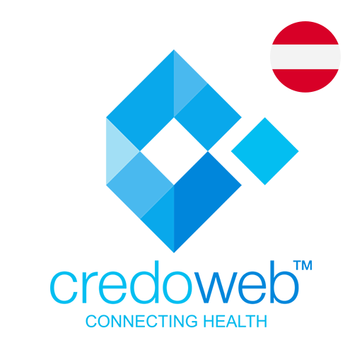
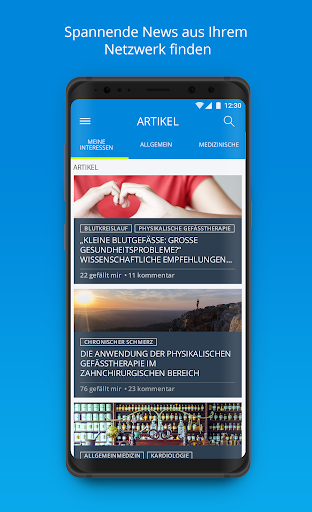
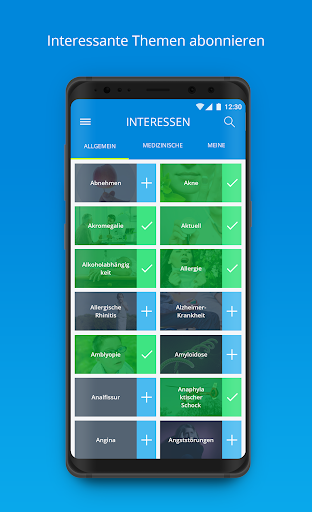

# CredoWeb Österreich – Ihr Gesundheitsnetzwerk!
App version ``2.4.6``

Analyzed with [covid-apps-observer](http://github.com/covid-apps-observer) project, version ``0.1``

## App overview
| | |
|-------------------------|-------------------------| 
| **Name**&nbsp;&nbsp;&nbsp;&nbsp;&nbsp;&nbsp;&nbsp;&nbsp;&nbsp;&nbsp;&nbsp;&nbsp;&nbsp;&nbsp;&nbsp;&nbsp;&nbsp;&nbsp;&nbsp;&nbsp;&nbsp;&nbsp;&nbsp;&nbsp;&nbsp;&nbsp;&nbsp;&nbsp;&nbsp;&nbsp;&nbsp;&nbsp;&nbsp;&nbsp;&nbsp;&nbsp;&nbsp;&nbsp;&nbsp;&nbsp;  | CredoWeb Österreich – Ihr Gesundheitsnetzwerk! |
| **Unique identifier** | at.credoweb.android |
| **Link to Google Play** | [https://play.google.com/store/apps/details?id=at.credoweb.android](https://play.google.com/store/apps/details?id=at.credoweb.android) |
| **Summary**  | CredoWeb verbindet die gesamte Gesundheitsbranche Österreichs in einer App! |
| **Privacy policy** | [https://www.credoweb.at/privacy-policy](https://www.credoweb.at/privacy-policy) |
| **Latest version** | 2.4.6 |
| **Last update** | 2020-10-18 17:47:16 |
| **Recent changes** | Niemand mag Bugs in der App - wir auch nicht!  Deshalb updaten wir CredoWeb regelmäßig und verbessern ständig unsere App.  Jedes Update enthält Fehlerbehebungen und Verbesserungen der Performance. |
| **Installs**  | 100+ |
| **Category** | Medizin |
| **First release** | 27.09.2017 |
| **Size**  | 55M |
| **Supported Android version**  | 5.0 oder höher |

### Description
> CredoWeb - Das österreichische Netzwerk für Gesundheit.
 www.CredoWeb.at verbindet die gesamte Gesundheitsbranche auf einer professionellen Plattform! Es ermöglicht Ärzten und allen Health Professionals sich mit Kollegen und der Öffentlichkeit zu unterhalten. Jeder kann ein kostenloses Profil erstellen und so sein medizinisches Leistungsspektrum optimal darstellen. 
 Durch CredoWeb erhalten alle einen professionellen Zugang zu Fachinformationen, aktuell und gefiltert nach Ihren Bedürfnissen. Bei der Suche nach einem bestimmten Themenbereich werden alle relevanten Artikel und Informationen, gleich gemeinsam mit den Kontaktdaten von spezialisierten ÄrztInnen aufgelistet. So fällt es PatientInnen leichter, sich gezielt über neue wissenschaftliche Erkenntnisse und mögliche Therapieoptionen zu informieren und auszutauschen. Noch einfacher kann man Arzt und Patient nicht zusammenbringen.
 App-Funktionen:
 • Artikel posten und Erfahrungen mit Kollegen austauschen
 • Aktuelle medizinische Informationen lesen
 • An virtuellen Diskussionen und Veranstaltungen teilnehmen

### User interface
The developers of the app provide the following screenshots in the Google play store.
| | | |
|:-------------------------:|:-------------------------:|:-------------------------:|
 |   |   |   | 
 |   |  

## Development team
In the following we report the main information provided by the development team in the Google play store.

| | |
|-------------------------|-------------------------|
| **Developer**  | CredoWeb Services |
| **Website**  | [http://www.credoweb.bg](http://www.credoweb.bg) |
| **Email** | it@credoweb.bg |
| **Physical address**  | - |
| **Other developed apps**  | [https://play.google.com/store/apps/developer?id=CredoWeb+Services](https://play.google.com/store/apps/developer?id=CredoWeb+Services) |

## Android support

| | |
|-------------------------|-------------------------|
| **Declared target Android version**  | Pie, version 9 (API level 28) |
| **Effective target Android version**  | Pie, version 9 (API level 28) |
| **Minimum supported Android version**  | KitKat, version 4.4 - 4.4.4 (API level 19) |
| **Maximum target Android version**  | - |

The larger the difference between the minimum and maximum supported Android versions, the better. A larger difference means a wider audience. For example, old phones have a very low Android version, so a high minimum supported Android version means that the app cannot be used by users with old phones, thus leading to accessibility problems. 

## Requested permissions

In the following we report the complete list of the permissions requested by the app. 

| **Permission** | **Protection level** | **Description** | 
|-------------------------|-------------------------|-------------------------|
 **android.permission ACCESS_FINE_LOCATION** | :warning:**Dangerous** | Allows an app to access precise location. 
 **android.permission ACCESS_NETWORK_STATE** | Normal | Allows applications to access information about networks. 
 **android.permission CAMERA** | :warning:**Dangerous** | Required to be able to access the camera device. 
 **android.permission INTERNET** | Normal | Allows applications to open network sockets. 
 **android.permission READ_APP_BADGE** | - | - 
 **android.permission READ_EXTERNAL_STORAGE** | :warning:**Dangerous** | Allows an application to read from external storage. 
 **android.permission READ_PHONE_STATE** | :warning:**Dangerous** | Allows read only access to phone state, including the phone number of the device, current cellular network information, the status of any ongoing calls, and a list of any PhoneAccounts registered on the device. 
 **android.permission RECEIVE_BOOT_COMPLETED** | Normal | Allows an application to receive the Intent.ACTION_BOOT_COMPLETED that is broadcast after the system finishes booting. 
 **android.permission VIBRATE** | Normal | Allows access to the vibrator. 
 **android.permission WAKE_LOCK** | Normal | Allows using PowerManager WakeLocks to keep processor from sleeping or screen from dimming. 
 **android.permission WRITE_EXTERNAL_STORAGE** | :warning:**Dangerous** | Allows an application to write to external storage. 
 **com.anddoes.launcher.permission UPDATE_COUNT** | - | - 
 **com.google.android.c2dm.permission RECEIVE** | - | - 
 **com.google.android.finsky.permission BIND_GET_INSTALL_REFERRER_SERVICE** | - | - 
 **com.htc.launcher.permission READ_SETTINGS** | - | - 
 **com.htc.launcher.permission UPDATE_SHORTCUT** | - | - 
 **com.huawei.android.launcher.permission CHANGE_BADGE** | - | - 
 **com.huawei.android.launcher.permission READ_SETTINGS** | - | - 
 **com.huawei.android.launcher.permission WRITE_SETTINGS** | - | - 
 **com.majeur.launcher.permission UPDATE_BADGE** | - | - 
 **com.oppo.launcher.permission READ_SETTINGS** | - | - 
 **com.oppo.launcher.permission WRITE_SETTINGS** | - | - 
 **com.sec.android.provider.badge.permission READ** | - | - 
 **com.sec.android.provider.badge.permission WRITE** | - | - 
 **com.sonyericsson.home.permission BROADCAST_BADGE** | - | - 
 **com.sonymobile.home.permission PROVIDER_INSERT_BADGE** | - | - 
 **me.everything.badger.permission BADGE_COUNT_READ** | - | - 
 **me.everything.badger.permission BADGE_COUNT_WRITE** | - | - 

## Mentioned servers

| **Server** | **Registrant** | **Registrant country** | **Creation date** | 
|-------------------------|-------------------------|-------------------------|-------------------------|
 | cloudfront.net | Amazon.com, Inc. | :us: US | 2008-04-25 18:25:49 |
 | credoweb.co | GDPR Masked | :us: US | 2017-11-08 16:15:36 |
 | lilly.com | Eli Lilly and Company | :us: US | 1991-05-10 04:00:00 |
 | google.com | Google LLC | :us: US | 1997-09-15 04:00:00 |
 | xmlpull.org | WhoisGuard, Inc. | PA | 2001-11-26 20:33:08 |
 | facebook.com | Facebook, Inc. | :us: US | 1997-03-29 05:00:00 |
 | googlesyndication.com | Google LLC | :us: US | 2003-01-21 06:17:24 |
 | doubleclick.net | Google Inc. | :us: US | 1996-01-16 05:00:00 |
 | gstatic.com | Google LLC | :us: US | 2008-02-11 15:31:25 |
 | googleapis.com | Google LLC | :us: US | 2005-01-25 17:52:26 |
 | app-measurement.com | Google LLC | :us: US | 2015-06-19 20:13:31 |
 | youtube.com | Google LLC | :us: US | 2005-02-15 05:13:12 |
 | googleapis.com | Google LLC | :us: US | 2005-01-25 17:52:26 |
 | credoweb.at | - | - | - |
 | credoweb.com | GDPR Masked | BG | 1999-08-04 17:12:46 |
 | crashlytics.com | Google LLC | :us: US | 2011-01-21 15:30:40 |

## Security analysis 

Below we report the main security warnings raised by our execution of the [Androwarn](https://github.com/maaaaz/androwarn) security analysis tool.

**Telephony identifiers leakage**
> - This application reads the device phone type value 
> - This application reads the numeric name (MCC+MNC) of current registered operator 
> - This application reads the operator name 
> - This application reads the radio technology (network type) currently in use on the device for data transmission 

**Connection interfaces exfiltration**
> - This application reads details about the currently active data network 
> - This application tries to find out if the currently active data network is metered 

**Telephony services abuse**
> - This application makes phone calls 

**Suspicious connection establishment**
> - This application opens a Socket and connects it to the remote address '' on the 'N/A' port  
> - This application opens a Socket and connects it to the remote address 'Ljava/lang/StringBuilder;->toString()Ljava/lang/String;' on the ': connect, resolve' port  
> - This application opens a Socket and connects it to the remote address 'Ljava/lang/StringBuilder;->toString()Ljava/lang/String;' on the 'N/A' port  
> - This application opens a Socket and connects it to the remote address 'Ljava/net/Proxy;->type()Ljava/net/Proxy$Type;' on the 'N/A' port  
> - This application opens a Socket and connects it to the remote address 'timeout' on the 'N/A' port  

**Pim data leakage**
> - This application accesses the downloads folder 
> - This application accesses data stored in the clipboard 

## User ratings and reviews

Below we provide information about how end users are reacting to the app in terms of ratings and reviews in the Google Play store.

### Ratings

The CredoWeb Österreich – Ihr Gesundheitsnetzwerk! app has been installed by more than **100** times. At this time, **8** rated the app and its average score is **5.0**. Below we show the distribution of the ratings across the usual star-based rating of Google Play

:star::star::star::star::star:: 8

:star::star::star::star:: 0

:star::star::star:: 0

:star::star:: 0

:star:: 0

### Reviews 

#### 5-star reviews

No recent reviews available with 5 stars.

#### 4-star reviews

No recent reviews available with 4 stars.

#### 3-star reviews

No recent reviews available with 3 stars.

#### 2-star reviews

No recent reviews available with 2 stars.

#### 1-star reviews

No recent reviews available with 1 stars.
