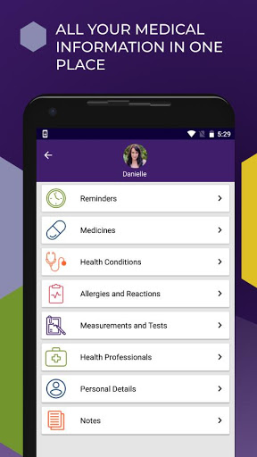
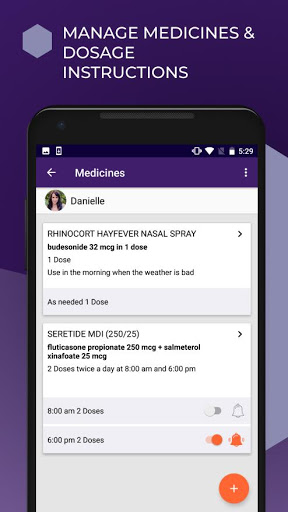
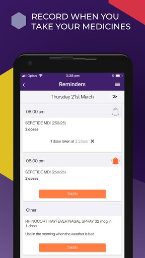
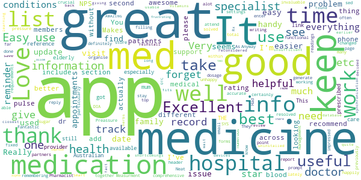
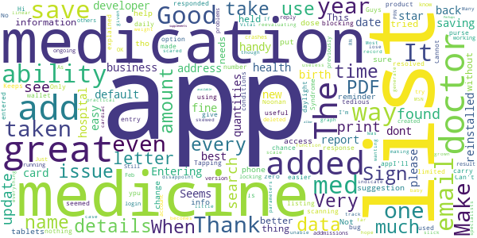
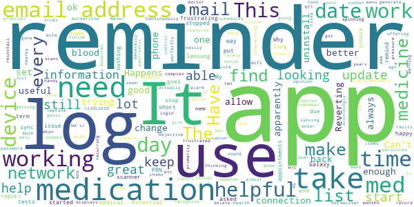
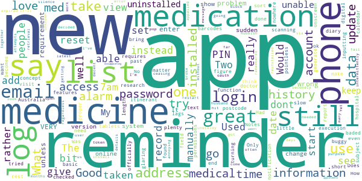
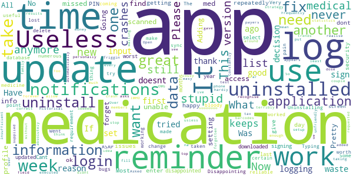

# Pill Reminder & Medication Reminder: MedicineWise
App version ``3.2.8``

Analyzed with [covid-apps-observer](http://github.com/covid-apps-observer) project, version ``0.1``

## App overview
| | |
|-------------------------|-------------------------| 
| **Name**&nbsp;&nbsp;&nbsp;&nbsp;&nbsp;&nbsp;&nbsp;&nbsp;&nbsp;&nbsp;&nbsp;&nbsp;&nbsp;&nbsp;&nbsp;&nbsp;&nbsp;&nbsp;&nbsp;&nbsp;&nbsp;&nbsp;&nbsp;&nbsp;&nbsp;&nbsp;&nbsp;&nbsp;&nbsp;&nbsp;&nbsp;&nbsp;&nbsp;&nbsp;&nbsp;&nbsp;&nbsp;&nbsp;&nbsp;&nbsp;  | Pill Reminder & Medication Reminder: MedicineWise |
| **Unique identifier** | au.org.nps.medicinelistplus |
| **Link to Google Play** | [https://play.google.com/store/apps/details?id=au.org.nps.medicinelistplus](https://play.google.com/store/apps/details?id=au.org.nps.medicinelistplus) |
| **Summary**  | MedicineWise: ad-free pill reminder &amp; tracker. Store &amp; share health info. 💊🔔⏰ |
| **Privacy policy** | [http://www.nps.org.au/about-this-website/privacy](http://www.nps.org.au/about-this-website/privacy) |
| **Latest version** | 3.2.8 |
| **Last update** | 2020-10-24 03:37:59 |
| **Recent changes** | Bug fixes and improvements including auto-logout issues some users are experiencing. For assistance or suggestions contact us: medicinewiseapp@nps.org.au |
| **Installs**  | 50,000+ |
| **Category** | Medical |
| **First release** | Dec 11, 2013 |
| **Size**  | 8.7M |
| **Supported Android version**  | 5.0 and up |

### Description
> Scan or search for medication, create medicines list, schedule reminders, store &
 share health information, learn more about your medicines and gain access to a
 large library of carer’s content for a stress-free and streamlined process.
 NPS MedicineWise is a not-for-profit health organisation, dedicated to creating a
 more MedicineWise Australia.
 ----------------------------------------------
 💊 KEY FEATURES
 ----------------------------------------------
 ● Create individual profiles
 ● Generate medicine list through barcode scanner or from database
 ● Medical conditions & allergy tracker
 ● Store contact information in case of emergency
 ● Pill tracker & schedule reminders and doctor’s appointments
 ● Quick access to Consumer Medicines Information (CMI)
 ● Track and share test results
 ● Cross-device compatible
 Whether you have carer responsibilities, take different types of medication or you
 have a busy lifestyle and need a reminder to take your medicine, MedicineWise
 makes the process stress free, streamlined and simple.
 📋 MEDICATION LOG
 Use the medicine scanner to scan barcodes and instantly add your item to the list, or
 search through the Australian medicines database. From there you can add dosage
 guidelines and use the calendar to schedule reminders to take your medicine and to
 remind those you care for, attend doctor appointments and more.
 As a carer, have peace of mind knowing you can now easily manage multiple
 medicines lists for all those you care for.
 ⏰ MEDS REMINDERS
 It’s easy to forget about taking medication, especially if you’re a busy person or have
 a lot of medicines to keep track of. With MedicineWise, you can use the handy
 calendar to schedule reminders to take your medicine or remind those you care for,
 attend doctor’s appointments and ensure that you keep on top of yours and the
 health regime of those you care for.
 As a carer, the Medicinewise app will help you remember medicines routine for all
 those you care for
 💊 ACCESS MEDICINES RESOURCES
 As well as managing your medication, you’ll have instant access to a huge range of
 useful learning resources and Consumer Medicines Information (CMI). From videos
 and webpages to downloadable PDFs, you’ll be able to learn more about your
 medicine and stay informed about your health.
 A large library of health-related content is available for Carers to help you care for
 others and look after yourself.
 􀀀STORE & SHARE IMPORTANT HEALTH INFORMATION
 From blood pressure tests to your body weight over time, you can store, track and
 graph tests as well as store important medical information such as allergies,
 conditions and contact details of healthcare professionals. You can share this
 information in just a few seconds via email.
 For more information or assistance with using the app, please contact us at
 MedicineWiseapp@nps.org.au or (02) 8217 8700. We are available to help you
 Monday-Friday 9AM-5PM AEST.
 <b>MEDICINE & HEALTH MANAGEMENT MADE EASY – DOWNLOAD MEDICINEWISE TODAY!</b>

### User interface
The developers of the app provide the following screenshots in the Google play store.
| | | |
|:-------------------------:|:-------------------------:|:-------------------------:|
 |   |   |   | 
 |  

## Development team
In the following we report the main information provided by the development team in the Google play store.

| | |
|-------------------------|-------------------------|
| **Developer**  | NPS Medicinewise |
| **Website**  | [https://www.nps.org.au/medical-info/consumer-info/medicinewise-app/](https://www.nps.org.au/medical-info/consumer-info/medicinewise-app/) |
| **Email** | medicinewiseapp@nps.org.au |
| **Physical address**  | - |
| **Other developed apps**  | [https://play.google.com/store/apps/developer?id=NPS+Medicinewise](https://play.google.com/store/apps/developer?id=NPS+Medicinewise) |

## Android support

| | |
|-------------------------|-------------------------|
| **Declared target Android version**  | Pie, version 9 (API level 28) |
| **Effective target Android version**  | Pie, version 9 (API level 28) |
| **Minimum supported Android version**  | Lollipop, version 5.0 (API level 21) |
| **Maximum target Android version**  | - |

The larger the difference between the minimum and maximum supported Android versions, the better. A larger difference means a wider audience. For example, old phones have a very low Android version, so a high minimum supported Android version means that the app cannot be used by users with old phones, thus leading to accessibility problems. 

## Requested permissions

In the following we report the complete list of the permissions requested by the app. 

| **Permission** | **Protection level** | **Description** | 
|-------------------------|-------------------------|-------------------------|
 **android.permission ACCESS_NETWORK_STATE** | Normal | Allows applications to access information about networks. 
 **android.permission CAMERA** | :warning:**Dangerous** | Required to be able to access the camera device. 
 **android.permission FLASHLIGHT** | - | - 
 **android.permission GET_ACCOUNTS** | :warning:**Dangerous** | Allows access to the list of accounts in the Accounts Service. 
 **android.permission GET_TASKS** | Deprecated | This constant was deprecated in API level 21. No longer enforced. 
 **android.permission INTERNET** | Normal | Allows applications to open network sockets. 
 **android.permission READ_EXTERNAL_STORAGE** | :warning:**Dangerous** | Allows an application to read from external storage. 
 **android.permission RECEIVE_BOOT_COMPLETED** | Normal | Allows an application to receive the Intent.ACTION_BOOT_COMPLETED that is broadcast after the system finishes booting. 
 **android.permission VIBRATE** | Normal | Allows access to the vibrator. 
 **android.permission WAKE_LOCK** | Normal | Allows using PowerManager WakeLocks to keep processor from sleeping or screen from dimming. 
 **android.permission WRITE_EXTERNAL_STORAGE** | :warning:**Dangerous** | Allows an application to write to external storage. 
 **android.permission WRITE_SYNC_SETTINGS** | Normal | Allows applications to write the sync settings. 
 **au.com.outware.caveman.nps ACCESS_DATA** | - | - 
 **au.org.nps.medicinelistplus.permission C2D_MESSAGE** | - | - 
 **au.org.nps.medicinelistplus.permission UA_DATA** | - | - 
 **com.google.android.c2dm.permission RECEIVE** | - | - 
 **com.google.android.finsky.permission BIND_GET_INSTALL_REFERRER_SERVICE** | - | - 

## Mentioned servers

| **Server** | **Registrant** | **Registrant country** | **Creation date** | 
|-------------------------|-------------------------|-------------------------|-------------------------|
 | snomed.info | IHTSDO | GB | 2001-09-13 05:40:58 |
 | sgizmo.com | - | :us: US | 2005-05-24 17:23:04 |
 | crashlytics.com | Google LLC | :us: US | 2011-01-21 15:30:40 |
 | facebook.com | Facebook, Inc. | :us: US | 1997-03-29 05:00:00 |
 | googlesyndication.com | Google LLC | :us: US | 2003-01-21 06:17:24 |
 | google.com | Google LLC | :us: US | 1997-09-15 04:00:00 |
 | google-analytics.com | Google LLC | :us: US | 2005-07-18 19:24:32 |
 | app-measurement.com | Google LLC | :us: US | 2015-06-19 20:13:31 |
 | urbanairship.com | DNStination Inc. | :us: US | 2009-04-14 06:34:46 |
 | asnapieu.com | DNStination Inc. | :us: US | 2019-05-15 21:27:07 |
 | hockeyapp.net | Microsoft Corporation | :us: US | 2011-01-23 18:46:43 |
 | hl7.org | Health Level Seven | :us: US | 1996-03-11 05:00:00 |
 | googleadservices.com | Google LLC | :us: US | 2003-06-19 16:34:53 |

## Security analysis 

Below we report the main security warnings raised by our execution of the [Androwarn](https://github.com/maaaaz/androwarn) security analysis tool.

**Telephony identifiers leakage**
> - This application reads the ISO country code equivalent of the current registered operator's MCC (Mobile Country Code) 
> - This application reads the numeric name (MCC+MNC) of current registered operator 
> - This application reads the operator name 

**Location lookup**
> - This application reads location information from all available providers (WiFi, GPS etc.) 

**Connection interfaces exfiltration**
> - This application reads details about the currently active data network 

**Telephony services abuse**
> - This application makes phone calls 

**Suspicious connection establishment**
> - This application opens a Socket and connects it to the remote address '' on the 'N/A' port  
> - This application opens a Socket and connects it to the remote address 'Ljava/lang/StringBuilder;->toString()Ljava/lang/String;' on the 'N/A' port  
> - This application opens a Socket and connects it to the remote address 'Ljava/net/Proxy;->type()Ljava/net/Proxy$Type;' on the 'N/A' port  
> - This application opens a Socket and connects it to the remote address 'timeout' on the 'N/A' port  

**Pim data leakage**
> - This application accesses the calendar 
> - This application accesses data stored in the clipboard 

## User ratings and reviews

Below we provide information about how end users are reacting to the app in terms of ratings and reviews in the Google Play store.

### Ratings

The Pill Reminder & Medication Reminder: MedicineWise app has been installed by more than **50000** times. At this time, **400** rated the app and its average score is **3.57**. Below we show the distribution of the ratings across the usual star-based rating of Google Play

:star::star::star::star::star:: 184

:star::star::star::star:: 48

:star::star::star:: 56

:star::star:: 36

:star:: 76

### Reviews 

#### 5-star reviews

> Excellent  :date: __2020-10-05 08:56:12__

> Very helpful  :date: __2020-06-06 11:18:49__

> Great app to store info  :date: __2020-04-16 10:53:40__

> Love it. I forget all the time to take my meds  :date: __2020-04-15 13:37:17__

> I'm 73 and find this app great for meds reminders  :date: __2020-02-14 09:57:04__

> Neat app to organise your medications. You can also enter you blood pressure, sugar readings and generate a useful report for that. Well done NPS, I will certainly recommend it for my patients.  :date: __2019-12-26 09:15:47__

> It's great - As a Hospital Pharmacist I will happily recommend it to patients 😃  :date: __2019-12-03 22:36:47__

> Had some problems with the update but these have resolved. It's actually now better than before. I can now email my medicines list without the header of the second page over writing the list at that point. Anyway, this is definitely the best app to keep all of your medicines together for when you need it.  :date: __2019-07-05 00:10:02__

> very good app  :date: __2019-06-25 09:18:36__

> I use this app to keep track of and give accurate information on my many medications. Also great for when I attend hospital & specialists when they need to know all my meds & dosage. Great functional app.  :date: __2019-06-25 01:45:56__

#### 4-star reviews

> Hi Guys, thanks for your great product. Is there any chance of a no sign in option? Sign in bug again after every update.  :date: __2020-10-13 00:01:12__

> Only a limited number of medicines found by scanning, but all were found by name search. No ability that i could see to print out the list which would be useful to carry in a wallet or purse. Entering date of birth seemed very tedious but the developer responded and explained the best way to get back to the year of birth which made it easy. Good response from the developer. Added a star!  :date: __2020-06-06 02:36:22__

> Can't print or save details to give to my doctors.  :date: __2020-04-21 09:33:59__

> Good once ypu get used to it have been using for about 5 years  :date: __2019-09-10 04:21:34__

> Cannot add daily quantities of medication. Keeps blocking any quantities entered.Even the default is added as above. It defaults back to zero.Tapping the entry does nothing.  :date: __2019-07-15 14:38:38__

> a very handy appI'll  :date: __2019-06-26 10:32:47__

> Good app, have resolved daylight saving issue, but could you please add Noonan Syndrome to the list of health conditions?  :date: __2019-04-13 11:15:01__

> Makes listing medications so much easier at a new doctor or hospital addmissions  :date: __2018-12-06 05:55:33__

> Good app but every time I try to add one of my medications it crashes. Just this one medication. The others added fine.  :date: __2018-04-08 00:03:04__

> I had previously deleted this app because of login problems and ongoing issues with locking up. I have now reinstalled the app (Feb 2018) and created a new account. Seems to be working OK. Still don't know what version I'm  running!  :date: __2018-02-16 12:48:51__

#### 3-star reviews

> Was working perfectly until a couple of months ago. Now logs me out and will not recognise my login. Have to uninstall, reinstall. Happens every 2-3 days.  :date: __2020-10-21 00:15:29__

> A borderline app in my opinion. Just enough features to make it useful, almost enough faults to make me uninstall. The app tries to do it all and with this objective limits user control . I don't want reminders but it's more complex than it needs to be to change them. Can't easily add or delete menu items. I use more than one device but apparently the app won't allow two devices to log in simultaneously but there's no warning of this. App is ok, but could be much better  :date: __2020-08-01 08:46:40__

> Continuously displays the 'spinning circle' when trying to e-mail medicine list or syncing with good wifi network/4G connection. Never times out and rarely e-mails or syncs. Have persisted for some years but doesn't really improve in these network issues. 12JUL2020: Reverting to v3.2.3 (2 updates back) allows the network connections/e-mail to work.  :date: __2020-07-12 13:48:37__

> It would be a helpful app however I wish the reminders could actually be set to make a sound/alarm. I cannot seem to find such option. I am not always looking at my phone or have it nearby to SEE a reminder.  :date: __2020-05-13 12:20:01__

> This app seemed great at the start offering helpful things like blood pressure reports etc. its now very frustrating. When trying to generate a report it goes into thinking mode and nothing happens. IT then asked me to log back in and when I did all medication data had gone. This app promises the world but doesn't deliver ☹️  :date: __2019-07-16 08:06:14__

> Interesting changes, frustrated that you now have to enter password every time you log in.  :date: __2019-06-25 10:24:47__

> very helpful when going to hospital or new doctor.  :date: __2019-06-25 08:11:37__

> Generally useful but it would be handy to be able to put in recurring appointments and also record health events such as scans and blood tests. My wife has just started chemo for pancreatic cancer and there are a lot of appointments and tests to remember. I guess it is primarily there for medicines - which it does well, but being able to put start and finish dates on the schedules that set the reminders accordingly would help a lot.  :date: __2019-01-02 02:36:43__

> I am not always getting the reminders to take medication. And I am looking for a way to know what time I took a PRN medication and when it is next due, I do not take PRN meds at the same time every day, for it depends on when I need them.  :date: __2018-12-29 23:56:19__

> I got this app so that I would get reminders for my meds, but the reminder apparently does not work for the Samsung Galaxy S7! Is this able to be fixed, if not I will need to look for an app that will give reminders. Cheers  :date: __2018-11-19 00:53:07__

#### 2-star reviews

> No medicines found by scanning but ok inputting manually. Only shows 4 of my medicines instead of 8. How do I view the rest.  :date: __2020-06-25 15:55:41__

> Does not even barcodes from any of my medicines requires a postcode for Australia when I am itinerant and officially don't have one! Two glaring problems that make me think little research was done!  :date: __2020-04-16 01:57:41__

> I can't access data. Had password reset still can't get in  :date: __2019-11-27 00:08:26__

> A bit basic really  :date: __2019-08-15 03:37:23__

> Good concept, but buggy execution.  :date: __2019-05-05 00:48:18__

> the app has great features and can add plenty of information, but no matter what I try I can't get it to give me a notification or reminder for when to take my tablets. I tried turning the reminders off and on, and I checked all the permissions but still can't figure it out.  :date: __2019-04-30 23:04:52__

> while this app is good, theres nowhere for me to view a history of the meds taken or when. rather i need to generate and email a report which is a bit pointless if i just want to see it onscreen.. also the medicine start and end dates dont bring up a calendar, rather is a text baded field?????  :date: __2019-01-04 12:38:27__

> Was great to start with but if you add more than one or two people it becomes slow and lags. Also time out length is to short.  :date: __2018-10-05 06:10:43__

> The app won't email my medication list.  :date: __2018-07-28 06:48:03__

> Good digital record of medications.. great for visit to new 
doctor/hospital. Would love a proper diary function for past history. Would 
love to be able to sort by date and subject. I use Notes for this purpose 
but unwieldy doesn't work too well  :date: __2018-05-13 10:40:38__

#### 1-star reviews

> Frequently signs you out (appears to be after each update). So notifications stop, then I personally forget to take any meds for a couple of days because I don't realise. Going to find another strategy.  :date: __2020-10-11 02:49:33__

> I missed my dose 3 times, keeps logging out automatically when med is once a week. Useless.  :date: __2020-09-30 01:44:15__

> useless application, a good idea, that has been terribly executed. IMHO a waste of tax payers money. All my medications couldn't be added because it didnt recognise the barcodes. Adding family members doesnt mean they get access to the same info. adding statistics and test results doesnt allow you to see trends oe ar historical information.  :date: __2020-08-13 13:09:00__

> Pretty lousy the app could not find at least one medication out of 13 that I scanned. Was unable to fill out field for reasons for taking medication. Too much friggin around with this. No thanks, I can put all info on my profile on the phone easy enough. Uninstall this one I think.  :date: __2020-07-18 23:57:48__

> OMG this app is sooooooo stupid i tried setting the up and gave up and uninstalled the app. usless as  :date: __2020-04-17 09:35:41__

> Useless. All it does is crash repeatedly  :date: __2019-10-18 05:52:36__

> I have issues logging on every time I use it. Takes forever to log in when it does. Most of the time I just give up waiting. Seemed ok first day of use but now I can never log in.  :date: __2019-08-26 03:45:07__

> App requested to sign up. Great. Asked to set PIN for security. Open the app, enter correct PIN then it asks to sign in again. Over the top security requirements.  :date: __2019-07-30 01:09:38__

> na no good  :date: __2019-06-29 00:57:34__

> i was getting notifications and all but now i dont get any so now i have forgotten to take some medication, not happy with the app anymore very disappointed, now ive updated it and still don't get any notifications whats going on this is stupid  :date: __2019-06-26 00:14:49__

