# GiveBlood
App version ``2.16.4``

Analyzed with [covid-apps-observer](http://github.com/covid-apps-observer) project, version ``0.1``

## App overview
| | |
|-------------------------|-------------------------| 
| **Name**&nbsp;&nbsp;&nbsp;&nbsp;&nbsp;&nbsp;&nbsp;&nbsp;&nbsp;&nbsp;&nbsp;&nbsp;&nbsp;&nbsp;&nbsp;&nbsp;&nbsp;&nbsp;&nbsp;&nbsp;&nbsp;&nbsp;&nbsp;&nbsp;&nbsp;&nbsp;&nbsp;&nbsp;&nbsp;&nbsp;&nbsp;&nbsp;&nbsp;&nbsp;&nbsp;&nbsp;&nbsp;&nbsp;&nbsp;&nbsp;  | GiveBlood |
| **Unique identifier** | ca.blood.giveblood |
| **Link to Google Play** | [https://play.google.com/store/apps/details?id=ca.blood.giveblood](https://play.google.com/store/apps/details?id=ca.blood.giveblood) |
| **Summary**  | Canadian Blood Services App for booking life-giving blood donation appointments. |
| **Privacy policy** | [https://myaccount.blood.ca/en/terms-use#privacy-policy](https://myaccount.blood.ca/en/terms-use#privacy-policy) |
| **Latest version** | 2.16.4 |
| **Last update** | 2020-10-21 14:28:33 |
| **Recent changes** | - Bug fixes |
| **Installs**  | 100,000+ |
| **Category** | Medical |
| **First release** | May 2, 2014 |
| **Size**  | 39M |
| **Supported Android version**  | 4.4 and up |

### Description
> GiveBlood is the official app of Canadian Blood Services. This app makes it easy for donors in Canada (excluding Quebec) to book, manage and keep track of their donations on the go. Users can locate their nearest donor centres and confirm their donation appointment with ease and efficiency.
 Features:
 • Search for donation centres near you
 • Use your current location to map local centres, and view their services and amenities
 • Bookmark your favourite locations
 • View available time slots
 • Book, view or cancel a donation appointment
 • Add appointments and reminders to your calendar
 • Easily sign-up or sign-in to access your account information
 • View and manage your personal profile 
 • View and manage your notification settings
 • Store and retrieve your donor card 
 • View your donation history
 • Share your donation history on social
 • Receive news and updates
 • Send feedback
 GiveBlood is available in English and French. The displayed version corresponds to the language that you have selected in your device settings.

### User interface
The developers of the app provide the following screenshots in the Google play store.
| | | |
|:-------------------------:|:-------------------------:|:-------------------------:|
 | 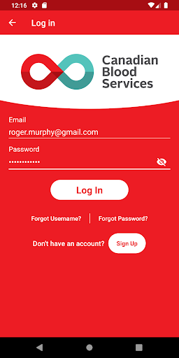  | 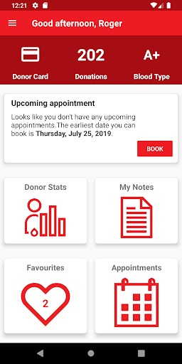  | 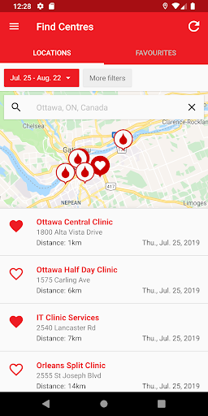  | 
 | 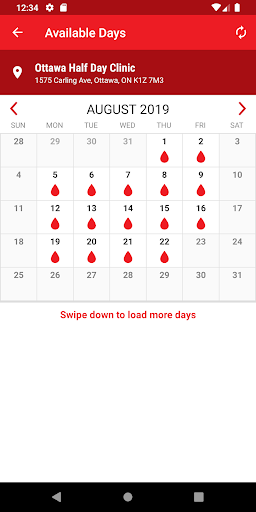  | 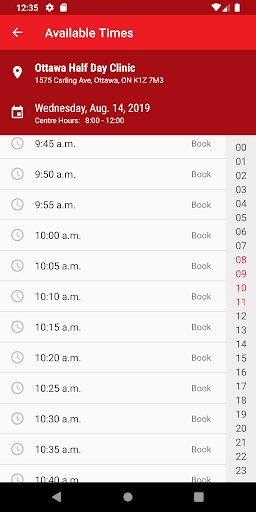  | 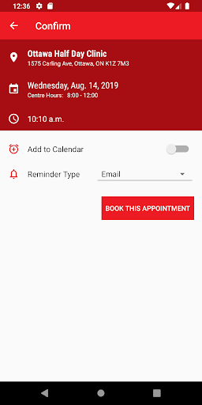  | 
 | 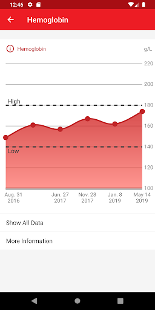  |  

## Development team
In the following we report the main information provided by the development team in the Google play store.

| | |
|-------------------------|-------------------------|
| **Developer**  | Canadian Blood Services |
| **Website**  | [https://www.blood.ca](https://www.blood.ca) |
| **Email** | feedback@blood.ca |
| **Physical address**  | - |
| **Other developed apps**  | [https://play.google.com/store/apps/developer?id=Canadian+Blood+Services](https://play.google.com/store/apps/developer?id=Canadian+Blood+Services) |

## Android support

| | |
|-------------------------|-------------------------|
| **Declared target Android version**  | Android10, version 10 (API level 29) |
| **Effective target Android version**  | Android10, version 10 (API level 29) |
| **Minimum supported Android version**  | KitKat, version 4.4 - 4.4.4 (API level 19) |
| **Maximum target Android version**  | - |

The larger the difference between the minimum and maximum supported Android versions, the better. A larger difference means a wider audience. For example, old phones have a very low Android version, so a high minimum supported Android version means that the app cannot be used by users with old phones, thus leading to accessibility problems. 

## Requested permissions

In the following we report the complete list of the permissions requested by the app. 

| **Permission** | **Protection level** | **Description** | 
|-------------------------|-------------------------|-------------------------|
 **android.permission ACCESS_COARSE_LOCATION** | :warning:**Dangerous** | Allows an app to access approximate location. 
 **android.permission ACCESS_FINE_LOCATION** | :warning:**Dangerous** | Allows an app to access precise location. 
 **android.permission ACCESS_NETWORK_STATE** | Normal | Allows applications to access information about networks. 
 **android.permission ACCESS_WIFI_STATE** | Normal | Allows applications to access information about Wi-Fi networks. 
 **android.permission CAMERA** | :warning:**Dangerous** | Required to be able to access the camera device. 
 **android.permission GET_ACCOUNTS** | :warning:**Dangerous** | Allows access to the list of accounts in the Accounts Service. 
 **android.permission INTERNET** | Normal | Allows applications to open network sockets. 
 **android.permission READ_CALENDAR** | :warning:**Dangerous** | Allows an application to read the user's calendar data. 
 **android.permission READ_EXTERNAL_STORAGE** | :warning:**Dangerous** | Allows an application to read from external storage. 
 **android.permission RECEIVE_BOOT_COMPLETED** | Normal | Allows an application to receive the Intent.ACTION_BOOT_COMPLETED that is broadcast after the system finishes booting. 
 **android.permission VIBRATE** | Normal | Allows access to the vibrator. 
 **android.permission WAKE_LOCK** | Normal | Allows using PowerManager WakeLocks to keep processor from sleeping or screen from dimming. 
 **android.permission WRITE_CALENDAR** | :warning:**Dangerous** | Allows an application to write the user's calendar data. 
 **android.permission WRITE_EXTERNAL_STORAGE** | :warning:**Dangerous** | Allows an application to write to external storage. 
 **com.google.android.c2dm.permission RECEIVE** | - | - 
 **com.google.android.finsky.permission BIND_GET_INSTALL_REFERRER_SERVICE** | - | - 
 **com.google.android.providers.gsf.permission READ_GSERVICES** | - | - 

## Mentioned servers

| **Server** | **Registrant** | **Registrant country** | **Creation date** | 
|-------------------------|-------------------------|-------------------------|-------------------------|
 | googleapis.com | Google LLC | :us: US | 2005-01-25 17:52:26 |
 | connectedinteractive.com | Connected Interactive | :canada: CA | 2010-05-15 18:46:01 |
 | facebook.com | Facebook, Inc. | :us: US | 1997-03-29 05:00:00 |
 | google.com | Google LLC | :us: US | 1997-09-15 04:00:00 |
 | googlesyndication.com | Google LLC | :us: US | 2003-01-21 06:17:24 |
 | doubleclick.net | Google Inc. | :us: US | 1996-01-16 05:00:00 |
 | gstatic.com | Google LLC | :us: US | 2008-02-11 15:31:25 |
 | googleapis.com | Google LLC | :us: US | 2005-01-25 17:52:26 |
 | app-measurement.com | Google LLC | :us: US | 2015-06-19 20:13:31 |
 | googleapis.com | Google LLC | :us: US | 2005-01-25 17:52:26 |
 | w3.org | W3C | :us: US | 1994-07-06 04:00:00 |
 | apache.org | The Apache Software Foundation | :us: US | 1995-04-11 04:00:00 |
 | crashlytics.com | Google LLC | :us: US | 2011-01-21 15:30:40 |
 | googleapis.com | Google LLC | :us: US | 2005-01-25 17:52:26 |
 | googleadservices.com | Google LLC | :us: US | 2003-06-19 16:34:53 |
 | xml.org | OASIS Open | :us: US | 1997-02-03 05:00:00 |

## Security analysis 

Below we report the main security warnings raised by our execution of the [Androwarn](https://github.com/maaaaz/androwarn) security analysis tool.

**Telephony identifiers leakage**
> - This application reads the device phone type value 
> - This application reads the numeric name (MCC+MNC) of current registered operator 
> - This application reads the operator name 
> - This application reads the radio technology (network type) currently in use on the device for data transmission 

**Connection interfaces exfiltration**
> - This application reads details about the currently active data network 
> - This application tries to find out if the currently active data network is metered 

**Telephony services abuse**
> - This application makes phone calls 

**Suspicious connection establishment**
> - This application opens a Socket and connects it to the remote address '' on the 'N/A' port  
> - This application opens a Socket and connects it to the remote address 'Ljava/lang/StringBuilder;->toString()Ljava/lang/String;' on the 'N/A' port  
> - This application opens a Socket and connects it to the remote address 'Ljava/net/Proxy;->type()Ljava/net/Proxy$Type;' on the 'N/A' port  
> - This application opens a Socket and connects it to the remote address 'timeout' on the 'N/A' port  

**Code execution**
> - This application loads a native library 
> - This application loads a native library: 'c++_shared' 
> - This application loads a native library: 'jniPdfium' 
> - This application loads a native library: 'modft2' 
> - This application loads a native library: 'modpdfium' 
> - This application loads a native library: 'modpng' 
> - This application loads a native library: 'pl_droidsonroids_gif' 

## User ratings and reviews

Below we provide information about how end users are reacting to the app in terms of ratings and reviews in the Google Play store.

### Ratings

The GiveBlood app has been installed by more than **100000** times. At this time, **4428** rated the app and its average score is **4.8986783**. Below we show the distribution of the ratings across the usual star-based rating of Google Play

:star::star::star::star::star:: 4156

:star::star::star::star:: 185

:star::star::star:: 39

:star::star:: 9

:star:: 39

### Reviews 

#### 5-star reviews

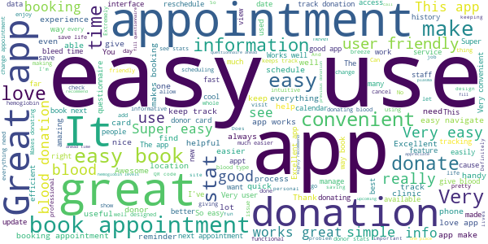

> The staff are absolutely wonderful! The whole experience was not stressful at all. All staff and volunteers are amazing.  :date: __2020-10-26 03:51:17__

> Works great and easy to use.  :date: __2020-10-26 00:20:22__

> I love to donate my blood  :date: __2020-10-24 16:44:36__

> Great interface. Easy to use.  :date: __2020-10-22 19:32:38__

> Always great staff!  :date: __2020-10-21 21:12:44__

> Appreciate the reminder notices for upcoming appointments Staff welcoming and professional.  :date: __2020-10-20 16:41:25__

> Such a simple and useful application. No problems that I can find!  :date: __2020-10-20 03:35:02__

> Great app. Works well!  :date: __2020-10-20 00:40:56__

> App works well, reminds you of when you can book an appointment, the scheduling function is easy.  :date: __2020-10-19 18:17:38__

> Makes it easy to schedule and reschedule appointments. I really like the stat tracking, and the appointment reminders. One reccommendation: please don't have the clinic search default to whole blood. I thought the app wouldn't allow me to book plasma appointments.  :date: __2020-10-19 01:59:35__

#### 4-star reviews

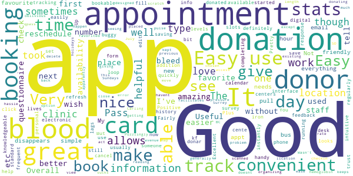

> Works well.  :date: __2020-10-16 06:04:03__

> It looks nice, and better than phone booking. It's also nice that you can fill out the survey, get a Q-Pass easily, have a digital donor card, and track your stats. But it's buggy sometimes, and I don't usually trust the "available days" calendar since days "without availability" still have bookable slots when you click them.  :date: __2020-09-29 02:04:44__

> Very knowledgeable staff  :date: __2020-09-27 15:46:07__

> Easy and convenient  :date: __2020-09-17 17:17:52__

> Great interface for saving lives.  :date: __2020-08-02 20:49:21__

> The app is handy for having all your info in one place, definitely helpful for the electronic questionnaire and q-pass  :date: __2020-07-15 16:15:01__

> Good  :date: __2020-06-30 21:25:16__

> good  :date: __2020-06-23 16:17:58__

> Took a bit to get started, help desk was amazing. Up and running now, booking appointments into 2021.  :date: __2020-05-22 09:16:40__

> It would be amazing if the app could tell you when your blood donation was used by someone. Positive feedback loop.  :date: __2020-05-12 00:31:30__

#### 3-star reviews

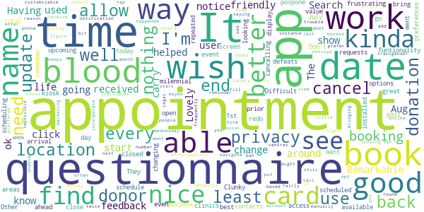

> It would be nice if you received a notice when your blood is used. Having that feedback to know you helped change a life.  :date: __2020-10-11 01:35:08__

> The dates just show up as Aug...so you have to click on it to find the date and if the date isn't going to work you have to start all over again, not very user friendly.  :date: __2020-07-22 00:44:38__

> Good  :date: __2020-05-25 13:04:37__

> Remarkable. Lovely!  :date: __2020-04-27 03:37:33__

> Its ok and i like not having to carry my card around. Search funtionality is kinda frustrating.  :date: __2020-02-17 02:43:46__

> Difficult to find clinics in rural areas  :date: __2019-11-08 01:22:05__

> Clunky at best  :date: __2019-11-04 20:29:31__

> I wish I was able to see upcoming appointments even when I have an appointment scheduled as I want to see if any other better options are available before cancelling my appointment  :date: __2019-07-31 01:49:56__

> Don't like the repeated requests for access to contacts & location. I'm not a milennial. I value my privacy. Wish the app would remember my privacy preferences. Other than that, it works well.  :date: __2019-07-20 22:54:21__

> I had book an appointment on 1st July and the location was not open on that day and its not update and I went there for nothing. It should at least update the schedule if the event is cancel or pospone.  :date: __2019-07-02 21:41:11__

#### 2-star reviews

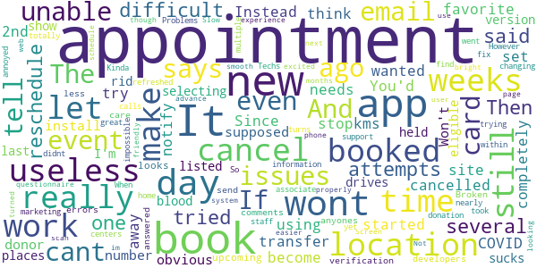

> Since the COVID-19 started, the app has become useless. Book at your favorite location and they cancel the event about 6 weeks before. You'd think if they have issues with a site, they'd just stop using it completely. Instead they try to transfer the set appointments 15 kms away. If they cancel an event, they should just notify you the appointment is cancelled. If we wanted an appointment at the 2nd location, we would have booked it there. The app needs to do what it is supposed to do.  :date: __2020-07-31 04:41:28__

> Won't let me install my donor card number  :date: __2020-05-27 03:17:25__

> It was not obvious how to book a time after selecting a day.  :date: __2020-04-24 22:46:14__

> The new version sucks. I cant make new appointments . It doesn't tell me when I'm eligible to make new appointments and wont tell me where blood drives are being held because my last appointment is still listed ( I cant get rid of it) and it says it wont show new places while I have an upcoming (3 weeks ago) appointment. And by the looks of it the developers could care less that there are these errors because they've not answered anyones comments.  :date: __2019-12-10 22:25:15__

> Broken. It wont send me verification email but I still get all the marketing emails. Techs support and staff at the donation centers unable to fix the issues and associate my card with the app even after multiple calls and locations and attempts. So it's useless.  :date: __2019-11-22 21:30:48__

> Useless  :date: __2019-10-16 18:18:10__

> Problems changing appointment times within the same day  :date: __2019-09-27 15:09:36__

> I find the information great. However trying to book an appointment is nearly impossible. It took several attempts  :date: __2019-09-25 23:45:26__

> Kinda annoyed really... tried to reschedule on the app and as it turns out it was unable to do so while I was at work. When I went to do it at home it said I had an appointment in 12 days. Then it refreshed and said I didnt have one booked yet. Then I had to make a totally new appointment. And on appointment day it is really difficult to get the questionnaire to work properly. Not a very smooth system in my experience.  :date: __2019-09-10 05:56:10__

> Slow, difficult to use, still says my appointment from 2 weeks ago is booked so it won't let me schedule my next. Screen has to be turned very bright to scan  :date: __2019-09-03 15:37:28__

#### 1-star reviews

> It won't let me book my next appointment after going to my first one. I'll have to call now.  :date: __2020-10-15 01:50:02__

> Unacceptable password reset system. Frustrating. Poor instructions.  :date: __2020-09-21 11:19:14__

> Demanded my donor number "if " I had received it already. I hadn't but it would not let me continue. The registration seemed to suggest I didn't need my number yet, hence the "If". I'm trying to do my part and I can't believe this app won't let me register.  :date: __2020-07-17 05:44:17__

> Garbage app, we need blood donations an myself, wife and kid cannot register because we all apparently have accounts... What a joke. Still a garbage app. I've registered and now I am not able to get into my account. I've set up a new password, then inputted said password and it says it's still wrong. Absolute trash of an application, all I want to do is donate blood.  :date: __2020-05-23 22:09:00__

> There was no q-pass on the app after completing the questionnaire on my laptop so I had to redo it on my tiny cell screen 😑😠  :date: __2020-04-29 16:39:39__

> Booking Plasma appointments do not work.  :date: __2020-03-24 01:58:27__

> Appointment times don't load  :date: __2020-03-17 21:12:34__

> This app never works. Every time I log in, it gives me problems. Either it can't find any donor centres near me (there are many close by) or it doesn't let me log in and tells me an error has occurred. I hate it.  :date: __2020-03-15 21:01:27__

> Bad  :date: __2020-01-24 18:40:54__

> Unfortunately, the app doesn't work. Keeps loading forever.  :date: __2019-12-18 15:43:36__

