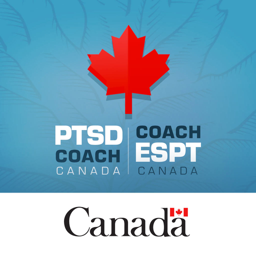
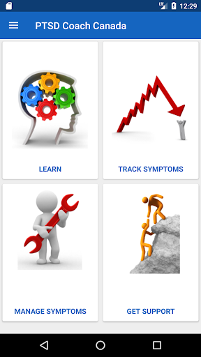
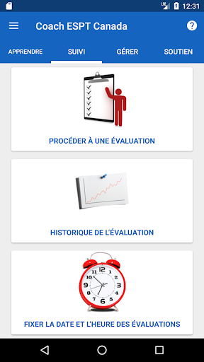
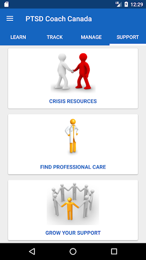
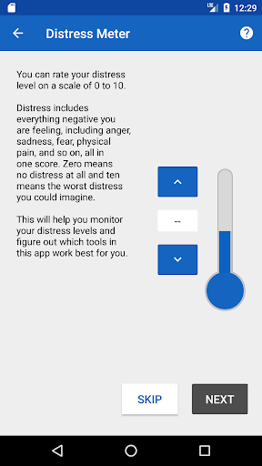
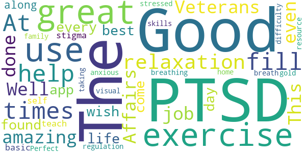
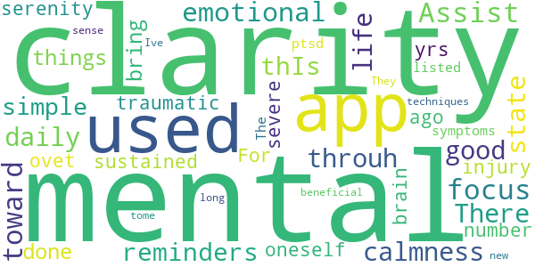
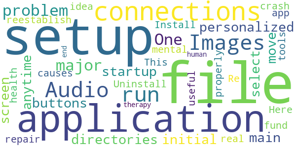
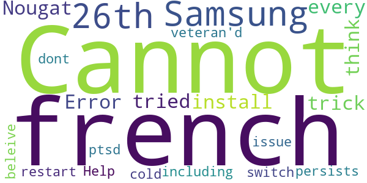
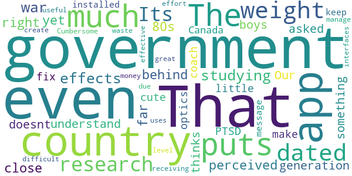

# PTSD Coach Canada
App version ``2.0``

Analyzed with [covid-apps-observer](http://github.com/covid-apps-observer) project, version ``0.1``

## App overview
| | |
|-------------------------|-------------------------| 
| **Name**&nbsp;&nbsp;&nbsp;&nbsp;&nbsp;&nbsp;&nbsp;&nbsp;&nbsp;&nbsp;&nbsp;&nbsp;&nbsp;&nbsp;&nbsp;&nbsp;&nbsp;&nbsp;&nbsp;&nbsp;&nbsp;&nbsp;&nbsp;&nbsp;&nbsp;&nbsp;&nbsp;&nbsp;&nbsp;&nbsp;&nbsp;&nbsp;&nbsp;&nbsp;&nbsp;&nbsp;&nbsp;&nbsp;&nbsp;&nbsp;  | PTSD Coach Canada |
| **Unique identifier** | ca.gc.veterans.ptsd.ptsdcoach |
| **Link to Google Play** | [https://play.google.com/store/apps/details?id=ca.gc.veterans.ptsd.ptsdcoach](https://play.google.com/store/apps/details?id=ca.gc.veterans.ptsd.ptsdcoach) |
| **Summary**  | PTSD Coach Canada app |
| **Privacy policy** | [https://www.veterans.gc.ca/eng/about-vac/terms-and-conditions](https://www.veterans.gc.ca/eng/about-vac/terms-and-conditions) |
| **Latest version** | 2.0 |
| **Last update** | 2019-03-30 16:15:48 |
| **Recent changes** | - Language switching is now integrated into the app Settings menu (in the previous version the language setting was based on device language) - New tools have been added to help with the management of distress associated with PTSD - The educational content has been updated to align with the most current information on PTSD (DSM-V) - The assessment tool has been updated to align with DSM-V |
| **Installs**  | 5,000+ |
| **Category** | Medical |
| **First release** | May 3, 2013 |
| **Size**  | 83M |
| **Supported Android version**  | 6.0 and up |

### Description
> The PTSD Coach Canada app can help you learn about and manage symptoms that can occur after trauma.
  
 This application is always with you when you need it and provides:
  
 Education about PTSD;
 A self-assessment tool;
 Tools for managing the distress associated with post-traumatic stress;
 Information on crisis support;
 Information about professional treatment.
  
 If you have, or think you might have PTSD, this app is for you. PTSD Coach Canada provides you with information and self-help tools based on research findings. The app can be used as an education and symptom management tool, prior to, or as part of face-to-face care with a mental health professional. Family and friends can also learn from this app.

### User interface
The developers of the app provide the following screenshots in the Google play store.
| | | |
|:-------------------------:|:-------------------------:|:-------------------------:|
 |   |   |   | 
 |   |  

## Development team
In the following we report the main information provided by the development team in the Google play store.

| | |
|-------------------------|-------------------------|
| **Developer**  | Veterans Affairs (VAC) / Anciens Combattants (ACC) |
| **Website**  | [http://veterans.gc.ca](http://veterans.gc.ca) |
| **Email** | christopher.clissold@canada.ca |
| **Physical address**  | - |
| **Other developed apps**  | [https://play.google.com/store/apps/developer?id=Veterans+Affairs+(VAC)+/+Anciens+Combattants+(ACC)](https://play.google.com/store/apps/developer?id=Veterans+Affairs+(VAC)+/+Anciens+Combattants+(ACC)) |

## Android support

| | |
|-------------------------|-------------------------|
| **Declared target Android version**  | Pie, version 9 (API level 28) |
| **Effective target Android version**  | Pie, version 9 (API level 28) |
| **Minimum supported Android version**  | Marshmallow, version 6.0 (API level 23) |
| **Maximum target Android version**  | - |

The larger the difference between the minimum and maximum supported Android versions, the better. A larger difference means a wider audience. For example, old phones have a very low Android version, so a high minimum supported Android version means that the app cannot be used by users with old phones, thus leading to accessibility problems. 

## Requested permissions

In the following we report the complete list of the permissions requested by the app. 

| **Permission** | **Protection level** | **Description** | 
|-------------------------|-------------------------|-------------------------|
 **android.permission ACCESS_FINE_LOCATION** | :warning:**Dangerous** | Allows an app to access precise location. 
 **android.permission ACCESS_NETWORK_STATE** | Normal | Allows applications to access information about networks. 
 **android.permission INTERNET** | Normal | Allows applications to open network sockets. 
 **android.permission READ_CONTACTS** | :warning:**Dangerous** | Allows an application to read the user's contacts data. 
 **android.permission READ_EXTERNAL_STORAGE** | :warning:**Dangerous** | Allows an application to read from external storage. 
 **android.permission RECEIVE_BOOT_COMPLETED** | Normal | Allows an application to receive the Intent.ACTION_BOOT_COMPLETED that is broadcast after the system finishes booting. 
 **android.permission RECORD_AUDIO** | :warning:**Dangerous** | Allows an application to record audio. 
 **android.permission WRITE_EXTERNAL_STORAGE** | :warning:**Dangerous** | Allows an application to write to external storage. 

## Mentioned servers

| **Server** | **Registrant** | **Registrant country** | **Creation date** | 
|-------------------------|-------------------------|-------------------------|-------------------------|
 | flurry.com | Oath Inc. | :us: US | 1998-05-04 04:00:00 |
 | parse.com | Parse, LLC. | :us: US | 1994-04-08 04:00:00 |
 | crashlytics.com | Google LLC | :us: US | 2011-01-21 15:30:40 |

## Security analysis 

Below we report the main security warnings raised by our execution of the [Androwarn](https://github.com/maaaaz/androwarn) security analysis tool.

**Telephony identifiers leakage**
> - This application reads the numeric name (MCC+MNC) of current registered operator 
> - This application reads the operator name 

**Connection interfaces exfiltration**
> - This application reads details about the currently active data network 
> - This application tries to find out if the currently active data network is metered 

**Telephony services abuse**
> - This application makes phone calls 

**Audio video eavesdropping**
> - This application records audio from the 'MIC' source  

## User ratings and reviews

Below we provide information about how end users are reacting to the app in terms of ratings and reviews in the Google Play store.

### Ratings

The PTSD Coach Canada app has been installed by more than **5000** times. At this time, **37** rated the app and its average score is **3.837838**. Below we show the distribution of the ratings across the usual star-based rating of Google Play

:star::star::star::star::star:: 17

:star::star::star::star:: 7

:star::star::star:: 6

:star::star:: 4

:star:: 3

### Reviews 

#### 5-star reviews

> At times so very help fill.  :date: __2019-12-26 03:38:44__

> The relaxation exercises are amazing!  :date: __2017-09-02 23:05:02__

> Veterans Affairs. Good job. Well done.  :date: __2014-09-02 16:35:10__

> This is  good even if you don't have PTSD its just great for  every day life the best app I have found,  just wish it didn't come along with the stigma of PTSD  :date: __2013-12-14 00:43:25__

> I use this to teach basic self-regulation skills, and also for home use with my family. The visual breathing exercise is gold... Perfect for those who are have difficulty "taking a breath" when anxious or stressed. Great resource!  :date: __2013-07-07 04:29:36__

#### 4-star reviews

> Assist in my focus toward an emotional and mental state of clarity and more calmness throuh my daily life. There are good reminders in thIs app about the simple things that can be done to bring serenity to oneself.	For myself with a sustained severe traumatic brain injury ovet 20 yrs ago a number of my symptoms were listed as ptsd like. The techniques used in this app are so beneficial to my sense of mental clarity. They are some Ive used for a long tome and some are new.  :date: __2013-12-23 17:55:10__

#### 3-star reviews

> One major problem is after you setup the personalized Images and Audio file connections for you application during the initial startup setup do not move those files at anytime after the setup from those directories because you'll have to run Setup from the main screen for those file again and when you do you'll have to select Images or Audio buttons to reestablish those file connections it causes the application to crash, then the application will not run and you will have to Uninstall and Re-Install the application to repair the file connections.  :date: __2017-03-18 18:22:11__

> Here's an idea: how about you fund mental health properly? This app has some useful tools but it's not the same as real therapy with a human being on the other end.  :date: __2014-11-26 04:16:20__

#### 2-star reviews

> Samsung 26th - Nougat 7.0, will not install. Error 504, have tried every trick I can think of, (including a cold restart), issue persists. Help  :date: __2017-07-01 20:55:28__

> Cannot switch to french.... French veteran'd dont or do you beleive we cannot get ptsd  :date: __2014-04-16 15:03:13__

#### 1-star reviews

> The government puts so much weight on out dated research. Its studying the 
effects of war as perceived in the 80s. That's how far behind it is and yet 
that's not even close to the right generation. Our boys have been asked to 
do something for their country that the country doesnt even understand and 
the government thinks a little app will make fix the optics ... cute  :date: __2018-04-17 11:18:30__

> PTSD coach Canada cannot be installed   this is the message I keep receiving, great waste of money to create a uses app  :date: __2017-05-16 15:10:28__

> Cumbersome, too difficult to manage, not effective or useful due to level of effort to interfaces.  :date: __2013-12-25 11:59:31__

