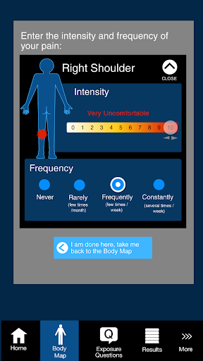
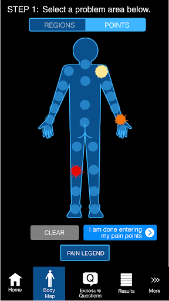
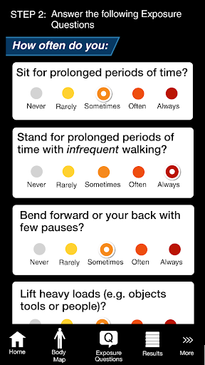

# PainPoint –Prevent Work Injury
App version ``1.0.5``

Analyzed with [covid-apps-observer](http://github.com/covid-apps-observer) project, version ``0.1``

## App overview
| | |
|-------------------------|-------------------------| 
| **Name**&nbsp;&nbsp;&nbsp;&nbsp;&nbsp;&nbsp;&nbsp;&nbsp;&nbsp;&nbsp;&nbsp;&nbsp;&nbsp;&nbsp;&nbsp;&nbsp;&nbsp;&nbsp;&nbsp;&nbsp;&nbsp;&nbsp;&nbsp;&nbsp;&nbsp;&nbsp;&nbsp;&nbsp;&nbsp;&nbsp;&nbsp;&nbsp;&nbsp;&nbsp;&nbsp;&nbsp;&nbsp;&nbsp;&nbsp;&nbsp;  | PainPoint –Prevent Work Injury |
| **Unique identifier** | ca.on.ohcow.msda |
| **Link to Google Play** | [https://play.google.com/store/apps/details?id=ca.on.ohcow.msda](https://play.google.com/store/apps/details?id=ca.on.ohcow.msda) |
| **Summary**  | Go through a basic workplace ergonomic assessment using diagrams and questions. |
| **Privacy policy** | [http://www.ohcow.on.ca](http://www.ohcow.on.ca) |
| **Latest version** | 1.0.5 |
| **Last update** | 2015-10-06 16:11:40 |
| **Recent changes** | change swipe behaviour. fix a bug. |
| **Installs**  | 1,000+ |
| **Category** | Health & Fitness |
| **First release** | Sep 16, 2015 |
| **Size**  | 2.7M |
| **Supported Android version**  | 4.0 and up |

### Description
> Download this useful app that delivers a very basic ergonomic assessment by running through a series of diagrams and questions to pinpoint musculoskeletal pain, identify possible sources, and discover practical solutions - right from your smartphone! The results are depicted on a body map, with recommendations to address work-related MSD hazards that could be contributing to your discomfort.  No personal data is collected, but summary results can be shared with others (at your discretion) in order to report hazards or foster solutions.
 While a professional ergonomic assessment is considered the most effective way to address work-related discomfort, this app is a good first step to help you recognize the signs of MSD and take action for prevention. For more information, visit www.ohcow.on.ca/resources or to make an inquiry or discuss a worksite visit, contact us at painpoint@ohcow.ca
  
 This app is the result of a valuable and productive professional collaboration: combining the clinical expertise and ergonomic content of the Occupational Health Clinic for Ontario Workers (OHCOW) with the technological knowledge and communication skills of the Canadian Centre for Occupational Health and Safety’s (CCOHS), www.ccohs.ca

### User interface
The developers of the app provide the following screenshots in the Google play store.
| | | |
|:-------------------------:|:-------------------------:|:-------------------------:|
 |   |   |   | 
 |   |  

## Development team
In the following we report the main information provided by the development team in the Google play store.

| | |
|-------------------------|-------------------------|
| **Developer**  | OHCOW |
| **Website**  | [http://www.ohcow.on.ca](http://www.ohcow.on.ca) |
| **Email** | ohcowapps@gmail.com |
| **Physical address**  | - |
| **Other developed apps**  | [https://play.google.com/store/apps/developer?id=OHCOW](https://play.google.com/store/apps/developer?id=OHCOW) |

## Android support

| | |
|-------------------------|-------------------------|
| **Declared target Android version**  | Lollipop, version 5.1 (API level 22) |
| **Effective target Android version**  | Lollipop, version 5.1 (API level 22) |
| **Minimum supported Android version**  | Ice Cream Sandwich, version 4.0.1 - 4.0.2 (API level 14) |
| **Maximum target Android version**  | - |

The larger the difference between the minimum and maximum supported Android versions, the better. A larger difference means a wider audience. For example, old phones have a very low Android version, so a high minimum supported Android version means that the app cannot be used by users with old phones, thus leading to accessibility problems. 

## Requested permissions

In the following we report the complete list of the permissions requested by the app. 

| **Permission** | **Protection level** | **Description** | 
|-------------------------|-------------------------|-------------------------|
 **android.permission ACCESS_NETWORK_STATE** | Normal | Allows applications to access information about networks. 
 **android.permission ACCESS_WIFI_STATE** | Normal | Allows applications to access information about Wi-Fi networks. 
 **android.permission INTERNET** | Normal | Allows applications to open network sockets. 
 **android.permission WRITE_EXTERNAL_STORAGE** | :warning:**Dangerous** | Allows an application to write to external storage. 

## Mentioned servers

| **Server** | **Registrant** | **Registrant country** | **Creation date** | 
|-------------------------|-------------------------|-------------------------|-------------------------|
 | google-analytics.com | Google LLC | :us: US | 2005-07-18 19:24:32 |
 | google.com | Google LLC | :us: US | 1997-09-15 04:00:00 |
 | facebook.com | Facebook, Inc. | :us: US | 1997-03-29 05:00:00 |
 | doubleclick.net | Google Inc. | :us: US | 1996-01-16 05:00:00 |
 | gstatic.com | Google LLC | :us: US | 2008-02-11 15:31:25 |
 | googletagmanager.com | Google LLC | :us: US | 2011-11-11 23:39:05 |

## Security analysis 

Below we report the main security warnings raised by our execution of the [Androwarn](https://github.com/maaaaz/androwarn) security analysis tool.

**Telephony identifiers leakage**
> - This application reads the device phone type value 
> - This application reads the numeric name (MCC+MNC) of current registered operator 
> - This application reads the radio technology (network type) currently in use on the device for data transmission 

**Connection interfaces exfiltration**
> - This application reads details about the currently active data network 
> - This application tries to find out if the currently active data network is metered 

**Telephony services abuse**
> - This application makes phone calls 

## User ratings and reviews

Below we provide information about how end users are reacting to the app in terms of ratings and reviews in the Google Play store.

### Ratings

The PainPoint –Prevent Work Injury app has been installed by more than **1000** times. At this time, **5** rated the app and its average score is **5.0**. Below we show the distribution of the ratings across the usual star-based rating of Google Play

:star::star::star::star::star:: 5

:star::star::star::star:: 0

:star::star::star:: 0

:star::star:: 0

:star:: 0

### Reviews 

#### 5-star reviews

No recent reviews available with 5 stars.

#### 4-star reviews

No recent reviews available with 4 stars.

#### 3-star reviews

No recent reviews available with 3 stars.

#### 2-star reviews

No recent reviews available with 2 stars.

#### 1-star reviews

No recent reviews available with 1 stars.
