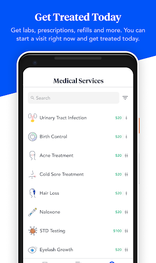
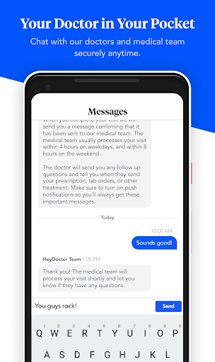
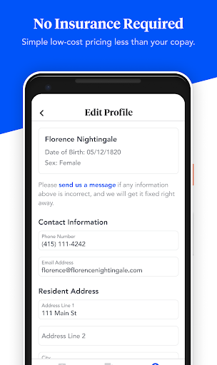
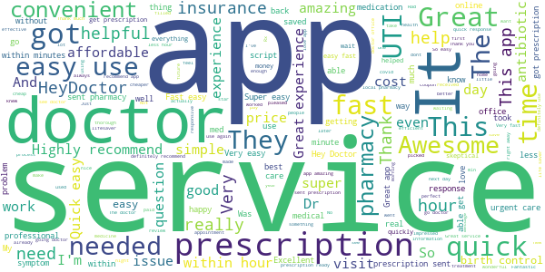
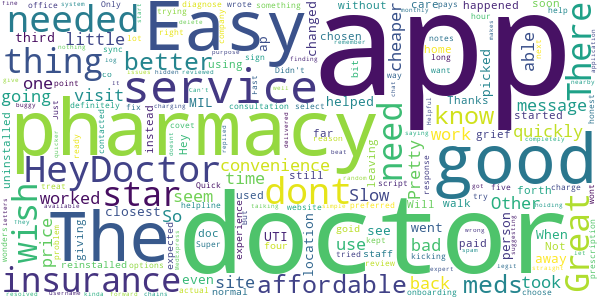
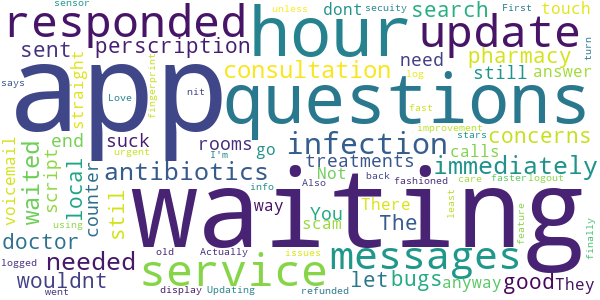
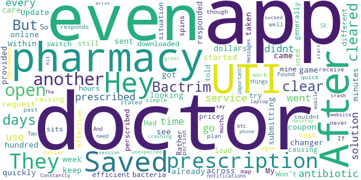
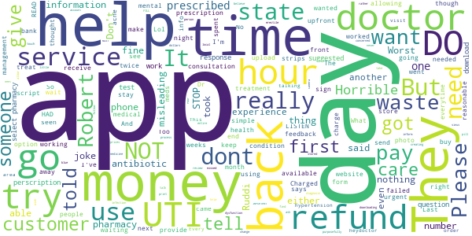

# HeyDoctor
App version ``2.7.0``

Analyzed with [covid-apps-observer](http://github.com/covid-apps-observer) project, version ``0.1``

## App overview
| | |
|-------------------------|-------------------------| 
| **Name**&nbsp;&nbsp;&nbsp;&nbsp;&nbsp;&nbsp;&nbsp;&nbsp;&nbsp;&nbsp;&nbsp;&nbsp;&nbsp;&nbsp;&nbsp;&nbsp;&nbsp;&nbsp;&nbsp;&nbsp;&nbsp;&nbsp;&nbsp;&nbsp;&nbsp;&nbsp;&nbsp;&nbsp;&nbsp;&nbsp;&nbsp;&nbsp;&nbsp;&nbsp;&nbsp;&nbsp;&nbsp;&nbsp;&nbsp;&nbsp;  | HeyDoctor |
| **Unique identifier** | co.heydoctor.android |
| **Link to Google Play** | [https://play.google.com/store/apps/details?id=co.heydoctor.android](https://play.google.com/store/apps/details?id=co.heydoctor.android) |
| **Summary**  | Waiting rooms suck. Get care from our expert doctors and medical team right now. |
| **Privacy policy** | [https://heydoctor.com/legals/privacy-policy](https://heydoctor.com/legals/privacy-policy) |
| **Latest version** | 2.7.0 |
| **Last update** | 2020-10-14 21:17:51 |
| **Recent changes** | This update includes some general bug fixes and performance improvements. As always, we&#39;d appreciate if you share your feedback with us at support@heydoctor.com. Stay safe! |
| **Installs**  | 10,000+ |
| **Category** | Medical |
| **First release** | Oct 19, 2017 |
| **Size**  | 62M |
| **Supported Android version**  | 6.0 and up |

### Description
> HeyDoctor is the easiest and most affordable way to get simple medical care, and now it's on iOS!
 CONVENIENT AND HASSLE FREE
 Waiting rooms suck. Get care from our expert doctors and medical team right now. We take care of many common conditions and visits take under 5 minutes.
 SIMPLE, CLEAR PRICING
 No insurance needed. Most of our visits are under $20 and come with a 100% satisfaction guarantee.
 OUR MEDICAL SERVICES
 -   Acne Diagnosis, Treatment, and Prevention
 -   High Cholesterol (Lipid) Testing and Treatment
 -   Start or Refill Birth Control
 -   Urinary Tract Infection (UTI) Testing and Treatment
 -   Vitamin D Screening and Treatment
 -   Pre-Diabetes Screening and Referral
 -   Hepatitis C Screening and Referral
 -   Female Condom Prescription
 -   Help Quitting Smoking
 -   Find Out Your Blood Type
 EASY PRESCRIPTION PICKUP AND REFILL
 We can send the medicine to your local pharmacy, by mail, and in some cities even have it delivered to your door. 
 AVAILABLE ACROSS THE UNITED STATES
 We are currently available in Arizona, California, Connecticut, Florida, Georgia, Illinois, Montana, New York, Ohio, Pennsylvania, Rhode Island, Virginia and Washington, but don’t worry the rest of the country is coming soon!
 YOUR DOCTOR - AVAILABLE ANYTIME
 You can chat with your doctor anytime and anywhere using secure messaging. Your data is all protected by HIPAA - confidential and secure.
 ABOUT US
 We are combining the latest evidence based medicine with cutting edge technology to create a fast, accessible, and affordable way to get care from a doctor anywhere, anytime.
 Our medical care is provided by HeyDoctor, a California professional corporation. Made with love in Seattle and San Francisco.

### User interface
The developers of the app provide the following screenshots in the Google play store.
| | | |
|:-------------------------:|:-------------------------:|:-------------------------:|
 |   |   |   | 

## Development team
In the following we report the main information provided by the development team in the Google play store.

| | |
|-------------------------|-------------------------|
| **Developer**  | HeyDoctor LLC |
| **Website**  | [https://www.heydoctor.com](https://www.heydoctor.com) |
| **Email** | help@heydoctor.com |
| **Physical address**  | [577 2ND ST STE 101, SAN FRANCISCO, CA 94107](https://www.google.com/maps/search/577%202ND%20ST%20STE%20101,%20SAN%20FRANCISCO,%20CA%2094107) (Google Maps) |
| **Other developed apps**  | [https://play.google.com/store/apps/developer?id=HeyDoctor+LLC](https://play.google.com/store/apps/developer?id=HeyDoctor+LLC) |

## Android support

| | |
|-------------------------|-------------------------|
| **Declared target Android version**  | Pie, version 9 (API level 28) |
| **Effective target Android version**  | Pie, version 9 (API level 28) |
| **Minimum supported Android version**  | Marshmallow, version 6.0 (API level 23) |
| **Maximum target Android version**  | - |

The larger the difference between the minimum and maximum supported Android versions, the better. A larger difference means a wider audience. For example, old phones have a very low Android version, so a high minimum supported Android version means that the app cannot be used by users with old phones, thus leading to accessibility problems. 

## Requested permissions

In the following we report the complete list of the permissions requested by the app. 

| **Permission** | **Protection level** | **Description** | 
|-------------------------|-------------------------|-------------------------|
 **android.permission ACCESS_FINE_LOCATION** | :warning:**Dangerous** | Allows an app to access precise location. 
 **android.permission ACCESS_NETWORK_STATE** | Normal | Allows applications to access information about networks. 
 **android.permission ACCESS_WIFI_STATE** | Normal | Allows applications to access information about Wi-Fi networks. 
 **android.permission BLUETOOTH** | Normal | Allows applications to connect to paired bluetooth devices. 
 **android.permission CAMERA** | :warning:**Dangerous** | Required to be able to access the camera device. 
 **android.permission FOREGROUND_SERVICE** | Normal | Allows a regular application to use Service.startForeground. 
 **android.permission INTERNET** | Normal | Allows applications to open network sockets. 
 **android.permission MODIFY_AUDIO_SETTINGS** | Normal | Allows an application to modify global audio settings. 
 **android.permission READ_APP_BADGE** | - | - 
 **android.permission READ_EXTERNAL_STORAGE** | :warning:**Dangerous** | Allows an application to read from external storage. 
 **android.permission RECEIVE_BOOT_COMPLETED** | Normal | Allows an application to receive the Intent.ACTION_BOOT_COMPLETED that is broadcast after the system finishes booting. 
 **android.permission RECORD_AUDIO** | :warning:**Dangerous** | Allows an application to record audio. 
 **android.permission RECORD_VIDEO** | - | - 
 **android.permission USE_FINGERPRINT** | Normal | This constant was deprecated in API level 28. Applications should request USE_BIOMETRIC instead 
 **android.permission VIBRATE** | Normal | Allows access to the vibrator. 
 **android.permission WAKE_LOCK** | Normal | Allows using PowerManager WakeLocks to keep processor from sleeping or screen from dimming. 
 **android.permission WRITE_EXTERNAL_STORAGE** | :warning:**Dangerous** | Allows an application to write to external storage. 
 **com.anddoes.launcher.permission UPDATE_COUNT** | - | - 
 **com.google.android.c2dm.permission RECEIVE** | - | - 
 **com.google.android.finsky.permission BIND_GET_INSTALL_REFERRER_SERVICE** | - | - 
 **com.htc.launcher.permission READ_SETTINGS** | - | - 
 **com.htc.launcher.permission UPDATE_SHORTCUT** | - | - 
 **com.huawei.android.launcher.permission CHANGE_BADGE** | - | - 
 **com.huawei.android.launcher.permission READ_SETTINGS** | - | - 
 **com.huawei.android.launcher.permission WRITE_SETTINGS** | - | - 
 **com.majeur.launcher.permission UPDATE_BADGE** | - | - 
 **com.oppo.launcher.permission READ_SETTINGS** | - | - 
 **com.oppo.launcher.permission WRITE_SETTINGS** | - | - 
 **com.sec.android.provider.badge.permission READ** | - | - 
 **com.sec.android.provider.badge.permission WRITE** | - | - 
 **com.sonyericsson.home.permission BROADCAST_BADGE** | - | - 
 **com.sonymobile.home.permission PROVIDER_INSERT_BADGE** | - | - 
 **me.everything.badger.permission BADGE_COUNT_READ** | - | - 
 **me.everything.badger.permission BADGE_COUNT_WRITE** | - | - 

## Mentioned servers

| **Server** | **Registrant** | **Registrant country** | **Creation date** | 
|-------------------------|-------------------------|-------------------------|-------------------------|
 | apache.org | The Apache Software Foundation | :us: US | 1995-04-11 04:00:00 |
 | xml.org | OASIS Open | :us: US | 1997-02-03 05:00:00 |
 | w3.org | W3C | :us: US | 1994-07-06 04:00:00 |
 | purl.org | Internet Archive | :us: US | 1996-01-01 05:00:00 |
 | adobe.com | Adobe Inc. | :us: US | 1986-11-17 05:00:00 |
 | android.com | Google LLC | :us: US | 1997-06-23 04:00:00 |
 | googlesyndication.com | Google LLC | :us: US | 2003-01-21 06:17:24 |
 | google.com | Google LLC | :us: US | 1997-09-15 04:00:00 |
 | app-measurement.com | Google LLC | :us: US | 2015-06-19 20:13:31 |
 | iptc.org | Whois Privacy Service | :us: US | 1995-12-27 05:00:00 |
 | useplus.org | PLUS COALITION | :us: US | 2003-11-18 19:31:25 |
 | npes.org | NPES | :us: US | 1996-01-30 05:00:00 |
 | aiim.org | Association for Information and Image Management International | :us: US | 1995-10-18 04:00:00 |
 | drewnoakes.com | REDACTED FOR PRIVACY | GB | 2002-04-04 10:00:05 |
 | github.com | GitHub, Inc. | :us: US | 2007-10-09 18:20:50 |
 | googleapis.com | Google LLC | :us: US | 2005-01-25 17:52:26 |
 | googleadservices.com | Google LLC | :us: US | 2003-06-19 16:34:53 |
 | segment.com | Domains By Proxy, LLC | :us: US | 1998-07-06 04:00:00 |
 | segment.io | Segment.io, Inc. | :us: US | 2011-10-01 04:10:05 |
 | stripe.com | - | :us: US | 1995-09-12 04:00:00 |

## Security analysis 

Below we report the main security warnings raised by our execution of the [Androwarn](https://github.com/maaaaz/androwarn) security analysis tool.

**Telephony identifiers leakage**
> - This application reads the ISO country code equivalent for the SIM provider's country code 
> - This application reads the ISO country code equivalent of the current registered operator's MCC (Mobile Country Code) 
> - This application reads the MCC+MNC of the provider of the SIM 
> - This application reads the SIM's serial number 
> - This application reads the Service Provider Name (SPN) 
> - This application reads the alphabetic identifier associated with the voice mail number 
> - This application reads the constant indicating the state of the device SIM card 
> - This application reads the device phone type value 
> - This application reads the numeric name (MCC+MNC) of current registered operator 
> - This application reads the operator name 
> - This application reads the phone number string for line 1, for example, the MSISDN for a GSM phone 
> - This application reads the radio technology (network type) currently in use on the device for data transmission 
> - This application reads the unique device ID, i.e the IMEI for GSM and the MEID or ESN for CDMA phones 
> - This application reads the unique subscriber ID, for example, the IMSI for a GSM phone 
> - This application reads the voice mail number 

**Location lookup**
> - This application reads location information from all available providers (WiFi, GPS etc.) 

**Connection interfaces exfiltration**
> - This application reads details about the currently active data network 
> - This application tries to find out if the currently active data network is metered 

**Audio video eavesdropping**
> - This application records audio from the 'CAMCORDER' source  
> - This application records audio from the 'MIC' source  
> - This application captures video from the 'CAMERA' source 
> - This application captures video from the 'SURFACE' source 

**Suspicious connection establishment**
> - This application opens a Socket and connects it to the remote address '' on the 'N/A' port  
> - This application opens a Socket and connects it to the remote address 'Ljava/lang/StringBuilder;->toString()Ljava/lang/String;' on the ': connect, resolve' port  
> - This application opens a Socket and connects it to the remote address 'Ljava/lang/StringBuilder;->toString()Ljava/lang/String;' on the 'N/A' port  
> - This application opens a Socket and connects it to the remote address 'Ljava/net/Proxy;->type()Ljava/net/Proxy$Type;' on the 'N/A' port  
> - This application opens a Socket and connects it to the remote address 'timeout' on the 'N/A' port  

**Pim data leakage**
> - This application accesses data stored in the clipboard 

**Code execution**
> - This application loads a native library 
> - This application loads a native library: 'Ljava/util/Iterator;->next()Ljava/lang/Object;' 
> - This application loads a native library: 'log' 
> - This application loads a native library: 'sentry' 
> - This application loads a native library: 'sentry-android' 
> - This application executes a UNIX command 

## User ratings and reviews

Below we provide information about how end users are reacting to the app in terms of ratings and reviews in the Google Play store.

### Ratings

The HeyDoctor app has been installed by more than **10000** times. At this time, **1976** rated the app and its average score is **4.8672986**. Below we show the distribution of the ratings across the usual star-based rating of Google Play

:star::star::star::star::star:: 1875

:star::star::star::star:: 37

:star::star::star:: 18

:star::star:: 0

:star:: 46

### Reviews 

#### 5-star reviews

> 👍🏽👍🏽  :date: __2020-10-26 06:18:43__

> Fast, professional and convenient. Definitely will recommend to family and friends.  :date: __2020-10-26 00:46:39__

> super easy to use. the doctors respond quickly and prescription is ready in no time. so easy and convenient.  :date: __2020-10-25 14:13:41__

> SUPER easy, SUPER efficient. Will definitely use again  :date: __2020-10-25 02:19:35__

> first time using heydoctor and it was awesome! Very fast and reliable and I will definitely be using it again  :date: __2020-10-24 18:48:30__

> I was traveling, thousands of miles from home, and had a terrible uti. I called my doctor back home and they didnt want to give me anything without seeing me first. They suggested I go to a local urgent care. Urgent Cares are notorious for long waits. I didn't want to endure that or spend the money. I was able to get the prescription I needed from HeyDoctor within minutes. I am feeling so much better! This was my first time using HeyDoctor and I definitely recommend them!  :date: __2020-10-24 16:41:38__

> was a good experience, all I had to do was answer some question and the doctor made a diagnosis and sent in my prescription.  :date: __2020-10-24 16:20:30__

> Fast, cheap, and no waiting in an office for hours. Got my prescription sent quick and picked up in about an hour. 5/5 stars! Highly recommend.  :date: __2020-10-24 04:19:58__

> Great service! Very fast! Highly recommend!  :date: __2020-10-24 02:27:00__

> Easy and fast. Got what I needed within the hour 🙂  :date: __2020-10-24 02:18:40__

#### 4-star reviews

> Easy and affordable! I had a UTI and the HeyDoctor ap helped me get the meds I needed to get better. I dont have insurance, nor the $$ to see a doctor in person. The only thing, I picked the closest pharmacy to me, but it was changed to a pharmacy further away. When my MIL went to get the meds for me, it was at a third location even further. I dont know why that happened, I would have like the convenience of the one I had chosen. Other than that, I will be using this app again!  :date: __2020-10-09 20:09:58__

> So far so good. Easy to message back and forth with a doc who took care of things quickly. Will use again. Thanks.  :date: __2020-08-22 17:19:21__

> The convenience of Hey Doctor is great. Not only was I able to have a doctor "visit" as soon as I needed one without leaving my home, it was more affordable than going to the walk in. The app still needs work as it started giving me grief after I paid. I used the site instead then uninstalled and reinstalled the app and it seems to be back to normal.  :date: __2020-08-10 20:51:44__

> Great experience with the staff... Took a little bit more time than I expected to get to me, but goid...  :date: __2020-07-29 16:21:10__

> The app gets four stars, but the service is definitely five star!  :date: __2020-07-22 20:34:30__

> Didn't want to do an office visit for something so easy to diagnose. Super easy to sign up. There is a $30 consultation charge, but to be honest, it's cheaper than a lot of co-pays out there. Quick response, get to choose your preferred pharmacy...and my prescription was ready in under an hour!  :date: __2020-05-09 18:39:58__

> Pretty good app the onboarding was a little long, and didn't seem like it's sync with the doctor notes but other than that I like the app and was able to get the service I needed, also I wish there was a better helpline  :date: __2020-04-06 17:29:34__

> Fast and to the point. Just wish there were more options of things they can treat but good for the price of service.  :date: __2020-04-03 21:12:27__

> Only worked once next time tried to use kept kicking me off when was trying to select pharmacy. But the actual website worked wonders and the company itself contacted me right after my review to try and help fix the problem  :date: __2020-03-28 20:47:09__

> Great but for some reason the way they wrote my script my insurance wont covet it completely. And its charging me monthly???  :date: __2020-03-27 03:18:20__

#### 3-star reviews

> I had an infection i immediately needed to get antibiotics for, I did the questions and consultation, waited under an hour to get the perscription sent to my local pharmacy. The doctor responded to all my questions and concerns. it was good. however, there are stil l some bugs from the app, wouldnt let me update and search for other treatments.  :date: __2019-08-14 17:15:54__

> Waiting rooms suck, and so does this app/service. You still end up waiting for hours when all you need is a script that should be over the counter anyway. There's no way to get in touch with them. They dont answer messages and calls go straight to voicemail. Not a scam, but not any improvement over old fashioned waiting. update: Actually went to urgent care and it was faster than using this app. Updating to 3 stars because they finally responded and at least refunded fast.  :date: __2019-03-30 20:26:04__

> Love the service I just have a few issues with the app...First it says I'm logged in but will nit display my messages or info unless I logout and log back in. Also the fingerprint sensor under the secuity feature will not turn on...  :date: __2019-03-28 18:34:44__

#### 2-star reviews

> Hey Doctor is a game changer. My doctor couldn't see me for a week. I started looking online for other solutions, and came across Hey Doctor. Saved me over a hundred dollars and got me taken care of quickly. Within 5 minutes of me submitting my request, they had responded and already sent in my prescription. They even provided a coupon that saved me another $30 at the pharmacy. Update: they keep raising their prices, so it is now not as cost efficient as it used to be.  :date: __2020-09-28 02:28:52__

> I downloaded the app, but when I try to open it, it just sits and spins. Won't load.  :date: __2020-01-16 16:08:08__

> Had a UTI. They perscribed Bactrim, which is generally effective for UTI. But it didn't clear mine. After 5 days I told them the situation wasn't cleared. Rather than switch my antibiotics, they prescribed the same. After 5 more days, it still wasn't clear so i went to doctor, they prescribed a different antibiotic. After 24 hours it cleared. So, if the bacteria causing your UTI responds to Bactrim, this app is a quick simple solution. If not, well plan to go to the doctor.  :date: __2019-12-19 19:16:56__

> Pharmacy didnt receive both of my prescriptions, even though it was stated they did.  :date: __2019-08-10 00:41:33__

> map for pharmacy didnt work and couldnt use app past this portion found another service that was much easier  :date: __2019-04-30 03:11:08__

> I never get notifications for messages etc. And I have to login every time I open the app. Two important things to me that need improvement  :date: __2019-04-11 18:26:12__

> S8. Constantly crashing. I can't use.  :date: __2018-02-22 00:23:42__

> The app sucked. Every time I hit start a session it would crash. Even when I went to the website on my mobile phone it would say unexpected error. But the service itself is great if you go to a laptop or desktop.  :date: __2018-02-18 18:53:22__

#### 1-star reviews

> What is the phone number?  :date: __2020-10-23 11:26:22__

> They were not able to help me get an antibiotic for a sinus infection. But if I had erectile dysfunction they could get me a little blue pill for that.  :date: __2020-10-21 02:21:34__

> I really wanted to try this app but went through entire process of downloading and creating account only find out that its not available in my state. Either i missed this information on the website or they need to inform a person of which states they are/ are not available. 😢  :date: __2020-10-19 22:30:47__

> Don't waste your money on these people. They are never right about diagnosis.  :date: __2020-10-02 01:33:01__

> IMPORTANT to kniw this app charges you for a consultation for a prescription, they DO NOT FILL, or provide medicine or treatment. READ the fine print or ask upfront if that is what you want. Charged upfront for a "consultation" for a script, that they will not send to you. They will send to a local pharmacy where you PAY pharmacy prices! Misleading, and I believe purposefully misleading. I spent 30 dollars that I now wish I had back!  :date: __2020-09-23 14:37:29__

> Poor sign up, failed 3 times but stored phone and nothing else. MUST have camera, will not allow a photo upload I would change my review after working with Ruddi... But I'm rather concerned that management will not follow up... because of Robert... really... Management you need to take time to meet with him and LISTEN to what he has in feedback from the customers... STOP talk and LISTEN... you really not in touch.... your role and power has gone to your head.... And please STOP allowing Robert communicate with customer, his clearly is disconnected with basic terms.. and the ability to give a reasonable answer.  Robert - shortly does not = within 24 hour for mostly... for most that is with an hour...  When you give a phone number, with out any additional information it is reasonable for someone to assume this is a number to get someone... NOT a VM....  for the love of god you could just had someone call... but nope... YOU HAD me jump though BS wasting my time... Your auto res ponder says 1 hours.. it took you 6 hours to respond... ROBERT your Expectations are NOT normal... PLEASE stay away from customers until you have your reality adjusted... maybe you need to be tested... really.... no joke....  Now really after working with Ruddi to resolve the issues all is fine... Ruddi has a list of feedback comments... Once the app works, it is great...  :date: __2020-09-13 01:37:46__

> No help was charged to then be told cant help with condition. Do not trust.  :date: __2020-08-29 21:20:54__

> SCAM!! Didnt help with any thing but taking my money told me see a doctor for a form of acne i have seen a doctor and the said its acne they dissagree and said they dont treat what they think it was. I had this before doctors gave me antibiotics for it it worked. I was just wanting a script so i dont have to fight to see a doctor forever with what insurance i got. They did nothing but keep that first fee and sa good luck.. Stay away from this app!!  :date: __2020-08-29 21:06:14__

> I was immediately misgendered and denied services because the Dr. didn't bother to read my profile correctly. If I could give this negative stars I would.  :date: __2020-08-26 06:13:27__

> No mental health/psychiatric care, so for me this is (very unfortunately) absolutely worthless. But I will be using GoodRX for discounts. Please provide mental health care ASAP. It is otherwise inaccessible and is at a higher demand now more than ever.  :date: __2020-07-30 22:52:18__

