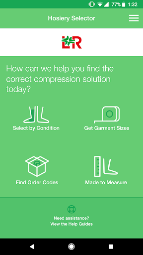
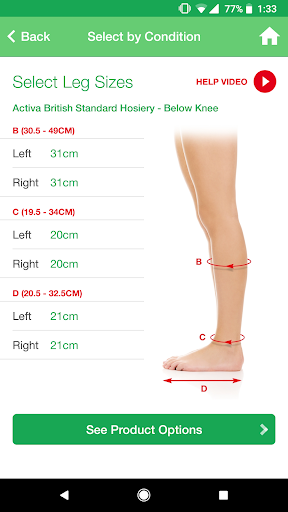
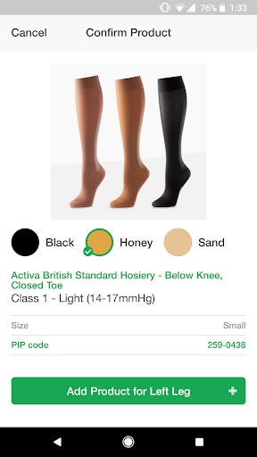
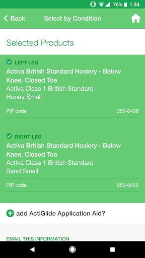
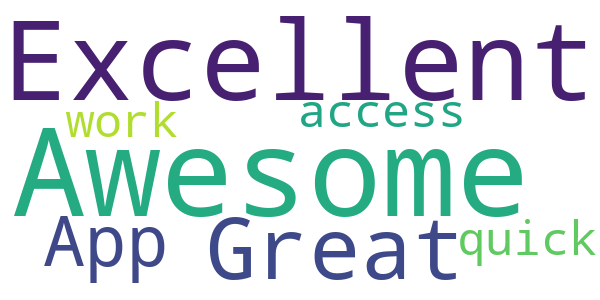
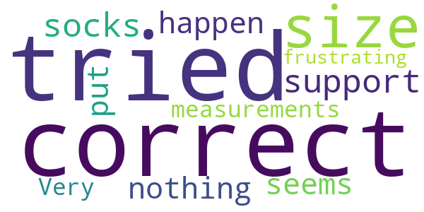
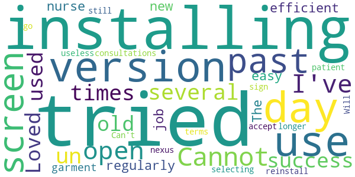

# L&R Hosiery Selector
App version ``2.4.0``

Analyzed with [covid-apps-observer](http://github.com/covid-apps-observer) project, version ``0.1``

## App overview
| | |
|-------------------------|-------------------------| 
| **Name**&nbsp;&nbsp;&nbsp;&nbsp;&nbsp;&nbsp;&nbsp;&nbsp;&nbsp;&nbsp;&nbsp;&nbsp;&nbsp;&nbsp;&nbsp;&nbsp;&nbsp;&nbsp;&nbsp;&nbsp;&nbsp;&nbsp;&nbsp;&nbsp;&nbsp;&nbsp;&nbsp;&nbsp;&nbsp;&nbsp;&nbsp;&nbsp;&nbsp;&nbsp;&nbsp;&nbsp;&nbsp;&nbsp;&nbsp;&nbsp;  | L&R Hosiery Selector |
| **Unique identifier** | co.uk.activa |
| **Link to Google Play** | [https://play.google.com/store/apps/details?id=co.uk.activa](https://play.google.com/store/apps/details?id=co.uk.activa) |
| **Summary**  | Helps healthcare professionals select L&amp;R compression hosiery for patients. |
| **Privacy policy** | [https://lohmann-rauscher.co.uk/privacy](https://lohmann-rauscher.co.uk/privacy) |
| **Latest version** | 2.4.0 |
| **Last update** | 2019-07-16 13:10:53 |
| **Recent changes** | We are always working towards improving the Hosiery Selector app to help you find the most suitable Compression solution for your patients efficiently.   What’s new: - General bug fixes and enhancements |
| **Installs**  | 5,000+ |
| **Category** | Medical |
| **First release** | Apr 8, 2013 |
| **Size**  | 36M |
| **Supported Android version**  | 4.2 and up |

### Description
> The L&R hosiery selector is designed to assist healthcare professionals select the appropriate compression therapy options and sizes for patients.
  
 App features:
  
 Select hosiery by condition type
 Tap on the photos of venous leg conditions and the app will recommend the appropriate compression option.
  
 Instantly get sizes
 Input your patients’ measurements and the app works out the size you need for Activa and ActiLymph hosiery, kits, liners and ReadyWrap.
  
 Find order codes
 Takes the stress out of finding the code you need.
  
 Access Made to Measure on-line ordering form
 The app will advise if your patient will not fit into stock sizes and takes you to the on-line order form.

### User interface
The developers of the app provide the following screenshots in the Google play store.
| | | |
|:-------------------------:|:-------------------------:|:-------------------------:|
 |   |   |   | 
 |  

## Development team
In the following we report the main information provided by the development team in the Google play store.

| | |
|-------------------------|-------------------------|
| **Developer**  | Lohmann & Rauscher UK |
| **Website**  | [https://lohmann-rauscher.co.uk/](https://lohmann-rauscher.co.uk/) |
| **Email** | customersolutions@uk.lrmed.com |
| **Physical address**  | [1 Wellington Court Lancaster Park Newborough Rd Needwood Burton On Trent Staffordshire DE13 9PS](https://www.google.com/maps/search/1%20Wellington%20Court%20Lancaster%20Park%20Newborough%20Rd%20Needwood%20Burton%20On%20Trent%20Staffordshire%20DE13%209PS) (Google Maps) |
| **Other developed apps**  | [https://play.google.com/store/apps/developer?id=Lohmann+%26+Rauscher+UK](https://play.google.com/store/apps/developer?id=Lohmann+%26+Rauscher+UK) |

## Android support

| | |
|-------------------------|-------------------------|
| **Declared target Android version**  | Oreo, version 8.1.0 (API level 27) |
| **Effective target Android version**  | Oreo, version 8.1.0 (API level 27) |
| **Minimum supported Android version**  | Jelly Bean, version 4.2.x (API level 17) |
| **Maximum target Android version**  | - |

The larger the difference between the minimum and maximum supported Android versions, the better. A larger difference means a wider audience. For example, old phones have a very low Android version, so a high minimum supported Android version means that the app cannot be used by users with old phones, thus leading to accessibility problems. 

## Requested permissions

In the following we report the complete list of the permissions requested by the app. 

| **Permission** | **Protection level** | **Description** | 
|-------------------------|-------------------------|-------------------------|
 **android.permission ACCESS_NETWORK_STATE** | Normal | Allows applications to access information about networks. 
 **android.permission INTERNET** | Normal | Allows applications to open network sockets. 

## Mentioned servers

| **Server** | **Registrant** | **Registrant country** | **Creation date** | 
|-------------------------|-------------------------|-------------------------|-------------------------|
 | lrmed.uk | - | - | 2017-10-31 00:00:00 |
 | google.com | Google LLC | :us: US | 1997-09-15 04:00:00 |
 | amazonaws.com | Amazon.com, Inc. | :us: US | 2005-08-18 02:10:45 |
 | crashlytics.com | Google LLC | :us: US | 2011-01-21 15:30:40 |
 | lohmann-rauscher.co.uk | - | - | 2017-01-25 00:00:00 |
 | activahealthcare.co.uk | - | - | 2001-03-24 00:00:00 |
 | w3.org | W3C | :us: US | 1994-07-06 04:00:00 |
 | amazonaws.com | Amazon.com, Inc. | :us: US | 2005-08-18 02:10:45 |

## Security analysis 

Below we report the main security warnings raised by our execution of the [Androwarn](https://github.com/maaaaz/androwarn) security analysis tool.

**Connection interfaces exfiltration**
> - This application reads details about the currently active data network 
> - This application tries to find out if the currently active data network is metered 

**Telephony services abuse**
> - This application makes phone calls 

**Suspicious connection establishment**
> - This application opens a Socket and connects it to the remote address '' on the 'N/A' port  
> - This application opens a Socket and connects it to the remote address 'Ljava/lang/StringBuilder;->toString()Ljava/lang/String;' on the 'N/A' port  
> - This application opens a Socket and connects it to the remote address 'Ljava/net/Proxy;->type()Ljava/net/Proxy$Type;' on the 'N/A' port  
> - This application opens a Socket and connects it to the remote address 'timeout' on the 'N/A' port  

**Code execution**
> - This application loads a native library 

## User ratings and reviews

Below we provide information about how end users are reacting to the app in terms of ratings and reviews in the Google Play store.

### Ratings

The L&R Hosiery Selector app has been installed by more than **5000** times. At this time, **23** rated the app and its average score is **3.4782608**. Below we show the distribution of the ratings across the usual star-based rating of Google Play

:star::star::star::star::star:: 10

:star::star::star::star:: 5

:star::star::star:: 0

:star::star:: 2

:star:: 6

### Reviews 

#### 5-star reviews

> Awesome and Excellent  :date: __2020-02-19 19:15:15__

> Great App for quick access at work  :date: __2014-10-15 10:59:12__

#### 4-star reviews

> Easy to use Explains selection by condition and offers options  :date: __2020-09-10 16:45:45__

> Would be nice to see the special order form in the app.  :date: __2013-06-29 10:05:02__

#### 3-star reviews

No recent reviews available with 3 stars.

#### 2-star reviews

> I have tried to get the correct size for support socks but nothing seems to happen once you have put in your measurements. Very frustrating!  :date: __2013-12-05 17:44:59__

#### 1-star reviews

> Cannot get this to open. I've tried several times un installing and installing with no success.  :date: __2020-05-29 20:13:24__

> Loved the old version, used it regularly in my day to day job as a nurse. 
The new version isn't as easy to use and is also not as efficient at 
garment selecting. I no longer use it in patient consultations.  :date: __2018-06-05 07:53:23__

> Will not go past sign up screen tried to reinstall but still the same  :date: __2018-05-29 10:25:06__

> Can't get past the accept terms screen on a nexus 4 so useless  :date: __2013-06-19 18:03:45__

