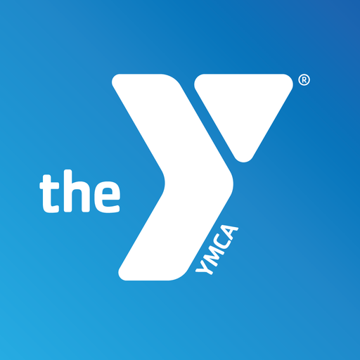
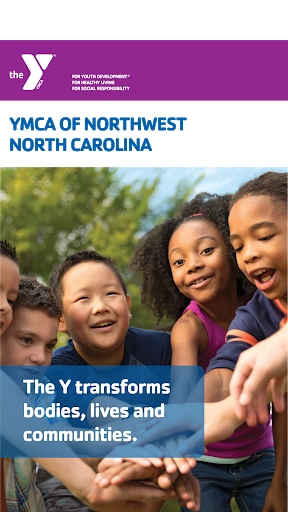
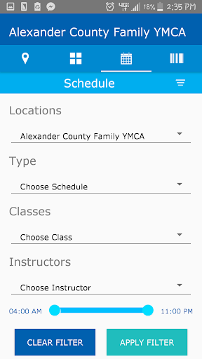
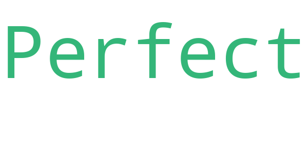
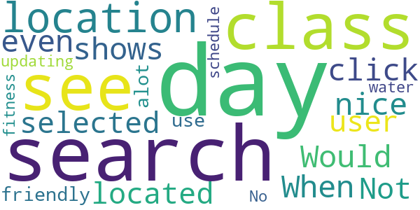
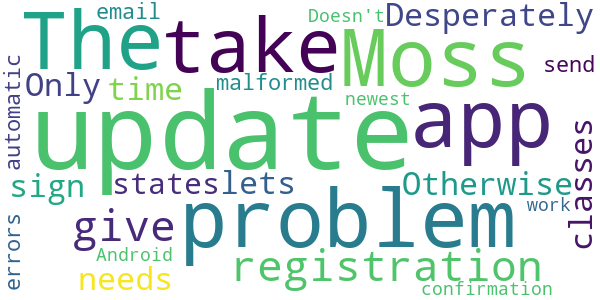
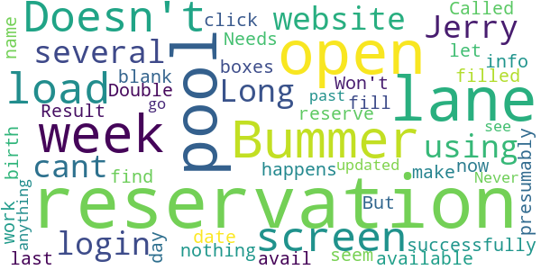

# YMCA of Northwest North Carolina
App version ``1.0.6``

Analyzed with [covid-apps-observer](http://github.com/covid-apps-observer) project, version ``0.1``

## App overview
| | |
|-------------------------|-------------------------| 
| **Name**&nbsp;&nbsp;&nbsp;&nbsp;&nbsp;&nbsp;&nbsp;&nbsp;&nbsp;&nbsp;&nbsp;&nbsp;&nbsp;&nbsp;&nbsp;&nbsp;&nbsp;&nbsp;&nbsp;&nbsp;&nbsp;&nbsp;&nbsp;&nbsp;&nbsp;&nbsp;&nbsp;&nbsp;&nbsp;&nbsp;&nbsp;&nbsp;&nbsp;&nbsp;&nbsp;&nbsp;&nbsp;&nbsp;&nbsp;&nbsp;  | YMCA of Northwest North Carolina |
| **Unique identifier** | com.and.schedules.nwnc |
| **Link to Google Play** | [https://play.google.com/store/apps/details?id=com.and.schedules.nwnc](https://play.google.com/store/apps/details?id=com.and.schedules.nwnc) |
| **Summary**  | YMCA information, schedules and more. |
| **Privacy policy** | [http://www.ymcanwnc.org/privacy-policy](http://www.ymcanwnc.org/privacy-policy) |
| **Latest version** | 1.0.6 |
| **Last update** | 2017-09-25 22:22:08 |
| **Recent changes** | Filter updates. |
| **Installs**  | 5,000+ |
| **Category** | Health & Fitness |
| **First release** | Aug 7, 2017 |
| **Size**  | 7.1M |
| **Supported Android version**  | 4.0.3 and up |

### Description
> Search exercise schedules, get new program information, see facility closings and more! 
 SCAN YOUR MEMBERSHIP
 * Scan your membership barcode
 EXERCISE SCHEDULES
 * Have a class in mind? Search class times based on your class name. Find a list of classes, instructors, descriptions, and locations.
 * Daily class schedules.
 AQUATICS SCHEDULES
 * Search water aerobics schedules based on class name, dates and more.
 PROGRAMS & EVENTS
 * See upcoming YMCA programs such as sports registrations, new classes, new videos and more.
 * Share this info via email with your friends and family.

### User interface
The developers of the app provide the following screenshots in the Google play store.
| | | |
|:-------------------------:|:-------------------------:|:-------------------------:|
 |   |  

## Development team
In the following we report the main information provided by the development team in the Google play store.

| | |
|-------------------------|-------------------------|
| **Developer**  | YMCA of Northwest North Carolina |
| **Website**  | [http://www.ymcanwnc.org](http://www.ymcanwnc.org) |
| **Email** | info@ymcanwnc.org |
| **Physical address**  | - |
| **Other developed apps**  | [https://play.google.com/store/apps/developer?id=YMCA+of+Northwest+North+Carolina](https://play.google.com/store/apps/developer?id=YMCA+of+Northwest+North+Carolina) |

## Android support

| | |
|-------------------------|-------------------------|
| **Declared target Android version**  | Lollipop, version 5.0 (API level 21) |
| **Effective target Android version**  | Lollipop, version 5.0 (API level 21) |
| **Minimum supported Android version**  | Ice Cream Sandwich, version 4.0.3 - 4.0.4 (API level 15) |
| **Maximum target Android version**  | - |

The larger the difference between the minimum and maximum supported Android versions, the better. A larger difference means a wider audience. For example, old phones have a very low Android version, so a high minimum supported Android version means that the app cannot be used by users with old phones, thus leading to accessibility problems. 

## Requested permissions

In the following we report the complete list of the permissions requested by the app. 

| **Permission** | **Protection level** | **Description** | 
|-------------------------|-------------------------|-------------------------|
 **android.permission ACCESS_NETWORK_STATE** | Normal | Allows applications to access information about networks. 
 **android.permission INTERNET** | Normal | Allows applications to open network sockets. 
 **android.permission READ_CALENDAR** | :warning:**Dangerous** | Allows an application to read the user's calendar data. 
 **android.permission WRITE_CALENDAR** | :warning:**Dangerous** | Allows an application to write the user's calendar data. 

## Mentioned servers

| **Server** | **Registrant** | **Registrant country** | **Creation date** | 
|-------------------------|-------------------------|-------------------------|-------------------------|
 | consoria.com | Redacted for Privacy Purposes | :us: US | 2016-02-04 14:20:10 |
 | crashlytics.com | Google LLC | :us: US | 2011-01-21 15:30:40 |
 | googleapis.com | Google LLC | :us: US | 2005-01-25 17:52:26 |

## Security analysis 

Below we report the main security warnings raised by our execution of the [Androwarn](https://github.com/maaaaz/androwarn) security analysis tool.

**Connection interfaces exfiltration**
> - This application reads details about the currently active data network 
> - This application tries to find out if the currently active data network is metered 

**Suspicious connection establishment**
> - This application opens a Socket and connects it to the remote address '0' on the ': connect, resolve' port  
> - This application opens a Socket and connects it to the remote address '10' on the 'N/A' port  
> - This application opens a Socket and connects it to the remote address '2' on the 'N/A' port  
> - This application opens a Socket and connects it to the remote address '3' on the 'N/A' port  
> - This application opens a Socket and connects it to the remote address 'Ljava/net/Proxy;->type()Ljava/net/Proxy$Type;' on the 'N/A' port  
> - This application opens a Socket and connects it to the remote address 'Read timed out' on the 'N/A' port  
> - This application opens a Socket and connects it to the remote address 'already connected' on the 'N/A' port  
> - This application opens a Socket and connects it to the remote address 'timeout' on the 'N/A' port  

**Pim data leakage**
> - This application accesses the calendar 
> - This application accesses the contacts list 

## User ratings and reviews

Below we provide information about how end users are reacting to the app in terms of ratings and reviews in the Google Play store.

### Ratings

The YMCA of Northwest North Carolina app has been installed by more than **5000** times. At this time, **24** rated the app and its average score is **3.0416667**. Below we show the distribution of the ratings across the usual star-based rating of Google Play

:star::star::star::star::star:: 10

:star::star::star::star:: 0

:star::star::star:: 2

:star::star:: 5

:star:: 7

### Reviews 

#### 5-star reviews

> Perfect  :date: __2017-08-15 00:45:49__

#### 4-star reviews

No recent reviews available with 4 stars.

#### 3-star reviews

> Would be nice when you search a class you could see what day and which location it is at. When I search a class it shows me the day I am on now I have to click on each day to see if it is even located at the location I selected. Not very user friendly. Could use alot more updating. No water fitness schedule.  :date: __2020-01-22 18:41:19__

#### 2-star reviews

> I have the same problem as Moss. The app does not take my registration. I give up!  :date: __2020-08-11 15:39:05__

> Desperately needs an update. Only lets me sign up for classes 30% of the time. Otherwise states "malformed" errors or does not send automatic email for confirmation.  :date: __2020-01-27 15:27:16__

> Doesn't work for the newest Android update.  :date: __2019-11-30 21:05:40__

#### 1-star reviews

> I cant login.  :date: __2020-10-21 02:59:33__

> I have been using your website for pool reservations at Jerry Long, for several weeks, successfully. But now, when I find an open lane, fill out the name and birth date info, and click "reserve", nothing happens, other than to blank the boxes that I just filled in. Result is I don't get a reservation for a lane that presumably is open and available. Bummer I Called the Y about this some day last week, but to no avail!. Double bummer!  :date: __2020-08-02 19:33:07__

> Doesn't seem to work. Won't let me make pool reservations with it. Needs to be updated.  :date: __2020-06-13 14:20:59__

> Doesn't go past load screen.  :date: __2018-05-01 00:17:47__

> Never see anything but the load screen  :date: __2017-09-11 22:30:59__

