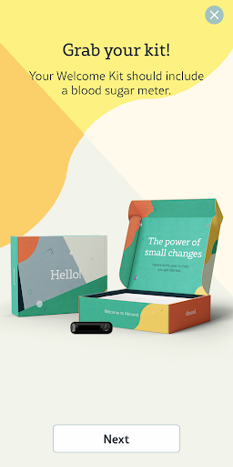
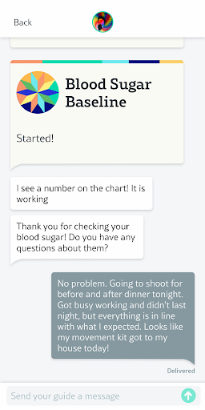
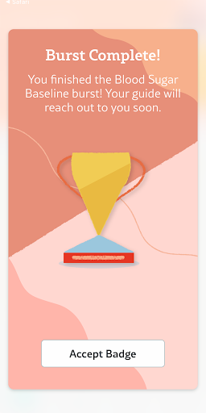
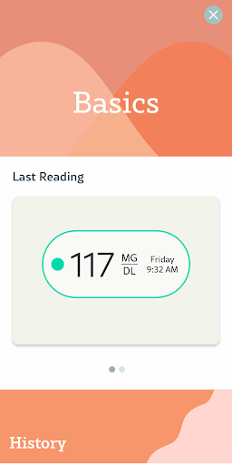
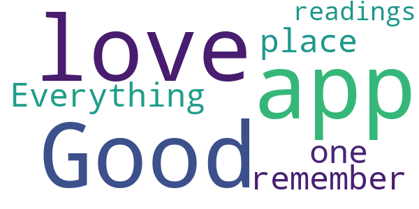
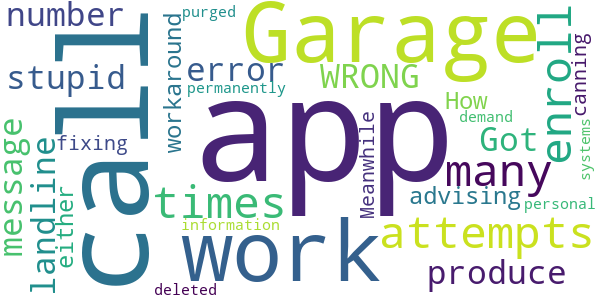

# Abound Diabetes Mgmt
App version ``1.12.0-rc.2``

Analyzed with [covid-apps-observer](http://github.com/covid-apps-observer) project, version ``0.1``

## App overview
| | |
|-------------------------|-------------------------| 
| **Name**&nbsp;&nbsp;&nbsp;&nbsp;&nbsp;&nbsp;&nbsp;&nbsp;&nbsp;&nbsp;&nbsp;&nbsp;&nbsp;&nbsp;&nbsp;&nbsp;&nbsp;&nbsp;&nbsp;&nbsp;&nbsp;&nbsp;&nbsp;&nbsp;&nbsp;&nbsp;&nbsp;&nbsp;&nbsp;&nbsp;&nbsp;&nbsp;&nbsp;&nbsp;&nbsp;&nbsp;&nbsp;&nbsp;&nbsp;&nbsp;  | Abound Diabetes Mgmt |
| **Unique identifier** | com.ascensia.abound.us |
| **Link to Google Play** | [https://play.google.com/store/apps/details?id=com.ascensia.abound.us](https://play.google.com/store/apps/details?id=com.ascensia.abound.us) |
| **Summary**  | The digital diabetes management solution from Ascensia |
| **Privacy policy** | [https://www.aboundcare.com/siteassets/abound-app-privacy-policy-for-commercial-release-rev.-2.14.19.pdf](https://www.aboundcare.com/siteassets/abound-app-privacy-policy-for-commercial-release-rev.-2.14.19.pdf) |
| **Latest version** | 1.12.0-rc.2 |
| **Last update** | 2020-09-09 16:28:06 |
| **Recent changes** | We’ve added some new articles to help you on your Abound journey.  We’ve also made a few changes to the look and feel of the app to improve your Abound experience. |
| **Installs**  | 100+ |
| **Category** | Medical |
| **First release** | Dec 16, 2019 |
| **Size**  | 19M |
| **Supported Android version**  | 5.0 and up |

### Description
> Abound is a personalized diabetes management solution designed to help people with diabetes live healthier, happier lives – one step at a time. 
 Abound is available for eligible enrolled patients only. If you are not enrolled in the Abound program, you will not be able to use the app. 
 Please register on <a href="http://www.google.com/url?q=http%3A%2F%2Fwww.aboundcare.com%2Fenroll&sa=D&sntz=1&usg=AFQjCNEvxjLY5qcfANIObQL10c2GLWHOdg">www.aboundcare.com/enroll</a> before completing your enrollment in the app.
 For eligibility requirements and enrollment information, please refer to our general FAQs at <a href="http://www.google.com/url?q=http%3A%2F%2Fwww.aboundcare.com%2Ffaqs&sa=D&sntz=1&usg=AFQjCNHe7v6rzG1zSTRSCXlxiIKZeNWA7g">www.aboundcare.com/faqs</a>.
 <b>Abound is here to help you along the way</b>
 You’ll work with a personal Guide who’ll be your advocate, providing helpful advice and feedback.
 <b>Abound helps you build healthy habits</b>
 Your Guide will learn about your goals and interests, and then set up short challenges called Bursts to help you make small changes where it matters most. 
 With an easy-to-use app, a personal Guide and an integrated, personalized approach, you can build healthy habits and achieve real results! 
 Abound is available at no cost to eligible Members. Abound is available through enrolled employers and health plans. To see if you are eligible for this program, please refer to our general FAQs at <a href="http://www.google.com/url?q=http%3A%2F%2Fwww.aboundcare.com%2Ffaqs&sa=D&sntz=1&usg=AFQjCNHe7v6rzG1zSTRSCXlxiIKZeNWA7g">www.aboundcare.com/faqs</a>. Limitations and restrictions apply. 
 Note: Screenshots are for illustration purposes. For more information about your CONTOUR® NEXT ONE meter, please refer to your CONTOUR® NEXT ONE meter User Guide.
  
 © 2020 Ascensia Diabetes Care Holdings AG. 
 All rights reserved. 
 Manufacturer 
 Ascensia Diabetes Care Holdings AG 
 Peter Merian-Strasse 90 
 4052 Basel, Switzerland 
 <a href="http://www.google.com/url?q=http%3A%2F%2Fwww.aboundcare.com&sa=D&sntz=1&usg=AFQjCNHYKv2dq4rx4fWdoxnxwdMEXS3hSg">www.aboundcare.com</a>
 Ascensia, the Ascensia Diabetes Care logo, and Contour are trademarks and/or registered trademarks of Ascensia Diabetes Care Holdings AG

### User interface
The developers of the app provide the following screenshots in the Google play store.
| | | |
|:-------------------------:|:-------------------------:|:-------------------------:|
 |   |   |   | 
 |   |  

## Development team
In the following we report the main information provided by the development team in the Google play store.

| | |
|-------------------------|-------------------------|
| **Developer**  | Ascensia Diabetes Care |
| **Website**  | [http://aboundcare.com](http://aboundcare.com) |
| **Email** | websiteinfo@ascensia.com |
| **Physical address**  | [5 Wood Hollow Rd Parsippany, New Jersey 07054 United States](https://www.google.com/maps/search/5%20Wood%20Hollow%20Rd%20Parsippany,%20New%20Jersey%2007054%20United%20States) (Google Maps) |
| **Other developed apps**  | [https://play.google.com/store/apps/developer?id=Ascensia+Diabetes+Care](https://play.google.com/store/apps/developer?id=Ascensia+Diabetes+Care) |

## Android support

| | |
|-------------------------|-------------------------|
| **Declared target Android version**  | Pie, version 9 (API level 28) |
| **Effective target Android version**  | Pie, version 9 (API level 28) |
| **Minimum supported Android version**  | Lollipop, version 5.0 (API level 21) |
| **Maximum target Android version**  | - |

The larger the difference between the minimum and maximum supported Android versions, the better. A larger difference means a wider audience. For example, old phones have a very low Android version, so a high minimum supported Android version means that the app cannot be used by users with old phones, thus leading to accessibility problems. 

## Requested permissions

In the following we report the complete list of the permissions requested by the app. 

| **Permission** | **Protection level** | **Description** | 
|-------------------------|-------------------------|-------------------------|
 **android.permission ACCESS_COARSE_LOCATION** | :warning:**Dangerous** | Allows an app to access approximate location. 
 **android.permission ACCESS_FINE_LOCATION** | :warning:**Dangerous** | Allows an app to access precise location. 
 **android.permission ACCESS_NETWORK_STATE** | Normal | Allows applications to access information about networks. 
 **android.permission BLUETOOTH** | Normal | Allows applications to connect to paired bluetooth devices. 
 **android.permission BLUETOOTH_ADMIN** | Normal | Allows applications to discover and pair bluetooth devices. 
 **android.permission CALL_PHONE** | :warning:**Dangerous** | Allows an application to initiate a phone call without going through the Dialer user interface for the user to confirm the call. 
 **android.permission CAMERA** | :warning:**Dangerous** | Required to be able to access the camera device. 
 **android.permission INTERNET** | Normal | Allows applications to open network sockets. 
 **android.permission READ_EXTERNAL_STORAGE** | :warning:**Dangerous** | Allows an application to read from external storage. 
 **android.permission REORDER_TASKS** | Normal | Allows an application to change the Z-order of tasks. 
 **android.permission WAKE_LOCK** | Normal | Allows using PowerManager WakeLocks to keep processor from sleeping or screen from dimming. 
 **android.permission WRITE_EXTERNAL_STORAGE** | :warning:**Dangerous** | Allows an application to write to external storage. 
 **com.google.android.c2dm.permission RECEIVE** | - | - 
 **com.google.android.finsky.permission BIND_GET_INSTALL_REFERRER_SERVICE** | - | - 

## Mentioned servers

| **Server** | **Registrant** | **Registrant country** | **Creation date** | 
|-------------------------|-------------------------|-------------------------|-------------------------|
 | aboundcare.com | Ascensia Diabetes Care Holdings AG | :switzerland: CH | 2018-01-25 15:49:09 |
 | google.com | Google LLC | :us: US | 1997-09-15 04:00:00 |
 | fedex.com | FedEx Corp. Services | :us: US | 1991-02-26 05:00:00 |
 | windows.net | Microsoft Corporation | :us: US | 1995-08-10 04:00:00 |
 | ascensia.com | Ascensia Diabetes Care Holdings AG | :switzerland: CH | 2001-06-28 10:42:10 |
 | wmflabs.org | Wikimedia Foundation, Inc. | :us: US | 2011-09-29 14:58:28 |
 | wikimedia.org | Wikimedia Foundation, Inc. | :us: US | 2003-03-16 08:22:47 |
 | aweber.com | AWEBER SYSTEMS, INC. | :us: US | 1998-08-05 04:00:00 |
 | asana.com | Whois Privacy Service | :us: US | 2009-01-21 19:41:33 |
 | automatic.com | SiriusXM Radio Inc. | :us: US | 1995-03-02 05:00:00 |
 | box.com | Box, Inc. | :us: US | 1999-02-17 05:00:00 |
 | digg.com | WhoisGuard, Inc. | PA | 2000-02-20 16:55:16 |
 | discordapp.com | Redacted for Privacy Purposes | :us: US | 2015-02-26 22:47:43 |
 | doktornarabote.ru | - | - | 2009-11-18 21:00:00 |
 | dropbox.com | Dropbox, Inc. | :us: US | 1995-06-28 04:00:00 |
 | etsy.com | Etsy, Inc. | :us: US | 2004-02-05 23:50:06 |
 | facebook.com | Facebook, Inc. | :us: US | 1997-03-29 05:00:00 |
 | fitbit.com | Fitbit, Inc. | :us: US | 2003-04-25 18:02:57 |
 | flickr.com | SmugMug, Inc. | :us: US | 2003-11-22 07:49:51 |
 | foursquare.com | Foursquare Labs, Inc. | :us: US | 2002-03-26 01:18:55 |
 | freelancer.com | REDACTED FOR PRIVACY | :australia: AU | 1995-08-18 04:00:00 |
 | genius.com | Genius Media Group Inc. | :us: US | 1994-08-05 04:00:00 |
 | github.com | GitHub, Inc. | :us: US | 2007-10-09 18:20:50 |
 | googleapis.com | Google LLC | :us: US | 2005-01-25 17:52:26 |
 | hh.ru | - | - | 2000-03-15 15:32:29 |
 | hiorg-server.de | - | - | - |
 | imgur.com | - | PA | 2009-01-09 20:30:53 |
 | kaixin001.com | - | :china: CN | 2007-12-17 05:44:32 |
 | linkedin.com | LinkedIn Corporation | :us: US | 2002-11-02 15:38:11 |
 | live.com | Microsoft Corporation | :us: US | 1994-12-28 05:00:00 |
 | mail.ru | - | - | 1997-09-27 14:33:26 |
 | meetup.com | Meetup, Inc. | :us: US | 1998-08-20 04:00:00 |
 | misfitwearables.com | Fossil Group, Inc. | :us: US | 2011-10-14 10:01:40 |
 | naver.com | NAVER Corp. | KR | 1997-09-12 04:00:00 |
 | ok.ru | - | - | 1998-11-03 16:40:32 |
 | pinterest.com | DNStination Inc. | :us: US | 2009-11-26 19:21:23 |
 | 500px.com | 500px Inc. | ca | 2004-07-23 22:24:10 |
 | renren.com | - | :china: CN | 1999-03-03 05:00:00 |
 | weibo.com | - | :china: CN | 1999-03-20 05:00:00 |
 | sina.com.cn | 北京新浪互联信息服务有限公司 | - | 1998-11-20 00:00:00 |
 | skyrock.com | VORTEX | :fr: FR | 1998-05-13 04:00:00 |
 | stackexchange.com | Domain Protection Services, Inc. | :us: US | 2009-06-12 13:55:30 |
 | thethingsnetwork.org | The Things Network Foundation | :netherlands: NL | 2015-07-16 14:52:57 |
 | trello.com | Trello, Inc. | :us: US | 2004-08-20 18:07:36 |
 | tumblr.com | Automattic, Inc. | :us: US | 2006-06-08 22:11:40 |
 | twitter.com | Twitter, Inc. | :us: US | 2000-01-21 16:28:17 |
 | ucoz.com | Compubyte Limited | VG | 2005-08-12 23:34:44 |
 | viadeo.com | CCM BENCHMARK GROUP | fr | 2005-12-12 13:20:46 |
 | vk.com | Privacy protection service - whoisproxy.ru | :ru: RU | 1997-06-24 04:00:00 |
 | wunderlist.com | Microsoft Corporation | :us: US | 2010-05-26 06:27:34 |
 | xing.com | - | :de: DE | 1992-08-25 04:00:00 |
 | yahoo.com | Oath Inc. | :us: US | 1995-01-18 05:00:00 |
 | microsoftonline.com | Microsoft Corporation | :us: US | 2002-07-09 19:27:26 |
 | apple.com | Apple Inc. | :us: US | 1987-02-19 05:00:00 |
 | aomedia.org | Contact Privacy Inc. Customer 1243324949 | :canada: CA | 2015-08-24 14:07:31 |
 | dashif.org | VTM Group | :us: US | 2012-04-27 13:02:46 |
 | googlesyndication.com | Google LLC | :us: US | 2003-01-21 06:17:24 |
 | app-measurement.com | Google LLC | :us: US | 2015-06-19 20:13:31 |
 | microsoft.com | Microsoft Corporation | :us: US | 1991-05-02 04:00:00 |
 | googlesource.com | Google LLC | :us: US | 2004-10-20 18:31:43 |
 | w3.org | W3C | :us: US | 1994-07-06 04:00:00 |
 | googleadservices.com | Google LLC | :us: US | 2003-06-19 16:34:53 |

## Security analysis 

Below we report the main security warnings raised by our execution of the [Androwarn](https://github.com/maaaaz/androwarn) security analysis tool.

**Telephony identifiers leakage**
> - This application reads the ISO country code equivalent of the current registered operator's MCC (Mobile Country Code) 
> - This application reads the numeric name (MCC+MNC) of current registered operator 
> - This application reads the operator name 

**Connection interfaces exfiltration**
> - This application reads details about the currently active data network 
> - This application tries to find out if the currently active data network is metered 

**Telephony services abuse**
> - This application makes phone calls 

**Suspicious connection establishment**
> - This application opens a Socket and connects it to the remote address '' on the 'N/A' port  
> - This application opens a Socket and connects it to the remote address 'Ljava/lang/StringBuilder;->toString()Ljava/lang/String;' on the 'N/A' port  
> - This application opens a Socket and connects it to the remote address 'Ljava/net/Proxy;->type()Ljava/net/Proxy$Type;' on the 'N/A' port  
> - This application opens a Socket and connects it to the remote address 'timeout' on the 'N/A' port  

**Pim data leakage**
> - This application accesses the downloads folder 

**Code execution**
> - This application loads a native library 

## User ratings and reviews

Below we provide information about how end users are reacting to the app in terms of ratings and reviews in the Google Play store.

### Ratings

The Abound Diabetes Mgmt app has been installed by more than **100** times. At this time, **6** rated the app and its average score is **4.3333335**. Below we show the distribution of the ratings across the usual star-based rating of Google Play

:star::star::star::star::star:: 5

:star::star::star::star:: 0

:star::star::star:: 0

:star::star:: 0

:star:: 1

### Reviews 

#### 5-star reviews

> Good  :date: __2020-09-24 14:32:02__

> I love the app. Everything in one place don't have to remember your readings.  :date: __2020-04-22 12:53:44__

#### 4-star reviews

No recent reviews available with 4 stars.

#### 3-star reviews

No recent reviews available with 3 stars.

#### 2-star reviews

No recent reviews available with 2 stars.

#### 1-star reviews

> Garage app that doesn't work attempts to enroll many times only produce a stupid error message that is WRONG. Got a call on landline number advising of a workaround but have to call. How about either fixing app or canning it. Meanwhile have permanently deleted app and demand that my personal information be purged from your systems!  :date: __2020-06-06 15:00:00__

