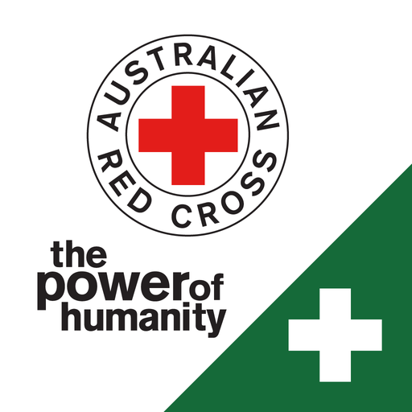
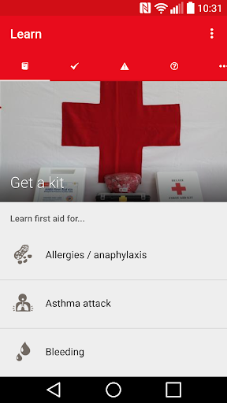
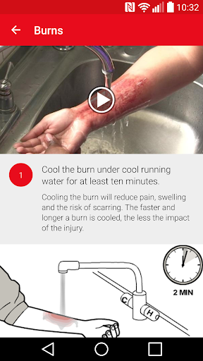
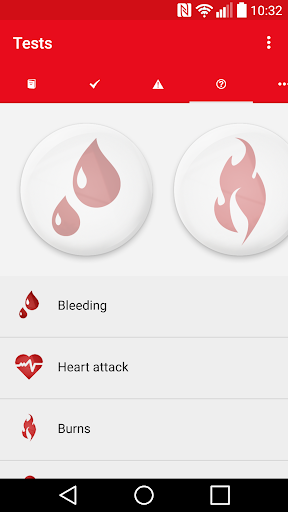
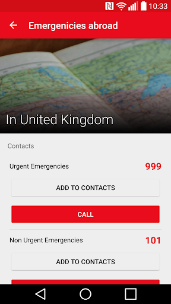
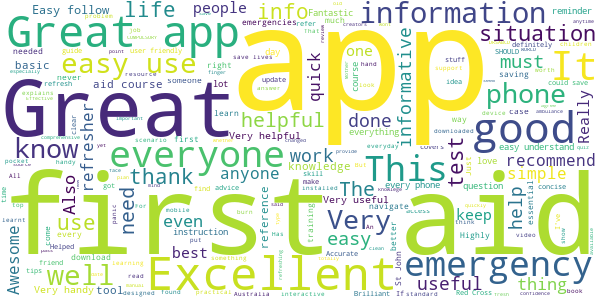
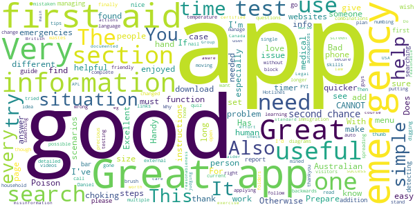
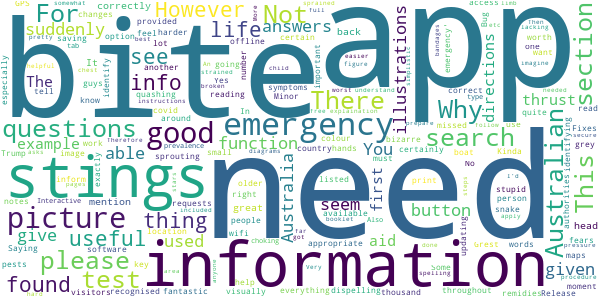
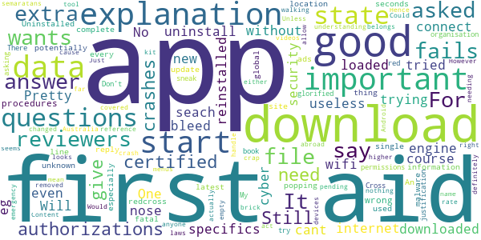

# First Aid-Australian Red Cross
App version ``3.3.0``

Analyzed with [covid-apps-observer](http://github.com/covid-apps-observer) project, version ``0.1``

## App overview
| | |
|-------------------------|-------------------------| 
| **Name**&nbsp;&nbsp;&nbsp;&nbsp;&nbsp;&nbsp;&nbsp;&nbsp;&nbsp;&nbsp;&nbsp;&nbsp;&nbsp;&nbsp;&nbsp;&nbsp;&nbsp;&nbsp;&nbsp;&nbsp;&nbsp;&nbsp;&nbsp;&nbsp;&nbsp;&nbsp;&nbsp;&nbsp;&nbsp;&nbsp;&nbsp;&nbsp;&nbsp;&nbsp;&nbsp;&nbsp;&nbsp;&nbsp;&nbsp;&nbsp;  | First Aid-Australian Red Cross |
| **Unique identifier** | com.cube.gdpc.aus |
| **Link to Google Play** | [https://play.google.com/store/apps/details?id=com.cube.gdpc.aus](https://play.google.com/store/apps/details?id=com.cube.gdpc.aus) |
| **Summary**  | First Aid at your finger tips! |
| **Privacy policy** | [http://www.redcross.org.au/privacy.aspx](http://www.redcross.org.au/privacy.aspx) |
| **Latest version** | 3.3.0 |
| **Last update** | 2020-08-17 17:41:19 |
| **Recent changes** | We&#39;ve fixed some minor issues you may have been experiencing. |
| **Installs**  | 100,000+ |
| **Category** | Medical |
| **First release** | Sep 3, 2013 |
| **Size**  | 8.7M |
| **Supported Android version**  | 5.0 and up |

### Description
> Simple. Free. It can save a life. The official Australian Red Cross First Aid app gives you instant access to the information you need to know to handle the most common first aid emergencies. Interactive and simple step-by-step advice means it’s never been easier to know first aid. 
 Developed for the Australian market as part of a global project by the International Federation of Red Cross and Red Crescent societies and Red Cross’ Global Disaster Preparedness Centre the APP features up to date CPR and First Aid guidelines as set out by the Australian Resuscitation Council (ARC).
 To ensure your app content is available at the time of an emergency, please open the app upon installation so the app can retrieve all relevant local content before the need strikes.

### User interface
The developers of the app provide the following screenshots in the Google play store.
| | | |
|:-------------------------:|:-------------------------:|:-------------------------:|
 |   |   |   | 
 |   |  

## Development team
In the following we report the main information provided by the development team in the Google play store.

| | |
|-------------------------|-------------------------|
| **Developer**  | Australian Red Cross |
| **Website**  | [http://www.redcross.org.au](http://www.redcross.org.au) |
| **Email** | contactus@redcross.org.au |
| **Physical address**  | - |
| **Other developed apps**  | [https://play.google.com/store/apps/developer?id=Australian+Red+Cross](https://play.google.com/store/apps/developer?id=Australian+Red+Cross) |

## Android support

| | |
|-------------------------|-------------------------|
| **Declared target Android version**  | Pie, version 9 (API level 28) |
| **Effective target Android version**  | Pie, version 9 (API level 28) |
| **Minimum supported Android version**  | Lollipop, version 5.0 (API level 21) |
| **Maximum target Android version**  | - |

The larger the difference between the minimum and maximum supported Android versions, the better. A larger difference means a wider audience. For example, old phones have a very low Android version, so a high minimum supported Android version means that the app cannot be used by users with old phones, thus leading to accessibility problems. 

## Requested permissions

In the following we report the complete list of the permissions requested by the app. 

| **Permission** | **Protection level** | **Description** | 
|-------------------------|-------------------------|-------------------------|
 **android.permission ACCESS_FINE_LOCATION** | :warning:**Dangerous** | Allows an app to access precise location. 
 **android.permission ACCESS_NETWORK_STATE** | Normal | Allows applications to access information about networks. 
 **android.permission INTERNET** | Normal | Allows applications to open network sockets. 
 **android.permission RECEIVE_BOOT_COMPLETED** | Normal | Allows an application to receive the Intent.ACTION_BOOT_COMPLETED that is broadcast after the system finishes booting. 
 **android.permission WAKE_LOCK** | Normal | Allows using PowerManager WakeLocks to keep processor from sleeping or screen from dimming. 
 **com.google.android.c2dm.permission RECEIVE** | - | - 
 **com.google.android.finsky.permission BIND_GET_INSTALL_REFERRER_SERVICE** | - | - 

## Mentioned servers

| **Server** | **Registrant** | **Registrant country** | **Creation date** | 
|-------------------------|-------------------------|-------------------------|-------------------------|
 | ytimg.com | Google LLC | :us: US | 2007-12-11 22:38:13 |
 | googleapis.com | Google LLC | :us: US | 2005-01-25 17:52:26 |
 | youtube.com | Google LLC | :us: US | 2005-02-15 05:13:12 |
 | cubeapis.com | 3 SIDED CUBE DESIGN LTD | :fr: FR | 2013-03-12 12:38:04 |
 | facebook.com | Facebook, Inc. | :us: US | 1997-03-29 05:00:00 |
 | google.com | Google LLC | :us: US | 1997-09-15 04:00:00 |
 | googlesyndication.com | Google LLC | :us: US | 2003-01-21 06:17:24 |
 | google-analytics.com | Google LLC | :us: US | 2005-07-18 19:24:32 |
 | app-measurement.com | Google LLC | :us: US | 2015-06-19 20:13:31 |
 | googletagmanager.com | Google LLC | :us: US | 2011-11-11 23:39:05 |
 | cube-cdn.com | Whois Privacy Service | :us: US | 2016-10-07 10:14:07 |
 | w3.org | W3C | :us: US | 1994-07-06 04:00:00 |
 | googleapis.com | Google LLC | :us: US | 2005-01-25 17:52:26 |
 | googleadservices.com | Google LLC | :us: US | 2003-06-19 16:34:53 |
 | staticflickr.com | SmugMug, Inc. | :us: US | 2006-02-04 23:06:52 |
 | crashlytics.com | Google LLC | :us: US | 2011-01-21 15:30:40 |
 | flickr.com | SmugMug, Inc. | :us: US | 2003-11-22 07:49:51 |
 | gravatar.com | Automattic, Inc. | :us: US | 2004-07-15 20:57:48 |
 | googleapis.com | Google LLC | :us: US | 2005-01-25 17:52:26 |
 | twitter.com | Twitter, Inc. | :us: US | 2000-01-21 16:28:17 |

## Security analysis 

Below we report the main security warnings raised by our execution of the [Androwarn](https://github.com/maaaaz/androwarn) security analysis tool.

**Telephony identifiers leakage**
> - This application reads the ISO country code equivalent for the SIM provider's country code 
> - This application reads the ISO country code equivalent of the current registered operator's MCC (Mobile Country Code) 
> - This application reads the constant indicating the state of the device SIM card 
> - This application reads the numeric name (MCC+MNC) of current registered operator 
> - This application reads the operator name 

**Location lookup**
> - This application reads location information from all available providers (WiFi, GPS etc.) 

**Connection interfaces exfiltration**
> - This application reads details about the currently active data network 
> - This application tries to find out if the currently active data network is metered 

**Telephony services abuse**
> - This application makes phone calls 

**Suspicious connection establishment**
> - This application opens a Socket and connects it to the remote address '' on the 'N/A' port  
> - This application opens a Socket and connects it to the remote address 'Ljava/lang/StringBuilder;->toString()Ljava/lang/String;' on the 'N/A' port  
> - This application opens a Socket and connects it to the remote address 'Ljava/net/Proxy;->type()Ljava/net/Proxy$Type;' on the 'N/A' port  
> - This application opens a Socket and connects it to the remote address 'timeout' on the 'N/A' port  

**Pim data leakage**
> - This application accesses the contacts list 

**Code execution**
> - This application loads a native library 

## User ratings and reviews

Below we provide information about how end users are reacting to the app in terms of ratings and reviews in the Google Play store.

### Ratings

The First Aid-Australian Red Cross app has been installed by more than **100000** times. At this time, **1235** rated the app and its average score is **4.487805**. Below we show the distribution of the ratings across the usual star-based rating of Google Play

:star::star::star::star::star:: 844

:star::star::star::star:: 271

:star::star::star:: 60

:star::star:: 0

:star:: 60

### Reviews 

#### 5-star reviews

> Nil  :date: __2020-10-09 18:14:32__

> Great App to have for any situation  :date: __2020-09-24 07:31:25__

> Learn something new everyday  :date: __2020-09-14 12:01:51__

> Good. Easy to follow  :date: __2020-07-30 20:10:26__

> Good to keep yourself up to date. I do agree with other reviews that a search bar would be good.  :date: __2020-07-14 03:40:02__

> Brilliant recommend this app to anyone,and especially Mother's and/or Father's ,Carers of children who have never done a first aid course.  :date: __2020-06-03 16:40:57__

> Helped burns member at work  :date: __2020-05-11 13:49:36__

> All good ,You have to be spot on to get a pass  :date: __2020-04-28 12:53:46__

> Great  :date: __2020-04-09 22:45:43__

> Very handy to have this app in your pocket.  :date: __2020-03-30 11:56:27__

#### 4-star reviews

> A nice go to app for first aid. A hand over report section would be a good addition.  :date: __2020-10-16 03:30:52__

> Great app, wish it had a search bar for quicker searching. Also please add a guide for managing / detecting temperature?  :date: __2020-05-12 05:43:28__

> Good  :date: __2020-04-22 17:06:40__

> It needs a search function (digging through menus for information wastes precious emergency time) but it's great that there's finally an app with Australian first aid information.  :date: __2020-03-02 02:05:40__

> Great work  :date: __2020-01-28 09:09:06__

> Very user friendly  :date: __2020-01-04 14:01:37__

> Good idea putting in the auto call Emergency and Poison Hotlines, moving diagrams and timer. Very useful. Could do with detailed steps though.  :date: __2019-11-12 09:46:04__

> good app. Try to add multiple language for immigration or visitors  :date: __2019-11-11 23:32:58__

> Great APP  :date: __2019-10-24 19:00:46__

> I'm sure it's just me, but I can't get the right answer to one of the Prepare quiz questions (4). I've tried all possible combinations without success.  :date: __2019-08-21 06:41:59__

#### 3-star reviews

> No info re bites or stings  :date: __2020-10-03 12:47:39__

> Grest app but with everything that is going on at the moment, i can't help but feel info on covid-19 would have been useful in dispelling fears and quashing stupid remidies like those that Trump is sprouting. Kinda missed the boat there guys.  :date: __2020-04-26 11:36:22__

> Yes, the information you've provided is fantastic & certainly is a must for all Australians, visitors too. However, have available some maps where certain pests are found around our country & please, please, please, you need a lot of appropriate pictures throughout this App. Saying, reading is one thing but to visually see, identify is another. A picture is worth a thousand words & when a person's life is suddenly in your hands, the right identifying image could be the key in saving their life.  :date: __2020-03-29 06:24:04__

> Needs a search function and information on bites and stings.  :date: __2020-03-12 01:38:43__

> Some functions don't work in the tests and some correct answers are no recognised.  :date: __2020-01-12 10:11:34__

> In 'emergency' where is snake bite? This is Australian and it doesn't seem to be there. Not an emergency?  :date: __2019-01-23 00:55:27__

> Needs to be able to be used while offline  :date: __2018-10-10 01:10:13__

> Answers to questions are in a grey colour and harder to read and print is 
quite small especially to use for older people  :date: __2018-07-08 08:50:51__

> Why is the Australian emergency number listed as 112 when it is 000 ?  :date: __2018-04-23 14:32:57__

> You need to be able to search by symptoms.  This is most important  :date: __2018-04-13 11:41:35__

#### 2-star reviews

> Like another reviewer, I am appalled that internet access is required. Yesterday I wanted to check heart attack symptoms but my internet was out of action. I called nurse on line who then called triple zero. I probably wasted 30 precious minutes trying to get the app to work  :date: __2018-09-03 07:10:43__

> Actually this is a great app, but appalled to find that I could not use it 
with no internet access as it insisted on doing an update when I was in an 
area with no coverage. A life could be lost!!!!!  :date: __2018-08-07 06:38:27__

> Very basic stuff. I thought it would be a lot more comprehensive, like an 
app version of their handbook. Good for an introductory or a reminder  :date: __2018-07-22 15:49:09__

> Needed this in a remote location... it wouldn't do anything other than want 
to connect to update. Would display nothing at all. Slightly out of date 
first aid help is better than not knowing what to do at all!! WARNING..no 
internet means No first aid advice at all!  :date: __2018-07-15 16:46:53__

> Wants far too much private information not relevant to using the app. A pity, I now recommend alternative apps.  :date: __2017-09-06 12:19:43__

> The 2016-2017 versions have rediculous permissions, why does it need access to my Identity and Media Files?  :date: __2017-05-07 03:37:59__

> No bites treatment in emergencies.  Very strange that you have to look in the 'learn' section for information on bites and stings.  :date: __2017-02-03 01:15:37__

> Couldn't find an option. NO app on Android should ever give forced notifications without an option to switch off. I can't rate higher than 2 if an app breaks this rule.  :date: __2017-01-12 11:13:22__

> App needs a place to add in you current certification and renewal dates as a reminder.  :date: __2016-11-09 08:58:39__

> In regards to the water depth one.  :date: __2016-09-16 14:03:48__

#### 1-star reviews

> Pretty useless first aid when it cant even connect to the internet  :date: __2020-06-02 03:36:52__

> No seach engine for specifics eg nose bleed. Will uninstall.  :date: __2020-01-14 07:48:06__

> just downloaded after a first aid course and without explanation it wants to download a file? first aid is important, do is cyber security! what is it trying to download?  :date: __2019-08-04 09:43:45__

> the app starts and needs new data down loaded fails to download. tried on wifi and data reinstalled.  :date: __2019-07-24 07:14:01__

> One of the first aid procedures is wrong & potentially fatal.  :date: __2019-06-22 13:53:41__

> Fails to complete a location information download. An therefore won't start.  :date: __2019-03-11 05:52:16__

> Uninstalled because ads popping up every few seconds (malware).  :date: __2019-03-01 01:56:18__

> latest update wants to download data from an unknown site. what!!!!  :date: __2019-02-27 06:28:27__

> It is good all the reviewers say but the most important thing is that there has not been a single reply from the redcross to any questions asked by reviewers especially as to why it can't be used off-line. For a global organisation it is so important to answer the questions asked but the red Cross does not answer any questions.  :date: __2018-10-10 06:52:06__

> Don't try to sneak in extra authorizations with explanation. Still no explanation why you need extras authorizations???  :date: __2017-02-12 00:13:30__

