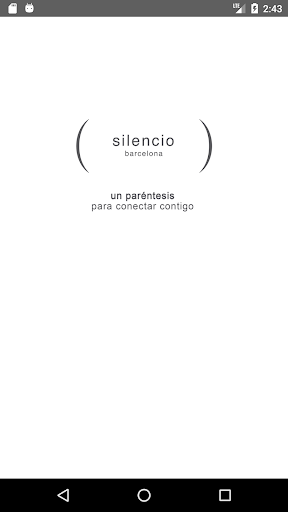
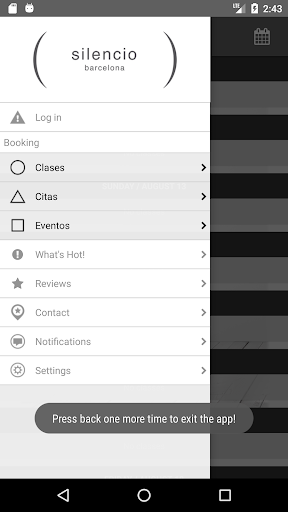
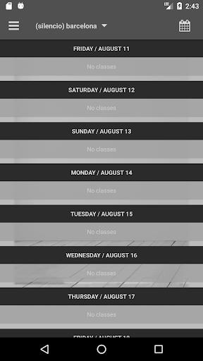

# (silencio) barcelona
App version ``4.2.9``

Analyzed with [covid-apps-observer](http://github.com/covid-apps-observer) project, version ``0.1``

## App overview
| | |
|-------------------------|-------------------------| 
| **Name**&nbsp;&nbsp;&nbsp;&nbsp;&nbsp;&nbsp;&nbsp;&nbsp;&nbsp;&nbsp;&nbsp;&nbsp;&nbsp;&nbsp;&nbsp;&nbsp;&nbsp;&nbsp;&nbsp;&nbsp;&nbsp;&nbsp;&nbsp;&nbsp;&nbsp;&nbsp;&nbsp;&nbsp;&nbsp;&nbsp;&nbsp;&nbsp;&nbsp;&nbsp;&nbsp;&nbsp;&nbsp;&nbsp;&nbsp;&nbsp;  | (silencio) barcelona |
| **Unique identifier** | com.fitnessmobileapps.silenciobarcelona |
| **Link to Google Play** | [https://play.google.com/store/apps/details?id=com.fitnessmobileapps.silenciobarcelona](https://play.google.com/store/apps/details?id=com.fitnessmobileapps.silenciobarcelona) |
| **Summary**  | Planificar y programar sus clases con nosotros desde su dispositivo móvil. |
| **Privacy policy** | [https://www.mindbodyonline.com/privacy-policy](https://www.mindbodyonline.com/privacy-policy) |
| **Latest version** | 4.2.9 |
| **Last update** | 2019-12-12 18:20:32 |
| **Recent changes** | - |
| **Installs**  | 100+ |
| **Category** | Salud y bienestar |
| **First release** | 1 may. 2017 |
| **Size**  | 7,3M |
| **Supported Android version**  | 4.1 y versiones posteriores |

### Description
> Bienvenido a (silencio) barcelona ®, que te ofrece un paréntesis en tu día a día para conectar contigo mismo bajo el método (silencio) ® de escucha, orientación y acompañamiento de expertos, para alcanzar el equilibrio físico, mental, emocional y espiritual, y ser la mejor versión de ti mismo. 
 Descargando la app, podrás planificar y gestionar tus visitas (consultar nuestra agenda de clases y eventos y pedir una cita, mirar los precios de las terapias y comprarlas online) además de recibir promociones exclusivas o encontrar información de contacto. 
 Visita también nuestra página en Facebook, Instagram y web www.silenciobarcelona.com

### User interface
The developers of the app provide the following screenshots in the Google play store.
| | | |
|:-------------------------:|:-------------------------:|:-------------------------:|
 |   |   |   | 

## Development team
In the following we report the main information provided by the development team in the Google play store.

| | |
|-------------------------|-------------------------|
| **Developer**  | MINDBODY Branded Apps |
| **Website**  | [https://www.mindbodyonline.com/branded-apps](https://www.mindbodyonline.com/branded-apps) |
| **Email** | support@mindbodyonline.com |
| **Physical address**  | [MINDBODY, Inc. 4051 Broad Street, Suite 220 San Luis Obispo, California 93401](https://www.google.com/maps/search/MINDBODY,%20Inc.%204051%20Broad%20Street,%20Suite%20220%20San%20Luis%20Obispo,%20California%2093401) (Google Maps) |
| **Other developed apps**  | [https://play.google.com/store/apps/developer?id=MINDBODY+Branded+Apps](https://play.google.com/store/apps/developer?id=MINDBODY+Branded+Apps) |

## Android support

| | |
|-------------------------|-------------------------|
| **Declared target Android version**  | Pie, version 9 (API level 28) |
| **Effective target Android version**  | Pie, version 9 (API level 28) |
| **Minimum supported Android version**  | Jelly Bean, version 4.1.x (API level 16) |
| **Maximum target Android version**  | - |

The larger the difference between the minimum and maximum supported Android versions, the better. A larger difference means a wider audience. For example, old phones have a very low Android version, so a high minimum supported Android version means that the app cannot be used by users with old phones, thus leading to accessibility problems. 

## Requested permissions

In the following we report the complete list of the permissions requested by the app. 

| **Permission** | **Protection level** | **Description** | 
|-------------------------|-------------------------|-------------------------|
 **android.permission ACCESS_FINE_LOCATION** | :warning:**Dangerous** | Allows an app to access precise location. 
 **android.permission ACCESS_NETWORK_STATE** | Normal | Allows applications to access information about networks. 
 **android.permission INTERNET** | Normal | Allows applications to open network sockets. 
 **android.permission READ_CALENDAR** | :warning:**Dangerous** | Allows an application to read the user's calendar data. 
 **android.permission RECEIVE_BOOT_COMPLETED** | Normal | Allows an application to receive the Intent.ACTION_BOOT_COMPLETED that is broadcast after the system finishes booting. 
 **android.permission VIBRATE** | Normal | Allows access to the vibrator. 
 **android.permission WAKE_LOCK** | Normal | Allows using PowerManager WakeLocks to keep processor from sleeping or screen from dimming. 
 **android.permission WRITE_CALENDAR** | :warning:**Dangerous** | Allows an application to write the user's calendar data. 
 **com.google.android.c2dm.permission RECEIVE** | - | - 

## Mentioned servers

| **Server** | **Registrant** | **Registrant country** | **Creation date** | 
|-------------------------|-------------------------|-------------------------|-------------------------|
 | google-analytics.com | Google LLC | :us: US | 2005-07-18 19:24:32 |
 | amplitude.com | Amplitude | :us: US | 1996-05-09 04:00:00 |
 | facebook.com | Facebook, Inc. | :us: US | 1997-03-29 05:00:00 |
 | mindbodyonline.com | MINDBODY, Inc. | us | 2005-02-24 21:28:06 |
 | flurry.com | Oath Inc. | :us: US | 1998-05-04 04:00:00 |
 | googlesyndication.com | Google LLC | :us: US | 2003-01-21 06:17:24 |
 | google.com | Google LLC | :us: US | 1997-09-15 04:00:00 |

## Security analysis 

Below we report the main security warnings raised by our execution of the [Androwarn](https://github.com/maaaaz/androwarn) security analysis tool.

**Telephony identifiers leakage**
> - This application reads the ISO country code equivalent of the current registered operator's MCC (Mobile Country Code) 
> - This application reads the device phone type value 
> - This application reads the numeric name (MCC+MNC) of current registered operator 
> - This application reads the operator name 
> - This application reads the unique device ID, i.e the IMEI for GSM and the MEID or ESN for CDMA phones 

**Location lookup**
> - This application reads location information from all available providers (WiFi, GPS etc.) 

**Connection interfaces exfiltration**
> - This application reads details about the currently active data network 
> - This application tries to find out if the currently active data network is metered 

**Telephony services abuse**
> - This application makes phone calls 

**Suspicious connection establishment**
> - This application opens a Socket and connects it to the remote address '' on the 'N/A' port  
> - This application opens a Socket and connects it to the remote address 'Ljava/lang/StringBuilder;->toString()Ljava/lang/String;' on the 'N/A' port  
> - This application opens a Socket and connects it to the remote address 'Ljava/net/Proxy;->type()Ljava/net/Proxy$Type;' on the 'N/A' port  
> - This application opens a Socket and connects it to the remote address 'timeout' on the 'N/A' port  

**Pim data leakage**
> - This application accesses the calendar 

**Code execution**
> - This application executes a UNIX command containing this argument: 'logcat -d' 

## User ratings and reviews

Below we provide information about how end users are reacting to the app in terms of ratings and reviews in the Google Play store.

### Ratings

The (silencio) barcelona app has been installed by more than **100** times. At this time, **-** rated the app and its average score is **0.0**. Below we show the distribution of the ratings across the usual star-based rating of Google Play

:star::star::star::star::star:: 0

:star::star::star::star:: 0

:star::star::star:: 0

:star::star:: 0

:star:: 0

### Reviews 

#### 5-star reviews

No recent reviews available with 5 stars.

#### 4-star reviews

No recent reviews available with 4 stars.

#### 3-star reviews

No recent reviews available with 3 stars.

#### 2-star reviews

No recent reviews available with 2 stars.

#### 1-star reviews

No recent reviews available with 1 stars.
