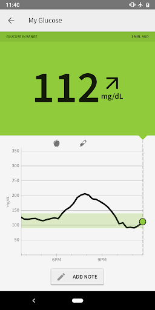
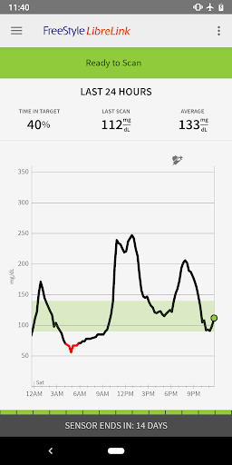
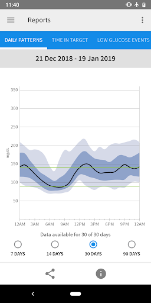
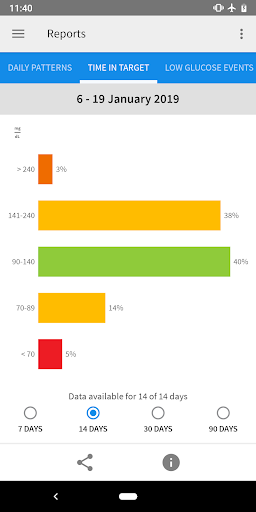
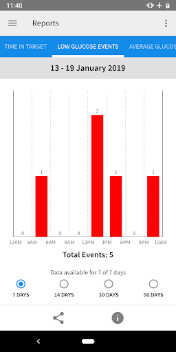
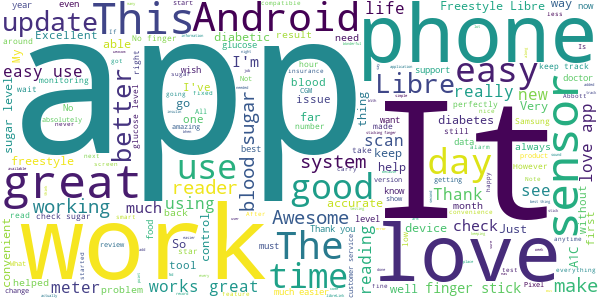
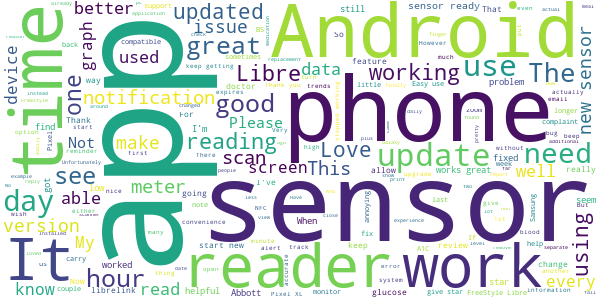
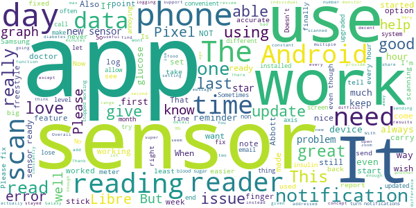
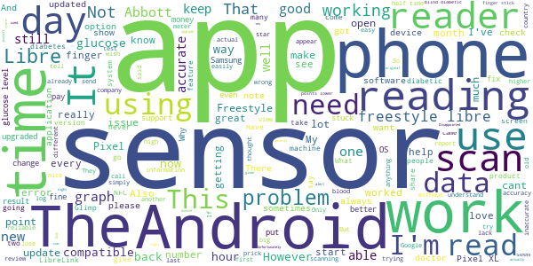
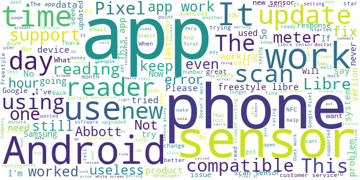

# FreeStyle LibreLink - US
App version ``2.2.2``

Analyzed with [covid-apps-observer](http://github.com/covid-apps-observer) project, version ``0.1``

## App overview
| | |
|-------------------------|-------------------------| 
| **Name**&nbsp;&nbsp;&nbsp;&nbsp;&nbsp;&nbsp;&nbsp;&nbsp;&nbsp;&nbsp;&nbsp;&nbsp;&nbsp;&nbsp;&nbsp;&nbsp;&nbsp;&nbsp;&nbsp;&nbsp;&nbsp;&nbsp;&nbsp;&nbsp;&nbsp;&nbsp;&nbsp;&nbsp;&nbsp;&nbsp;&nbsp;&nbsp;&nbsp;&nbsp;&nbsp;&nbsp;&nbsp;&nbsp;&nbsp;&nbsp;  | FreeStyle LibreLink - US |
| **Unique identifier** | com.freestylelibre.app.us |
| **Link to Google Play** | [https://play.google.com/store/apps/details?id=com.freestylelibre.app.us](https://play.google.com/store/apps/details?id=com.freestylelibre.app.us) |
| **Summary**  | Approved for use with the FreeStyle Libre Sensor |
| **Privacy policy** | [https://www.diabetescare.abbott/privacy-policy/freestyle-librelink.html](https://www.diabetescare.abbott/privacy-policy/freestyle-librelink.html) |
| **Latest version** | 2.2.2 |
| **Last update** | 2019-09-18 20:40:56 |
| **Recent changes** | Bug fixes and performance improvements. |
| **Installs**  | 100,000+ |
| **Category** | Medical |
| **First release** | Jun 6, 2019 |
| **Size**  | 25M |
| **Supported Android version**  | 4.0 and up |

### Description
> The FreeStyle LibreLink app allows you to monitor your glucose with your phone. [1] Check your glucose by holding your phone near your FreeStyle Libre Sensor. The App is compatible with both 10-day and 14-day Sensors.
 You can use the App to:
 * Check your glucose with a painless scan, instead of a routine fingerstick [1]
 * View your current glucose reading, trend arrow, and glucose history
 * Add notes to track your food, insulin use, and exercise
 * See glucose reports, including your Ambulatory Glucose Profile
 * Connect to healthcare professionals with LibreView [2]
 SMARTPHONE COMPATIBILITY
 Compatibility may vary between phones and operating systems. Learn more about compatible phones at http://FreeStyleLibre.us.
 USING YOUR APP AND FREESTYLE LIBRE READER WITH THE SAME SENSOR
 If you would like to use both the FreeStyle Libre Reader and the App with the same Sensor, you need to start the Sensor with the Reader first and then scan with your phone. Note that FreeStyle LibreLink and Readers do not share data with each other. For complete information on a device, scan your Sensor every 8 hours with that device; otherwise, your reports will not include all your data.
 APP INFORMATION
 FreeStyle LibreLink is intended for measuring glucose levels in people with diabetes when used with a FreeStyle Libre Sensor. For more information on how to use FreeStyle LibreLink, refer to the User’s Manual, which can be accessed through the App.
 Learn more about FreeStyle LibreLink at http://FreeStyleLibre.us.
 [1] If you are using the FreeStyle LibreLink app, you must also have access to a blood glucose monitoring system as the App does not provide one. Fingersticks are required for treatment decisions when you see the Check Blood Glucose symbol, when symptoms do not match system readings, when you suspect readings may be inaccurate, or when you experience symptoms that may be due to high or low blood glucose.
 [2] Use of the FreeStyle LibreLink app requires registration with the LibreView system, which is provided by Abbott and Newyu, Inc.
 FreeStyle, Libre, and related brand marks are trademarks of Abbott Diabetes Care Inc. in various jurisdictions. For additional legal notices and terms of use, go to http://FreeStyleLibre.us.
 Before using the App, review product labeling and the interactive tutorial at https://freestylelibre.us/support/overview.html#app

### User interface
The developers of the app provide the following screenshots in the Google play store.
| | | |
|:-------------------------:|:-------------------------:|:-------------------------:|
 |   |   |   | 
 |   |  

## Development team
In the following we report the main information provided by the development team in the Google play store.

| | |
|-------------------------|-------------------------|
| **Developer**  | Abbott Diabetes Care Inc. |
| **Website**  | [https://www.FreeStyleLibre.us](https://www.FreeStyleLibre.us) |
| **Email** | support@abbottdiabetescare.com |
| **Physical address**  | - |
| **Other developed apps**  | [https://play.google.com/store/apps/developer?id=Abbott+Diabetes+Care+Inc.](https://play.google.com/store/apps/developer?id=Abbott+Diabetes+Care+Inc.) |

## Android support

| | |
|-------------------------|-------------------------|
| **Declared target Android version**  | Pie, version 9 (API level 28) |
| **Effective target Android version**  | Pie, version 9 (API level 28) |
| **Minimum supported Android version**  | Ice Cream Sandwich, version 4.0.1 - 4.0.2 (API level 14) |
| **Maximum target Android version**  | - |

The larger the difference between the minimum and maximum supported Android versions, the better. A larger difference means a wider audience. For example, old phones have a very low Android version, so a high minimum supported Android version means that the app cannot be used by users with old phones, thus leading to accessibility problems. 

## Requested permissions

In the following we report the complete list of the permissions requested by the app. 

| **Permission** | **Protection level** | **Description** | 
|-------------------------|-------------------------|-------------------------|
 **android.permission ACCESS_NETWORK_STATE** | Normal | Allows applications to access information about networks. 
 **android.permission INTERNET** | Normal | Allows applications to open network sockets. 
 **android.permission NFC** | Normal | Allows applications to perform I/O operations over NFC. 
 **android.permission RECEIVE_BOOT_COMPLETED** | Normal | Allows an application to receive the Intent.ACTION_BOOT_COMPLETED that is broadcast after the system finishes booting. 
 **android.permission VIBRATE** | Normal | Allows access to the vibrator. 
 **android.permission WAKE_LOCK** | Normal | Allows using PowerManager WakeLocks to keep processor from sleeping or screen from dimming. 
 **com.android.vending CHECK_LICENSE** | - | - 
 **com.freestylelibre.app.us.permission C2D_MESSAGE** | - | - 
 **com.google.android.c2dm.permission RECEIVE** | - | - 
 **com.google.android.finsky.permission BIND_GET_INSTALL_REFERRER_SERVICE** | - | - 

## Mentioned servers

| **Server** | **Registrant** | **Registrant country** | **Creation date** | 
|-------------------------|-------------------------|-------------------------|-------------------------|
 | xmlpull.org | WhoisGuard, Inc. | PA | 2001-11-26 20:33:08 |
 | googlesyndication.com | Google LLC | :us: US | 2003-01-21 06:17:24 |
 | google.com | Google LLC | :us: US | 1997-09-15 04:00:00 |
 | app-measurement.com | Google LLC | :us: US | 2015-06-19 20:13:31 |
 | googleapis.com | Google LLC | :us: US | 2005-01-25 17:52:26 |
 | googleapis.com | Google LLC | :us: US | 2005-01-25 17:52:26 |
 | freestyleserver.com | Abbott Laboratories | :us: US | 2013-02-05 20:33:53 |
 | apache.org | The Apache Software Foundation | :us: US | 1995-04-11 04:00:00 |

## Security analysis 

Below we report the main security warnings raised by our execution of the [Androwarn](https://github.com/maaaaz/androwarn) security analysis tool.

**Connection interfaces exfiltration**
> - This application reads details about the currently active data network 
> - This application tries to find out if the currently active data network is metered 

**Suspicious connection establishment**
> - This application opens a Socket and connects it to the remote address '' on the 'N/A' port  
> - This application opens a Socket and connects it to the remote address 'Ljava/lang/StringBuilder;->toString()Ljava/lang/String;' on the 'N/A' port  
> - This application opens a Socket and connects it to the remote address 'Ljava/net/Proxy;->type()Ljava/net/Proxy$Type;' on the 'N/A' port  
> - This application opens a Socket and connects it to the remote address 'timeout' on the 'N/A' port  

**Code execution**
> - This application loads a native library: 'DataProcessing' 
> - This application loads a native library: 'MathRuntimeChecks' 
> - This application loads a native library: 'SecureKeyBoxJava' 
> - This application executes a UNIX command 

## User ratings and reviews

Below we provide information about how end users are reacting to the app in terms of ratings and reviews in the Google Play store.

### Ratings

The FreeStyle LibreLink - US app has been installed by more than **100000** times. At this time, **1855** rated the app and its average score is **3.1550803**. Below we show the distribution of the ratings across the usual star-based rating of Google Play

:star::star::star::star::star:: 735

:star::star::star::star:: 248

:star::star::star:: 79

:star::star:: 158

:star:: 635

### Reviews 

#### 5-star reviews

> The app has been great, question though, my doctor has now prescribed freestyle libre 2, will this app still work with the new system?  :date: __2020-10-26 17:58:10__

> Great app, with this there is no need for the device. All of my data is visible to my doc and we can go over the results on the phone. Super easy and works great.  :date: __2020-10-25 07:38:27__

> Easy to do  :date: __2020-10-25 04:06:00__

> Great and accurate!! My endocrinologist has access to the data which helps in controlling my sugars as well as less doctors visits. Helping alot to get my Diabetes under control!!! The only issue i have is that i have the Librelink 2 now and it does not work with phone. Can you please update for use. Thanks!!!  :date: __2020-10-24 07:10:01__

> Good  :date: __2020-10-24 06:26:31__

> Works great! Plus, they added regular notifications as to when your sensor will end and they fixed the scan sound glitch and now you can scan silently! Adjusted my review with these new fixes!  :date: __2020-10-23 22:09:00__

> Not as accurate as I would like  :date: __2020-10-23 14:50:42__

> Lovve  :date: __2020-10-22 23:13:47__

> I love being able to scan and not have to stick my fingers all the time. It is about 10 numbers off when I compare it to a finger stick or my lab work. It has been consistent so not enough for me to worry about.  :date: __2020-10-22 01:54:52__

> When is libreLink 2, app coming out?  :date: __2020-10-20 15:36:30__

#### 4-star reviews

> Does this app work with the FreeStyle Libre 2, on a Samsung Galaxy S10?  :date: __2020-10-23 17:41:32__

> When will the Lifestyle Libre 2 updated app be out? I am dying to upgrade to Libre 2.  :date: __2020-10-16 20:58:18__

> Love this little guy when it was the 1.0 version. Now the new 2 version gives me constant monitoring and alarms and reminders. Would have gave 5 stars but no working app yet! Keep up the great work and get us that app. Thanks Paul  :date: __2020-10-15 22:45:38__

> 4.5 stars, actually. I went from an A1c of 7.3 to 5.6 in 90 days of using the sensor in combination with my Samsung Note 10+. Works like a charm. Easy and fast. Lots of logbook variables to track meals, carbs, trends, averages, etc. I'm sold! Libra Freestyle. Not as accurate as Dexcim G6 for low bs and high bs, per objective reviewers, but very cost effective. Knowing my BS at anytime helps me to dose more efficiently then doing based on a few random fingersticks several times a day.  :date: __2020-10-15 06:01:11__

> When will there be an app for the Libre2. I was told it was already compatible with phones by the doctor. Once I got it and downloaded the app it wasn't. I little disappointed about that otherwise good product. When can we expect the Libre 2 app to be ready?  :date: __2020-10-12 20:50:55__

> Good app but it would be nice to zoom in on the screen display.  :date: __2020-10-09 03:22:59__

> I like the app but I don't need it to tell me every hour the sensor needs to be change the day before. I have to turn off the notification to shut it up and turn it back on after I change it  :date: __2020-10-07 00:20:34__

> When will the libre 2 app become available in the US  :date: __2020-09-29 07:04:56__

> Sometimes it doesn't read the first couple times you put it to your arm  :date: __2020-09-28 02:00:24__

> ...Update! Finally got my phone to read the sensor. It took some doing but persistence paid off. Now if we could only get the sensors from our local Walgreens that would be great... Just got my Freestyle Libre going with the Libre reader, works great. So I downloaded the Android app, using an nfc abled android 9 phone (moto x4). The app opens and I can see all the screens, but know where does it give me a scan screen. And no matter what, it will not scan my sensor. Help!  :date: __2020-09-27 06:07:34__

#### 3-star reviews

> I would love to give this a higher rating but I get so annoyed with the constant notifications. There should be a way to turn off the notifications or at least reduce the number of notifications.  :date: __2020-10-25 21:23:48__

> I love the phone app. The sensors need a refit. Mine only occasionally stayed on 14 days. The norm was ten and I have had at least four of the last shipment died upon placing them on my arm! Oh, and it usually reads 100 plus or minus my hand held meter. Now that I think about it, I'd take away one of my stars, if it would let me!  :date: __2020-10-21 03:15:45__

> Need freestyle 2 app When is it coming out  :date: __2020-10-16 04:32:36__

> Its a decent baseline, however the closed system and lack of options for export make it nice to see recent data but not long term individual analysis. If I could export the data to CSV or if they would open the doors a bit and interface with other apps that do like I would give it 5 stars. I would love to see everyday laid on top of each other WITH zoom capability.  :date: __2020-10-09 15:39:44__

> The original app was good because even if the reader canceled out the sensor because it didn't like it's readings, the phone app would still continue to take readings and give you those results and they were still accurate! Now they both cancel out the sensors even when the sensors don't need to be canceled out, like having multiple low readings in a row will cancel out a sensor even though they're accurate valid readings!  :date: __2020-10-09 15:24:38__

> Make this usable with the Libre 2.  :date: __2020-09-24 10:58:39__

> I've had someone who could experience but some of the other things I'm having trouble with the Libre sensor is that won't read all the time from the phone and you can't be too close and also I can't find the right spot to read sensor and if anybody else knows a good way it would help and it would also help improve these things  :date: __2020-09-14 09:33:00__

> Doesn't work with the Libre 2 sensors for some reason, works great with the 14 day and 10 day sensors  :date: __2020-09-12 05:34:17__

> OK but it is what you have to use for Freestyle sensors. It doesn't always scan reliably, Will not let you scan a prior sensor (typically you lose data from the last sensor when it runs out of time). I wish the sensors themselves retained more like 10 hours of data so you can not lose data overnight.  :date: __2020-09-12 05:31:03__

> When will you roll out the update to this app for the Libre2 sensor??  :date: __2020-09-11 03:45:08__

#### 2-star reviews

> It's not working not even on the warm up time it tells me it's not compatible I don't get it I will change my review of it works  :date: __2020-10-25 04:23:03__

> I've had 4 sensors fail since July. Pharmacy said to call manufacturer. Yes, because that's convenient.  :date: __2020-10-24 04:17:32__

> Freestyle libre was a great app! The Freestyle libre 2 is no different but cant use the app and the machine itself is truly lacking! Just put it on and cant put what insulin I take into the machine! And after 2 hours of having it on its down for 10hours but the machine beeps every 20 mins... the machine its self is lacking  :date: __2020-10-23 18:44:44__

> I was given the Libre 2 by my doctor to test out as I'm interested in the wireless and alarm features - However, the app says the sensor is "incompatible", even though I'm directed to the app by the manual given with the sensor and reader! Not a good start... The app has worked well for me (with the original Libre 1) since after the Android 10 debacle... But to not work at all with the new system - I'm really disappointed!  :date: __2020-10-20 03:36:18__

> I would love to give it 5 stars, but unfortunately your call center is in India or Philippines....accents very hard to understand. Secondly the freestyle libre 2 app is not out yet and it was a hassle & inconvenience to pull the sensor off and get a refund from pharmacy which I did not get by the way.I went back to the original and as usual I get several error messages in spite of doing everything by the book and having a state of the art smartphone.  :date: __2020-10-19 18:49:34__

> Can't change the country, so I can't get the right units. Why lock it to country? Just let me pick what I need.  :date: __2020-10-19 15:52:31__

> App is not working for Libre2 sensor on Android 11 (Pixel 3). It is saying "this sensor cannot be used with this version of freestyle librelink".  :date: __2020-10-19 13:11:15__

> Love the system. But my glucose levels are always 25 higher than the sensors. Even counting the 10 to 15 minute delay. Never actually acurate.  :date: __2020-10-10 00:29:50__

> "Incompatible sensor" error now that I'm using the Libre 2. Updated the system but not the app  :date: __2020-10-09 00:14:01__

> There needs to be an option to have multiple users on the account. Only one person can be logged in at a time. Please fix this.  :date: __2020-10-03 18:42:03__

#### 1-star reviews

> Ok Abbott- how about updating the app BEFORE introducing Libre 2 to market- geezer how stupid is this!!!!!!!  :date: __2020-10-25 17:31:42__

> Someone keeps deleting my comment, the app does not work with some 9.0 versions.  :date: __2020-10-25 16:52:46__

> NEW PROBLEM Oct 2020. Two months after Android 11 release, Abbott still declines to ANSWER if this works with Android 11. All they do is reference useless doc that says designed to work with Android 5 and higher. OLD PROBLEM Please make app aware of phone orientation and allow the 24 hour graph to be shown when the phone is in landscape orientation. Looking at 24 hours of data in the portrait orientation is useless. WHY CAN EVERY OTHER APP EXCEPT YOU DO THIS?!  :date: __2020-10-24 02:00:54__

> My son is a new diabetic and because his phone is not compatible with some kind of software he cannot use his phone to scan the sensor. Is there any generic sensor or another comprable app that we can download that might work for his phone? Please help. I will change my rating when I hear a response.  :date: __2020-10-24 00:55:26__

> Why doesn't this work with my smartphone? I have a Samsung galaxy S9. This should have no problem working. What is going on? I got this one because it is supposed to work with my phone. What a waste of money! It tells me this sensor can not be used with this version of LibreLink. Where is the correct version to use? There is nothing else in the Google play store.  :date: __2020-10-22 07:34:42__

> This app can not be used with the freestyle libre 2. Is there going to be an app for the libre 2???  :date: __2020-10-22 02:19:16__

> I had Libre 1. Was great, just didnt have alarms. Noe I have Libre 2 ...its ok,but I have an android Samsung galaxy note 8 and I cant use the app. It's for Apple only :( I would like the app for my phone. I hate having to carry the monitor everywhere I go.  :date: __2020-10-20 02:37:04__

> Still so unhappy 😡 with this app that I have brought it from a 2 to a 1 rating. I have uninstalled and reinstalled it from my phone (Samsung S9+) numerous times and it consistently gives error messages. Customer Service is absolutely no help at all. The Libre itself is a wonderful tool and my Endocrinologist is so pleased with my glucose levels that she downloads from the machine.  :date: __2020-10-19 00:57:11__

> I have a Samsung 9 with android 10. This app does not work for whatever reason. Please fix this  :date: __2020-10-16 23:52:43__

> Not compatible with 14 day sensors  :date: __2020-10-16 04:22:54__

