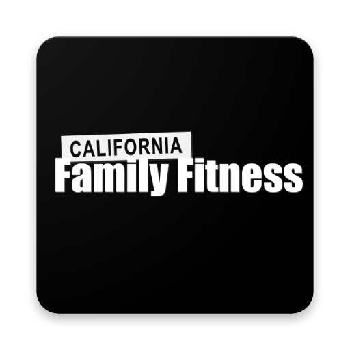
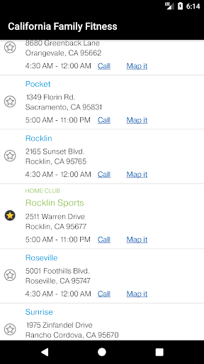
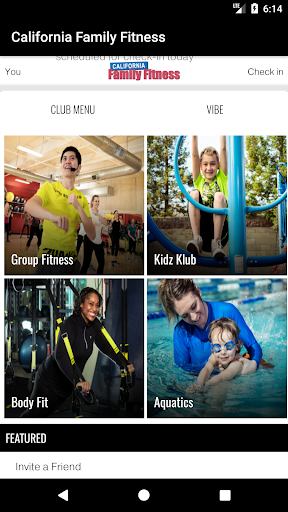
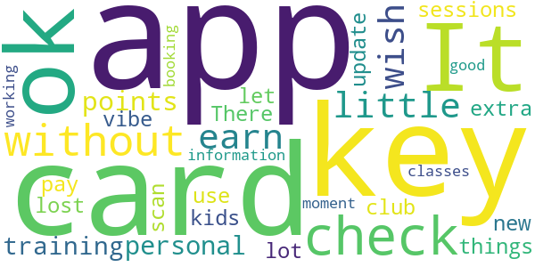
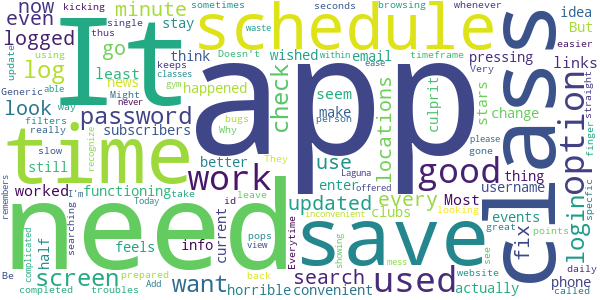
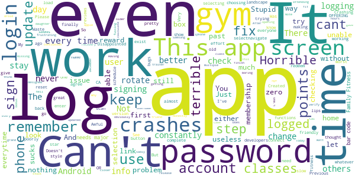

# California Family Fitness
App version ``4.8.3``

Analyzed with [covid-apps-observer](http://github.com/covid-apps-observer) project, version ``0.1``

## App overview
| | |
|-------------------------|-------------------------| 
| **Name**&nbsp;&nbsp;&nbsp;&nbsp;&nbsp;&nbsp;&nbsp;&nbsp;&nbsp;&nbsp;&nbsp;&nbsp;&nbsp;&nbsp;&nbsp;&nbsp;&nbsp;&nbsp;&nbsp;&nbsp;&nbsp;&nbsp;&nbsp;&nbsp;&nbsp;&nbsp;&nbsp;&nbsp;&nbsp;&nbsp;&nbsp;&nbsp;&nbsp;&nbsp;&nbsp;&nbsp;&nbsp;&nbsp;&nbsp;&nbsp;  | California Family Fitness |
| **Unique identifier** | com.motionvibe.calfit |
| **Link to Google Play** | [https://play.google.com/store/apps/details?id=com.motionvibe.calfit](https://play.google.com/store/apps/details?id=com.motionvibe.calfit) |
| **Summary**  | Welcome to the California Family Fitness Mobile App! |
| **Privacy policy** | [https://motionvibe.com/(S(tznqxxga4e1gqihdoahy3ybl))/PrivacyPolicy.aspx](https://motionvibe.com/(S(tznqxxga4e1gqihdoahy3ybl))/PrivacyPolicy.aspx) |
| **Latest version** | 4.8.3 |
| **Last update** | 2020-07-01 10:36:22 |
| **Recent changes** | Updated club locations page Bug fixes |
| **Installs**  | 10,000+ |
| **Category** | Health & Fitness |
| **First release** | Aug 17, 2017 |
| **Size**  | 4.9M |
| **Supported Android version**  | 6.0 and up |

### Description
> Welcome to the CalFit App! What differentiates California Family Fitness from all those other health clubs?
 Sure, we've been around for 20 plus years, and we've won plenty of awards, including Best of Sacramento from Sacramento News & Review and a spot on KCRA Channel 3's A List. But awards don't greet you at the door, maintain world-class amenities, run stellar programs and classes, or ensure your kids have a blast while you work out.
 People do those things, starting with our front desk staff, who will soon know you and your family by name, and the unsung heroes who make sure all the machines are in tip-top shape and our locker rooms and lounges are beautiful, clean, and comfortable. Then there are the Kidz Klub staff members who will quickly become your kids' best pals - don't be surprised if your children want to invite them to upcoming birthday parties.
 And let's not forget our Certified Personal Trainers and aquatic team members who will customize your workout and help you perfect your swim stroke. They'll also craft a nutritional program that meets your individual needs; you won't find any cookie-cutter plans here.
 Whether you want to work out individually with one of our Certified Personal Trainers or join one of our many programs and classes, we'll make sure you have a blast while getting in shape. Want to dance like a fool in a Zumba class? Want to spin your wheels in a Cycle or X-Bike class? Want to get ripped in Ripped or kick some booty in Cardio Kick Boxing? Want to perfect your swimming stroke? We'll help you do all that and more.
 So what's the CalFit Difference? Anyone can win awards - it takes something extra special to provide an exhilarating experience for you and your family. But don't take it from us: stop by and see for yourself. We'd love to show you around.
 - Club Card
 - Class Schedules
 - Club Alerts
 - Social Media
 - Bring a Friend
 - Amenities
 - Trial Pass
 - CalFit Rewards
 - My Timeline
 - Check-in
 - Vibe With Pros
 - What's New
 - Kidz Club

### User interface
The developers of the app provide the following screenshots in the Google play store.
| | | |
|:-------------------------:|:-------------------------:|:-------------------------:|
 |   |   |   | 

## Development team
In the following we report the main information provided by the development team in the Google play store.

| | |
|-------------------------|-------------------------|
| **Developer**  | MotionVibe Innovations |
| **Website**  | - |
| **Email** | dev@motionvibe.com |
| **Physical address**  | - |
| **Other developed apps**  | [https://play.google.com/store/apps/developer?id=MotionVibe+Innovations](https://play.google.com/store/apps/developer?id=MotionVibe+Innovations) |

## Android support

| | |
|-------------------------|-------------------------|
| **Declared target Android version**  | Nougat, version 7.1 (API level 25) |
| **Effective target Android version**  | Nougat, version 7.1 (API level 25) |
| **Minimum supported Android version**  | Jelly Bean, version 4.1.x (API level 16) |
| **Maximum target Android version**  | - |

The larger the difference between the minimum and maximum supported Android versions, the better. A larger difference means a wider audience. For example, old phones have a very low Android version, so a high minimum supported Android version means that the app cannot be used by users with old phones, thus leading to accessibility problems. 

## Requested permissions

In the following we report the complete list of the permissions requested by the app. 

| **Permission** | **Protection level** | **Description** | 
|-------------------------|-------------------------|-------------------------|
 **android.permission INTERNET** | Normal | Allows applications to open network sockets. 

## Mentioned servers

| **Server** | **Registrant** | **Registrant country** | **Creation date** | 
|-------------------------|-------------------------|-------------------------|-------------------------|
-

## Security analysis 

Below we report the main security warnings raised by our execution of the [Androwarn](https://github.com/maaaaz/androwarn) security analysis tool.

-

## User ratings and reviews

Below we provide information about how end users are reacting to the app in terms of ratings and reviews in the Google Play store.

### Ratings

The California Family Fitness app has been installed by more than **10000** times. At this time, **111** rated the app and its average score is **1.6**. Below we show the distribution of the ratings across the usual star-based rating of Google Play

:star::star::star::star::star:: 9

:star::star::star::star:: 1

:star::star::star:: 6

:star::star:: 14

:star:: 81

### Reviews 

#### 5-star reviews

> A lot of bad reviews made me think about this app. However, it works just fine for me. This is way I gave 5 stars. You never know until you try.  :date: __2019-02-16 07:33:19__

> Cool app but doesn't stay logged in.  :date: __2018-11-27 23:19:53__

> Eh  :date: __2017-09-03 00:05:00__

#### 4-star reviews

No recent reviews available with 4 stars.

#### 3-star reviews

> It's ok. I like that I can check in without the little key card. I wish you could earn more points for personal training sessions, since we do pay extra for that. There are a lot of things I don't use the app for (kids club, vibe)  :date: __2018-10-01 04:26:52__

> I lost my keys and had to get a new scan card but the app will not let me update this information.  :date: __2018-09-09 19:32:40__

> App is good for booking classes but it's not working at the moment!  :date: __2018-02-07 15:57:13__

#### 2-star reviews

> Looks like a good app if only it worked. Most links don't work. 2 stars since at least the class schedules seem to be functioning. Needs a search option  :date: __2019-06-13 02:23:22__

> what happened to this app, used to be better. why change a good thing. the app is horrible now.  :date: __2019-06-09 18:57:22__

> I have been pressing "Save my password" on the app login screen. But every time I use the app I still need to enter my email and password. I don't think my phone is the culprit. I wished that your app could actually save login info. It would make it very convenient to your subscribers.  :date: __2019-03-06 20:58:36__

> the app needs to be updated so it can save our username and password and stay updated with current clubs news and events. it's a good idea app but just feels it was half completed.  :date: __2019-02-07 17:04:38__

> needs more searching options. i want to look for a specfic class and its not an option, id also like to search for a timeframe at all locations. i even called a few locations and they we having troubles... needs more filters  :date: __2019-01-02 18:58:54__

> Generic and slow.  :date: __2018-11-08 05:29:53__

> App keeps kicking me back to login screen after 5 seconds.  :date: __2018-10-12 08:45:50__

> Be prepared to log in every single time and sometimes get logged out when you are browsing. Might be easier to go to the website if you're looking for class schedules!  :date: __2018-03-06 05:35:13__

> They really need to fix the bugs on thus app. It logs you out, the minute you take your finger off of the screen. It also does not update the check in points for each person that checks in using the app. Needs some work and the app could be great!  :date: __2018-01-30 00:32:46__

> Doesn't work most of the time.  :date: __2018-01-11 17:56:43__

#### 1-star reviews

> After fussing for hours trying to get it to work at all, and missing out on the bonus points for attending classes at the Watt grand opening, I sadly came to the conclusion that it just won't work on my older Android Samsung Note 3.  :date: __2020-10-26 03:19:19__

> Today is the first day I can finally go to a class but I am unable to login with my droid phone. Very frustrating.  :date: __2020-06-30 13:45:50__

> 100% useless.  :date: __2020-06-29 02:29:34__

> Can't get in-Android. I need to be able to check in for fitness classes but the app won't even let me get into the app. There is no where for a user name or password recovery.  :date: __2020-06-27 19:53:36__

> Having the same issue as others. Crashing at home gym selection.  :date: __2020-02-07 16:11:49__

> This app sucks!... Does not update or calculate ... boring as hell. And pretty useless! C'mon Cal fit. You can do better than this!  :date: __2020-01-18 22:10:24__

> This app was obviously designed for apple not android. My daughter and friend have no problems with this app on Iphone but I cant even get the app past step 2 on android. Honestly in this day and age, why cant the developers fix this app?  :date: __2020-01-15 23:20:34__

> I don't even know what the app is like because it crashes every time I try to sign up. So much for checking in and getting points or signing up for classes... the app crashes every time I try to select my home gym .  :date: __2020-01-06 19:35:43__

> Waste of time! The app was updated December 11, 2019 and still doesn't work. I think it's stuck in the 80's. Why release an app that's not closer to 100% complete.  :date: __2019-12-27 16:08:03__

> Just crashes, doesn't work  :date: __2019-12-26 18:48:48__

